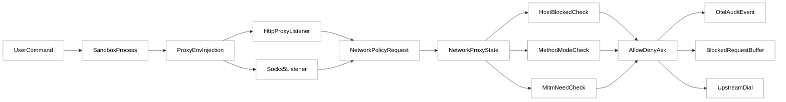
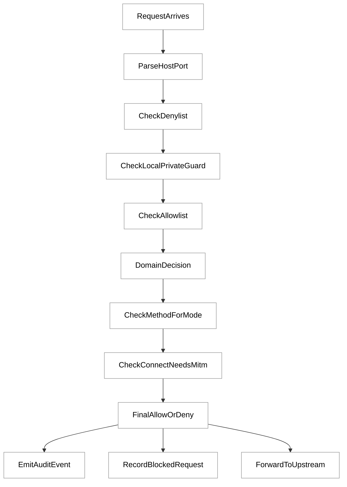
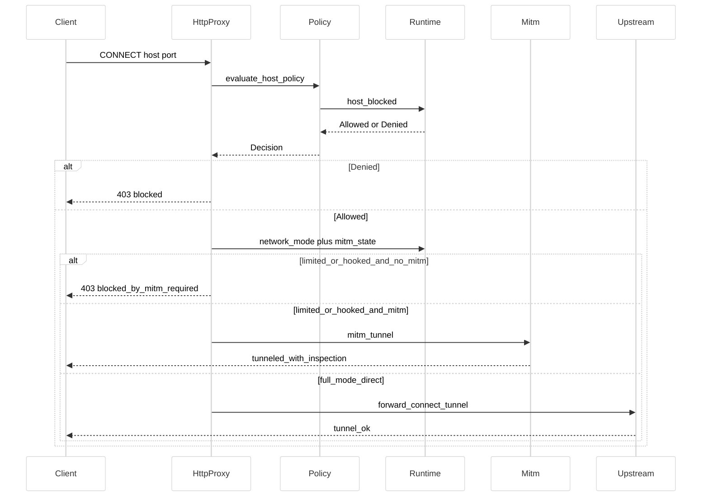
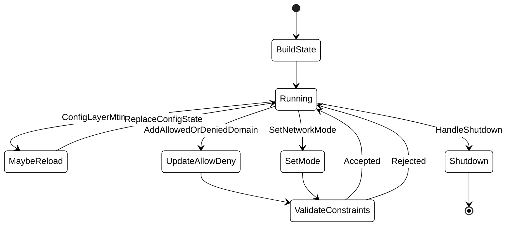
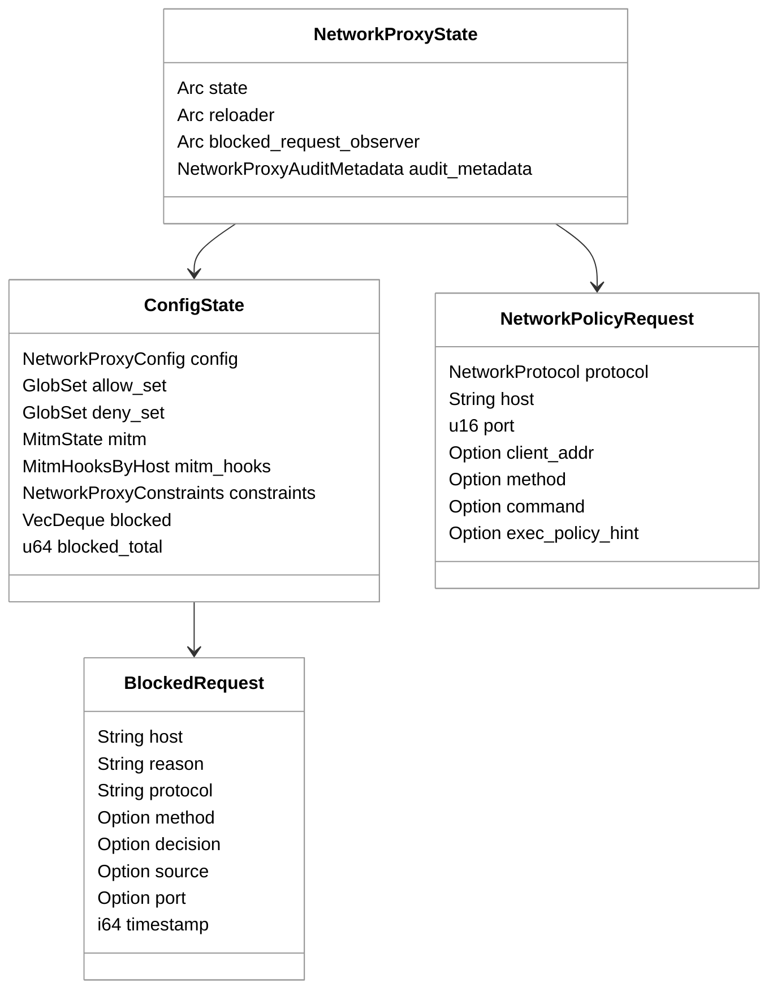

# 第 15 章：网络代理与策略

## 引言

在 Codex 的安全架构里，`network-proxy` 不是“可选代理插件”，而是把“沙箱内命令的网络能力”从二元开关（能上网/不能上网）升级为策略系统（去哪里、用什么协议、在什么模式下能不能过）的核心执行面。  
如果没有这一层，`workspace-write + network_access=true` 只能得到“全部直连出网”；有了这一层，Codex 才能把域名白名单、deny 优先、私网保护、LIMITED 模式方法限制、MITM 与审计打通成统一控制链。

本章聚焦你指定的 5 条核心源码路径：

- `codex-rs/network-proxy/src/runtime.rs`
- `codex-rs/network-proxy/src/http_proxy.rs`
- `codex-rs/network-proxy/src/proxy.rs`
- `codex-rs/network-proxy/src/network_policy.rs`
- `codex-rs/core/src/network_proxy_loader.rs`

按本章复核口径（2026-05-26，本地源码基线）：

- `codex-rs` 下 `Cargo.toml` 文件数：**120**
- workspace member 数：**113**
- `network-proxy/src/*.rs`：**17 文件 / 10898 行**
- 本章核心 5 文件总计：**5857 行**
  - `runtime.rs`：1963 行
  - `http_proxy.rs`：1414 行
  - `proxy.rs`：1187 行
  - `network_policy.rs`：898 行
  - `network_proxy_loader.rs`：395 行
- 关键函数体量（脚本统计）
  - `http_plain_proxy()`：325 行
  - `http_connect_accept()`：174 行
  - `apply_proxy_env_overrides()`：86 行
  - `host_blocked()`：76 行
  - `evaluate_host_policy()`：71 行（按 `289-359`）
- 测试注解计数（`#[tokio::test]` / `#[test]`）：
  - `runtime.rs` 61
  - `http_proxy.rs` 13
  - `proxy.rs` 15
  - `network_policy.rs` 7

这些数字说明：网络代理在 Codex 中已经是“中型子系统”，而不是一组临时 if-else。

---

## 全网调研补充（近 12 个月）

### 1）检索范围与高权重来源

本章 Step 0 按你给的关键词执行了全网检索：

- `Codex network proxy MITM`
- `Codex network policy egress`

并定向补检了指定渠道（OpenAI 工程团队、Simon Willison、Latent Space、HackerNews、知乎、少数派、机器之心、CSDN、掘金）。

高权重来源主要集中在三类：

1. **OpenAI 官方文档与仓库一手材料**
   - [Agent approvals & security](https://developers.openai.com/codex/agent-approvals-security)
   - `codex-rs/network-proxy/README.md`
   - `openai/codex` PR/Issue（#8442、#9859、#17040、#20147、#16242）
2. **高信号独立技术观察**
   - Simon Willison 的 `httpjail` 文章（明确把 Codex CLI 放入“代理+进程隔离”讨论框架）
3. **社区操作经验流**
   - HN 对“如何用好 Codex network proxy”的实践求助
   - 中文平台（知乎/少数派/CSDN/掘金）大量连接性与代理配置经验

### 2）社区共识

跨平台能形成共识的点：

1. Codex 网络控制不是“单个配置项”，而是 `sandbox network_access` 与 `network_proxy` 联合生效。  
2. 域名策略是 allowlist-first，deny 覆盖 allow。  
3. LIMITED 模式下如果不做 MITM，HTTPS CONNECT 无法执行方法级限制。  
4. 社区普遍认可“出网策略应在网络层而不是提示词层约束”。

### 3）主要争议与常见误解

1. **误解 A：开了 `network_access=true` 就等于启用代理策略**  
   官方文档明确说明：`network_proxy` 只改变“已开启网络访问时的约束方式”，不会自行授予网络能力。
2. **误解 B：domain allowlist 允许后，内网解析也会放行**  
   实现是 fail-close 的“解析到私网即拦截”策略，且 DNS 超时/失败也拦截。
3. **误解 C：LIMITED 模式天然可控 HTTPS 方法**  
   实际必须有 MITM 才看得到隧道内方法，否则只能在 CONNECT 层阻断。
4. **误解 D：这是纯 CLI 参数功能，不涉及配置层级治理**  
   `core` 里明确做了 trusted layer constraints + exec policy overlay + mtime reload，属于“配置治理路径”。

### 4）当前盲区（社区讨论不足）

1. `NetworkProxyState` 的并发一致性策略（reload 与动态修改的 compare-and-retry 语义）。
2. `replace_config_state()` 的“可热更新字段 / 不可热更新字段”边界。
3. `network_policy` 的审计事件字段模型（`scope/source/override`）如何支撑后续治理。
4. `features.network_proxy`、legacy `sandbox_workspace_write`、permission profile 这三套开关并存时的演进成本。

结论很直接：社区讲“怎么配”已经不少，讲“为什么这样实现、哪里会踩坑”还不够系统。本章重点就补在这一层。

---

## 七维分析

## 1. 本质是什么

`codex-network-proxy` 的本质，不是“给 curl 设置 HTTP_PROXY”，而是：

- 在会话维度托管 HTTP/SOCKS 监听器；
- 将每个请求统一映射为策略请求对象；
- 把 baseline policy、mode guard、decider override、审计事件、阻断遥测串成一条确定性链路。

`core` 先负责“把分层配置变成可执行状态”，再交给 `network-proxy` 在运行期执行：

```rust
// codex-rs/core/src/network_proxy_loader.rs:42
pub async fn build_network_proxy_state() -> Result<NetworkProxyState> {
    let (state, reloader) = build_network_proxy_state_and_reloader().await?;
    Ok(NetworkProxyState::with_reloader(state, Arc::new(reloader)))
}
```

`proxy` 负责把状态绑定到实际监听与任务生命周期：

```rust
// codex-rs/network-proxy/src/proxy.rs:651
pub async fn run(&self) -> Result<NetworkProxyHandle> {
    let current_cfg = self.state.current_cfg().await?;
    if !current_cfg.network.enabled {
        warn!("network.enabled is false; skipping proxy listeners");
        return Ok(NetworkProxyHandle::noop());
    }
    // ... spawn HTTP + optional SOCKS tasks
}
```

运行态核心状态收敛在 `ConfigState` 与 `NetworkProxyState`：

```rust
// codex-rs/network-proxy/src/runtime.rs:160
pub struct ConfigState {
    pub config: NetworkProxyConfig,
    pub allow_set: GlobSet,
    pub deny_set: GlobSet,
    pub mitm: Option<Arc<MitmState>>,
    pub mitm_hooks: MitmHooksByHost,
    pub constraints: NetworkProxyConstraints,
    pub blocked: VecDeque<BlockedRequest>,
    pub blocked_total: u64,
}
```

<div style="background:#ffffff !important; background-color:#ffffff !important; padding:16px; border-radius:8px; margin:16px 0;" bgcolor="#ffffff">



</div>

一句话归纳：它是 Codex 的“网络执行平面”，不是“网络设置项”。

## 2. 核心问题和痛点

### 痛点 1：策略顺序必须可预测，否则安全语义会漂移

`host_blocked()` 明确把顺序写死为 “deny -> local/private guard -> allowlist”：

```rust
// codex-rs/network-proxy/src/runtime.rs:376
// Decision order matters:
//  1) explicit deny always wins
//  2) local/private networking is opt-in (defense-in-depth)
//  3) allowlist is enforced when configured
if globset_matches_host_or_unscoped(&deny_set, host_str) {
    return Ok(HostBlockDecision::Blocked(HostBlockReason::Denied));
}
```

### 痛点 2：DNS 重绑定防护需要“宁可错杀”策略

实现是 fail-close：DNS 超时或错误直接按私网风险阻断。

```rust
// codex-rs/network-proxy/src/runtime.rs:763
// Block the request if this DNS lookup fails.
let addrs = match timeout(lookup_timeout, lookup(host.to_string(), port)).await {
    Ok(Ok(addrs)) => addrs,
    Ok(Err(err)) => {
        debug!("blocking host because DNS lookup failed ...");
        return true;
    }
    Err(_) => {
        debug!("blocking host because DNS lookup timed out ...");
        return true;
    }
};
```

### 痛点 3：HTTPS CONNECT 是策略盲点，LIMITED 模式会被绕过

`http_connect_accept()` 明确在 LIMITED 或命中 MITM hook 时要求 MITM：

```rust
// codex-rs/network-proxy/src/http_proxy.rs:269
let connect_needs_mitm = mode == NetworkMode::Limited || host_has_mitm_hooks;

if connect_needs_mitm && mitm_state.is_none() {
    // CONNECT needs MITM whenever HTTPS policy depends on inner-request inspection
    // ... blocked with REASON_MITM_REQUIRED
}
```

### 痛点 4：子进程网络统一接管，必须覆盖“环境变量碎片化现实”

不同工具读不同变量，且大小写不一致，`apply_proxy_env_overrides()` 统一灌入：

```rust
// codex-rs/network-proxy/src/proxy.rs:493
set_env_keys(
    env,
    &[
        "HTTP_PROXY", "HTTPS_PROXY", "http_proxy", "https_proxy",
        "YARN_HTTP_PROXY", "YARN_HTTPS_PROXY", "npm_config_http_proxy",
        "npm_config_https_proxy", "NPM_CONFIG_HTTP_PROXY", "NPM_CONFIG_HTTPS_PROXY",
    ],
    &http_proxy_url,
);
```

### 痛点 5：运行中改配置不能“随便热更”

监听地址、SOCKS 开关这类能力边界如果热改，会直接破坏会话一致性，所以被硬拒：

```rust
// codex-rs/network-proxy/src/proxy.rs:611
pub async fn replace_config_state(&self, new_state: ConfigState) -> Result<()> {
    let current_cfg = self.state.current_cfg().await?;
    anyhow::ensure!(
        new_state.config.network.proxy_url == current_cfg.network.proxy_url,
        "cannot update network.proxy_url on a running proxy"
    );
    // ... also rejects socks_url/enable_socks5/... changes
}
```

<div style="background:#ffffff !important; background-color:#ffffff !important; padding:16px; border-radius:8px; margin:16px 0;" bgcolor="#ffffff">



</div>

## 3. 解决思路与方案

### 3.1 架构主线：加载器 -> 状态机 -> 协议处理器

`network_proxy_loader` 的角色是把“配置层世界”变成“运行态世界”：

1. 读取并合并配置层；
2. 提取 trusted layer 约束；
3. 把 exec policy 的网络规则叠加进去；
4. 生成 `ConfigState + reloader`。

```rust
// codex-rs/core/src/network_proxy_loader.rs:271
fn config_from_layers(
    layers: &ConfigLayerStack,
    exec_policy: &codex_execpolicy::Policy,
) -> Result<NetworkProxyConfig> {
    let mut merged = toml::Value::Table(toml::map::Map::new());
    // merge layers
    let mut config = accumulator.finish()?;
    apply_exec_policy_network_rules(&mut config, exec_policy);
    Ok(config)
}
```

trusted constraints 只看“非用户可控层”，防止用户层把受控策略放宽：

```rust
// codex-rs/core/src/network_proxy_loader.rs:124
fn network_constraints_from_trusted_layers(
    layers: &ConfigLayerStack,
) -> Result<NetworkProxyConstraints> {
    let mut constraints = NetworkProxyConstraints::default();
    for layer in layers.get_layers(...) {
        if is_user_controlled_layer(&layer.name) {
            continue;
        }
        merge_toml_values(&mut merged, &layer.config);
    }
    // parse + apply constraints
}
```

### 3.2 策略决策：baseline policy 与 decider 的职责边界

`evaluate_host_policy()` 有一个非常关键的语义：

- baseline `Denied` 与 `NotAllowedLocal` 不可被 decider 推翻；
- 只有 `NotAllowed`（allowlist miss）可被 decider override 为 Allow/Ask。

```rust
// codex-rs/network-proxy/src/network_policy.rs:289
pub(crate) async fn evaluate_host_policy(...) -> Result<NetworkDecision> {
    let host_decision = state.host_blocked(&request.host, request.port).await?;
    let (decision, policy_override) = match host_decision {
        HostBlockDecision::Allowed => (NetworkDecision::Allow, false),
        HostBlockDecision::Blocked(HostBlockReason::NotAllowed) => {
            if let Some(decider) = decider {
                let decider_decision = map_decider_decision(decider.decide(request.clone()).await);
                let policy_override = matches!(decider_decision, NetworkDecision::Allow);
                (decider_decision, policy_override)
            } else {
                (NetworkDecision::deny_with_source(...BaselinePolicy), false)
            }
        }
        HostBlockDecision::Blocked(reason) => (
            NetworkDecision::deny_with_source(reason.as_str(), NetworkDecisionSource::BaselinePolicy),
            false,
        ),
    };
    // emit audit
}
```

### 3.3 协议分治：HTTP Plain / HTTPS CONNECT / SOCKS5

`http_proxy.rs` 把 CONNECT 和 plain request 分开，避免语义混淆。尤其 CONNECT 路径会先做 host policy，再判定是否走 MITM 或 tunnel 转发：

```rust
// codex-rs/network-proxy/src/http_proxy.rs:331
async fn http_connect_proxy(upgraded: Upgraded) -> Result<(), Infallible> {
    // if CONNECT MITM enabled and state exists -> mitm_tunnel
    // else choose upstream proxy or direct
    if let Err(err) = forward_connect_tunnel(upgraded, proxy, app_state).await {
        warn!("tunnel error: {err}");
    }
    Ok(())
}
```

<div style="background:#ffffff !important; background-color:#ffffff !important; padding:16px; border-radius:8px; margin:16px 0;" bgcolor="#ffffff">



</div>

### 3.4 审计优先：每个决策都要可回放

`network_policy` 的事件字段设计不是“日志装饰”，而是治理接口：

```rust
// codex-rs/network-proxy/src/network_policy.rs:228
fn emit_policy_audit_event(state: &NetworkProxyState, args: PolicyAuditEventArgs<'_>) {
    tracing::event!(
        target: AUDIT_TARGET,
        event.name = POLICY_DECISION_EVENT_NAME,
        network.policy.scope = args.scope,
        network.policy.decision = args.decision,
        network.policy.source = args.source,
        network.policy.reason = args.reason,
        network.policy.override = args.policy_override,
    );
}
```

这使得“允许是 baseline allow 还是 decider override”可观测，而不仅是黑盒结果。

### 3.5 热更新策略：能改策略，不改拓扑

运行时会自动检测层级配置 mtime，并重构状态：

```rust
// codex-rs/core/src/network_proxy_loader.rs:374
async fn maybe_reload(&self) -> Result<Option<ConfigState>> {
    if !self.needs_reload().await {
        return Ok(None);
    }
    let (state, layer_mtimes) = build_config_state_with_mtimes().await?;
    *self.layer_mtimes.write().await = layer_mtimes;
    Ok(Some(state))
}
```

而 `proxy.replace_config_state()` 则显式禁止监听拓扑热改，只同步运行时可变字段。

## 4. 实现细节关键点

### 4.1 `runtime.rs`：真正的决策中枢

`HostBlockReason` 只定义三类原因，但它们覆盖了最重要的安全语义：

```rust
// codex-rs/network-proxy/src/runtime.rs:61
pub enum HostBlockReason {
    Denied,
    NotAllowed,
    NotAllowedLocal,
}
```

阻断遥测采用 ring-buffer + 总计数双轨：

```rust
// codex-rs/network-proxy/src/runtime.rs:432
pub async fn record_blocked(&self, entry: BlockedRequest) -> Result<()> {
    let mut guard = self.state.write().await;
    guard.blocked.push_back(entry);
    guard.blocked_total = guard.blocked_total.saturating_add(1);
    while guard.blocked.len() > MAX_BLOCKED_EVENTS {
        guard.blocked.pop_front();
    }
    Ok(())
}
```

这保证“近期窗口可读 + 总体趋势不丢”。

### 4.2 `network_policy.rs`：把策略变成协议无关决策

`NetworkPolicyRequest` 的字段已经预留了 exec policy 联动入口：

```rust
// codex-rs/network-proxy/src/network_policy.rs:78
pub struct NetworkPolicyRequest {
    pub protocol: NetworkProtocol,
    pub host: String,
    pub port: u16,
    pub client_addr: Option<String>,
    pub method: Option<String>,
    pub command: Option<String>,
    pub exec_policy_hint: Option<String>,
}
```

这意味着策略决策并不局限于“域名匹配”，而是为“请求来源语义”留下了扩展口。

### 4.3 `http_proxy.rs`：协议细节与防绕过补丁集中地

`validate_absolute_form_host_header()` 是一个很实用的防混淆校验：

```rust
// codex-rs/network-proxy/src/http_proxy.rs:840
fn validate_absolute_form_host_header(
    req: &Request,
    request_ctx: &RequestContext,
) -> Result<(), &'static str> {
    if req.uri().scheme_str().is_none() {
        return Ok(());
    }
    // absolute-form request must match Host header
}
```

被阻断响应统一返回结构化字段并写 `x-proxy-error`：

```rust
// codex-rs/network-proxy/src/http_proxy.rs:908
fn json_blocked(host: &str, reason: &str, details: Option<&PolicyDecisionDetails<'_>>) -> Response {
    let mut resp = json_response(&response);
    *resp.status_mut() = StatusCode::FORBIDDEN;
    resp.headers_mut().insert(
        "x-proxy-error",
        HeaderValue::from_static(blocked_header_value(reason)),
    );
    resp
}
```

### 4.4 `proxy.rs`：托管生命周期与环境注入

`build()` 的关键是 managed 模式下优先保留 loopback listener：

```rust
// codex-rs/network-proxy/src/proxy.rs:166
pub async fn build(self) -> Result<NetworkProxy> {
    let current_cfg = state.current_cfg().await?;
    let (requested_http_addr, requested_socks_addr, reserved_listeners) = if self.managed_by_codex {
        let reserved = reserve_loopback_ephemeral_listeners(current_cfg.network.enable_socks5)?;
        // ...
    } else {
        // use configured or caller-supplied addresses
    };
    Ok(NetworkProxy { ... })
}
```

`run()` 把 HTTP 与 SOCKS5 两条监听 task 并发拉起，并通过 `NetworkProxyHandle` 托管关闭：

```rust
// codex-rs/network-proxy/src/proxy.rs:668
let http_task = tokio::spawn(async move { /* run http proxy */ });
let socks_task = if current_cfg.network.enable_socks5 {
    Some(tokio::spawn(async move { /* run socks5 proxy */ }))
} else {
    None
};
```

### 4.5 `network_proxy_loader.rs`：策略治理边界

这一层的关键价值是“把可相信层和用户层分开处理”，并在启动时就强制约束验证：

```rust
// codex-rs/core/src/network_proxy_loader.rs:113
fn enforce_trusted_constraints(
    layers: &ConfigLayerStack,
    config: &NetworkProxyConfig,
) -> Result<NetworkProxyConstraints> {
    let constraints = network_constraints_from_trusted_layers(layers)?;
    validate_policy_against_constraints(config, &constraints)
        .map_err(NetworkProxyConstraintError::into_anyhow)
        .context("network proxy constraints")?;
    Ok(constraints)
}
```

此外，MITM 的启用逻辑在加载器收口：`mode=limited` 或配置了 MITM hooks 时，会把 `network.mitm` 拉起。

```rust
// codex-rs/core/src/network_proxy_loader.rs:265
self.config.network.mitm = self.config.network.mode == NetworkMode::Limited
    || !self.config.network.mitm_hooks.is_empty();
```

<div style="background:#ffffff !important; background-color:#ffffff !important; padding:16px; border-radius:8px; margin:16px 0;" bgcolor="#ffffff">



</div>

<div style="background:#ffffff !important; background-color:#ffffff !important; padding:16px; border-radius:8px; margin:16px 0;" bgcolor="#ffffff">



</div>

## 5. 易错点和注意事项

1. **双开关误用**：`network_access` 与 `features.network_proxy` 的作用层不同。只开后者不会让网络自动可用（官方文档已明示）。
2. **legacy 与 permission profile 混配**：`[sandbox_workspace_write]` 与 `[permissions.*.network]` 混用时容易出现行为不一致，社区已出现真实案例（Issue #16242）。
3. **LIMITED + HTTPS 的误判**：LIMITED 并不等于“自动方法限流”，没有 MITM 就无法检查隧道内方法。
4. **DNS 失败即阻断**：安全上是对的，但会引入可用性抖动；排障时要优先看 DNS 质量。
5. **本地地址例外必须显式**：`allow_local_binding=false` 下，`localhost` / 私网字面量要显式 allow，wildcard 不算“本地例外”。
6. **Host 头一致性**：absolute-form 请求若 Host 不匹配会直接 400，代理链路里常被误当成“上游服务故障”。
7. **Unix socket 语义**：当前实现明确是 macOS-only 路径；在其他平台请求 unix socket 会被拒绝。
8. **热更新边界**：运行中不能换 `proxy_url/socks_url/enable_socks5` 等监听拓扑字段，设计上是硬限制。
9. **环境变量覆盖副作用**：代理会主动覆盖多组 `*_PROXY`，如果你已有复杂自定义代理链，需先规划优先级。
10. **审计数据默认不等于持久化**：有事件发射不代表你已经有稳定落库/告警链。

## 6. 竞品对比

下表强调“网络代理与策略”这一维，而非泛化能力。

| 项目 | 默认网络策略 | 细粒度策略形态 | 执行隔离实现 | 关键差异 |
| --- | --- | --- | --- | --- |
| **Codex** | 默认本地命令网络关闭；可开启并叠加 `network_proxy` | 域名 allow/deny、mode、local/private guard、MITM hooks、审计字段 | OS sandbox + 本地托管代理（HTTP/SOCKS/MITM） | 代理执行面与配置治理层强耦合，支持 decider override 与约束验证 |
| **Claude Code** | 沙箱内默认无预置域名，按域审批/管理策略约束 | `allowedDomains`、managed lockdown、可自定义代理 | Seatbelt/bwrap + 沙箱外代理 | 文档层面对“沙箱与审批模式”解释更完整，但实现不主打 MITM 方法级策略 |
| **OpenCode** | 以 tool permission 为主，网络更偏工具层授权；常与外部沙箱组合 | `permission` 规则（allow/ask/deny），可按工具输入匹配 | 取决于部署（本机/容器/外部沙箱） | 默认策略重心在工具权限，不是内置 egress policy 引擎 |
| **Aider** | 社区共识是主机直跑，/run /test 走本机子进程 | 暂无内建强制网络策略；通过 runner 或外部沙箱补齐 | 依赖用户外置（容器、VM、sandbox 工具） | 透明但风险边界交给用户自建 |
| **Goose** | 官方 CLI 文档强调会话与扩展，隔离多靠容器模式 | 可用扩展/容器策略间接限制 | 支持 `--container` 运行扩展 | 网络与进程隔离能力高度依赖部署方式 |
| **Continue CLI** | 以工具权限为中心，非网络 egress 引擎 | `allow/ask/exclude` + 模式覆盖 | 依赖宿主与调用环境 | 强在工具权限工作流，弱在统一出网策略执行面 |

对比要点：

- Codex 的独特性在于“把 network policy 变成独立执行平面”，而不只是审批 UI 规则。  
- Claude Code 在“沙箱+审批”产品表达上更成熟，但公开信息更强调域级控制而非 MITM 方法判定。  
- Aider/Goose/Continue 在网络策略上普遍更依赖外部基础设施（容器、防火墙、代理网关）。

## 7. 仍存在的问题和缺陷

### 7.1 配置面仍有认知成本

`network_access`、`features.network_proxy`、permission profile、legacy sandbox 并存，虽然在 Issue #20147 已明确行为矩阵，但用户端学习成本仍高，Issue #16242 的真实反馈说明“配置冲突感知”仍然不直观。

### 7.2 DNS 安全与可用性的天然冲突

当前策略选择 fail-close（DNS timeout/error 即阻断）提升安全，但在企业 DNS 抖动场景会增加误阻断。文档也承认 DNS rebinding 需更底层防护配合。

### 7.3 MITM 的运维复杂度

MITM 解决了 LIMITED+HTTPS 的方法盲区，但也引入证书信任链、终端兼容与企业审计合规成本。虽然代码与 README 已把证书管理收敛到 `$CODEX_HOME/proxy`，但跨组织落地仍是门槛。

### 7.4 热更新边界带来的“重启需求”

当前运行时禁止更新监听拓扑字段是合理的安全与一致性选择，但现实中会导致“想改端口必须重启会话”的运维摩擦。

### 7.5 生态依赖风险

代理执行面再强，最终仍依赖下游工具尊重环境变量或走受控通道。`apply_proxy_env_overrides()` 已做了大量兼容覆盖，但“全生态一致”仍不现实，外层网络隔离仍是必要补强。

---


### 7.6 失败模式的分层拆解（实现视角）

如果把线上问题按“请求生命周期”切开，Codex 网络代理的失败模式可以分为三层：

**第一层：配置装配失败（启动前）**  
典型症状是代理根本不启动、或者启动后 immediately no-op。根因通常在 `network_proxy_loader`：

- 配置层解析失败（`default_permissions` 指向 profile 但 `[permissions]` 缺失）；
- trusted constraints 与用户层配置冲突（例如用户想放宽 `mode` 或扩大域范围）；
- exec policy 叠加后把原有域规则重写，触发策略编译失败。

这一层的价值在于“失败早于运行态”，避免请求进入灰色状态。代价是：用户会感知到“配置明明写了却没生效”。从运维角度，必须把 `source_label`、层级顺序、约束冲突信息同时暴露给用户，否则诊断成本极高。

**第二层：运行态策略失败（请求判定期）**  
这一层发生在 `host_blocked()`、`evaluate_host_policy()` 与 mode guard 上。

- 典型争议是 DNS fail-close：某些企业网络条件下短暂 DNS 抖动会被解释成风险拦截；
- 第二争议是 local/private guard 的“严格度超预期”：用户以为 allow `*.corp.internal` 就能访问内网解析，实际依旧会被私网解析拦截；
- 第三争议是 decider override 的边界：很多人期望 decider 能覆盖全部 deny，实际代码明确限制在 allowlist miss 场景。

这层故障的好处是“安全优先、行为确定”；坏处是“用户主观感受可能像随机失败”。因此审计字段里 `source` 与 `reason` 的区分非常关键，否则所有 403 在用户眼里都一样。

**第三层：转发链路失败（请求执行期）**  
策略允许后，请求仍可能在 forwarding 阶段失败：

- 上游代理不可用或证书链异常；
- CONNECT 隧道建立成功但双向转发中断；
- Unix socket 目标进程未监听或路径解析失败；
- 子进程工具没有遵守环境变量，导致请求逃逸到直连路径（取决于工具栈）。

这层故障往往与安全策略无关，却最容易被误判成“策略误拦截”。`http_proxy.rs` 将策略拒绝与上游失败分离成不同响应与日志语义，正是为了降低这种误诊。

### 7.7 一次真实请求的端到端时间线（从命令到审计）

为了把实现和体感对齐，下面按时间线描述一次典型的 `curl https://api.openai.com/...`：

**T0：命令执行前，环境注入**  
`NetworkProxy.apply_to_env()` 覆盖 `HTTP_PROXY/HTTPS_PROXY/ALL_PROXY/NO_PROXY` 等变量，尽可能把常见工具导向本地代理入口。这一步不是策略判断，而是“流量导向”。

**T1：请求到达 HTTP 代理监听器**  
如果是 HTTPS，会先进入 CONNECT 分支。`http_connect_accept()` 会做三件事：读取状态、做 host policy、判定 MITM 需求。这里的设计重点是“先策略、后通道”。

**T2：域名策略与 override 判定**  
`evaluate_host_policy()` 调用 `host_blocked()` 得到 baseline 决策，再根据是否存在 decider 计算最终决策。若发生 override，`network.policy.override=true` 会写入审计事件；这让后续排查能区分“系统允许”与“策略豁免允许”。

**T3：模式守卫（method / mitm）**  
即使域名层已放行，LIMITED 模式仍会在方法层再做一轮约束。对 CONNECT 而言，若没有 MITM 状态，直接以 `mitm_required` 阻断，避免“加密隧道绕过方法策略”。

**T4：转发执行**  
只有通过前面所有门槛的请求才进入 `forward_connect_tunnel()` 或 `UpstreamClient::serve()`。此时的失败属于链路问题，不应再归因于 domain policy。

**T5：事件与缓冲**  
无论 allow 还是 deny，都会写审计事件；deny 还会写 `BlockedRequest`。前者面向治理系统，后者面向会话级排障与用户反馈。两者并存，让系统同时具备“全局可观测性”和“会话可解释性”。

这条时间线背后的方法论是：**同一个请求必须同时被“策略系统”和“运维系统”理解**。这也是很多竞品常见短板：要么只做审批交互，不做网络执行；要么只做网络执行，不保留足够的决策上下文。

### 7.8 面向下一阶段的改进优先级

结合源码现状、官方 issue、社区误解密度，可以把后续改进按投入产出比排序：

**P0（立即收益，低侵入）**

1. **统一配置诊断输出**：在启动日志中直接打印“当前生效开关矩阵”（`network_access`、`features.network_proxy`、profile 网络位），减少配置错觉。  
2. **阻断原因用户态翻译**：将 `reason/source/protocol` 显式显示在 CLI 层，而不是只留在 header 与 trace。  
3. **DNS 失败可观测强化**：把 timeout、NXDOMAIN、SERVFAIL 分类落日志，避免“全部 reason=not_allowed_local”。

**P1（中期收益，中等改造）**

1. **热更新能力扩边**：在不破坏监听拓扑的前提下，支持更多运行时参数原子更新，并提供变更摘要。  
2. **审计字段版本化**：给 `codex.network_proxy.policy_decision` 增加 schema version，便于外部 SIEM 长期兼容。  
3. **策略模拟器**：提供 dry-run API（输入 host/method/mode，输出决策与来源），把“试错”前移。

**P2（长期收益，高投入）**

1. **DNS rebinding 的更强防护**：引入连接阶段 IP pinning 或与底层 egress firewall 联动。  
2. **统一网络策略模型**：合并 legacy 与 profile 双路径，减少历史兼容负担。  
3. **跨平台 Unix socket 策略能力**：在 Linux/Windows 上给出等价能力或显式替代方案，减少“平台特例”。

如果从“读者是否能直接复用”角度给建议：

- 把 Codex 的网络代理设计当成“策略执行平面”模板来学；
- 不要把它当作“代理参数集合”来抄；
- 最关键的是复制它的三个原则：**决策顺序固定、失败原因可归类、审计字段可追踪**。


### 7.9 给一线团队的落地清单

如果你准备把这一套机制用于真实团队，而不是个人试验环境，可以按下面的顺序推进：

**阶段 A：先把边界跑通（1-2 天）**

- 只做最小 allowlist，先验证“所有命令都确实走代理”；
- 在 CI 或预发环境故意发起 3 类请求（allow、deny、local/private），确认响应和审计字段都可见；
- 固定一组 smoke 命令（curl、git、包管理器）做回归，避免工具升级后悄悄绕开代理。

**阶段 B：再把规则收紧（3-5 天）**

- 打开 LIMITED 模式，明确哪些域需要写操作、哪些域只允许读；
- 对必须 HTTPS 写入的域逐步引入 MITM hook，而不是一次性全量 MITM；
- 对本地服务访问建立“显式白名单 + 工单备注”流程，防止规则长期膨胀。

**阶段 C：最后做治理闭环（持续）**

- 建立 `network.policy.source` 的周报视图：看 baseline allow、decider override、mode guard deny 的比例；
- 对 `blocked_total` 做趋势监控，区分“策略收紧导致拦截上升”和“异常流量导致拦截上升”；
- 每次变更后跑一次配置矩阵回归（profile、legacy、feature flag），防止历史兼容路径回归。

这份清单对应的核心思路是：**先确认“不会漏”，再优化“误杀率”，最后治理“长期演化成本”**。很多团队会反过来做，先追求体验，再补安全，最后往往补不回来。


### 7.10 阅读与复核建议

如果你打算在自己的仓库复现本章推导，建议按“先静态、后动态”的顺序复核：

1. 先静态复核 `loader -> runtime -> network_policy -> http_proxy -> proxy` 的调用边界，确认每一步输入输出的字段语义；
2. 再动态跑三个最小场景：`allow host`、`deny host`、`local/private host`，把响应、日志、审计事件逐项对齐；
3. 最后再引入 LIMITED + MITM，并单独检查 CONNECT 失败原因是否落在 `mitm_required`，避免把链路错误误当策略错误。

这样做的好处是，你不会在“连接失败”与“策略拒绝”之间来回猜测，也能更快定位是配置层、判定层还是转发层的问题。


## 小结

这一章的核心结论可以浓缩为三句话：

1. Codex 的网络代理不是“配置项功能”，而是和沙箱并列的**网络执行平面**。  
2. 其实现价值不在“能拦请求”，而在“约束可验证、决策可审计、运行可热更新（受边界约束）”。  
3. 真正的工程难点不在单条规则，而在三类平衡：**安全 vs 可用性、热更新 vs 一致性、产品易用性 vs 治理严谨性**。

从源码看，`runtime/http_proxy/proxy/network_policy/loader` 这 5 个文件已经把这三组平衡做成了清晰的系统分层；从社区反馈看，下一阶段的关键不是再加多少规则，而是继续降低配置心智负担，并把策略效果可视化做得更直接。
