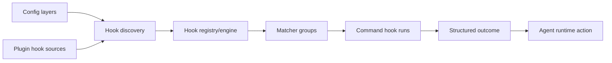

# 16｜Hook 与生命周期事件：可治理的运行时扩展点

> 源码基线：`upstream/main@283bc4cf011047314b4804c0f1ccd06e4f6a95c5`（2026-06-24）。

Hook 允许系统、企业、用户、项目和 Plugin 在 Agent 生命周期中运行命令或返回结构化决策。它不是简单通知脚本：部分 Hook 可以注入上下文、重写工具输入、阻止调用或要求 Agent 继续。

## 1. 当前事件面

`HookEventsToml` 当前覆盖 10 类事件：

| 事件 | 时机 |
| --- | --- |
| `SessionStart` | 会话或恢复启动 |
| `UserPromptSubmit` | 用户输入进入回合 |
| `PreToolUse` | 工具执行前 |
| `PermissionRequest` | 权限审批阶段 |
| `PostToolUse` | 成功工具输出后 |
| `PreCompact` | 压缩前 |
| `PostCompact` | 压缩后 |
| `SubagentStart` | 子 Agent 启动 |
| `SubagentStop` | 子 Agent 停止 |
| `Stop` | 主 Agent 准备停止 |

## 2. 来源与优先级

Hook 会保留来源：

- system；
- MDM；
- cloud requirements / managed config；
- user；
- project；
- session flags；
- plugin；
- legacy managed config。

来源不仅用于日志。系统与管理层 Hook 具有不同信任级别，低优先级配置不能悄悄移除强制 Hook。



## 3. Discovery

Hook engine 从配置层和 Plugin 声明中收集 matcher groups，解析 command hook，并记录：

- event name；
- matcher；
- timeout；
- source；
-配置文件或 Plugin 相对位置。

无效配置产生 warning，不应让来源信息丢失。Plugin hook 通过 `PluginHookSource` 进入同一引擎，而不是另建执行旁路。

## 4. `PreToolUse`

执行前 Hook 可以：

- 允许原输入继续；
- 返回更新后的 tool input；
- 阻止调用并给出 reason；
- 影响 permission decision。

Core 在 `run_pre_tool_use_hooks` 中把工具名、调用 ID、输入和上下文组成 request。返回的 updated input 必须重新进入正常工具校验，不能因为来自 Hook 就绕过 schema 或权限。

## 5. `PostToolUse`

只有工具选择参与且已产生成功输出时，才会构造稳定的 Hook 输入。不同 handler 决定暴露哪些 output 字段，防止把内部对象或无界原始数据直接传给脚本。

Post Hook 可以生成额外上下文或警告，但不应回写已经提交的工具事实。

## 6. Session 与 input Hook

`SessionStart` 和 `UserPromptSubmit` 可以返回上下文注入。`run_turn` 会在采样前记录这些 fragment，使其成为有界、可持久化的模型可见项。

SessionStart 还区分 startup、resume 等来源，便于脚本根据生命周期采取不同动作。

## 7. Stop Hook

Stop Hook 是循环控制点。模型已经给出最终回答后，Hook 可以：

- 接受停止；
- 返回继续提示，使当前回合再次采样。

为避免无限循环，运行时跟踪 stop hook 活跃状态与续写流程。SubagentStop 使用相似机制，但目标和 transcript 不同。

## 8. Compact Hook

Pre/PostCompact 允许扩展在历史压缩边界观察或补充信息。Hook 不能依赖原历史永远完整存在；需要长期保留的内容必须作为明确上下文或持久化产物。

## 9. 输出、超时与 spill

Hook command 的 stdout/stderr 有界。较大输出会 spill 到文件或以摘要表示，避免撑爆事件和 Prompt。执行状态区分 completed、blocked、failed 等，并通过 App Server 映射成 Hook started/completed 通知。

失败处理取决于事件和来源：安全关键 Hook 的失败通常更保守；纯通知 Hook 可以告警后继续。

## 10. 兼容层

仓库仍保留 legacy notify 适配，它把旧式 after-agent 通知映射到新 Hook 事件。新功能应使用正式事件与 schema，不应继续扩张 legacy 接口。

## 11. Schema 与测试

Hook crate 为各事件输入输出生成 JSON Schema。修改 wire shape 时需要更新 fixtures，并验证 config requirements 的合并行为。

```bash
rg -n "struct HookEventsToml|into_matcher_groups" codex-rs/config/src/hook_config.rs
rg -n "HookEventName|HookSource" codex-rs/protocol/src codex-rs/hooks/src
rg -n "run_pre_tool_use|run_post_tool_use|run_stop" codex-rs/core/src/hook_runtime.rs
rg -n "PluginHookSource|effective_plugin_hook_sources" codex-rs/plugin codex-rs/core-plugins
find codex-rs/hooks/schema/generated -type f | sort
```

Hook 的设计边界是：

> 它可以在明确生命周期点影响 Agent，但所有影响都必须结构化、有来源、有界，并重新经过正常安全和持久化路径。
