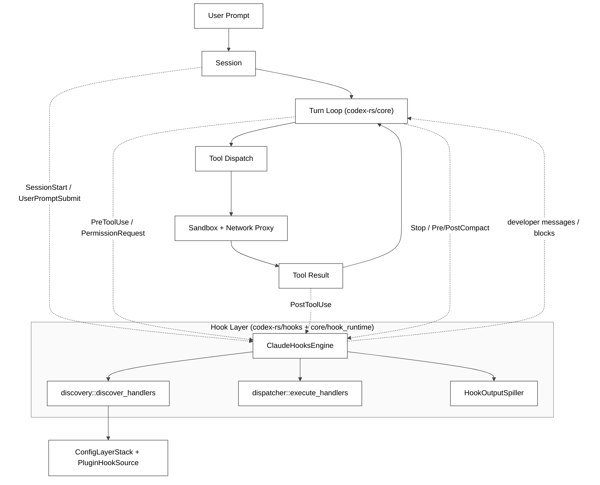
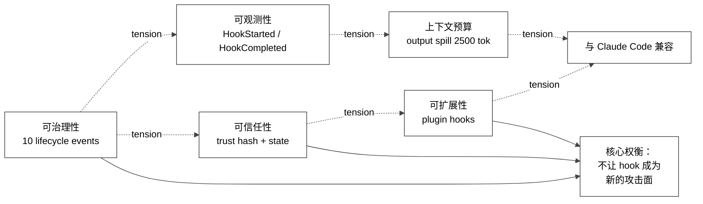
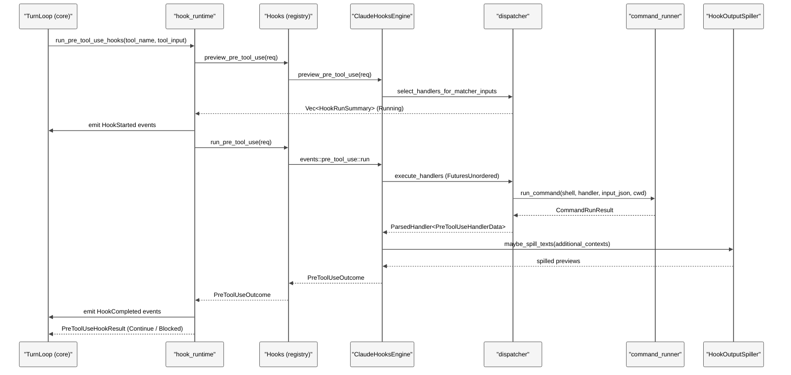
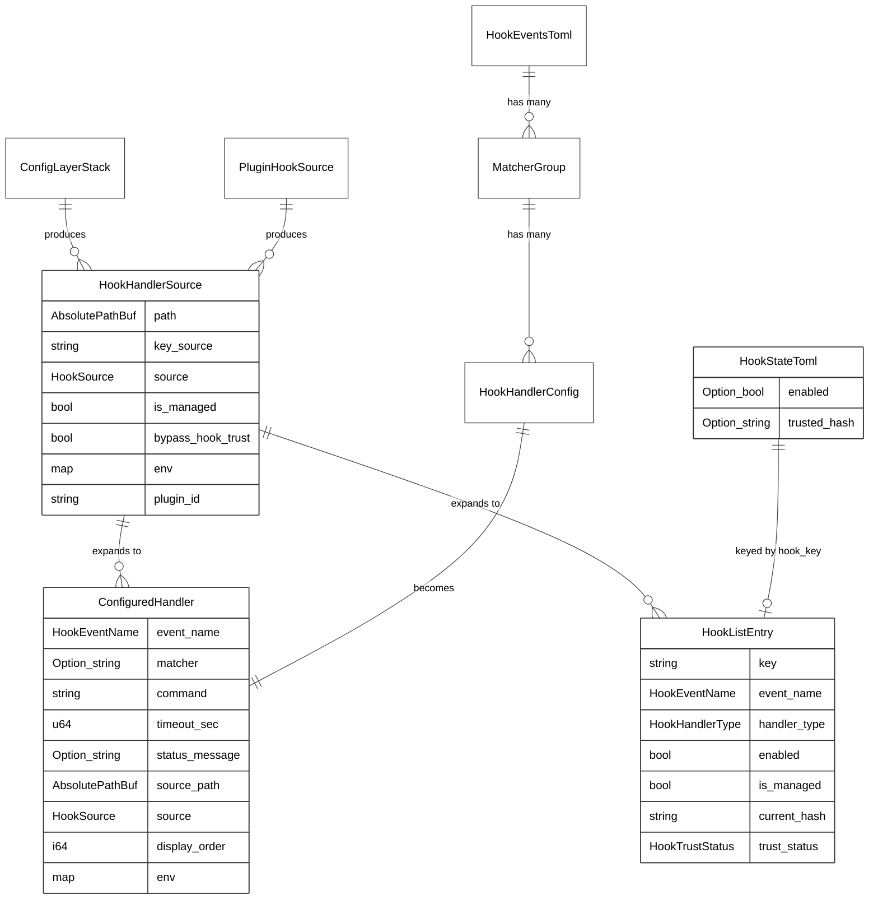
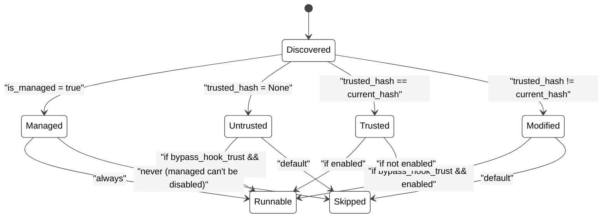

# 第 16 章：Hook 与生命周期事件

## 引言

如果说前几章里的沙箱、执行策略、网络代理是 Codex 给"模型/工具"画出的硬边界，那么本章主角 —— Hook 子系统 —— 就是 Codex 把"用户可编程的策略边界"嵌入到 Agent 循环里的接口。换句话说：沙箱回答"模型最多能做什么"，Hook 回答"在模型每一次试图做什么之前/之后，谁能审一刀、改一刀、记一刀"。

它解决的不是"模型 vs 用户"的对抗问题（那是沙箱要解决的），而是"组织/项目 vs 默认 Agent 行为"的可治理性问题：在企业里要在 `Bash` 命令落地前跑一段策略脚本、要在 `apply_patch` 完成后挂一个 lint，要在 `SessionStart` 时往上下文塞一段项目说明，要在长会话被 compact 之前先把关键信息 dump 到一个文件 —— 这些都不是模型该负责的事，而是要在 Agent 循环里"插一段你写的代码"。

Codex 的 Hook 实现刻意贴着 Claude Code 的接口形态，但底层 Rust 子系统把 trust hash、配置层级、output spill、subagent 隔离、analytics/OTel 联动一并写了进去。本章按你给的 4 条核心路径展开：

- `codex-rs/hooks/src/schema.rs`（1102 行）
- `codex-rs/hooks/src/engine/discovery.rs`（1010 行）
- `codex-rs/hooks/src/events/pre_tool_use.rs`（782 行）
- `codex-rs/core/src/hook_runtime.rs`（909 行）

按本章复核口径（2026-05-26，本地源码基线 `/Users/hexiaonan/workspace/formless/refer/codex`）的几个关键数字：

- `codex-rs` workspace 下 `Cargo.toml` 文件数：**120**
- `hooks` crate 的源码量：**10,505 行**（含测试），其中 `engine/mod_tests.rs` 一个文件就有 1350 行
- 10 个生命周期事件：`PreToolUse / PermissionRequest / PostToolUse / PreCompact / PostCompact / SessionStart / UserPromptSubmit / SubagentStart / SubagentStop / Stop`，源码常量在 `lib.rs:19-30`
- 8 个事件支持 matcher 模式（`lib.rs:37-46`），`UserPromptSubmit` 与 `Stop` 强制忽略 matcher
- 每个事件都有 `command.input` + `command.output` 两份 JSON Schema，共 **20 份 fixture 文件**，由 `schema::write_schema_fixtures()` 集中生成
- 关键函数体量（脚本统计）
  - `engine/discovery.rs::append_matcher_groups`：约 119 行（409–527）
  - `events/pre_tool_use.rs::parse_completed`：约 116 行（188–303）
  - `events/pre_tool_use.rs::run`：约 71 行（71–142）
  - `core/src/hook_runtime.rs::run_pending_session_start_hooks`：约 54 行（100–153）
  - `core/src/hook_runtime.rs::run_pre_tool_use_hooks`：约 58 行（160–217）
  - `engine/dispatcher.rs::execute_handlers`：约 28 行（89–116）
- 测试密度（`#[test]` / `#[tokio::test]` 计数）
  - `hooks` 整个 crate：**114** 个测试用例（按 grep 计）
  - `engine/dispatcher.rs`：10 个
  - `events/pre_tool_use.rs`：15 个
  - `engine/discovery.rs`：9 个

这些数字说明一件事：Hook 子系统已经是 Codex 里"中等规模、被测试密集覆盖、和 sandbox / network-proxy / mcp 平起平坐的子系统"，而不是表面文章里那种"挂几个回调"的轻量框架。

---

## 全网调研补充（近 12 个月）

### 1）检索范围与高权重来源

本章 Step 0 按你给的关键词执行了全网检索：

- `Codex hooks PreToolUse PostToolUse`
- `Codex SessionStart hook`

并补检了"Codex hooks vs Claude Code hooks"与"hooks trust security"两条衍生主题。高权重来源主要集中在四类：

1. **OpenAI 官方一手材料**
   - [Hooks – Codex | OpenAI Developers](https://developers.openai.com/codex/hooks)（官方 hook 参考文档）
   - `openai/codex` 仓库内的 PR / Issue：#14626（首次引入 UserPromptSubmit）、#18391（apply_patch 接入 PreToolUse/PostToolUse）、#18491（`updatedInput` 等遗留 issue）、#20321（trust metadata 强制）、#20527（`updatedInput` 真正落地）、#14718（trust-gate 项目级 hooks）、#15266（SessionStart 与 UserPromptSubmit 时序问题）
2. **第三方深度博客**
   - Sulat AI 的 _Codex hooks just gave you back complete control_（明确版本时间线）
   - Agentic Control Plane 的 _Codex CLI hook governance: what works today (and what doesn't)_（指出 Bash-only 与 apply_patch 缺口的修复进度）
   - Sakasegawa 的 _Harness Engineering Best Practices_（横评 Claude Code / Codex hook 系统）
   - Blake Crosley、Mark Chen、unicodeveloper 的 Claude Code vs Codex 横评（统一描述 Codex hook 数量与成熟度）
3. **中文社区**
   - `codex-docs.com` 中文文档对 `[hooks]` / `hooks.json` / managed hooks / `requirements.toml` 的解释
   - 知乎 / CSDN / 掘金 上的零散实践帖（偏 hook 调用配置，没有源码层深度）
4. **横向对照**
   - Anthropic 的 Claude Code hooks 文档（明确列出 29 类 hook，作为 Codex 设计原型）
   - DEV.to 上的 _Five Hooks That Change How You Ship With Claude Code_（典型 Hook 使用模式）

### 2）社区共识

跨平台能形成共识的点：

1. Codex hooks **基本是 Claude Code hooks 的子集 + 重新实现**，事件名、输入 JSON 字段、退出码语义都贴合 Claude 的约定，所以 Claude Code 的 hook 脚本经常可以"换文件名 + 改路径"复用。
2. Codex 经历过几次显著版本跃迁：v0.116.0 引入 `UserPromptSubmit`、v0.117.0 引入 `PreToolUse / PostToolUse`、v0.123.0（2026-04-23）让 `apply_patch` 接入 `PreToolUse`/`PostToolUse`、之后 `updatedInput` 才真正可用。
3. 早期"Codex hooks 只对 Bash 起作用"的吐槽是历史问题，**目前 `apply_patch`、MCP 工具、ExecCommand 都已经走同一套 hook 入口**（但社区文章普遍滞后于源码）。
4. Codex 的 trust 模型（hash + state）被一致认为比 Claude Code 更严格：未受信的 unmanaged hooks 不会进入 runnable set。
5. 沙箱与 hook 的关系是补充而不是替代 —— 共识是"沙箱兜底 + hook 做策略"。

### 3）主要争议与常见误解

1. **误解 A：Codex hooks 只能匹配 `Bash`**  
   这条来源于早期 schema 把 `tool_name` 写成 `const: "Bash"`。在当前源码里，`PreToolUseCommandInput::tool_name` 是普通 `String`，匹配是基于 `matcher_inputs(tool_name, matcher_aliases)` 的多别名匹配，`apply_patch|Write|Edit` 是合法 matcher（见 `events/common.rs:146-155` 与 `dispatcher::select_handlers_for_matcher_inputs` 测试）。
2. **误解 B：把 hook 当作 Claude Code 同款的 "Stop 决策最终决定权"**  
   Codex 的 `Stop` hook 输出走 `continuation_fragments` 重新塞回 prompt（详见 `events/stop.rs` 的 `StopOutcome` 与 engine `maybe_spill_prompt_fragments`），不是简单 yes/no 投票。
3. **误解 C：trust hash 锁定的是"脚本内容"**  
   实际锁的是 **normalized hook identity**（事件名 + 匹配器 + 命令文本 + 超时 + 状态消息），见 `discovery.rs::NormalizedHookIdentity` 和 `version_for_toml(&value)`。换言之：你改 hook 脚本本体（`echo hello` 文件里 `echo` 实现）不会触发重新审批，但你在 `hooks.json` 里改 `command`、`matcher`、`timeoutSec` 都会触发。
4. **争议：`PreToolUse` 多 hook 并发 + `updatedInput` 仅由"最后完成那个"胜出**  
   PR #20527 评审里讨论过：策略 hook 看到的是原始输入，重写 hook 把它改写后，被改写的 input 不会再过策略 hook —— 当前实现保留这种"信任模型"，因为只有受信 hook 才能写 `updatedInput`。源码实证在 `events/pre_tool_use.rs::latest_updated_input`（148–162 行）。
5. **争议：SessionStart 与 UserPromptSubmit 时序**  
   GitHub issue #15266 指出"首轮二者同时触发"的问题，存在一个 eager 启动 fix 的 fork（mvanhorn/codex），主仓库当前还是 "pending session start source" 模型，本章 `run_pending_session_start_hooks` 一节会按现状讲。

### 4）社区盲区（本章重点补充）

调研下来没有被系统讨论的部分包括：

1. **trust hash 的具体取材**：几乎所有博客只说 "hash"，没有人去翻 `NormalizedHookIdentity` 真正序列化了什么字段；本章会贴出 `command_hook_hash` 实际拼接结构。
2. **discovery 阶段的 9 个 HookSource × 配置层叠加规则**：`hook_metadata_for_config_layer_source`、`hook_source_for_requirement_source`、以及 `policy.allow_managed_hooks_only` 三道闸门的组合行为，社区从未画过决策图。
3. **HookOutputSpiller 的 2500 token 上限**：本章会把 `output_spill.rs:12` 的 `HOOK_OUTPUT_TOKEN_LIMIT` 行号贴出。
4. **subagent hook 上下文（`agent_id` / `agent_type`）的可选字段语义**：schema 测试 `subagent_context_fields_are_optional_for_hooks_that_run_inside_subagents` 是 Codex 区别于 Claude Code 的关键扩展点。
5. **`turn_id` 是 Codex 对 Claude hook spec 的扩展**：源码注释里写得很清楚（`schema.rs:272-273` 等），但社区博客只字未提。
6. **`legacy_notify` 与新 hook 系统的关系**：实际上 `notify` 仍然作为唯一的 `AfterAgent` hook 留在 `Hooks::after_agent` 字段里，与新 engine 并存。

以上 6 个点会作为本章七维分析的实证素材。

---

## 七维分析

### 1）本质是什么

#### 1.1 在 Codex 架构里的位置

把 Hook 子系统放进 Codex 总体架构看，它的位置是这样的：

<div style="background: #ffffff !important; background-color: #ffffff !important; border: 1px solid #d0d7de; border-radius: 8px; padding: 16px; margin: 16px 0; overflow-x: auto;" bgcolor="#ffffff">



</div>

几个关键观察：

1. **Hook 不是单独的一条边路**，它在 Session、TurnLoop、Tool Dispatch、Result 这 4 个位置都插了挂载点。
2. **Engine 是"无状态查询服务"**：每次事件来了，先用 preview 拿到 `Vec<HookRunSummary>` 给 UI/protocol，再用 run 实际执行。
3. **Discovery 与 ConfigLayerStack 强耦合**：所有 hook 来源都得过配置层（system / user / project / mdm / plugin / session flags），这也是 trust 模型生效的前提。
4. **Spiller 是 hook 输出的 "context budget" 保护层**，让 hook 不会把 model context 撑爆。

#### 1.2 本章的"hook"涵盖几个含义

源码里 "hook" 是一个多义词：

| 名字 | 来源 | 含义 |
|---|---|---|
| `HookEventName`（10 个） | `codex-rs/protocol/src/protocol.rs:1332-1343` | 协议层的事件名（PreToolUse 等） |
| `ClaudeHooksEngine` | `hooks/src/engine/mod.rs:100-105` | 新版（Claude-Compat）hook 引擎 |
| `Hooks` | `hooks/src/registry.rs:47-51` | 对外 API，封装 engine + legacy notify |
| `Hook` / `HookFn` | `hooks/src/types.rs:12-43` | 旧 legacy notify 用的回调 trait |
| `HookListEntry` | `hooks/src/engine/mod.rs:80-97` | `/hooks` 命令展示用的 entry |
| `ConfiguredHandler` | `hooks/src/engine/mod.rs:41-78` | 内部 runnable handler |

可以把它们想成"协议层 / 配置层 / 运行时层 / 展示层"四个抽象：协议层定义事件名，配置层（`hooks.json` / `[hooks]`）描述 handler 列表，运行时层在 turn 循环里调度，展示层（`hooks/list`、`/hooks` 命令）让用户审查与信任。

### 2）核心问题和痛点

Hook 系统要同时回答下面 7 个问题，每个问题在源码里都有对应实证：

1. **同样的事件，从 system / mdm / user / project / plugin / session-flag 6 个来源都可能注册 handler，怎么合并？**  
   → `discovery::discover_handlers` 按 `ConfigLayerStackOrdering::LowestPrecedenceFirst` 遍历所有层，同时还要 append `managed requirements` 和 `plugin hook sources`，全部 push 到一个 `Vec<ConfiguredHandler>`（discovery.rs:62-167）。
2. **同事件同 matcher 的多个 handler 怎么调度？**  
   → 并发 `FuturesUnordered::push`（dispatcher.rs:97），但完成结果按 **configured order** 排序（dispatcher.rs:114），所以输出顺序稳定。`updatedInput` 这种"竞争性写入"则按 **completion order** 取最后（pre_tool_use.rs:148-162）。
3. **怎么让本来允许"声明式覆写工具输入"的 hook 不变成新的注入攻击面？**  
   → 1）`updatedInput` 必须配合 `permissionDecision: "allow"`；2）只有受信 hook 才能进 runnable 集合（discovery.rs:495-513）；3）整个 hook 集合的 hash 与 `config.toml` 持久化 `trusted_hash` 比较（discovery.rs:557-571）。
4. **hook 输出可能很大，怎么不撑爆模型上下文？**  
   → `HookOutputSpiller`：> 2500 token 的文本写到 `<tmp>/hook_outputs/<thread>/<uuid>.txt`，把"截断预览 + Full hook output saved to: 路径"作为占位返回（`output_spill.rs:33-61, 101-107`）。
5. **subagent 里跑的 hook 要不要再受同样的 hook 集合管？**  
   → 要。`thread_spawn_subagent_hook_context` 给每条 PreTool / PostTool / PermissionRequest / Compact 请求附带 `agent_id` / `agent_type`（hook_runtime.rs:734-744），schema 在 `PreToolUseCommandInput.agent_id: Option<String>` 上做 `#[serde(skip_serializing_if = "Option::is_none")]`，让"根会话不出现这两个字段、子代理会话才出现"成为契约。
6. **如何在 Claude Code 兼容性与 Codex 内部需求之间取舍？**  
   → 关键扩展点：`turn_id`（schema.rs:272 / 295 / 317 等位置都标注 "Codex extension"），它对应 Codex 内部 `turn_context.sub_id`；`SubagentStart / SubagentStop` 是 Claude 没有的事件名（lib.rs:23-29）。
7. **legacy `notify` 怎么不被淘汰？**  
   → 单独留在 `Hooks::after_agent`，通过 `legacy_notify::notify_hook(argv)` 包装为一个 `HookFn`，与新 engine 并存（registry.rs:60-82；legacy_notify.rs）。这条路径完全独立，且只支持 `AfterAgent` 一个事件（types.rs:90-97）。

把这 7 个问题放到一个 trade-off 图里：

<div style="background: #ffffff !important; background-color: #ffffff !important; border: 1px solid #d0d7de; border-radius: 8px; padding: 16px; margin: 16px 0; overflow-x: auto;" bgcolor="#ffffff">



</div>

### 3）解决思路与方案

#### 3.1 整体调用链

把 schema / discovery / engine / dispatcher / hook_runtime 五个文件合在一起看，一次完整的 hook 调用是这样的：

<div style="background: #ffffff !important; background-color: #ffffff !important; border: 1px solid #d0d7de; border-radius: 8px; padding: 16px; margin: 16px 0; overflow-x: auto;" bgcolor="#ffffff">



</div>

注意几个细节：

- preview 是一个**只读、纯函数式**步骤，不会启动子进程。它的唯一作用是让 UI 提前看到"这次会有几条 hook 启动"。
- run 内部用 `FuturesUnordered` 并发跑所有 matched handler，但**结果顺序仍按配置顺序输出**（dispatcher.rs:114）。
- spiller 是 engine 的私有字段（`mod.rs:104`），在每个有 "additional_contexts" 语义的 hook 出口都会过一遍，例如 `run_pre_tool_use`（mod.rs:183-191）。

#### 3.2 数据结构关系

下面这张 ER 是本章最关键的结构骨架。它揭示了为什么 "hook key = source_path + event_label + group_index + handler_index" 是 trust 模型的核心。

<div style="background: #ffffff !important; background-color: #ffffff !important; border: 1px solid #d0d7de; border-radius: 8px; padding: 16px; margin: 16px 0; overflow-x: auto;" bgcolor="#ffffff">



</div>

几个对应关系要说明：

- `HookHandlerSource` 是 discovery 阶段的"暂存层"（discovery.rs:39-48），它知道这一组 handler 来自哪个 `HookSource`、是否 managed、是否 bypass trust。
- `ConfiguredHandler` 是真正参与运行时的对象（engine/mod.rs:41-52），所有 preview / run 都遍历它的 `Vec`。
- `HookListEntry` 是给 UI / `hooks/list` 协议看的（engine/mod.rs:80-97），它比 `ConfiguredHandler` 多了 `current_hash` 与 `trust_status` 两个字段。
- `HookStateToml` 只持久化两件事：`enabled` 与 `trusted_hash`。trust 状态不是"信任脚本内容"，而是"信任 hook 当前 normalized identity"。

#### 3.3 trust 模型的状态机

`hook_trust_status` 实现在 discovery.rs:557-571，它和 `hook_enabled` 与 `bypass_hook_trust` 共同决定一个 handler 是否进入 runnable set：

<div style="background: #ffffff !important; background-color: #ffffff !important; border: 1px solid #d0d7de; border-radius: 8px; padding: 16px; margin: 16px 0; overflow-x: auto;" bgcolor="#ffffff">



</div>

源码实证（discovery.rs:495-513）：

```rust
// codex-rs/hooks/src/engine/discovery.rs:495
if enabled
    && (source.bypass_hook_trust
        || matches!(
            trust_status,
            HookTrustStatus::Managed | HookTrustStatus::Trusted
        ))
{
    handlers.push(ConfiguredHandler { ... });
}
```

注意一个细节：`hook_entries.push(...)` 是无条件的（discovery.rs:478），所以"未被信任的 hook"仍会出现在 `hooks/list` 里供 UI 渲染，只是不会进入 runnable 集合。

#### 3.4 schema：双向契约的 20 份 JSON Schema

`schema.rs` 是整个 crate 里最长的文件（1102 行），它做了三件事：

1. **定义 wire 类型**（`PreToolUseCommandOutputWire`、`PreToolUseHookSpecificOutputWire` 等），这些是 Rust 端反序列化 hook stdout 的契约。
2. **定义 input 结构体**（`PreToolUseCommandInput` 等），它们是 hook stdin 的契约。每个都用 `#[serde(deny_unknown_fields)]` 强行禁止额外字段，并通过 `#[schemars(rename = "pre-tool-use.command.input")]` 给生成的 JSON Schema 起标题。
3. **生成 fixture**：`write_schema_fixtures()`（schema.rs:582-668）把上面所有类型用 `schemars` 转成 JSON Schema，写到 `schema/generated/*.schema.json`，再通过 `engine/schema_loader.rs` 的 `include_str!` + `OnceLock` 在运行时加载（schema_loader.rs:29-113）。

把所有事件的 input/output 对一并列出，更容易理解契约的对称性：

| 事件 | input schema 字段（关键） | output schema 字段（关键） |
|---|---|---|
| `PreToolUse` | session_id, turn_id, agent_id?, agent_type?, tool_name, tool_input, tool_use_id | `decision`(deprecated) / `hookSpecificOutput.permissionDecision`(allow\|deny) / `updatedInput` |
| `PermissionRequest` | …, tool_input | `hookSpecificOutput.decision.behavior`(allow\|deny), `message` |
| `PostToolUse` | …, tool_input, tool_response, tool_use_id | `decision`(block), `reason`, `hookSpecificOutput.additionalContext`, `updatedMCPToolOutput` |
| `PreCompact` | …, trigger(manual\|auto) | universal only |
| `PostCompact` | …, trigger | universal only |
| `SessionStart` | session_id, source(startup\|resume\|clear\|compact) | `hookSpecificOutput.additionalContext` |
| `SubagentStart` | …, agent_id, agent_type | 同 SessionStart |
| `UserPromptSubmit` | …, prompt | `decision`(block), `hookSpecificOutput.additionalContext` |
| `Stop` | …, stop_hook_active, last_assistant_message | `decision`(block), `reason` |
| `SubagentStop` | …, agent_id, agent_type, agent_transcript_path | 同 Stop |

`HookUniversalOutputWire`（schema.rs:84-96）是所有 output 共用的 4 字段：`continue`、`stopReason`、`suppressOutput`、`systemMessage`。

下面这段代码是 Codex 对 Claude spec 做的 `turn_id` 扩展，它体现在每个 turn-scoped hook 的输入里：

```rust
// codex-rs/hooks/src/schema.rs:269-288
#[derive(Debug, Clone, Serialize, JsonSchema)]
#[serde(deny_unknown_fields)]
#[schemars(rename = "pre-tool-use.command.input")]
pub(crate) struct PreToolUseCommandInput {
    pub session_id: String,
    /// Codex extension: expose the active turn id to internal turn-scoped hooks.
    pub turn_id: String,
    #[serde(skip_serializing_if = "Option::is_none")]
    pub agent_id: Option<String>,
    #[serde(skip_serializing_if = "Option::is_none")]
    pub agent_type: Option<String>,
    pub transcript_path: NullableString,
    pub cwd: String,
    #[schemars(schema_with = "pre_tool_use_hook_event_name_schema")]
    pub hook_event_name: String,
    pub model: String,
    #[schemars(schema_with = "permission_mode_schema")]
    pub permission_mode: String,
    pub tool_name: String,
    pub tool_input: Value,
    pub tool_use_id: String,
}
```

#### 3.5 SessionStart：把 lifecycle 当作"上下文注入入口"

`SessionStart` 与 `UserPromptSubmit` 的核心使命不是"决策"而是"注入 context"。源码里有一个统一抽象叫 `ContextInjectingHookOutcome`（hook_runtime.rs:59-98），它定义"任何 outcome 都可以被映射成 `should_stop + additional_contexts`"，并由 `run_context_injecting_hook` 统一处理。

整个 SessionStart 的实际执行时序如下：

<div style="background: #ffffff !important; background-color: #ffffff !important; border: 1px solid #d0d7de; border-radius: 8px; padding: 16px; margin: 16px 0; overflow-x: auto;" bgcolor="#ffffff">

```mermaid
%%{init: {"theme": "base", "themeCSS": "svg { background: #ffffff !important; } .label, .messageText, .loopText, .noteText, text { color: #000000 !important; fill: #000000 !important; }", "themeVariables": {"background": "#ffffff", "mainBkg": "#ffffff", "primaryColor": "#f5f5f5", "primaryTextColor": "#000000", "primaryBorderColor": "#333333", "lineColor": "#444444", "textColor": "#000000", "actorBkg": "#f5f5f5", "actorBorder": "#333333", "actorTextColor": "#000000", "actorLineColor": "#444444", "activationBkg": "#e8e8e8", "activationBorderColor": "#333333", "noteBkgColor": "#f0f0f0", "noteBorderColor": "#888888", "noteTextColor": "#000000", "signalColor": "#444444", "signalTextColor": "#000000", "fontFamily": "Helvetica"}}}%%
sequenceDiagram
    participant Sess as "Session"
    participant Loop as "Turn Loop"
    participant HR as "hook_runtime"
    participant Engine as "ClaudeHooksEngine"
    participant Script as "session_start.py"

    Sess->>Sess: take_pending_session_start_source()
    Loop->>HR: run_pending_session_start_hooks
    alt session_source is SubAgent.ThreadSpawn
        HR->>HR: build StartHookTarget::SubagentStart
    else other
        HR->>HR: build StartHookTarget::SessionStart{source}
    end
    HR->>Engine: preview_session_start(request)
    Engine-->>HR: Vec<HookRunSummary>
    HR->>Loop: emit HookStarted (one per matched)
    HR->>Engine: run_session_start(request, turn_id)
    Engine->>Script: spawn "session_start.py" with stdin JSON
    Script-->>Engine: stdout JSON / exit code
    Engine->>Engine: maybe_spill_texts(additional_contexts)
    Engine-->>HR: SessionStartOutcome
    HR->>Loop: emit HookCompleted
    HR->>Sess: record_conversation_items(developer fragments)
    HR-->>Loop: bool should_stop
```

</div>

注意：`SessionStart` 用的是 `pending_session_start_source` 队列模型（hook_runtime.rs:104），社区 issue #15266 提到的"首轮和 UserPromptSubmit 同时触发"就是这个队列的 drain 时机问题。

#### 3.6 PreToolUse：决策 + 重写的双使命

`PreToolUse` 是 Hook 系统里语义最复杂的事件，因为它要同时承担 4 件事：观测、阻塞、注入上下文、重写输入。

<div style="background: #ffffff !important; background-color: #ffffff !important; border: 1px solid #d0d7de; border-radius: 8px; padding: 16px; margin: 16px 0; overflow-x: auto;" bgcolor="#ffffff">

```mermaid
%%{init: {"theme": "base", "themeCSS": "svg { background: #ffffff !important; } .label, .nodeLabel, .edgeLabel, text { color: #000000 !important; fill: #000000 !important; }", "themeVariables": {"background": "#ffffff", "mainBkg": "#ffffff", "primaryColor": "#f5f5f5", "primaryTextColor": "#000000", "primaryBorderColor": "#333333", "secondaryColor": "#f6f8fa", "tertiaryColor": "#ffffff", "lineColor": "#444444", "textColor": "#000000", "nodeBorder": "#333333", "clusterBkg": "#fafafa", "clusterBorder": "#888888", "edgeLabelBackground": "#ffffff", "fontFamily": "Helvetica"}}}%%
flowchart TD
    Run["events::pre_tool_use::run"] --> Select[select_handlers_for_matcher_inputs]
    Select --> Empty{matched.is_empty?}
    Empty -- yes --> Pass[Outcome empty, continue]
    Empty -- no --> Build[build PreToolUseCommandInput JSON]
    Build --> Exec[dispatcher::execute_handlers]
    Exec --> Parse[parse_completed per result]

    Parse --> CheckExit{exit_code?}
    CheckExit -- 0 --> CheckStdout{trimmed stdout?}
    CheckStdout -- empty --> Noop[no entries, completed]
    CheckStdout -- valid JSON --> ParseJSON[output_parser::parse_pre_tool_use]
    CheckStdout -- "looks_like_json && invalid" --> InvalidJSON[Failed: invalid JSON]
    CheckStdout -- "plain text" --> Noop

    ParseJSON --> InvalidReason{invalid_reason?}
    InvalidReason -- Some --> Failed
    InvalidReason -- None --> Process[apply additional_context, block_reason, updated_input]

    CheckExit -- 2 --> Stderr{stderr non-empty?}
    Stderr -- yes --> BlockByStderr[Blocked, reason=stderr]
    Stderr -- no --> ExitTwoFail[Failed: missing reason]

    CheckExit -- other --> ExitFail[Failed: exit code N]

    Process --> Aggregate["aggregate: should_block any() / block_reason first() / updated_input latest_completion"]
    Aggregate --> Outcome[PreToolUseOutcome]
```

</div>

几个关键约定（pre_tool_use.rs:188-303 与 output_parser.rs:120-181）：

1. **exit code 0 + 空 stdout** = 完成态，无副作用（line 211）
2. **exit code 0 + valid JSON** = 按 JSON 解析；如果 `permissionDecision == "deny"`，整个 PreToolUseOutcome 的 `should_block` 设 true（line 233-241）
3. **exit code 0 + 看起来像 JSON 但解析失败** = `Failed`（line 246-252），这条规则是"看起来像 JSON 就要求合法 JSON"的失败式快速反馈
4. **exit code 2** = 与 Claude Code 兼容的 stderr-as-block-reason 协议（line 254-269）
5. **`updated_input`** = 必须搭配 `permissionDecision: "allow"` 才有效（output_parser.rs:161-172），且只有未被阻塞时才取（pre_tool_use.rs:124-128）
6. **多 hook 竞争 `updated_input`** = 按 **completion_order** 取最后完成那个（pre_tool_use.rs:148-162）

### 4）实现细节关键点

#### 4.1 discovery：`append_matcher_groups` 的 9 个责任

`append_matcher_groups`（discovery.rs:409-527）是整个 discovery 阶段的核心循环，它在一个函数里做了 9 件事：

1. **matcher pattern 选择**（line 419）：`UserPromptSubmit` / `Stop` 的 matcher 会被丢弃（返回 None）
2. **matcher pattern 验证**（line 421）：正则不合法直接 warning 并跳过
3. **Windows 命令覆盖**（line 438-442）：`command_windows` 在 `cfg!(windows)` 下覆盖 `command`
4. **async hook 拒绝**（line 443）：当前不支持
5. **空命令拒绝**（line 450）
6. **timeout 默认 + clamp**（line 457）：`timeout_sec.unwrap_or(600).max(1)`，最大默认 10 分钟，最小 1 秒
7. **环境变量替换**（line 467-469）：`${PLUGIN_ROOT}` / `${CLAUDE_PLUGIN_ROOT}` / `${PLUGIN_DATA}` 用插件环境替换
8. **hash + trust 计算**（line 465-477）
9. **生成 `ConfiguredHandler` + `HookListEntry`** 并 push（line 478-514）

这一坨内嵌循环导致 `append_matcher_groups` 单函数复杂度很高，但因为本身就是"一次性配置展开"的逻辑，函数体并未拆分。

#### 4.2 `NormalizedHookIdentity`：trust hash 真正吃了什么

社区盲区里提到的"hash 到底基于什么"的答案在这里：

```rust
// codex-rs/hooks/src/engine/discovery.rs:531-555
#[derive(Serialize)]
struct NormalizedHookIdentity {
    event_name: &'static str,
    #[serde(flatten)]
    group: MatcherGroup,
}

fn command_hook_hash(
    event_name: codex_protocol::protocol::HookEventName,
    matcher: Option<&str>,
    group: &MatcherGroup,
    normalized_handler: HookHandlerConfig,
) -> String {
    let mut group = group.clone();
    group.matcher = matcher.map(ToOwned::to_owned);
    group.hooks = vec![normalized_handler];
    let identity = NormalizedHookIdentity {
        event_name: crate::hook_event_key_label(event_name),
        group,
    };
    let Ok(value) = TomlValue::try_from(identity) else {
        unreachable!("normalized hook identity should serialize to TOML");
    };
    version_for_toml(&value)
}
```

注意：这里把 `group.hooks` 替换成只含**当前这个 normalized handler** 的单元素 vec —— 也就是说 hash 锁定的是"事件名 + 实际生效 matcher（已经过 `matcher_pattern_for_event` 过滤）+ 单个 handler 的命令/超时/状态消息"。这就是为什么：

- 改 `hooks.json` 里的 `command` 字符串 = 触发 untrusted
- 改命令脚本本体（`echo hello.sh` 里的内容）= **不会**触发，因为 hash 没看 inode 或 sha256(scriptfile)

这是一个 deliberate 设计选择（PR #20321 评审里讨论过），它牺牲了"脚本被改也要重新审批"的强度，换来"管理员把脚本部署在 managed_dir 后能自由发新版"的可维护性。

#### 4.3 hook_states 的"用户层独占覆盖"

`config_rules.rs:16-70` 实现了一条很特殊的规则：**只有 `User` 与 `SessionFlags` 两个 layer 能写 hook state**：

```rust
// codex-rs/hooks/src/config_rules.rs:24-33
for layer in config_layer_stack.get_layers(
    ConfigLayerStackOrdering::LowestPrecedenceFirst,
    /*include_disabled*/ true,
) {
    if !matches!(
        layer.name,
        ConfigLayerSource::User { .. } | ConfigLayerSource::SessionFlags
    ) {
        continue;
    }
    ...
}
```

含义是：项目层（`.codex/config.toml`）可以**发现**新 hook，但不能"标记"任何 hook 为受信。这道墙的存在让"在恶意项目 `.codex/` 里写 `[hooks.state]` 自我授权"变得不可能。这也是 `core/src/hook_runtime.rs` 与 `discovery.rs` 这一层之外、`codex-config` 信任体系的一部分。

#### 4.4 dispatcher.rs 的"乱序执行、有序输出"

这是并发执行结果稳定性的关键：

```rust
// codex-rs/hooks/src/engine/dispatcher.rs:89-116
pub(crate) async fn execute_handlers<T>(
    shell: &CommandShell,
    handlers: Vec<ConfiguredHandler>,
    input_json: String,
    cwd: &Path,
    turn_id: Option<String>,
    parse: fn(&ConfiguredHandler, CommandRunResult, Option<String>) -> ParsedHandler<T>,
) -> Vec<ParsedHandler<T>> {
    let mut pending = FuturesUnordered::new();
    for (configured_order, handler) in handlers.into_iter().enumerate() {
        let input_json = input_json.clone();
        let turn_id = turn_id.clone();
        pending.push(async move {
            let result = run_command(shell, &handler, &input_json, cwd).await;
            (configured_order, parse(&handler, result, turn_id))
        });
    }

    let mut completed = Vec::new();
    let mut completion_order = 0;
    while let Some((configured_order, mut parsed)) = pending.next().await {
        parsed.completion_order = completion_order;
        completion_order += 1;
        completed.push((configured_order, parsed));
    }
    completed.sort_by_key(|(configured_order, _)| *configured_order);
    completed.into_iter().map(|(_, parsed)| parsed).collect()
}
```

注意两个序号：

- `configured_order`：声明顺序，最终返回数组按它排序，保证 UI/日志稳定
- `completion_order`：实际完成顺序，用于 `latest_updated_input` 等"最后完成胜出"逻辑

#### 4.5 command_runner：通过 shell 启动 + stdin 注入

`command_runner::run_command`（command_runner.rs:24-101）刻意没有做"argv 数组拆分"，而是把 `handler.command` 整段交给 shell：

- 非 Windows：`SHELL` 或 `/bin/sh`，参数 `-lc <command>`
- Windows：`COMSPEC` 或 `cmd.exe`，参数 `/C <command>`
- 然后通过 stdin 把 JSON input 写入子进程
- 通过 `tokio::time::timeout(timeout_duration, child.wait_with_output())` 实现超时
- `kill_on_drop(true)` 保证 future drop 时一并 kill 子进程，避免泄漏

这种"靠 shell 解析命令"的设计是 Claude Code 兼容性需要：hook 配置写的就是 shell 字符串。代价是用户得自己负责 shell escape（一个常见误区，见下文）。

#### 4.6 HookOutputSpiller：context 预算保护

```rust
// codex-rs/hooks/src/output_spill.rs:11-12
const HOOK_OUTPUTS_DIR: &str = "hook_outputs";
const HOOK_OUTPUT_TOKEN_LIMIT: usize = 2_500;
```

2500 tokens 是 hook 单次 additional_context 写入的预算上限。超过时会：

1. 在 `<tmp>/hook_outputs/<thread_id>/<uuid>.txt` 写完整文本
2. 给 model 看的版本是 `formatted_truncate_text(text, ...) + "\n\nFull hook output saved to: <path>"`（output_spill.rs:101-107）
3. 截断阈值会先扣除 footer 长度（line 104）

这一层保护对 `additional_context`、`PostToolUse.feedback_message`、`Stop.continuation_fragments` 都生效（engine/mod.rs:177-289）。

#### 4.7 与 telemetry / analytics 的接线

`emit_hook_completed_metrics`（hook_runtime.rs:633-647）与 `track_hook_completed_analytics`（hook_runtime.rs:649-658）让每条 completed event 都同时落到 4 个目的地：

- `EventMsg::HookCompleted` → 协议事件流（UI 用）
- `HOOK_RUN_METRIC` 计数 → OTel counter
- `HOOK_RUN_DURATION_METRIC` → OTel histogram
- `analytics_events_client.track_hook_run(...)` → 内部 analytics

tag 维度是固定的 3 元组：`hook_name`、`source`、`status`（hook_runtime.rs:716-720），它对应到 protocol 的 `HookEventName / HookSource / HookRunStatus`。

#### 4.8 legacy notify：单独的 after_agent 通道

`Hooks` 结构体里同时持有两个完全不同的字段：

```rust
// codex-rs/hooks/src/registry.rs:47-51
#[derive(Clone)]
pub struct Hooks {
    after_agent: Vec<Hook>,
    engine: ClaudeHooksEngine,
}
```

`after_agent` 来自 `legacy_notify_argv` 配置项（registry.rs:60-66），只在 `hook_runtime::run_legacy_after_agent_hook`（hook_runtime.rs:430-495）被调用。`Hook` 的语义是"用户配的 notify 命令 + 最后一段 JSON payload 拼到 argv 末尾"，与新引擎完全不共享 schema、不共享 trust 模型。

### 5）易错点和注意事项

1. **`exit code 2` 是约定，不是"通用 fail"**  
   PreToolUse / PostToolUse / UserPromptSubmit / Stop 的 exit code 2 全是**特殊语义** —— 用 stderr 作为 block reason。如果你想表达"hook 自己挂了"，请用 1 / 3 / 任何非 0 非 2 的码（pre_tool_use.rs:254-269；post_tool_use.rs 同款）。
2. **`updated_input` 的"竞争性写入"是按完成顺序而不是声明顺序**  
   多个 PreToolUse 同时写 `updatedInput`，最后完成的胜出（pre_tool_use.rs:148-162）。同时，这些 hook **看到的都是原始 `tool_input`**，所以"策略 hook 校验过 → 重写 hook 写入新 input → 直接放行"的链式逻辑要小心设计。
3. **`PreToolUse` 看不到 transcript 文件直到 transcript 写盘**  
   `transcript_path` 字段是 nullable（schema.rs:472），首轮可能为 null。脚本要做 `if transcript_path:` 判断。
4. **matcher 是正则 + 别名混合匹配**  
   `matches_matcher`（events/common.rs:129-144）的优先级：`*` / 空字符串 = match all；纯字母数字下划线管道 = exact match；其它 = 正则。所以 `Bash` 与 `^Bash$` 一致（exact 路径），但 `Bash.*` 与 `^Bash` 走正则。这条规则有专门的测试（common.rs:204-247）。
5. **`apply_patch` 的 hook 看到的 `tool_name` 是 `apply_patch`，不是 `Write`/`Edit`**  
   官方文档明确说 matcher 可以写 `apply_patch|Edit|Write`，但 stdin 里 `tool_name == "apply_patch"`（schema.rs 测试 `command_input_uses_request_tool_name`，pre_tool_use.rs:335-345）。
6. **`SubagentStart`/`SubagentStop` 只在 `SessionSource::SubAgent(SubAgentSource::ThreadSpawn { .. })` 触发**  
   其它 subagent（internal / synthetic）都被 `_ => return false / StopOutcome::default()` 直接跳过（hook_runtime.rs:122 与 341）。这条规则源码里有注释"Internal/synthetic subagents do not expose user-configured lifecycle hooks"。
7. **`hooks.json` 与 `[hooks]` 内联表同时存在会产生 warning**  
   discovery.rs:117-127 同时载入两份就会推一条 warning。建议每个配置层只用一种表示。
8. **hook 默认 timeout 是 600s**，从 `discovery.rs:457` `timeout_sec.unwrap_or(600)`。
9. **bypass_hook_trust 不会自动开启被 disabled 的 hook**  
   discovery.rs:788-822 的测试 `bypass_hook_trust_respects_disabled_handlers` 明确：`enabled = false` 即使 bypass 也不会跑。
10. **2500 token 是 hook 单条文本上限，不是会话总预算**  
    每条 additional_context 独立 spill，10 条都很大也都被截 + 写文件。
11. **HookSource 总共 10 种**（protocol/protocol.rs:1369-1381），包括 `CloudRequirements`、`LegacyManagedConfigFile`、`LegacyManagedConfigMdm` 三种"管控来源"，它们都被 `hook_source_for_requirement_source` 映射出来（discovery.rs:599-612）。监控/告警按 source 拆维度时不要忘了这些。
12. **`PostToolUse` 不能"撤销"已经执行的副作用**  
    社区博客有人误会，源码里 PostToolUse 的 `block` 语义只是替换 model 看到的 tool_response 文本，不会回滚命令本身。这是与 PreToolUse 的关键区别。

### 6）竞品对比

把 Codex Hook 与同类 Agentic 产品横向对一遍。

| 产品 | 事件数量 | 配置形态 | trust 模型 | 上下文注入 | 决策语义 | subagent 隔离 |
|---|---|---|---|---|---|---|
| **Codex (本章基线)** | 10（含 SubagentStart/Stop） | `hooks.json` / `[hooks]` 内联 / plugin / managed | normalized identity hash + state | additionalContext + spill | allow/deny + updatedInput | agent_id/agent_type 字段，按 SubAgent.ThreadSpawn 触发 |
| **Claude Code** | 29（社区统计） | `~/.claude/settings.json` / project settings | 项目级 trust prompt（非 hash） | additionalContext / context document | allow/deny/ask（更细粒度） | 有 SubagentStop 等事件 |
| **Opencode** | 较少（实验） | TOML config | 无统一 trust model | 仅 prompt template | 主要是 cmd hooks | 不显式区分 |
| **Aider** | `--lint-cmd` / `--auto-commits` 等少数离散开关 | CLI flag / `.aider.conf.yml` | 用户自己负责 | 没有"hook stdin JSON"协议 | 简单非零退出 | 没有 subagent 概念 |
| **Goose** | hook trait 内嵌 Rust 扩展 | 编译时 | 无（要改源码） | extensions API | 直接调用 trait | 在 router 中处理 |
| **Continue** | extension API（VSCode 扩展） | `config.json` | VSCode 扩展信任模型 | 用 contextProvider | 大多是 modal 弹窗 | 不适用 |

几点关键观察：

1. **Codex 的 10 事件本质上是 Claude Code 29 事件的子集**，但补了 `PermissionRequest` 这个 Claude 没有同名独立事件的能力。Claude Code 的 `notification`、`PreCompact` / `PostCompact` / `Stop` Codex 都有对应，但 Claude 的 `FileChanged`、`CwdChanged`、`TaskCreated`、`TaskCompleted` 等运行时元事件 Codex 暂未实现。
2. **trust 模型 Codex 比 Claude Code 严格**：Claude 是"项目级一次性 trust"，Codex 是"每个 hook 一份 hash"，新增/改动单 hook 都会重新 untrusted。
3. **`updatedInput`** 是 Codex 与 Claude 同款 spec 的字段，但 Codex 直到 PR #20527 才真正落地。
4. **subagent hook 隔离** Codex 走的是"同一个 hook 集合 + agent_id/agent_type 字段"，Claude 走的是"独立 SubagentStart/Stop 事件 + matcher subagent type"，两者形态接近。
5. **Aider / Goose / Continue 都没有跟 Claude/Codex 同级的 hook 生态**：Aider 的 `--lint-cmd` 与 Codex 的 `PostToolUse` 在功能上重合（都能在文件变更后跑 lint），但 Aider 没有结构化 JSON 输入、没有 trust hash、没有 spill 机制。
6. **企业部署形态** Codex 独占的是 `requirements.toml` 里的 `allow_managed_hooks_only` + `managed_dir`，这条在 Claude Code 等竞品里没有等价物（codex-docs.com 文档明确）。

### 7）仍存在的问题和缺陷

1. **`PreToolUse` 多 hook 同时跑 `updatedInput` 时的"信任传递"问题**  
   PR #20527 评论里就提过：策略 hook 看到的是原始 input，重写 hook 写入新 input 后，被改写的 input 不会再过策略 hook。当前论点是"只有受信 hook 才能写 `updatedInput`"，但这把"受信"和"绝对正确"画了等号 —— 一个善意但有 bug 的重写 hook 也可能放行本来要 deny 的命令。这是当前实现的一个 known soft spot。
2. **trust hash 不锁脚本本体**  
   `command_hook_hash` 只 hash hook spec（命令字符串/超时/事件名/matcher），不 hash 实际脚本 sha256。脚本被替换、被外部人篡改不会触发再审批。这条设计是显式的、为 managed_dir 服务的，但在用户级 hooks.json 场景下会被诟病。
3. **SessionStart 时序问题（issue #15266 未合并）**  
   首轮 `SessionStart` 与 `UserPromptSubmit` 同时触发，"先 SessionStart 完再 UserPromptSubmit" 的契约还没在主仓库落地。`run_pending_session_start_hooks` 的 take-source-and-drain 模型决定了它和首 turn 的 future 几乎是并发的。
4. **`append_matcher_groups` 单函数复杂度过高**  
   discovery.rs 上百行的内嵌循环，9 件事都堆在一起。代码可读性变差，新增 hook 类型（如 PR #20319 引入新字段）时 trust hash 字段表就容易遗漏 —— review 评论里已经提到这点。
5. **Hook 失败的"软失败"语义可能掩盖真实问题**  
   PostToolUse 解析失败默认 `should_block = false`，相当于 fail-open。在审计敏感场景里需要外部 telemetry 才能发现。analytics 拿得到 `HookRunStatus::Failed`，但默认 UI 不一定会强烈提示。
6. **shell 注入风险全转嫁给 hook 作者**  
   `command` 是整段 shell 字符串，由 `/bin/sh -lc` 执行。如果 hook 作者写 `command: "myscript $tool_name"`，并指望 `$tool_name` 会被 Codex 注入 —— 实际上不会，环境变量替换只支持 `${PLUGIN_ROOT}` / `${PLUGIN_DATA}` 等少量值（discovery.rs:467-469），其它都得脚本自己从 stdin JSON 读。
7. **HookOutputSpiller 文件不清理**  
   `output_spill.rs` 只写不删，长期跑会在 `<tmp>/hook_outputs/<thread_id>/` 累积大量 uuid.txt。当前依赖 OS 临时目录的 GC（如 macOS 的 `/var/folders/.../T/` periodic cleanup），生产环境 Linux server 上需要自己加 cron。
8. **plugin hooks 与 trust 模型耦合得太紧**  
   插件作者要 deliver hooks，需要每个 hook 都被用户 `/hooks` 信任。这对小型 plugin OK，对大型 plugin（一次 ship 5+ hooks）则用户审核负担重，体验上和 npm install 完之后 "请人工逐个 trust" 接近。
9. **`updatedMCPToolOutput` 还在 PostToolUse 的 wire 类型里（schema.rs:231）但没在文档里宣传**  
   这种"半 ship"字段让二次开发者不确定该不该依赖。
10. **`HookRunSummary.scope` 只有 Thread / Turn 二选一**（dispatcher.rs:142-154），还不能表达 "tool-call 范围"。`PreToolUse` 实际上是按 tool-call 启动的，但 scope 被归到 Turn 与 PostToolUse 合并，对 UI 渲染不够准确。

---

## 小结

Hook 系统在 Codex 里是"治理面"，与沙箱（执行面）、网络代理（出网面）、execpolicy（命令面）正交又互补。它的几条主线是：

1. **协议层 10 个事件、对外提供 20 份 JSON Schema fixture**：契约稳定、文档可验证。
2. **配置层 6 个来源（system / user / project / mdm / plugin / session-flag）+ 3 个 managed 来源（cloud / legacy file / legacy mdm）**：让 hook 既能 BYO，又能企业级 enforce。
3. **trust 模型基于 normalized identity hash**：换 hook spec 必重审，给企业一个可解释的边界。
4. **运行时层 preview/run/parse 三阶段**：UI 能预先看到要跑哪些 hook，并发执行后按声明顺序输出，"最后完成胜出"用于解决重写竞争。
5. **HookOutputSpiller 把 2500 tokens 作为单条文本预算上限**，把大文本写到 tmp 文件，给模型一个带"recovery 路径"的截断预览。
6. **subagent hook 通过 `agent_id` / `agent_type` 注入区分**，让同一套 hook 集合也能服务子代理。

至于 Codex 与 Claude Code 的关系：源码层面 Codex 是 _careful re-implementation, not a fork_。同样的事件名、相近的 JSON 字段，但 trust 模型、subagent 形态、`turn_id` 扩展、`updatedInput` 落地节奏都是 Codex 自己长出来的肌肉。社区在 2026 年频繁讨论的"Codex hooks 只能 Bash"已经是历史问题，本章源码基线下，apply_patch / MCP 都已经接入；下一个值得关注的点是 PR #15266 提议的 SessionStart eager 时序、`updatedMCPToolOutput` 的正式启用、以及 trust hash 是否会扩展到 hash 脚本内容本体。这些演化方向才决定 Codex hook 能不能从"贴近 Claude 的兼容层"变成"企业级 Agent governance 的事实标准"。
