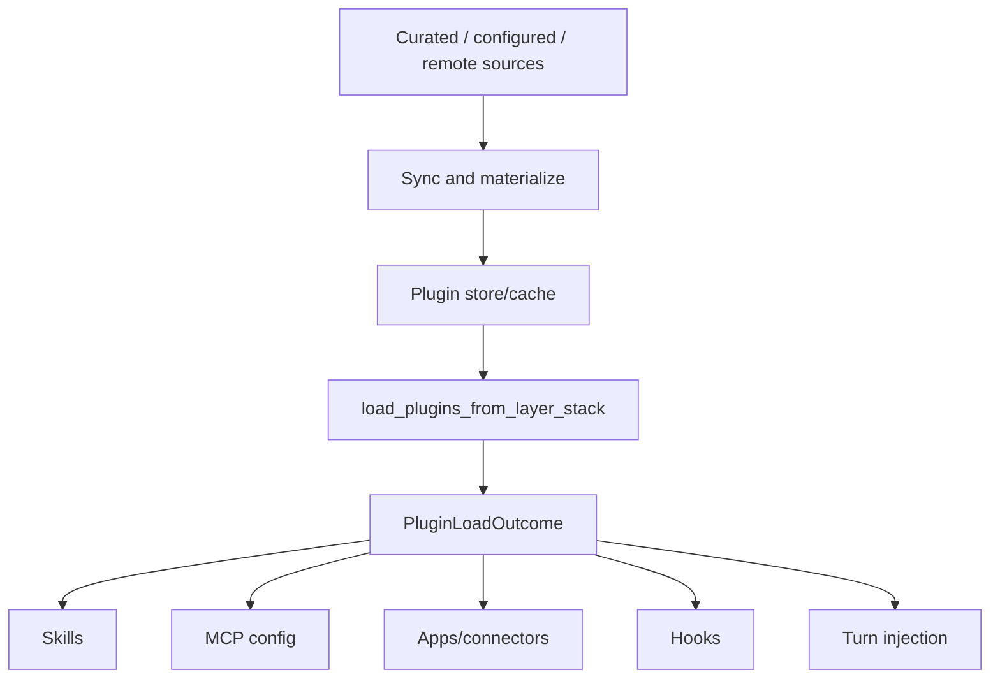

# 17｜Plugin 市场系统：能力包、分发与治理

> 源码基线：`upstream/main@283bc4cf011047314b4804c0f1ccd06e4f6a95c5`（2026-06-24）。

Plugin 是能力分发单元，不等于 MCP Server。一个 Plugin 可以组合：

- Skills；
- MCP servers；
- App / Connector 声明；
- Hooks；
- 元数据与安装策略。

标准 manifest 位于 `.codex-plugin/plugin.json`；兼容读取 `.claude-plugin/plugin.json`，但新 Plugin 应使用 Codex 标准路径。

## 1. 核心分层



`codex-plugin` 是较薄的身份和结果类型层；`core-plugins` 实现 marketplace、同步、缓存、加载和远程目录。

## 2. Plugin 身份

Plugin 由 plugin name 与 marketplace name 共同标识，避免不同市场同名冲突。用于 Prompt 的引用通常采用：

```text
plugin://<plugin>@<marketplace>
```

Manifest 名称必须与 marketplace 记录一致。版本、来源与安装路径也会在 store 层校验。

## 3. 安装治理

Marketplace 可以为每个 Plugin 指定：

- `NotAvailable`
- `Available`
- `InstalledByDefault`

这使企业或 curated 目录可以表达“禁止、可选、默认安装”，而不是把所有决定留给用户本地配置。

安装策略与 enabled 状态不同：可安装不代表已启用；默认安装也不意味着其所有外部服务已经完成认证。

## 4. 多来源

当前来源包括：

- OpenAI curated repository；
- 用户配置的 Git / local marketplace；
- ChatGPT 后端提供的远程 Plugin 目录与 bundle；
- 直接本地开发版本。

远程 Plugin 最终仍要下载并物化到本地 cache 后加载；“remote”描述分发来源，不表示代码或 Skill 在服务端执行。

## 5. Curated startup sync

Curated 同步带进程间文件锁，并按顺序尝试：

1. git；
2. GitHub HTTP archive；
3. 后端 export archive。

新内容先进入 staged 目录，再与现有目录切换；失败时尽量回滚或保留备份供恢复。每种 transport 的尝试和最终结果都有独立指标。

## 6. Store 与 cache

安装后的版本进入 Plugin store/cache。Loader 只信任经过物化与校验的 Plugin root，而不是直接在任意远程仓库路径上执行。

本地开发版本有特殊优先语义，便于开发者覆盖已发布版本。并发安装和同步必须串行化，避免多个 Codex 进程写坏同一版本目录。

## 7. 远程 bundle 安全

下载路径实施：

- HTTPS 限制；
- 总下载大小与单文件大小上限；
- archive 解压总量上限；
- path traversal 防护；
- manifest root 与名称校验；
- staging 后原子化安装；
- 错误响应体上限。

不能仅信任 `Content-Length`，流式读取过程中还要累计检查真实字节数。

## 8. 加载结果

`load_plugins_from_layer_stack` 折叠配置层和安装状态，生成 `PluginLoadOutcome`，包含：

- loaded plugins；
- skill roots；
- MCP server configs；
- app connector metadata；
- hook sources；
- warnings/errors；
- capability summaries。

单个 Plugin 的部分能力无效时应报告来源，而不是让整个 Plugin 目录静默消失。

## 9. 运行时注入

Plugin 启用后不会把所有内容永久塞进 Prompt：

- Skills 进入可用目录，显式选择时加载全文；
- MCP servers 进入 connection manager；
- Connectors 参与本回合 selection；
- Hooks 进入统一 Hook engine；
- Plugin 指令按用户提及和上下文预算注入。

这与第 07、16、18 章形成完整链路。

## 10. 安装工具的双阶段约束

Agent 不能看到一个相似名称就直接安装。工具流程要求：

1. 先列出可安装候选；
2. 必须与用户明确请求精确匹配；
3. 再调用安装请求工具；
4. 安装仍受产品策略与认证影响。

这避免模型基于模糊推荐扩大本地能力面。

## 11. 源码阅读路线

```bash
rg -n "struct PluginsManager|load_plugins_from_layer_stack" codex-rs/core-plugins/src
rg -n "MarketplacePluginInstallPolicy" codex-rs/core-plugins/src/marketplace.rs
rg -n "sync_openai_plugins_repo|startup_sync" codex-rs/core-plugins/src
rg -n "download_and_install_remote_plugin_bundle" codex-rs/core-plugins/src
rg -n "PluginLoadOutcome|PluginCapabilitySummary|PluginHookSource" codex-rs/plugin/src
rg -n "\\.codex-plugin/plugin.json" codex-rs/core-plugins codex-rs/plugin
```

Plugin 市场系统的本质是：

> 把扩展能力先变成可验证、可治理、可缓存的安装单元，再分别接入 Skill、MCP、Connector 与 Hook 的运行时边界。
