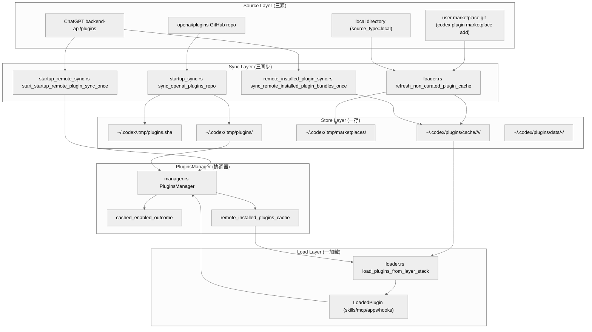
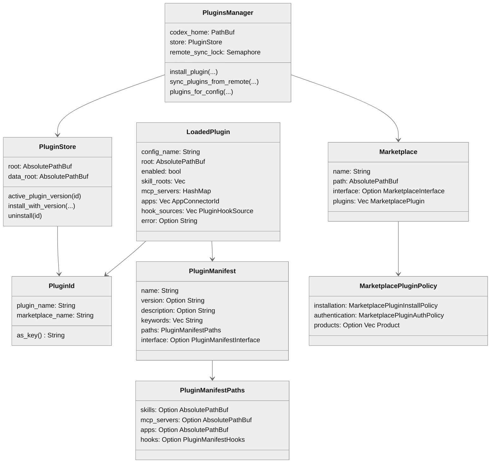
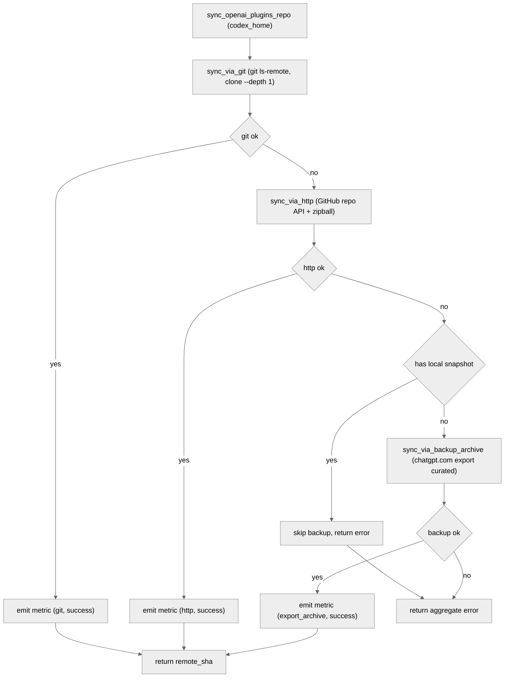
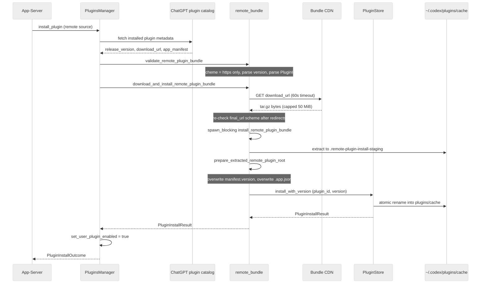
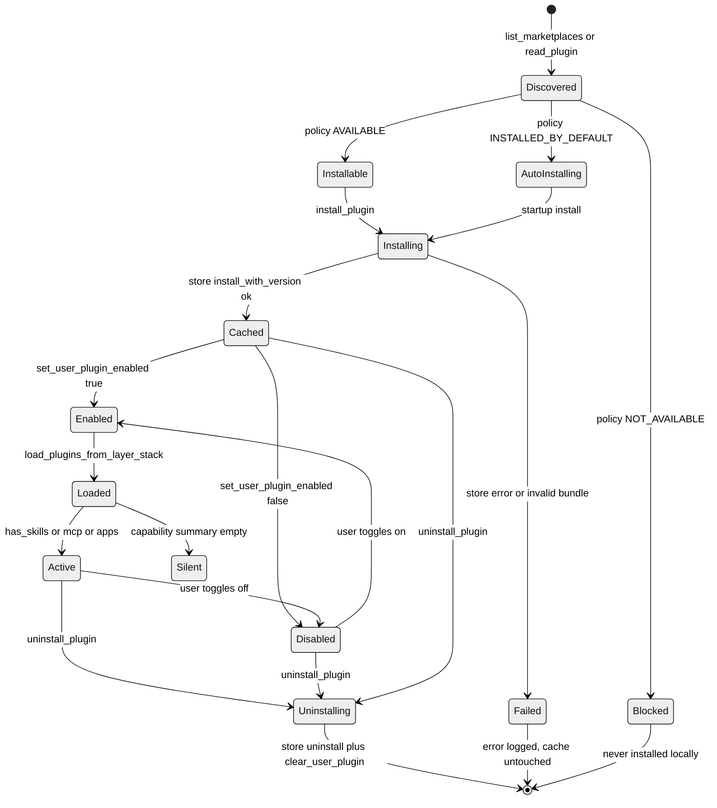

# 第 17 章：Plugin 市场系统

## 引言

如果说前几章把 Codex 当作"一个会写代码的 Agent"，那本章主角 —— Plugin 子系统 —— 是把 Codex 重新定义成"一个可以被组织/团队/个人装上 N 个能力包的可分发运行时"。它要回答的不是"模型能调用什么工具"（那是工具系统的事），也不是"工具能不能落盘/联网"（那是沙箱与策略的事），而是更上一层的问题：**一组 skills + apps + MCP servers，能不能被打包、签名、分发、缓存、热刷新，并且在三个完全不同的来源（OpenAI curated GitHub repo / 用户自挂 git 仓 / ChatGPT 后端 API）之间保持一致的本地观感**。

Codex 给出的答案是：把"插件市场"拆成"市场清单（marketplace.json）+ 本地缓存（plugins/cache）+ 三类同步器（startup_sync / remote sync / non-curated cache refresh）"，三者通过同一个 `PluginsManager` 串成一条流水线。本章按你给的核心路径展开：

- `codex-rs/core-plugins/src/manager.rs`（2,059 行，整个 crate 的协调器）
- `codex-rs/core-plugins/src/loader.rs`（1,216 行，把 marketplace + 配置 + 本地缓存折叠成 `PluginLoadOutcome`）
- `codex-rs/core-plugins/src/remote.rs`（1,446 行，ChatGPT 后端 plugin catalog 客户端）
- `codex-rs/core-plugins/src/remote_bundle.rs`（976 行，远程 bundle 下载/校验/落盘）
- `codex-rs/core-plugins/src/startup_sync.rs`（938 行，curated GitHub repo 同步）
- `codex-rs/plugin/src/lib.rs`（71 行，纯类型层 `PluginId / LoadedPlugin / PluginCapabilitySummary`）

按本章复核口径（2026-05-26，本地源码基线 `/Users/hexiaonan/workspace/formless/refer/codex`）的几个关键数字：

- `codex-rs/core-plugins` crate 源码量：**21,197 行**（含测试），分布在 **34** 个 `.rs` 文件
- 测试用例（按 `#[test]` / `#[tokio::test]` 计）至少 **195** 个，其中 `manager_tests.rs` 一个文件就有 56 个，`marketplace_tests.rs` 27 个，`store_tests.rs` 18 个 —— 测试密度高于 hook 子系统
- **三种 marketplace 来源**：OpenAI curated（GitHub `openai/plugins` 仓 + `.tmp/plugins.sha`）、ChatGPT 后端（`/backend-api/plugins/*`）、用户自挂（`config.toml [marketplaces]` + `.tmp/marketplaces/`）
- **三层网络回退**：git clone 优先 → GitHub HTTP zipball → ChatGPT `/plugins/export/curated` backup archive（`startup_sync.rs:81-135`）
- **远程 bundle 安全栅栏**（`remote_bundle.rs:24-31, 209-214`）：下载 60 秒超时、单文件 50 MiB 上限、解压后总大小 250 MiB 上限、错误响应体最多 8 KiB、只接受 `https://`，HTTP 仅限调试构建 + loopback
- **OpenAI 官方推荐的 16 个 discoverable plugin**（`lib.rs:23-40` 的 `TOOL_SUGGEST_DISCOVERABLE_PLUGIN_ALLOWLIST`），包括 github / notion / slack / gmail / linear / figma / chrome 等
- `PluginsManager` struct 字段数：**11**（`manager.rs:398-410`），其中 5 个 `RwLock<…>` + 1 个 `Semaphore` + 1 个 `AtomicBool` —— 反映出它是一个"被多端并发读写、需要可序列化的远程同步"的协调器

这些数字说明一件事：Plugin 市场系统已经不是"一个分发渠道"，而是 Codex 里规模仅次于 Hook 与 Core 的子系统，并且在 _2025 Q4 → 2026 Q1_ 这段时间内经历了一次架构级重写（从"远程状态镜像到本地配置"切到"远程目录与本地缓存并存"），这一点社区文章普遍滞后。

---

## 全网调研补充（近 12 个月）

### 1）检索范围与高权重来源

本章 Step 0 按你给的两条关键词执行了全网检索：

- `Codex plugin marketplace remote bundle`
- `Codex plugin startup sync`

并补检了 "Codex plugins skills apps mcp" / "Codex plugin marketplace add" / "Codex plugin git rewrite ssh" 三条衍生主题。高权重来源主要集中在四类：

1. **OpenAI 官方一手材料**
   - [Plugins – Codex | OpenAI Developers](https://developers.openai.com/codex/plugins)：官方 plugin 概念页，定义"plugin = skills + apps + MCP servers"以及"Curated by OpenAI / Shared with you / Created by you"三个来源
   - `openai/codex` 仓库内的关键 PR / Commit：[refactor: move curated plugin sync into startup_sync](https://github.com/openai/codex/commit/7a7d7a3ac5be9bbaf3f50a4030fabb472c6e61f1)、[feat: Add One-Time Startup Remote Plugin Sync](https://github.com/openai/codex/commit/56c33c2a7e363341b83f0a45f9bef8d9068103af)、[feat: prefer git for curated plugin sync](https://github.com/openai/codex/commit/fa898ba62b3e013d37d7aa8f08742a91e017fba1)、PR #17277 "feat: Add remote plugin fields to plugin API"（明确"local 与 remote 不再镜像，而是分开的源"）
   - Issue #17622：揭示 git 协议改写 HTTPS→SSH 时的 TTY 抢占问题，是 startup sync 的高频缺陷
   - Issue #16004 / #23902 / #19372 / #16808：分别覆盖临时目录泄漏、cache refresh 忽略 marketplaces、Claude Code 镜像副作用、桌面端 marketplace 不可达
2. **第三方深度博客 / 媒体**
   - InfoWorld 2026-03 [_OpenAI adds plugin system to Codex to help enterprises govern AI coding agents_](https://www.infoworld.com/article/4151214/openai-adds-plugin-system-to-codex-to-help-enterprises-govern-ai-coding-agents.html)：从企业治理角度评述，指出 `INSTALLED_BY_DEFAULT / AVAILABLE / NOT_AVAILABLE` 三档 install policy 是核心治理面
   - Lakshmi narayana .U Medium 2026-03 [_Codex Plugins Launched. I Had an MCP Server._](https://medium.com/@LakshmiNarayana_U/codex-plugins-launched-i-had-an-mcp-server-this-is-what-happened-47f5862d8e8b)：开发者实操日志，强调"plugin 不是 MCP server 的替代品，而是一层 packaging 上的可发现性"
   - Paul Salt YouTube _Codex Plugins Just Dropped_：传播最广的科普视频，确立"skills/apps/mcp 三组件"的社区话术
3. **中文社区**
   - 知乎 / 掘金 / CSDN 上的零散贴：以"如何 `/plugins`、如何 `codex plugin marketplace add`"上手为主，未见对 startup_sync 三层回退或 bundle 大小栅栏的源码级讨论
4. **横向对照**
   - Claude Code `.claude-plugin/marketplace.json` 文档（Codex 同时识别这个相对路径，见 `marketplace.rs:19-22`）
   - Cursor extension marketplace（含 30+ 第三方插件，已有公开 publish 流程）
   - Continue / Goose / Aider / Opencode 的扩展机制（详见第 6 维）

### 2）社区共识

跨平台能形成共识的点：

1. **Plugin = skills + apps + MCP**：这一三分法在 OpenAI 官方文档、InfoWorld、Medium、YouTube 上完全一致，与源码里 `manifest.rs` 的 `skills / mcp_servers / apps` 字段以及 `loader.rs` 的 `load_plugin_skills / load_plugin_mcp_servers / load_plugin_apps` 函数命名严格对齐
2. **OpenAI 自己提供的 curated marketplace 是分发主入口**：社区普遍意识到 `github / notion / slack / gmail / linear / figma` 等都来自 `openai-curated`，其源在 `openai/plugins` 仓库
3. **企业治理三档（NOT_AVAILABLE / AVAILABLE / INSTALLED_BY_DEFAULT）**：被 InfoWorld 拿来作为"OpenAI 区别于 GitHub / Cursor marketplace 的核心差异化"，在源码里对应 `marketplace.rs:90-99`
4. **Self-serve publishing 还没开**：所有材料一致承认 "Adding plugins to the official Plugin Directory is coming soon"
5. **可见 ≠ 可用**：Issue #23902 / #16808 引发的共识 —— marketplace 显示了不代表本地能装；本章源码里 `loader.rs:265-374`（`refresh_non_curated_plugin_cache_with_mode`）显式做了"配置存在但 marketplace 里找不到"的告警分支

### 3）主要争议与常见误解

1. **误解 A：Plugin 就是 MCP 包装器**  
   不对。`manifest.rs` 里 plugin 可以**只有 skills 没有 MCP**（`plugin_capability_summary_from_loaded` 在 `plugin/src/load_outcome.rs:59-62` 显式做 `has_skills || mcp_server_names || app_connector_ids` 的三选一过滤）。社区把 plugin = MCP 等价化，会忽略 skills（提示词工作流）这一独立路径。
2. **误解 B：远程 plugin 走"远程执行"**  
   不是。`remote_bundle.rs:226-244` 的 `download_and_install_remote_plugin_bundle` 把远程 plugin 下载下来后还是塞进本地 `plugins/cache` 由本地 loader 执行。远程只是"目录 + bundle 分发"，runtime 仍然是本地。
3. **误解 C：startup git sync 总是去 GitHub HTTP**  
   PR `fa898ba` 之后顺序变成"git → GitHub HTTP → ChatGPT export archive"。Issue #17622 显示这是有代价的：当用户配了 `[url "git@github.com:"] insteadOf = https://github.com/` 时，HTTPS 会被改写成 SSH，触发交互式 passphrase prompt，撞坏 TUI 终端状态。
4. **争议点：local 与 remote 是否应继续维持"sync"语义**  
   PR #17277 commit message 给出官方表态："The mental model is no longer 'keep local plugin state in sync with remote.' Instead, local and remote plugins are becoming separate sources." 但旧的 `sync_plugins_from_remote`（`manager.rs:961`）仍然存在并被 `start_startup_remote_plugin_sync_once` 调用，社区里"两者并存"导致行为预期混乱。
5. **误解 D：plugin enabled 在本地 config 与远程后端是同一处真值**  
   `remote_legacy.rs` 与 `loader.rs:151-184` 的 `remote_installed_plugins_to_config` 显示，远程 enable 是通过"在内存里把 remote installed plugin 注入 `extra_plugins`"实现的（而非写回 `config.toml`），因此远程 enable 不会持久化到本地用户配置文件。

### 4）社区盲区（源码可证、外界少谈）

1. **三层回退的诊断证据**：`startup_sync.rs:343-369` 通过 `CURATED_PLUGINS_STARTUP_SYNC_METRIC` 和 `CURATED_PLUGINS_STARTUP_SYNC_FINAL_METRIC` 两个 OTel counter 分别记录"每个 transport 的尝试结果"和"最终落地用的 transport"，这是一种**双层指标**设计，用来在生产里分辨"我们的 git 路径还有多少在用、HTTP fallback 有多频繁"。社区文章基本没注意到这两个 metric。
2. **`activate_curated_repo` 的 rename rollback**：`startup_sync.rs:381-435` 不是简单 `rename(staged, target)`，而是先把旧目录改名到 `plugins-backup-<rand>`，新目录 rename 进去；rename 失败时再 rename 回去，最坏情况下把旧目录"keep"到磁盘并把绝对路径塞进 Err 里告诉用户去手动恢复。这种"两阶段切换 + 失败保留备份"的写法很少被讨论。
3. **bundle 体积栅栏的二次校验**：`remote_bundle.rs:309-348` 既看 `Content-Length` 又在每一帧 chunk 后再 `enforce_download_size_limit`，防止 server 撒谎 Content-Length 后慢速喂数据耗光内存
4. **`PluginStore` 把 `local` 当作"伪 latest"特例**：`store.rs:70-90` 在 `active_plugin_version` 排序后**优先返回 `local`**（开发者从本地路径 install 的版本）而不是按 semver 拿最大值。这是一个"开发者覆盖发布版"的小后门，社区从未公开讨论
5. **`PluginId` 不允许在 `marketplace_name` 里出现 `@`**：`plugin/src/plugin_id.rs` 的 `validate_plugin_segment` 决定了 plugin key 形如 `github@openai-curated`，反过来也意味着 marketplace 名字一旦含 `@` 就整套链路崩溃；这是 `marketplace_add` 拒绝某些 URL 派生名字的隐式根因
6. **远程 plugin 强行覆写 manifest.version 和 .app.json**：`remote_bundle.rs:444-504` 的 `prepare_extracted_remote_plugin_root` 在 marketplace 是 `openai-curated-remote` 时**会把后端给的 release version 写回 `plugin.json`**，并用后端给的 app manifest 覆盖 `.app.json`。也就是远程版的 plugin manifest 不是"原作者写的"，而是被后端权威化过的。社区完全没讨论过这一点。

---

## 七维分析

### 维度 1 — 本质是什么

Plugin 子系统在 Codex 架构里同时承担三件事：

1. **能力打包层（Capability Packaging）**：把"一组 skills 提示词 + 一组 MCP server JSON + 一组 app connector 声明 + 一组 hook 文件"折叠成一个目录，由 `plugin.json` 描述（`manifest.rs:37-77`）；
2. **分发渠道层（Distribution Channel）**：把这种目录从三个来源送到用户机器 —— GitHub 仓 / 用户自挂 git / ChatGPT 后端 API；
3. **运行注入层（Runtime Injection）**：在每次新 session 启动时，把 enabled plugin 的内容**注入到 MCP 客户端、skill 索引、hook runtime、apps connector**，让"plugin 提供的能力"和"内置工具"在 model 视角下不可区分。

对外观感最像 _IDE 扩展市场_，但更接近 _Linux 包管理器 + GitHub Apps + IDE 扩展_ 的三合一：

- 像包管理器：有"版本目录"（`plugins/cache/<marketplace>/<plugin>/<version>/`），有 `local` 这种特殊版本
- 像 GitHub Apps：装的时候要走 OAuth-ish 的"鉴权策略"（`MarketplacePluginAuthPolicy::OnInstall / OnUse`，`marketplace.rs:101-108`）
- 像 IDE 扩展：装完了不需要重启就生效（`PluginsManager::clear_cache` 配合 `cached_enabled_outcome` 实现）

把 plugin/lib.rs 单拎出来看，它本身只有 71 行（`plugin/src/lib.rs:1-71`），只定义"对外可见的 plugin 身份与 telemetry 摘要"。真正的市场逻辑全部在 `core-plugins` 这个 crate，这种"瘦类型层 + 厚实现层"的拆分是 Codex 的一贯风格，便于上游 crate（如 telemetry / config）依赖 `plugin` 而无须依赖 `core-plugins` 的网络栈。

### 维度 2 — 核心问题和痛点

Plugin 子系统要同时解决的难题至少有 6 个：

1. **多源异构**：一个 plugin 可能从 git 仓 clone（`MarketplacePluginSource::Git`，`marketplace.rs:73-78`）也可能从本地路径符号引用（`Local`），还可能从 ChatGPT 后端下载 tar.gz bundle。三类源在"何时校验 manifest、何时定版本号、何时落本地缓存"上规则完全不同。
2. **官方 curated 与用户自挂的耦合 vs 解耦**：OpenAI 自己的 curated marketplace 必须"开箱即用"，所以走 `startup_sync` 静默 clone 到 `~/.codex/.tmp/plugins`；用户自挂的则要等用户显式 `codex plugin marketplace add` 才落到 `~/.codex/.tmp/marketplaces/`。两套机制的代码不能共用太多，否则 curated 的"零交互可恢复"会被破坏。
3. **网络不可靠**：GitHub 可能被墙、git 可能没装、SSH 可能要 passphrase。这就要求 startup sync **必须做多层回退**而不是 fail-fast。
4. **企业治理边界**：管理员要能"强制安装 X"、"允许但不默认装 Y"、"明确禁用 Z"，这要求 marketplace manifest 本身就携带 policy（不能放在用户配置里被绕过）。
5. **远程 mutation 与本地 cache 的最终一致性**：用户在 ChatGPT 网页装了一个 plugin，下次 Codex 启动要能"无感"把对应 bundle 拉下来；用户在 ChatGPT 网页卸载，本地 cache 要清理但不能锤掉用户在 `config.toml` 里自挂的同名 plugin。
6. **多进程并发**：同一个 `~/.codex` 可能被两个 codex 进程同时启动，curated repo 不能被两个 `git clone` 互锤；远程 bundle 不能被两个 download 写花同一个 cache 目录。

`PluginsManager` 内部对这些痛点的回应可以直接从字段表读出来（`manager.rs:398-410`）：

```rust
// codex-rs/core-plugins/src/manager.rs:398
pub struct PluginsManager {
    codex_home: PathBuf,
    store: PluginStore,
    featured_plugin_ids_cache: RwLock<Option<CachedFeaturedPluginIds>>,
    configured_marketplace_upgrade_state: RwLock<ConfiguredMarketplaceUpgradeState>,
    non_curated_cache_refresh_state: RwLock<NonCuratedCacheRefreshState>,
    cached_enabled_outcome: RwLock<Option<CachedPluginLoadOutcome>>,
    remote_installed_plugins_cache: RwLock<Option<Vec<RemoteInstalledPlugin>>>,
    remote_installed_plugins_cache_refresh_state: RwLock<RemoteInstalledPluginsCacheRefreshState>,
    remote_sync_lock: Semaphore,
    restriction_product: Option<Product>,
    analytics_events_client: RwLock<Option<AnalyticsEventsClient>>,
}
```

每一个字段直接对应上面一个痛点：`remote_sync_lock` 是 1-permit `Semaphore`，对应痛点 6 里的"远程同步串行化"；`cached_enabled_outcome` 对应"加载 plugin 是慢操作，得按 config 版本做缓存"；`featured_plugin_ids_cache` 配合 3 小时 TTL（`FEATURED_PLUGIN_IDS_CACHE_TTL`, `manager.rs:85-86`）解决"每次开 plugin 浏览器都打远程接口"的浪费。

### 维度 3 — 解决思路与方案

整体思路可以一句话概括："**三源、一存、三同步、一加载**"。即三个来源（curated GitHub / user git / ChatGPT backend）→ 一个本地 cache（`plugins/cache/<marketplace>/<plugin>/<version>/`）→ 三类同步器（startup_sync / startup_remote_sync / non_curated cache refresh）→ 一个加载出口（`load_plugins_from_layer_stack`）。

#### 架构图

<div style="background:#ffffff !important; background-color:#ffffff !important; padding:16px; border-radius:8px; margin:16px 0;" bgcolor="#ffffff">



</div>

这张图最关键的事实是：**`cache` 目录是唯一会被 `Loader` 真实读取的东西**，三种 marketplace 来源都必须先把 plugin 物质化（materialize）到 cache 才有效。`MarketplacesDir`、`CuratedRepo`、远程 bundle download 都只是把"plugin 源"送到能被 install 的位置而已。

#### 关键数据结构

把 plugin 系统的核心类型摊开看，结构非常清晰：

<div style="background:#ffffff !important; background-color:#ffffff !important; padding:16px; border-radius:8px; margin:16px 0;" bgcolor="#ffffff">



</div>

注意几个细节：

- `PluginId = plugin_name + marketplace_name`，序列化键是 `github@openai-curated` 这种形式，这是它在 `config.toml [plugins]` 表里出现的样子
- `PluginStore` 的 cache 路径是 `<root>/<marketplace_name>/<plugin_name>/<version>/`，**版本是路径段而不是元数据**，因此同一个 plugin 多版本共存只需要并列目录就能做到
- `LoadedPlugin` 里 `error: Option<String>` 是个软失败信号，加载失败的 plugin 也会进入结果集，只是不会被任何 capability summary 选中（见 `load_outcome.rs:39-46`）

#### 关键算法 1 — startup_sync 的三层回退

<div style="background:#ffffff !important; background-color:#ffffff !important; padding:16px; border-radius:8px; margin:16px 0;" bgcolor="#ffffff">



</div>

这张图严格对应 `startup_sync.rs:75-136` 的 `sync_openai_plugins_repo_with_transport_overrides`。关键判断在 `HasLocal`：**如果用户磁盘上已经有一份可用的 curated snapshot，就跳过 backup archive 这条路径**。这是一个"宁可让用户暂时拿旧数据，也不要让一个滞后备份覆盖新快照"的工程决定，体现在 `startup_sync.rs:102-113` 的分支和注释里："The export archive is a lagging backup path. Only use it to bootstrap a missing local curated snapshot, never to refresh an existing one."

#### 关键算法 2 — 远程 bundle 安装的时序

<div style="background:#ffffff !important; background-color:#ffffff !important; padding:16px; border-radius:8px; margin:16px 0;" bgcolor="#ffffff">



</div>

时序图里特别值得指出的两件事：

1. **`final_url` 在 redirect 之后还要再校验一次 scheme**（`remote_bundle.rs:281-291`）。这堵住了"后端返回 https，CDN 跳转到 http" 的攻击面。
2. **`spawn_blocking` 划清了 IO 边界**：网络下载在 tokio 异步上下文，落盘解压在 blocking pool（`remote_bundle.rs:235-244`），避免大块同步 IO 拖慢 reactor。

### 维度 4 — 实现细节关键点

#### 4.1 PluginsManager 的"启动喷射"

App-server 启动后，会通过 `start_startup_remote_plugin_sync_once`（`startup_remote_sync.rs:16-71`）触发一次 fire-and-forget 的后台同步任务。这个任务的关键不是它做了什么，而是它**不做**什么：

```rust
// codex-rs/core-plugins/src/startup_remote_sync.rs:22
let marker_path = startup_remote_plugin_sync_marker_path(codex_home.as_path());
if marker_path.is_file() {
    return;
}
```

通过 `~/.codex/.tmp/app-server-remote-plugin-sync-v1` 这个 marker 文件实现"装过的 codex_home 永不重复同步"的 idempotent 行为。注释里写得很直白："will retry on next app-server start"（`startup_remote_sync.rs:66-67`），意思是失败不写 marker，下次开 codex 还会再试一次。

它还有一个 10 秒的**前置依赖等待**：

```rust
// codex-rs/core-plugins/src/startup_remote_sync.rs:77-88
async fn wait_for_startup_remote_plugin_sync_prerequisites(codex_home: &Path) -> bool {
    let deadline = tokio::time::Instant::now() + STARTUP_REMOTE_PLUGIN_SYNC_PREREQUISITE_TIMEOUT;
    loop {
        if has_local_curated_plugins_snapshot(codex_home) {
            return true;
        }
        if tokio::time::Instant::now() >= deadline {
            return false;
        }
        tokio::time::sleep(Duration::from_millis(50)).await;
    }
}
```

这一步会等 `startup_sync`（curated GitHub clone）先落盘 `~/.codex/.tmp/plugins/.agents/plugins/marketplace.json`，否则远程同步要安装的 plugin 在本地 curated marketplace 里找不到，整次 sync 会以 `LocalMarketplaceNotFound` 失败。50ms 轮询粒度 + 10s 上限 = 最多 200 轮，足够覆盖正常 git clone 用时。

#### 4.2 `sync_plugins_from_remote` 的对账算法

`manager.rs:961-1177` 的 `sync_plugins_from_remote` 是整个子系统最复杂的单函数（约 216 行），它做的事情是把"ChatGPT 后端返回的 plugin enabled 列表"和"本地 curated marketplace 中存在的 plugin"做笛卡尔对账：

```
                                ┌────────────────────┐
                                │ 本地 curated mp    │ ◀── 来自 startup_sync clone
                                │ plugins list       │
                                └────────┬───────────┘
                                         │ join by plugin name
                                         ▼
ChatGPT /plugins/status ─────▶ ┌────────────────────┐
remote enabled snapshot         │ 三态对账            │
                                │ install / enable / │
                                │ uninstall          │
                                └────────┬───────────┘
                                         │
                  ┌──────────────────────┼──────────────────────┐
                  ▼                      ▼                      ▼
        local install_with_version  set_enabled        clear_user_plugin
        (在 spawn_blocking 串行)    (PluginConfigEdit) (PluginConfigEdit)
```

对账逻辑里的 `additive_only` 参数（`manager.rs:965`）是个非常具体的工程妥协 —— `start_startup_remote_plugin_sync_once` 把它设为 `true`（`startup_remote_sync.rs:42`），意思是 **"启动同步只装新的、不卸载本地多出来的"**。这避免了"用户在某次 ChatGPT 上手滑卸了一个 plugin → Codex 启动后把本地缓存也卸了 → 用户重启 Codex 突然 MCP 服务全没了"的灾难。

#### 4.3 `replace_plugin_root_atomically` 的写入原子性

`store.rs:111-144` 的 `install_with_version` 会调用 `replace_plugin_root_atomically`，它的本质是 "把新版本目录先放到 staging，最后 `rename`"。配合 `plugin_base_root(id).join(version)` 的路径结构，这意味着：

1. 任何时刻，`plugins/cache/<mp>/<plugin>/<version>/` 要么完整要么不存在；
2. 多版本可以并列共存，`active_plugin_version`（`store.rs:70-90`）只是按 semver 排序后挑最大者；
3. `local` 版本作为特例总是优先返回 —— 这是开发者从本地路径反复 `codex plugin install -p .` 时，调试版本可以盖住 release 版本的关键机制。

`uninstall` 反向调用 `remove_existing_target`，删的是 `plugin_base_root`（含全部版本），所以"卸载"是个"全版本卸载"。

#### 4.4 marketplace.json 的双路径兼容

`marketplace.rs:19-22` 显式接受两个相对路径：

```rust
// codex-rs/core-plugins/src/marketplace.rs:19
const MARKETPLACE_MANIFEST_RELATIVE_PATHS: &[&str] = &[
    ".agents/plugins/marketplace.json",
    ".claude-plugin/marketplace.json",
];
```

第二个路径是 Claude Code 的 marketplace 约定，Codex 主动兼容了对方的目录结构。这就是 Issue #19372 "Codex auto-mirrors Claude Code marketplaces" 的代码根因 —— **任何 Claude plugin 仓只要 clone 到磁盘，就会被 Codex 当成可用 marketplace**。这种"开门即接客"的策略是双刃剑：好处是生态互通即时奏效，坏处是 Claude 那边的 schema 改动会反应到 Codex 上（issue 里抱怨的"莫名其妙看见一堆 Claude plugin"就是这个机制）。

#### 4.5 `PluginCapabilitySummary` 是模型可见性的最后一道门

`plugin/src/load_outcome.rs:37-63` 决定了哪些 plugin 会出现在模型的能力清单里：

```rust
// codex-rs/plugin/src/load_outcome.rs:37
fn plugin_capability_summary_from_loaded<M>(
    plugin: &LoadedPlugin<M>,
) -> Option<PluginCapabilitySummary> {
    if !plugin.is_active() {
        return None;
    }
    // ...
    (summary.has_skills
        || !summary.mcp_server_names.is_empty()
        || !summary.app_connector_ids.is_empty())
    .then_some(summary)
}
```

这意味着即使 plugin 在 `config.toml` 写了 `enabled = true`，只要它的 `skills`、`mcp_servers`、`app_connector_ids` 三者全空，模型也不会"看见"它。这是一种"零能力即隐身"的安静规则，避免用户被一堆空 plugin 名字污染模型上下文。

`prompt_safe_plugin_description`（`plugin/src/load_outcome.rs:66-81`）进一步把 plugin 描述折叠空白字符并截断到 1024 字符

#### 4.6 一个 plugin 的完整生命周期状态

把 plugin 从被发现到被卸载的全过程画成状态图，能更清楚地看到 `PluginsManager` 里几个核心方法在哪一步触发：

<div style="background:#ffffff !important; background-color:#ffffff !important; padding:16px; border-radius:8px; margin:16px 0;" bgcolor="#ffffff">



</div>

几个看得见但不显眼的细节：

- `Loaded` 到 `Silent` 这一支对应 "plugin 装好了、enabled = true、但 manifest 里 skills/mcp/apps 全空"。模型完全看不见它，是个 zombie 状态。
- `Failed` 到 `[*]` 不会污染 cache —— `install_with_version` 用 atomic rename 保证半成品不会落进 cache。
- `Active` 到 `Disabled` 是同进程内热生效：`clear_user_plugin` / `set_user_plugin_enabled` 会触发 `clear_cache`（`manager.rs:509-516`），下一次 `plugins_for_config` 会重新加载，防止恶意 plugin 用超长 description 撑爆 system prompt。

### 维度 5 — 易错点和注意事项

按踩坑频次和危险程度排序：

1. **`config.toml` 里 plugin key 必须是 `plugin@marketplace` 形式**  
   `loader.rs:438-456` 的 `configured_plugin_ids` 会把无法 `PluginId::parse` 的 key 静默丢弃并打 warn。最常见的写错是漏 `@marketplace`（如 `github` 而非 `github@openai-curated`），结果配置看起来生效但 plugin 一直没装上。
2. **远程 plugin 装到本地后再去 cache 目录里改文件会被下次同步覆盖**  
   `remote_bundle.rs:444-457` 的 `prepare_extracted_remote_plugin_root` 在 marketplace 是 `openai-curated-remote` 时会重写 `plugin.json` 的 `version` 字段和整个 `.app.json`。用户以为可以"hack 一下本地 cache 来调试"，下次 `sync_remote_installed_plugin_bundles_once` 跑就被 `install_with_version` 整体 rename 覆盖了。
3. **`refresh_non_curated_plugin_cache` 默认 `IfVersionChanged`**  
   `loader.rs:265-274`：默认只在 plugin.json 版本号变化时才会重新 install。如果开发者改了 plugin 内容但没改版本号，cache 不会刷新。要强制刷新得走 `refresh_non_curated_plugin_cache_force_reinstall`（`loader.rs:276-285`）。这一点对"plugin 开发者 + 本地 marketplace"的工作流影响很大。
4. **HTTPS → SSH URL 改写（Issue #17622）**  
   git 用户全局配了 `[url "git@github.com:"] insteadOf = https://github.com/` 时，curated startup sync 会被 git 转成 SSH，触发 passphrase prompt，撞坏 TUI raw mode。当前源码的 `run_git_command_with_timeout`（`startup_sync.rs:521-573`）已经把 stdin 设成 `Stdio::null()`，但环境变量未显式覆盖（如没强制 `GIT_TERMINAL_PROMPT=0` / `GIT_SSH_COMMAND=...`），所以 SSH agent 仍可能交互。
5. **stale temp dir 不在每次启动都清理**  
   `startup_sync.rs:258-341` 的 `remove_stale_curated_repo_temp_dirs` 只清理"超过 10 分钟"的 `plugins-clone-*` 目录。意外 crash 留下的 1~9 分钟旧目录会占盘且占用 inotify。Issue #16004 的根源。
6. **`active_plugin_version` 的 `local` 优先级**  
   开发者从本地路径 install 一个 plugin（产生 `local` 目录）后，又用 `codex plugin install` 装了 marketplace 版（产生 `1.2.3` 目录），结果加载的还是 `local` 版（`store.rs:80-90`）。要清掉得手工 `rm -rf ~/.codex/plugins/cache/<mp>/<plugin>/local`。
7. **远程 mutation 走 legacy 路径**  
   `install_plugin_with_remote_sync` 和 `uninstall_plugin_with_remote_sync`（`manager.rs:823-844`、`906-930`）仍然先打 `remote_legacy::enable_remote_plugin`，再做本地动作；如果远程返回 5xx，本地不会执行。这意味着断网时无法装/卸 plugin，即使你只想动本地。
8. **`PluginConfig.mcp_servers` 覆盖容易写反**  
   `loader.rs:580-594` 的 `apply_plugin_mcp_server_policy` 是"用户给的 policy 覆盖 plugin 自带的 mcp_server config"。配置写在 `[plugins.foo@bar.mcp_servers.serverName]` 下；写错层级会被 toml::from_str 静默忽略。
9. **远程 bundle 下载 50 MiB 上限 / 解压 250 MiB 上限**  
   `remote_bundle.rs:25-27`。一些 plugin 想塞 native 二进制 / 大模型权重会撞墙，错误信息是 `DownloadTooLarge` 或 `ExtractedBundleTooLarge`，初学者很容易误以为是网络问题。
10. **`marketplace_name` 与 `plugin_name` 都是 `validate_plugin_segment` 验证的**  
    含 `@`、`/`、空格、Unicode 控制符的名字会被拒绝。`@` 是路径分隔意义的保留符。

### 维度 6 — 竞品对比

| 维度 | Codex (本章) | Claude Code | Opencode | Aider | Goose | Continue |
|---|---|---|---|---|---|---|
| **官方目录** | `openai-curated` GitHub 仓 + ChatGPT 后端 backup | `anthropic-curated` repo（社区观察） | npm 包 + opencode.ai 目录 | 内置 commands，无目录 | `~/.config/goose/extensions` + Block 内部目录 | `https://hub.continue.dev` |
| **第三方分发渠道** | git 仓 / 本地目录 / `.claude-plugin/marketplace.json` 兼容 | `.claude-plugin/marketplace.json`（首创格式） | npm | git remote | git clone | hub.continue.dev / git |
| **MCP 集成** | 一等公民（plugin 可声明 mcp_servers） | 一等公民 | 一等公民 | 间接通过 plugin | 一等公民 | 一等公民 |
| **Skills 维度** | 一等公民（`skills/*.md` + 描述自动注入提示词） | 一等公民（`SKILL.md`） | 通过 commands | 无 skills 抽象 | 无（用 instructions） | 无 |
| **企业治理 policy** | 三档（`NOT_AVAILABLE / AVAILABLE / INSTALLED_BY_DEFAULT`）+ `products` gating | 仅 enable/disable | enable/disable | 无 | 无 | enable/disable + `disable.json` |
| **远程 bundle 体积栅栏** | 下载 50 MiB / 解压 250 MiB / 60s 超时 | 未公开 | npm 自身 | n/a | 无显式上限 | 未公开 |
| **多源 fallback** | git → HTTP → ChatGPT export 三层 | 单源 | 单源（npm） | n/a | 单源 | 单源 |
| **远程鉴权策略** | `OnInstall / OnUse` 二档 | 单档 | 单档 | n/a | OAuth per extension | 单档 |
| **持久化键** | `<plugin>@<marketplace>` | `<plugin>` | `<plugin>` | n/a | `<extension_id>` | `<config_id>` |
| **本地多版本共存** | 是（路径分版本目录） | 否 | 否 | n/a | 否 | 否 |
| **官方 self-serve publishing** | 暂未开放 | 暂未开放 | 已开放 (npm) | n/a | 已开放 | 已开放 |

可以看出 Codex 在两个维度上**相对更强**：

1. **企业治理的可执行性**：`MarketplacePluginInstallPolicy::InstalledByDefault` + `products: Vec<Product>` 让 IT 管理员能在 marketplace 层强制下发或限制 plugin，这在其他竞品里没看到对应机制；
2. **本地多版本共存**：`plugins/cache/<mp>/<plugin>/<version>/` 的路径结构允许用户保留旧版以备回滚，并且 `local` 版本作为开发覆盖位是个独特设计。

而 Codex 相对**不足**的是：

1. **没有公开的 self-serve publishing**：InfoWorld 已经点名，目前所有 curated plugin 都来自 OpenAI 自己；Continue 和 Opencode 已经有公开的提交流程；
2. **桌面端的 marketplace 入口稳定性**：Issue #16808 显示 desktop 端拉 marketplace 会被 challenge page 拦掉，远不如 npm 这种"工业 CDN"稳定；
3. **plugin 类型多样性**：Goose 和 Continue 都允许 plugin 注入"模型 provider"或"context provider"；Codex plugin 目前局限在 skills/apps/mcp 这三类，不能修改模型路由或 prompt builder。

横向看，Codex 与 Claude Code 的 plugin 系统最接近，且明显在抄对方 schema（marketplace.json 路径双兼容、SKILL.md 字段名）。这种刻意贴近降低了用户迁移成本，但也意味着两边任何一边动 schema，都会引发对侧适配工作。

### 维度 7 — 仍存在的问题和缺陷

把当前源码与社区 issue 对照，至少有 7 个"已知但未解决"的设计缺陷：

#### 7.1 sync 语义的两个心智模型并存

PR #17277 commit 里 OpenAI 工程师明说："The mental model is no longer 'keep local plugin state in sync with remote.'" 但代码里 `sync_plugins_from_remote`（`manager.rs:961`）仍然存在，并被 `start_startup_remote_plugin_sync_once` 使用。这种"官方说要走新模型 + 老代码仍在跑"导致两个一致性源：

- 老路径：远程 enabled 列表 → 写回本地 `config.toml`
- 新路径：远程 catalog → 内存 cache → loader 临时合并

两者并存时，远程 enable 同一个 plugin 会同时写 config.toml（老路径）和注入到内存 extra_plugins（新路径），用户用 `cat ~/.codex/config.toml` 看不到完整真值。

#### 7.2 git transport 仍可能被 SSH agent 抢 TTY

Issue #17622 的更稳妥修法可能是把 git 子进程的环境强制设为：

```
GIT_TERMINAL_PROMPT=0
GIT_SSH_COMMAND="ssh -o BatchMode=yes"
GIT_ASKPASS=/bin/true
```

但 `run_git_command_with_timeout`（`startup_sync.rs:521-573`）只设了 `GIT_OPTIONAL_LOCKS=0` 和 `stdin=null`，遇到 SSH 改写仍会触发 ssh-agent 交互。这个修复成本极低但还没合并。

#### 7.3 stale temp dir 清理只在新一次 sync 时触发

`remove_stale_curated_repo_temp_dirs`（`startup_sync.rs:258-341`）只在 `prepare_curated_repo_parent_and_temp_dir` 里被调用，意味着如果用户的 git/HTTP 都直接失败到 backup archive，clone 阶段根本没启动，stale temp dir 不会被清。Issue #16004 给的复现路径正是"网络一直失败 → 一堆 plugins-clone-* 占盘"。

#### 7.4 远程 bundle 的签名校验缺失

`validate_remote_plugin_bundle`（`remote_bundle.rs:136-196`）只校验 URL scheme、size 上限和 manifest 名字一致，**没有任何签名 / hash 校验**。这意味着 ChatGPT 后端被攻破后，下发的 bundle 在 Codex 这边没有第二道防线。相比之下 `apt`、`brew` 都有 GPG 或 sha256 校验。

#### 7.5 多版本只是物理共存，没有用户切换接口

`store.rs:70-90` 排序后总是返回 `local` 或 semver 最大；CLI 里没有"我想 pin 在 1.2.3"的接口。一旦发现新版有 bug 想回滚，得手工 `rm` 掉新版本目录。

#### 7.6 `plugins.products` 字段没有运行时再次执行

`marketplace.rs:85-88` 的注释自己承认：

> TODO: Surface or enforce product gating at the Codex/plugin consumer boundary instead of only carrying it through core marketplace metadata.

也就是说 `Product::matches_product_restriction` 目前只在 install / list 时作为准入门，**一旦装上就不再 enforce**。这意味着用 Product A 的 codex_home 装的 plugin，被 Product B 的 codex_home 共用时还会生效。这一点 `manager.rs:418-435` 的注释也强调了。

#### 7.7 plugin 卸载不联动 hook trust state

Hook 子系统的 `trust` 文件存在 `~/.codex/hooks/trust.json` 等地方（详见第 16 章）；当用户 uninstall 一个 plugin 时 `uninstall_plugin_id`（`manager.rs:932-959`）只清 plugin cache 和 config，不清 hook trust 记录。下次同名 plugin 再装回来，旧的 trust 还在。这是个"先污染再继承"的潜在路径。

---

## 小结

把 Plugin 市场系统抽干净看，它的核心贡献不是"加了一个扩展面"，而是把"Codex 能力的来源"从"内置 + MCP 配置文件"扩成了"分发渠道驱动的能力包生态"。这件事看起来朴素，实际把以下三组矛盾全摊到了源码层：

- **官方权威 vs 用户自治**：靠 `openai-curated`（强制走 `.tmp/plugins`、可远程同步覆盖）与用户自挂 marketplace（`.tmp/marketplaces` + `installed_marketplaces` 配置）两条互不打架的路径解决；
- **网络不可靠 vs 启动可恢复**：靠 `startup_sync.rs` 的三层回退（git/HTTP/export archive）+ "已有本地快照就不走 backup" 的工程妥协解决；
- **远程治理 vs 本地一致性**：靠 `remote_installed_plugins_cache`（内存）+ `cached_enabled_outcome`（按 config 版本失效）+ `Semaphore` 串行远程同步 + marker 文件 idempotent 实现。

整个 crate 2.1 万行、195+ 测试用例、11 字段的 `PluginsManager`、60s 超时 / 50 MiB 下载 / 250 MiB 解压三道栅栏 —— 这些数字共同说明：**Codex 把 plugin marketplace 当成了"和沙箱、hook 一个级别的子系统"来做**，不是简单的扩展面。

但相对成熟度也带来明显代价：从 commit 历史看，2026 年 4 月的 PR #17277 是一次架构级转向（local/remote 不再 sync 而是并存），而 startup_remote_sync 这套 fire-and-forget + marker 文件路径仍然按"老 sync 模型"在跑。这种"新旧模型同时在线"的状态在 1~2 个版本内可能会引发更细的对账问题；社区里关于"装了 plugin 看不到、卸了 plugin 又出现"的零星 issue 可能源自这一过渡期。

下一章我们会进入 SDK 层，看 TS / Python SDK 是怎么把这一切（plugin marketplace、hook、工具、沙箱）暴露给外部程序的；plugin 系统是 SDK 用户最容易"看见但用不到"的子系统 —— 因为远程 plugin 必须在 ChatGPT 端鉴权，SDK 用户拿不到 OAuth token，能用的基本只剩 local marketplace 与 user git marketplace 两条路。这构成了一个"被设计成可分发但实际分发渠道受限"的有趣张力。

[GEN-DONE] Part II Source Analysis/17-Plugin市场系统.md
