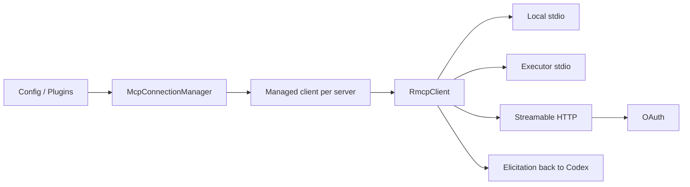

# 18｜MCP 双向集成：外部工具客户端与 Codex 服务端

> 源码基线：`upstream/main@283bc4cf011047314b4804c0f1ccd06e4f6a95c5`（2026-06-24）。

Codex 同时扮演两种角色：

- MCP Client：连接第三方 MCP Server，将工具、资源和 elicitation 接入 Agent；
- MCP Server：把 Codex 自身包装为可被其他客户端调用的 Agent 工具。

## 1. 客户端架构



`codex-mcp` 负责多 Server 聚合、工具命名、来源与 Codex 事件桥接；`rmcp-client` 负责单连接状态机、transport、OAuth、重试和 elicitation。

## 2. Connection Manager 是变更中心

MCP 工具和调用状态的增删改应尽量集中到 `mcp_connection_manager.rs`，避免把动态工具变化穿透 Session 多层。

Manager 负责：

- 并行启动各 Server；
- 单个失败隔离；
- 汇总状态与 startup event；
- 列出工具、资源和模板；
- 调用工具；
- 追踪 Plugin provenance；
- 处理 elicitation response；
- 取消未完成启动。

## 3. 单 Server 状态机

`RmcpClient` 的核心状态为：

```text
Connecting → Ready → Closed
```

Connecting 持有尚未完成握手的 transport；Ready 持有运行中的 rmcp service 和可选 OAuth persistor。只有 Ready 状态能调用 list/call/read。

Streamable HTTP 返回 session-expired 404 时，客户端可以重新 initialize 并重试，而不是要求用户重新配置整个 Server。

## 4. Transport

| Transport | 用途 |
| --- | --- |
| Local stdio | 在 Codex 主机本地启动 Server |
| Executor stdio | 在选定执行环境中启动并桥接字节流 |
| Streamable HTTP | 远程 MCP，支持 JSON / SSE response |
| In-process | 内置服务或测试 |

Executor stdio 使 MCP Server 可以运行在远程或受限环境，同时协议聚合仍由主进程管理。

stdio child 会进入独立进程组，关闭时先 terminate、超时后 kill，避免遗留孙进程。

## 5. OAuth

HTTP Server 可走 OAuth discovery、PKCE 和本地 callback。Credential 优先存入 OS keyring，必要时回退到受权限保护的文件。

认证状态、scope 不足与普通 transport 失败需要分别报告。Plugin 或 App Connector 的认证失败还可以转换为 elicitation，引导用户完成登录。

## 6. Elicitation

MCP Server 可以在工具调用中途请求：

- form input；
- URL 操作；
- OpenAI 扩展表单。

`ElicitationRequestManager` 将请求映射到 Codex 事件，等待 UI、App Server 或 reviewer 回复，再返回 MCP Server。

等待用户期间，active-time timeout 会暂停计算，避免用户思考时间被误判为 Server 超时。只有空 schema 等极窄场景可自动接受，其余默认需显式处理。

## 7. 工具命名

MCP 名称由外部服务控制，可能包含 Responses API 不允许的字符或发生冲突。Codex 会：

- sanitize namespace/name；
- 限制长度；
- 在冲突时加入稳定 hash；
- 保留 callable name 到原 MCP tool 的映射。

这层适配确保模型看到合法名称，而实际调用仍回到正确 Server 与原始工具名。

## 8. Direct 与 Deferred

MCP 工具可直接进入模型 tool list，也可作为 Deferred 工具由 tool search 发现。选择取决于配置、数量、Plugin/Connector 选择和上下文预算。

MCP 的 read-only hint 可帮助并发判断，但外部声明不是绝对安全证明；审批与 sandbox 仍由 Codex 侧控制。

## 9. Codex 作为 MCP Server

`codex-rs/mcp-server` 通过 stdio 处理 MCP 请求，主要暴露：

- `codex`：启动新 Codex 会话；
- `codex-reply`：根据 `thread_id` 继续已有会话。

一次 tool call 内部会运行真实 Codex thread，并将输出与审批/elicitation 事件映射回外部客户端。服务端能力面刻意较小，不等于把 App Server 全部 RPC 搬到 MCP。

## 10. 源码阅读路线

```bash
rg -n "struct McpConnectionManager" codex-rs/codex-mcp/src
rg -n "enum ClientState|struct RmcpClient|reinitialize_after_session_expiry" \
  codex-rs/rmcp-client/src
rg -n "ExecutorStdioServerLauncher|process_group" codex-rs/rmcp-client/src
rg -n "ElicitationRequestManager|can_auto_accept_elicitation" codex-rs/codex-mcp/src
rg -n "sanitize_responses_api_tool_name" codex-rs/codex-mcp/src
rg -n '"codex-reply"|run_codex_tool_session' codex-rs/mcp-server/src
```

MCP 双向集成的边界是：

> MCP 提供生态协议，Connection Manager 将其转换为 Codex 可治理的工具与用户交互；App Server 仍是 Codex 自身完整产品协议。
