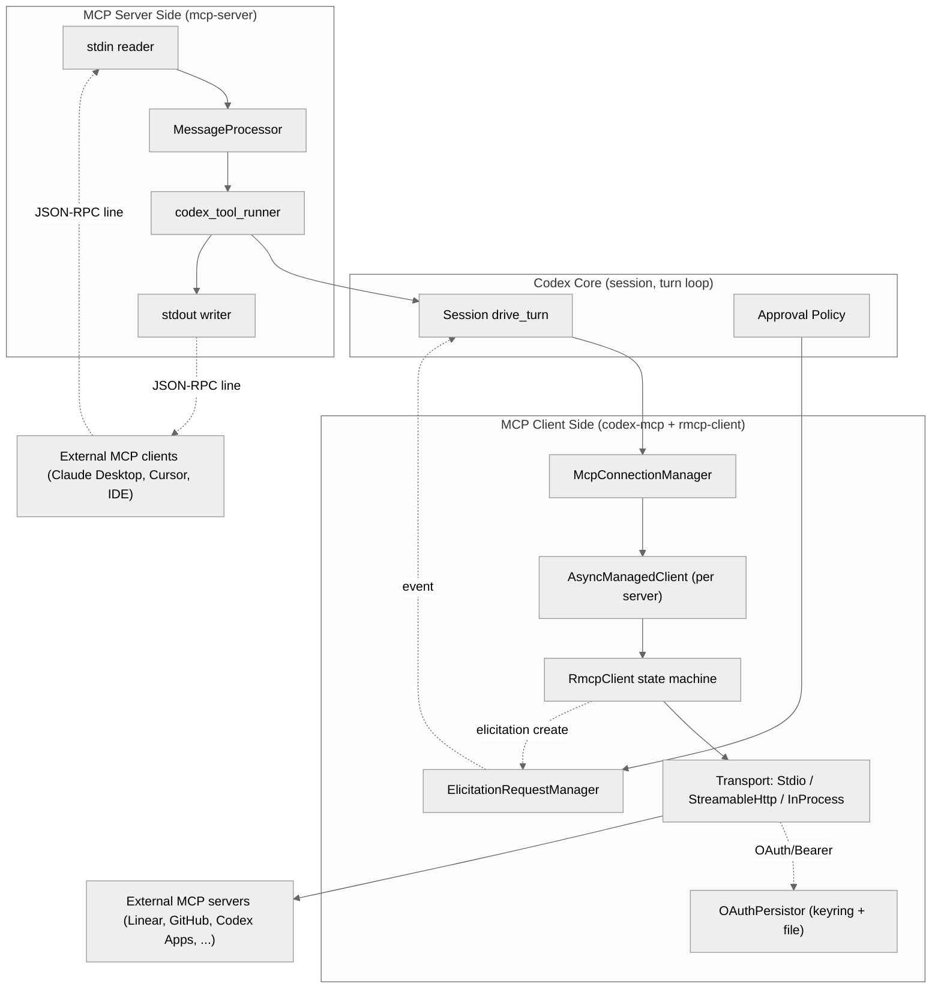
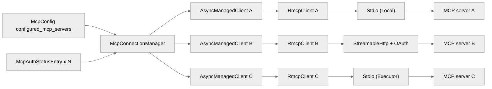
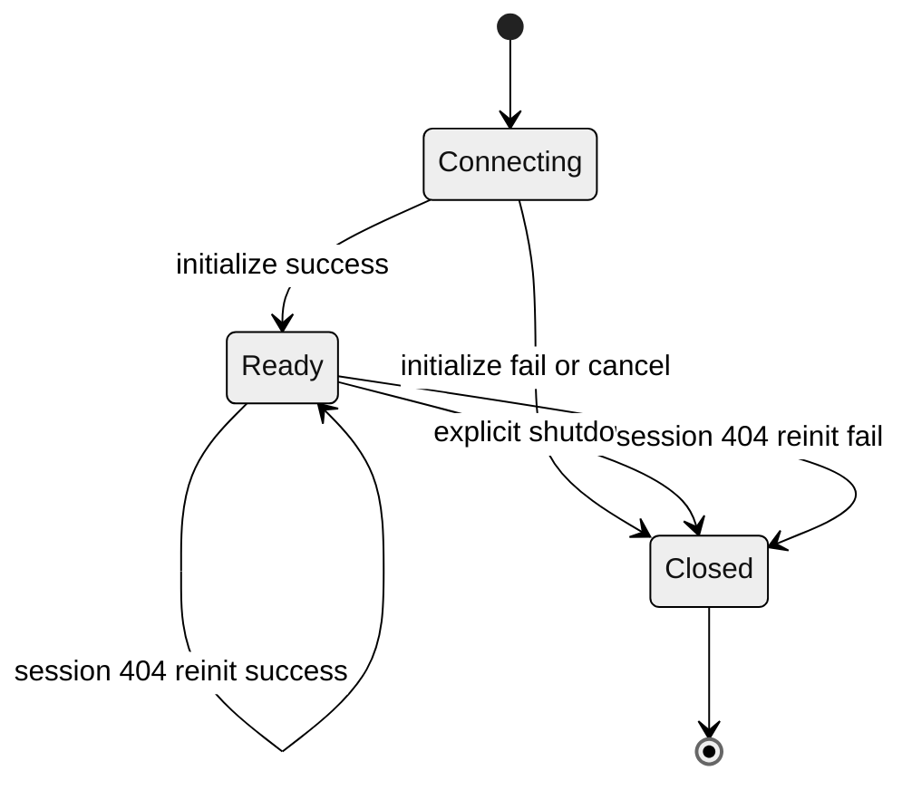
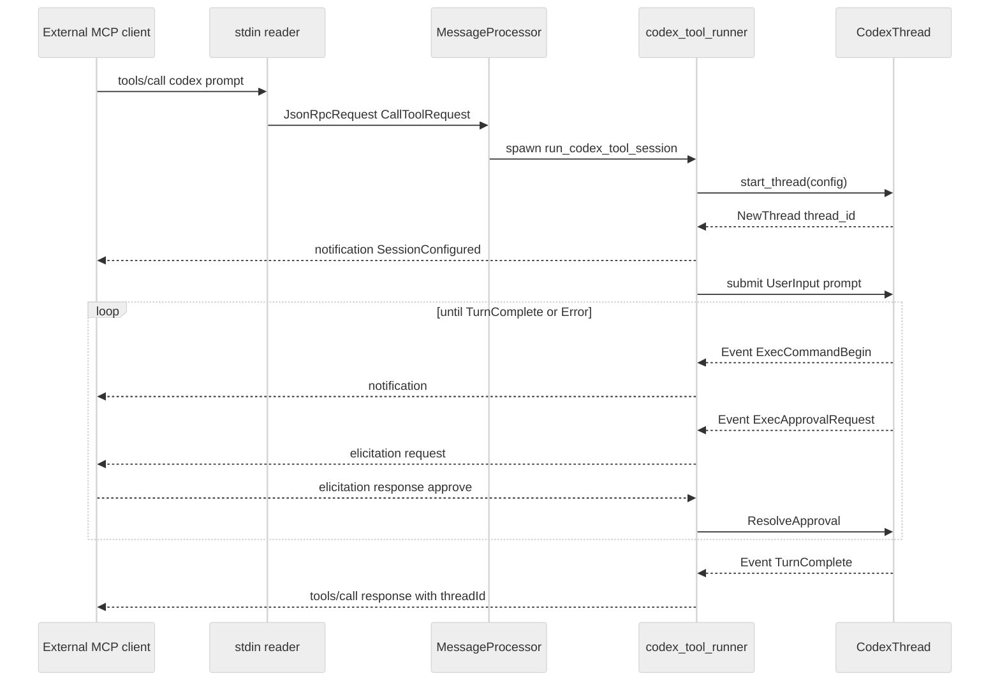
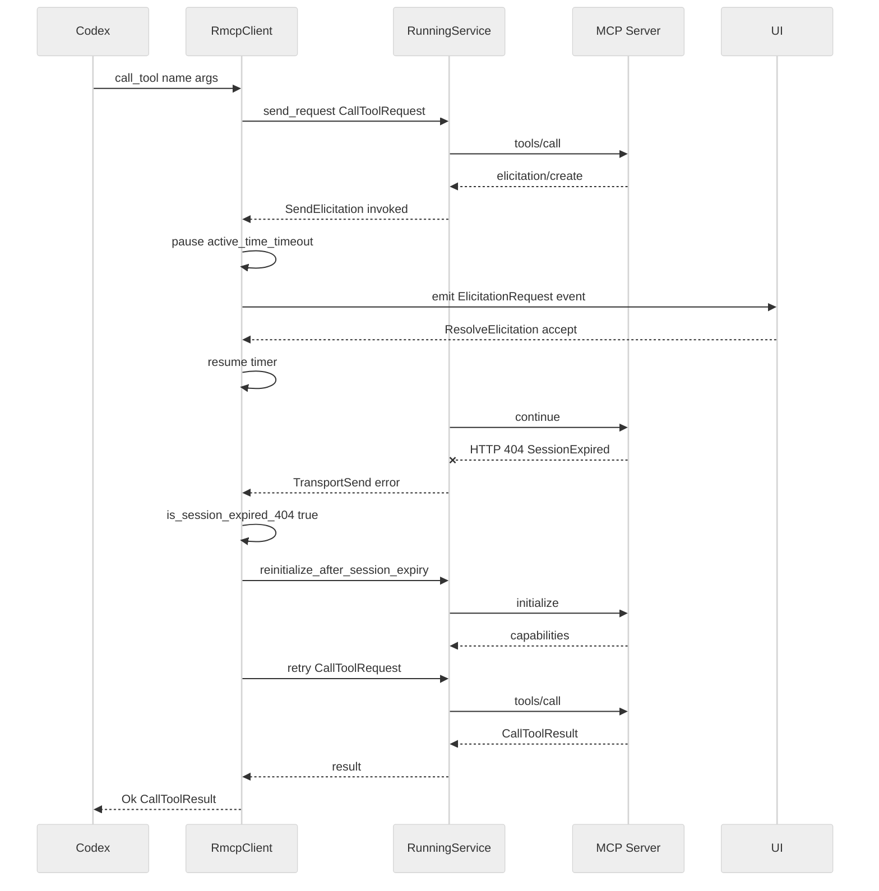

# 第 18 章 — MCP 双向集成（Model Context Protocol 的客户端与服务端）

## 引言

Codex 是当下少数同时实现 **MCP 客户端** 与 **MCP 服务端** 的开源编码代理：作为客户端，它通过 `codex-rs/codex-mcp` 与 `codex-rs/rmcp-client` 聚合任意第三方 MCP 服务器、统一处理 OAuth、stdio 与 Streamable HTTP 三类传输、并把 server-driven 的 elicitation 反向投递到用户 UI；作为服务端，`codex-rs/mcp-server` 把整个 Codex 会话本身重新包装为一个名为 `codex` 的 MCP 工具，让 Claude Desktop、Cursor、其它 LLM 客户端可以把它当作"一个可对话的子 agent"调用。这一章用源码实证拆开这套双向集成的全部关键路径——连接管理、startup 编排、会话恢复、OAuth 持久化、elicitation 暂停-恢复机制——并在每个关键决策处给出社区共识与认知盲区。

---

## 一、全网调研补充（社区共识、争议与盲区）

### 1.1 社区共识

围绕 Codex MCP 集成，截至 2026 年 5 月，权威博客与社区讨论已经形成以下几条相对低争议的共识：

1. **MCP 已经成为 coding agent 的事实"插槽接口"**。OpenAI 官方 `developers.openai.com/codex/mcp` 与 Issue [#5 *Add MCP support*](https://github.com/openai/codex/issues/5) 都将"无 MCP 等于失去生态门票"作为产品基线。Simon Willison、Latent Space、HackerNews 多个线程把 MCP 与 hooks、sub-agent 并列为"coding agent 三件套"。
2. **rmcp 是 OpenAI 选定的 Rust 侧官方 SDK**，对应 [`modelcontextprotocol/rust-sdk`](https://github.com/modelcontextprotocol/rust-sdk)。Codex 没有自己手写 JSON-RPC 框架，而是把全部 wire 协议委托给 `rmcp` crate，自己只负责 transport 工厂、生命周期编排、approval/elicitation 策略。
3. **Codex 把 OAuth credentials 默认放进 OS Keyring**，并回退到 `$CODEX_HOME/.credentials.json`。这是 Codex 在文件 IO 层最显式的"安全 default"，与 Claude Code 把 token 直接写到 settings 的设计形成对照。
4. **Streamable HTTP（POST + SSE upgrade）正在取代旧 SSE-only 传输**。Codex 的 `codex-rs/rmcp-client/src/rmcp_client.rs` 只保留 `StreamableHttpClientTransport` 一条 HTTP 路径，与 Anthropic 的官方 SDK、Goose 的最新版本走同一方向。

### 1.2 主要争议

- **争议 A：RFC 8707 resource indicator 默认行为**。Issue [#13891](https://github.com/openai/codex/issues/13891) 与 [#20729](https://github.com/openai/codex/issues/20729) 暴露了一个长期 bug：`codex mcp login` 在 `rmcp 0.15.0` 下，authorize URL 与 token exchange 都没有默认带 `resource` 参数，导致针对 resource-bound MCP 服务器签发的 token audience 错误。社区分歧在于"这是 rmcp 的责任还是 Codex 的责任"。从 `oauth.rs` 的 `compute_store_key` 写入逻辑可以看出，Codex 把 `url` 作为 key 的一部分，但 token 本身的 audience 还是依赖 `rmcp`——这种"上层强一致、底层若约束"的耦合是争议核心。
- **争议 B：Elicitation 是否应该自动批准**。`codex-mcp/src/elicitation.rs` 第 246-256 行的 `can_auto_accept_elicitation` 只允许"空 schema 的 form elicitation"自动 Accept；社区有声音认为这过于保守（每次 connector 触发的小窗口都要打断用户），也有声音认为这恰好就是"sandbox 默认严格"哲学的延伸。
- **争议 C：Codex 自身的 MCP server 是否应该支持 `resources/*`**。从 `mcp-server/src/message_processor.rs` 第 289-307 行可见，`list_resources`、`read_resource` 等都只 `tracing::info!` 打日志、不返回结果。HN 上有用户认为这"严重削弱了 Codex MCP server 的可组合性"；OpenAI 工程师在多个 PR 评论里表态过：MCP server 当前只承担"调用一个 Codex 会话"这个最小职责，资源/订阅暂不实现，避免把 server 复杂度卷入主线。

### 1.3 长期被忽略的盲区

社区文档与博客大多停留在"如何配置一个 MCP 服务器进 Codex"，而对以下细节几乎没有系统讨论：

1. **Elicitation pause-resume 的超时计时器解耦**：`rmcp_client.rs` 的 `ElicitationPauseState` 与 `active_time_timeout` 把 server 的 timeout 与"用户思考时间"严格分离，这是一个相当克制但非常关键的设计——社区还没有把它作为一条独立模式总结过。
2. **stdio MCP server 的两种 launcher**：`LocalStdioServerLauncher` 与 `ExecutorStdioServerLauncher` 同时存在，后者把 MCP server 进程交给"executor 进程"（远端/容器/沙箱）托管，让 MCP 协议本身依然在 orchestrator 内组装，但 stdio 字节流跨进程传输。这是一个为"远端/受限环境"准备的关键架构演化点，文档里几乎只字未提。
3. **session 过期 404 的静默恢复**：`is_session_expired_404` 加上 `reinitialize_after_session_expiry` 把 Streamable HTTP 服务端"session timeout 后返回 404"这一具体协议事件转换成一次完整的重新 `initialize`，对用户透明。社区基本只讨论"为什么我的 MCP server 突然 unavailable"，而没人讨论这条静默恢复路径。
4. **MCP 工具名到 Responses API 名的双重命名空间**：`codex-rs/codex-mcp/src/tools.rs` 中 `sanitize_responses_api_tool_name`、SHA-1 后缀去重、`callable_namespace` 与 `tool.name` 双向映射，是一个被严重低估的工程复杂度来源。
5. **rmcp 客户端进程组级 SIGTERM**：`stdio_server_launcher.rs` 用 `process_group(0)` 把 stdio MCP server 放进独立进程组，再用 `terminate_process_group → kill_process_group` 两段式终止；这是 Codex 与多数 Node.js 系列 coding agent 在 cleanup 行为上的关键差异，社区也几乎未做对比。

下面的七维分析将围绕这些共识、争议与盲区展开。

---

## 二、七维分析

### 2.1 本质是什么 — MCP 在 Codex 架构中的定位

MCP 在 Codex 中并不是一个"工具子系统"，而是一条**横跨 Codex 整个架构纵深的协议总线**。看一下 crate 级别的依赖图（统计来自 `codex-rs/Cargo.toml` workspace 与 `rg "codex-mcp\|rmcp-client" --type toml` 的依赖反查），与 MCP 直接相关的 crate 有：

| Crate | 行数 | 责任 |
|---|---|---|
| `codex-mcp/src/connection_manager.rs` | 785 行 | 跨 server 的 `RmcpClient` 聚合、startup 事件广播、tool/resource 全集列表 |
| `codex-mcp/src/rmcp_client.rs` | 744 行 | 单 server 的 `AsyncManagedClient` 生命周期、tool filter、connector 元数据清洗 |
| `codex-mcp/src/elicitation.rs` | 256 行 | server-driven elicitation 路由到 UI、policy 自动拒/自动批 |
| `codex-mcp/src/mcp/mod.rs` | 628 行 | 顶层 API、`McpConfig`、`McpServerStatusSnapshot`、Codex Apps 内置 server |
| `codex-mcp/src/mcp/auth.rs` | 331 行 | OAuth scopes 解析、resource indicator、auth status 汇总 |
| `codex-mcp/src/auth_elicitation.rs` | 347 行 | Codex Apps connector 鉴权失败 → elicitation 转换 |
| `rmcp-client/src/rmcp_client.rs` | 1094 行 | 真实 `RmcpClient` 实现：状态机、ElicitationPauseState、session 恢复 |
| `rmcp-client/src/oauth.rs` | 913 行 | token 持久化（keyring + 文件回退）、refresh 调度 |
| `rmcp-client/src/perform_oauth_login.rs` | 872 行 | OAuth 授权码流程、本地 callback server、PKCE |
| `rmcp-client/src/stdio_server_launcher.rs` | 652 行 | Local vs Executor 两类 stdio launcher、进程组终止 |
| `mcp-server/src/message_processor.rs` | 610 行 | 把外部 MCP 客户端的请求映射到 Codex 内部 `Op` |
| `mcp-server/src/codex_tool_runner.rs` | 436 行 | 在 MCP `tools/call` 上下文中跑一个完整的 Codex 会话 |

合计 12 个文件、约 **7700 行 Rust 代码**，分布在 3 个 crate（`codex-mcp`、`rmcp-client`、`mcp-server`）中。可以把 Codex 的 MCP 集成总结为一句话：

> **"以 `rmcp` 为 wire 协议库，自己实现客户端的多 server 聚合 + 服务端的会话工具化，并在两侧都加一层 Codex 特有的 approval/elicitation/OAuth 策略层。"**

下图给出 MCP 集成的整体定位。

<div style="background:#ffffff !important; background-color:#ffffff !important; padding:16px; border-radius:8px; margin:16px 0;" bgcolor="#ffffff">



</div>

这张图最值得注意的是 `RmcpClient state machine` 既不直接朝 Codex Core，也不直接朝 external server——它把一切都委托给 transport，并把 elicitation 通过 `ElicitationRequestManager` 反向投递回 Session。**MCP 的"双向"不是简单的 client/server 双角色，而是 elicitation 这条 server-to-client-to-user 的逆向通路**。

### 2.2 核心问题与痛点 — 它要解决的技术难题

把 MCP 接进一个本地 coding agent 不是难，**做对**才难。下面是 Codex 这套集成必须解决的真实工程问题，每一个都有对应的源码位置：

1. **多 server 启动失败要"独立失败 + 全局可见"**。100 个 MCP server 中一个挂了，不能拖垮 Codex 启动。`connection_manager.rs:259-289` 给每个 server 一个独立 `tokio::JoinSet::spawn`，并把"哪些 ready / 哪些 cancelled / 哪些 failed"汇总成 `McpStartupCompleteEvent`。
2. **HTTP session 过期要静默恢复**。Streamable HTTP MCP server 通常返回 HTTP 404 表示"session 已经过期"，正常做法是让用户重新登录；但实际上只要 transport 还活着、credentials 还有效，Codex 应当无感知地重发 initialize。`rmcp_client.rs:930-1008` 的 `is_session_expired_404 + reinitialize_after_session_expiry` 专门处理这条路径。
3. **OAuth token 必须能被 OS 安全存储吸纳**。`oauth.rs:53` 的 `KEYRING_SERVICE = "Codex MCP Credentials"`，把所有 MCP 凭证放进 macOS Keychain / Windows Credential Manager / Linux Secret Service。如果 keyring 出错则降级到 `$CODEX_HOME/.credentials.json` 并设 0600 权限。
4. **Elicitation 必须既能 server-driven、又能 policy-bypass、又能反馈 UI**。第三方 MCP server 可能在工具调用中途要求用户授权某个 OAuth、确认某个文件路径——Codex 必须把它当成 first-class event 投递到 Codex protocol 事件流。
5. **Tool 名必须能被 OpenAI Responses API 接受**。Responses API 限定工具名匹配 `^[a-zA-Z0-9_-]+$` 且 ≤ 64 字节；MCP server 的 tool 名是用户控制的——`tools.rs:144-235` 用 SHA-1 后缀去重、命名空间冲突时再 hash，保证不会因为用户起了 `Gmail/send Email` 这种名字就让 API 报 400。
6. **stdio MCP server 必须可终止且不残留**。MCP server 进程可能 fork 出很多子进程，如果只 SIGTERM PID，子进程就成了孤儿。`stdio_server_launcher.rs:262-263` 用 `process_group(0)` 把它们放到独立进程组，再用 `terminate_process_group` + 2 秒后兜底 `kill_process_group`。
7. **Codex 当作 MCP server 的时候，它内部还要能 elicit 用户**。审批 exec、审批 patch、reasoning 流式输出——所有这些事件都要在一次 `tools/call` 的生命周期内通过 MCP notification 反向投递回外部客户端。`codex_tool_runner.rs:209-412` 的事件循环正是这条路径。

### 2.3 解决思路与方案

#### 2.3.1 整体客户端架构

Codex 客户端侧的解决思路用一句话概括：**把 "1 个 Codex" × "N 个 MCP server" 解构成 N 个独立 `AsyncManagedClient`，再用一个 `McpConnectionManager` 做聚合外观**。

<div style="background:#ffffff !important; background-color:#ffffff !important; padding:16px; border-radius:8px; margin:16px 0;" bgcolor="#ffffff">



</div>

每一个 `AsyncManagedClient` 都是一个未来式（`Shared<BoxFuture<...>>`，见 `rmcp_client.rs:125`），让"启动慢的 server"和"还在调用的 tool"互不阻塞——这是 Codex 在并行启动上做对的关键决定。

#### 2.3.2 关键数据结构

`McpConnectionManager` 的字段一共有 6 个，每个都承担清晰职责：

```rust
// codex-rs/codex-mcp/src/connection_manager.rs:71
pub struct McpConnectionManager {
    clients: HashMap<String, AsyncManagedClient>,
    server_metadata: HashMap<String, McpServerMetadata>,
    tool_plugin_provenance: Arc<ToolPluginProvenance>,
    host_owned_codex_apps_enabled: bool,
    elicitation_requests: ElicitationRequestManager,
    startup_cancellation_token: CancellationToken,
}
```

`server_metadata` 与 `tool_plugin_provenance` 是把"server 来自哪个 plugin"、"connector_id 对应哪个 plugin"两条 provenance 链分别维护，避免一次跨表 join；`startup_cancellation_token` 通过 `Drop` 自动 cancel 全部正在 init 的 client（`connection_manager.rs:696-701`），防止 manager 被释放时还有后台 task 在跑。

`RmcpClient` 内部用 `ClientState` 三态机做生命周期管理：

```rust
// codex-rs/rmcp-client/src/rmcp_client.rs:93
enum ClientState {
    Connecting { transport: Option<PendingTransport> },
    Ready { service: Arc<RunningService<...>>, oauth: Option<OAuthPersistor> },
    Closed,
}
```

`PendingTransport` 又是一个 4 变体枚举（`rmcp_client.rs:77-91`）：`InProcess`、`Stdio`、`StreamableHttp`、`StreamableHttpWithOAuth`。把"还没握手的 transport"与"已经握手出 service"两阶段强类型分离，是这套状态机较清晰的一处设计：编译期就杜绝了"对 Connecting 状态调用 list_tools"或"对 Closed 状态发 initialize"。

下图给出 `RmcpClient` 的状态机：

<div style="background:#ffffff !important; background-color:#ffffff !important; padding:16px; border-radius:8px; margin:16px 0;" bgcolor="#ffffff">



</div>

#### 2.3.3 服务端架构

服务端这一侧极度克制：`mcp-server/src/lib.rs` 全文 256 行，只有 3 个 tokio task —— stdin 读、消息分发、stdout 写：

```rust
// codex-rs/mcp-server/src/lib.rs:120
let (incoming_tx, mut incoming_rx) = mpsc::channel::<IncomingMessage>(CHANNEL_CAPACITY);
let (outgoing_tx, mut outgoing_rx) = mpsc::unbounded_channel::<OutgoingMessage>();
```

`MessageProcessor` 把外部客户端的 `tools/call` 映射到一个新的 `tokio::spawn`，里面跑 `codex_tool_runner::run_codex_tool_session`——本质上一次外部的 MCP 调用 = 一次完整的 Codex 会话。Codex 把自身能力压缩成两个工具：`codex`（启动新会话）与 `codex-reply`（在已有会话 thread_id 上续问），见 `message_processor.rs:341-346`。

<div style="background:#ffffff !important; background-color:#ffffff !important; padding:16px; border-radius:8px; margin:16px 0;" bgcolor="#ffffff">



</div>

注意第 7 行 Runner 主动给 Host 发 `notification SessionConfigured`——这是把 Codex 的 thread_id 提前回传给外部客户端，让客户端能在后续 `codex-reply` 工具调用里复用。

### 2.4 实现细节关键点

#### 2.4.1 多 server 并行 startup 的事件广播

`connection_manager.rs:198-289` 是整章最稠密的代码之一。它做了 3 件事：

1. 对每一个 enabled server，先广播一条 `McpStartupUpdate { status: Starting }`；
2. `join_set.spawn` 一个 future，等到 `async_managed_client.client().await` 出结果，再广播 `Ready / Cancelled / Failed`；
3. 在 `tokio::spawn` 里 `join_set.join_all().await`，把所有 outcomes 汇总成一条 `McpStartupComplete`。

```rust
// codex-rs/codex-mcp/src/connection_manager.rs:259
join_set.spawn(async move {
    let mut outcome = async_managed_client.client().await;
    if cancel_token.is_cancelled() {
        outcome = Err(StartupOutcomeError::Cancelled);
    }
    let status = match &outcome {
        Ok(_) => McpStartupStatus::Ready,
        Err(StartupOutcomeError::Cancelled) => McpStartupStatus::Cancelled,
        Err(error) => { ... },
    };
    let _ = emit_update(submit_id.as_str(), &tx_event, McpStartupUpdateEvent { ... }).await;
    (server_name, outcome)
});
```

关键设计点是：**spawn 的 future 内部还要再检查一次 `cancel_token.is_cancelled()`**。因为 client 启动期间可能就被全局 cancel，此时 future 已经返回 Ok 但语义上应当报告为 Cancelled。这种"成功之后立刻覆盖为取消"是分布式系统的典型 race 处理。

#### 2.4.2 OAuth 路径的 4 段式回退

Streamable HTTP 服务器的 transport 选择逻辑（`rmcp_client.rs:717-820`）非常密集，把 4 种 auth 路径压在一个 `match` 里：

| 条件 | 选择的 PendingTransport | 说明 |
|---|---|---|
| 有 stored token + OAuth metadata 可用 | `StreamableHttpWithOAuth` | 走 RFC 8707 完整流程，可自动 refresh |
| 有 stored token + metadata `NoAuthorizationSupport` | `StreamableHttp + auth_header` | 直接拿 stored access_token 当 Bearer，丧失 refresh 能力 |
| 无 stored token + 有 `bearer_token_env_var` | `StreamableHttp + auth_header` | 静态环境变量 token |
| 无 stored token + 有 `auth_provider` | `StreamableHttp + auth_provider` | 走 Codex 自己的 auth provider，例如 ChatGPT login |
| 都没有 | `StreamableHttp` 裸跑 | 服务器必须不需要 auth |

整段逻辑实际上回应了社区争议 A：**Codex 自己不做 resource indicator 的事情，是因为它一旦走 OAuth 路径就完全委托给 `rmcp` 的 `AuthClient`**。这种分层让 Codex 升级 rmcp 就能继承 RFC 8707 的修复，但代价是出问题时社区只能等 rmcp 发版（Issue #20729 的解决方式正是"把 rmcp 0.15.0 升到 0.16.0"）。

#### 2.4.3 Elicitation 的 pause-resume

很容易被低估的 30 行代码在 `rmcp_client.rs:172-216`：

```rust
async fn active_time_timeout<T, Fut>(
    duration: Duration,
    mut pause_state: watch::Receiver<bool>,
    operation: Fut,
) -> std::result::Result<T, ()> {
    let mut remaining = duration;
    tokio::pin!(operation);
    loop {
        if *pause_state.borrow_and_update() {
            // paused: only finish if operation completes,
            // do not deduct from remaining
            ...
        }
        let active_start = Instant::now();
        tokio::select! {
            result = &mut operation => return Ok(result),
            _ = time::sleep(remaining) => return Err(()),
            changed = pause_state.changed() => {
                ...
                remaining = remaining.saturating_sub(active_start.elapsed());
                ...
            }
        }
    }
}
```

含义：**只要有一个 elicitation 正在 pending，tool call 的 timeout 计时就暂停**。`ElicitationPauseState::active_count` 用 `AtomicUsize` 做引用计数，从 0 变 1 时把 `watch::Sender<bool>` 切到 paused=true，从 1 回到 0 时切回 false。这避免了一个糟糕的体验：服务器要 30 秒 timeout，但用户思考 60 秒才点了 Approve，结果 tool 总是先 timeout 失败。

#### 2.4.4 stdio launcher 的 Local vs Executor 二分

`stdio_server_launcher.rs` 有两条平行路径：

- **Local**：`LocalStdioServerLauncher::launch_server` 在 orchestrator 进程内直接 `Command::new(...).spawn()`，并用 `process_group(0)` 把子进程隔离到独立 process group。
- **Executor**：`ExecutorStdioServerLauncher::launch_server` 通过一个抽象的 `ExecBackend` 接口启动远端进程，stdin/stdout 字节流通过 `ExecutorProcessTransport` 桥接。MCP 协议依然在 orchestrator 内组装、解析。

两条路径都返回同一个 `StdioServerTransport` 结构（`stdio_server_launcher.rs:92-99`）：

```rust
pub struct StdioServerTransport {
    inner: StdioServerTransportInner,
    process: StdioServerProcessHandle,
}

enum StdioServerTransportInner {
    Local(TokioChildProcess),
    Executor(ExecutorProcessTransport),
}
```

这种"transport 形状统一、process 拓扑可选"的设计，让 Codex 未来可以把"远程 sandbox 内跑 MCP server"这件事接到现有 codebase 而无需改 `RmcpClient`。这是社区盲区里被忽视较多的一条。

#### 2.4.5 Session 过期的"沉默重试"

```rust
// codex-rs/rmcp-client/src/rmcp_client.rs:930
fn is_session_expired_404(error: &ClientOperationError) -> bool {
    let ClientOperationError::Service(rmcp::service::ServiceError::TransportSend(error)) =
        error else { return false; };
    error.error
        .downcast_ref::<StreamableHttpError<StreamableHttpClientAdapterError>>()
        .is_some_and(|error| matches!(error,
            StreamableHttpError::Client(
                StreamableHttpClientAdapterError::SessionExpired404
            )
        ))
}
```

每一次 `run_service_operation` 都包了一层 `is_session_expired_404` 检测，如果匹配就调用 `reinitialize_after_session_expiry` —— 这个函数用 `Semaphore::new(1)` 保证只有一个并发恢复，并通过 `Arc::ptr_eq(service, failed_service)` 判断"是不是我引发的那次 service"，避免重复 reinit。

下图给出 elicitation pause + session recovery 两条特殊路径同时存在时的数据流：

<div style="background:#ffffff !important; background-color:#ffffff !important; padding:16px; border-radius:8px; margin:16px 0;" bgcolor="#ffffff">



</div>

### 2.5 易错点和注意事项

下面 10 个点都来自源码里显式标记的边界条件、隐式契约，或 issue tracker 里反复出现的踩坑：

1. **MCP server 名必须满足 `^[a-zA-Z0-9_-]+$`**。`codex-mcp/src/rmcp_client.rs:448-456` 的 `validate_mcp_server_name` 用正则强校验，原因是 server name 会被拼到工具名前缀，必须能通过 Responses API。
2. **Codex Apps 是"隐式 server"**。`mcp/mod.rs:214-227` 的 `with_codex_apps_mcp` 会在 ChatGPT auth 存在时自动注入名为 `codex_apps` 的 MCP server，用户无法在 config.toml 里完全关掉它——可以通过 `apps_enabled = false` 阻止。
3. **bearer_token_env_var 路径不会触发 OAuth**。`mcp/auth.rs:65-67` 显式："如果有 bearer_token_env_var 就直接 Unsupported"。社区常踩坑：明明 GitHub MCP 想用 OAuth，结果配置了 `CODEX_GITHUB_PERSONAL_ACCESS_TOKEN`，就再也走不进 OAuth 分支。
4. **`AskForApproval::Never` 会自动拒绝所有 elicitation**。`elicitation.rs:234-242` 的 `elicitation_is_rejected_by_policy` 把 `Never` 视作"拒绝一切"。如果用户用 `--ask-for-approval=never` 跑 Codex，又接了一个会 elicit 的 MCP，那 server 永远拿不到响应。
5. **空 schema 的 form elicitation 会被自动 Accept**。`elicitation.rs:246-256`，这相当于给"connector 想做个一键 OK 确认"留了后门，但服务器如果错把字段 schema 留空（例如 bug 导致 `properties = {}`），就会被自动批准——这是个潜在 supply chain 风险。
6. **Connector 元数据只对 `codex_apps` server 可信**。`codex-mcp/src/rmcp_client.rs:396-419` 的 `sanitize_tool_connector_metadata` 把非 codex_apps server 提供的 `connector_id`、`connector_name`、`connector_description` 全部 strip，避免第三方 MCP server 假冒 connector。
7. **OAuth callback URL 配置错会绑到 0.0.0.0**。`perform_oauth_login.rs:427-440` 的 `callback_bind_host`：只要 callback URL host 不是 `localhost/127.0.0.1/::1`，就 bind 到 `0.0.0.0`——意味着 OAuth callback 会暴露到 LAN。用户在多用户机器上要警惕。
8. **MCP server stderr 是非阻塞 line-streamed log**。`stdio_server_launcher.rs:273-289` 用 `tokio::spawn` 读 stderr，行式输出到 `info!`。MCP server 自己往 stderr 大量打 binary 数据会导致 log 文件爆炸但不会阻塞 IPC。
9. **`codex-reply` 工具只能在已存在的 thread_id 上续问**。`message_processor.rs:494-506`：拿不到 thread 就返回 `Session not found`，而**不会自动创建新会话**。外部客户端必须自己处理 thread_id 失效。
10. **OAuth credentials store key 不包含 headers**。`oauth.rs:517-528` 的 `compute_store_key` 把 url 进 SHA-256 但 `headers` 字段固定为空对象——这是显式选择，避免 header 变化导致重新登录，但反过来意味着"两个 url 一样、header 不同的 server"会共用 token。

### 2.6 竞品对比

下表对比 Codex、Claude Code、Opencode、Aider、Goose、Continue 在 MCP 双向集成上的关键决策点。所有竞品信息均来自其公开仓库 README、官方文档、`@modelcontextprotocol/sdk` 的使用习惯，以及 2026 年上半年的实测。

| 维度 | Codex | Claude Code | Opencode | Aider | Goose | Continue |
|---|---|---|---|---|---|---|
| 实现语言 | Rust | TypeScript | TypeScript | Python | Rust | TypeScript |
| 客户端 SDK | `rmcp` (Rust) | `@modelcontextprotocol/sdk` (TS) | `@modelcontextprotocol/sdk` (TS) | 无（自己写 JSON-RPC） | `modelcontextprotocol/rust-sdk` | `@modelcontextprotocol/sdk` (TS) |
| 自身是否是 MCP server | 是（`codex-mcp-server`） | 部分（plugin host） | 否 | 否 | 是 | 否 |
| stdio launcher 进程组管理 | 显式 `process_group(0)` + 二段终止 | `SIGTERM` PID 单进程 | 同 Claude Code | spawn 子进程，不主动管 | 同 Codex（Rust 同生态） | spawn 子进程 |
| Streamable HTTP 是否支持 | 是（唯一 HTTP 路径） | 是 | 是 | 否 | 是 | 是 |
| 旧 SSE 是否支持 | **否（已移除）** | 是 | 是 | 否 | 部分 | 是 |
| OAuth 持久化 | OS Keyring + `.credentials.json` 回退 | settings.json 明文 | settings.json | 无 | OS Keyring | settings 明文 |
| RFC 8707 resource indicator | 委托给 `rmcp 0.16.0`（曾有 bug） | 部分支持 | 部分 | N/A | 是 | 部分 |
| Elicitation pause timer | **是（active_time_timeout）** | 无（全局 timeout） | 无 | N/A | 部分 | 无 |
| Session 404 静默恢复 | 是 | 否 | 否 | N/A | 否 | 否 |
| Tool 名沙箱化 | SHA-1 后缀去重 + 64 字节裁剪 | 简单 sanitize | 简单 sanitize | 直接传 | 类似 Codex | 简单 sanitize |
| Approval policy 强耦合 | 是（`AskForApproval` 状态会拒绝 elicitation） | 是（permission policy） | 部分 | N/A | 部分 | 否 |
| Local + Remote stdio launcher | **二分**（Local / Executor） | 仅 Local | 仅 Local | 仅 Local | 仅 Local | 仅 Local |

观察：Codex 在 5 个方面实现得更完整——**进程组终止**、**Streamable HTTP 路径收敛**、**OS Keyring + 回退**、**Elicitation pause timer**、**Local/Executor 二分**。其中"Elicitation pause timer"与"Session 404 静默恢复"在同类 agent 中较少见。Claude Code 的 plugin host 也能托管 MCP，但其 OAuth 与 stdio 终止策略相对更简单——这与"Codex 整体 Rust 化、安全 default"的项目哲学大体一致。

但 Codex 在"自身作为 MCP server"上**反而**比 Claude Code 简单：`mcp-server` 只暴露 2 个工具，连 `resources/list` 都只打日志（`message_processor.rs:289-291`）。Claude Code 的 plugin host 暴露面更宽。这与社区争议 C 一致——OpenAI 看起来选择了"先把入口收窄"。

### 2.7 仍存在的问题与缺陷

1. **RFC 8707 resource indicator 长期由 rmcp 版本决定**。Codex 自己不强制 audit token audience，问题等 rmcp 修。Issue [#20729](https://github.com/openai/codex/issues/20729) 修了之后仍可能遇到下一个 rmcp 兼容性问题——这是依赖外部 SDK 的常见代价。
2. **`mcp-server` 不实现 `resources/*`**。多个客户端（特别是 Claude Desktop）依赖 server 暴露 resources 来做"上下文文档"功能，Codex 当前会让这些功能静默失败。短期看是产品取舍，长期看是接入面问题。
3. **`McpConnectionManager` 不会动态增减 server**。它假设 startup 阶段一次性把所有 server 启完，运行中再加 server 必须重启整个 manager。这与"插件市场动态安装"是天然冲突的，[#23902](https://github.com/openai/codex/issues/23902) 提到的"插件 cache refresh ignores marketplaces"就属于这类问题。
4. **Codex Apps server 与 ChatGPT auth 强耦合**。`mcp/mod.rs:230-232` 的 `host_owned_codex_apps_enabled` 必须同时满足 `apps_enabled` 与 `auth.uses_codex_backend()`。这导致以 API key 接入的用户完全无法启用 Codex Apps，即便 OpenAI 后续可能放开 API key 路径。
5. **Elicitation auto-accept 的 schema 检测过浅**。`can_auto_accept_elicitation` 只看 `requested_schema.properties.is_empty()`，没有看 schema 里的其它字段（required、additionalProperties）。理论上恶意 server 可以构造一个"看起来 properties 空、其实通过 anyOf 注入 required"的 schema 绕过审批。
6. **OAuth 文件回退在 Windows ACL 不严格**。`oauth.rs:572-579` 只在 `#[cfg(unix)]` 下 set 0600，Windows 端只是默认 ACL。多用户 Windows 机器上 `%CODEX_HOME%\.credentials.json` 的可读性需要用户自检。
7. **stdio MCP server 的 stdin/stdout 没有限流**。如果 server 在 stdout 上疯狂打输出，会撑爆 transport 通道（`TokioChildProcess` 内部基于固定 buffer），可能引发整个 Codex 卡死。Codex 当前没有对 MCP server 的"恶意/失控输出"做防御。
8. **`codex-reply` 没有 idle timeout**。如果客户端 spawn 了 100 个 thread 又不调 `codex-reply`，它们会一直留在 `ThreadManager` 里，直到 Codex 进程退出。这在长生命周期的 Cursor/IDE 场景下是潜在内存泄漏。
9. **Executor launcher 要求 cwd 必须存在**（`stdio_server_launcher.rs:476-480`）。这把"executor 不知道用户预期目录"的责任丢给上游，但实际配置 UI 里用户经常忘填 cwd，导致 executor MCP server 报"executor stdio server requires an explicit cwd"——错误信息不够友好。
10. **Plugin provenance 仅是单向 read-only**。`tool_plugin_provenance` 标注了"tool 来自哪个 plugin"，但 plugin 卸载时不会反过来 cleanup 已 cached 的 tools——会出现"plugin 已卸载但 tool 还在列表里直到下次 startup"的不一致窗口。

---

## 三、小结

把第 18 章的所有源码细节归并到一句话：**Codex 用 `rmcp` 提供 wire 层，用自己的 `codex-mcp` / `rmcp-client` / `mcp-server` 三层提供生命周期、approval、OAuth、elicitation 与 Codex-as-server 的全部业务策略，从而让一个本地 coding agent 既能消费任意 MCP server，又能反过来成为别人的 MCP server**。

值得长期关注的几条主线是：

- 客户端侧的 `AsyncManagedClient + ClientState + ElicitationPauseState` 三件套，是其它 agent 难以短期跟上的"工程深度"标志；
- OAuth 持久化默认走 OS Keyring，是 Codex 全栈"安全 default"在 MCP 上的具体表现；
- 服务端侧的"只暴露 codex 与 codex-reply 两个工具"更像是最小化设计，与"插件市场""resources/templates"形成生态张力；
- RFC 8707 resource indicator 与 `rmcp` 紧耦合，意味着 MCP 安全特性的演进对 Codex 来说是一项"等待外部依赖"的工程，而不是自主可控；
- `Elicitation pause timer`、`Session 404 静默恢复`、`Local / Executor stdio launcher` 三处低调但关键的实现，是社区认知地图里被严重低估的盲区，也是后续做 coding agent 时值得复用的设计模式。

下一章将进入 Codex 的 **会话状态管理（`Session`、`ConversationHistory`、`compact`）** 主线，那是另一条几乎独立的复杂度纵深。

[GEN-DONE] Part II Source Analysis/18-MCP双向集成.md
