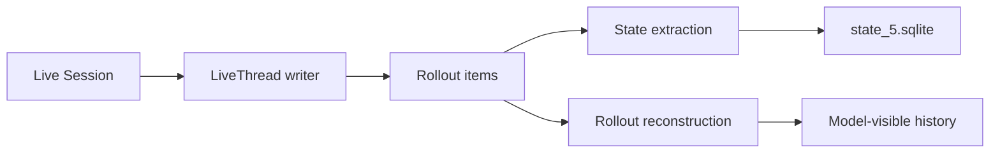

# 19｜会话与轨迹持久化：Rollout、ThreadStore 与状态索引

> 源码基线：`upstream/main@283bc4cf011047314b4804c0f1ccd06e4f6a95c5`（2026-06-24）。

Codex 的线程状态不是一张聊天消息表。当前本地实现至少分为：

- append-oriented rollout items；
- storage-neutral `ThreadStore`；
- SQLite 元数据与搜索索引；
- 从 rollout 重建的模型历史。

## 1. `ThreadStore`

`codex-rs/thread-store` 定义与具体存储无关的接口。应用代码只把 `ThreadId` 当成持久句柄，Store 负责解析到 rollout 文件、内存记录或其他后端。

主要能力包括：

- create / resume / read / delete；
- append items；
- list/search threads；
- list turns/items；
- archive / unarchive；
- update metadata；
- load history。

当前有 `LocalThreadStore` 与 `InMemoryThreadStore`，Core 不应再把“线程一定是本地 JSONL 路径”写死到业务逻辑中。

## 2. Local rollout

本地线程的事件序列以 rollout item 持久化。内容包括：

- session metadata；
- response items；
- event messages；
- compaction / replacement history；
- rollback markers；
-配置与 reference-context 相关记录。

它是恢复语义的重要证据，但“原始每一行直接等于下一次 Prompt”仍是错误理解。恢复需要按事件类型重放。



## 3. SQLite 的职责

`state_5.sqlite` 主要镜像 rollout metadata，支持：

- 线程列表和搜索；
- cwd、provider、git 信息；
- archived / recency；
- backfill 状态；
-关联运行时元数据。

它是查询和状态索引，不替代 rollout 的逐项历史。State crate 会从 rollout item 增量提取 metadata，并支持扫描回填。

当前运行时还使用独立数据库：

- `logs_2.sqlite`
- `goals_1.sqlite`
- `memories_1.sqlite`

不能再把所有 SQLite 状态笼统称为单一 `state_5.sqlite`。

## 4. Resume 不是读文件后原样拼接

`reconstruct_history_from_rollout` 会重放：

-正常 response items；
- compaction replacement history；
- context window 元数据；
- reference context；
- rollback markers；
- previous turn settings；
-持久化 delivery metadata。

重建结果同时包含 history 和 hydration metadata，确保恢复后的下一次采样尽量与原会话连续。

## 5. Compaction

压缩会写入明确的替代历史或压缩事件。恢复时必须应用最后有效的 replacement，而不是同时保留被替代的长历史和摘要。

这也是 rollout 与模型 history 分离的原因：rollout 保留发生过的事件，history 表示重放后的当前有效视图。

## 6. Rollback

Thread rollback 不删除已有 rollout 行，而追加 `ThreadRolledBack` marker，再立即按同样重放逻辑重建内存历史。

恢复时 marker 会删除最新的有效用户回合；多个 marker 累积生效。这样既保留审计轨迹，又能得到回滚后的有效上下文。

回滚要求：

- 存在持久化历史；
- 当前没有正在运行的 turn；
- `num_turns > 0`。

## 7. Fork

Fork 复制父线程的有效历史，并记录 `forked_from_id`。它不是简单复制原始文件：需要先应用 rollback、compaction 与边界截断，再将结果作为新线程初始历史。

首个 fork turn 还要重建父线程 reference context 和 previous settings，然后记录 fork 与当前配置的差异。

## 8. Archive 与 delete

Archive 是元数据状态：线程保留但默认列表可隐藏；unarchive 恢复可见。Delete 才是移除线程存储的独立动作。

API 必须显式传 `include_archived`，避免读取路径在不知情时泄漏已归档线程或错误报告不存在。

## 9. 写入一致性

LiveThread 协调 rollout append 与 metadata 更新。SQLite 或索引写入失败不能让内存会话声称持久化成功；反之，索引可通过 rollout backfill 恢复。

损坏数据库可以备份后重新初始化，但不能把这一动作理解为自动修复已损坏的 rollout。

## 10. 源码阅读路线

```bash
sed -n '1,180p' codex-rs/thread-store/src/lib.rs
rg -n "trait ThreadStore|struct LiveThread|LocalThreadStore" codex-rs/thread-store/src
rg -n "RolloutRecorder|get_rollout_history|persist_rollout" codex-rs/core/src
rg -n "reconstruct_history_from_rollout|ThreadRolledBack" codex-rs/core/src/session
rg -n "STATE_DB_FILENAME|MEMORIES_DB_FILENAME|GOALS_DB_FILENAME" codex-rs/state/src
rg -n "mark_archived|mark_unarchived|backfill" codex-rs/state/src
```

持久化设计的关键是：

> Rollout 保存事件事实，ThreadStore 定义存储契约，SQLite 提供查询索引，重放算法生成当前有效上下文。
