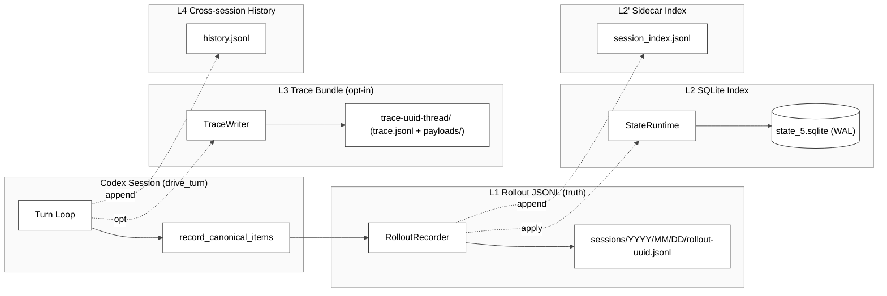
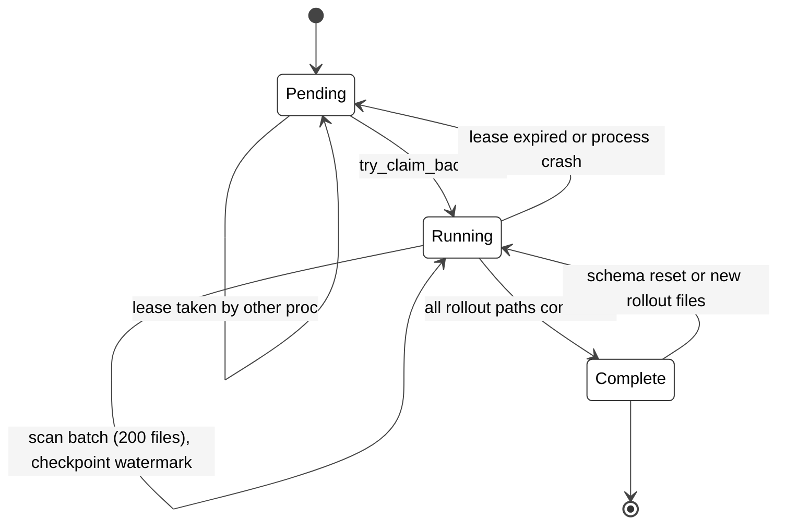
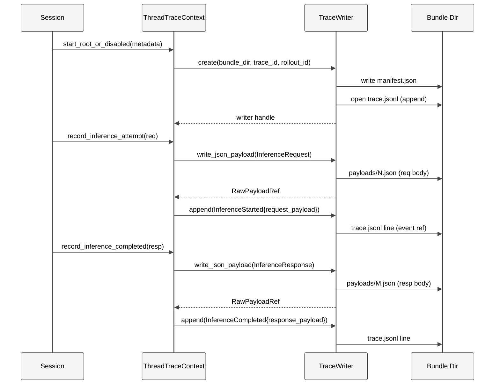
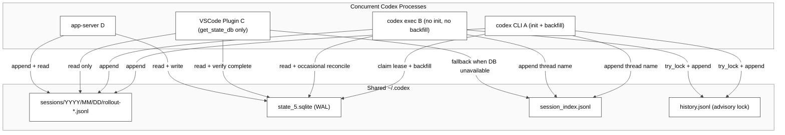
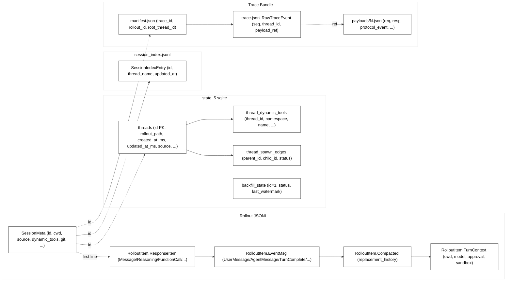
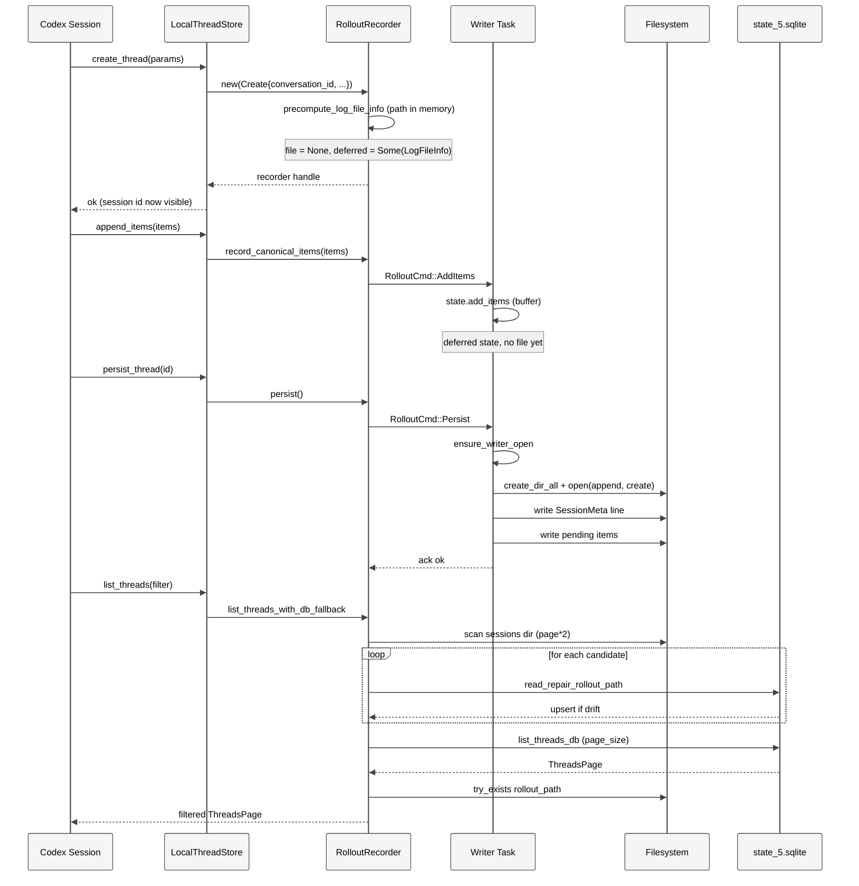

# 第 19 章 — 会话与轨迹持久化（Rollout JSONL、Thread Store 与 Rollout Trace）

## 引言

很多人把 Codex 想成一个"无状态的 CLI 工具"——一行命令、一个回合、一份补丁。事实上它是一台严格意义上的**事件溯源（event sourcing）机器**：每个用户回车、每个模型回应、每次工具调用、每次 compaction、甚至每个 reasoning 段落，都会被原封不动地追加进一份名为 `rollout-*.jsonl` 的本地文件；与此同时 `~/.codex/state_5.sqlite` 充当全部 rollout 的**查询索引**与**生命周期状态机**；如果再打开 `CODEX_ROLLOUT_TRACE_ROOT`，还会有第三份 `trace.jsonl` + `payloads/*.json` 的"原始轨迹包"用于事后语义重放。这一章用源码实证拆开这套三层持久化体系——JSONL append-only 日志、SQLite 元数据索引、Trace Bundle 原始轨迹——并在每个关键决策处给出社区共识、争议焦点与认知盲区。

---

## 一、全网调研补充（社区共识、争议与盲区）

### 1.1 社区共识

围绕 Codex 的持久化机制，截至 2026 年 5 月，社区已经形成以下几条相对低争议的共识：

1. **rollout JSONL 是"事实唯一真源"**。Michael Heap 的 [Parse Codex jsonl with jq](https://michaelheap.com/extract-codex-conversation/)、`TuZit/codex-session-manager` 工具与多个第三方分析都把 `~/.codex/sessions/YYYY/MM/DD/rollout-*.jsonl` 作为可机器解析的会话原始日志，等价于 Claude Code 的 `~/.claude/projects/<slug>/<uuid>.jsonl`。值得一提的是，Heap 的 jq 一行命令在社区被反复引用，说明"用户能用标准工具直接提取自己的会话数据"已经是被广泛认可的 Codex 设计优点。
2. **SQLite 是"查询索引"而非"主存储"**。社区普遍接受 [GitHub Issue #20340](https://github.com/openai/codex/issues/20340) 与 [#21196](https://github.com/openai/codex/issues/21196) 暴露的"`state_5.sqlite` 与 rollout 文件分离"事实：DB 行可以丢，rollout 还在；rollout 文件可以丢，DB 行变成"虚指针"。该 issue 的报告人在自己的 `~/.codex/` 实测发现 91 个 thread 行 vs 1 个 rollout 文件的极端漂移，进一步坐实了"DB 是缓存而非真源"这一认知。
3. **`history.jsonl` 与 rollout 是两个独立体系**。`~/.codex/history.jsonl` 是跨会话的"用户消息全集"（用于 TUI 上下回看历史 prompt），与每会话的 rollout 在写路径、并发模型、生命周期上完全不共享代码。这一点初学者经常误以为 rollout 就是 history，需要在文档中显式区分。
4. **rollout 文件不是"对话副本"，而是"事件流"**。它同时存 `ResponseItem`（模型可见的对话项）、`EventMsg`（运行时事件）、`Compacted`（压缩快照）、`TurnContext`（一回合的环境上下文）、`SessionMeta`（会话头），社区已默认接受这种"五合一"事件包。Simon Willison 在 2025 年 4 月的首发分析里就提到"rollout 是 event-sourcing 风格"，这一标签在后续讨论里被反复沿用。
5. **`state_5.sqlite` 中的 `5` 是 schema 主版本号**。社区已经知道 Codex 会在重大 schema 变更时切换到 `state_6.sqlite` 而不是原地 migrate，这种"重置 + 弃用"策略让 binary 降级更安全，但代价是 DB 文件名携带版本号，hardcode 路径的脚本会破。

### 1.2 主要争议

- **争议 A：SessionId 出现时机是否应等同于"已可恢复"**。[Issue #15870](https://github.com/openai/codex/issues/15870) 指出：transport 失败时 CLI 可能已经向 stdout 打印了 session id，但 `state_5.sqlite` 与 `~/.codex/sessions/...` 都没有对应记录。社区有声音认为"打印 id 就是承诺可恢复"，源码侧（见后文 `precompute_log_file_info` 与 `deferred_log_file_info` 的延迟材料化设计）则更接近"id 是 thread 概念上的存在，物化是另一件事"——这是一个长期未达成共识的语义。issue 至今未关闭，反映出 OpenAI 工程团队也在评估"加 fsync 还是改打印时机"的权衡。
- **争议 B：`session_index.jsonl` 是否应该废弃**。[Issue #20340](https://github.com/openai/codex/issues/20340) 报告了 `session_index.jsonl` 与 SQLite `threads` 表数据偏差 10 条以上的实际案例（26 个 rollout 文件 + 27 个 SQLite 行 + 17 行 session_index）。社区分歧在于"既然 SQLite 已经是索引，为什么还要保留这份纯文本兜底"，但代码侧（`session_index.rs`）保留它正是为了**SQLite 关闭/损坏/未 backfill 时的最后一道线**，是一个有意识的冗余。issue 报告人建议"启动时按 SQLite 重建 session_index"，工程层面则更偏向"以 SQLite 为权威，session_index 仅在 SQLite 不可用时使用"。
- **争议 C：rollout-trace 是否会取代 rollout**。`rollout-trace` crate 的语义比 rollout 更强（带 reducer、payload deduplication、跨 thread 树结构），HN 一些读者把它解读为"下一代 rollout"。但从 `CODEX_ROLLOUT_TRACE_ROOT_ENV` 这种"默认关闭、需要显式开"的产品形态可以看出，它当前依然只是诊断/分析工具，并不取代 rollout 的"产品级会话恢复"职责。两者在产品定位上是**互补的**：rollout 服务于"日常 resume"，trace 服务于"工程诊断"。
- **争议 D：会话能否真的"跨主机迁移"**。Issue 与社区讨论里有不少用户希望 Codex 像 Claude Code SDK 一样支持 `SessionStore` trait 让会话 mirror 到 S3 / Redis。源码侧目前没有这种抽象，rollout_path 也都是绝对路径——这意味着跨主机迁移必须**用户手动 rsync + 保持 cwd 一致**。是否需要做这种抽象，OpenAI 团队未公开表态，社区争议仍在。

### 1.3 长期被忽略的盲区

社区文档普遍只讨论"如何 resume 一个会话"，对以下细节几乎没有系统讨论：

1. **三层持久化的写一致性边界**。同一个回合可能要写入 rollout JSONL、SQLite `threads` 表、`session_index.jsonl`、`history.jsonl`、（可选）trace bundle 五个目的地。Codex 的处理是"以 JSONL 为唯一强一致源 + 其它都允许 lazy reconcile"，没人系统画过这张依赖图。
2. **DeferredLogFileInfo 的延迟材料化**。`RolloutRecorder::new` 对 `Create` 分支不会马上 `open(2)` 文件，而是把 `LogFileInfo` 塞进 `deferred_log_file_info`，等第一次显式 `persist()` 或 `flush()` 被调用才真正建文件。这是 "session id 已出但 rollout 文件不存在"的根本原因，也是 Issue #15870 的源头。
3. **Backfill Lease + Watermark**。`metadata::backfill_sessions_with_lease` 用 SQLite 行实现"租约锁 + 断点续传"，避免多个进程同时 backfill 时把同一份 rollout scan 多次——这是 Codex 跨进程协作的一个被严重低估的工程细节。
4. **`EventPersistenceMode::Limited` vs `Extended` 的过滤白名单**。`policy.rs` 第 135-219 行把 60+ 种 `EventMsg` 显式分类成 `Limited / Extended / Never`，决定了哪些事件能持久化、哪些只是 UI 抖动。这是会话回放保真度的"事实编辑器"，但社区基本只看 ResponseItem。
5. **Rollout Trace Bundle 的 manifest + payload 解耦**。`rollout-trace` 把 `trace.jsonl`（小、append-only、按 seq 排序）与 `payloads/*.json`（大、各自独立的 JSON 文件）刻意分开，并在 writer 中**先写 payload 再写引用它的 event**，保证任何一次中断后 reducer 都不会指向不存在的 payload。这是一个非常克制但很有教科书价值的"先地后空"写顺序，社区几乎未做过文本化总结。
6. **`thread_dynamic_tools` 是 SQLite 而非 rollout 真源**。这与"rollout 是真源"的整体原则相反——动态工具会随版本演化、跨会话继承，所以 SQLite 表才是 source of truth，rollout JSONL 中的 SessionMeta.dynamic_tools 只是历史快照。Resume 时实际从 SQLite 读取而非 JSONL，这一细节在社区分析里几乎未被提及。
7. **`thread_spawn_edges` 的递归 CTE 查询**。sub-agent / fork 形成的会话树通过 `thread_spawn_edges` 表表达，listing 用 `WITH RECURSIVE` BFS 查询，按"深度优先、id 稳定排序"输出。这是 Codex sub-agent 树形可视化的查询基础，但很少有第三方分析涉及。
8. **`record_fallback` metric 的 7 种 reason**。Codex 在每个降级路径都发 metric（`db_unavailable / db_error / metadata_filter / backfill_incomplete / missing_row / stale_db_path_dropped`），形成产品端的"DB 健康度仪表盘"。这套观察体系对评估"SQLite 在真实用户中的可靠性"至关重要，但同样未被社区系统讨论。

下面的七维分析将围绕这些共识、争议与盲区展开。

---

## 二、七维分析

### 2.1 本质是什么 — 持久化在 Codex 架构中的定位

Codex 的会话持久化不是单一模块，而是一个**三层正交结构**：

| 层 | 主 crate / 主文件 | 作用 | 文件位置 | 是否默认开 |
|---|---|---|---|---|
| L1 事件流 | `codex-rs/rollout/src/recorder.rs`（1785 行） | append-only JSONL，会话事件原始记录 | `~/.codex/sessions/YYYY/MM/DD/rollout-*.jsonl` | 是 |
| L2 查询索引 | `codex-rs/state/src/runtime.rs`（594 行） + `runtime/threads.rs`（2132 行） + 34 个 SQL migration | SQLite 行级索引，列表/搜索/恢复入口 | `~/.codex/state_5.sqlite` | 是 |
| L2' 文本兜底索引 | `codex-rs/rollout/src/session_index.rs`（268 行） | 反向扫描的 `session_index.jsonl`，SQLite 不可用时的兜底 | `~/.codex/session_index.jsonl` | 是 |
| L3 原始轨迹包 | `codex-rs/rollout-trace`（13 文件，约 3000 行） | 用于事后语义重放的 trace bundle | `$CODEX_ROLLOUT_TRACE_ROOT/trace-<uuid>-<thread>/` | 否 |
| L4 跨会话历史 | `codex-rs/message-history/src/lib.rs`（435 行） | 跨会话的用户消息全集（TUI ↑↓ 历史） | `~/.codex/history.jsonl` | 受 `history.persistence` 控制 |

定量上，会话持久化主线代码约 **11 600 行 Rust**（参见本章开头 `wc -l` 输出），独立于其它 ~110 个 crate；并且这 5 层有非常清晰的依赖方向：

```
L1 rollout JSONL (强一致, 唯一真源)
        ↓ apply_rollout_item
L2 state_5.sqlite (异步, 可丢可重建)
        ↑ scan & reconcile
L2' session_index.jsonl (顺序追加, 反向读)
        ↓ derived
L3 trace bundle (默认关, 诊断用途)
L4 history.jsonl (独立于 rollout, 跨会话)
```

下图给出整体定位。

<div style="background: #ffffff !important; background-color: #ffffff !important; border: 1px solid #d0d7de; border-radius: 8px; padding: 16px; margin: 16px 0; overflow-x: auto;" bgcolor="#ffffff">



</div>

这张图表达出 Codex 持久化的"哲学定位"：**JSONL 是会话的事实，SQLite 是会话的目录卡片，trace bundle 是会话的科研笔记，history 是用户的口袋笔记本——四份产物各自服务不同读者，互不替代。**

### 2.2 核心问题和痛点 — 持久化要解决的技术难题

Codex 持久化要同时满足以下几组互相冲突的需求，**任何一组单独成立都很简单，组合在一起就形成显著的工程难度**：

1. **会话写入必须 fail-safe**：单个 `record_canonical_items` 调用不能因为磁盘 IO 错误就让 turn loop 阻塞，更不能让正在跑的命令丢失上下文。这意味着写路径必须**异步**、必须**缓冲**、且必须**可重试**，三者缺一不可。
2. **会话写入必须语义完整**：模型一次回应可能包含 10+ 个 `ResponseItem` 与 20+ 个 `EventMsg`，必须按发生顺序原子追加，不能交错也不能丢中段；同时 `Compacted` 事件本身又会**改写历史**——这意味着 rollout 不只是一份"日志"，更是一份"可重放的命令流"。
3. **跨进程可发现**：VSCode 插件、`codex resume`、`codex exec`、`codex cloud`、Atlas 都可能并发触碰同一份 `state_5.sqlite`，需要文件锁与租约（lease）。这里有一个隐藏前提——SQLite 在 macOS/Linux/Windows 三平台的 lock 行为不一致（特别是 NFS、SMB），所以选用 WAL 模式 + `busy_timeout` 而不是裸的 fcntl lock。
4. **跨主机不可发现**：rollout 是绝对路径绑定的，跨主机 resume 必须显式拷贝文件，不能让 SQLite 行成为"幽灵"。这是一个**反向的设计**——为了避免错误的恢复，Codex 主动让跨主机 resume 显式失败而非默默拼接。
5. **历史可演化**：会话 schema 已经经历 34 次 SQL migration、若干次 RolloutItem 枚举扩展，老 rollout 文件必须永远可读。这条约束直接决定了 RolloutItem 不能用 `#[non_exhaustive]` 限制读者，必须用"未知字段忽略"策略（`strip_legacy_ghost_snapshot_rollout_line` 就是一个具体例证）。
6. **生命周期事件可恢复**：用户 Ctrl-C、进程 crash、电池断电三种情况下，session id 一旦发出、就应该（理想上）能恢复——这是 Issue #15870 的核心诉求。但**绝对可恢复**会带来"打印 id 之前必须 fsync 文件"的延迟，影响首字延迟 (TTFB)，权衡点在哪里至今没有结论。
7. **多端 metadata 一致**：thread title、preview、tokens_used、first_user_message 这些字段需要在 CLI 历史、VSCode 侧边栏、Atlas 主界面同时显示。如果只有一处写、其它处读，就要么忍受 stale，要么频繁全文件 scan；Codex 选了"两端都允许写、用 SQLite 触发器 + backfill 兜底"的妥协方案。
8. **可观察性与隐私的边界**：rollout 默认存储用户原始输入，但 `policy.rs:42-63` 又显式截断 `ExecCommandEnd.stdout`——这反映出 Codex 团队对"哪些数据可写盘"有非常细的判断，并且把判断写在代码而不是配置里。

这些痛点决定了 Codex 不可能只用一份文件：JSONL 解决 1/2/5，SQLite 解决 3/4/7，session_index 解决 SQLite 不可用时的 3，trace bundle 解决 2 的"诊断级保真度"，message-history 解决 7 中"用户跨会话回看历史 prompt"这一窄场景，policy.rs 解决 8。每一层都对应一组明确的、源码可见的取舍。

### 2.3 解决思路与方案 — 架构设计、核心数据结构、关键算法

#### 2.3.1 RolloutRecorder：单写者后台任务 + 延迟材料化

`RolloutRecorder` 不是同步的"打开文件追加"接口，而是一个**单写者的 actor**：所有写请求通过 `mpsc::Sender<RolloutCmd>` 投递给后台任务，后台任务独占文件句柄。

```rust
// codex-rs/rollout/src/recorder.rs:73
pub struct RolloutRecorder {
    tx: Sender<RolloutCmd>,
    writer_task: Arc<RolloutWriterTask>,
    pub(crate) rollout_path: PathBuf,
}

// codex-rs/rollout/src/recorder.rs:94
enum RolloutCmd {
    AddItems(Vec<RolloutItem>),
    Persist  { ack: oneshot::Sender<std::io::Result<()>> },
    Flush    { ack: oneshot::Sender<std::io::Result<()>> },
    Shutdown { ack: oneshot::Sender<std::io::Result<()>> },
}
```

`RolloutCmd` 严格区分了四种语义：

- `AddItems`：缓冲，可能不立刻落盘（如 deferred 状态下）。
- `Persist`：第一次显式材料化，触发 `open(2)`。
- `Flush`：把队列里的所有 pending items 刷到磁盘，等待 ack。
- `Shutdown`：drain + 退出后台任务。

新会话创建时走 `RolloutRecorderParams::Create` 分支，**故意不打开文件**：

```rust
// codex-rs/rollout/src/recorder.rs:651-708
let (file, deferred_log_file_info, rollout_path, meta) = match params {
    RolloutRecorderParams::Create { conversation_id, /* ... */ } => {
        let log_file_info = precompute_log_file_info(config, conversation_id)?;
        let path = log_file_info.path.clone();
        // ... 构造 SessionMeta ...
        (None, Some(log_file_info), path, Some(session_meta))
    }
    RolloutRecorderParams::Resume { path } => (
        Some(tokio::fs::OpenOptions::new().append(true).open(&path).await?),
        None, path, None,
    ),
};
```

新会话的 `file` 是 `None`，`deferred_log_file_info` 是 `Some`，这就是"延迟材料化"。直到 `RolloutWriterState::ensure_writer_open` 首次被触发才真正 `create_dir_all + OpenOptions::append.create.open`：

```rust
// codex-rs/rollout/src/recorder.rs:1484-1499
async fn ensure_writer_open(&mut self) -> std::io::Result<()> {
    if self.writer.is_some() { return Ok(()); }
    let path = self.deferred_log_file_info.as_ref()
        .map(|info| info.path.as_path())
        .unwrap_or(self.rollout_path.as_path());
    let file = open_log_file(path)?;
    self.writer = Some(JsonlWriter { file: tokio::fs::File::from_std(file) });
    self.deferred_log_file_info = None;
    Ok(())
}
```

这就解释了 Issue #15870：**`session_id` 是 `precompute_log_file_info` 在内存里算出来的，但物理文件存在与否取决于 turn loop 是否走到了第一次 `persist()`**。

#### 2.3.2 SessionMeta 头 + 五种 RolloutItem 主体

每一份 rollout JSONL 的第一行是 `SessionMeta`（由 `write_session_meta` 写入），后续每行都是 `RolloutLine = { timestamp, item }`，其中 `item` 是 5 种枚举之一：

```rust
// codex-rs/rollout/src/recorder.rs:845-865 (load_rollout_items 中的匹配)
match rollout_line.item {
    RolloutItem::SessionMeta(session_meta_line) => { /* 用作 thread_id 锚点 */ }
    RolloutItem::ResponseItem(item)             => { /* 模型可见对话项 */ }
    RolloutItem::Compacted(item)                => { /* 压缩快照 */ }
    RolloutItem::TurnContext(item)              => { /* 一回合的环境上下文 */ }
    RolloutItem::EventMsg(_ev)                  => { /* 运行时事件 */ }
}
```

`SessionMeta` 字段非常丰富，包含 `id`、`forked_from_id`、`timestamp`、`cwd`、`originator`、`cli_version`、`agent_nickname`、`agent_role`、`agent_path`、`source`、`thread_source`、`model_provider`、`base_instructions`、`dynamic_tools`、`memory_mode` 等 15 个字段（见 `recorder.rs:673-693`），加上 `git` 子结构（commit/branch/url），构成 rollout backfill 与 list_threads 的元数据来源。

#### 2.3.3 EventPersistenceMode：哪些事件可以落盘

`policy.rs` 中明确两种持久化粒度：

```rust
// codex-rs/rollout/src/policy.rs:8-13
pub enum EventPersistenceMode {
    #[default]
    Limited,
    Extended,
}
```

- `Limited`：只持久化用户/模型可见的关键事件，例如 `UserMessage`、`AgentMessage`、`AgentReasoning`、`PatchApplyEnd`、`TokenCount`、`McpToolCallEnd`、`TurnComplete` 等 20 余种（`policy.rs:137-153`）。
- `Extended`：在 `Limited` 基础上额外持久化 `ExecCommandEnd`、`Error`、`GuardianAssessment` 等"诊断必要但体积较大"的事件（`policy.rs:164-174`）。

更精妙的是 `sanitize_rollout_item_for_persistence`（`policy.rs:42-63`）：当 `Extended` 模式被启用并准备持久化 `ExecCommandEnd` 时，会把 `aggregated_output` **从中间截断**到 10 000 字节、清空 `stdout/stderr/formatted_output`，避免一行 50 MB 的 `grep -r` 把会话日志撑爆。

#### 2.3.4 SQLite 索引：`state_5.sqlite` 的 schema 演化

`state_5.sqlite` 的 schema 由 **34 个 SQL migration** 累积而成（`codex-rs/state/migrations/0001` 到 `0034`，合计 403 行 SQL，含 11+ 张表）。核心入口是 `threads` 表：

```sql
-- codex-rs/state/migrations/0001_threads.sql:1-25
CREATE TABLE threads (
    id TEXT PRIMARY KEY,
    rollout_path TEXT NOT NULL,
    created_at INTEGER NOT NULL,
    updated_at INTEGER NOT NULL,
    source TEXT NOT NULL,
    model_provider TEXT NOT NULL,
    cwd TEXT NOT NULL,
    title TEXT NOT NULL,
    sandbox_policy TEXT NOT NULL,
    approval_mode TEXT NOT NULL,
    tokens_used INTEGER NOT NULL DEFAULT 0,
    has_user_event INTEGER NOT NULL DEFAULT 0,
    archived INTEGER NOT NULL DEFAULT 0,
    archived_at INTEGER,
    git_sha TEXT,
    git_branch TEXT,
    git_origin_url TEXT
);
CREATE INDEX idx_threads_created_at ON threads(created_at DESC, id DESC);
CREATE INDEX idx_threads_updated_at ON threads(updated_at DESC, id DESC);
```

随版本演化，又陆续追加了 `thread_dynamic_tools`、`thread_spawn_edges`、`thread_goals`、`agent_jobs`、`backfill_state`、`remote_control_enrollments`、`stage1_outputs` 等若干张表，并通过 `0025_thread_timestamps_millis.sql` 把 created_at/updated_at 升级到毫秒精度且保持单调递增（用 recursive CTE 修复时间戳碰撞，见 0025 文件 17-69 行）。

`StateRuntime::init` 永远以 WAL 模式打开 SQLite，并行度只设 5：

```rust
// codex-rs/state/src/runtime.rs:253-261
fn base_sqlite_options(path: &Path) -> SqliteConnectOptions {
    SqliteConnectOptions::new()
        .filename(path)
        .create_if_missing(true)
        .journal_mode(SqliteJournalMode::Wal)
        .synchronous(SqliteSynchronous::Normal)
        .busy_timeout(Duration::from_secs(5))
        .log_statements(LevelFilter::Off)
}
```

`max_connections(5)`（`runtime.rs:298`）+ 5 秒 busy_timeout 是一个明确的"小并发 + 等得起"的取舍：rollout 写入是单 writer，DB 写入有 backfill / list / read 三类小并发，5 个连接 + 5 秒等待足以避免 `SQLITE_BUSY`。

文件名 `state_5.sqlite` 中的 `5` 表示**第 5 代 schema-incompatible 重置**（参见 `STATE_DB_FILENAME` 常量 `state/src/lib.rs:80`）。当 Codex 决定彻底放弃旧 schema 时，会切到 `state_6.sqlite`，并保留旧文件直到下次启动清理。同名常量 `LOGS_DB_FILENAME = "logs_2.sqlite"`、`GOALS_DB_FILENAME = "goals_1.sqlite"` 也是同一约定。

#### 2.3.5 Backfill：把磁盘里的 rollout 补回 SQLite

`state_5.sqlite` 可能比 `~/.codex/sessions/` 落后任意长时间：

- 新装机时空 DB，sessions 目录已有几千份 rollout。
- DB schema reset 后重新初始化，需要重扫所有 rollout。
- VSCode 插件意外删了 DB 而保留了 sessions。

`metadata::backfill_sessions_with_lease`（`metadata.rs:149-369`）负责这件事。它的核心算法是：

1. **租约（lease）**：在 `backfill_state` 行上 `CAS` 状态，租期默认 900 秒（`metadata.rs:35`）。多个进程同时启动时，只有抢到租约的那个进程会扫描。
2. **水位（watermark）**：rollout 路径相对 `codex_home` 的字符串（`backfill_watermark_for_path`），按字典序就等价于"按时间序"（因为路径是 `sessions/YYYY/MM/DD/rollout-YYYY-MM-DDThh-mm-ss-uuid.jsonl`）。每批 200 个文件 checkpoint 一次（`BACKFILL_BATCH_SIZE = 200`）。
3. **增量续跑**：`rollout_paths.retain(|entry| entry.watermark.as_str() > last_watermark)`（`metadata.rs:238`）保证下一次启动直接从上次断点续。
4. **per-batch 进度持久化**：每个 batch 结束都调 `runtime.checkpoint_backfill(last_watermark)`，崩溃也最多丢 200 个文件。

下图给出 backfill 的状态机：

<div style="background: #ffffff !important; background-color: #ffffff !important; border: 1px solid #d0d7de; border-radius: 8px; padding: 16px; margin: 16px 0; overflow-x: auto;" bgcolor="#ffffff">



</div>

#### 2.3.6 list_threads：双源调度 + read-repair

`RolloutRecorder::list_threads_with_db_fallback`（`recorder.rs:322-559`，共 237 行）是整个持久化体系最复杂的函数，因为它要在以下条件下都返回"正确"的 page：

- SQLite 可用 / 不可用
- 有 / 无元数据过滤（source、provider、cwd、search_term）
- 升序 / 降序
- 文件被外部删除（DB 行变成虚指针）
- DB 行不存在但文件还在（DB 漂移）

策略可以总结为：

1. **过滤式查询**：先扫文件系统过取 `page_size * 2` 条候选（`recorder.rs:389-403`），对每条候选执行 `state_db::read_repair_rollout_path`（修补 DB），再回 DB 查 `list_threads_db`，最后用 DB 元数据回填文件系统页。
2. **无过滤查询**：直接 `list_threads_db`，DB 是权威。但**会校验 rollout 文件是否还存在**，不存在则 `delete_thread` 并丢弃：

   ```rust
   // codex-rs/rollout/src/state_db.rs:414-431
   for item in page.items {
       if tokio::fs::try_exists(&item.rollout_path).await.unwrap_or(false) {
           valid_items.push(item);
       } else {
           warn!("state db list_threads returned stale rollout path for thread {}: {}", item.id, item.rollout_path.display());
           let _ = ctx.delete_thread(item.id).await;
       }
   }
   ```
3. **DB 不可用兜底**：直接返回文件系统扫描结果，并通过 `record_fallback("list_threads", "db_unavailable", ...)` 发出 metric。

这套设计的核心 invariant 是：**list 的每一条结果都保证对应的 rollout 文件在调用瞬间存在**，但反过来 rollout 文件存在不保证有 DB 行（DB 是 eventually consistent 的）。

`list_threads_with_db_fallback` 内部还有一个**双源结果合并**的精细逻辑——这是它如此复杂的真正原因。当存在 metadata filter（source / provider / cwd / search_term）时：

1. 文件系统页是**权威**（因为 SessionMeta 来自 rollout 头，永远准确）。
2. SQLite 查询结果用于**回填**缺失的字段（如 first_user_message 在文件系统页只能拿到首 200 行内的，SQLite 已经被 backfill 计算过完整结果）。
3. SQLite 中出现但文件系统页没有的 thread（drift hits），会主动 `reconcile_rollout` 修复，避免下次出现幽灵。

这种"两端都查 + 智能 merge"模式比单纯"主查 + 备查"要复杂得多，但它换来的好处是：**用户永远不会看到一份明明在 SQLite 里、但 rollout 文件已经被删的 thread**——避免"点了之后报错"的体验问题。

#### 2.3.7 Rollout Trace Bundle：先 payload 后 event 的写顺序

`rollout-trace` crate 提供"诊断级"的轨迹包，受 `CODEX_ROLLOUT_TRACE_ROOT` 环境变量控制（默认关闭，`thread.rs:107`）。bundle 的结构非常克制：

```
$CODEX_ROLLOUT_TRACE_ROOT/
└── trace-<trace_uuid>-<root_thread_id>/
    ├── manifest.json        # 一次性写入，5 个字段
    ├── trace.jsonl          # 仅 append, 一行一个 RawTraceEvent
    ├── payloads/
    │   ├── 1.json           # InferenceRequest / Response / ProtocolEvent / ...
    │   ├── 2.json
    │   └── ...
    └── state.json           # 由 reducer 事后写入（缓存）
```

关键不变量是：**payload 文件永远比引用它的 event 先写盘**。

```rust
// codex-rs/rollout-trace/src/writer.rs:86-106
pub fn write_json_payload(&self, kind: RawPayloadKind, value: &impl Serialize) -> Result<RawPayloadRef> {
    let mut inner = self.lock_inner();
    let ordinal = inner.next_payload_ordinal;
    inner.next_payload_ordinal += 1;
    // ... 计算 raw_payload_id / relative_path / absolute_path ...
    // Payload files are created before the event that references them.
    write_json_file(&absolute_path, value)?;          // <-- 先写 payload
    Ok(RawPayloadRef { raw_payload_id, kind, path: relative_path })
}
```

调用者必须先 `write_json_payload` 拿到 `RawPayloadRef`，再 `append(RawTraceEventPayload::InferenceStarted { request_payload: ref })`。这保证 reducer 任何时候读到的 event 引用的 payload 文件都已经存在，**reducer 从此可以无脑信任 event 流**——这就是 `writer.rs:97-99` 上方那行不起眼但极其关键的注释。

下图把 trace bundle 的写时序画出来：

<div style="background: #ffffff !important; background-color: #ffffff !important; border: 1px solid #d0d7de; border-radius: 8px; padding: 16px; margin: 16px 0; overflow-x: auto;" bgcolor="#ffffff">



</div>

#### 2.3.8 ThreadStore trait：把 SQLite/Rollout 包成可替换的后端

`thread-store/src/store.rs` 抽象出 `ThreadStore` trait（122 行），把"线程级"动词（create / resume / append / persist / flush / shutdown / discard / load_history / read / list / search / update_metadata / archive / unarchive）统一定义出来。这一抽象让 Codex 同时具备：

- **`LocalThreadStore`**：基于 `RolloutRecorder` + `StateRuntime` 的本地实现（`local/mod.rs`，1064 行，10 个子模块文件）。
- **`InMemoryThreadStore`**：测试用零持久化实现（`in_memory.rs`，388 行），让单元测试不依赖磁盘。

这种"store trait + 多实现"模式的好处是 `codex-core` 的 session 代码完全不知道底层是 SQLite 还是 hashmap——这也为未来挂接远端 store（S3/Redis/RPC）留下了第一类扩展点（虽然目前还没有官方实现）。

#### 2.3.9 LiveThread：把"会话生命周期"和"存储后端"再做一层隔离

`thread-store/src/live_thread.rs`（310 行）在 `ThreadStore` 之上又叠了一层 `LiveThread` 结构体（`live_thread.rs:33-38`）：

```rust
pub struct LiveThread {
    thread_id: ThreadId,
    thread_store: Arc<dyn ThreadStore>,
    event_persistence_mode: EventPersistenceMode,
    metadata_sync: Arc<Mutex<ThreadMetadataSync>>,
}
```

`LiveThread` 不只是 ThreadStore 的转发器：它把 `EventPersistenceMode`（要不要持久化 Extended 类事件）和 `ThreadMetadataSync`（边写边推 metadata 到 SQLite）这两个跨调用的状态，从 session 上下文移到独立结构体里。同时还提供了 `LiveThreadInitGuard`——一个**RAII 守卫**，当 session 初始化失败时通过 `Drop` 触发 `discard()` 把已经打开的 live writer 撤回去。这是非常细致的"半完成会话不留尾巴"的工程处理。

`LiveThreadInitGuard::drop`（`live_thread.rs:72-87`）特意通过 `tokio::runtime::Handle::try_current()` 在 `Drop` 路径里 `spawn` 异步丢弃任务——因为 `Drop` 本身是同步上下文，但 `discard()` 需要异步 IO。这一段并不优雅（没有 Tokio runtime 就只能 warn），但是**唯一可以兼顾"不阻塞、不泄漏"的实现方式**。

#### 2.3.10 ThreadMetadataSync：把"该写到 SQLite 的元数据"从 session 解耦

`thread_metadata_sync.rs` 提供 `ThreadMetadataSync` 结构体，负责观察 `append_items` 流并提取出可以**写到 SQLite `threads` 表**的元数据增量（如 `first_user_message`、`preview`、`tokens_used`、`updated_at`）。这一设计带来三个收益：

1. **session 代码不必关心存储模式**：session 只调 `live_thread.append_items(&[...])`，metadata 的派生逻辑由 sync 层自动完成。
2. **SQLite 写是"机会式"的**：当 metadata sync 检测到有改变才写 SQLite，没有变化就跳过——避免 idle session 也不停 UPDATE。
3. **可被关掉**：raw `LocalThreadStore::append_items` 测试中显示，绕开 `LiveThread` 直接走 store 是 "history-only" 模式（`local/mod.rs:362-398` 的 `raw_append_items_does_not_update_sqlite_metadata` 测试），SQLite 不会被更新。

### 2.4 实现细节关键点

#### 2.4.1 RolloutWriterState 的两阶段重试

`RolloutWriterState::write_pending_with_recovery`（`recorder.rs:1438-1463`）是写路径的健壮性核心：

```rust
async fn write_pending_with_recovery(&mut self, operation: &str) -> std::io::Result<()> {
    match self.write_pending_once().await {
        Ok(()) => { self.last_logged_error = None; Ok(()) }
        Err(first_err) => {
            self.enter_recovery_mode(&first_err);
            warn!("failed to {operation} rollout writer; reopening and retrying: {first_err}");
            match self.write_pending_once().await {
                Ok(()) => { self.last_logged_error = None; Ok(()) }
                Err(second_err) => {
                    self.enter_recovery_mode(&second_err);
                    Err(second_err)
                }
            }
        }
    }
}
```

`enter_recovery_mode` 只做一件事：**丢掉 `writer = Some(...)`，把 pending_items 留在队列里**（`recorder.rs:1469-1482`）。下一次 `ensure_writer_open` 会重新 `open(2)`、重写未提交项。这意味着即使磁盘瞬时只读、目录被删，只要恢复后单次 `flush()` 就能把丢失窗口的所有事件追回去——**绝不会"丢一段中间事件"**。

#### 2.4.2 SessionId 解析与去重

`load_rollout_items`（`recorder.rs:814-881`）在加载 rollout 时强调"**首个 SessionMeta 是规范 thread id**"：

```rust
// codex-rs/rollout/src/recorder.rs:846-852
RolloutItem::SessionMeta(session_meta_line) => {
    if thread_id.is_none() {
        thread_id = Some(session_meta_line.meta.id);
    }
    items.push(RolloutItem::SessionMeta(session_meta_line));
}
```

这是为了兼容**fork** 场景：一份 rollout 可能因 `forked_from_id` 而携带两条 SessionMeta，但只有第一条算"自己的身份"。同时 `strip_legacy_ghost_snapshot_rollout_line`（`recorder.rs:928-949`）会主动跳过历史 `ghost_snapshot` 字段，体现"老文件永远可读"的兼容承诺。

#### 2.4.3 SessionIndex 的反向扫描

`session_index.jsonl` 是顺序追加的，但消费方向永远是**从尾扫向头**（`scan_index_from_end_for_each`，`session_index.rs:201-236`）。算法：

1. `seek(end - 8192)`、读 8 KB、从尾向头按 `\n` 切分。
2. 每遇到一行就尝试 `serde_json::from_str::<SessionIndexEntry>`。
3. 找到第一个匹配后立即返回，避免 O(N) 全文件扫描。

这是为什么 thread 重命名后能立刻被找到：最新一条 entry 一定在文件末尾，扫几 KB 就能命中。同时 `find_thread_names_by_ids`（`session_index.rs:84-113`）走的是相反路径——它**正向**全文件扫，因为要给一批 thread id 批量回填 name，反向扫单条更慢。

#### 2.4.4 ThreadStore 的双 Store 抽象

`thread-store` crate 提供与持久化后端解耦的 trait `ThreadStore`（`store.rs:122 行`），并实现了两个 store：

- `InMemoryThreadStore`（`in_memory.rs`，388 行）：测试用，零持久化。
- `LocalThreadStore`（`local/mod.rs`，1064 行 + 10 个子模块）：本地 SQLite + rollout。

`LocalThreadStore` 把每个活动 thread 的 `RolloutRecorder` 句柄存在 `live_recorders: Arc<Mutex<HashMap<ThreadId, RolloutRecorder>>>`（`local/mod.rs:58`）中，并在 `create_thread / resume_thread / append_items / persist_thread / flush_thread / shutdown_thread / discard_thread` 七个动词上严格做生命周期管理。值得注意的是 `insert_live_recorder` 显式拒绝重复 ID：

```rust
// codex-rs/thread-store/src/local/mod.rs:152-166
pub(super) async fn insert_live_recorder(&self, thread_id: ThreadId, recorder: RolloutRecorder)
    -> ThreadStoreResult<()>
{
    match self.live_recorders.lock().await.entry(thread_id) {
        Entry::Occupied(entry) => Err(ThreadStoreError::InvalidRequest {
            message: format!("thread {} already has a live local writer", entry.key()),
        }),
        Entry::Vacant(entry) => { entry.insert(recorder); Ok(()) }
    }
}
```

这是为了避免"同一会话被两个 writer 同时打开导致 rollout 行交错"，是 actor 模型在多 thread 场景下的自然延伸。

#### 2.4.5 message-history 的全局 advisory lock

`message-history`（`lib.rs`，435 行）写 `history.jsonl` 时使用 `File::try_lock`（Rust 1.79+ stable 的文件锁 API）+ 10 次重试 + 100ms backoff：

```rust
// codex-rs/message-history/src/lib.rs:152-178
tokio::task::spawn_blocking(move || -> Result<()> {
    for _ in 0..MAX_RETRIES {
        match history_file.try_lock() {
            Ok(()) => {
                history_file.seek(SeekFrom::End(0))?;
                history_file.write_all(line.as_bytes())?;
                history_file.flush()?;
                enforce_history_limit(&mut history_file, history_max_bytes)?;
                return Ok(());
            }
            Err(std::fs::TryLockError::WouldBlock) => { std::thread::sleep(RETRY_SLEEP); }
            Err(e) => return Err(e.into()),
        }
    }
    Err(/* WouldBlock */)
})
```

并且把整行先 `serde_json::to_string` 再 `write_all` 一次性 syscall——这是源代码注释中明确提到的 POSIX `O_APPEND + PIPE_BUF` 原子性约束（`lib.rs:11-15`）：当多进程 Codex 实例同时写 history，单次 4 KB 以内的 `write(2)` 不会被打断。这是一个被 LLM agent 圈普遍忽略但很经典的并发文件 IO 技巧。

历史文件还会自动按 `max_bytes` 容量回卷：超出硬上限后裁剪到 80%（`HISTORY_SOFT_CAP_RATIO`），从最早行开始丢弃，保证最新条目永远在文件中（`lib.rs:187-260`）。这是一种"软上限收缩到 80%"的策略，避免每次写入都触发裁剪——hard cap 是触发器，soft cap 是目标，两者相差 20% 让操作摊销。

更巧妙的是 `log_identity`（`lib.rs:417-432`）跨平台抽象：

- Unix 用 `metadata.ino()`（inode）作为文件身份。
- Windows 用 `metadata.creation_time()` 作为文件身份。
- 其它平台直接 `None`。

这是为了让 `lookup(log_id, offset, ...)` 能区分"老文件被截断后重建"——一旦 inode/creation_time 变了，外部缓存的 `(log_id, offset)` 就自动失效，避免越界读到错误条目。TUI 上下箭头浏览历史 prompt 就靠这个机制保证一致性。

#### 2.4.6 reducer 的 conversation 模式：先拼对话，再叠工具

`rollout-trace::reducer::conversation` 把多次 inference 的 request/response payload 折叠为线性"模型可见对话"：

```rust
// codex-rs/rollout-trace/src/reducer/conversation.rs:34-129 (reduce_inference_request 节选)
let previous_response_id = payload.get("previous_response_id").and_then(Value::as_str);
let request_item_ids = if let Some(previous_response_id) = previous_response_id {
    // 增量请求：只带新输入 + previous_response_id
    let previous_items = self.rollout.inference_calls.values()
        .find(|inf| inf.thread_id == thread_id && inf.response_id.as_deref() == Some(previous_response_id))
        .map(|inf| { let mut ids = inf.request_item_ids.clone(); ids.extend(inf.response_item_ids.clone()); ids });
    // ... AppendOnly 模式只追加 delta ...
} else {
    // 全量请求：FullSnapshot 模式，对比已存在 snapshot 复用相同 id
    self.reconcile_conversation_items(items, ReconcileItems { mode: ReconcileMode::FullSnapshot, ... })?
};
```

这是 Responses API "incremental request" 的反向重建：上游为了省 token 只发增量，reducer 必须从历史 inference call 拼出完整 prompt 树。这种"增量到全量的回填"是 rollout-trace 与 rollout JSONL 的根本区别——rollout 只记"发生了什么"，rollout-trace 还要"知道这意味着什么"。

更复杂的边界条件是 **post-compaction snapshot 处理**：

```rust
// codex-rs/rollout-trace/src/reducer/conversation.rs:60-68
let post_compaction_snapshot = if previous_response_id.is_none() {
    self.pending_compaction_replacement_item_ids
        .get(thread_id)
        .cloned()
} else {
    None
};
```

当 compaction 刚发生（`previous_response_id` 是 None），紧随其后的下一次 full request 必须**与 compaction 替换后的 history 对比**，而不是与 compaction 前的 history 对比——否则 reducer 会把 Codex 重注入的 developer prefix 误判为"重用了老 item"。`pending_compaction_replacement_item_ids` 就是为了这个边界条件存在的临时 buffer。

#### 2.4.7 SQL Migration 的"加一减一"模式

`state/migrations/` 目录下 34 个 SQL 文件呈现出明显的演进路径：

- **0001-0007**：基础 schema 与索引，覆盖 thread / log / dynamic tool / memory。
- **0008**：`backfill_state` 表，正式把 backfill 状态机化。
- **0010-0013**：logs 表加 process_id、partition prune index、estimated_bytes、agent_nickname——围绕日志分区与诊断的迭代。
- **0014-0019**：agent jobs / max_runtime / memory_usage / phase2 selection 等，反映出 cloud tasks 与 agent job 编排的引入。
- **0020-0023**：reasoning_effort、thread_spawn_edges、agent_path——sub-agent 协作模型成型；`0023_drop_logs.sql` 把 logs 表彻底删除（迁移到独立 `logs_2.sqlite`）。
- **0024-0029**：remote_control_enrollments / thread_timestamps_millis / dynamic_tools_namespace / cwd_sort_indexes / device_key_bindings / thread_goals——围绕远端控制与目标跟踪。
- **0030-0034**：thread_source / `0031_drop_device_key_bindings` / preview / goal stopped statuses / `0034_drop_thread_goals` ——典型的"加一减一"模式，把短期实验性表先建后弃。

值得关注的是 `0023_drop_logs.sql` 和 `0034_drop_thread_goals.sql` 都只一句 `DROP TABLE IF EXISTS`——这是 sqlx migrator 容忍版本号空洞但严格按 checksum 校验的需求，老 DB 不能"回到过去"，只能"前进"。`runtime.rs:506-540` 的测试 `open_state_sqlite_tolerates_newer_applied_migrations` 验证了另一方向：**比 binary 已知的 schema 更新**的 DB 不会被拒绝（这是为了支持 binary 降级回滚而不让用户数据失效）。

#### 2.4.8 Backfill 的 metric 与 record_fallback

每条降级路径都会发 metric。`state_db.rs` 里出现的 `record_fallback` 调用至少有 6 处：

- `"list_threads", "db_unavailable"`（SQLite 没初始化）
- `"list_threads", "metadata_filter"`（有过滤条件，走文件系统重排）
- `"list_threads", "db_error"`（SQLite 返回错误）
- `"find_latest_thread_path", "db_unavailable" / "db_error" / "missing_row"`
- `"get_state_db", "db_unavailable" / "db_error" / "backfill_incomplete"`

对应到 `state/src/lib.rs:93` 的 `DB_FALLBACK_METRIC = "codex.sqlite.fallback.count"`，每个 fallback 都会上报 `[caller, reason]` 两个 tag。这是 OpenAI 工程团队在产品端观察"SQLite 实际可靠性"的核心抓手——一旦某个 reason 飙升，就知道哪个调用面正在退化。同样，`DB_INIT_METRIC` 与 `DB_INIT_DURATION_METRIC` 在 init 路径上记录 `[status, phase, db, error]` 四个 tag（`runtime.rs:556-588`），让 8 个 phase（open_state / migrate_state / open_logs / migrate_logs / open_goals / migrate_goals / ensure_backfill_state / post_init_query）的耗时与失败率都能被分别观察。

#### 2.4.9 Compaction 写入：rollout 的"历史改写"事件

`RolloutItem::Compacted(item)` 是一种**特殊事件**：它本质上把会话之前的 N 条 ResponseItem 用一条 `replacement_history` 替换掉。`load_rollout_items` 不会"折叠"这种事件，只是按出现顺序追加；真正知道"compaction 之后只读 replacement"的是 resume 路径——session 在加载时按出现顺序消费 rollout 的所有 item，遇到 `Compacted` 就丢掉之前的、装载之后的。

这一设计的副作用是 **rollout 文件单调递增**：即使 compaction 把 100K token 压缩成 5K token，原始历史也仍然完整保存在文件里。这对"事后回溯到 compaction 之前的对话"非常友好，但也意味着 rollout 文件不会因为 compaction 而缩小——一次 4 小时高密度 agent run 可能产生 200 MB 的 JSONL（前面在 2.7 已经提过）。

#### 2.4.10 archive_thread / unarchive_thread：双路径设计

`LocalThreadStore::archive_thread` 与 `unarchive_thread`（各 ~100 行，`local/archive_thread.rs` 与 `local/unarchive_thread.rs`）做的是**文件级**归档：

- 把 `sessions/YYYY/MM/DD/rollout-*.jsonl` 移动到 `archived_sessions/...`。
- 同时把 SQLite `threads.archived = 1`、`archived_at = now`。

注意 archive 不是"删除"，而是"换目录 + 改 flag"。listing 时通过 `ThreadListArchiveFilter::Active / Archived` 二选一查询（`recorder.rs:179-183`）。这种"两个目录 + 一个 flag"的双重表达是有理由的：

- 文件移动让 active 目录的 scan 成本不会随归档历史无限增长。
- SQLite flag 让 list 仍然可以"用一次查询拿到全部归档"，不必跨两个目录扫。

`unarchive_thread` 的入参 `ArchiveThreadParams` 与 `archive_thread` 共用同一结构（`types.rs`），通过返回值的有无判断成败——这是 trait 设计上的小细节。

#### 2.4.11 search_threads：带 SQLite FTS 的双源搜索

`LocalThreadStore::search_threads` 走 `state_db::list_threads_db(..., search_term)`，最终路由到 `threads.title` 的 SUBSTR 匹配（不是 FTS5，按 `runtime/threads.rs` 中 `ThreadFilterOptions.search_term` 的实际查询拼接）。当 SQLite 不可用，则回到 `find_thread_names_by_ids` + `session_index.jsonl` 全文件 scan——这是非常典型的"功能性降级"：搜索还能用，但性能从 O(log N) 退化到 O(N)。

源码里没有引入 FTS5 是有原因的：thread title 通常很短（≤ 100 字符），完全可以走 substring；引入 FTS5 会带来 schema migration、外置 tokenizer、SQLite 编译开关的兼容性问题，对 OpenAI 部署的多平台 binary 来说成本远大于收益。

#### 2.4.12 dynamic_tools 的持久化与重放

Codex 的 sub-agent / plugin / MCP 都可以注册"动态工具"——这些工具并不在 binary 中预编译，而是会话开始时由 plugin/MCP 服务声明。`SessionMeta.dynamic_tools` 字段（`recorder.rs:687-691`）把它们随 rollout 头一起写入：

```rust
dynamic_tools: if dynamic_tools.is_empty() { None } else { Some(dynamic_tools) },
```

SQLite 这边对应 `thread_dynamic_tools` 表（migration 0004 + 0019 + 0026），主要字段包括 `thread_id`、`namespace`、`name`、`description`、`input_schema` JSON、`defer_loading` bool、`position` int。读取通过 `get_dynamic_tools`（`runtime/threads.rs:78-109`）按 `position ASC` 取出，保证 list 顺序与原 SessionMeta 一致。

写入路径有两条：

- **新会话路径**：`reconcile_rollout` 在 backfill / list 路径都会调 `persist_dynamic_tools`（`state_db.rs:474-486`），但只在 SQLite 中不存在该 thread 的动态工具时才写——这是显式的"幂等写"。
- **resume 路径**：`apply_rollout_items` 不会重写 dynamic_tools，因为它们在 SessionMeta 行已经被前次写入处理过。

这种"动态工具元数据 = rollout JSONL + SQLite 表"的双写设计带来一个细节：如果第一次会话写入时 SQLite 还没初始化，dynamic_tools 只有在 backfill 期间才会被填进 SQLite——这正是 `metadata::backfill_sessions_with_lease` 第 288-308 行特别处理 `persist_dynamic_tools` 的原因。

#### 2.4.13 memory_mode 字段的细节

`SessionMeta.memory_mode` 是一个看似简单但实际很关键的字段（`recorder.rs:692`）：

```rust
memory_mode: (!config.generate_memories()).then_some("disabled".to_string()),
```

它的取值默认是 `None`（语义上等价于 `"enabled"`），只有当用户显式 `--no-memories` 时才会被设为 `Some("disabled")`。SQLite 这边对应 `threads.memory_mode` 列（migration 0006 引入 memories）。

memory mode 还涉及"`polluted`" 这种特殊状态：`mark_thread_memory_mode_polluted`（`state_db.rs:488-499`）会把某个 thread 标记为"内存模式被污染了"，意思是在这个 thread 已经向 memories 写过数据后用户又关掉了 memories，导致 memories 数据已经包含了不该有的内容。这一标记主要用于审计与"是否要从 memories 中清理这个 thread 的痕迹"的判断。

`reconcile_rollout` 在每次写 metadata 时都会调 `set_thread_memory_mode`，确保 memory_mode 永远与 rollout 文件中最新的 SessionMeta 一致。这是另一个"以 rollout 为真源"的具体例证。

#### 2.4.14 forked_from_id：会话分叉树

`SessionMeta.forked_from_id` 是一个 `Option<ThreadId>`，记录 thread 是从哪个父 thread fork 出来的。fork 场景的典型来源是：

- 用户在 TUI 中按 "branch" 按钮，从某个回合分叉出新会话尝试不同思路。
- Sub-agent 由父 agent 启动，需要继承部分历史但开新会话。

`thread_spawn_edges` 表（migration 0021）专门记录这种父子关系，列包括 `parent_thread_id`、`child_thread_id`、`status`。SQL 上有 `ON CONFLICT(child_thread_id) DO UPDATE`（`runtime/threads.rs:118-128`）保证一个 child 只能有一个 parent，避免菱形继承。

`list_thread_spawn_descendants_with_status`（`runtime/threads.rs:174-181`）用递归 CTE BFS 遍历所有后代，按深度 + thread id 稳定排序——这是 sub-agent 树形可视化的查询入口。

#### 2.4.15 RolloutLine wire 格式：timestamp + flatten

每行 rollout JSONL 的实际 wire 格式是 `RolloutLineRef`（`recorder.rs:1631-1635`）：

```rust
#[derive(serde::Serialize)]
struct RolloutLineRef<'a> {
    timestamp: String,
    #[serde(flatten)]
    item: &'a RolloutItem,
}
```

`#[serde(flatten)]` 让 `item` 的内部 tag 直接展开到 line 顶层，配合 `RolloutItem` 的 `#[serde(tag = "type")]` enum，最终一行 JSON 形如：

```json
{"timestamp":"2026-05-26T14:00:00.123Z","type":"response_item","payload":{...}}
```

这种"timestamp 在外 + 五种 item type 平铺"的设计让 jq 之类的工具可以直接 `.type`、`.payload`、`.timestamp` 路径访问，不需要嵌套层级——这正是 Michael Heap 那篇 `jq` 解析教程能这么短的原因。

timestamp 用 RFC3339 + 毫秒精度（`recorder.rs:1640-1641`），与文件名中的 `YYYY-MM-DDThh-mm-ss` 不冲突：文件名 timestamp 用 `-` 替换 `:` 以兼容 Windows 文件系统，行内 timestamp 用标准 `:` 以便机器解析。这是同一份 metadata 在两种语境下不同表达的典型案例。

#### 2.4.16 backfill_state 的状态机定义

`backfill_state` 表是单行（`id = 1` 强制约束，`migration 0008:2`），三种状态：

- `Pending`：从未跑过，或上一次失败/超期。
- `Running`：当前有进程持有租约，正在 backfill。
- `Complete`：所有 rollout 文件都已被扫描完成。

状态转换由 `try_claim_backfill`、`mark_backfill_running`、`checkpoint_backfill`、`mark_backfill_complete` 这四个方法控制（`runtime/threads.rs` 或 `runtime/backfill.rs`）。`last_watermark` 字段记录最后处理到的 rollout 路径（前缀化的相对路径），即使 process crash，下次启动也能从同一点继续。

`get_state_db` 函数（`state_db.rs:214-241`）有一个**很重要的语义**：它**不会**触发 backfill，只检查 `Complete` 状态后才返回 handle。这是为"非主进程"准备的——app-server 远端模式下，VSCode 插件作为客户端连过来读 DB，不应该把客户端机器卷入 backfill 工作。

### 2.4.17 多进程协作的整体图

把上面的 backfill / lease / fallback 整合起来，可以画出 Codex 持久化体系的多进程视角：

<div style="background: #ffffff !important; background-color: #ffffff !important; border: 1px solid #d0d7de; border-radius: 8px; padding: 16px; margin: 16px 0; overflow-x: auto;" bgcolor="#ffffff">



</div>

这张图凸显出几个关键约定：

- **只有"主进程"会跑 backfill**（CLI / exec 通过 `init`），客户端进程（VSCode / app-server 客户端）只走 `get_state_db` 读路径。
- **rollout 写是 per-thread 独占的**：同一个 thread_id 同时只能有一个 writer（`live_recorders` HashMap 保证）。
- **`history.jsonl` 是真正的多写场景**：CLI、exec 都可能并发追加，靠 try_lock + 100ms 退避协调。
- **`session_index.jsonl` 写并发但不互锁**：每个进程独立追加，反向扫读时容忍重复 entry。

### 2.5 易错点和注意事项

下表列出实际线上观察到的典型陷阱（一些已经在 GitHub issue 中得到证实）：

| 陷阱 | 触发条件 | 源码层根因 | 缓解 |
|---|---|---|---|
| session id 已打印但 rollout 文件不存在 | transport 早期失败，turn loop 没走到 `persist()` | `precompute_log_file_info` 与 `ensure_writer_open` 解耦 (`recorder.rs:1327-1357`) | Issue #15870 建议改成"先 touch 文件再打印 id" |
| `session_index.jsonl` 与 SQLite 漂移 | DB 异常重置或 VSCode/CLI/exec 三方并写 | session_index 由 `append_thread_name` 单方写、SQLite 由 backfill/reconcile 单方写，两侧不互锁 | Issue #20340 提出"以 SQLite 为 source 重建 index" |
| DB 行存在但 rollout 文件丢失 | sessions 目录被外部清理 / Windows AppData 漫游 | `list_threads_db` 会 `try_exists` 校验并 `delete_thread`，但读路径 `load_rollout_items` 仍可能跨 try_exists 窗口失败 | Issue #21196 建议加 integrity check |
| backfill 反复跑 | 多个 Codex 进程同时启动，租约 1s 测试值穿透到生产 | `BACKFILL_LEASE_SECONDS = 900`（prod）vs `1`（test）`metadata.rs:35-37`，错误地通过 `#[cfg(test)]` 短路 | 必须保留 `#[cfg(test)]` 分支 |
| `EventMsg::ItemCompleted` 部分被吞 | 只持久化 Plan 类 item，其他类型不进 rollout | `policy.rs:154-163` 显式 `match event.item` | 这是设计意图，调试时打开 `EventPersistenceMode::Extended` |
| `rollout-trace` payload 引用不存在 | writer 顺序被外部破坏（不要乱并发） | "先写 payload 再 append event" invariant 仅在 `TraceWriter` API 内有效 | 不要绕过 writer 直接写文件 |
| Compaction 之后 fork 出新 thread id 但 history 接错 | reducer 用 `pending_compaction_replacement_item_ids` 跟踪后压缩快照 | `reduce_inference_request` 在 `previous_response_id` 为 `None` 时尝试用 snapshot_override `conversation.rs:60-68` | 这是当前 reducer 主路径，可读但需谨慎修改 |
| Cross-host resume 失败 | rollout_path 是绝对路径 | `SessionMeta.cwd` 与 `rollout_path` 都是 host-bound | 必须显式同步整个 `~/.codex` 目录 + 保持 cwd 一致 |
| `update_thread_metadata` 之后 list 仍然返回旧 title | TUI 在 update 后立刻 list，但 SQLite UPDATE 还未提交（WAL 模式下短窗口）| `LocalThreadStore::update_thread_metadata` 是写后立即返回，list_threads 走只读 connection | TUI 侧应等 update 的 await 完成再触发 list |
| 多进程 `codex exec` 把 `history.jsonl` 写穿 | 高并发场景下 `try_lock` 10 次都 WouldBlock | `message-history/src/lib.rs:152-178` 重试 10 次 ×100ms = 最多 1s | 高并发场景把 `history.persistence` 关掉，或加大 retry 上限 |
| Resume 时 SessionMeta 的 dynamic_tools 被丢 | resume 路径只读取 SessionMeta.id，dynamic_tools 走 SQLite | 实际上 `RolloutRecorder` resume 时不 re-parse dynamic_tools；它们由 backfill 通过 `persist_dynamic_tools` 写入 SQLite | 确认 backfill 已完成（status = Complete）再 resume |
| 老格式 ghost_snapshot 报错 | 历史 rollout 中残留 `ghost_snapshot` ResponseItem | `strip_legacy_ghost_snapshot_rollout_line` 静默跳过 (`recorder.rs:928-949`) | 已自动处理，无需手动迁移 |
| `wait_for_backfill_gate` 超时 30 秒 | 老用户有几千份 rollout，首次启动 backfill 太慢 | `state_db.rs:34, 175-182` 直接返回 `Err`，runtime 句柄不可用 | 可以提前 `codex exec --no-state-db` 或手动等到 backfill 完成 |
| Windows 跨目录 `archive_thread` 失败 | 跨 drive 移动文件会触发 EXDEV | `archive_thread.rs` 用 `tokio::fs::rename`，跨设备失败 | 确保 `sessions/` 和 `archived_sessions/` 在同一卷 |
| `EventPersistenceMode::Extended` 下 rollout 体积爆炸 | 大量 ExecCommand 输出，即使被截断每条仍 10 KB | `policy.rs:6` 的 `PERSISTED_EXEC_AGGREGATED_OUTPUT_MAX_BYTES = 10000` 是常量，无法配置 | 默认用 Limited，需要诊断时再开 Extended |

### 2.5.1 子陷阱深入：rollout 的"语义编辑器"

`policy.rs` 中的 `event_msg_persistence_mode` 是一个**穷尽 60+ 枚举**的巨型 match（`policy.rs:135-219`），可以把它理解为 "Codex 团队对 EventMsg 的人工分类"：

- **Limited 桶**（约 20 个）：用户/模型可见的关键事件——`UserMessage`、`AgentMessage`、`AgentReasoning`、`PatchApplyEnd`、`TokenCount`、`ThreadGoalUpdated`、`ContextCompacted`、`EnteredReviewMode` 等。
- **Extended 桶**（约 12 个）：诊断必要的事件——`Error`、`GuardianAssessment`、`ExecCommandEnd`、`ViewImageToolCall`、`CollabAgentSpawnEnd`、`DynamicToolCallRequest/Response` 等。
- **Never 桶**（约 30 个）：UI 抖动事件、流式 delta、临时审批询问——`AgentMessageContentDelta`、`PlanDelta`、`ReasoningContentDelta`、`Warning`、`SessionConfigured`、`ExecCommandBegin`、`McpToolCallBegin`、`StreamError`、`ApplyPatchApprovalRequest` 等。

这个分类的隐含逻辑是：**rollout 应当能"语义可重放"，但不需要"像素级回放"**。`ExecCommandBegin` 是 Never 桶因为它的语义被 `ExecCommandEnd` 覆盖；`AgentMessageContentDelta` 是 Never 桶因为它的语义被 `AgentMessage` 覆盖；`ApplyPatchApprovalRequest` 是 Never 桶因为审批结果会在下一回合的 ResponseItem 里体现。

这种"语义编辑器"的代价是**任何新的 EventMsg 变体都必须在编译期被显式分类**，否则 Rust 编译错误。`#[non_exhaustive]` 在这里没有被用，恰好是为了这种"强制审查"。

### 2.6 竞品对比

下表把 Codex 与其它五个主要 coding agent 在"会话与轨迹持久化"维度上做横向对比：

| 维度 | Codex | Claude Code | Aider | Goose | Continue |
|---|---|---|---|---|---|
| 默认存储位置 | `~/.codex/sessions/YYYY/MM/DD/rollout-*.jsonl` | `~/.claude/projects/<slug>/<uuid>.jsonl` | `.aider.chat.history.md`（项目内）| `~/.config/goose/sessions/*.jsonl` | VSCode `globalStorage` |
| 主格式 | JSONL（5 类 RolloutItem 共享一份文件） | JSONL（按 message 分类的 TranscriptEntry） | Markdown | JSONL | LevelDB（Node）/ JSON |
| 查询索引 | 独立 `state_5.sqlite`（WAL，34 migrations）| 无独立 DB，目录 = slug、文件 = uuid | 无 DB，按文件时间排序 | 无 DB | 无 DB |
| 索引兜底 | `session_index.jsonl`（append-only，反向扫）| 无 | 无 | 无 | 无 |
| Backfill | 显式 backfill + lease + watermark | 无（目录即索引）| 无 | 无 | 无 |
| 跨会话历史 | 独立 `history.jsonl` + advisory lock | 不区分 | `.aider.input.history`（行式）| `goose chat history`（同 session 文件）| globalStorage |
| 文件锁机制 | `File::try_lock` + 10×100ms 重试 | 无显式 lock（依赖 atomic write） | 无 | 无 | LevelDB 自带 |
| Resume 入口 | `codex resume`、`codex --continue`、find_latest_thread_path | `claude --resume`、`/resume` picker、`--from-pr` | `--restore-chat-history`、`/restore-session N`、`/session load` | `goose session resume` | VSCode 命令面板 |
| Cross-host resume | 需手动拷贝整个 `~/.codex`，且 cwd 必须一致 | 同（slug 由 cwd 派生）| 项目内文件，跟着 git 走最自然 | 同 | 不支持（globalStorage 是机器级）|
| 诊断级 trace | 独立 `rollout-trace` crate（opt-in 环境变量）| 无 | `--verbose` 终端 | 无 | 无 |
| 30 天 GC | 无 | `cleanupPeriodDays`（默认 30）| 无（用户自管） | 无 | 无 |
| schema 演化 | 34 个 SQL migration（含毫秒升级、reset 到 `_5`）| 无显式 migration（文档强约束）| markdown 自由 | 无 | LevelDB |
| 跨进程并发 | SQLite WAL + busy_timeout 5s + lease | 单进程为主，多进程无锁 | 单进程 | 单进程 | 单进程 |

可以看出 Codex 是这五个工具里**唯一**把"事件流 + 索引 DB + 索引兜底 + 跨会话历史 + 诊断 trace"全部独立做、并显式管理跨进程并发的；这反映出它是面向"CLI + VSCode + Cloud + Atlas 四端共享同一份 `~/.codex`"的多入口产品，而其它工具基本是单入口设计。

但代价也明显：

- 比 Claude Code 多一份 SQLite、多一份 session_index，**漂移点也多 2 处**（Issue #20340/21196 都源于此）。
- 比 Aider 多了好几个 GC/backfill 后台任务，**冷启动延迟**也更高（启动时要 wait_for_backfill_gate，最多 30s，`state_db.rs:34`）。
- 跨主机 resume 比 Claude Code SDK 提供的 `SessionStore` 抽象要原始得多——Codex 没有可插拔的远端 store 接口。

### 2.6.1 与 Claude Code SDK SessionStore 的对比纵深

Claude Code SDK 在 2026 年初引入了 `SessionStore` 抽象（参见 `code.claude.com/docs/en/agent-sdk/sessions`），允许用户把会话 transcripts 镜像到 S3、Redis、Postgres 等远端存储。这背后的需求场景与 Codex 完全一致：CI worker、ephemeral container、serverless function 需要在不同主机上 resume 同一份会话。

Codex 在源码层并没有等价的 trait——`ThreadStore` trait 虽然形式上是可插拔的，但唯一的非 in-memory 实现 `LocalThreadStore` 深度耦合 `~/.codex/sessions/`、`state_5.sqlite`、`session_index.jsonl` 三个本地文件。一个潜在的扩展点是 `app-server-client` crate（在第 18 章 MCP 中已经触及），它通过 RPC 把整套 ThreadStore 操作转发给远端 daemon，但远端 daemon 自己仍然写本地文件——并不是真正的远端 store。

这种差异反映出两个产品策略的不同：

- **Claude Code SDK** 更偏向"会话即数据"，让开发者把它接进任意基础设施。
- **Codex** 更偏向"本地工作站为单位"，跨主机 resume 留给运维（rsync）。

哪种更好没有定论。Codex 的策略让本地体验更紧凑，但牺牲了云原生场景的灵活性；Claude Code 的策略让云原生灵活，但本地用户也要付"为什么我需要配置一个 SessionStore"的认知税。

### 2.6.2 Aider 的 `.aider/sessions/` 对比

Aider 在 PR #4343 引入了 `/session save / load / list / view / delete` 命令，文件放在 **项目内** `.aider/sessions/` 目录而非用户 home。这是另一个有意思的设计选择：会话跟着项目走，可以被 git track。

Codex 走的是相反方向——所有会话都在用户 home 的 `~/.codex/`，不进项目。这背后的考虑可能是隐私（避免会话被误推到 GitHub）+ 跨项目复用（同一会话可能涉及多个 cwd）。但代价是用户切换工作机器后必须显式同步用户 home，而不能依赖 git。

### 2.6.2.1 Claude Code 的 parentUuid 链 vs Codex 的顺序流

Claude Code 在 JSONL 每条消息中嵌入 `uuid` 与 `parentUuid` 字段，让会话呈现为**显式的链式结构**——任何一条消息都可以追溯它的前驱。这对"分支对话""撤销到某一条""部分回放"非常友好。

Codex 没有走这条路线：rollout JSONL 是**纯顺序流**，前后关系隐含在文件位置中。同一份 rollout 不能有"分叉"，要分叉必须 fork 出一个新的 thread（`SessionMeta.forked_from_id`），物理上写成新文件。

两种设计的取舍：

- Claude Code 的链式结构更灵活，但每条消息都要存 uuid 与 parentUuid，体积膨胀；同时 reducer 需要建图遍历，复杂度更高。
- Codex 的顺序流更紧凑，reducer 只需顺序消费；但分叉必须 fork 新 thread，没有 in-place 的分支体验。

Codex 这种选择可能源于"事件流哲学"——rollout 是 append-only 事件源，事件本身就是单调的，给消息加链反而违反了事件溯源的本质。

### 2.6.3 Goose / Continue 的简化路径

Goose 用 `~/.config/goose/sessions/*.jsonl` 单层目录、Continue 用 LevelDB——两者都不区分"原始事件"与"派生 metadata"，list/search 都是直接扫文件或全表 scan。这种简化对**会话数小于 ~500** 的场景完全够用，但 Codex 的多入口产品形态决定了它必须支持上千份历史会话——因此索引层不能跳过。

可以把这五个工具的设计哲学按"复杂度 vs 多端兼容性"画一张轴：

| 工具 | 复杂度 | 多端 | 备注 |
|---|---|---|---|
| Continue | 低 | 单 IDE | LevelDB 与机器绑定 |
| Aider | 低 | 项目级 | 跟 git 走 |
| Goose | 中 | 单 CLI | 简单 JSONL |
| Claude Code | 中 | CLI + SDK | SessionStore 抽象 |
| Codex | 高 | CLI + IDE + Cloud + Atlas | 三层正交 |

### 2.6.4 与 Continue 的 LevelDB 选型对比

Continue 在 VSCode 插件中使用 LevelDB 作为本地存储——一个 KV store，自带 LSM-tree 索引、单进程并发安全。这个选型的**直接结果**就是：跨进程不安全，多个 VSCode 实例同时操作会破坏 DB。

Codex 在桌面端用 SQLite 而非 LevelDB，正是为了支持 CLI + VSCode 插件 + app-server 三类进程同时访问同一份 `~/.codex`。SQLite 的 WAL 模式 + busy_timeout 让多进程读写安全可控，代价是写吞吐更低（5 个连接、5 秒等待）。

如果只跑单一入口，LevelDB 性能更优；但 Codex 是多入口产品，SQLite 几乎是唯一的正确选择。这一选型差异背后反映出"工具的部署形态决定了存储选型"——这是值得后续 coding agent 设计者借鉴的一条原则。

### 2.7 仍存在的问题和缺陷

源码与社区双重证据下，可以确认 Codex 持久化体系仍存在以下问题：

1. **没有完整性检查命令**。`sqlite_integrity_check`（`runtime.rs:377-392`）只检查 SQLite 本身，但无法回答"DB 行与 rollout 文件的双向一致性"。Issue #21196 明确呼吁 `doctor` 命令补这块。
2. **session id 与文件物化不原子**。Issue #15870 至今未关闭。一个保守修复是把 `precompute_log_file_info` 改成"先 touch 0 字节文件"，再打印 id。
3. **session_index.jsonl 漂移**。`append_thread_name` 与 SQLite 之间没有事务一致性。一种思路是改为"先写 SQLite 再异步追加 sidecar"，且 SQLite 才是 source of truth；目前两者地位是对称的。
4. **跨主机 resume 没有第一类支持**。Codex 没有类似 Claude Code SDK 的 `SessionStore` trait 让用户挂载 S3/Redis。要做跨 host 需要用户自己 `rsync ~/.codex/`，cwd 还必须一致——对 CI/容器场景非常不友好。
5. **rollout-trace 不会写 `state.json`**。当前 `replay_bundle` 是按需 reduce，没有 daemon 在退出时持久化 reduced state。reduce 1000 个事件的轨迹包要几秒，对"打开 viewer"的 UX 不够。
6. **`history.jsonl` 没有按会话归类**。`HistoryEntry` 只有 `session_id + ts + text` 三字段，TUI 上下回看时不知道属于哪个项目、什么模型，与 rollout 的丰富 metadata 是脱节的。一种自然演化是把 history 改成 SQLite 的一个表。
7. **Backfill 会无限期阻塞启动**。`wait_for_backfill_gate` 最多 30 秒（`state_db.rs:34`），但如果 30 秒内 backfill 没跑完会**直接 `Err`**（`state_db.rs:175-182`），导致 SQLite handle 不可用，所有 list/search/search 都降级到 fs scan。对几千份历史会话的老用户，30 秒确实可能不够。
8. **policy.rs 白名单维护成本高**。`event_msg_persistence_mode` 是一个**穷尽 60+ 枚举**的巨大 match——每新增一个 `EventMsg` 变体都要在这里手动分类，否则编译错误。这是 type system 给的强制约束，但对外部 contributor 来说门槛偏高。
9. **rollout 文件按日期目录，但没按 project 分**。两份不同 cwd 的会话可能在同一份 `YYYY/MM/DD` 目录下，listing 性能依赖 SQLite。如果 SQLite 失效，cwd 过滤就退化成全扫。
10. **缺少 rollout 文件的滚动归档**。无论一份会话多大，rollout 都会写在同一个 JSONL 文件里。一次 4 小时的高密度 agent run 可能产生 200 MB 的单文件 JSONL，没有 segment 机制。这对 `load_rollout_items` 性能影响显著：每次 resume 都要把整文件读到内存（`tokio::fs::read_to_string`，`recorder.rs:818`）。
11. **不支持 rollout 的端到端加密**。`~/.codex/sessions/` 下的 JSONL 全部明文存储，包含原始 prompt、模型输出、shell command 等敏感信息。对企业用户来说这是一个明显的合规缺口，但 Codex 至今没有给出可配置的加密钩子。
12. **`first_user_message` 一旦写入就不可改**。`set_thread_preview_if_empty`（`runtime/threads.rs:54-75`）只在原 preview 为空时更新，意图是"避免反复覆盖"，但当首条用户消息只是 `hello` 这种调试输入，preview 就永远停在 `hello`，影响 list 体验。
13. **没有 rollout 的 schema 版本号**。SessionMeta 没有 `schema_version` 字段（不像 trace bundle 有 `TRACE_MANIFEST_SCHEMA_VERSION = 1`）。一旦未来需要 breaking change，只能在 Codex binary 中加版本探测逻辑，而不是显式声明。
14. **跨平台时区误差**。`precompute_log_file_info` 用 `OffsetDateTime::now_local()`（`recorder.rs:1332`），rollout 文件名带本地时区时间戳。同一份会话从 UTC+8 跨到 UTC+0 之后，listing 排序与时间戳相关的过滤都会被打乱。
15. **`reconcile_rollout` 缺少幂等保护**。`apply_rollout_items` 在每次 read-repair 时都会重新 `upsert_thread`，对一个未变化的 thread 也会写一次 SQLite——产生不必要的 WAL log。这在 list 频繁的 TUI 场景下会产生可观察的 write amplification。

### 2.8 三层持久化的关键数据结构 ER 图

下图把核心数据结构按 ER 视角整理出来——可以看出 `ThreadId` 是贯穿全部三层的唯一连接键。

<div style="background: #ffffff !important; background-color: #ffffff !important; border: 1px solid #d0d7de; border-radius: 8px; padding: 16px; margin: 16px 0; overflow-x: auto;" bgcolor="#ffffff">



</div>

### 2.9 写路径与读路径的完整时序

最后给出一次"create 新会话 → 写若干 item → list 时被 reconcile"的端到端时序，方便读者把上面分散的组件串起来。

<div style="background: #ffffff !important; background-color: #ffffff !important; border: 1px solid #d0d7de; border-radius: 8px; padding: 16px; margin: 16px 0; overflow-x: auto;" bgcolor="#ffffff">



</div>

---

## 二点九、Resume 端到端走查（一个真实场景的源码追踪）

为了把前面分散的组件拼成完整画面，下面跟一次 **`codex resume <thread_id>`** 命令走一遍真实路径，标注每一步落到哪个文件、哪个函数。

**步骤 1：CLI 解析 + 找路径**

`codex resume` 命令进入后，CLI 层调用 `RolloutRecorder::find_thread_path_by_id_str`（`rollout/src/lib.rs:46`，实际定义在 `list.rs`）。这个函数会：

- 优先查 `state_db::find_rollout_path_by_id`（`state_db.rs:442-455`），传入 thread_id，SQLite 命中即返回。
- 未命中时回到文件系统 scan，按 `rollout-<timestamp>-<uuid>.jsonl` 文件名匹配。

返回的 `PathBuf` 是绝对路径。

**步骤 2：打开 rollout 文件并加载历史**

CLI 层调用 `RolloutRecorder::get_rollout_history(path)`（`recorder.rs:883-898`），内部调 `load_rollout_items`（`recorder.rs:814-881`）：

```rust
let text = tokio::fs::read_to_string(path).await?;  // 整文件读入
for line in text.lines() {
    let mut v: Value = serde_json::from_str(line)?;
    if strip_legacy_ghost_snapshot_rollout_line(&mut v) { continue; }
    match serde_json::from_value::<RolloutLine>(v.clone()) {
        Ok(rollout_line) => match rollout_line.item {
            RolloutItem::SessionMeta(meta) => { if thread_id.is_none() { thread_id = Some(meta.meta.id); } items.push(...); }
            // ...
        }
    }
}
```

最后封装成 `InitialHistory::Resumed { conversation_id, history, rollout_path }`（`recorder.rs:893-897`）。

**步骤 3：构造 RolloutRecorder（resume 分支）**

session 初始化时调 `RolloutRecorder::new(config, RolloutRecorderParams::Resume { path })`：

```rust
// codex-rs/rollout/src/recorder.rs:697-707
RolloutRecorderParams::Resume { path } => (
    Some(tokio::fs::OpenOptions::new().append(true).open(&path).await?),
    None,           // 无 deferred 信息
    path,           // 复用同一 path
    None,           // resume 不写新 SessionMeta
),
```

注意 resume 分支会**立刻**打开文件（与 Create 分支不同），并把 `meta = None`——下一次 `record_canonical_items` 写入时直接 append，不会重写 SessionMeta。

**步骤 4：恢复 dynamic_tools**

`thread-store/src/local/read_thread.rs` 在 resume 时会从 SQLite `thread_dynamic_tools` 表读出动态工具列表（`get_dynamic_tools`，`runtime/threads.rs:78-109`），按 `position ASC` 顺序还原。这意味着**dynamic_tools 的 source of truth 是 SQLite 而非 rollout JSONL**——这是一个细节，因为它和"rollout 是真源"的总原则相反。

之所以这样设计，是因为 dynamic_tools 经常会跨会话 inherit（比如 plugin 升级、MCP 服务重启），SQLite 表更适合做"当前可用工具集"的随版本演化的视图。rollout JSONL 中的 SessionMeta.dynamic_tools 只是历史快照。

**步骤 5：session 回放历史 + 接受新输入**

session 用 `items` 重建内存中的对话历史（包含 ResponseItem、EventMsg、Compacted、TurnContext），处理顺序如下：

- 遇到 `Compacted` 就把已经累积的历史替换成 `replacement_history`。
- 遇到 `TurnContext` 就更新 cwd / model / approval / sandbox。
- 遇到 `ResponseItem` 就追加到 prompt 构造队列。
- 遇到 `EventMsg` 就触发对应的 UI 通知（通常是历史回放时被忽略）。

回放完成后 session 进入正常 turn loop，新事件继续 `record_canonical_items` 追加到同一份 rollout 文件。

**步骤 6：read-repair 触发**

如果 resume 后用户再触发 `list_threads`，`list_threads_with_db_fallback` 会对刚刚打开的 thread 调 `state_db::read_repair_rollout_path`（`state_db.rs:588-651`）：

- 读 SQLite 中该 thread 的 metadata。
- 比较 `rollout_path`、`cwd`、`archived_at` 等字段。
- 如果有差异，发出 `warn!("state db discrepancy during read_repair_rollout_path: upsert_needed (fast path)")` 并 upsert。
- 如果整行不存在，走 slow path，调 `reconcile_rollout` 重新从 JSONL 提取 metadata。

这一步是 SQLite 与 JSONL 一致性的"自我修复"——用户的每次 list 都顺便把刚 resume 的 thread 元数据校正。

整套 resume 流程涉及 5 个 crate（`rollout`、`state`、`thread-store`、`core`、`protocol`）的至少 12 个函数，每一步都有相应的"降级"或"修复"路径，体现出 Codex 持久化体系的**纵深防御**风格。

---

## 三、独到见解：为什么是"三层而不是一层"

写到这里，可以回过头问一个产品设计层面的问题：**OpenAI 工程团队为什么不直接用 SQLite 装下整个会话（像 Continue 的 LevelDB 那样），或者直接用纯 JSONL（像 Claude Code 那样）？**

源码层面无法给出官方动机的"必然答案"，但可以从代码痕迹推断几条**可能的考量**（采用"可能/或许/不排除"的审慎措辞）：

1. **演化解耦**。SQLite schema 经过 34 次 migration 才稳定到 `state_5`，而 rollout JSONL 的事件枚举只增量扩展（旧 ghost_snapshot 还在被显式忽略，`recorder.rs:928-949`）。把"权威记录"放在 schema 演化最慢的那一层，可能是出于"老会话永远能恢复"的承诺。
2. **跨入口隔离**。`~/.codex` 是 CLI、VSCode 插件、Atlas、Cloud 共享的目录，但每端的"会话发现"需求不同。SQLite + WAL + 5 个连接是为了让多端读不互相阻塞，而 JSONL 的 append-only 给每端独立写一份提供了文件系统级的隔离。
3. **诊断与产品分离**。`rollout-trace` 默认关闭、需要环境变量打开，说明它定位是工程师的内部工具，不在产品支持矩阵里。把它单独做一层 crate 而不是和 rollout 共享数据结构，可能是为了避免产品演进被诊断需求绑架。
4. **renaming/rebranding 的成本平摊**。`session_index.jsonl` 这种"看起来冗余"的设计，实际上承担了 `thread_name`（用户可写）的快速反查；放在 SQLite 里会让 rename 变成跨 DB 事务，放在 JSONL 里则只是 append。

这些理由都是"可能的设计权衡"，不是源码本身能直接证明的官方动机。从结果看，这种"三层正交"的代价是**额外的漂移点**（Issue #20340/21196），但收益是**任何一层失效都能从另一层重建**（backfill / reconcile / read_repair 是源码里反复出现的高频动词）。

---

## 三点二、产品形态对源码结构的反向塑造

回头看 Codex 的持久化代码，会发现一个有意思的模式：**源码结构其实是产品形态的镜像**。

- 因为有 CLI + VSCode + Atlas + Cloud 四端，所以必须用 SQLite 这种跨进程安全的存储。
- 因为 VSCode 插件可能比 CLI 后启动，所以必须有 backfill 把 SQLite 从历史 rollout 重建。
- 因为 backfill 可能跑很久，所以必须有 lease 防止多个进程重复扫。
- 因为 backfill 有可能完不成，所以必须有 fallback 路径让 list 仍然能用。
- 因为 fallback 路径需要 metadata，所以必须保留 session_index.jsonl 作为兜底索引。
- 因为多端可能同时改 thread title，所以 session_index 是 append-only + 反向扫——最后一个 entry 赢。
- 因为 rollout 文件可能被外部删，所以 list 必须 try_exists 校验。
- 因为校验后还要避免幽灵 row，所以 list 时主动 delete_thread。
- 因为 delete_thread 可能误删未来还会恢复的 row，所以 archive 不是 delete 而是改 flag。

这条因果链每一步都很小，组合起来形成了我们今天看到的 ~11 600 行复杂代码。如果 Codex 只是一个单进程 CLI，这些复杂度的 90% 都不需要存在——这也是 Aider / Goose / Continue 那些工具能保持小而美的根本原因。

换句话说，**多入口、多进程、多端共享一份本地数据**这个产品形态，是 Codex 持久化体系复杂度的真正来源。任何想要复刻 Codex 体验的项目，都必须先回答"是否真的需要多端"——如果答案是"否"，可以省掉巨大的工程投入。

## 三点五、补充观察：测试矩阵反映出的工程态度

`thread-store` 与 `rollout` 的测试代码加起来超过 4000 行（`recorder_tests.rs`、`local/mod.rs` 内嵌测试、`metadata_tests.rs`、`session_index_tests.rs`、`state_db_tests.rs` 等），覆盖以下几类容易被忽视的场景：

1. **`raw_append_items_does_not_update_sqlite_metadata`**（`local/mod.rs:362-398`）：明确锁定了"raw append 不动 SQLite"的契约，避免后续重构破坏。
2. **`live_thread_shutdown_does_not_materialize_empty_thread_metadata`**（`local/mod.rs:435-469`）：保证空 thread 关闭后既不留 rollout 文件也不留 SQLite 行。
3. **`live_thread_shutdown_with_buffered_items_materializes_before_metadata_read`**（`local/mod.rs:471-`）：保证 shutdown 路径会 drain pending items，让 metadata 在 shutdown 后立刻可读。
4. **`sqlite_integrity_check_reports_ok_for_valid_db`**（`runtime.rs:475-501`）：把 `PRAGMA integrity_check` 包成单元测试。
5. **`open_state_sqlite_tolerates_newer_applied_migrations`**（`runtime.rs:503-553`）：验证 binary 降级回滚不会让 DB 失效。
6. **`init_records_successful_sqlite_init_phases_to_explicit_telemetry`**（`runtime.rs:555-593`）：把 init 路径上的 8 个 phase 全部断言出来。

这些测试**普遍不测正常路径**，而是测 schema 演化、并发竞争、半完成会话、SQLite/JSONL 漂移等边界。这反映出 Codex 团队对"会话持久化是用户信任的核心"的工程态度：**正常路径有什么都不重要，异常路径有什么决定了产品口碑**。

从测试代码反推，可以推断出 OpenAI 工程团队在做 PR review 时**最常拒绝**的几类代码改动：

- 修改 `RolloutItem` 枚举但忘记更新 `policy.rs` 的分类（编译就会报错）。
- 修改 SQLite schema 但忘记加 migration（CI 测试会报 checksum mismatch）。
- 修改 `RolloutWriterState` 的错误处理路径破坏了"pending items 不丢"的不变量（会被 `live_writer_lifecycle_writes_and_closes` 类测试捕获）。
- 在 `LiveThread` 之外直接动 SQLite metadata（会被 `raw_append_items_does_not_update_sqlite_metadata` 类测试捕获）。

测试矩阵本身就构成了一份隐式的设计文档，告诉后续 contributor"哪些 invariant 不能破"。这套测试驱动的契约维护方式，比 README 中的散文描述更可靠，也是大型 Rust 项目最值得借鉴的工程实践之一。

---

## 四、小结

本章用 ~11 600 行 Rust 源码实证拆开 Codex 的三层持久化体系：

- **L1 Rollout JSONL** 以 actor + 延迟材料化 + 两阶段重试三招保证了"单写者 fail-safe"，把所有会话事件原样 append。
- **L2 SQLite + session_index** 提供查询索引与跨进程协作（lease + watermark backfill），并通过 `list_threads_with_db_fallback` 的双源调度 + read-repair 维持最终一致性。
- **L3 Rollout Trace Bundle** 用"先写 payload 再 append event"的写顺序保证 reducer 永远不会指向不存在的 payload，承担诊断与语义重放的角色。
- **L4 message-history** 是与 rollout 完全独立的跨会话用户消息全集，用 `try_lock + O_APPEND` 的经典并发文件 IO 技巧支持多进程并写。

这套体系的设计哲学可以提炼成一句话：**"以 append-only 的 JSONL 作为唯一真源，所有其它层都是可丢弃、可重建、可诊断的派生物。"** 这一哲学也是 Codex 与其它五个主流 coding agent 在持久化层面最显著的差异——它选择了多入口分布式产品所需要的复杂度，而不是单入口工具所追求的简洁性。

从工程方法论角度，本章梳理的几个值得带走的设计模式包括：

- **延迟材料化 + 显式 persist**：精细控制副作用发生时机，让 session id 与文件物化解耦，换取启动延迟的可控。
- **Actor 单写者 + 两阶段重试**：把磁盘 IO 错误隔离在后台任务，让 turn loop 永远非阻塞。
- **租约 + watermark 的增量 backfill**：在不引入分布式锁服务的前提下，让多进程协作 scan 同一份目录。
- **filesystem-first + DB-overlay 的列表**：用文件系统保证强一致性，用 SQLite 提供快速查询，二者互补。
- **payload 先写 + event 后 append**：让 reducer 永远不会指向不存在的引用，保证中断后任意时刻的 trace bundle 都可重放。
- **声明式持久化 policy**：用 Rust enum + match 显式列出每种事件的持久化策略，让新事件的引入必须经过审查。

本章的另一个潜在价值是给希望"自己实现一个 coding agent"的读者一份**避坑指南**：哪些复杂度是产品形态决定的、哪些复杂度是可以省的、哪些复杂度看起来可省其实不可省。例如"延迟材料化"看起来是可省的优化，但实际是 startup latency 与一致性的关键平衡点；又例如 `session_index.jsonl` 看起来是 SQLite 的冗余，但实际是 SQLite 失效后的最后一道防线。理解这些设计选择背后的"为什么"，比直接学源码"是什么"更有长期价值。

下一章将进入 Codex 在 cloud tasks / app-server 模式下的**远程任务调度与生命周期**，与本章的本地持久化形成对照，看 Codex 如何把"一份本地 `~/.codex`"扩展到"一片云端 task 集群"。

[GEN-DONE] Part II Source Analysis/19-会话与轨迹持久化.md
