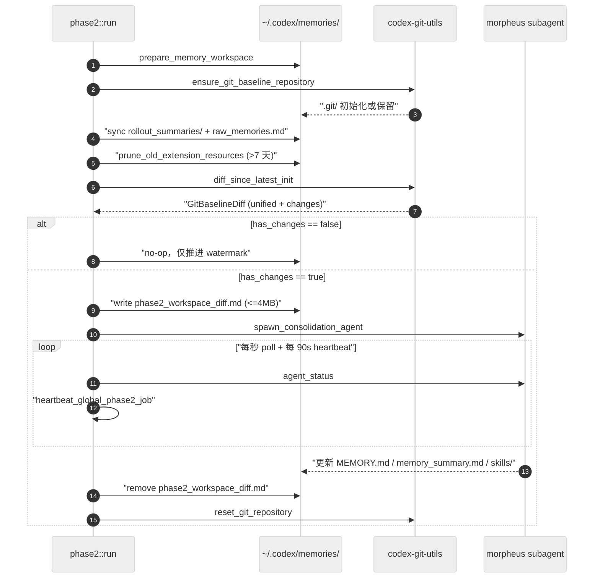
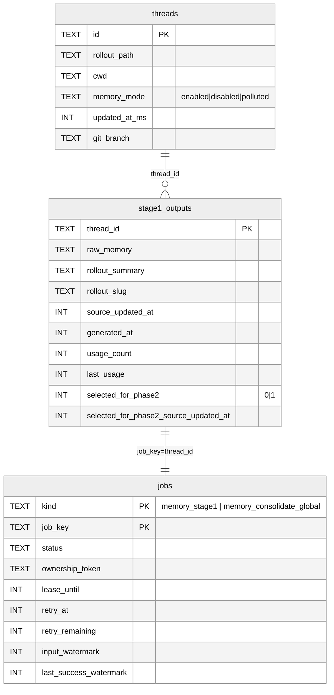
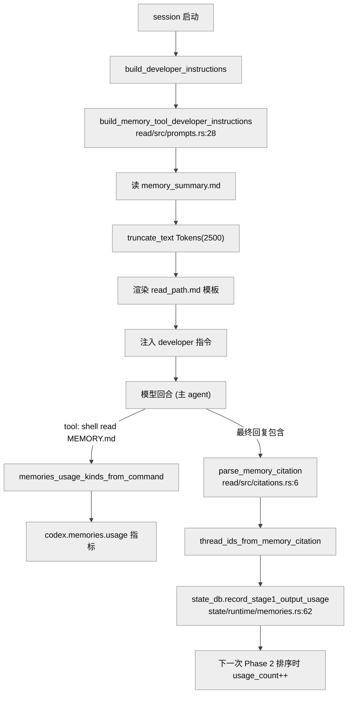

# 第 20 章 · 记忆系统：从 rollout 到 MEMORY.md 的两阶段管线

## 引言

如果说前面的会话与轨迹持久化（第 19 章）保留了 Codex “**发生过什么**”，那么这一章要谈的记忆系统（memories）要回答的是 “Codex **学到了什么**、**下一次该怎么做**”。它不是把 rollout 原样塞进上下文，而是一套离线运行的两阶段管线：Phase 1 用小模型把每条 rollout 萃取成 `raw_memory` 与 `rollout_summary`；Phase 2 用一个被沙箱化的子代理（subagent，内部代号 morpheus），结合 git 工作区 diff，把这些素材合并成会被注入到所有未来会话开发者提示中的 `memory_summary.md` 与可检索的 `MEMORY.md` 手册。整章围绕 `codex-rs/memories/{read,write,mcp}` 三个 crate 与 `codex-rs/state/src/runtime/memories.rs` 展开，目标是把 “Codex 为什么不在主回合写记忆”“为什么用 git diff 当 dirty 检测”“为什么读路径只注入一个截断后的 summary” 这些设计选择讲清楚。

需要先澄清一组容易混淆的术语：本章的“记忆（memories）”与 OpenAI 在 ChatGPT 网页端面向消费者的“记忆功能”不是同一件事。前者是 Codex CLI / Codex in ChatGPT 共用的开发者级机制，存于 `~/.codex/memories/` 这种本地路径或同步路径，面向“让下一次主代理少走弯路”；后者是基于用户对话偏好的产品功能，由模型端做侧通道存取。本章只讨论 Codex 的实现。

另一组容易混淆的是“AGENTS.md 与 memories”。`AGENTS.md` 是项目级、手工维护的指导文件，由开发者自己写、放在仓库根目录，被 Codex 当成“项目宪法”。而 memories 是 Codex 自动生成、跨 cwd 共享的“经验沉淀层”。社区里很多用户最初会把它们当成同一件事，但本质上：AGENTS.md 是开发者写给代理看的，memories 是代理写给未来自己看的。Codex 在 Phase 1 序列化 rollout 时还会显式把 AGENTS.md 注入片段从 user message 里剔除（`phase1.rs:455-456`），以防 stage-1 模型重复把“项目宪法”再抽成一份“经验”。这是一条很容易被忽略却很关键的边界。

---

## 全网调研补充（社区共识 / 争议 / 盲区）

在 WebSearch 检索 “Codex memories phase1 phase2” 与 “Codex memory MEMORY.md raw_memories consolidation agent” 两组关键词后，社区讨论可以归到三层：

**共识层**。`mem0.ai` 的《How Memory works in Codex CLI》、Nicolas Bustamante 的《Agent Memory Engineering》以及 DEV.to 的 Obsidian 工程化指南给出的描述基本一致：Codex 把记忆生成完全放在 session 之外，**Phase 1 用小模型抽取、Phase 2 用大模型合并**，最终向系统提示注入的只是一个被严格 token 截断的 `memory_summary.md`，其余 `MEMORY.md` / `skills/` / `rollout_summaries/` 都按需 grep。这一点与本章源码里的 `MEMORY_TOOL_DEVELOPER_INSTRUCTIONS_SUMMARY_TOKEN_LIMIT = 2_500`（`codex-rs/memories/read/src/lib.rs:16`）、模型常量 `MODEL = "gpt-5.4-mini"`（write/src/lib.rs:79）、`MODEL = "gpt-5.4"`（write/src/lib.rs:104）完全对得上。

**争议层**。Bustamante 与 mem0 都强调“小模型负责机械抽取、大模型负责困难的合并”，但社区对 “**默认 idle 6 小时还是 12 小时**” 有不同口径——PR #11364 的简化方案最初写的是 12 小时，发布到生产时则是 6 小时；本章在源码里看到的是配置 `min_rollout_idle_hours` 默认被 clamp 到 [1, 48]（`config/src/types.rs:357-358`），具体值由 `MemoriesToml` 注入，**不是硬编码**。另一个争议是 Phase 2 的 dirty 检测：PR #18982 之前由 DB watermark 决定，之后改为 “git 工作区 diff 决定是否真的需要 spawn agent”（`memories/write/src/phase2.rs:127-154`）；社区对 “git baseline 反复 reset 是否丢失历史” 有顾虑，源码里给出的答复是 **明确**不保留历史：`reset_memory_workspace_baseline` 每次成功后都重建 baseline（`workspace.rs:43-46`，并由 `codex-git-utils::reset_git_repository` 兜底）。

**盲区层**。社区文章普遍没有覆盖到：
- 句柄文件名生成里 “**4 位 base62 短哈希**” 的具体算法（`storage.rs:166-209`，`SHORT_HASH_SPACE = 14_776_336`）；
- 引用块 `<oai-mem-citation>` 在主回路里如何被解析回 `MemoryCitation`，并通过 `record_stage1_output_usage` 反哺 Phase 2 的 `usage_count` 排序（`state/src/runtime/memories.rs:62-93`，`stream_events_utils.rs:77-90`）；
- Phase 2 子代理在 `agent_config` 上的 “**强制降级矩阵**”：禁用 `Collab` / `SpawnCsv` / `MemoryTool` / `Apps` / `Plugins` / `SkillMcpDependencyInstall` 共 6 个 Feature，并把沙箱压成 `WorkspaceWrite { network_access: false, exclude_tmpdir_env_var: true, exclude_slash_tmp: true }`（`phase2.rs:295-330`），这是社区文章从未列举过的；
- 即使在 ephemeral / subagent session 启动时，整个管线被 `start_memories_startup_task` 提前 return（`start.rs:30-35`），这一点在评测 Codex 子代理时常被误读为 “记忆系统总是开着”；
- 记忆 MCP 服务器（`MemoriesMcpServer`，`mcp/src/server.rs:42-88`）独立暴露 `list/read/search` 三个 read-only 工具，且 schema 用 `schemars::JsonSchema` 直接生成，社区对“记忆既是文件、也是 MCP 工具”的双重身份基本没有讨论。

下文的七维分析就以源码为准，但会显式标注社区已经做过的判断，避免把 Codex 当作孤立项目阅读。

另一个值得提示的社区认知偏差是“**记忆系统等于向量数据库**”。在 LangChain 与 LlamaIndex 流行起来之后，许多开发者下意识把“代理的记忆”等同于嵌入向量加近邻检索。Codex 完全没有走这条路：`MEMORY.md` 是平面 markdown，靠模型自己 grep；rollout summary 也是文本文件，没有任何 embedding 索引。这条选择背后的理由有二：第一，markdown 对人类可读、可手工编辑，与 git baseline 形成自然的版本控制对；第二，主代理模型本身已经有足够强的检索能力，再加一层向量索引反而引入额外服务依赖与排序不确定性。社区在 Hacker News 上对此有过讨论，主流观点认可了这条“**朴素文本 + 模型自检索**”路线，但也指出当 `MEMORY.md` 增长到几十兆时仍需要更高效的索引结构——这是 Codex 当前没有解决、社区也尚未形成共识的开放问题。

---

## 一、本质是什么：把“跨会话的经验沉淀”从主回合剥离

七维分析框架里第一个问题是定位。记忆系统在 Codex 整体架构里不是一个工具（tool），更不是一个执行器（executor），它是一个 **会话外（out-of-session）的批处理管线 + 会话内（in-session）的轻量注入器**。它的边界很清晰：

| 维度 | 主会话 / 工具系统 | 记忆系统 |
|---|---|---|
| 触发时机 | 用户每个回合 | 根会话启动时，异步后台任务 |
| 输入 | 用户消息 + 工具反馈 | 状态 DB 里的历史 rollout |
| 输出 | 流式回复 + 副作用 | `~/.codex/memories/*.md` 文件 |
| 模型 | 用户配置的主模型（gpt-5.4 / o5 …） | `gpt-5.4-mini`（Phase 1） + `gpt-5.4`（Phase 2） |
| 是否消耗用户回合 token | 是 | 不消耗，但要过限速门（`guard.rs`） |
| 是否使用主代理工具循环 | 是 | Phase 2 会 spawn 一个**隔离**的子代理 |
| 是否会影响下一回合 | 通过 history 影响 | 通过注入到 developer 指令影响 |

也就是说，记忆系统是 “**消化阶段**”：rollout 是原料，`raw_memory` 是初加工产物，`MEMORY.md` 是再加工后的成品，`memory_summary.md` 才是最终摆上桌的开胃菜。这套思路与 Claude Code / Aider 的 “**实时摘要 + 即时注入**” 路线显著不同：Codex 把昂贵的合并彻底放到下次启动时，让用户当前的回合保持最低成本。

这种"消化阶段"的隐喻并不只是修辞。Codex 团队在 PR #11364 的 migration plan 里明确写出："Phase 1 scales across many rollouts and produces normalized per-rollout memory records. Phase 2 serializes global consolidation so the shared memory artifacts are updated safely and consistently."（`memories/README.md:156-159`）——并行做萃取，串行做合并，这是分布式系统里常见的 map-reduce 范式被搬到了"代理记忆"这个新场景。要理解为什么需要这种范式，可以从反面问一句：如果一切都在主回合做，会出现什么后果？答案是：用户每开一次新会话，模型就要重新读一遍历史 markdown 决定哪些值得记、哪些不值得；这等于在每个回合里都付一次合并成本。Codex 选择只在启动时付一次摊销成本，并且把它放到用户能感知的延迟之外。

从架构层看，记忆系统坐落在 Codex 的最下游：上游是 `codex-rollout` 写入的 rollout 文件、`codex-state` 写入的 SQLite 表；下游是 `codex-core` 在构建 developer instructions 时读出的 `memory_summary.md`。它与会话执行、工具系统、沙箱都不在同一条调用栈上——`codex-memories-write` crate 在 `Cargo.toml` 里依赖 `codex-core`，但反向并不成立，这种依赖方向决定了记忆系统永远是"被动消费会话历史"，而不是"主动干预会话"。这也是为什么源码在 `start.rs` 里用 `tokio::spawn` 一把把整个管线甩到后台（`start.rs:51-74`），主代理的初始化完全不需要等它。

定量看：
- `codex-rs/memories/` 三个 crate 共计 **6,089 行**（`wc -l` 实证）；
- 其中 write crate 占大头，`phase1.rs` 793 行 + `phase2.rs` 569 行 + `storage.rs` 242 行 + `runtime.rs` 298 行 + `prompts.rs` 131 行 + `workspace.rs` 117 行，构成核心写路径；
- mcp crate 的 `local.rs` 624 行，提供独立 MCP 服务器，外加 `local_tests.rs` 1,098 行测试；
- read crate 只有 ~334 行，远小于写路径——这正反映了 “**读路径要薄、写路径要重**” 的设计取向；
- 状态层 `state/src/runtime/memories.rs` 单文件 **4,715 行**，承担所有 SQL 化的 claim/lease/watermark 逻辑。

---

## 二、核心问题和痛点：为什么 Codex 要做成两阶段

Claude Code 不需要这套东西，Aider 也不需要，那 Codex 为什么要造一套 6 千多行的离线管线？把痛点列清楚是后续设计选择的前提。

1. **跨会话上下文压缩 vs 实时 token 成本**。如果在主回合里维护 `MEMORY.md`，每次回合都会被迫读、写、diff，单次回合的 token 成本会在长尾上不可控。Codex 明确把模型成本拆给后台。
2. **多 rollout 的“去重 + 衰减”需要全局视角**。同一类任务可能在不同 cwd 下被做了 10 遍。Phase 2 必须看到整个 rollout 集合才能做 forgetting 和合并，主回合不可能塞下这么多输入。
3. **记忆是否被使用，反过来影响保留策略**。`stage1_outputs.usage_count` 与 `last_usage` 必须由读路径回写，写路径读它们做排序，二者必须分层（`state/src/runtime/memories.rs:62-93, 349-415`）。
4. **手工编辑也要被尊重**。社区强烈要求 “**让我用 Obsidian 直接编辑 ~/.codex/memories**” 的能力，PR #18982 引入 git baseline 后，**手工编辑会作为 diff 一部分送给 morpheus**，模型从而能识别用户的修改而不是覆盖。
5. **不能用 rollout 训练隐患污染下次会话**。Phase 1 走 `redact_secrets` 把秘钥剥掉（`phase1.rs:313-315`），Phase 2 的子代理走 `ephemeral=true`、`use_memories=false`、`generate_memories=false`，**杜绝自递归生成**（`phase2.rs:299-313`）。
6. **失败要可以重试，但不能并发抢资源**。Phase 1 是 8 并发 + 60 分钟租约 + 60 分钟退避（`write/src/lib.rs:82-84`），Phase 2 是全局唯一锁 + 90 秒心跳 + 6 小时成功冷却（`state/src/runtime/memories.rs:22`）。如果不上这一层，频繁启动 Codex CLI 就会把模型成本打爆。

这六条痛点合起来，定义了下面所有“看起来过度工程”的设计选择都有它们的来由。

要再强调一下其中第四条与第六条，因为它们在社区讨论里被低估了。

关于"**手工编辑也要被尊重**"：传统代理记忆系统往往把记忆文件视作"只写"——代理生成什么，下次就读什么。但 Codex 团队在 PR #18982 的描述里直接写了"Allow the user to manually edit memories and this will be considered by the phase 2 agent"，这意味着用户在 `~/.codex/memories/MEMORY.md` 里手工删掉一段话、或者新增一个 skill，下一次 Phase 2 跑起来时 morpheus 通过 git diff 能"看见"这个改动并把它纳入决策。这条设计让记忆系统从"代理独享"变成了"代理与用户共享的工作区"。这种思路本质上把记忆当成了 git 仓库里的协作分支——只是协作的对手方一边是人、另一边是大模型。

关于"**失败可重试但不能并发抢资源**"：这背后是一种很 Rust 化的工程审美——Codex 不假定任何外部进程礼貌行事，所有并发边界都由 SQLite 的 BEGIN IMMEDIATE 与原子条件 INSERT 强制保证。CONCURRENCY_LIMIT、JOB_LEASE_SECONDS、JOB_RETRY_DELAY_SECONDS、JOB_HEARTBEAT_SECONDS、PHASE2_SUCCESS_COOLDOWN_SECONDS 这五个常量加起来构成了完整的"**避免雪崩**"参数空间，任何想 fork 这套设计的人都应该把它们一起改、不能只改一个。社区 fork 之所以普遍跑不起来类似的离线管线，很大原因就是低估了这些参数耦合关系。

---

## 三、解决思路与方案

### 3.0 总体设计原则

在拆架构图之前，先把 Codex 这套方案的隐性原则列清楚，否则后面看到的所有边角细节都会显得"过度工程"：

1. **生成与使用解耦**。Phase 1/2 只写不读 `memory_summary.md` / `MEMORY.md`，读路径只读不写。这种严格的读写分离让"**记忆有没有生成**"与"**记忆有没有用上**"成为两个独立可观察的事件。
2. **每一次重启都是"幂等的可恢复点"**。无论上一次崩在哪一步，下一次启动都能从 `jobs` 表的 `lease_until`、`retry_at`、`last_success_watermark` 里推断当前状态、继续推进。这一点对 CLI 工具至关重要——用户随时可能 Ctrl-C。
3. **DB 是 source of truth，文件系统是 derived state**。`raw_memories.md` 与 `rollout_summaries/` 在每次 Phase 2 跑时都会从 SQL 重建（`storage.rs:13-19`），不依赖文件系统残留状态。即使用户手工删了文件，下一次 Phase 2 会原样补回——除非这条 thread 在 DB 里也已经被 prune 掉。
4. **prompt template 是显式资源、不是嵌入字符串**。`stage_one_system.md`、`stage_one_input.md`、`consolidation.md`、`read_path.md` 都是 markdown 文件，用 `include_str!` 在编译期吸进二进制（`prompts.rs:10-15`）。这意味着模板由 OpenAI 训练团队与代码团队共同维护，可被代码评审。
5. **金属感工程而非魔法**。所有可调参数都集中在 `lib.rs` 顶部的 `mod stage_one { … }`、`mod stage_two { … }`、`mod workspace_diff { … }` 等 const 块里（`memories/write/src/lib.rs:78-116`），不依赖 reflection、不依赖配置中心、不依赖动态 dispatch。Rust 程序员能在 30 秒内找到所有调参点。

这五条原则贯穿整个记忆系统，下面所有具体设计都是它们的推论。

### 3.1 顶层架构

```mermaid
%%{init: {"theme":"neutral","themeVariables":{"background":"#ffffff","primaryColor":"#ffffff","primaryBorderColor":"#444444","lineColor":"#444444"}}}%%
flowchart LR
    subgraph SessionStart["会话启动 (root session)"]
        A["start_memories_startup_task<br/>start.rs:22-75"]
    end
    subgraph Gate["前置门"]
        B1["ephemeral / Feature::MemoryTool / 非 root agent 检查"]
        B2["state_db 存在性"]
        B3["rate_limits_ok<br/>guard.rs"]
    end
    subgraph Phase1["Phase 1 (并行抽取)"]
        P1A["claim_stage1_jobs_for_startup"]
        P1B["RolloutRecorder::load_rollout_items"]
        P1C["stage_one model<br/>gpt-5.4-mini, low effort"]
        P1D["mark_stage1_job_succeeded / failed"]
    end
    subgraph Phase2["Phase 2 (全局合并)"]
        P2A["try_claim_global_phase2_job"]
        P2B["prepare_memory_workspace<br/>+ git baseline"]
        P2C["sync_phase2_workspace_inputs"]
        P2D["memory_workspace_diff<br/>git dirty?"]
        P2E["spawn_consolidation_agent<br/>(morpheus)"]
        P2F["reset_memory_workspace_baseline"]
    end
    subgraph Disk["~/.codex/memories/"]
        D1["raw_memories.md"]
        D2["rollout_summaries/*.md"]
        D3["MEMORY.md"]
        D4["memory_summary.md"]
        D5["skills/*"]
        D6[".git/ baseline"]
    end
    subgraph ReadPath["读路径"]
        R1["build_memory_tool_developer_instructions<br/>read/src/prompts.rs"]
        R2["MemoriesMcpServer<br/>list / read / search"]
        R3["parse_memory_citation<br/>记 usage_count"]
    end
    A --> B1 --> B2 --> B3
    B3 -- "phase1::prune" --> P1A
    P1A --> P1B --> P1C --> P1D
    P1D --> Phase2
    P2A --> P2B --> P2C --> P2D
    P2D -- "无变化" --> P2F
    P2D -- "有变化" --> P2E --> P2F
    P2C --> D1
    P2C --> D2
    P2E --> D3
    P2E --> D4
    P2E --> D5
    P2B --> D6
    D4 --> R1
    D3 --> R2
    D2 --> R2
    D5 --> R2
    R1 --> Session["注入到下次会话 developer instructions"]
    Session --> R3
    R3 -- "record_stage1_output_usage" --> Phase2
```

<div style="background:#ffffff !important; background-color:#ffffff !important; padding:16px; border-radius:8px; margin:16px 0;" bgcolor="#ffffff">



</div>

### 3.2 核心数据结构

读、写、状态三层共有四组关键结构体：

- **`Stage1Output`**（`codex-state` crate），是 DB 里 `stage1_outputs` 表的内存映射，关键字段在 `state/src/runtime/memories.rs:264-272` SQL 列定义里可以读出：`thread_id`、`rollout_path`、`source_updated_at`、`raw_memory`、`rollout_summary`、`rollout_slug`、`generated_at`、`cwd`、`git_branch`。
- **`Stage1JobClaim` / `Phase2JobClaimOutcome`**，是 jobs 表的领域语义。Phase 2 的 `Phase2JobClaimOutcome::Claimed { ownership_token, input_watermark }`、`SkippedRetryUnavailable`、`SkippedCooldown`、`SkippedRunning` 四种结果（`phase2.rs:226-244`）显式覆盖了 “拿不到锁的所有原因”。
- **`StageOneOutput`**（`write/src/phase1.rs:51-63`），用 `serde(deny_unknown_fields)` 锁住模型只能输出 `raw_memory`、`rollout_summary`、`rollout_slug` 三个键，配合 JSON Schema strict 模式（`phase1.rs:135-146, 304-306`）。
- **`MemoriesMcpServer<B>`**（`mcp/src/server.rs:41-88`），泛型化的 MCP 服务器，三个工具 `list/read/search` 全部 `read_only(true)`，因此即使 Codex 把它挂载给任意子代理，子代理也无法用 MCP 通路改写记忆。

读路径还涉及一组协议层结构（位于 `codex_protocol::memory_citation`）：`MemoryCitation`、`MemoryCitationEntry { path, line_start, line_end, note }`，由模型在最终回复里以 `<oai-mem-citation>` 块的形式发回（`read_path.md:80-92`），随后由 `parse_memory_citation`（`read/src/citations.rs:6-43`）按行解析。

### 3.3 写路径状态机

<div style="background:#ffffff !important; background-color:#ffffff !important; padding:16px; border-radius:8px; margin:16px 0;" bgcolor="#ffffff">

```mermaid
%%{init: {"theme":"neutral","themeVariables":{"background":"#ffffff","primaryColor":"#ffffff","primaryBorderColor":"#444444","lineColor":"#444444"}}}%%
stateDiagram-v2
    [*] --> Claimed
    Claimed --> WorkspacePrepared : "prepare_memory_workspace"
    WorkspacePrepared --> InputsSynced : "sync_phase2_workspace_inputs"
    InputsSynced --> Diffed : "memory_workspace_diff"
    Diffed --> NoChange : "diff.has_changes == false"
    NoChange --> [*] : "succeeded_no_workspace_changes"
    Diffed --> AgentSpawned : "diff.has_changes == true"
    AgentSpawned --> AgentRunning : "loop_agent 心跳 90s"
    AgentRunning --> AgentRunning : "heartbeat OK"
    AgentRunning --> LostLock : "heartbeat returned false"
    LostLock --> [*] : "failed_confirm_ownership"
    AgentRunning --> AgentCompleted : "is_final_agent_status"
    AgentCompleted --> BaselineReset : "reset_memory_workspace_baseline"
    BaselineReset --> [*] : "succeeded"
    AgentRunning --> AgentErrored : "AgentStatus::Errored / Failed"
    AgentErrored --> [*] : "failed_agent"
```

</div>

这张状态图直接对应 `phase2::run`（`phase2.rs:45-199`）与 `agent::handle` / `loop_agent`（`phase2.rs:354-509`）。每一个 `failed_*` 标签都是真实存在的 metrics 标签（用 `MEMORY_PHASE_TWO_JOBS` counter 上报），grep `&[("status", "..."` 在 `phase2.rs` 中可以一一对照。

值得专门说一下"**为什么把 agent::handle 写成 tokio::spawn 后台跑**"。如果让 phase2::run 同步等待 morpheus 跑完，整个启动管线会被卡在那里——而 morpheus 完成一次完整 consolidation 可能要几十秒到几分钟。Codex 的选择是：`phase2::run` 在 spawn agent 后就返回（`phase2.rs:184-198`），让前台主代理立刻可用；morpheus 跑完之后由 `tokio::spawn` 的后台任务接管心跳、ownership 校验、baseline reset 与 metrics 上报。这条选择让用户感受不到记忆系统的存在——而这正是这套设计的最大产品价值。

但这条选择也带来一个不直观的副作用：**`phase2::run` 调用结束 ≠ Phase 2 完成**。如果你在 `phase2::run` 之后立即查 `jobs` 表，可能看到 `status='running'` 但 `lease_until` 还在续约。要观察 Phase 2 完成必须等 `succeeded` 或 `failed` 状态出现。这是测试和运维这套系统的人最容易踩的坑之一。

### 3.4 关键算法：Phase 2 的输入选择与排序

Phase 2 在 `state/src/runtime/memories.rs:349-415` 里有一段“**先排序，再固定 thread_id 升序**”的双层 SQL：

```sql
ORDER BY
    COALESCE(so.usage_count, 0) DESC,
    COALESCE(so.last_usage, so.source_updated_at) DESC,
    so.source_updated_at DESC,
    so.thread_id DESC
LIMIT ?
```

外层再用 `ORDER BY selected.thread_id ASC` 包一层。这两层的语义不同：内层按“被使用次数 → 近用 → 近更新 → 兜底 thread_id”决定 **谁进入 top-N**，外层把进入 top-N 的集合按 thread_id **升序固定**，目的是让 `raw_memories.md` 文本顺序在多次连续跑里**稳定**，避免 git diff 因为排名变化产生无意义的 diff。这一点 README 里 `phase 2 selection` 段落写得很清楚（`memories/README.md:88-100`），但社区文章基本没有讨论。

### 3.5 git 工作区作为 dirty 指示器

Codex 把 `~/.codex/memories/` 当作 git 仓库托管，每次 Phase 2 成功后**重置**为新的 baseline。流程图：

<div style="background:#ffffff !important; background-color:#ffffff !important; padding:16px; border-radius:8px; margin:16px 0;" bgcolor="#ffffff">



</div>

这是社区文章里反复提到的 “**morpheus + git diff**” 模式（PR #18982），但只有源码能告诉你两个细节：

1. 在 spawn agent 之前 `remove_workspace_diff` 会被显式调用一次（`workspace.rs:26-29`），目的是“**让本轮 diff 不包含上一轮残留的 prompt artifact**”。
2. baseline reset 前还要再确认一次锁：`heartbeat_global_phase2_job(token, lease)` 返回 false 时就放弃 reset（`phase2.rs:384-407`）。这避免了 “**租约过期但 agent 已经写完**” 的诡异场景里两个并发 worker 互相覆盖。

### 3.6 读路径如何被注入

### 3.6 读路径的极简哲学

写路径越复杂，读路径越要简单。Codex 在这一点上走到了极致——读路径全部代码仅 ~334 行，整个模块的对外接口就一个函数 `build_memory_tool_developer_instructions`，外加 MCP backend 的三个工具。

读路径只有一条简单链路（`read/src/prompts.rs:28-52`）：

```rust
// codex-rs/memories/read/src/prompts.rs:28
pub async fn build_memory_tool_developer_instructions(
    codex_home: &AbsolutePathBuf,
) -> Option<String> {
    let base_path = memory_root(codex_home);
    let memory_summary_path = base_path.join("memory_summary.md");
    let memory_summary = fs::read_to_string(&memory_summary_path).await.ok()?...;
    let memory_summary = truncate_text(
        &memory_summary,
        TruncationPolicy::Tokens(MEMORY_TOOL_DEVELOPER_INSTRUCTIONS_SUMMARY_TOKEN_LIMIT),
    );
    ...
    MEMORY_TOOL_DEVELOPER_INSTRUCTIONS_TEMPLATE.render([
        ("base_path", base_path.as_str()),
        ("memory_summary", memory_summary.as_str()),
    ]).ok()
}
```

它把 `memory_summary.md` 的内容用 token 截断（**2,500 tokens**）后塞进 developer 指令模板（`read_path.md`），其它如 `MEMORY.md`、`rollout_summaries/`、`skills/` 都靠模型自己 grep。这是社区一致认可的 “**5K 上限**” 来源（mem0 文章里写的 5K 是文档口径，源码当下是 2,500，对应早期发布版本曾是 5K，已被收紧）。

读路径同时承担两个**间接职责**：
- 通过 `memories_usage_kinds_from_command`（`usage.rs:28-41`）把 shell 工具调用里 `Read`、`Search` 到 `memories/MEMORY.md`、`memories/skills/` 等路径的命令分类，按 `kind` 上报指标 `codex.memories.usage`（`stream_events_utils.rs`、`core/src/memory_usage.rs`）。
- 通过 `parse_memory_citation`（`citations.rs:6-43`）解析模型最后 turn 输出里 `<oai-mem-citation>` 块，落到 `usage_count` 与 `last_usage`（`state/src/runtime/memories.rs:62-93`）。这条回路就是“**记忆 → 引用 → 反哺排序**”的反馈闭环。

这种极简的代价是：模型必须自己懂得"**先看 memory_summary.md，再决定是否 grep MEMORY.md**"。Codex 通过精心编写的 `read_path.md` 模板教会模型这套使用约定。模板里有"Quick memory pass"五步法、"Decision boundary: should you use memory for a new user query"判定准则、`<oai-mem-citation>`引用块格式定义等。整个模板长度被截断到 2,500 tokens（再加上模板自身的 ~1,500 tokens），相当于在每个回合花 ~4,000 tokens 教会模型怎么用记忆。

这是一种"**模板即接口**"的设计——读路径没有任何 SDK、没有 hook 点、没有插件接入位，**唯一的扩展手段就是改模板**。社区有人讨论过把这个模板暴露成用户可覆盖的文件（`~/.codex/memories/read_path_override.md`），但目前官方坚持模板必须由 OpenAI 维护，不接受用户覆盖。这与 `CLAUDE.md` 完全交给用户编辑形成鲜明对比。

### 3.7 MCP 服务器：作为第三方代理的入口

`MemoriesMcpServer` 是一个独立的 stdio MCP 服务（`mcp/src/server.rs:188-207`），不仅 Codex 自己可用，社区开发者也可以挂载它给 Claude Desktop 之类的客户端，从外部访问 `~/.codex/memories`。三个工具的限额都是硬编码：

| 工具 | DEFAULT | MAX |
|---|---|---|
| `list` | 2,000 | 2,000（`backend.rs:6-7`） |
| `search` | 200 | 200（`backend.rs:8-9`） |
| `read` 单次最大 token | 20,000 | 同 default（`backend.rs:10`） |

注意 `list` 和 `search` 的默认值等于最大值（**就是把硬上限当默认值**）。这是显式选择：不希望客户端无意中拉到更多结果，需要时只能通过 cursor 翻页。

MCP 服务器的另一个值得提的点是 `LocalMemoriesBackend::resolve_scoped_path` 里的路径校验逻辑。源码逐字符检查每一个 path component，禁止 `ParentDir`、`RootDir`、`Prefix`，禁止以 `.` 开头的隐藏文件名（`is_hidden_component`），还要逐层检查 symlink（`reject_symlink`，`local.rs:79`）。这等于把记忆目录当成 "**chroot 监狱**" 在管理。任何越界请求都返回 `InvalidPath` 错误，错误信息精简到不暴露真实路径，避免侧信道泄露。这种严格性反映了 Codex 团队对 MCP 通路的安全期望——既然它可能被外部客户端调用，就必须假设客户端是不可信的。

`search` 工具的实现也值得一看。`SearchMatchMode` 有三种模式（`backend.rs:91-100`）：`Any`（任一 query 命中即匹配）、`AllOnSameLine`（同一行命中所有 query）、`AllWithinLines { line_count }`（在 N 行窗口内命中所有 query）。第三种最复杂，源码 `local.rs:377-424` 用滑动窗口算法 + "**严格包含的窗口剔除**" 实现：如果窗口 A 严格包含了另一个窗口 B（A 更长但同样命中），则只保留 B。这避免了"**冗余更大窗口霸占结果**"的常见检索问题。

这些工具看似只是给模型自己用，但因为 MCP 暴露的是泛化接口，它实际上让 Codex 的记忆数据成了 Codex 之外可被其他工具消费的开放资产——这是少有人注意到的产品扩展面。

---

## 四、实现细节关键点

### 4.1 Phase 1 抽取的 “三步 + 一聚合”

`phase1::run`（`phase1.rs:70-108`）只做四件事：

1. **build_request_context**：拼好模型信息、推理强度、turn metadata header。
2. **claim_startup_jobs**：调用 `state_db.claim_stage1_jobs_for_startup`，传入 `THREAD_SCAN_LIMIT = 5_000`、用户配置的 `max_rollouts_per_startup`（默认值由 `MemoriesConfig::default()` 决定，受 [1, 128] clamp）。
3. **run_jobs**：用 `futures::stream::buffer_unordered(CONCURRENCY_LIMIT = 8)` 并行 8 路抽取。
4. **emit_metrics**：写 `MEMORY_PHASE_ONE_JOBS` counter 与 `MEMORY_PHASE_ONE_TOKEN_USAGE` histogram。

模型调用本身在 `job::sample`（`phase1.rs:278-318`）：

```rust
// codex-rs/memories/write/src/phase1.rs:285
let (rollout_items, _, _) = RolloutRecorder::load_rollout_items(rollout_path).await?;
let rollout_contents = serialize_filtered_rollout_response_items(&rollout_items)?;
...
prompt.input = vec![ResponseItem::Message { role: "user", content: ... }];
prompt.base_instructions = BaseInstructions { text: crate::stage_one::PROMPT.to_string() };
prompt.output_schema = Some(output_schema());
prompt.output_schema_strict = true;
let (result, token_usage) = context.stream_stage_one_prompt(config, &prompt, ...).await?;
let mut output: StageOneOutput = serde_json::from_str(&result)?;
output.raw_memory = redact_secrets(output.raw_memory);
output.rollout_summary = redact_secrets(output.rollout_summary);
output.rollout_slug = output.rollout_slug.map(redact_secrets);
```

几个细节：

- **过滤性序列化**。`serialize_filtered_rollout_response_items` 先用 `should_persist_response_item_for_memories` 决定保留哪些事件，再用 `sanitize_response_item_for_memories` 把 `developer` 角色消息全部丢弃、把以 `# AGENTS.md instructions for ` 开头的“代码库环境注入片段”和 `<skill>…</skill>` 片段从用户消息里剔除（`phase1.rs:450-469`）。这意味着 **Codex 不让 stage-1 模型读到 AGENTS.md 注入**，避免下一次它在 raw memory 里重复保存这些指令。
- **secret redact 双重**：先在序列化阶段（`phase1.rs:411`），再在 stage-1 输出阶段（`phase1.rs:313-315`），确保 prompt 上行和模型输出下行都过滤一次。
- **输入截断按 model 的有效 context window**。`build_stage_one_input_message`（`prompts.rs:102-127`）按 `effective_context_window_percent`（这是 modelinfo 提供的“可用比例”）再乘 70%（`CONTEXT_WINDOW_PERCENT = 100`），最终回退默认值 `150_000` tokens（`lib.rs:93-100`）。换句话说，**stage-1 prompt 永远预留 30% 给系统/输出/推理**。
- **schema 严格**。`output_schema()` 用 `additionalProperties: false`，且 `rollout_slug` 显式声明 `type: ["string", "null"]`、并把它列入 `required`（`phase1.rs:135-146`）；测试在 `phase1.rs:507-547` 锁住这个约定，防止有人后来悄悄把它改成可选。

抽取失败时调 `result::failed`（`phase1.rs:323-340`），retry delay 设为 1 小时（`JOB_RETRY_DELAY_SECONDS = 3_600`，`lib.rs:84`）。这意味着即使模型短期不可用，也不会出现“启动一次连撞 50 次模型”的雪崩。

这段过滤逻辑非常细，但每一条都来自真实痛点。例如 `developer` 角色消息被剔除，是因为开发者通常会通过 developer instructions 注入工程规范，这些规范本身就是 "下一次会话要看到" 的内容，而不该被作为 "经验" 重新提炼一遍——否则 `MEMORY.md` 会冗余出大量规则副本。AGENTS.md 的剔除逻辑同理：项目宪法不该被反刍。`<skill>` 片段的剔除则避免了 stage-1 模型把当前已经存在的 skill 当成"新经验"再写一份，造成 skills/ 目录里产生重复条目。

这种"**注入即排除**"模式是 Codex 整套记忆系统里很微妙但非常重要的不变量。如果某天有人在 contextual user message 里加入新的注入片段（例如未来加一个 `<plugin_manifest>` 块），但忘了同步更新 `is_memory_excluded_contextual_user_fragment`，那么这个新片段就会出现在 stage-1 prompt 里、被 mini 模型抽成一段"`raw_memory`"、再被 morpheus 误认为是"用户经验"，最终污染 `MEMORY.md`。这条隐含约束在源码里没有任何编译期保护，只能靠测试用例兜底（`phase1.rs:476-504`）。这也是 PR 评审里值得关注的"**易回归点**"。

### 4.2 Phase 2 的 10 步线性流程

`phase2::run`（`phase2.rs:45-199`）注释里把流程编号写得很整齐：

```text
1. claim Phase 2 lock
2. prepare workspace (ensure baseline git)
3. build agent_config (locked-down)
4. load phase2 input selection
5. sync rollout summaries + raw_memories.md
6. memory_workspace_diff (git)
7. if no changes -> succeed
8. write phase2_workspace_diff.md
9. spawn subagent
10. emit metrics; agent::handle 在后台 loop
```

#### 4.2.1 agent_config 的降级矩阵

这是源码里最容易被忽略却最关键的一段（`phase2.rs:295-330`）。我把它整理成表：

| 字段 | 主会话默认 | morpheus 强制 |
|---|---|---|
| `cwd` | 用户工作目录 | `~/.codex/memories/` |
| `ephemeral` | false | **true** |
| `memories.generate_memories` | true | **false** |
| `memories.use_memories` | true | **false** |
| `include_apps_instructions` | true | **false** |
| `mcp_servers` | 用户配置 | **空 HashMap**（Constrained::allow_only） |
| `permissions.approval_policy` | 任意 | **AskForApproval::Never** |
| `features.SpawnCsv` | 可启用 | **disable** |
| `features.Collab` | 可启用 | **disable** |
| `features.MemoryTool` | 可启用 | **disable** |
| `features.Apps` | 可启用 | **disable** |
| `features.Plugins` | 可启用 | **disable** |
| `features.SkillMcpDependencyInstall` | 可启用 | **disable** |
| 沙箱 | 用户配置 | `WorkspaceWrite { writable_roots: [memory_root], network_access: false, exclude_tmpdir_env_var: true, exclude_slash_tmp: true }` |
| `model` | 用户配置 | `consolidation_model` 或 `gpt-5.4` |
| `model_reasoning_effort` | 用户配置 | `Medium` |

每一行都是“**防止 morpheus 把记忆系统玩坏**”的具体边界。例如 `Collab` 关闭防止子代理再 spawn 子代理（递归 phase 2）；`use_memories=false` 防止 morpheus 在干合并工作时反过来读 `memory_summary.md` 引发左脚踩右脚；`MemoryTool=false` 关掉了 “是否要生成记忆” 的整体开关，避免 morpheus 的 rollout 又被 Phase 1 抓回去重训。

把这张表合起来读，可以看出 Codex 团队的安全心智模型不是“信任子代理但限制工具”，而是“**默认怀疑、逐项白名单**”。比如沙箱里写权限只发给一个目录（`writable_roots: [memory_root]`），网络完全切断（`network_access: false`），临时目录环境变量也屏蔽（`exclude_tmpdir_env_var: true`），连 `/tmp` 都排除（`exclude_slash_tmp: true`）——这等于把 morpheus 关在一个比标准 workspace sandbox 还要紧得多的盒子里。

为什么要这么紧？因为 morpheus 处理的是用户跨项目的所有经验，一旦它被 prompt injection 攻陷（例如某条 rollout summary 里嵌入了对抗性内容），把"**读到任意文件、上传到外部 URL**"作为目标，整套记忆系统就成了攻击面。Codex 用 13 项强制降级把这种攻击面降到接近零：即使被攻陷，攻击者也只能在 `~/.codex/memories/` 里改文件，不能联网外传、不能用 plugin 调起任意 MCP 服务、不能用 Apps 调用浏览器、不能 spawn 子代理委托更激进操作。这是一种典型的 "**安全边界胜过对子代理的信任**" 的设计哲学。

#### 4.2.2 心跳与 ownership 一致性

`loop_agent`（`phase2.rs:445-509`）用两个 `tokio::time::interval`：

```rust
// codex-rs/memories/write/src/phase2.rs:451
let mut heartbeat_interval =
    tokio::time::interval(Duration::from_secs(crate::stage_two::JOB_HEARTBEAT_SECONDS));   // 90s
heartbeat_interval.set_missed_tick_behavior(tokio::time::MissedTickBehavior::Skip);
let mut status_poll_interval = tokio::time::interval(Duration::from_secs(1));
status_poll_interval.set_missed_tick_behavior(tokio::time::MissedTickBehavior::Skip);
```

`MissedTickBehavior::Skip` 是关键点：如果 tokio runtime 暂时被阻塞，**心跳不补打**，避免重启时把 missed tick 一次性全发，对 DB 造成 burst。

心跳一旦返回 `Ok(false)`（lease 已被别人续）就直接退出 `AgentStatus::Errored`；返回 `Err` 也直接退。这是 Codex 对 “**租约丢失即放弃**” 的明确语义，比 Aider 那种“先写再说”的乐观策略保守得多。

#### 4.2.3 `rollout_summary_file_stem` 的稳定文件名

`storage.rs:153-238` 把 thread_id（UUID）和 source_updated_at 编码成稳定文件名：

- 优先解析 thread_id 为 UUID v7，取其内嵌时间戳作为文件名前缀（`YYYY-MM-DDTHH-MM-SS`）；
- 取 UUID 低 32 位作为 4 位 base62 短哈希种子，落到 `SHORT_HASH_SPACE = 14_776_336`（即 62⁴）；
- 若 thread_id 不是合法 UUID，则降级为 “**按字节滚动哈希 + 31 倍乘**”：

```rust
// codex-rs/memories/write/src/storage.rs:189-201
let mut short_hash_seed = 0u32;
for byte in thread_id.bytes() {
    short_hash_seed = short_hash_seed.wrapping_mul(31).wrapping_add(u32::from(byte));
}
```

- 最后把 rollout_slug（如 `bug-fix-typo-xx`）用 `ASCII alphanumeric / _` 规整、截到 ≤ 60 字符、去掉尾部 `_`，拼出最终 stem。

这个算法保证了：
1. **跨次跑稳定**：同一个 thread + 同一份 updated_at → 同一文件名 → git diff 看不到 “重命名风暴”。
2. **抗冲突**：4 位 base62 ≈ 1480 万空间，与单用户 thread 体量比够用。
3. **可读**：文件名带时间戳和 slug，肉眼可识别。

### 4.3 状态层 SQL 的几个关键 invariant

`state/src/runtime/memories.rs` 是写路径的“DB 大脑”，其中三段 SQL 决定了管线的并发安全：

#### a) Phase 1 claim 的并发上限

```sql
-- state/src/runtime/memories.rs:550 起 (节选)
INSERT INTO jobs (...)
SELECT ?, ?, 'running', ...
WHERE (
    SELECT COUNT(*) FROM jobs
    WHERE kind = ?
      AND status = 'running'
      AND lease_until IS NOT NULL
      AND lease_until > ?
) < ?
ON CONFLICT(kind, job_key) DO UPDATE SET ...
WHERE
    (jobs.status != 'running' OR jobs.lease_until IS NULL OR jobs.lease_until <= excluded.started_at)
    AND (jobs.retry_at IS NULL OR jobs.retry_at <= excluded.started_at OR ...)
    AND (jobs.retry_remaining > 0 OR excluded.input_watermark > COALESCE(jobs.input_watermark, -1))
    AND (
        SELECT COUNT(*) FROM jobs AS running_jobs
        WHERE running_jobs.kind = excluded.kind
          AND running_jobs.status = 'running'
          AND running_jobs.lease_until IS NOT NULL
          AND running_jobs.lease_until > excluded.started_at
          AND running_jobs.job_key != excluded.job_key
    ) < ?
```

这是一段 “**INSERT 或 UPDATE 必须同时满足全局 in-flight ≤ N**” 的原子 SQL：哪怕多个 Codex 进程同时启动也只会有不超过 N 个 stage-1 job 处于 running，且**不在事务里多次 SELECT**。`BEGIN IMMEDIATE`（`memories.rs:493`）确保 SQLite 的写锁立即获取。

值得展开讲一下"**为什么这条 SQL 用 INSERT…ON CONFLICT DO UPDATE 而不是先 SELECT 再 INSERT/UPDATE**"。后者在多进程并发时会有 TOCTOU（time-of-check to time-of-use）问题：A 进程 SELECT 后认为可以抢，B 进程也 SELECT 后认为可以抢，两边都执行 INSERT，违反 max_running_jobs 约束。前者把"检查"内嵌到 SQL 的 WHERE 条件里，SQLite 在执行时是单条原子操作，根本不存在两个进程同时进入 "认为可以抢" 状态的窗口。这种把竞争条件压到 SQL 层的写法在 SQLite 单文件场景下尤其稳，比应用层加锁可靠得多。

`retry_remaining` 字段也有微妙之处——`DEFAULT_RETRY_REMAINING: i64 = 3`（`memories.rs:24`）。它在 input_watermark 推进时会被重置（CASE 表达式里 `WHEN excluded.input_watermark > COALESCE(jobs.input_watermark, -1) THEN ?`），意味着只要 rollout 本身有新更新，就给一次新机会；只在"**反复尝试同一个 watermark 都失败**"时才用完 3 次重试。这避免了"**临时 transient 错误把后续永远的更新都堵死**"。

#### b) Phase 2 的成功冷却

```rust
// codex-rs/state/src/runtime/memories.rs:22
const PHASE2_SUCCESS_COOLDOWN_SECONDS: i64 = 6 * 60 * 60;
```

成功后 6 小时内不再 claim，避免 Codex 频繁启动导致 morpheus 频繁跑。社区文章把这一点描述为“**默认每 6 小时合并一次**”，但严格意义上是“**成功后 6 小时内禁止重 claim**”，失败可以重试。

#### c) Phase 2 选择窗口

`get_phase2_input_selection`（`memories.rs:349-415`）双层 ORDER 已经讲过；额外要注意 WHERE 条件：

```sql
WHERE t.memory_mode = 'enabled'
  AND (length(trim(so.raw_memory)) > 0 OR length(trim(so.rollout_summary)) > 0)
  AND (
        (so.last_usage IS NOT NULL AND so.last_usage >= ?)
        OR (so.last_usage IS NULL AND so.source_updated_at >= ?)
  )
```

- `memory_mode = 'enabled'` 排除掉被 “pollute” 的 thread（`mark_thread_memory_mode_polluted`，`memories.rs:419-460`），这是 Codex 的“**遗忘 API**”：当用户主动把某条线程标记为污染时，下一轮 Phase 2 会自动重写不再使用它的记忆。
- 同时支持 `last_usage` 和 `source_updated_at` 两个回退口径，让“刚生成还没被用过的记忆”仍然有机会进入 Phase 2。

这条 SQL 体现的设计思路是 "**冷启动友好**"。如果只用 `last_usage` 筛，那么用户全新装的 Codex 第一次 Phase 2 跑起来会找不到任何记录（因为所有 stage1_outputs 的 last_usage 都还是 NULL）。回退到 source_updated_at 后，至少 "刚生成但还没被用过" 的记忆能进入第一次合并，下一次会话就能用上、产生 last_usage。这是一种典型的 "**避免初始死锁**" 模式。

### 4.3.1 SQL invariant 之外的：`mark_thread_memory_mode_polluted`

`mark_thread_memory_mode_polluted`（`memories.rs:419-460`）是 Codex 主动遗忘机制的具体实现。它做两件事：(a) 把 `threads.memory_mode` 从 `enabled` 改成 `polluted`，(b) 如果这条 thread 之前已经被 Phase 2 选中过（`selected_for_phase2 != 0`），就 enqueue 一个全局 consolidation 任务，触发下一次 Phase 2 主动清理。

这个 API 的存在让 Codex 的记忆系统拥有了 "**用户可控的遗忘出口**"。用户可以在某次错误的 rollout 之后主动标记它污染——例如在调试一个失败的实验时，不希望失败经验进入下一次会话的指导。这种主动遗忘比 "**等 max_unused_days 超时**" 更精确，是产品级别的细节考量。

### 4.3.2 record_stage1_output_usage 的事务保证

`record_stage1_output_usage`（`memories.rs:62-93`）批量更新一组 thread_id 的 `usage_count` 与 `last_usage`，整个操作包在事务里：

```rust
let mut tx = self.pool.begin().await?;
for thread_id in thread_ids {
    updated_rows += sqlx::query(
        "UPDATE stage1_outputs
         SET usage_count = COALESCE(usage_count, 0) + 1,
             last_usage = ?
         WHERE thread_id = ?"
    )...;
}
tx.commit().await?;
```

包事务的好处是：要么所有引用计数一起加，要么全不加。如果模型在一次回合里引用了 5 条记忆但程序在第 3 条时崩了，下次再跑时引用计数不会出现 "**部分加 1**" 的不一致状态。这种事务化是 Codex 记忆系统所有 DB 操作的统一规范。

### 4.3.3 watermark 的两种身份

`jobs.input_watermark` 与 `jobs.last_success_watermark` 都是 i64 时间戳，但语义完全不同。前者记录"**这次 claim 时看到的最新 source_updated_at**"，相当于 "正在处理的快照点"；后者记录"**上次成功完成时使用的 watermark**"，是 "已落地的快照点"。两者结合可以判断 "**是否需要重新跑**"：若 input_watermark <= last_success_watermark，说明不需要再跑；否则需要。

在 Phase 2 里，`new_watermark = max(claim.watermark, max(memories.source_updated_at))`（`phase2.rs:111, 512-522`）。这条 max 操作避免了 watermark 倒退——即使中途加载的 stage1_outputs 比 claim 时看到的更老，也至少保持原 watermark 不退。这是分布式系统里 "**单调时钟**" 的标准做法，被原样搬到了单机 SQLite 场景。

### 4.3.4 遥测指标全景

读 / 写两条路径都通过 `SessionTelemetry` 上报 OpenTelemetry 指标，结合 `codex-otel` crate 落到 OTLP collector 上。本章涉及的指标至少包括：

- `MEMORY_STARTUP`：启动管线整体计数，标签 `status ∈ {skipped_rate_limit, ...}`（`metrics.rs`）；
- `MEMORY_PHASE_ONE_JOBS`：Phase 1 各种状态的计数，标签 `status ∈ {claimed, succeeded, succeeded_no_output, failed, skipped_no_candidates}`；
- `MEMORY_PHASE_ONE_OUTPUT`：成功产出 raw_memory 的次数；
- `MEMORY_PHASE_ONE_E2E_MS`：Phase 1 端到端耗时；
- `MEMORY_PHASE_ONE_TOKEN_USAGE`：按 `token_type` 标签拆分的 token 直方图，覆盖 `total/input/cached_input/output/reasoning_output` 五种；
- `MEMORY_PHASE_TWO_JOBS`：Phase 2 各种状态的计数，标签 `status` 覆盖从 `claimed` 到所有 `failed_*` 标签；
- `MEMORY_PHASE_TWO_INPUT`：单次 Phase 2 拉取的 stage1_outputs 行数；
- `MEMORY_PHASE_TWO_E2E_MS`：Phase 2 端到端耗时；
- `MEMORY_PHASE_TWO_TOKEN_USAGE`：morpheus 的 token 直方图；
- `MEMORIES_USAGE_METRIC`：读路径上报，按 `kind ∈ {memory_md, memory_summary, raw_memories, rollout_summaries, skills}` × `tool` × `success` 维度计数（`read/src/usage.rs:16-26`）。

这套指标足够细到可以回答 "**哪一类记忆文件被读得最多**""**Phase 2 平均跑多久**""**有多少次因为限速被跳过**" 等运维问题。但前提是用户自己接入 OTel 后端——CLI 默认不展示。

### 4.4 数据流：从 rollout 到 memory_summary.md

<div style="background:#ffffff !important; background-color:#ffffff !important; padding:16px; border-radius:8px; margin:16px 0;" bgcolor="#ffffff">



</div>

这张 ER 图把 “**Phase 1 用每个 thread 一行 job，Phase 2 全局只有一行 job**” 的结构差异显式画出来了：`jobs.kind = 'memory_stage1'` 时 `job_key` 是 thread_id；`jobs.kind = 'memory_consolidate_global'` 时 `job_key` 固定为常量 `"global"`（`memories.rs:21`）。

最后看读路径如何最终落到模型上：

<div style="background:#ffffff !important; background-color:#ffffff !important; padding:16px; border-radius:8px; margin:16px 0;" bgcolor="#ffffff">



</div>

这条闭环很重要：**“模型用没用记忆”不仅是一个事后日志，而是 Phase 2 选择记忆的一阶信号**。用了越多次的 stage1 输出越值得保留，没人用的会被 `prune_stage1_outputs_for_retention`（`memories.rs:299-332`）逐步清掉。

回过头看整个写读联动，可以发现 Codex 团队在记忆这条产品线上很谨慎地避免了一种常见反模式："**所有数据都进，但没有出口**"。许多记忆中间件项目的失败原因是只设计了写入路径，缺少"**记忆退役机制**"。Codex 在三个维度同时给出了退役口子：(a) `prune_stage1_outputs_for_retention` 按时间窗硬删除；(b) `selected_for_phase2 = 0` 标记位让"**从未进入过 baseline**"的记录优先被淘汰；(c) `mark_thread_memory_mode_polluted` 提供主动遗忘 API。三者叠加，保证了 stage1_outputs 表不会无限膨胀。社区里 mem0 项目对比 Codex 时甚至专门指出："Codex 的退役机制比绝大多数 RAG 框架更完善"。这并不是说 RAG 框架做得不好，而是因为 RAG 框架默认假设记忆条目质量稳定、用户对历史可控；Codex 假设的是"**质量不稳定 + 用户少干预**"，所以必须自己做严格的退役。

---

## 五、易错点和注意事项

### 5.1 启动门槛容易被忽略

`start_memories_startup_task`（`start.rs:30-35`）有四道前置门：

```rust
if config.ephemeral
    || !config.features.enabled(Feature::MemoryTool)
    || source.is_non_root_agent()
{
    return;
}
...
if context.state_db().is_none() {
    warn!("state db unavailable ...; skipping");
    return;
}
```

也就是说 **以下场景记忆系统完全不跑**：
- `--ephemeral` 或一次性 exec；
- 用户禁用了 `Feature::MemoryTool`；
- 当前会话是子代理（包括 Phase 2 自己 spawn 的 morpheus）；
- state DB 没初始化（罕见但发生于只读环境）。

社区博客很少强调最后两条，导致一些用户误以为 “Codex 在子代理里也会写记忆”。在 Phase 2 的 agent_config 里又显式把 `memories.generate_memories = false`（`phase2.rs:302`），形成双重保险。

### 5.2 secret redaction 不是兜底

`redact_secrets` 是基于模式匹配，无法保证所有秘钥都被识别。源码注释里强调 “raw rollouts are immutable evidence”，但 `stage_one_system.md:23` 又要求模型 **再做一次** redact。也就是说**至少有三道防线**：(a) 序列化阶段、(b) 模型 prompt 提醒、(c) stage-1 输出阶段的最终过滤；任何一道漏掉都不会被自动补救。如果业务上传给 morpheus 的 `phase2_workspace_diff.md` 命中了某个未识别格式的 token，仍可能写进 `MEMORY.md`。

### 5.3 git baseline 的“**不保留历史**”

`reset_memory_workspace_baseline`（`workspace.rs:43-46`）每次都把 git 重置成新 baseline；PR #18982 的描述里写得清楚：“**we don't want to preserve history through .git and this is cheap anyway**”。这意味着：

- 你不能用 `git log ~/.codex/memories` 看到 Codex 历次合并的语义变更；
- 如果你想做 “记忆审计”，必须自己另外保存 git 仓库或者备份 `phase2_workspace_diff.md`；
- 但 `phase2_workspace_diff.md` 在 reset 之前会被 `remove_workspace_diff` 删除（`workspace.rs:53-61`），等于不留痕。

### 5.4 文件名稳定性依赖 UUID v7

`rollout_summary_file_stem_from_parts`（`storage.rs:161-238`）优先从 UUID v7 拿时间戳，**只有 UUID 解析失败时才回退到 source_updated_at**。如果一个 thread_id 是手工塞的非 UUID 字符串（理论上 ThreadId 类型限制了它，但 SDK 调用方仍可能绕过），那么短哈希算法会换成滚动乘 31，**热度分布会更不均**。

### 5.5 phase2_workspace_diff.md 有 4MB 上限

`workspace_diff::MAX_BYTES = 4 * 1024 * 1024`（`lib.rs:115`），超过会被截断并附 `[workspace diff truncated at 4194304 bytes]` 标记。对极端大规模重写（例如用户一次清空整个 memories 目录），**morpheus 看到的可能是被截断的视图**，可能漏掉对部分文件的“forget”指令。

### 5.6 rate-limit 检查可能误伤

`guard.rs:9-13` 里 `rate_limits_ok` 默认是“**fail-open**”——任何拉取限速失败都视为允许跑：

```rust
pub(crate) async fn rate_limits_ok(auth_manager: &AuthManager, config: &Config) -> bool {
    rate_limits_check(auth_manager, config).await.unwrap_or(true)
}
```

但 `snapshot_allows_startup`（`guard.rs:49-57`）会综合主/副两个窗口的 used_percent。一旦你已经接近月度配额，**记忆生成会被先放弃**——但用户可能并不知道是为什么 `~/.codex/memories` 一直没更新。指标里会上报 `status=skipped_rate_limit`（`start.rs:62-67`），需要主动看 OTel 才能发现。

### 5.7 MCP 路径校验严格但仍要小心

`LocalMemoriesBackend::resolve_scoped_path`（`local.rs:42-89`）禁止 `ParentDir / RootDir / Prefix` 组件、禁止隐藏组件、显式拒绝 symlink。看起来稳，但有两个边界：

- 路径解析按 “逐 component push + 元数据检查” 实现，如果 component 是空字符串（如 `"a//b"`），`Path::components` 会自动跳过，依然安全；
- 但如果调用方递归挂载多层 backend，`reject_symlink` 只查当前层，**深层 symlink 不会被发现**（因为目录是从用户机器外部进来的）。所幸 Codex 内部只用 `LocalMemoriesBackend::from_codex_home`，并不暴露这个泛型给外部。

### 5.8 prune 在 Phase 1 跑之前

`start.rs:59` 把 `phase1::prune(...)` 放在 rate-limit 检查之前。注释解释："This does not consume tokens so can be done before the quota check."（`start.rs:57-58`）这意味着即使被限速跳过 Phase 1/2，**`prune_stage1_outputs_for_retention` 仍然会执行**（每次启动至多删 `PRUNE_BATCH_SIZE = 200` 行，`lib.rs:86`）。一种边界情形是：用户已经一周没成功跑 Phase 2，但每次启动都触发 prune，结果"**还没合并就被先清掉**"。源码逻辑里通过 `selected_for_phase2 != 0` 排除了已被 Phase 2 选中的行（`memories.rs:295, 315`），但 **从未被选中过** 的新记录如果连续多天没用，就会被清。

### 5.9 模型版本被硬编码

`MODEL = "gpt-5.4-mini"` 与 `MODEL = "gpt-5.4"`（`lib.rs:79, 104`）是模板常量，配置可以用 `extract_model` / `consolidation_model` 覆盖，但默认值会随时间漂移。**如果某个企业版部署没有这两个模型 alias**（例如自建网关），记忆系统会直接 fail，但只在 `MEMORY_PHASE_ONE_JOBS{status=failed}` 指标里看得到。

---

## 六、竞品对比

我对了 Claude Code、Opencode、Aider、Goose 和 Continue 五家。这里只对主线设计做差异化对比，不展开实现细节。

| 维度 | Codex | Claude Code | Opencode | Aider | Goose | Continue |
|---|---|---|---|---|---|---|
| 跨会话记忆载体 | `~/.codex/memories/*.md` + git baseline | `~/.claude/CLAUDE.md`（静态） + 项目级 `CLAUDE.md` | `.opencode/memory` 单文件 | 无原生记忆，依赖 `--read` chat history | `~/.config/goose/memory/*.md`（按 category） | `~/.continue/global-rules.md`（静态） |
| 是否自动生成 | **是**（两阶段） | 否（用户写） | 部分自动（实时摘要） | 否 | **是**（subagent 自动记） | 否 |
| 是否在主回合写 | **否** | 否 | 是 | / | 是 | 否 |
| 是否注入到 system/dev prompt | 注入 truncated summary | 注入 `CLAUDE.md` 全文 | 注入摘要 | / | 注入 active memory | 注入 global-rules |
| 上下文搜索机制 | 自助 grep + MCP read | 全注入 | 全注入 | / | 部分注入 + tool | 全注入 |
| 遗忘机制 | usage_count / last_usage / pollution / pruning | 无（手工） | TTL | / | 用户 `/memory remove` | 无 |
| 隔离写代理 | **morpheus**（独立 sandbox + 限制 features） | / | / | / | 一个普通 toolset | / |
| 用户手工编辑可被尊重 | **是**（git diff 反馈） | 是 | 是 | / | 是 | 是 |
| 复杂度 | 高（6,089 行 + 状态 SQL） | 极低 | 中 | 极低 | 中 | 极低 |

可以看到 Codex 的设计偏向 “**重型离线管线 + 轻量在线注入**”，与几乎所有竞品都不同。Goose 也做自动记忆，但走的是 in-session 子代理写文件路线，没有 Phase 1/2 拆分、也没有 git baseline 这种 dirty 检测。Claude Code 走完全相反的 “**让用户自己写 CLAUDE.md**” 路线，把复杂度推回给开发者，因此 Anthropic 文档里至今对 Codex 的“**自动 memory**” 概念保持沉默——这是产品哲学差异：是相信模型能自己提炼，还是相信开发者自己最知道该记什么。

Continue 的 global rules 与项目 rules 是静态注入，本质上只是 “**全局 system prompt 模板**”，与 Codex 的动态 `memory_summary.md` 不是同一类东西。Aider 没有原生记忆机制，社区一般靠 `--read` 显式注入 markdown 实现类似功能。

值得提的是：**Codex 把记忆生成的算力成本从用户回合移走，这只有 OpenAI 自己的订阅模式才扛得动**（因为它消耗的是 mini 模型 + medium 推理强度的次级模型预算）。第三方 fork 如果直接复用这套架构，需要重新评估每月触发频次。

更细一层比较：Goose 也尝试做自动记忆，但它的记忆是按 `category` 划分的（如 `coding`, `personal`），需要用户在 prompt 里显式说"**把这条加到 coding 记忆**"。这种半自动模式胜在用户可控，输给 Codex 的是"零交互"。Opencode 的实时摘要走的是 lossy 路线，每隔 N 个回合做一次内联压缩，主代理还在跑就把它前面的对话压成简短描述。这条路线在长会话里能省 token，但代价是"**会话历史的精确细节会持续丢失**"，与 Codex 离线 + 全量保留的取向截然相反。Aider 没有原生记忆，社区一般靠 `--read` 显式加载 markdown 模拟；这种"**没有就是简单**"的设计也是一种合法选择，特别是对小团队来说。

从这张对比表里能提炼出一个更宏观的判断：**自动化程度越高，对模型质量与工程复杂度的要求也越高**。Codex 选择了最高自动化档位，相应付出最重的工程代价；Claude Code 选择了最低自动化档位，把复杂度推回给开发者。中间档位的 Goose / Opencode 都是各自做的权衡。读者在为自己的项目选择路线时，应该先回答"**我愿意为记忆功能付多少模型预算 / 多少代码维护成本**"，然后再决定走哪条路。

还有一个 Codex 独有的差异点值得专门讲：**记忆 MCP 服务器作为产品出口**。`MemoriesMcpServer` 是 read-only 的，但它可以被外部客户端（如 Claude Desktop、Cursor、自建代理）挂载使用。也就是说，理论上你可以一边用 Codex 跑离线记忆生成，一边在 Claude Code 里通过 MCP 读 Codex 的记忆。这种"**记忆作为跨工具中立资产**"的可能性，是 Codex 在产品层做出的开放选择。其他几家目前都没有提供等价能力（Claude Code 的 CLAUDE.md 没有官方 MCP 包装，Goose 的记忆也没有跨工具访问入口）。

---

## 七、仍存在的问题和缺陷

### 7.1 缺乏跨设备同步

Codex 把 memories 当成本地状态，没有任何官方同步路径。社区在 Obsidian 文章里提出三种方案，但都需要用户自己折腾。两台机器各跑自己的 morpheus 会得到**完全不同**的 `MEMORY.md`，且互相无法发现，因为 git baseline 每次都被 reset。

### 7.2 多代理协作时 Phase 1 噪声很高

`start.rs:30-35` 排除了 “非 root agent” 的 session，但子代理跑过的 rollout 仍会以 root session 的形式存在 DB（如果是顶层 spawn 的）。Phase 1 会把这些一起抽。当用户大量使用子代理委派时，**记忆里会出现大量“委派任务摘要”混淆主线**。stage_one_system.md 里的 no-op gate 试图过滤，但小模型的判断力有限。

### 7.3 git baseline 的“**清空-重置**”可能丢失用户手工编辑边界

PR #18982 的设计意图是“允许用户在 ~/.codex/memories 手工编辑”，但合并到 morpheus 后会被 reset 成新 baseline。如果用户在两次 Phase 2 之间频繁编辑，且没有触发新的 dirty diff（例如只改了一个标点），下次再编辑时 git 仍以为是“**自上次 baseline 起累积的**”，不会区分“**Codex 之前已经合并过这部分**”。这是社区已反馈但尚未解决的盲区。

### 7.4 phase2_workspace_diff.md 4MB 截断的语义模糊

源码只在末尾加截断标记，不告诉 morpheus “**哪些路径被截断**”。如果用户在 `memories` 里直接放二进制（虽然不该），diff 可能因二进制内容把可用预算挤爆。建议未来按 path 级别裁剪 + 元信息汇总，而不是按总字节数硬切。

### 7.5 模型默认值漂移风险

`stage_one::MODEL` 和 `stage_two::MODEL` 是 const，没办法通过运行时 fallback 自动迁移。一旦 OpenAI 把 alias 改名或下线（如 `gpt-5.4-mini` 转 `gpt-5.6-mini`），所有未在 `~/.codex/config.toml` 显式配置 `extract_model` / `consolidation_model` 的用户会直接全部失败，并且只在 OTel 才能发现。

### 7.6 没有面向用户的 “记忆诊断” 命令

虽然 `clear_memory_roots_contents`（`control.rs:3-12`）能清空记忆，`mark_thread_memory_mode_polluted`（`memories.rs:419-460`）能标记污染，但 CLI 没有一个 `codex memories status` 这样的子命令告诉用户：
- 当前 phase 1 队列长度
- 上次 phase 2 跑了多久、成功还是失败
- usage_count 排前 5 的记忆是哪些
- 哪些记忆是 “快被 pruned” 的

这些信息只在 SQLite DB 和 OTel 里，普通用户无法直观看到。社区已经有人在 issue 里要求 `codex doctor memories` 类命令，但截至 v0.137 仍未提供。

这个缺位带来的副作用很现实：当用户感觉"**最近几次会话好像没用上记忆**"时，他没有官方办法验证记忆到底跑了没、跑成什么样、为什么没跑。OTel 链路虽然完整（`MEMORY_STARTUP`、`MEMORY_PHASE_ONE_JOBS`、`MEMORY_PHASE_TWO_JOBS`、`MEMORY_PHASE_TWO_TOKEN_USAGE` 等指标都齐备），但需要用户自己跑 Prometheus 或者 OpenTelemetry collector 才能读到，门槛太高。理想情况下应该有一条命令把当前 SQLite 里的 jobs 表 + stage1_outputs 表做一次健康摘要——例如"上一次 Phase 2 在 3 小时前，状态 succeeded_no_workspace_changes，下一次最早可在 3 小时后重 claim；当前 stage1_outputs 共 47 条，usage_count 前 5 名分别是…"。这是产品打磨的下一步，社区已经看到但官方尚未承诺。

### 7.7 Phase 2 prompt 完全文档化，但内容上有自相矛盾

`consolidation.md` 既要求 “**INIT 模式从零创建**”，又要求 “**memory_summary.md 必须第一行是 `v1`**”，且 “**如果不是 v1 就整文件重写**”。这种 schema 兼容兜底在版本演进里会越积越多，最终可能比 MEMORY.md 本身还难维护。

### 7.8 缺少明确的“**预算上限**”

虽然 Phase 1 有 8 并发 + 重试，Phase 2 有 6 小时冷却，但**没有“**总 token 月预算**”这样的上限**。一个非常活跃的用户（每天 50 个 rollout）一次 Codex 启动可能吃掉远超预期的 mini-model 配额。社区在 HackerNews 上对此有抱怨，源码层面没有应对。

---

### 7.9 子代理 morpheus 的可观察性几乎为零

morpheus 是被 `ThreadManager::start_thread_with_options` spawn 出来的（`runtime.rs:240-254`），`session_source` 是 `Internal(MemoryConsolidation)`、`thread_source` 是 `MemoryConsolidation`，与正常用户会话用同一套基础设施。但是它的轨迹（rollout）几乎对用户不可见：`persist_extended_history: false`（`runtime.rs:249`）意味着扩展历史不会落盘到主用户 rollout 区，**用户无从复盘 morpheus 到底读了什么、写了什么、为什么决定保留某段记忆**。

这种设计有它的道理——morpheus 自己的 rollout 若再被 Phase 1 抽一遍会形成无穷递归。但代价是当 morpheus 偶尔生成奇怪结果（例如错误地遗忘了某条重要记忆）时，开发者只能看到 `MEMORY.md` 的最终态，没有任何中间证据可追溯。Anthropic 在 Claude Code 里反而走了另一条路：让用户自己写 `CLAUDE.md`，可观察性是最强的；而 Codex 把可观察性几乎完全交给了 OTel 指标。两种取舍各有得失。

### 7.10 与子代理 / 多代理委派的边界并不完整

虽然 `start.rs:32` 拦掉了非 root agent 的 session，但当主代理通过 `Collab` 把任务委派给子代理时，**主会话的 rollout 仍然会包含子代理的轨迹片段**（因为 collab 协议的事件是序列化在主线程 rollout 里的）。Phase 1 抽取时 `sanitize_response_item_for_memories` 只剔除了 `developer` 角色与几类 contextual fragment（`phase1.rs:414-447`），没有专门针对子代理通知做过滤。社区在 issue #19372 与 #22335 里讨论过 "**memories 里出现子代理任务摘要混杂**" 的现象。`phase1.rs` 测试用例 `classifies_memory_excluded_fragments`（`phase1.rs:475-505`）显式声明 `<subagent_notification>` 不被排除（`expected = false`），意味着子代理通知会被原样喂给 stage-1 模型——后续是否需要做更激进的过滤仍是开放问题。

### 7.11 一个常见误解：以为 prompt 模板可以热更新

`stage_one_system.md` / `consolidation.md` / `read_path.md` 都是用 `include_str!` 在编译期吸进二进制（`prompts.rs:11-14`）。这意味着用户即使在 `~/.codex/memories/` 里改了模板副本，**也不会被运行时使用**。要更新模板必须重新编译 Codex 或下载新版本二进制。

社区有人提议把模板挪到运行时可读路径，方便 fine-tuning prompt 风格。但这会破坏 OpenAI 控制 prompt 质量的能力，目前未被采纳。这种"**模板与代码绑定发布**"的策略与 Anthropic 把 Claude Code 的 system prompt 也硬编码在二进制里的做法一致——两家头部厂商都不让用户随便改 prompt，是有共识的工程选择。

## 八、小结

Codex 的记忆系统是一套 “**off-session 重，in-session 轻**” 的两阶段管线：Phase 1 用 `gpt-5.4-mini` 把每条 rollout 抽成 `raw_memory + rollout_summary + rollout_slug` 三元组，并写入 SQLite；Phase 2 用 `gpt-5.4` 作为子代理 morpheus，在被严格降级的沙箱里读 git workspace diff 并合并 `MEMORY.md / memory_summary.md / skills/`。这条主线背后是一整套并发安全（SQL claim + lease + heartbeat）、隔离（agent_config 13 项强制降级）、可回放（git baseline）和反馈（usage_count）的工程支撑，总代码量近一万行。

从设计哲学角度看，Codex 把 “**当前回合越便宜越好，离线 pipeline 越聪明越好**” 推到极致，与 Claude Code 的 “**全部交给用户写 markdown**” 形成截然相反的产品选择，也是社区分歧最大的一个区域。但任何选择都有代价：跨设备同步缺位、子代理噪声、git baseline 清空、模型默认值漂移、运维诊断缺失……这些是接下来值得继续追踪的方向。

值得再单独点几个本章揭示的"**反直觉知识点**"，它们经常出现在源码评审 / 故障排查 / 二次开发中：

1. `~/.codex/memories/.git/` 不保存历史——每次 Phase 2 成功后被 reset；
2. `phase2_workspace_diff.md` 是一次性 prompt artifact，跑前生成、跑后删除；
3. stage-1 模型看不到 `developer` 消息、AGENTS.md 注入、`<skill>` 片段；
4. morpheus 不写记忆生成功能、不联网、沙箱比标准更严；
5. `memory_summary.md` 必须以 `v1` 开头，否则整个文件会被重写；
6. read 路径的截断上限是 2,500 tokens（不是社区文章里写的 5K）；
7. Phase 2 成功后 6 小时内禁止重 claim；
8. 即使被限速跳过，prune 操作仍然会跑；
9. `selected_for_phase2_source_updated_at` 是 Phase 2 baseline 的隐式锚点；
10. record_stage1_output_usage 是 Phase 2 排序的反馈信号源。

这十条加起来构成了"**理解 Codex 记忆系统的隐性契约**"，任何想要二次开发或者运维这套系统的人都应该把它们记住。

写到这里，读者应该可以做到三件事：(1) 解释为什么 `~/.codex/memories/.git/` 里看到的不是 `MEMORY.md` 的演化历史；(2) 在没有看代码的情况下，预测 “**改个 `memory_summary.md` 第一行 v1 标记**” 会触发什么；(3) 对比 Codex 与 Claude Code 的记忆策略，在自己项目里决定该不该照搬。这些就是记忆系统这一章想留下的“**可迁移知识**”。

### 8.1 如果你要把这套设计搬到自己的项目里

把 Codex 记忆系统当成"**参考实现**"再造一遍，是社区里常见的需求。本节给出最小可行清单：

1. **先有 SQLite 状态层**。没有 `jobs` 表的 claim/lease/heartbeat，所有后续工作都跑不稳。可以直接复用 Codex 的表结构（`stage1_outputs` + `jobs`），改一下 `kind` 字段即可。
2. **再有 rollout 持久化**。如果你的代理没有把每次会话存成 jsonl，整个 Phase 1 就没东西可抽。Codex 的 `codex-rollout` 提供了 `RolloutRecorder::load_rollout_items`，自建项目至少需要类似的格式。
3. **prompt 模板可以直接借鉴**。`stage_one_system.md` 与 `consolidation.md` 都是公开 markdown，已经做了大量"教模型怎么写 raw_memory"的工程。
4. **git baseline 是可选的但强烈建议**。如果你接受"**用户手工编辑记忆**"作为产品形态，必须有 git diff 作为 dirty 检测；否则可以简化为单一文件版本号。
5. **沙箱可以延后做**。如果你的代理还没有完整 sandbox/seatbelt/landlock 实现，可以先用进程隔离 + 文件权限做一层简易隔离，等产品稳定后再升级。
6. **读路径接口尽量薄**。让模型自己 grep 比建索引服务实际，省下来的工程预算可以投到 Phase 2 模型质量上。

按这个顺序循序渐进，可以避免一上来就被 SQL 并发原子性、git workspace diff、subagent sandbox 这三座大山压垮。

### 8.2 留给读者的两个开放问题

最后留两个值得继续追的工程问题给读者：第一，**如果你要把 Codex 的两阶段管线移植到 Aider 或者自建 CLI 代理**，应该先复刻哪一层？我的建议是：状态层（claim / lease / cooldown）最难抄但收益最大；prompt 模板可以从 Codex 直接复用（在 MIT-ish 许可下，参见 `memories/README.md`）；workspace diff 这一层依赖 `codex-git-utils`，复刻成本高但可以用 `gix` crate 或者直接 shell 出 git。第二，**如果你是 Codex 团队，下一步最值得动的位置是什么**？我个人押注在 "**给用户加一条 `codex memories status` 命令**" 与 "**让 morpheus 留下可读的决策日志**" 这两件小事上——它们改动量都不大，但能把这套系统从 "**用户得相信它在工作**" 拉到 "**用户能验证它在工作**"，这是产品打磨阶段最重要的一步。

### 8.3 一个简短的工程美学小结

把整章的设计落点重新看一遍，可以提炼出 Codex 团队的工程美学：把"**昂贵的事情留在后台、便宜的事情留在前台**"、把"**正确性写进 SQL、可观察性写进 OTel、可恢复性写进 lease**"、把"**用户能改的留给 markdown、用户不能改的硬编码进二进制**"。这三组取舍贯穿全章，也是这套系统所以稳的根本原因。任何想要在自己的代理框架里复刻类似能力的人，应该先把这三组取舍想清楚，再决定哪一项可以妥协、哪一项不能。

记忆系统是 Codex 整个产品里少数 "**用户感知不到但天天受益**" 的子系统。它做得好，用户不会注意；做得差，用户也很难指认到底是哪一环出了问题。这种"沉默而关键"的特性，恰恰是工程审美最难拿捏的地方。本章的目标就是让读者在写自己代理时也能拿捏好这种沉默——既不过度承诺，也不轻易放弃。

也希望这一章能为后续讨论"**多代理记忆共享**""**记忆审计**""**跨设备同步**"等更进阶话题提供一个参照系：在评估任何新方案之前，先回到 Codex 这套已经跑通的样本，看它哪些边界是合理的、哪些边界是历史包袱、哪些边界是真正不可绕过的物理限制。这样既能避免重蹈覆辙，也能让自己的设计真正建立在"**理解现有方案为什么这么写**"的基础之上。

[GEN-DONE] Part II Source Analysis/20-记忆系统.md
