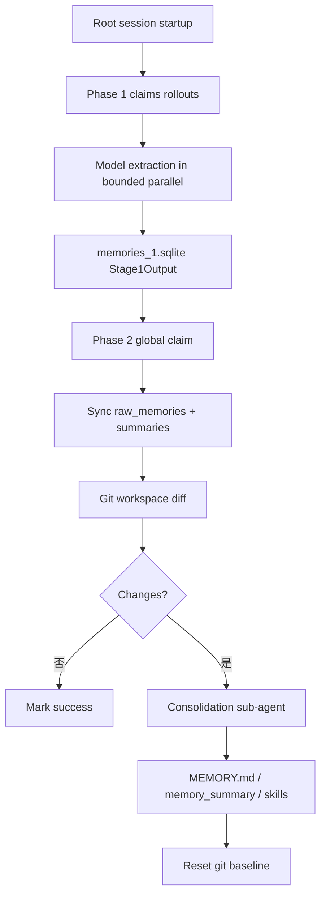

# 20｜记忆系统：Rollout 提取、全局整合与读取注入

> 源码基线：`upstream/main@283bc4cf011047314b4804c0f1ccd06e4f6a95c5`（2026-06-24）。

记忆不是把全部历史永久塞进 Prompt。当前系统将写入和读取拆开：

- `codex-memories-write`：Phase 1 / Phase 2；
- `codex-memories-read`：指令注入、citation 和 usage；
- `memories_1.sqlite`：阶段输出与任务协调；
- `~/.codex/memories/`：整合后的文件化记忆；
- memory MCP / extension：扩展读取与来源。

## 1. 运行条件

启动管线只对符合条件的 root session 运行：

- 非 ephemeral；
- feature 已启用；
- 不是 sub-agent；
- state runtime 可用。

它在后台异步执行，避免阻塞主 Agent 启动。



## 2. Phase 1：逐 rollout 提取

Phase 1 从 state 索引选取近期、空闲、来源允许且未被其他 worker 占用的 rollout。每个任务先获得 lease，再并行调用模型。

结构化输出包括：

- `raw_memory`；
- `rollout_summary`；
-可选 `rollout_slug`。

发送模型前会过滤与记忆无关的 fragment；结果写库前会做 secret redaction。无高价值内容可以记为 `succeeded_no_output`，不应强迫每个线程产生记忆。

## 3. Why bounded

扫描数量、任务 claim、并发度、年龄窗口和失败重试都有上限。记忆不能变成每次启动对全部历史做无界重算。

Lease 与 backoff 防止多个 Codex 实例重复处理相同 rollout 或失败热循环。

## 4. Phase 2：全局整合

Phase 2 只允许一个全局 job 操作共享 memories root。它从 Stage 1 结果中选 top-N：

- 使用次数优先；
- 最近使用 / 生成时间优先；
- 最终按 thread ID 稳定排序写文件。

选择排名和文件顺序分开，可避免使用排名轻微变化造成无意义的大 diff。

## 5. 文件工作区

机械生成输入：

- `raw_memories.md`
- `rollout_summaries/*.md`

Agent 维护的高层产物：

- `MEMORY.md`
- `memory_summary.md`
- `skills/`
- extension-specific artifacts。

Memories root 本身是 Codex 管理的 git baseline workspace。Phase 2 先同步输入并清理过期文件，再生成 `phase2_workspace_diff.md`，让 consolidation agent 只围绕变化工作。

## 6. Consolidation Agent

有变化时启动内部 Agent：

- 无网络；
- 仅本地 memories root 可写；
- 无审批；
-禁用 collaboration，防止递归创建子 Agent；
-后台 heartbeat 维持 job lease。

成功后删除临时 diff 并重置 git baseline。`phase2::run` 返回不一定等于 Agent 已完成，最终状态由后台 job 更新。

## 7. Memory extensions

Extension 可以在 `extensions/<source>/` 提供：

- `instructions.md`；
-来源特定资源；
-保留与删除规则。

Consolidation 必须先读每个 extension 指令，不能把所有外部记忆源按同一格式臆测。过期资源的删除也会进入 workspace diff，使 Agent 能同步移除高层记忆。

## 8. 读取路径

Read crate 负责：

- 将有界 memory developer instructions 加入上下文；
-解析 memory citation；
-记录哪些记忆被使用；
-为后续 Phase 2 排名提供 usage 信号。

读取注入同样受预算约束。`MEMORY.md` 或 summary 是检索入口，不代表所有 rollout summary 全文每回合进入 Prompt。

## 9. 独立数据库

当前记忆数据存入 `memories_1.sqlite`，不再与线程 metadata 全部共用 `state_5.sqlite`。独立 migrator 和 pool 降低锁竞争并让记忆任务独立恢复。

清空记忆必须同时考虑 DB 阶段输出和文件化 root，不能只删除 `MEMORY.md` 就声称重置完成。

## 10. 源码阅读路线

```bash
sed -n '1,220p' codex-rs/memories/README.md
rg -n "Phase 1|Stage1Output|raw_memory|redact_secrets" codex-rs/memories/write/src
rg -n "Phase 2|phase2_workspace_diff|reset_memory_workspace_baseline" \
  codex-rs/memories/write/src
rg -n "memory developer|citation|usage" codex-rs/memories/read/src
rg -n "MEMORIES_DB_FILENAME|MemoryStore" codex-rs/state/src
find codex-rs/memories -maxdepth 3 -type f | sort
```

记忆系统的原则是：

> 先从单线程历史提取有价值候选，再用受控全局 Agent 整合成可维护文件，读取时只注入当前任务需要的有界信息。
