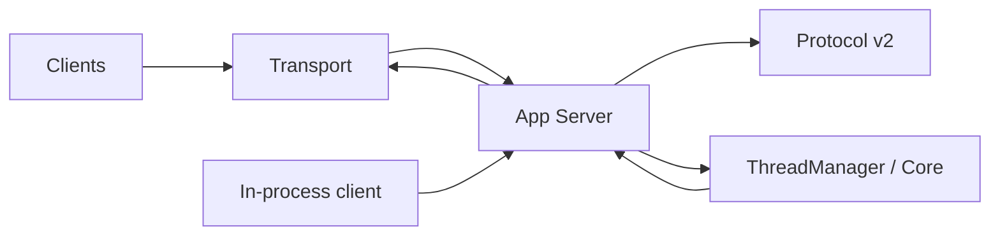

# 21｜App Server 协议层：Codex 的产品边界

> 源码基线：`upstream/main@283bc4cf011047314b4804c0f1ccd06e4f6a95c5`（2026-06-24）。

App Server 将同一套 Agent runtime 暴露给 TUI、exec、IDE、SDK、桌面和远程客户端。当前新增 API 只进入 v2；v1 保留兼容，不再扩张。

## 1. 四层结构

| Crate | 职责 |
| --- | --- |
| `app-server-protocol` | RPC、notification、server request、TS/schema |
| `app-server-transport` | stdio、Unix socket、WebSocket、连接事件 |
| `app-server` | 请求处理、Core 映射、投影、双向 RPC |
| `app-server-client` | in-process 与 remote typed client |

Daemon 负责 Unix socket 生命周期、启动锁和 remote-control，不应与协议定义混在一起。



## 2. JSON-RPC lite

Wire envelope 采用 request / response / error / notification 结构，但不发送也不要求 `"jsonrpc": "2.0"` 字段。客户端不能直接套用严格要求该字段的库而不做适配。

Request ID 支持字符串和整数。每条消息按行或 transport frame 保持完整 JSON 边界。

## 3. 初始化握手

连接必须先：

```text
client → initialize
server → initialize response
client → initialized
```

Initialize 声明 client info 与 capabilities，包括是否 opt in experimental API。未初始化连接不能任意调用业务 RPC。

In-process client 也执行同样握手，不因同进程就绕开协议状态。

## 4. Thread、Turn、Item

v2 的主语义为：

```text
thread/start or thread/resume
→ turn/start
→ item/started
→ deltas / approval requests
→ item/completed
→ turn/completed
```

Thread 是长期会话，Turn 是一次用户回合，Item 是消息、命令、文件变更、MCP 调用等可观察工作单元。

## 5. Server → Client 请求

审批不是普通 notification。Server 会发送带 request ID 的同步请求，例如：

- command execution approval；
- file change approval；
- permissions approval；
- MCP elicitation；
- request user input；
- dynamic tool call；
- auth token refresh；
- current time / attestation 等宿主能力。

客户端必须 response 或 error。若丢弃 ServerRequest，正在等待的 turn 会永久卡住，因此 client queue 在丢事件时要主动 reject。

## 6. Serialization scope

请求不会全局串行。`ClientRequestSerializationScope` 将冲突资源映射到不同队列，例如：

- global；
- global shared read；
- thread / thread path；
- command exec process；
- generic process；
- fuzzy search session；
- fs watch；
- MCP OAuth。

同 scope 串行，互不冲突的 scope 可并行。这比一个全局 mutex 更高吞吐，也比完全并发更安全。

## 7. Backpressure

Transport channel 有界。服务端过载时返回：

```text
code = -32001
message = Server overloaded; retry later
```

客户端应指数退避。Response 不能像普通低价值 notification 一样随意丢弃，否则对端会永远等待。

App-server-client 还区分必须投递的终态/语义事件和可合并的高频 delta。

## 8. Experimental API

方法或字段可用 `#[experimental(...)]` 标记。只有 initialize opt-in 的客户端才能使用相应能力。

对于 ServerRequest 中的实验字段，transport 会根据连接能力剥离字段，而不是向未 opt-in 客户端发送未知 wire shape。

## 9. Wire 约定

v2 API 遵守：

- method 为 `<resource>/<method>`；
- wire 字段 camelCase；
- string enum camelCase；
- Params 的 optional 字段使用 nullable optional TS 表达；
- response/notification optional 字段不使用 `skip_serializing_if`；
- ID 在边界使用 String；
-时间使用 Unix 秒 `i64`，命名 `*_at`；
- list method 默认 cursor pagination。

Config RPC 例外地保留 snake_case，以镜像 `config.toml`。

## 10. Schema 生成与文档

协议类型同时生成 TypeScript 和 JSON Schema。API shape 改动至少需要：

```bash
just write-app-server-schema
just write-app-server-schema --experimental  # 若影响实验契约
just test -p codex-app-server-protocol
```

并更新 `codex-rs/app-server/README.md`。Schema fixture 是契约证据，不应手改生成产物掩盖类型漂移。

## 11. 事件投影

Core Event 不会一对一裸转发。App Server 会：

- 维护 item 生命周期；
- 将 delta 投影到 v2 notification；
-把审批映射为 ServerRequest；
-更新 thread status；
-隐藏内部控制事件；
-附加 deprecation、warning、realtime 等产品事件。

这层 projector 是稳定协议与快速演进 Core 之间的隔离带。

## 12. 源码阅读路线

```bash
rg -n "client_request_definitions|server_request_definitions|server_notification_definitions" \
  codex-rs/app-server-protocol/src
rg -n "ClientRequestSerializationScope" codex-rs/app-server-protocol/src
rg -n "enum AppServerTransport|CHANNEL_CAPACITY" codex-rs/app-server-transport/src
rg -n "OVERLOADED_ERROR_CODE|strip_experimental_fields" codex-rs/app-server/src
rg -n "ServerRequestPayload|ItemStarted|TurnCompleted" codex-rs/app-server/src
rg -n "InProcessAppServer|RemoteAppServer" codex-rs/app-server-client/src
```

App Server 的核心定位是：

> 它不是 Core 的薄 JSON 包装，而是负责版本、并发、背压、双向交互和事件投影的稳定产品协议。
