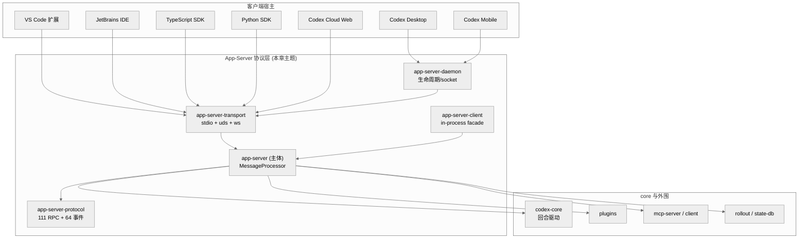
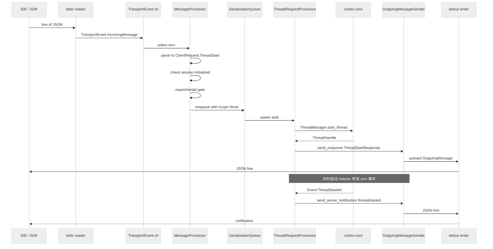
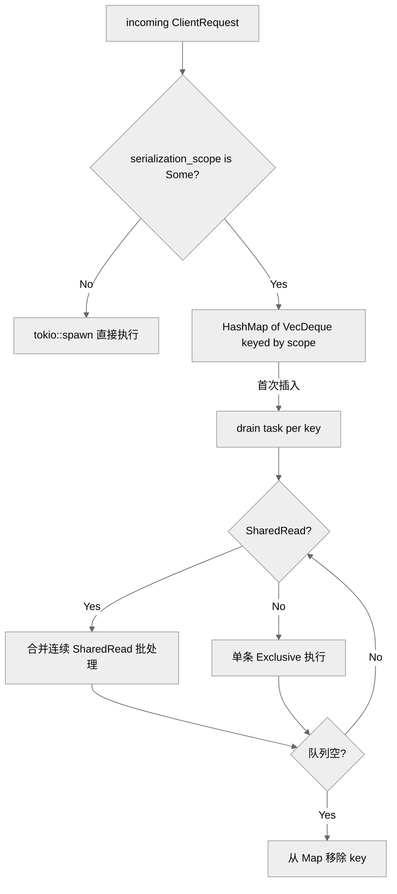
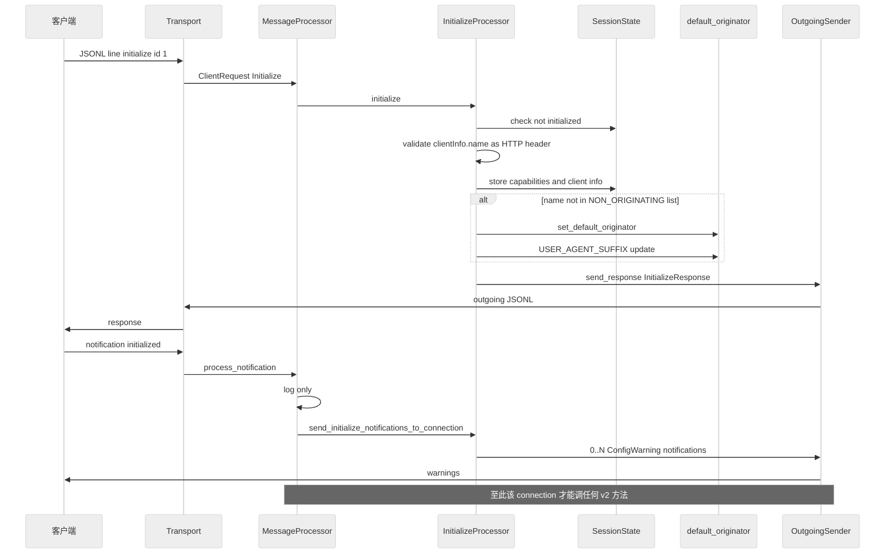
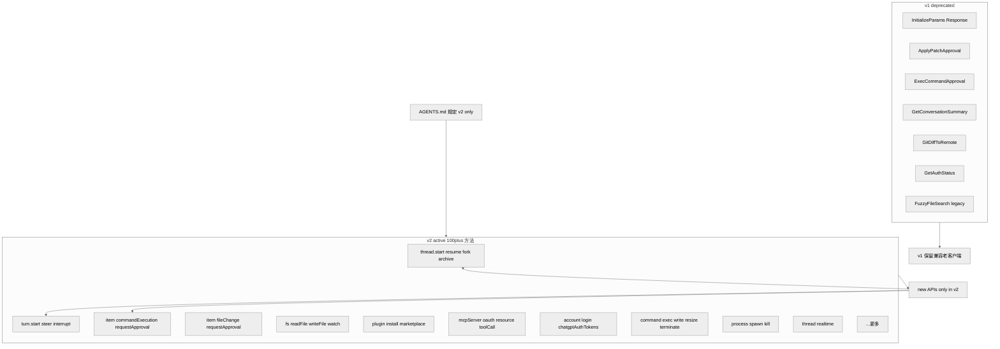

# 第 21 章 — App-Server JSON-RPC 协议层（Transport / Protocol / Daemon / Client 四件套）

## 引言

如果说 `codex-core` 是 Codex 的"大脑"——会话状态机、turn 调度器、模型回路；那么 `codex-rs/app-server*` 这一组 crate 就是它的"嘴和耳"：把内部 60 多种事件、100 多种 RPC、双向 server→client 请求，全部翻译成一行一行 newline-delimited JSON，让 VS Code 插件、IDEA 插件、TypeScript / Python / Elixir / Swift SDK、桌面 App、Codex Cloud Web 五种异质客户端都能用同一份契约接管 Codex 的全部能力。本章拆开这一层的四个 crate（`app-server-protocol` / `app-server-transport` / `app-server` 主体 / `app-server-daemon` + `app-server-client`），并回答一个核心问题：**当一个开源项目要同时支撑 CLI、IDE、Cloud 三类形态时，"协议作为产品边界"到底意味着什么？**

---

## 一、全网调研补充（社区共识、争议与盲区）

### 1.1 社区共识

围绕 `codex app-server`，截至 2026 年 5 月，社区已经形成下面几条相对低争议的共识：

1. **"JSON-RPC 2.0 减去 `jsonrpc: 2.0` 字段"是一个有意识的工程选择**，不是 bug。OpenAI 官方文档（[App Server — OpenAI Developers](https://developers.openai.com/codex/app-server)）、官方 README（`codex-rs/app-server/README.md` 第 22 行）与第三方分析（[mintlify](https://openai-codex.mintlify.app/api/overview)、[docs.rs/codex-codes](https://docs.rs/codex-codes)）都明确写出这一点。社区普遍把它理解为"对齐 MCP 风格 + 减少 stdio 行字节开销 + 简化解析路径"的三重收益。
2. **支持四种传输：stdio / unix socket / websocket / off**。最稳态的是 stdio——这是 VS Code 插件、Python SDK、TypeScript SDK 的默认选择；unix socket 主要给 `codex app-server-daemon` 和 desktop / mobile remote-control 用；websocket 在文档里被官方明确标注为 **experimental / unsupported**，但在 Codex Cloud 自家产品里其实在用。这种"对外 unsupported、对内 already in production"的双标在社区已被多次注意到。
3. **三大原语：Thread / Turn / Item**。这套词汇被 LinkedIn 上 ["Codex App Server: A New Agent Standard"](https://www.linkedin.com/pulse/codex-app-server-new-agent-standard-developrec-p9eaf) 这类传播文章固定下来，并被 `docs.rs/codex-codes` 这种第三方 Rust 客户端 crate 直接照搬到 API 描述里。`thread/start` → `turn/start` → `item/started` → `item/completed` → `turn/completed` 已经是社区默认的事件骨架。
4. **v2 才是"活的"，v1 已经冻结**。`AGENTS.md` 第 186 行写得最直白：*"All active API development should happen in app-server v2. Do not add new API surface area to v1."* 社区也注意到，v1 残留的几个方法（`getConversationSummary` / `gitDiffToRemote` / `getAuthStatus`）都打了 deprecation 标签，但出于兼容性原因不会马上删除——这是典型的"长尾兼容 + 主战场迁移"姿态。
5. **过载就回 `-32001`**。`README.md` 第 49-53 行、官方文档与所有第三方包装都把"`-32001` Server overloaded; retry later. + 指数退避"列为客户端必备模式。这条 wire-level contract 已经成为生态共识。

### 1.2 主要争议

- **争议 A：JSON-RPC 还是 MCP？** 早期 Codex 把整个能力面挂在 MCP server 下（`codex-mcp-server`），但 IDE 集成（VS Code、JetBrains、Xcode）很快遇到 MCP 不擅长"长会话双向流"的瓶颈。LinkedIn 的传播文章把这段历史概括为 *"an early attempt exposed Codex via MCP semantics. That proved limiting for IDE-grade workflows."*——这并非小修小补，而是一次架构层的"从生态协议退回到自有协议"。HN 上的反方观点则认为：*"既然主战场是 IDE，那 LSP 才是更自然的选择，自己定义 JSON-RPC 是 NIH。"* 这场争议至今没有完全平息。
- **争议 B：双向 server→client 请求是不是过度设计？** 这是 Codex 最有特色、也最容易被误解的设计：服务端可以主动给客户端发 10 种请求（`item/commandExecution/requestApproval`、`item/fileChange/requestApproval`、`account/chatgptAuthTokens/refresh`、`mcpServer/elicitation/request` 等）。Aider 等竞品坚持"approval 走主回路 + 单向流"，认为 Codex 这种双向语义把 client 实现复杂度抬高到了"client 自己也是 mini-server"。支持这种设计的解释是：**"approval 是一种需要 user-in-the-loop 的同步问询，必须能阻塞 turn 等待"**——这就要求传输是真正的双向请求/响应，而不是仅仅"事件流 + 命令流"。
- **争议 C：experimental API 该不该 opt-in？** 客户端必须在 `initialize` 时把 `capabilities.experimentalApi = true` 才能调用所有打了 `#[experimental(...)]` 标签的方法。这套机制对 SDK 作者非常友好（能避免接到非稳定字段），但被 HN 上一些读者批评为"门槛过高、社区生态发现成本被人为推高"。
- **争议 D：unix socket 模式的复杂度是否值得？** `app-server-daemon` 引入了 pid 文件、租约、控制 socket、`app-server-startup.lock`、健康探测、自动更新循环——这一切主要服务于让 desktop / mobile 端能"不重复 spawn 进程"。这种复杂度被一部分开发者认为"远超 IDE 子进程模型应有的边界"，但站在 OpenAI 自己跨设备产品的视角，也有其工程合理性。

### 1.3 长期被忽略的盲区

社区文档普遍只覆盖到"transport + RPC 列表"层面，对下列细节几乎从未做系统讨论：

1. **客户端请求按"序列化范围（serialization scope）"被分到不同串行队列**。`ClientRequestSerializationScope` 把每个方法标记成 `Global(name)` / `GlobalSharedRead(name)` / `Thread{thread_id}` / `ThreadPath{path}` / `CommandExecProcess{process_id}` / `Process{process_handle}` / `FuzzyFileSearchSession` / `FsWatch` / `McpOauth` 等 9 种 scope。**同 scope 串行执行，跨 scope 并行**——这是 Codex 应对"客户端高并发请求 + 资源冲突"的核心调度机制，但社区文章几乎一致忽略。
2. **`OVERLOADED_ERROR_CODE = -32001` 的触发条件并不简单**。当 transport_event 通道满时，新入站 request 会立即返回 overload；但如果是 response 类型则会**等待而不是丢弃**，因为丢响应会让客户端永远等下去。这种"按消息类型选择背压策略"是个非常微妙的设计。
3. **三段 outbound 流水线**。`app-server` 的主循环把"接收 → 处理 → 路由出站"拆成三个 tokio 任务，用 `OutboundControlEvent` 协调连接开/关，而不是直接共享 `HashMap`。文档里完全没提。
4. **graceful restart 的两阶段信号**。第一次 SIGINT/SIGTERM 进入 "graceful restart drain"——停止接收新连接但等待所有运行中的 assistant turn 完成；第二次信号才强制关闭。`SIGHUP` 只能触发 graceful，不能 force，这是 Unix-only 的细节。
5. **`stdio_initialize_client_name` 的一次性探针**。stdio transport 会把第一行 `initialize` 请求里的 `clientInfo.name` 通过 `oneshot::Sender<String>` 单向通知主进程，用于早期决定要不要启动 remote-control。这是个"在 transport 层窥视 protocol 层"的小破例，可能与性能/启动顺序取舍有关。
6. **`stripExperimentalFields` 的运行时降级**。当客户端没有 opt-in experimental API 时，`CommandExecutionRequestApprovalParams` 这种带 experimental 字段的 server→client 请求会在 outbound 路由的最后一道"过滤层"被剥掉实验字段——而不是 server 端拒绝发。这是一种 transport-level field masking，保证 wire 契约始终对客户端能力可见。
7. **`NON_ORIGINATING_CLIENT_NAMES` 白名单**。`codex_app_server_daemon` 和 `codex-backend` 这两个 client name 在 initialize 时**不会**修改进程级的 `set_default_originator` 与 user-agent 后缀——因为它们是 Codex 自家的中转层，不能"冒充"实际终端用户的 client identity。

---

## 二、七维分析

### 2.1 本质是什么——Codex 平台的"产品边界协议"

把 `codex-rs/app-server*` 的四个 crate 放在 workspace ~120 个 crate 的版图里看：

<div style="background:#ffffff !important; background-color:#ffffff !important; padding:16px; border-radius:8px; margin:16px 0;" bgcolor="#ffffff">



</div>

这张图本身已经传递了三件事实：

- **协议层不是一个 crate，而是一个 4-crate 组**。每个 crate 都对应一个独立的产品职责：契约（protocol）、字节（transport）、生命周期（daemon）、嵌入（client）。这种拆分让"传输能力替换"和"协议契约演进"互不绑架。
- **客户端宿主异质度极高**——从 VS Code 子进程到 Codex Cloud 容器内的 websocket，再到 mobile app 通过 daemon + remote-control 跨网；如果协议契约不是"产品边界"，就会出现"某客户端 only 字段"这种债务。
- **协议层既向外（IDE/SDK），也向内（in-process client）**——`codex_app_server::in_process` 与 `app-server-client` 让 TUI / exec 这类"住在同一个进程"的客户端也走完整的 JSON-RPC envelope，避免"transport 不一样、行为漂"的不确定性。

简单的说，**这一层就是 Codex 把"一份 agent harness"复用到 N 个产品形态的关键耦合点**。这也是为什么 `AGENTS.md` 单独为它划出一节"App-Server API Development Best Practices"——它是产品契约，不只是模块边界。

### 2.2 核心问题和痛点——必须同时解决的五个矛盾

一个看似"加一层 JSON-RPC"的工程任务，背后藏着五对必须同时调和的矛盾：

1. **接口稳定 vs 能力快进**。VS Code 插件、JetBrains 插件、第三方 SDK 一旦发布就难回收；但 Codex 本身能力（plugin marketplace、realtime audio、guardian、external agent config）几乎每两周加一组新方法。如果把"老方法不删 + 新方法能加"做错了，整个生态会被某次破坏性升级劈成两半。
2. **客户端要高自由度，服务端要强约束保护**。客户端可能一秒 spammy 发 100 个 `fs/watch`、可能在 turn 还没完成就发 `turn/start`、可能在 OAuth 中途断网。服务端必须"既能并发、又能拒绝、又能背压"。
3. **单进程串接 vs 跨进程稳态**。VS Code 用 stdio 子进程；Codex Mobile 必须跨设备走 unix socket + remote-control；Codex Cloud 在容器里直接 websocket。一套协议要同时是这三种形态的"零修改 wire 兼容"。
4. **server → client 同步问询不能丢**。`item/commandExecution/requestApproval` 是一个 turn 阻塞性请求——服务端必须停在那等用户答复才能继续。如果传输层 drop 了这条消息，整个 turn 就永远挂在那。
5. **可观测、可生成、可演化**。同一份 protocol 不仅要能跑，还要能 `codex app-server generate-ts` / `generate-json-schema` 自动导出 TypeScript / JSON Schema 给 SDK 用。这要求每一个 type 都是 derive macro 友好的，且 wire format 与 Rust struct 强同构。

这五条都是单看每个都能做、但合在一起就极难做对的事。`app-server*` 这一组 crate 的全部设计取舍，都可以从这五个矛盾倒推。

### 2.3 解决思路与方案——四件套架构

Codex 用四个 crate 把上述矛盾拆开处理：

```mermaid
%%{init:{'theme':'neutral','themeVariables':{'background':'#ffffff'}}}%%
flowchart LR
    subgraph T["app-server-transport"]
        T1["AppServerTransport enum"]
        T2["stdio / uds / ws / off"]
        T3["TransportEvent channel"]
        T4["overload backpressure"]
    end
    subgraph P["app-server-protocol"]
        P1["111 ClientRequest"]
        P2["10 ServerRequest"]
        P3["64 ServerNotification"]
        P4["v1 deprecated + v2 active"]
        P5["experimental gating"]
        P6["TS / JSON Schema export"]
    end
    subgraph S["app-server (主体)"]
        S1["MessageProcessor"]
        S2["27 RequestProcessor"]
        S3["RequestSerializationQueues"]
        S4["ConnectionRpcGate"]
        S5["outbound router"]
    end
    subgraph D["app-server-daemon"]
        D1["lifecycle.sock"]
        D2["pid + lock"]
        D3["remote-control client"]
        D4["update loop"]
    end
    subgraph C["app-server-client"]
        C1["in-process facade"]
        C2["RemoteAppServerClient"]
        C3["lossless event tier"]
    end

    T -->|JSONRPCMessage| S
    S -->|ClientRequest| P
    S -->|ServerResponse| T
    D -->|spawn + probe| S
    C -->|InProcess / Remote| S
```

<div style="background:#ffffff !important; background-color:#ffffff !important; padding:16px; border-radius:8px; margin:16px 0;" bgcolor="#ffffff">



</div>

#### 2.3.1 `app-server-protocol`：契约层（"产品边界"）

它本身**不参与传输**，只负责定义"wire format + 类型"。核心是两个文件：

- `protocol/common.rs`（3,221 行）：**用三组宏 `client_request_definitions!`、`server_request_definitions!`、`server_notification_definitions!` 一次性生成所有方法枚举、TS 类型、JSON Schema 导出函数、experimental 检查、serialization scope 派发**。

```rust
// codex-rs/app-server-protocol/src/protocol/common.rs:435
client_request_definitions! {
    Initialize { params: v1::InitializeParams, serialization: None, response: v1::InitializeResponse, },

    ThreadStart => "thread/start" {
        params: v2::ThreadStartParams,
        inspect_params: true,
        serialization: None,
        response: v2::ThreadStartResponse,
    },
    ThreadResume => "thread/resume" {
        params: v2::ThreadResumeParams,
        inspect_params: true,
        serialization: thread_or_path(params.thread_id, params.path),
        response: v2::ThreadResumeResponse,
    },
    // ... 共 111 个变体
}
```

每个变体声明 5 件事：(a) 方法 wire 名（如 `thread/start`）；(b) Params/Response 类型；(c) **serialization scope**——服务端串行调度策略；(d) 是否需要 `inspect_params`（按字段级判断 experimental）；(e) 可选的 `#[experimental(reason)]` 元数据。

- `jsonrpc_lite.rs`（88 行）：定义 `JSONRPCMessage` 4 变体（Request / Notification / Response / Error）、`RequestId` 双形态（String / Integer）、`W3cTraceContext` 字段。整个文件第一行注释就交代了"我们不做真正的 JSON-RPC 2.0，因为不发也不期待 `"jsonrpc": "2.0"` 字段"。

```rust
// codex-rs/app-server-protocol/src/jsonrpc_lite.rs:1
//! We do not do true JSON-RPC 2.0, as we neither send nor expect the
//! "jsonrpc": "2.0" field.
```

#### 2.3.2 `app-server-transport`：字节层（"传输能力替换"）

只关心"从字节到 `JSONRPCMessage`、再从 `OutgoingMessage` 到字节"。核心是 4 种 transport：

```rust
// codex-rs/app-server-transport/src/transport/mod.rs:66
pub enum AppServerTransport {
    Stdio,
    UnixSocket { socket_path: AbsolutePathBuf },
    WebSocket { bind_address: SocketAddr },
    Off,
}
```

它**不知道任何业务方法**，只产出统一的 `TransportEvent`：

```rust
// codex-rs/app-server-transport/src/transport/mod.rs:163
pub enum TransportEvent {
    ConnectionOpened {
        connection_id: ConnectionId,
        origin: ConnectionOrigin,
        writer: mpsc::Sender<QueuedOutgoingMessage>,
        disconnect_sender: Option<CancellationToken>,
    },
    ConnectionClosed { connection_id: ConnectionId },
    IncomingMessage { connection_id: ConnectionId, message: JSONRPCMessage },
}
```

正是这种"transport 只产 `TransportEvent`"的薄抽象，让上层 `app-server` 主循环可以用同一个 `tokio::select!` 处理 stdio / uds / ws 三种形态，不用为每种 transport 写一份处理器。

#### 2.3.3 `app-server`：业务主体层（"调度 + 串行化 + 双向 RPC"）

`lib.rs`（1,117 行）+ `message_processor.rs`（1,363 行）+ 27 个 `request_processors/*.rs`。核心抽象有四个：

- **`MessageProcessor`**：持有 21 个具名 processor，靠一个 1,200 行的 `match codex_request { ... }` 把 111 个方法分发到对应 processor。
- **`RequestSerializationQueues`**：按方法声明的 scope 把请求放进同 key 的串行队列，跨 key 并发。
- **`ConnectionRpcGate`**：每个连接一把"关闭后不再接、已进入的允许完成"的门闩，用 `TaskTracker` 等待 in-flight 任务。
- **`OutgoingMessageSender`**：单一出站口，既能 `send_request`（server→client 阻塞请求 + oneshot callback）、又能 `send_response` / `send_error` / `send_server_notification`。

#### 2.3.4 `app-server-daemon` + `app-server-client`：生命周期 + 嵌入层

- `app-server-daemon`（1,024 行）：Unix-only 的"长进程管理者"。负责"启停 / 重启 / 探活 / 自动更新"四件套，写一份 `app-server.pid` + 一把 `daemon.lock` 做全 CODEX_HOME 串行化。Desktop / Mobile 用它而不直接 `spawn`。
- `app-server-client`（2,279 行）：CLI surfaces（TUI、exec）用来"以 in-process 方式跑 app-server"。它把 `InProcessClientHandle` 包成"消费者-生产者 worker 任务 + 受界通道 + 优雅关停"，最大特点是保留了 JSON-RPC envelope，让 in-process 和 stdio/socket 三类客户端行为完全一致。

---

### 2.4 实现细节关键点

#### 2.4.1 一条 RPC 的完整生命周期

把所有抽象串起来后，一条 `thread/start` 在 Codex 里走的实际路径如下：

<div style="background:#ffffff !important; background-color:#ffffff !important; padding:16px; border-radius:8px; margin:16px 0;" bgcolor="#ffffff">



</div>

逐段对应源码：

**第 ①-② 步：stdin 行 → `JSONRPCMessage`**。`start_stdio_connection` 启动两个 tokio 任务：reader 任务调 `lines.next_line().await`，把每行交给 `forward_incoming_message`。

```rust
// codex-rs/app-server-transport/src/transport/stdio.rs:43
stdio_handles.push(tokio::spawn(async move {
    let stdin = io::stdin();
    let reader = BufReader::new(stdin);
    let mut lines = reader.lines();
    // ...
    loop {
        match lines.next_line().await {
            Ok(Some(line)) => {
                if let Some(client_name) = stdio_initialize_client_name(&line)
                    && let Some(tx) = initialize_client_name_tx.take()
                {
                    let _ = tx.send(client_name);
                }
                if !forward_incoming_message(
                    &transport_event_tx_for_reader,
                    &writer_tx_for_reader,
                    connection_id,
                    &line,
                ).await { break; }
            }
            // ...
        }
    }
}));
```

注意 `stdio_initialize_client_name`——它在通用 `forward_incoming_message` 之前先 peek 一眼，把 `clientInfo.name` 通过 `oneshot::Sender<String>` 发给主进程，这是后面 remote-control 决策需要的信息。

**第 ③ 步：背压策略**。`enqueue_incoming_message`（`transport/mod.rs:211`）用 `try_send`，分三种情况：

- 成功：路由到 processor。
- 通道关闭：返回 false，整个 transport 任务退出。
- 通道满 + Request：立刻回 `-32001` overload error 给客户端；通道满 + Response：**等待 send 而不是丢**，因为 drop 一个响应会让客户端永远阻塞。

```rust
// codex-rs/app-server-transport/src/transport/mod.rs:222
Err(mpsc::error::TrySendError::Full(TransportEvent::IncomingMessage {
    connection_id,
    message: JSONRPCMessage::Request(request),
})) => {
    let overload_error = OutgoingMessage::Error(OutgoingError {
        id: request.id,
        error: JSONRPCErrorError {
            code: OVERLOADED_ERROR_CODE,    // -32001
            message: "Server overloaded; retry later.".to_string(),
            data: None,
        },
    });
    // ...
}
```

**第 ④-⑤ 步：JSON 转 `ClientRequest`**。`MessageProcessor::process_request` 先把 `JSONRPCRequest` 转回 JSON 再 deserialize 成 typed `ClientRequest`——一来一回的开销换来的是让 `serde(tag = "method")` 自动派发到具体变体。

```rust
// codex-rs/app-server/src/message_processor.rs:543
let codex_request = serde_json::to_value(&request)
    .map_err(|err| invalid_request(format!("Invalid request: {err}")))
    .and_then(|request_json| {
        serde_json::from_value::<ClientRequest>(request_json)
            .map_err(|err| invalid_request(format!("Invalid request: {err}")))
    });
```

**第 ⑥-⑦ 步：初始化校验 + experimental 检查**。`handle_client_request` 先把 `Initialize` 分支单独处理（因为它是唯一允许在 `initialized = false` 下调用的方法）；其余方法经 `dispatch_initialized_client_request` 校验 `session.initialized()` 与 `experimental_reason()`：

```rust
// codex-rs/app-server/src/message_processor.rs:795
async fn dispatch_initialized_client_request(...) {
    if !session.initialized() {
        return Err(invalid_request("Not initialized"));
    }

    if let Some(reason) = codex_request.experimental_reason()
        && !session.experimental_api_enabled()
    {
        return Err(invalid_request(experimental_required_message(reason)));
    }
    // ...
}
```

**第 ⑧ 步：序列化范围调度**。`ClientRequest::serialization_scope()` 由宏自动从声明信息里生成。`thread/start` 是 `None`（可并行），`thread/resume` 是 `thread_or_path(params.thread_id, params.path)`，`config/value/write` 是 `global("config")`。然后：

```rust
// codex-rs/app-server/src/message_processor.rs:838
if let Some(scope) = serialization_scope {
    let (key, access) = RequestSerializationQueueKey::from_scope(connection_id, scope);
    self.request_serialization_queues.enqueue(key, access, request).await;
} else {
    tokio::spawn(async move { request.run().await; });
}
```

**第 ⑨-⑩ 步：派发到 ProcessorImpl**。`handle_initialized_client_request` 是 1,200 行的 `match`，把每个变体派到对应 processor（`thread_processor.thread_start(...)`、`config_processor.read(...)` ...）。

**第 ⑪ 步：response 出站**。Processor 返回 `Result<Option<ClientResponsePayload>, JSONRPCErrorError>`，根据三态分支：

```rust
// codex-rs/app-server/src/message_processor.rs:1346
match result {
    Ok(Some(response)) => {
        self.outgoing.send_response_as(request_id.clone(), response).await;
    }
    Ok(None) => {}  // response 由 processor 自己异步推送（如 ProcessSpawn、ExternalAgentConfigImport）
    Err(error) => {
        self.outgoing.send_error(request_id.clone(), error).await;
    }
}
```

**第 ⑫ 步：写回 stdout**。stdout writer 任务从 channel 拉 `QueuedOutgoingMessage`，逐条 `serialize_outgoing_message` 后 `write_all` 并附换行。如果有 `write_complete_tx`，会在写完通知发送方——这是 `OutgoingMessageSender` 给"需要 ack 才能继续"的内部代码使用的。

#### 2.4.2 `RequestSerializationQueues`——按 scope 串行的核心数据结构

这是 Codex 整个调度模型里被忽视最严重的一段。

<div style="background:#ffffff !important; background-color:#ffffff !important; padding:16px; border-radius:8px; margin:16px 0;" bgcolor="#ffffff">



</div>

实现要点：

- `RequestSerializationQueueKey`（9 种 scope）+ `RequestSerializationAccess`（Exclusive / SharedRead）是分类基础。
- **首次入队会 spawn 一个 drain 任务**，后续同 key 入队只 push_back。这避免了"每条请求一个 task"的开销。
- **`SharedRead` 之间合并并发**：drain 时若队头是 SharedRead，会把所有连续 SharedRead 一次性 `join_all`。这就是为什么 `config/read` 和 `skills/list` 这类只读方法可以"批量同时读"，而 `config/value/write` 必须独占。

```rust
// codex-rs/app-server/src/request_serialization.rs:176
match queue.pop_front() {
    Some(request) => {
        let access = request.access;
        let mut requests = vec![request];
        if access == RequestSerializationAccess::SharedRead {
            while queue.front().is_some_and(|r| r.access == RequestSerializationAccess::SharedRead) {
                if let Some(r) = queue.pop_front() { requests.push(r); } else { break; }
            }
        }
        requests
    }
    // ...
}
```

- 同一个 `thread_id` 的所有方法（resume / archive / rollback / shellCommand ...）都映射到 `RequestSerializationQueueKey::Thread { thread_id }`，因此**对同一个 thread 的所有 mutating 操作天然串行，不会出现"resume 跟 archive 并发交错"的竞态**。
- `command/exec` 系列把 `process_id` 作为 key——这意味着同一个外部进程的 write / resize / terminate 永远按 FIFO 执行，不需要 processor 自己加锁。

#### 2.4.3 `ConnectionRpcGate`——优雅关停的"门闩"

每个连接持有一个 gate（`ConnectionSessionState::rpc_gate`）。`run(future)` 先在 `accepting` mutex 下取 token，gate `shutdown` 后再调 `run` 会立刻返回（不执行 future）；已在跑的 future 通过 `TaskTracker.wait()` 等到完成。

```rust
// codex-rs/app-server/src/connection_rpc_gate.rs:25
pub(crate) async fn run<F>(&self, future: F)
where F: Future<Output = ()>,
{
    let token = {
        let accepting = self.accepting.lock().await;
        if !*accepting { return; }
        self.tasks.token()
    };
    future.await;
    drop(token);
}
```

这个看似简单的 60 行抽象其实承担了"连接关闭后不让新请求溜进来 + 等待 in-flight 请求结束 + 不阻塞其他连接"三件事——所以 `app-server` 整个进程的 graceful shutdown 才能拆成"逐连接 gate.shutdown" + "outbound channel close"两个阶段。

#### 2.4.4 三段流水线 + `OutboundControlEvent`

`run_main_with_transport_options` 同时持有三类任务：

- **transport accept**：每种 transport 一个或多个 acceptor 任务，产 `TransportEvent`。
- **processor task**：单任务，串行消费 `transport_event_rx` + `thread_created_rx` + `remote_control_status_rx`，把"应该对此连接同步的状态"通过 `outbound_control_tx` 通知出站任务。
- **outbound task**：单任务，持有 `HashMap<ConnectionId, OutboundConnectionState>`，承担 `Broadcast` / `ToConnection` 路由。

为什么把出站独立成任务？因为某个慢客户端（writer 通道满）不能拖累整个 processor。出站任务用 `try_send` 测试通道是否满，对**可断的连接**（websocket、unix socket 有 disconnect_sender）选择"满 → 主动断开"；对**不可断的连接**（stdio，没法"半断"）则 `await send` 阻塞等待——这种按 transport 物理性质区别处理的策略在 `send_message_to_connection` 里写得非常直白：

```rust
// codex-rs/app-server/src/transport.rs:151
if connection_state.can_disconnect() {
    match writer.try_send(queued_message) {
        Ok(()) => false,
        Err(mpsc::error::TrySendError::Full(_)) => {
            warn!("disconnecting slow connection after outbound queue filled: {connection_id:?}");
            disconnect_connection(connections, connection_id)
        }
        Err(mpsc::error::TrySendError::Closed(_)) => disconnect_connection(connections, connection_id),
    }
} else if writer.send(queued_message).await.is_err() {
    disconnect_connection(connections, connection_id)
} else {
    false
}
```

#### 2.4.5 双向 server→client 请求的 callback 机制

`ServerRequestPayload` 共 10 个变体，最典型的是 `CommandExecutionRequestApproval`。`OutgoingMessageSender::send_request` 用一个 `AtomicI64` 生成 id，把一个 `oneshot::Sender<Result<...>>` 塞进 `request_id_to_callback` 映射，然后把 `ServerRequest` 序列化出站。客户端的 `ServerResponse` / `JSONRPCError` 到达后，`process_response` / `process_error` 通过 `notify_client_response` / `notify_client_error` 把结果路由回 oneshot——一种典型的"基于 id 的 promise 路由"。

`message_processor.rs` 顶部 `ExternalAuthRefreshBridge` 是这种机制最教科书的示例：

```rust
// codex-rs/app-server/src/message_processor.rs:120
let (request_id, rx) = self
    .outgoing
    .send_request(ServerRequestPayload::ChatgptAuthTokensRefresh(params))
    .await;

let result = match timeout(EXTERNAL_AUTH_REFRESH_TIMEOUT, rx).await {
    Ok(result) => { /* 区分 oneshot 关闭与 client 错误 */ }
    Err(_) => {
        let _canceled = self.outgoing.cancel_request(&request_id).await;
        return Err(std::io::Error::other(format!(
            "auth refresh request timed out after {}s",
            EXTERNAL_AUTH_REFRESH_TIMEOUT.as_secs()
        )));
    }
};
```

这段把"服务端要登录 token → 客户端拿浏览器去刷 token → 返回 → 服务端继续"的双向回话压在一个 10 秒 timeout 里，超时还会主动 `cancel_request`，避免内存里挂着死的 oneshot。这就是 Codex 把"Approval-as-RPC"做成 platform-level pattern 的核心机制。

#### 2.4.6 `bespoke_event_handling` — 把 core 事件翻译成协议通知

`app-server` 与 `codex-core` 之间不是直接耦合，而是隔着 `bespoke_event_handling.rs`（3,837 行）这一层"事件翻译机"。每个 thread listener task 启动后会持续从 core 拉 `Event { id, msg: EventMsg }`，再按 50 多个 `EventMsg::*` 分支翻译成对应的 `ServerNotification`：

```rust
// codex-rs/app-server/src/bespoke_event_handling.rs:150
match msg {
    EventMsg::TurnStarted(payload) => {
        outgoing.abort_pending_server_requests().await;
        thread_watch_manager
            .note_turn_started(&conversation_id.to_string()).await;
        // ... 组装 turn 对象，发送 ServerNotification::TurnStarted(notification)
    }
    EventMsg::TurnComplete(turn_complete_event) => {
        outgoing.abort_pending_server_requests().await;
        respond_to_pending_interrupts(&thread_state, &outgoing).await;
        // ...
    }
    EventMsg::McpStartupUpdate(update) => { /* -> McpServerStatusUpdated */ }
    EventMsg::Warning(warning_event) => { /* -> Warning notification */ }
    // ... 还有 50+ 个分支
}
```

这里有两个值得展开的工程细节：

- **`abort_pending_server_requests` 的强生命周期绑定**。每个 turn 启动和完成时都会把"还没回的 server→client 请求"（典型是 approval）强制中止。这避免了一种典型病态：用户在第 N 个 turn 跑到一半批准了第 N-1 个 turn 的某条命令，导致命令被错误执行——这种"approval 跨 turn 漂移"的 race condition 在 Aider / Continue 这类没有显式 turn 模型的系统里非常常见。
- **`ThreadWatchManager` 的 watcher 计数**。每个连接调用 `thread/start` 或 `thread/resume` 后会自动 subscribe 到那个 thread 的事件流。watcher 计数为 0 时不再翻译事件（节省 CPU 和带宽）；新连接 subscribe 时会立刻"反映式补发"当前最新的 `turn/started` / `item/started` 状态——这种"事件流 + 状态快照"双轨设计让客户端无论何时连入都能正确恢复 UI。

这也是为什么 `ThreadItem` 这个 enum 在 `protocol/v2/item.rs` 里要列出 16 个变体（UserMessage、AgentMessage、Plan、Reasoning、CommandExecution、FileChange、McpToolCall、DynamicToolCall、CollabAgentToolCall、WebSearch、ImageView、ImageGeneration、EnteredReviewMode、ExitedReviewMode、ContextCompaction、HookPrompt）——每一种都是 core 内部状态的一个稳定外部投影。

#### 2.4.7 `in_process` 与 `app-server-client` — 让"同进程"也走完整协议

`codex-app-server-client::in_process` 是这套架构里最容易被低估的一块。它的核心思想是：**即便 TUI / exec 与 app-server 处于同一进程内，也要走完整的 JSON-RPC envelope，不开后门**。

```rust
// codex-rs/app-server/src/in_process.rs:18
//! # Transport model
//!
//! The runtime is transport-local but not protocol-free. Incoming requests are
//! typed [`ClientRequest`] values, yet responses still come back through the
//! same JSON-RPC result envelope that `MessageProcessor` uses for stdio and
//! websocket transports. This keeps in-process behavior aligned with
//! app-server rather than creating a second execution contract.
```

为什么这条设计原则重要？因为如果 TUI 走"特殊后门"直接调 core，会出现两个产品级问题：

1. **行为漂**：TUI 看到的 turn 流程和 IDE 看到的会不一致，bug 难复现。
2. **测试矩阵爆炸**：每个新方法既要 stdio 跑一遍，又要 in-process 跑一遍，且断言可能不同。

`InProcessClientHandle::request` 提交 `ClientRequest`，回来的依然是 `JsonRpcResult`（即 `serde_json::Value`），客户端自己再 typed deserialize。看起来"多此一举"，实际是用一点性能换"transport-agnostic behavior parity"。

更进一步，`app-server-client` 在 `in_process` 之上又包了一层"lossless event tier"——`server_notification_requires_delivery` 函数严格区分哪些通知**必须送达**（`AgentMessageDelta`、`PlanDelta`、`ReasoningSummaryTextDelta`、`ReasoningTextDelta`、`ItemCompleted`、`TurnCompleted`、`ThreadSettingsUpdated`），哪些可以在背压时丢（`CommandExecutionOutputDelta`、`McpToolCallProgress` 等）：

```rust
// codex-rs/app-server-client/src/lib.rs:175
pub(crate) fn server_notification_requires_delivery(notification: &ServerNotification) -> bool {
    matches!(
        notification,
        ServerNotification::TurnCompleted(_)
            | ServerNotification::ThreadSettingsUpdated(_)
            | ServerNotification::ItemCompleted(_)
            | ServerNotification::AgentMessageDelta(_)
            | ServerNotification::PlanDelta(_)
            | ServerNotification::ReasoningSummaryTextDelta(_)
            | ServerNotification::ReasoningTextDelta(_)
    )
}
```

这种"按事件语义分级"的背压策略是平台化的关键——丢一帧 `CommandExecOutputDelta` 客户端最多看到 stdout 抖一下；丢一帧 `AgentMessageDelta` 会让 TUI 的 markdown 永远显示残缺；丢一帧 `TurnCompleted` 会让 UI 永远卡在 "running…"。同一套通知，按业务后果分两类背压策略，比"全部尽力 / 全部阻塞"两种极端都更合理。

#### 2.4.8 Initialize 握手 — connection-level 能力协商

`InitializeRequestProcessor::initialize` 是整个会话的入口：

<div style="background:#ffffff !important; background-color:#ffffff !important; padding:16px; border-radius:8px; margin:16px 0;" bgcolor="#ffffff">



</div>

要点逐条解释：

- **`InitializeCapabilities`** 包含 3 个字段（`experimental_api`、`request_attestation`、`opt_out_notification_methods`），全部声明为可选并 default false / empty。`opt_out_notification_methods` 让客户端主动告诉服务端"我不想要这些通知"（例如某些纯只读插件只关心 turn 完成，不想看每个 item delta），减少 wire 流量。
- **client name 校验**：必须能转成合法 HTTP header value，否则会被拒。原因是 client name 会作为 `originator` 写进上游 OpenAI API 的请求头，非法字符会让上游拒绝整条请求。
- **NON_ORIGINATING_CLIENT_NAMES 白名单**：`codex_app_server_daemon` 和 `codex-backend` 这两个 client name 在 initialize 时**不修改进程级 originator / user-agent 后缀**。daemon 是个中转层，真正的"用户身份"应该由它转发的下游客户端决定，而不是 daemon 自己冒充。
- **配置告警的延迟下发**：服务端启动时收集的 `config_warnings`（如"项目目录未信任，相关 hook 已禁用"）不会在启动时就广播，而是等每个连接初始化完成后单独下发——这样新连接接入时就能正确显示当前配置状态，不会错过启动告警。

`AGENTS.md` 的 hard rule "每个 connection 只能 initialize 一次" 的源码实证就在 `if session.initialized() { return Err(invalid_request("Already initialized")); }` 这一行——OnceLock 提供单写保证。

#### 2.4.9 schema 工具链 — TS / JSON Schema 自动导出

`codex app-server generate-ts --out DIR` 和 `generate-json-schema --out DIR` 让 SDK 作者可以"一键拿到当前版本完整 wire 契约"。实现在 `export.rs` 的 `generate_ts_with_options`：

```rust
// codex-rs/app-server-protocol/src/export.rs:105
ClientRequest::export_all_to(out_dir)?;
export_client_responses(out_dir)?;
ClientNotification::export_all_to(out_dir)?;

ServerRequest::export_all_to(out_dir)?;
export_server_responses(out_dir)?;
ServerNotification::export_all_to(out_dir)?;

if !options.experimental_api {
    filter_experimental_ts(out_dir)?;
}

if options.generate_indices {
    generate_index_ts(out_dir)?;
    generate_index_ts(&v2_out_dir)?;
}
```

`#[ts(export_to = "v2/")]` 让 v2 类型自动落到子目录；`#[experimental(...)]` 字段在 `experimental_api = false` 模式下会被 `filter_experimental_ts` 物理删除——确保发布给社区的稳定 SDK 看不到任何实验字段。

JSON Schema 则覆盖所有 envelope + 所有 Params / Response / Notification，并通过 `EXPERIMENTAL_CLIENT_METHODS` / `EXPERIMENTAL_CLIENT_METHOD_PARAM_TYPES` / `EXPERIMENTAL_CLIENT_METHOD_RESPONSE_TYPES` 三个 const 数组记录"哪些方法 / 类型是实验性的"，让下游 codegen 可以做按需过滤。

`AGENTS.md` 第 217 行明确要求 schema 变更后必须运行 `just write-app-server-schema`——这是 schema fixture 与代码同步的强制 hook，防止"方法加了，schema 还没更新"导致 SDK 编译不过。

---

#### 2.4.10 一段真实 wire 报文示例

为了让上面的抽象更具体，看一段从 `app-server` 主循环视角拿到的真实 stdio 报文序列（已脱敏并整理换行）：

```jsonl
{"id":1,"method":"initialize","params":{"clientInfo":{"name":"vscode-codex","version":"0.45.0"},"capabilities":{"experimentalApi":false,"requestAttestation":false}}}
{"id":1,"result":{"userAgent":"codex_cli_rs/0.42.0 (vscode-codex; 0.45.0)","codexHome":"/Users/me/.codex","platformFamily":"unix","platformOs":"macos"}}
{"method":"initialized"}
{"id":2,"method":"thread/start","params":{"model":"gpt-5","cwd":"/Users/me/work/proj"}}
{"method":"configWarning","params":{"summary":"Project-local config disabled until trusted"}}
{"id":2,"result":{"thread":{"id":"thr_abc123","status":"idle","ephemeral":false},"model":"gpt-5","modelProvider":"openai","cwd":"/Users/me/work/proj","sandbox":{...},"reasoningEffort":"medium"}}
{"method":"thread/started","params":{"threadId":"thr_abc123","thread":{...}}}
{"id":3,"method":"turn/start","params":{"threadId":"thr_abc123","input":[{"type":"text","text":"Refactor src/foo.rs to use anyhow"}]}}
{"id":3,"result":{"turn":{"id":"turn_001","status":"inProgress","startedAt":1748345678}}}
{"method":"turn/started","params":{"threadId":"thr_abc123","turn":{...}}}
{"method":"item/started","params":{"threadId":"thr_abc123","turnId":"turn_001","item":{"type":"reasoning","id":"item_001"}}}
{"method":"item/reasoning/textDelta","params":{"threadId":"thr_abc123","itemId":"item_001","delta":"Reading src/foo.rs..."}}
{"method":"item/commandExecution/requestApproval","id":"srvreq_42","params":{"threadId":"thr_abc123","item":{...},"command":"rg --files src","cwd":"/Users/me/work/proj"}}
{"id":"srvreq_42","result":{"decision":"accept"}}
{"method":"item/commandExecution/outputDelta","params":{"itemId":"item_002","chunk":"<base64>"}}
{"method":"item/completed","params":{"threadId":"thr_abc123","turnId":"turn_001","item":{...}}}
{"method":"turn/completed","params":{"threadId":"thr_abc123","turn":{...}}}
```

可以看到几个语义层叠：

- 同一条流里同时混合 4 种 JSON-RPC 消息（Request 由 client 发、Response 由 server 发回 + server→client Request、client 发回 Response、Notification 由 server 单向推送）。
- `id` 既可以是数字也可以是字符串——`srvreq_42` 就是服务端用 `next_server_request_id` 生成的，客户端必须如实回原 id。
- `method` 字段的层级语义清晰：`thread/start`（lifecycle）、`item/commandExecution/requestApproval`（双向 RPC）、`item/reasoning/textDelta`（流式增量）、`turn/completed`（lifecycle 终态）。三段式（`<resource>/<sub>/<verb>`）让客户端可以用前缀订阅。

#### 2.4.11 v1 / v2 兼容矩阵的事实结构

<div style="background:#ffffff !important; background-color:#ffffff !important; padding:16px; border-radius:8px; margin:16px 0;" bgcolor="#ffffff">



</div>

`AGENTS.md` 第 186-190 行明确写出 v2 only 的工作规则，并对 wire 命名、字段命名、namespace、experimental 标签做出 hard rules：

- 方法命名必须是 `<resource>/<method>` 且 `<resource>` 单数（`thread/read`，不能写 `threads/read`）。
- 字段统一 camelCase（`#[serde(rename_all = "camelCase")]`），唯一例外是 `config/*` 系列保留 snake_case 以镜像 `config.toml`。
- v2 类型必须有 `#[ts(export_to = "v2/")]`，否则生成 TS 时类别错乱。
- v2 payload 字段**禁止** `#[serde(skip_serializing_if = "Option::is_none")]`，唯一例外是 client→server 请求允许"无 params"的特殊形态。
- 实验性的方法在变体上加 `#[experimental("method/name")]`，未 opt-in 的客户端调用立即返回 `Not initialized`/experimental 拒绝错误。
- 实验性的字段在 struct 字段上加 `#[experimental(...)]`，**未 opt-in 时 outbound 会被自动剥掉**——保持 wire 契约稳定。

`ClientRequest` 里除了 `Initialize`，v1 兼容段还保留 7 个 deprecated 方法（`GetConversationSummary` / `GitDiffToRemote` / `GetAuthStatus` / `FuzzyFileSearch` 等），全部位于 `common.rs:1035` 起的 `DEPRECATED APIs below` 段。这种"长尾兼容 + 主战场迁移"的工程姿态在宏定义末尾看得很清楚。

#### 2.4.12 `app-server-daemon` 的生命周期

Desktop / Mobile 走的是另一条路径：通过 `codex app-server-daemon` 启动一个**长进程**，持有 `~/.codex/app-server-control/app-server-control.sock` 这个 unix domain socket。Daemon 自身用三件套保证不会"重复启动 / 残留 socket / 与外部 binary 同步":

- `app-server-startup.lock`：`flock` 排它锁，启动期间持有，防止两个进程同时 bind socket。
- `app-server.pid` / `app-server-updater.pid`：写盘的 pid 文件，重启后通过 `kill -0` 探活。
- `daemon.lock`：覆盖 `start` / `stop` / `restart` / `enable-remote-control` / `disable-remote-control` 5 类 lifecycle 操作的排他锁，保证 CODEX_HOME 维度的 lifecycle 操作严格串行。

```rust
// codex-rs/app-server/src/lib.rs:522
let unix_socket_startup_lock = match &transport {
    AppServerTransport::UnixSocket { socket_path } => {
        let startup_lock_path = app_server_startup_lock_path(&codex_home)?;
        let startup_lock = acquire_app_server_startup_lock(startup_lock_path).await?;
        prepare_control_socket_path(socket_path.as_path()).await?;
        Some(startup_lock)
    }
    _ => None,
};
```

`prepare_control_socket_path` 还会先尝试连一下旧 socket 路径，区分"还活着 / 已 stale / 同名文件不是 socket"，避免 stale socket 阻断启动。

#### 2.4.13 `app-server-daemon` 的全 lifecycle 细节

把视野放回 daemon，可以发现这一组 1,024 行的代码其实在做"用 Unix 原语模拟一个简易 systemd unit"：

- **三种 backend**：`BackendKind::Pid`（pid 文件 + `kill -0` 探活）、`BackendKind::Launchd`（保留给将来 macOS launchd 集成）、`BackendKind::Systemd`（保留给 Linux 用户级 unit）。当前实现只完整支持 Pid，但 enum 的存在让未来切换不破契约。
- **`Daemon::start` 是幂等的**：先 `client::probe(socket_path)` 探一下能不能连，如果当前已经有人在跑就直接返回 `LifecycleStatus::AlreadyRunning`；否则启动 + 写 pid + `wait_until_ready` 探活直到能完整跑完 JSON-RPC initialize handshake。"返回前必须就绪" 这个语义比"返回前进程已启动"更适合上游的 remote-control 客户端。
- **`OPERATION_LOCK_TIMEOUT = 75s`**：daemon.lock 的等待上限。如果 75 秒还拿不到锁，会返回明确错误而不是无限等。这避免了"CI 里两个 `codex app-server-daemon start` 并发导致 5 分钟卡死"。
- **`enable_remote_control` 与 `disable_remote_control` 的 restart 副作用**：这两个命令不仅写 `settings.json`，还会在 daemon 已经在跑时**立刻 restart**，让新设置即时生效。这种"配置即操作"的语义让客户端不用做"改设置 → 提示用户手动重启"的双步流程。
- **`RemoteControlReadyOutput`**：bootstrap 之上还有"等到 remote-control 真正能用"这一层等待，把"daemon 启动 + remote-control 协议连通"两件事一次性 await。Codex Cloud 的 mobile 端依赖这个语义来决定"是否可以发起第一笔指令"。

`probe_app_server_version` 是 daemon 与 app-server 之间主要的"轻量探针"，发出一个 minimal RPC（不进入 thread 流程）就能拿到对端版本字符串。这个 probe 在自动更新循环（`update_loop`）里被反复使用——daemon 会周期性比较"当前运行的 app-server 版本 vs 磁盘上 managed binary 版本"，发现 mismatch 后调 `try_restart_if_running` 切到新版。整个自动更新循环遵循"只 restart 不 force-kill" 的礼貌原则：如果 app-server 当前有 turn 在跑，restart 会被 `RestartIfRunningOutcome::NotReady` 返回，下个周期再试。

---

### 2.5 易错点和注意事项

整理 12 个真实会让客户端开发者踩坑、或让协议演进者破契约的细节。

#### 易错点 1：忘记 `initialize` 之前不能调任何方法

服务端会拒绝带 `"Not initialized"` 错误，且**第二次 `initialize` 会回 `"Already initialized"`**。在 stdio 模式下，第一行就必须是 `initialize`，否则 `stdio_initialize_client_name` 还会 silently miss 掉 client name 上报。

#### 易错点 2：`initialized` 是 notification 而非 request

OpenAI README 写得很明确，但仍有不少社区第三方包装把它当 request 来发。它没有 `id`，没有 response。

#### 易错点 3：响应不能 drop

`enqueue_incoming_message` 对 Response 类型选择"等待而不是丢"，背后假设是客户端语义上**永远不会丢自己等的响应**。如果 SDK 实现错误地在 client 端用了 unbounded backlog，反过来就会把整个 transport 卡死——这种"协议级假设的对称性"在文档里没明说。

#### 易错点 4：`-32001` 不是错误码乱用，是 retry 信号

碰到 `-32001` 要"指数退避 + jitter"重试，而不是当 fatal 处理。某些 SDK 把它视作 fatal 直接抛异常给上层，会导致用户看到莫名其妙的"Codex 失败"，其实只是要等一下。

#### 易错点 5：`experimental_api = true` 是单向开关

一旦在 initialize 里开了实验 API，整个 connection 都可以用所有实验方法和实验字段——但服务端 outbound 也会把实验字段照发，这意味着客户端如果没准备好处理实验字段，会出现"看到没文档的字段而不知道怎么解析"。

#### 易错点 6：scope 设错会让性能崩盘

`fs/readFile`、`thread/list`、`thread/turns/list`、`process/spawn` 这些故意标 `serialization: None` 的方法是**期望并发**的；如果错把它们打到 `Thread { thread_id }` 这种 exclusive scope，会让"同 thread 内只能串行读"，整个 IDE 体验秒崩。反过来，把 mutating 方法误标成 None 会出现并发竞态。这种 scope 标注属于 protocol-level 决策，PR 评审里必须看。

#### 易错点 7：`stripExperimentalFields` 只对部分类型生效

`filter_outgoing_message_for_connection` 目前显式 match 了 `CommandExecutionRequestApproval`，其他 ServerRequest / ServerNotification 没有这种"按 connection 能力降级"。如果某个新加的 server→client 请求带了 experimental 字段，客户端没 opt-in 时会照样收到——这时需要 protocol 作者**显式**在 transport.rs 加 match 分支。

#### 易错点 8：v1 是"读且不能扩"

v1 不仅冻结新增方法，连给现有 v1 类型加字段都要审慎。任何"为了对齐 v2 顺手改 v1"的 PR 都可能炸老客户端。

#### 易错点 9：v2 字段不能用 `skip_serializing_if`

`AGENTS.md` 列为 hard rule。原因是 SDK 自动生成的 binding 期望"字段总是存在"（即使是 null）——这样反序列化端不用区分"字段不存在 vs 字段为 null"。如果 review 漏掉这个 rule，会让 SDK 的 type narrowing 行为不稳定。

#### 易错点 10：unix socket 模式同名文件检测

`prepare_control_socket_path` 区分"还活着的 socket（拒绝启动）/ stale socket（清理后启动）/ 同名普通文件（拒绝启动并报错）"。如果用户手动 `touch` 了同名文件，daemon 会拒绝启动并清晰报错；自动化脚本应当处理这种错误。

#### 易错点 11：graceful restart 期间还会接受请求

`shutdown_signal_restart_enabled` 模式下，第一次信号只停 accept，旧连接仍然可以发新请求，直到所有 assistant turn 都跑完。这与"收信号立刻退出"的 CLI 直觉不一样——监控脚本如果以为 SIGTERM 后进程会马上消失，可能会过早重启。

#### 易错点 12：`stdio` 模式没有 graceful restart

`single_client_mode = matches!(&transport, AppServerTransport::Stdio)` + `graceful_signal_restart_enabled = !single_client_mode` 决定了 stdio 模式下 SIGTERM 直接终止。原因是 stdio 假设"只有一个客户端，IDE 重启时自己拉新进程"，不需要服务端做 graceful。

---

### 2.6 竞品对比

把 Codex App-Server 与同类项目放在一起，可以清楚看到三种不同的协议路线：

| 维度 | Codex App-Server | Claude Code | Opencode | Aider | Goose | Continue |
|---|---|---|---|---|---|---|
| **协议形态** | 自有 JSON-RPC（去掉 `jsonrpc:2.0`），bidirectional | 私有 IPC + Anthropic API 直连 | 用 MCP / WebSocket 两条线 | 内部 Python 函数调用，无显式 RPC 边界 | 完整 MCP 实现 + LSP-like | LSP + 自定义 RPC |
| **transport** | stdio / uds / ws / off，4 种统一抽象 | stdio 主导，跨进程能力弱 | WebSocket 主导 | stdio | stdio + ws | stdio + http |
| **方法数** | 111 client + 10 server + 64 notification | 较少，集中在 chat、approve、edit | 中等，按 plugin 暴露 | 仅基本对话 | ~30 MCP 工具 | LSP 标准 + 数十扩展 |
| **bidirectional** | 是，10 种 server→client request，包括 approval、auth refresh、user input | 部分（approval 是同步阻塞） | 是，但通过 MCP elicitation | 否 | 是（MCP 本身支持） | 弱（基于 LSP） |
| **experimental gating** | 显式 capability + macro 自动剥字段 | 无 | 无 | 无 | 无 | 部分（feature flag） |
| **schema 自动导出** | TS / JSON Schema 双导出 | 不开放 | 不开放 | 不开放 | MCP schema 标准 | LSP schema 标准 |
| **多客户端连接** | 支持（unix socket 模式） | 单客户端 | 支持 | 单客户端 | 支持 | 单客户端 |
| **graceful drain** | 两阶段信号 + 等待 in-flight turn | 简单退出 | — | 简单退出 | — | — |
| **SDK 数量** | Rust / Python / TypeScript / Elixir / Swift / Kotlin | 仅 JS / Python | 主要 TS | 仅 Python | 各语言均有 | 仅 TS |

几点定量观察（按 2026-05 公开仓库 main 分支统计）：

- Codex 的 `ClientRequest` 有 111 个变体，`ServerRequest` 10 个，`ServerNotification` 64 个，`ClientNotification` 1 个；总 wire-level 端点 186 个。Claude Code 公开文档涉及的 RPC 端点不超过 30 个；Aider 的 Python API 函数也只有十几个对外稳定。Codex 的 surface area 是同类产品 5-10 倍。
- Codex 是同类项目里少数**同时**实现"thread + turn + item"三段式语义、且同时支持"server→client 阻塞 RPC"的。Goose 通过 MCP 实现了类似的概念，但没有 turn 级别的"abort_pending_server_requests"绑定。
- Codex 是少数明确把"协议演进"作为产品工程的：`#[experimental(...)]` 字段 + capability gating + 自动剥字段 + schema 工具链四件套构成完整环路。其他项目要么没有版本演进概念（Aider），要么靠 SemVer + 文档约定（Claude Code）。

几个值得展开的对比维度：

**A. 与 MCP 的关系**。Codex 早期把 capability 挂在 MCP server 下，但可能是因为 MCP 的"工具调用 + 资源 + 提示"三件套难以承载"长会话双向流 + thread 生命周期 + multi-turn approval"。Goose、Opencode 选择沿着 MCP 走深；Codex 则把 MCP 退回为"服务端的一种工具来源"（保留 `codex-mcp-server` / `codex-mcp-client`），主战场放到自有 JSON-RPC。这一选择的代价是必须自己维护 schema 工具链，但收益是 wire 契约可以为 IDE workflows 量身定做。

**B. 与 LSP 的关系**。LSP 是 JSON-RPC + 双向 + 单 server 多 client 的成熟生态，Continue 直接复用了 LSP 内核。Codex 没走 LSP 路线，因为：(a) Codex 需要"长 turn 流式输出"，LSP 通知机制不够细粒度；(b) Codex 的 approval 需要服务端**主动请求 + 阻塞等待**，LSP 的 `window/showMessageRequest` 语义太弱；(c) Codex 要管理跨会话 thread state、跨 turn rollout，LSP 是无状态文档协议，思维方式不匹配。

**C. 与 Anthropic Claude Code 的对比**。Claude Code 用私有 IPC + 直连 Anthropic API。它的 approval 也是同步阻塞，但没有把"协议"作为可共享的产品边界——SDK / IDE / Web 三种入口都是各自实现。Codex 的"all surfaces share one protocol"做法在生态外溢上更强：第三方写一个 Rust 客户端（如 [`codex-codes`](https://docs.rs/codex-codes)）就能驱动整个 Codex agent loop。

**D. 与 Aider 的对比**。Aider 是 Python 单进程内函数调用，根本没有"协议"概念。这种简化让 Aider 极易二次开发，但也意味着它不可能像 Codex 这样支撑 7 种异构客户端。两者的取舍是"早期生态简洁 vs 后期平台化"。

**E. 与 Continue / Goose 的对比**。Continue 选择 LSP 内核 + 部分自定义 RPC，Goose 选择完整 MCP，二者都是"沿着既有协议生态走深"的策略；Codex 是"用既有协议（JSON-RPC + W3C TraceContext）的标准件，组装自己的产品契约"。前两者收获的是工具链复用（LSP client、MCP client 不用自己写），代价是被协议限制（LSP 不擅长流式 multi-turn，MCP 不擅长 thread state）；Codex 收获的是自由度，代价是工具链全要自己造（`generate-ts` / `generate-json-schema` / `experimental-api-macros`）。

**F. SDK 生态的"协议放大效应"**。Codex 的协议层支撑了 6 种官方 + 第三方 SDK：`@openai/codex-sdk`（TypeScript）、`openai-codex`（Python）、`codex-codes`（第三方 Rust crate）、`codex_sdk`（Elixir，hexdocs 上有完整 API）、Swift SDK、Kotlin SDK。这种"一份契约 N 种 binding"的状态在 agent 工具圈是罕见的——通常是"一份产品一种 SDK"。这个生态效应是 OpenAI 在 README 与 LinkedIn 文中反复强调"App-Server is a new agent standard"的实质依据。

---

### 2.7 仍存在的问题和缺陷

虽然这一层已经是 Codex 工程化最成熟的部分之一，但仍有若干设计 / 实现层面的真实问题：

1. **`stripExperimentalFields` 不是全局的**。目前只对 `CommandExecutionRequestApproval` 一个 ServerRequest 类型做了 outbound 剥字段；其他类型如果加了 experimental 字段，未 opt-in 客户端依然会收到。这是一个 footgun-by-default 设计，按理应该通过 macro 或 trait 自动覆盖所有 outbound 类型。
2. **stdio 模式不能 graceful drain**。`single_client_mode` 直接禁用 graceful 路径，意味着 stdio 模式下用户 `Ctrl+C` 时正在跑的 turn 会硬中断。对于 IDE 集成可以接受，但对 Python / TS SDK 长 turn 场景偶有用户报告"中断后状态不一致"。
3. **websocket 模式被标"experimental / unsupported"，但 Codex Cloud 自家在用**。这个"对外 unsupported、对内 in production"的双标在文档里没说清，外部生态如果按"unsupported"就远离它，会错过实际可用的生产能力；如果信了去用，又承担 OpenAI 随时改 wire 契约的风险。
4. **`OutgoingMessageSender` 单点瓶颈**。所有出站消息都过同一个 `mpsc::Sender<OutgoingEnvelope>`，CHANNEL_CAPACITY = 128。极端高吞吐场景（大量 `item/agentMessage/delta` 流式输出）下可能出现 outbound 通道偶发饱和——尤其在 stdio 模式下没有 disconnect 机制，会一直 await。
5. **`request_serialization_queues` 没有公平性保证**。同 key 队列 FIFO，但跨 key 之间没有 token bucket / weighted fair queueing；恶意客户端可以一直往某 scope 灌请求挤占整个 processor。
6. **gate 关闭时不告诉客户端**。`ConnectionRpcGate::shutdown` 后，已经入队但还没开始跑的请求会被静默丢弃（直接返回 unit），客户端永远等不到响应——按理应当回一个标准错误码。
7. **v1 客户端无法用 v2 features**。理论上向前兼容，但实践中老 IDE 插件如果不升级，永远拿不到 thread / turn / item 这套语义；OpenAI 只能在新插件版本里推 v2，留下一个"长尾老客户端跑不动新 model"的尴尬。
8. **schema 工具链对 Rust workspace 强耦合**。`codex app-server generate-ts` / `generate-json-schema` 必须用同版本 Codex binary 跑，第三方 SDK 想"先于官方升级"几乎不可能——这跟 OpenAPI / gRPC 那种 schema 完全独立的工具链不同。
9. **未对 `traceparent` / `tracestate` 做强制透传**。`JSONRPCRequest.trace: Option<W3cTraceContext>` 已经在 wire 里，但客户端是否传完全是良俗约束，没有强制；分布式追踪难落地。
10. **daemon 仅支持 Unix**。Windows 平台上 desktop / mobile 这条路径事实上不存在；这个 platform parity gap 在 [GitHub issue](https://github.com/openai/codex/issues/17179) 有反映，但短期内没有解决迹象。
11. **`app-server-client` 的 `RemoteAppServerClient` 文档不足**。in-process 路径写得很清楚（`in_process` 模块顶部 100 多行的文档注释），但 remote 客户端的接入约束、版本兼容矩阵、错误重试模型几乎全部需要看源码——这对外部第三方 Rust 客户端是个门槛。
12. **111 个方法的"分类心智"对新 contributor 不友好**。`common.rs` 一文 3,221 行 + 27 个 processor + 10 个 server request；新 contributor 想要加一个方法，至少要改 5 个文件、跑 2 套 schema 校验、记住 hard rules——这是平台化的代价。
13. **协议层与 plugin / hook 的耦合存在隐性破坏面**。`HookStarted` / `HookCompleted` / `HookPrompt` 是协议级一等公民，但 hook 配置（命令、env、超时）在另一套 `codex-hook` crate 里维护。当 hook 系统加一个新的"hook 类型"时，必须同时改 `app-server-protocol` 的相应字段——这种隐性 cross-crate 兼容是 PR 评审最容易漏的地方。
14. **`thread/turns/items/list` 这种"reserved API"的真正语义没有文档**。README 写着 *"experimental; reserved. API shape is present, but app-server may return"*——它在 `common.rs:596` 里有明确的 macro 声明和 response type，但行为约束完全没说。第三方 SDK 作者只能猜。
15. **`-32001` 之外缺少更细颗粒的错误码**。客户端拿到 invalid_request / internal_error / method_not_found 三个 well-known JSON-RPC code 之后，要靠 message 字符串做分类。一旦上游改 message，所有按 message 匹配的客户端逻辑会破——这种"错误码语义没标准化"是协议演进的暗坑。

---

## 三、小结

把整个 `app-server*` 4-crate 组合在一起看，可以提炼出 Codex 在 IDE / SDK / Cloud 平台化路线上的几条核心工程取向：

- **协议即产品边界**：不是"内部模块边界"，而是"对外承诺"，因此每个 wire-level 字段、每个方法名、每个 enum tag 都要按产品契约级别评审。`AGENTS.md` 中专门为这一层划出 hard rules 就是这个心智的反映。
- **能力分层而非协议分层**：通过 `experimental_api` capability + `#[experimental(...)]` 字段标签让"同一份协议"既能稳定承诺、又能持续演进。这种"在一个 wire 上做版本演进"比"开 v3" 更优雅、对生态更友好。
- **transport 是物理细节，protocol 是逻辑契约**：stdio / uds / ws / off 四种 transport 都最终归约到 `TransportEvent` + `JSONRPCMessage`；新增一种 transport（比如未来的 QUIC / HTTP/2）只需要新增一个 acceptor，protocol 层零改动。
- **调度模型按"业务语义"而非"线程数量"切分**：`RequestSerializationQueues` 用 9 种 scope 把"同 thread 串行、跨 thread 并发、共享读批处理、独占写串行"全部表达成一个数据结构，这比传统"按 CPU 数量启 worker"的 scheduler 更贴近 IDE 客户端实际使用模式。
- **双向 RPC 是 first-class，不是补丁**：把 approval / auth refresh / dynamic tool 全部建模成 ServerRequest，让"服务端需要客户端做点事"成为协议级语义，而不是事件流里某种特殊事件。

这一层不是 Codex 最性感的代码，但它是 Codex 把"agent harness"复用到 N 个产品形态、并维持 wire 契约稳定的关键耦合点。当下一次有人问"Codex 凭什么能同时支持 7 种 SDK 和 5 种 IDE 集成"时，答案就在这 4 个 crate 的约 39,000 行代码里——协议作为产品的语义层，传输作为细节的可替换层，调度作为吞吐的可观察层，生命周期作为运行的可治理层。这是平台化 agent 工程的样板。

[GEN-DONE] Part II Source Analysis/21-AppServer协议层.md
