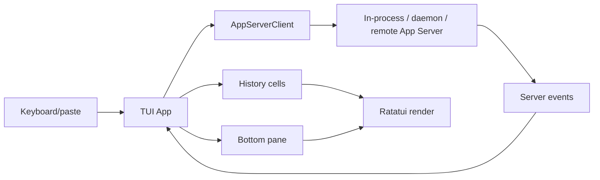
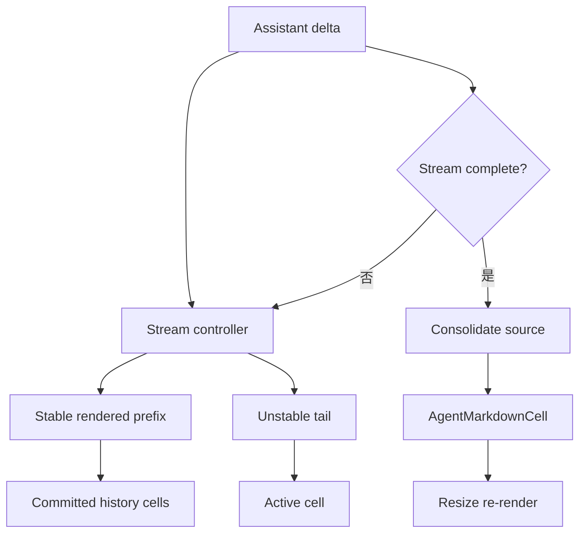
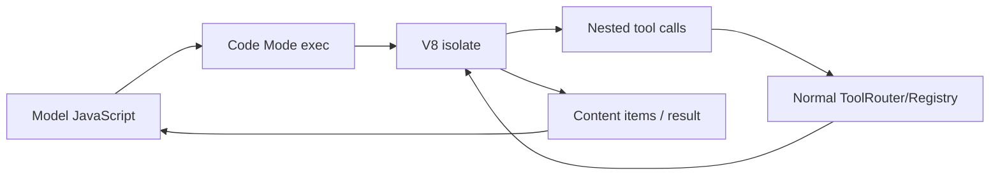

# 22｜TUI 与 Code Mode：面向人和模型的两条交互轨

> 源码基线：`upstream/main@283bc4cf011047314b4804c0f1ccd06e4f6a95c5`（2026-06-24）。

TUI 把 App Server 事件投影成终端交互；Code Mode 把多次工具调用压缩成模型可编写的 JavaScript 编排。二者看似无关，实际都在解决“如何让增量、可中断的执行流变成稳定可消费视图”。

## 1. TUI 已是 App Server 客户端

当前 TUI 不再直接绑定一套独有 Core 调用路径。它可以连接：

- in-process App Server；
-本地 daemon 的 Unix socket；
-远程 WebSocket endpoint。

`AppServerClient` 统一 InProcess 与 Remote。这样 thread、turn、item、审批和 MCP elicitation 在 TUI 与其他客户端间共享协议语义。



## 2. TUI 是事件投影

Core/App Server 决定行为，TUI 决定呈现与用户输入。TUI 主要维护：

- thread transcript；
- active streaming cell；
- composer / popup / approval UI；
- status 与 footer；
- pager overlay；
- terminal lifecycle。

它不应重写模型历史或实现一套独立审批策略。

## 3. History Cell

不同 item 使用不同 `HistoryCell`：

- user / assistant / reasoning；
- command execution；
- patch / approval；
- MCP 与图片；
- Hook；
- multi-agent activity；
- plan；
- session/status/error。

Cell 负责在给定宽度下生成 transcript lines。`CompositeHistoryCell` 用于组合多个视觉部件，而不是让所有事件挤进一个巨型 renderer。

## 4. Streaming 的稳定前缀与可变尾部

流式 Markdown 不能每个字符直接提交到终端 scrollback。当前结构区分：

- 已稳定的 `AgentMessageCell`；
- 尚可能因 table/fence 等变化的 `StreamingAgentTailCell`；
-完成后保存 raw source 的 `AgentMarkdownCell`。



最终 Cell 保存 raw Markdown 与当时 cwd，使 resize 后能重排表格、列表和链接，旧消息中的相对路径也不会因后来 `/cd` 改变含义。

## 5. Wrapping

Plain string 使用 `textwrap`；ratatui `Line` 使用 `wrapping.rs` 中的 `word_wrap_line(s)`。URL-only 行使用保留 URL 可点击性的策略。

CJK 宽度、style span、前缀缩进和窄终端都可能改变高度，所以 UI 变更必须通过固定宽度 snapshot 验证。

## 6. Composer

输入层同时处理：

-多行编辑与粘贴 burst；
- slash commands；
-文件搜索；
- Skill / Plugin / App mentions；
-图片附件；
-历史搜索；
- vim 模式；
-弹窗路由。

这些状态只决定如何形成请求。真正的 thread 操作、配置更新或工具选择仍通过 App Server typed request 完成。

## 7. Terminal scrollback

Codex 同时维护 committed transcript 与 viewport active area。完成的历史可以进入真实终端 scrollback，活动 UI 保持可重绘。

写 scrollback 与 ratatui draw 需要协调，避免在一帧中途插入 ANSI 导致错位。终端支持时使用 synchronized update 减少撕裂。

## 8. Code Mode 的协议分层

Code Mode 拆为：

- `code-mode-protocol`：tool description、cell、request/response；
- `code-mode`：service 与 V8 runtime；
- `code-mode-host`：显式 host/client 握手。

模型调用 `exec`，提交一个 async JavaScript module；脚本通过受控 `tools.*` 调用现有工具。



Code Mode 不替代 MCP 或安全系统。Nested call 仍走同一 Tool runtime、审批与沙箱。

## 9. `exec`、cell 与 `wait`

若脚本未在初始 yield 内完成，返回 `cell_id`。模型随后调用 `wait` 获取结果。

Cell 使长脚本不必阻塞整次 tool call，并支持：

-继续等待；
-终止执行；
- nested calls 暂停与恢复；
- turn 结束时清理。

V8 isolate 运行在独立 OS thread；取消时使用 thread-safe handle 终止 execution，避免堵塞 Tokio reactor。

## 10. JavaScript 能做什么

运行时只暴露受控能力：

-调用已启用工具；
-结构化 JSON 值；
-文本/图片 content item；
- session 级有限状态。

它不应直接获得任意 fs、network、process 或 Rust 内部对象。JSON ↔ V8 转换也有边界：BigInt、Symbol、循环引用等不能假设可无损序列化。

## 11. Code Mode Only

普通 Code Mode 可以与直接 tool calling 共存；Code Mode Only 会隐藏适合作为 nested calls 的直接工具，只向模型暴露编排入口。

工具描述会按 namespace 组织并规范化 JavaScript identifier。模型能在代码中使用 MCP 工具，但实际工具身份和 provenance 不会因此丢失。

## 12. 测试

任何用户可见 TUI 变化都需要 snapshot：

```bash
cd codex-rs
just test -p codex-tui
cargo insta pending-snapshots -p codex-tui
```

Code Mode 则需要覆盖：

- JS/V8 value 转换；
- nested tool routing；
- cell wait/timeout/cancel；
- host capability handshake；
- Code Mode Only exposure。

## 13. 源码阅读路线

```bash
rg -n "enum AppServerClient|RemoteAppServerClient" codex-rs/app-server-client/src
rg -n "trait HistoryCell|AgentMarkdownCell|StreamingAgentTailCell" codex-rs/tui/src
rg -n "word_wrap_line|url_preserving" codex-rs/tui/src/wrapping.rs
rg -n "CodeModeSession|CellId|WaitRequest" codex-rs/code-mode*
rg -n "V8::initialize|terminate_execution" codex-rs/code-mode/src
rg -n "code_mode_only|nested_tool" codex-rs/code-mode-protocol codex-rs/core
```

本章结论是：

> TUI 让人稳定地消费 Agent 事件；Code Mode 让模型稳定地消费并编排工具。两者都依赖明确的增量状态、提交边界和取消语义。
