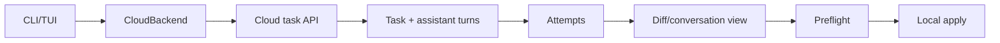

# 23｜Cloud Tasks 与外部 Agent 迁移：远端工作和本地接管

> 源码基线：`upstream/main@283bc4cf011047314b4804c0f1ccd06e4f6a95c5`（2026-06-24）。

本章包含两条独立但互补的产品线：

- Cloud Tasks：创建、查看和应用远端 Agent 产物；
- External Agent Migration：把其他 Agent 的配置资产迁入 Codex。

前者迁移“工作结果”，后者迁移“用户工作方式”。

## 1. Cloud Tasks 分层

| Crate | 职责 |
| --- | --- |
| `cloud-tasks-client` | Backend trait、HTTP API、错误与数据类型 |
| `cloud-tasks` | CLI/TUI、任务列表、diff、best-of-N、apply |
| mock client | 测试与离线行为 |



## 2. 任务生命周期

Cloud task 通常包含：

- task ID 与标题；
-环境与 prompt；
-状态；
- assistant turn；
- diff；
- conversation messages；
- attempt 总数和 placement。

本地 UI 会异步加载列表和详情，不应让单个网络错误阻塞整个 TUI。

## 3. Best-of-N

创建任务可请求 1–4 个并行 attempts。Backend 将 sibling assistant turns 作为候选返回，客户端按 placement 稳定排序。

用户可以切换查看：

-每个 attempt 的对话；
-各自 diff；
-状态；
-是否可应用。

Codex 不应假设 attempt 1 必然最好，也不能把多个 diff 合并后无审查应用。

## 4. Preflight 与 apply

应用远端 patch 前，客户端支持 dry-run preflight。API 允许使用 task 默认 diff 或选中 attempt 的 diff override。

```text
selected attempt diff
→ git apply preflight
→ report clean/conflict and paths
→ explicit confirmation
→ real git apply
```

同一时刻只允许一个 preflight/apply，避免两个写操作竞争工作树。Preflight 成功不代表已修改文件；真实 apply 才设置 applied 状态。

## 5. 本地工作树边界

Cloud 产物在服务端生成，本地 apply 发生在当前仓库。客户端必须明确：

-目标 cwd；
- diff 是否存在；
- selected attempt；
- preflight 与真实执行；
-冲突和失败输出。

远端任务不会自动绕过本地文件系统权限和用户确认。

## 6. 外部 Agent 迁移

External migration 由独立 crate、App Server config processor 和 TUI flow 协作。它先扫描外部 Agent home / project，再生成 migration items，最后逐项导入。

可迁移资产包括当前实现识别的：

-指令文件；
- Skills；
- MCP servers；
- Hooks；
- Plugins / marketplaces；
-相关配置。

每类资产有自己的 details 和目标位置，不能把所有文件直接复制到 `~/.codex`。

## 7. Preview、选择与逐项结果

迁移流程应区分：

1. 扫描来源；
2. 生成 preview items；
3. 用户选择；
4.逐项执行；
5.记录 success/failure；
6.刷新受影响 runtime source。

单项失败不会必然取消后续无关项。最终 notification 需要报告每项结果和整体历史。

## 8. 为什么要语义迁移

不同 Agent 的概念并不完全同构：

| 外部概念 | Codex 目标 |
| --- | --- |
| project instructions | AGENTS / config layer |
| command/workflow | Skill 或 Plugin |
| tool server | MCP config |
| lifecycle script | Hook event |
| permission setting | 需重新映射，不可原样信任 |

迁移器需要生成说明和 warning。尤其权限、Hook 与 Plugin 不能仅复制，因为来源信任和执行边界可能不同。

## 9. Runtime refresh

导入 Skills、MCP、Hooks、Plugins 等会改变当前能力面。App Server 会判断 migration items 是否需要刷新 runtime source，并发送完成 notification。

配置文件写成功但运行时未刷新，会造成“磁盘已有、当前会话看不见”的半完成状态，因此刷新是迁移契约的一部分。

## 10. 历史与幂等

迁移结果写入独立状态记录，便于：

-展示过去导入；
-避免重复提示；
-诊断失败类型；
-统计每类迁移数量。

再次导入时应根据目标现状合并或提示冲突，而不是盲目覆盖用户后续修改。

## 11. Cloud Config 不等于 Cloud Tasks

Cloud Config Bundle 是企业配置/requirements 的分发与缓存；Cloud Tasks 是远端 Agent 工作。两者认证和重试可能共享基础设施，但语义和本地落点不同。

## 12. 源码阅读路线

```bash
rg -n "trait CloudBackend|list_sibling_attempts|apply_task_preflight" \
  codex-rs/cloud-tasks-client/src
rg -n "best_of_n|selected_attempt|spawn_preflight|apply_inflight" \
  codex-rs/cloud-tasks/src
find codex-rs/external-agent-migration -type f | sort
rg -n "ExternalAgentConfig|migration_items_need_runtime_refresh" \
  codex-rs/app-server/src
rg -n "external_agent_config_migration" codex-rs/tui/src
rg -n "external_agent_config_imports" codex-rs/state
```

本章结论是：

> Cloud Tasks 让用户审查并接管远端结果；外部迁移让用户审查并接管既有配置资产。两者都必须经过 preview、明确选择和可恢复落地。
