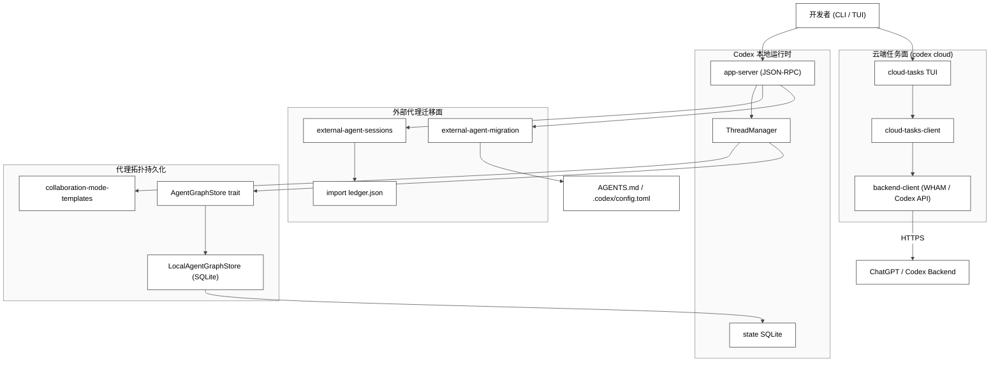
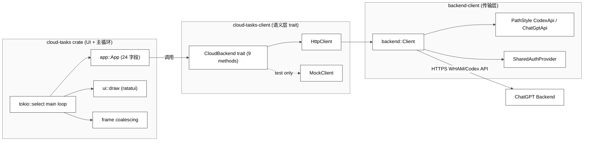
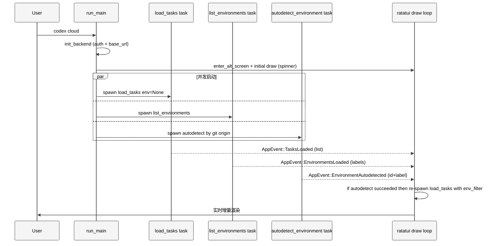
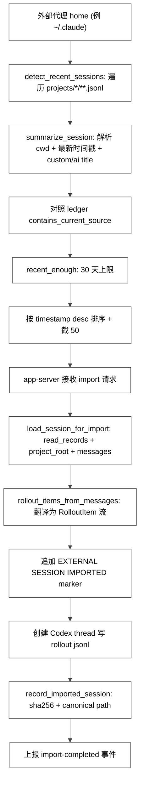
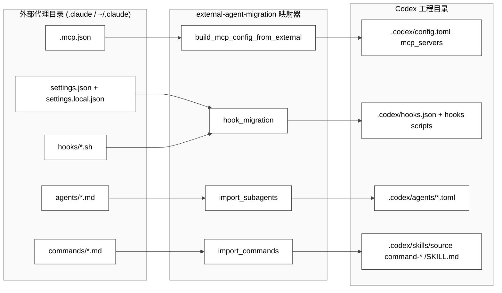
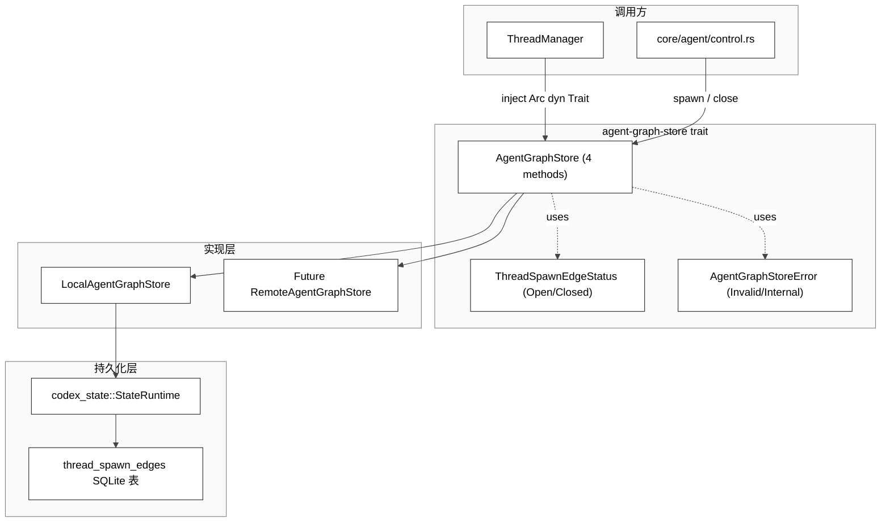
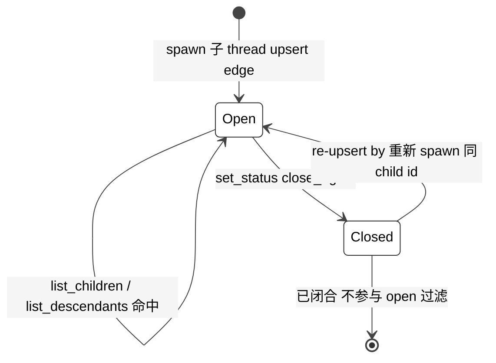

# 第 23 章 — Cloud Tasks 与外部 Agent 迁移

## 引言

如果说 Codex 的 TUI 和 CLI 把"本地配对编程"做到了极致，那么 `cloud-tasks` 与 `external-agent-migration` / `agent-graph-store` 这一组 crate 则把它扩展到了**两个完全不同的方向**——前者把单机会话外推到了云端并行任务、把开发者的 PR 节奏拉进了终端；后者解决的是"如何把别人家的代理生态搬到 Codex 上来"以及"如何为多代理拓扑提供持久化结构"。这两条线表面上互不相干，但合在一起回答的是同一个问题：**Codex 的"代理之屋"如何越过单进程边界、对外延伸到云上，对内承接其他生态？** 本章将以这七个 crate（`cloud-tasks`、`cloud-tasks-client`、`backend-client`、`external-agent-migration`、`external-agent-sessions`、`agent-graph-store`、`collaboration-mode-templates`）共约 1.1 万行 Rust 源码为基线，做一次系统性拆解。

阅读这一章的方式有一个建议：不要把它当成"分布式系统"教材去读，因为这里的"云"并不是 K8s + 微服务那种规模化的云，而是"ChatGPT 后端 API + 本地终端 TUI"组成的一种轻量分布式形态；也不要把它当成"协议兼容层"教材去读，因为这里讨论的迁移并不仅是格式转换，而是涉及大量的语义对齐和"宁可不导也不要导错"的工程判断。它更接近一种**产品工程读本**：你将看到一些极小的 crate（比如 4 行 Rust 的 `collaboration-mode-templates`、12 行 Rust 的 `agent-graph-store::lib`），它们的体量与重要性完全不成正比；也会看到一些非常长的实现（2399 行的 `cloud-tasks/src/lib.rs`、2141 行的 `external-agent-migration/src/lib.rs`），但它们的复杂性主要来自"分支组合"而非"算法本身"。理解这两类代码的共同之处，是理解 Codex 工程取向的关键。

为了让读者带着具体问题进入下文，本章会反复问三个问题：第一，**云端任务面**为什么不复用主 TUI 的 in-process app-server，而是自带一套 ratatui 主循环？第二，**外部代理迁移**为什么宁愿做严格的白名单过滤，也不做"尽力而为"的导入？第三，**代理拓扑持久化**为什么要把一个 SQLite 表抽象成 trait，又为什么至今只有两种状态？这些问题的答案散落在各小节，但都指向同一个工程审美：边界明确、契约稳定、错误显式。

---

## 一、全网调研补充：社区共识、争议、盲区

在动笔之前，我们先做一次外部认知扫描。本章三个关键词在 2026 年最近 12 个月的中英文技术圈里讨论密度并不均匀，呈现出明显的"偏科"格局。

本章涉及的几个关键词在社区里的"知名度"差异极大：`cloud-tasks` 因为是用户可见的 `codex cloud` 命令背后的实现，相对讨论较多；`external-agent-migration` 在 2026-04 Claude Code 迁移浪潮里被频繁提及；`agent-graph-store` 则是 2026-04 才合入的相对新代码，社区还在消化阶段。这种"知名度差异"也是本节先给出"调研图谱"的原因——避免本章后续在某些主题上过度依赖二手叙事。

### 1.1 社区已经形成的共识

- **`cloud-tasks` 被普遍理解为"`codex cloud` 子命令的 TUI 前端 + REST 后端调用层"**：GitHub 上的源码浏览页（`codex-rs/cloud-tasks/src/ui.rs`、`codex-rs/cloud-tasks-client/src/http.rs`）是这部分最直接的二手出处，社区文章基本沿用了官方 `cloud / list / status / diff / apply / exec` 的子命令结构。Latent Space 的 *GPT5-Codex-Max* 访谈里把 Codex 描述为 "Model + Harness + Surfaces"，cloud-tasks 就是"surfaces"中的远端面之一。
- **`external-agent-migration` 被默认指向 Claude Code 迁移**：源码里的 `SOURCE_EXTERNAL_AGENT_NAME = "claude"`（`codex-rs/external-agent-migration/src/lib.rs:L15`）几乎是社区一致认同的"外部代理 = Claude Code"。OpenAI Developer Community 上 "Sync Codex and Claude Code configs" 一帖（来自社区贡献者的 skill 化整理）直接把这一 crate 当成"`/migrate` 体验"的事实基线。
- **`agent-graph-store` 被识别为 multi-agent 拓扑的持久化边界**：2026-04-23 合入的 PR #19229（"Add agent graph store interface"）和 2026-03-18 的 commit `e24a0f8c`（"add graph representation of agent network"）共同把 `thread_spawn_edges` SQLite 表与 `AgentGraphStore` trait 抽象绑定起来。社区对这一抽象的"用途"高度一致：让子代理 / 父代理拓扑可以从 SQLite 之外的实现（如远程 gRPC）替换。

### 1.2 仍未达成一致的争议点

- **导入是否应该"重写时间戳"**：GitHub Issue #21376（"Codex Desktop external-agent import makes imported chats look new and hides existing project history"）和 #20493（"chats disappear after update/import; imported threads open blank despite JSONL turns"）集中暴露了 import 流程把"远端时间戳塞到本地 recent 列表"的副作用。社区的两派观点是：
  - 保守派希望"按原时间戳归档 + 标记 imported"，避免污染本地工作记忆。
  - 激进派认为"现在最有用的是把所有 sessions 收编到 Codex 主线"，过滤交给 UI 来做。
  目前源码选择了"标记 + 去重 + 30 天上限"的中间路线（详见 `detect.rs:L10-L11` 与 `export.rs:L24`），但 UI 端的"伪 new"问题仍然没有完全解决。
- **`agent-graph-store` 是不是一个真正的"图存储"**：从 trait 设计（`upsert_edge / set_status / list_children / list_descendants`）看，它更接近"邻接表 + BFS"的极简图 API，而非通用 graph database。社区里对比 `codegraph-rust`、`hermes-agent` 等 graphRAG 工具时常出现误解：它们解决的是"代码知识图谱"，而 Codex 的 `AgentGraphStore` 解决的是"代理生命周期拓扑"。本章会反复回到这条边界。
- **`cloud-tasks` TUI 与主 TUI 的关系**：PR #14018（"feat(tui): migrate TUI to in-process app-server"）把主 TUI 迁到 in-process app-server，但 `cloud-tasks` TUI 仍然走的是**直接 HTTP 调用 + 自己的 ratatui 事件循环**。社区里有人把这视为"重复造轮子"，也有人认为这是合理的"远端任务面不需要在本地启 app-server"。

### 1.3 系统讨论较少的盲区

- **`external-agent-sessions` 的 token usage 估算**：`token_count_item` 通过 `approx_tokens_from_byte_count_i64` 反推 token 数（`export.rs:L151-L182`），但社区文章里几乎没人讨论"这种估算与真实 tokenization 的偏差"以及"它对 compact 触发的影响"。一个 50 KB 的导入 thread 经过这种估算后，往往会被记为接近模型上下文窗口的体量，进而在第一次 user follow-up turn 之前就触发 compact——这恰好对应 PR #19895 提到的"compaction handling so large imported sessions can be resumed safely before the first follow-up turn"，但社区对此机制几乎没有专门解读。
- **`collaboration-mode-templates` 这个仅 4 行的 crate**：它把四个 markdown 模板编译进二进制（`src/lib.rs:L1-L4`），却承载了"Plan / Execute / Pair Programming / Default"四种协作模式的全部 prompt。社区几乎从未把它视为一个值得拆解的对象，但本章会把它放进"协作模式 = prompt + 状态"的语境里。事实上，它和 `agent-graph-store` 是配套出现的：派生子代理时不仅要把 edge 写进 SQLite，还要决定子代理跑的是 Plan 还是 Execute 模式；这一对耦合在源码层面不显著，但在产品语义上极其关键。
- **`cloud-tasks` 的并发预拉策略**：启动期同时发起 3 个异步任务（任务列表、环境列表、autodetect），并在 UI 事件循环里做 frame coalescing。这部分代码（`cloud-tasks/src/lib.rs:L824-L908`）几乎没有被系统讨论过，但它是 Codex TUI "响应感"的核心机制之一。从工程角度看，这种"启动期三路 spawn + AppEvent 反向投递"的写法非常像 Web 前端的"骨架屏 + 数据并行 fetch"模型，值得作为终端应用响应感设计的范例。
- **多 backend path style 的隐式部署假设**：`backend-client::PathStyle::from_base_url` 用 "URL 是否包含 `/backend-api`" 来判断 WHAM vs Codex API（`client.rs:L106-L114`）。这意味着如果未来有一个新的 backend 部署 URL 既不带 `/backend-api` 又不走 Codex API 路径，整套客户端逻辑都会静默退化。社区对这种"URL 即配置"的设计模式讨论很少，但它在多环境部署时是一颗潜在的雷。
- **`record_imported_session` 的并发安全性**：ledger 用 "读 → 改 → 写整个 JSON" 的方式更新（`ledger.rs:L34-L56`），没有文件锁。如果两次 import 几乎同时发生（这正是 PR #20284 "Import external agent sessions in background" 之后的常见场景），后写的会覆盖前写的，导致一条记录丢失。社区没人系统讨论过这个并发漏洞，但代码里其实是有的。

> 以上发现并非要做最后裁决，而是作为本章后续七维分析的"问题清单"。下文不会重复引用这些链接，但会在涉及对应判断时回头点名。

---

## 二、本质是什么——这几个 crate 的架构定位

### 2.1 一张图先把边界拉清

<div style="background: #ffffff !important; background-color: #ffffff !important; border: 1px solid #d0d7de; border-radius: 8px; padding: 16px; margin: 16px 0; overflow-x: auto;" bgcolor="#ffffff">



</div>

这张图刻意把三块面分开画：

- **云端任务面（`cloud-tasks` 链）** 是一个"独立 TUI + HTTP 客户端"，与本地 ThreadManager 几乎完全解耦，只共享 `codex-login` 的认证体系。
- **外部代理迁移面（`external-agent-migration` + `external-agent-sessions`）** 是"配置层 + 会话层"两段：前者搬 MCP / hooks / subagents / commands，后者搬历史会话。
- **代理拓扑持久化面（`agent-graph-store`）** 是 `ThreadManager` 的依赖之一，承担"已派生子线程 / 后代关系"的存储抽象。
- 中间唯一的"挂钩"是 `ThreadManager` 与 `collaboration-mode-templates`：协作模式的 prompt 是注入到主循环 prompt 上下文的（不在本章重点，但与 multi-agent 的 plan/execute 切换强相关）。

### 2.2 总体规模与文件分布

按 `wc -l` 实测：

| crate / 模块 | 关键文件行数 | 总行数（仅 src） |
|---|---|---|
| `cloud-tasks` | `lib.rs` 2399、`ui.rs` 1046、`app.rs` 512、`env_detect.rs` 362 | ≈ 4 767 |
| `cloud-tasks-client` | `http.rs` 908、`api.rs` 170、`lib.rs` 19 | 1 097 |
| `backend-client` | `client.rs` 865、`types.rs` 376 | 1 253 |
| `external-agent-migration` | `lib.rs` 2141 | 2 141 |
| `external-agent-sessions` | `lib.rs` 226、`detect.rs` 338、`export.rs` 416、`records.rs` 378、`ledger.rs` 108 | 1 466 |
| `agent-graph-store` | `lib.rs` 12、`store.rs` 55、`local.rs` 325、`types.rs` 42、`error.rs` 20 | 454 |
| `collaboration-mode-templates` | `lib.rs` 4 + 4 个 md（128 + 45 + 11 + 7） | 4（Rust）+ 191（模板） |

合计约 **11 182 行 Rust + 191 行 prompt 模板**，相对 Codex 全仓 116 万行只是个零头，但它们恰好坐落在"产品边界"上：每一个都决定了 Codex 与外部世界的一种契约。

### 2.3 定位三句话

- `cloud-tasks` 把 ChatGPT 后端的"代码任务"这一品类抽象为本地终端可巡视、可 diff、可一键 apply 的对象，是 Codex 把"云端代理"做成"PR 工作流"的关键 surface。
- `external-agent-migration` + `external-agent-sessions` 把"从竞品迁来 Codex"从工具问题变成数据迁移问题，并通过 ledger / sha256 / 30 天窗口控制副作用。
- `agent-graph-store` + `collaboration-mode-templates` 是"多代理产品化"的两块基石：前者解决"谁派生了谁"的持久化，后者解决"派生后我应该按什么模式工作"。

这三句话同时也勾勒出 Codex 在 2026 年的产品演化方向。早期 Codex (2025 上半年) 几乎只关心本地终端，TUI 跑在主进程里、所有状态都在内存中，cloud-tasks 是个独立的 PoC；现在 (2026 中期)，TUI 已经迁移到 in-process app-server（PR #14018），ThreadManager 强依赖 `StateDbHandle` 与 `AgentGraphStore`（commit #20689），cloud-tasks 也在内部独立运行但通过共享 auth manager 保持一致体验。这种"局部依赖、整体解耦"的演化模式，是 Codex 这种由产品团队主导的开源项目的典型节奏。

### 2.4 三个面之间为何刻意不耦合

值得花一段澄清：`cloud-tasks`、`external-agent-*`、`agent-graph-store` 三个面**几乎不共享业务代码**——这是一个有意的设计决策，而不是"还没来得及统一"。

- `cloud-tasks` 用的是 `codex-cloud-tasks-client::CloudBackend` trait + 自己的 ratatui 主循环；它不知道 `ThreadManager`、不知道 `AgentGraphStore`、不知道 `external-agent-sessions`。
- `external-agent-migration` 完全是 sync 函数（读 / 写本地文件），不依赖 tokio 运行时；它不知道 `cloud-tasks`、不知道 `AgentGraphStore`。
- `external-agent-sessions` 提供 `prepare_pending_session_imports` 之类的纯函数 + `record_imported_session` 等 ledger 操作；不直接调用 `ThreadManager`，把"导入后如何创建 thread"留给 app-server 端。
- `agent-graph-store` 只暴露 4 个 async trait 方法；不调用 cloud / migration / sessions 的任何东西。

这种"几乎不互相依赖"换来了**可测试性**和**演化弹性**：每一面都可以单独被替换或扩展（例如换 backend 客户端、换 graph store 实现、增加新的 source agent），而不需要触动其它三面。代价则是"产品体验上的一致性需要在更上层（app-server / TUI）粘合"——而这正是 PR #14018 这类工作存在的理由。

---

## 三、核心问题和痛点

### 3.1 cloud-tasks 要解决的真正问题

不是"把云端任务列出来"，而是：

- **认证一致性**：本地 Codex 已经登录的 ChatGPT 账号必须无感地被复用，不能再让用户做第二次登录。`init_backend` 直接通过 `codex_login::default_client::get_codex_user_agent()` 和 `util::load_auth_manager` 拿到现成的 `AuthManager`（`codex-rs/cloud-tasks/src/lib.rs:L43-L107`）。任何一个独立 CLI 都可以选择"自己实现一遍 OAuth"，但 cloud-tasks 选择"完全复用"，这避免了多入口 token 漂移这一长期维护陷阱。
- **后端路径双轨**：同一个 `Client` 既要能命中 `/api/codex/...`（Codex API 路径），也要能命中 `/wham/...`（ChatGPT 后端 WHAM 路径）。`PathStyle::from_base_url` 通过 `contains("/backend-api")` 做了一次"零配置自动判别"（`codex-rs/backend-client/src/client.rs:L106-L114`）。这种设计的好处是用户和 SDK 都不需要知道 "我应该用哪个 path style"——base_url 一旦给定，client 自动选择。坏处见 8.4 节。
- **从用户进入终端到看到第一行任务的时间**：必须够短。否则用户会怀疑命令挂了。这是后面"3 路并发预热"设计的根本动机。一个细节是：即使没有任何环境检测成功，UI 也会先用 `env=None` 拉到一份"all tasks"列表，让用户至少看到点东西，再异步替换为 env-filtered 版本。
- **diff / apply 必须可信任**：用户敢按 `a` 把云端 diff apply 到本地工作树，是因为 `apply_task_preflight` 提供了 dry-run 通道（`cloud-tasks-client/src/api.rs:L156-L161`、`http.rs:L99-L113`）。preflight 返回的 `skipped_paths` 与 `conflict_paths` 让用户在 modal 里一眼看到风险，再决定是否继续。
- **best-of-N 不能允许"误开 10 次"**：CLI 显式将 attempts 限制在 1~4（`cloud-tasks/src/cli.rs:L52-L60`），避免烧 token。这种"业务上限硬编码到 CLI 校验"的做法看似笨，但对计费类型的功能而言是必要的：把硬上限放在外层 CLI 比放在后端校验更安全，因为后端校验出错后用户已经看到 spinner，体验受损。
- **review 任务的可见性策略**：list 接口默认隐藏 `is_review` 任务（`app.rs:L131-L133`），但 details 可访问。换言之 review 任务在产品定位上属于"次级 surface"——主流程把它分离开，避免普通 task 阅读流被打断；但又不彻底隐藏，保证有需要的用户能从 URL 进入。

### 3.2 external-agent-migration 要解决的真正问题

- **配置语义不对等**：Claude Code 的 `.mcp.json`、`settings.json` 里 hooks、`agents/*.md` 子代理、`commands/*.md` 都有自己的语义；Codex 用的是 `AGENTS.md`、`.codex/hooks.json`、`.codex/agents/*.toml`、`SKILL.md`。简单"搬文件"是不行的，必须做语义映射。例如 Claude 的 `agents/*.md` 是 markdown + frontmatter，Codex 的 `.codex/agents/*.toml` 是 TOML——`render_agent_toml`（`L1073-L1106`）就是把前者 transcode 为后者，并且做术语替换 + permission 映射 + reasoning effort 映射。
- **环境变量占位符**：Claude 配置里大量使用 `${ENV_VAR}` 写法。如果原样搬过来，但 Codex 启动时这些变量不存在，结果就是"看似配置成功，实际全失败"。所以代码里有专门的 `parse_env_placeholder` / `contains_env_placeholder` 过滤（`external-agent-migration/src/lib.rs:L485-L503`）。一个细节是：`parse_env_placeholder` 还做合法 identifier 校验（首字符是 `_` 或字母，后续字符是 `_` 或字母数字），避免引入 shell 注入风险。
- **不可表达的特性必须被识别并跳过**：例如 `$ARGUMENTS`、`{{ }}` 模板变量、`!``shell-out 等在 Codex skill 体系里没有对等支持的占位符，需要被显式拒绝（`L1181-L1197`），而不是"半导入半坏掉"。这种"宁可不导也不要乱导"的策略给用户一个明确反馈：那些没被迁过来的 command 是因为它们用了 Codex 不支持的特性，需要手动重写而不是隐性 broken。
- **去重幂等**：用户可能多次运行 migrate；目标文件已存在时绝不能覆盖（`L165-L171`、`L207-L210`），但下次新增的源文件仍要被检测到。这种"目标存在跳过、源新增检测"的双向规则是 idempotent migration 的核心，比"每次都覆盖"或"只检测一次"都更友好。
- **跨 source / global / project 三层配置合并**：Claude 的 MCP servers 既可以来自 `.mcp.json`（project）、`~/.claude.json`（global）也可以来自 `projects.<path>.mcpServers`（project-specific global）。`read_external_mcp_servers`（`L226-L268`）按"project file > project-specific global > global"的优先级覆盖式合并，确保最贴近当前工程的配置生效。

在 Codex 这种"开放代码可读 + 贡献流程收敛"的治理模型下，迁移工具的设计还有一个不那么显眼但很重要的目标：**让外部贡献者也能在不破坏现有用户工程的前提下扩展支持新源代理**。当前 `external-agent-migration` 的代码组织其实并不利于这一点（`SOURCE_EXTERNAL_AGENT_NAME` 是模块常量、各种 `external_agent_*` helper 也是 module 私有），但 trait 化的方向已经初露端倪——所有"格式转换 + 路径定位 + 术语改写"如果未来抽象为一个 `SourceAgentAdapter` trait，就可以让 Cursor、Aider 等迁移以插件方式接入。这部分目前没有公开 roadmap，但代码结构里已经为这种演化留出了空间。

### 3.3 external-agent-sessions 要解决的真正问题

- **大量历史记录的可控导入**：Claude 一个用户可能有几千条 session jsonl，全导是灾难。设置 `SESSION_IMPORT_MAX_COUNT = 50`、`SESSION_IMPORT_MAX_AGE = 30 days`（`detect.rs:L10-L11`）让导入受限于"最近、有限"。
- **重复导入要去重，但源文件被修改要重新检测**：通过 `content_sha256 + canonical_source_path` 双键（`ledger.rs:L40-L65`），实现了"内容指纹去重 + 路径标识"的复合 key。
- **导入后的 thread 必须能被 Codex 的 turn 渲染器认出来**：意味着必须把 Anthropic 风格的 JSONL 序列翻译为 `RolloutItem` 序列，包括 `TurnStartedEvent / UserMessageEvent / AgentMessageEvent / TurnCompleteEvent / TokenCountEvent`，并在末尾追加一个 `EXTERNAL SESSION IMPORTED` marker（`export.rs:L49-L130`）。
- **tool_use / tool_result 必须被无损但有界地保留**：用 `[external_agent_tool_call: <name>] ... [/external_agent_tool_call]` 这种自闭合标签把工具调用嵌入文本流，并按 `NOTE_MAX_LEN = 2 000`、`TOOL_RESULT_MAX_LEN = 4 000` 截断（`records.rs:L14-L17`）。

### 3.4 agent-graph-store 要解决的真正问题

在引入这个 crate 之前，"子代理父子关系"是直接靠 `StateRuntime` 上的 SQLite 助手方法暴露的——任何用到拓扑的代码都默认依赖 SQLite。问题是：

- **远程拓扑**：当 Codex 把 agent runtime 部分迁到云上（参考主 TUI 的 in-process app-server 演化），存储后端会从 SQLite 变成 gRPC。
- **测试代价**：每个测试都要拉一个 SQLite 文件，模拟父子关系。
- **可观测性边界**：需要把"父子关系查询"从"通用的 SQLite 查询"独立出来，便于上层做"只查 open 子代理"或"广度遍历后代"这种业务语义。
- **API 演化空间**：未来如果要加 `Paused / Suspended / Failed` 状态、或者添加 `spawn_metadata` 字段，trait 边界比 SQLite 列演化更友好。

`AgentGraphStore` trait 把这几件事一次性解决：trait 只暴露 4 个方法（upsert / set_status / list_children / list_descendants），实现者既可以是 `LocalAgentGraphStore`（SQLite），也可以是未来的 `RemoteAgentGraphStore`（gRPC），call site 不需要知道差异。这是经典的"hexagonal architecture / ports & adapters"模式，但落到 4 方法 + 2 状态的极简表面，显示出 OpenAI 工程团队对"先收口、再扩展"的偏好。

---

## 四、解决思路与方案：架构、数据结构、关键算法

在展开各子系统的具体实现前，先把"七维分析"里"解决思路"这一维的总体取向澄清：本章涉及的所有 crate 都遵循"窄抽象 + 严过滤 + 静态资源"三条线，没有任何一个 crate 采用了"灵活配置 + 运行时插件"路径。这是 OpenAI 在产品工程上的清晰审美——把"软扩展性"留给上层（app-server / SDK / TUI 主线），把"硬正确性"留给底层（migration / cloud-tasks-client / graph-store）。理解这一点之后，下面的具体方案就不会显得"为什么不再灵活一点"——因为灵活性故意被放在了别处。

### 4.1 cloud-tasks 的双层架构

cloud-tasks 内部用的是一个非常清晰的"UI / 客户端 / HTTP"三明治结构。下面这张图把三层之间的契约和并发主线一起画出。

<div style="background: #ffffff !important; background-color: #ffffff !important; border: 1px solid #d0d7de; border-radius: 8px; padding: 16px; margin: 16px 0; overflow-x: auto;" bgcolor="#ffffff">



</div>

这一架构的核心设计点：

- **`CloudBackend` trait 把"业务对象"暴露给 UI**：trait 只关心 "task summary、diff、messages、apply"（共 9 个方法，见 `cloud-tasks-client/src/api.rs:L133-L170`），不关心 HTTP 细节。这让 UI 完全用业务语义说话，并且在 debug 构建里可以通过 `CODEX_CLOUD_TASKS_MODE=mock` 切换到 `MockClient`（`lib.rs:L44-L60`）做端到端测试。
- **`HttpClient` 把 trait 翻译成 REST**：它内部组合 `backend::Client` 并通过 4 个内部 namespace（`Tasks / Attempts / Apply` 等子模块，见 `cloud-tasks-client/src/http.rs:L51-L62`）组织 URL 构造逻辑。
- **`backend::Client` 是底层 HTTP**：负责 PathStyle 切换、统一 header（UA / ChatGPT-Account-Id / fedramp 路由）、错误体打包。
- **App 状态机有 24 个字段**：覆盖列表、选中下标、详情 overlay、环境过滤、apply modal、best-of modal、preflight inflight、apply inflight、list_generation 计数器等等（`app.rs:L46-L75`）。`list_generation` 是用来防止"过期请求覆盖新请求"的核心技巧——每次刷新前递增，回调里对比，不一致就丢弃。

### 4.2 cloud-tasks 启动期的三路并发预热

第一次 `codex cloud` 启动时，主线程进入 ratatui 主循环之前会**同时**起 3 个 tokio 任务，确保用户最多等"网络 1 个 RTT"：

<div style="background: #ffffff !important; background-color: #ffffff !important; border: 1px solid #d0d7de; border-radius: 8px; padding: 16px; margin: 16px 0; overflow-x: auto;" bgcolor="#ffffff">



</div>

关键源码位置：

- 同时 spawn 三个任务：`cloud-tasks/src/lib.rs:L824-L869`。
- 用 `AppEvent` 通过 unbounded mpsc 把回调结果送回主循环：`L823`。
- 用 `frame_tx` + `redraw_tx` 双 channel 做帧合并：`L876-L908`，避免多事件同帧多次绘制。
- `env_filter` 一旦被 autodetect 成功填上，就会**重新 spawn 一次 load_tasks**，并把 `list_generation` 自增以丢弃上一次的结果（`L1044-L1090`）。

这套设计在源码里只有 200 行左右，但把"启动期网络等待"这件事处理得相当贴心。

### 4.3 external-agent-sessions 的导入流水线

会话导入流程比配置迁移复杂得多，因为它必须做"扫描 → 去重 → 解析 → 翻译 → 落盘 → 登记"六步：

<div style="background: #ffffff !important; background-color: #ffffff !important; border: 1px solid #d0d7de; border-radius: 8px; padding: 16px; margin: 16px 0; overflow-x: auto;" bgcolor="#ffffff">



</div>

值得放大的几个细节：

- **去重 key 是 `(canonical(source_path), sha256(content))`**：意味着即使路径相同，只要内容变了（追加了新的 turn），就会再次被检测出来；同样的内容、不同的路径（例如用户复制了一份 jsonl），也会被视为新会话（`ledger.rs:L40-L65`）。
- **`rollout_items_from_messages` 是一台"turn 状态机"**：每遇到 `User` 消息就 close 上一轮 turn 并 emit `TurnComplete`，开一个新的 `external-import-turn-<n>` ID；每遇到 `Assistant` 消息就追加 `AgentMessage` 并更新 last agent message（`export.rs:L49-L121`）。这保证 import 后 Codex 的 turn 浏览器能识别每一轮的开始 / 结束。
- **末尾 marker 不替换最后一句 assistant 文本**：marker 作为额外的 `AgentMessage` 追加，`last_agent_message` 仍然保留真实回答（`export.rs:L109-L118`）。测试 `adds_import_marker_without_replacing_last_agent_message` 显式验证了这一点。

### 4.4 external-agent-migration 的多源映射

配置迁移最大的复杂性在于"源格式与目标格式不是一一对应的"。下面这张流程图把"hooks / subagents / commands"三条主线一起列出：

<div style="background: #ffffff !important; background-color: #ffffff !important; border: 1px solid #d0d7de; border-radius: 8px; padding: 16px; margin: 16px 0; overflow-x: auto;" bgcolor="#ffffff">



</div>

要点：

- **MCP 配置过滤**：transport 必须是 `stdio | http | streamable_http` 之一（`L356-L391`），url/command/env/header 全部跑一遍 `contains_env_placeholder` 检查，遇到未声明变量就放弃整段（`L356-L394`）。
- **Hook 过滤**：源 hook 必须只包含 `matcher | hooks` 字段，hook 必须是 `type=command`，并且不带 `async / asyncRewake / shell / once` 等 Codex 不支持的扩展（`L546-L599`）。
- **Subagent 翻译**：从 frontmatter 提取 `name`/`description`/`permissionMode`/`effort`，permission 通过 `acceptEdits → workspace-write`、`readOnly → read-only` 映射（`L1221-L1227`），effort 通过 `max → xhigh` 映射并白名单校验（`L1209-L1219`）。
- **Command 翻译**：source command 被加 `source-command-` 前缀转为 skill 目录，名字 ≤ 64 字符、描述 ≤ 1024 字符；body 中含 `$ARGUMENTS / $1 / {{ }} / !`` / @file` 任意一个就跳过（`L1181-L1190`）。
- **术语改写**：所有迁移文本经过 `rewrite_external_agent_terms`，把"Claude"等术语全大小写不敏感地替换为 `Codex`，并把 `CLAUDE.md` 之类的文件名替换为 `AGENTS.md`（`L1298-L1308`）。

值得稍微展开一下 `external-agent-migration` 与 `external-agent-sessions` 的协作关系：前者负责把"配置层"（hooks、agents、commands、MCP servers）搬过来，后者负责把"对话历史"搬过来。两者在 PR 历史上是分开演进的——`external-agent-migration` 早在 2025 末就有雏形，`external-agent-sessions` 直到 2026-04 才合入（PR #19895）；2026-04-29 又有 PR #20284 把 session 导入改为后台异步执行。这种"先配置、再会话、再异步"的演化节奏说明 OpenAI 团队对"迁移"这件事的优先级排序：先确保用户能继续工作（配置 + 工具），再补齐"历史记忆"（会话），最后才优化体验（异步、不阻塞 UI）。

读者如果对比 GitHub PR 历史，会发现 `external-agent-sessions` 在 4-5 月之间发生了多轮重构（commit `e48dcfd` 把 session 导出移出 app-server、`3bfdc15` 把 migration helpers 移到 config 之下、`a46f7e4` 把 session migration 移入独立 crate）。这种"频繁挪 module"通常意味着团队在寻找"配置 / 会话 / 协议" 三者之间的正确边界，最终落定在当前结构：`external-agent-migration` 处理配置层，`external-agent-sessions` 处理会话层，由 `app-server` 端拼装到一起。

### 4.5 agent-graph-store 的极简图 API

`AgentGraphStore` 只有 4 个方法，但每个方法都有"必须保证稳定排序"的契约。下面用 ER 风格图说明 trait / 实现 / 持久层之间的关系，并把 ThreadSpawnEdgeStatus 的状态机也带出来。

<div style="background: #ffffff !important; background-color: #ffffff !important; border: 1px solid #d0d7de; border-radius: 8px; padding: 16px; margin: 16px 0; overflow-x: auto;" bgcolor="#ffffff">



</div>

注意几个隐藏的设计取向：

- trait 设计强制要求 "list 方法返回稳定顺序"，否则上层无法做"持久化状态 + 内存态合并而不抖动"（`store.rs:L8-L10`）。
- `set_thread_spawn_edge_status` 对"找不到"必须当成 no-op（`store.rs:L26-L29`），避免把"已经关闭的代理再次 close"变成错误。
- 状态机本身极简：只有 `Open` 和 `Closed` 两个值，并显式做 snake_case 序列化（`types.rs:L5-L12`），方便跨进程 JSON 传输。

ThreadSpawnEdgeStatus 的生命周期：

<div style="background: #ffffff !important; background-color: #ffffff !important; border: 1px solid #d0d7de; border-radius: 8px; padding: 16px; margin: 16px 0; overflow-x: auto;" bgcolor="#ffffff">



</div>

注意 `Closed → Open` 这条边来自 `upsert_thread_spawn_edge` 的"重插入应同时更新 status"契约（`store.rs:L18-L22`），换言之"关掉一个子代理但又起回来"这种场景是被接受的。

### 4.6 collaboration-mode-templates：被低估的 4 行代码

整个 crate 的 `src/lib.rs` 只有这 4 行：

```4:4:codex-rs/collaboration-mode-templates/src/lib.rs
pub const PAIR_PROGRAMMING: &str = include_str!("../templates/pair_programming.md");
```

但它把 4 个 markdown 模板编译为静态字符串常量并向工作区暴露，意味着 ThreadManager / 协议层 / TUI 引导 prompt 时不需要在运行期读文件。`Plan` 模板有 128 行，`Execute` 45 行，`PairProgramming` 7 行，`Default` 11 行——`Plan` 模板里甚至包含完整的三阶段流程描述、明确的"plan mode 与 update_plan 工具的区别"等运行期需要严格区分的概念。这种"prompt as Rust resource"的做法把"AGENTS.md + 协作模板"统一进了构建产物，避免 runtime mismatch。

从产品角度看，4 个模板的篇幅差异其实反映了"模式的复杂度差异"：

- **Default 模板（11 行）**只告诉模型"你处于默认模式，不要乱切换"，并强调"只在 `request_user_input` 在可用工具列表里时才使用它"——这是给"被嵌套到子代理"场景的兜底。
- **Pair Programming 模板（7 行）**最短，因为它假定 prompt 上下文里已经有 `AGENTS.md` 与 hooks 等多重指引，只需要补一段"以同伴姿态、小步前进、按需提问"的语气定义。
- **Execute 模板（45 行）**显著扩展，因为它要明确"假设优先 / 不要反复提问 / 长时段任务用 plan tool 报告进度"——这是 cloud-tasks 这种"开发者不在线"场景下最重要的模式。
- **Plan 模板（128 行）**最长，因为 Plan 模式涉及三个明确阶段（grounding / intent chat / implementation chat），并需要严格区分"plan mode" 与 "update_plan tool" 这两个易混概念。它的长度并非冗余，而是产品语义的必然结果。

这种"模板长度反映模式复杂度"的取舍，本质上是把"产品决策固化为 Rust 资源"——任何想 fork Codex 加自己 Plan 模板的人，都必须改源码 + 重新编译，这正是 Codex 选择"开放代码可读 + 贡献流程收敛"治理模型的体现。

---

## 五、实现细节关键点：代码路径走读

在进入具体代码路径之前，先给一张"本章涉及代码相关性"的速查图，方便后续走读时定位：

| 子主题 | 主要文件 | 关键行 | 一句话定位 |
|---|---|---|---|
| 后端初始化与认证 | `cloud-tasks/src/lib.rs` | L43-L107 | 复用 codex-login，零二次登录 |
| 启动期并发预热 | `cloud-tasks/src/lib.rs` | L824-L908 | 三路 spawn + frame coalescing |
| Apply preflight 模态 | `cloud-tasks/src/lib.rs` | L614-L724 | 双 inflight 互斥 |
| Trait → HTTP 委托 | `cloud-tasks-client/src/http.rs` | L23-L127 | 9 方法 + 4 namespace |
| Path style 双轨 | `backend-client/src/client.rs` | L106-L114, L319-L416 | URL substring 判别 |
| 会话扫描 | `external-agent-sessions/src/detect.rs` | L19-L88 | 30 天 + 50 上限 |
| 会话翻译为 RolloutItem | `external-agent-sessions/src/export.rs` | L49-L130 | turn 状态机 + EXT marker |
| Ledger 去重 | `external-agent-sessions/src/ledger.rs` | L33-L65 | path + sha256 双键 |
| MCP / hooks / agents / commands 迁移 | `external-agent-migration/src/lib.rs` | L44-L224 | 公开 API |
| TOML 渲染与 reasoning 映射 | `external-agent-migration/src/lib.rs` | L1073-L1227 | enum 映射 + 字符串改写 |
| 图存储 trait | `agent-graph-store/src/store.rs` | L11-L55 | 4 方法 |
| 本地 SQLite 实现 | `agent-graph-store/src/local.rs` | L25-L93 | StateRuntime 委托 |
| 协作模式模板 | `collaboration-mode-templates/src/lib.rs` | L1-L4 | include_str! × 4 |

### 5.1 cloud-tasks 的 `init_backend`：认证与 mock 切换

```43:107:codex-rs/cloud-tasks/src/lib.rs
async fn init_backend(user_agent_suffix: &str) -> anyhow::Result<BackendContext> {
    #[cfg(debug_assertions)]
    let use_mock = matches!(
        std::env::var("CODEX_CLOUD_TASKS_MODE").ok().as_deref(),
        Some("mock") | Some("MOCK")
    );
    let base_url = std::env::var("CODEX_CLOUD_TASKS_BASE_URL")
        .unwrap_or_else(|_| "https://chatgpt.com/backend-api".to_string());
    // ...
}
```

四个关键点：

1. `CODEX_CLOUD_TASKS_BASE_URL` 默认指向 `chatgpt.com/backend-api`，但允许通过环境变量重定向到 staging。
2. `CODEX_CLOUD_TASKS_MODE=mock` 只在 debug 构建生效，避免 release 出包时被误用。
3. 通过 `util::load_auth_manager` 复用 `~/.codex` 下的 ChatGPT 登录 token；未登录直接 `eprintln + exit(1)`，强制走 `codex login`。
4. 通过 `auth.uses_codex_backend()` 显式拒绝"虽然 logged in 但用的是别家 backend"的账号——这是云端任务必须的前置条件。

### 5.2 路径双轨：WHAM vs Codex API

```326:329:codex-rs/backend-client/src/client.rs
        let url = match self.path_style {
            PathStyle::CodexApi => format!("{}/api/codex/tasks/list", self.base_url),
            PathStyle::ChatGptApi => format!("{}/wham/tasks/list", self.base_url),
        };
```

`PathStyle::from_base_url` 只有 8 行（`L106-L114`），用"包含 `/backend-api`"作为单一信号判别。这种"以 base_url 命名空间承载部署信号"的设计让客户端代码完全不需要"if dev/if prod"判断，所有 PathStyle 切换收敛在 URL 构造点。

### 5.3 业务对象映射：`map_task_list_item_to_summary`

`http.rs` 内部的 `Tasks::list` 把 `backend::PaginatedListTaskListItem` 翻译为 `Vec<TaskSummary>`，过程中做了：

- `status` 映射成 4 元枚举（`TaskStatus::Pending / Ready / Applied / Error`，`api.rs:L26-L31`）。
- `summary.files_changed / lines_added / lines_removed` 三个数值字段；为空时 UI 显示 "no diff"。
- 标记 `is_review` 的 task 在 UI list 里被过滤掉（`app.rs:L131-L133`），避免 review-only task 污染主任务流。

这里的细节也值得展开：对外暴露的 `TaskSummary` 在 client 层是一个独立 struct（`api.rs:L33-L50`），而不是直接把后端的 `TaskListItem` 透传。原因有两点：

- 客户端要能在 mock 与真实后端之间共享 UI 代码，必须有一个稳定的语义结构；
- 后端 schema 可能演化（增字段、改字段名），翻译层把变化局限在 `map_task_list_item_to_summary` 一个函数里。

这种 "DTO + 转换函数" 模式在 Java 生态里被叫做 "Anti-Corruption Layer"（DDD 术语），在 Rust 里没有正式命名，但 Codex 这里的实践非常典型。

### 5.4 best-of-N 与 attempt 排序

`AttemptDiffData` 排序逻辑值得单独提：

```282:294:codex-rs/cloud-tasks/src/lib.rs
fn cmp_attempt(lhs: &AttemptDiffData, rhs: &AttemptDiffData) -> Ordering {
    match (lhs.placement, rhs.placement) {
        (Some(a), Some(b)) => a.cmp(&b),
        (Some(_), None) => Ordering::Less,
        (None, Some(_)) => Ordering::Greater,
        (None, None) => match (lhs.created_at, rhs.created_at) {
            // ...
        },
    }
}
```

`placement` 是 best-of-N 的官方编号；只有当多个 attempt 都没有 placement 时才退化为按 `created_at` 排序。这种"有权威信号优先，否则用时间兜底"的双键排序保证 UI 上 attempt 顺序与服务端一致。

### 5.5 apply 的 preflight / actual 双通道

```99:127:codex-rs/cloud-tasks-client/src/http.rs
    async fn apply_task(&self, id: TaskId, diff_override: Option<String>) -> Result<ApplyOutcome> {
        self.apply_api()
            .run(id, diff_override, /*preflight*/ false)
            .await
    }

    async fn apply_task_preflight(
        &self,
        id: TaskId,
        diff_override: Option<String>,
    ) -> Result<ApplyOutcome> {
        self.apply_api()
            .run(id, diff_override, /*preflight*/ true)
            .await
    }
```

TUI 在用户按下 `a` 时**先做 preflight**，把 `skipped_paths` / `conflict_paths` 收回来填入 `apply_modal`（`cloud-tasks/src/lib.rs:L614-L674`），用户确认后才走 `apply_task`。这是个非常典型的"危险操作必须 dry-run 一次"模式，能避免 "apply 一半冲突了，工作区半改半不改" 的灾难。

### 5.6 external-agent-sessions 的 token 估算

```151:182:codex-rs/external-agent-sessions/src/export.rs
fn token_count_item(response_items: &[ResponseItem]) -> RolloutItem {
    let last_model_generated = response_items.iter().rposition(
        |item| matches!(item, ResponseItem::Message { role, .. } if role == "assistant"),
    );
    let last_model_visible_tokens = last_model_generated
        .map(|index| estimate_response_items_token_count(&response_items[..=index]))
        .unwrap_or_default();
    // ...
}
```

`estimate_response_items_token_count` 把每个 `ResponseItem` 序列化为 JSON 串，按字节数估 token。这是为了让导入的 thread 在 Codex compact 触发判断时也能给出"够用的"token usage 数；社区里讨论较少的盲区之一就是这种近似与 model tokenizer 的偏差，对超长 thread 来说有可能让 compact 提早或滞后触发。

### 5.7 external-agent-migration 的 hooks 翻译过滤

`hook_migration` 是 `external-agent-migration` 中最长的一段函数（约 100 行），它的核心逻辑是"白名单 + 拒绝列表"组合：

- 遍历 `settings.json` 与 `settings.local.json` 两个文件；只要任意一个写了 `disableAllHooks: true` 就立即返回空 map（`L519-L527`）。
- 仅接受 `matcher / hooks` 两个字段；其它键存在就跳过整组（`L554-L560`）。
- 仅接受 `type=command` 的 hook，禁止 async/asyncRewake/shell/once（`L572-L599`）。
- 字段白名单：`type / command / timeout / timeoutSec / statusMessage / async`——多一个未知键就跳过（`L574-L585`）。

这种"宁可少导也不要乱导"的策略和 `external-agent-sessions` 的 ledger sha256 一脉相承：迁移宁愿是"increment 安全"的，也不要 "best effort 但污染"。

### 5.8 cloud-tasks 的事件循环骨架

`run_main` 的事件循环（`cloud-tasks/src/lib.rs:L922-L1300`）由 5 路 channel 组成：

1. **`events`（`EventStream`）**：crossterm 的终端按键 / paste / focus 事件。
2. **`rx`（`AppEvent`）**：后台 tokio 任务回填的业务结果（TasksLoaded / EnvironmentsLoaded / ApplyFinished 等）。
3. **`frame_rx` / `redraw_rx` 对**：帧合并 channel。所有"建议在某时刻重绘"的请求通过 `frame_tx.send(Instant)` 发出，由一个独立的 spawn task 把多个请求合并为单一 `redraw_tx` 信号。
4. **隐式的 `tokio::spawn` 池**：每个网络请求都通过一次 `tokio::spawn` 投出去，回调通过 `AppEvent` 传回。

这套设计避免了 "tick-based 250ms redraw"（旧 ratatui 应用的常见做法），转而做"事件驱动 + 微合并"：在快速连击的场景下（比如用户连按 r 4 次），最终只会触发 1 次 redraw，不会出现 spinner 抖动或重复网络请求。这种代码结构在 `codex-tui` 主 TUI 里也有类似实现（`tui.rs` 的 `FrameRequester` + `EventBroker`），但 cloud-tasks 是用裸 channel 重写了一遍，因为它不依赖主 TUI 的基础设施。

### 5.9 ledger 文件的演化兼容性

`ImportedExternalAgentSessionRecord` 包含 4 个字段（`source_path / content_sha256 / imported_thread_id / imported_at`，`ledger.rs:L19-L25`）。这个结构用 `#[derive(Serialize, Deserialize)]`，没有显式版本号字段。这意味着如果未来加字段，必须保证序列化兼容：要么用 `#[serde(default)]` 给新字段，要么把整个 ledger 设计成 versioned (`{ "version": 1, "records": [...] }`)。

当前实现的 `ImportedExternalAgentSessionLedger`（`ledger.rs:L14-L17`）正好选了第二种思路的预留——外层结构是个独立的 struct，未来加 `version` 字段时只需要给老用户的 ledger 加个默认值。这是一种"先收口、再扩展"的 forward compatibility 做法。

### 5.10 records.rs 的内容块解析

`records.rs:L186-L231` 的 `extract_message_text` 函数处理的是 Anthropic JSONL 里 `message.content` 字段的多态：它可能是字符串，也可能是包含 `text / tool_use / tool_result / thinking` 等 block 的数组。函数的策略是：

- `text` block：直接拼到 parts，正常文本。
- `tool_use` block：转成 `[external_agent_tool_call: <name>] ... [/external_agent_tool_call]` 包裹的笔记，并标记 `only_tool_result = false`。
- `tool_result` block：转成对应的 `_result` 标签，但**不会**把 `only_tool_result` 设回 false——这是为了识别"整个 message 只包含 tool_result"的情况，并把它归类为 `Assistant` 角色（`records.rs:L165-L169`）。
- `thinking` block：完全丢弃。
- 其它未知 block：插入 `[external unsupported block: <type>]` 标记。

这种"忠实保留但加界限"的处理方式，比"全文本拼接"或"全丢弃"都更适合做"可读 + 可追溯"的导入历史。同时它也很好地处理了 Claude Code 在 2025 年下半年引入的 `thinking` 块——丢掉这部分内容是因为 thinking 是 Claude 内部状态，Codex 这边没有对等概念可以承接。

### 5.8 agent-graph-store 的 BFS 后代遍历

`LocalAgentGraphStore` 把后代遍历委托给 `StateRuntime`：

```76:93:codex-rs/agent-graph-store/src/local.rs
    async fn list_thread_spawn_descendants(
        &self,
        root_thread_id: ThreadId,
        status_filter: Option<ThreadSpawnEdgeStatus>,
    ) -> AgentGraphStoreResult<Vec<ThreadId>> {
        match status_filter {
            Some(status) => self
                .state_db
                .list_thread_spawn_descendants_with_status(root_thread_id, to_state_status(status))
                .await
                .map_err(internal_error),
            None => self
                .state_db
                .list_thread_spawn_descendants(root_thread_id)
                .await
                .map_err(internal_error),
        }
    }
```

测试 `local_store_lists_descendants_breadth_first_with_status_filters`（`L228-L324`）断言了一个非常有意思的语义：

- `None` filter 返回所有后代，**包括** closed edge 下面的后代。
- `Some(Open)` filter 只 walk **open 边**，因此 "open 父 -> closed 子 -> open 孙" 的 open 孙 不会出现在结果里。这与 `store.rs:L46-L49` 注释里"`status_filter` 作用于每一条遍历的边，而不仅是返回边"完全一致。
- 排序按 BFS depth 然后按 thread id；这给上层 UI 一个稳定的"先广度后字典序"展示顺序。

---

## 六、易错点和注意事项

### 6.1 cloud-tasks 这层最容易踩的坑

1. **过期请求覆盖问题**：用户连按 `r` 刷新两次时，第一个回调可能在第二个请求发出后才到。`AppEvent::TasksLoaded` 的处理里通过 `env.as_deref() != app.env_filter.as_deref()` 与 `list_generation` 双重门控（`cloud-tasks/src/lib.rs:L954-L982`）丢弃过期结果。改这里时一定要保留两层判断，否则会引发 "filter 切换后短暂闪回旧内容"。这种"双层门控"在前端框架里通常被叫做"race-condition guard"，但在 Rust TUI 里很少见，因为大家更习惯于 `Arc<Mutex<u64>>` 模式。
2. **`is_review` 任务的双面性**：list 里被过滤，但 details 里仍可访问。如果未来要做"review-only 浏览"，必须在 list 端引入开关，而不是直接放开 `filter`。
3. **best-of-N 一定要走 `parse_attempts`**：CLI 参数与 best-of modal 里 attempts 必须共用同一个 `parse_attempts` 校验函数（`cli.rs:L52-L60`）。任何绕过它的入口都会让 backend 拒绝（`Err`）但 TUI 已经触发了 spinner。
4. **`apply_inflight` / `apply_preflight_inflight` 互斥**：`spawn_preflight` 和 `spawn_apply` 都显式检查另一种 inflight 状态（`lib.rs:L622-L633` / `L683-L690`）。这是为了避免"preflight 还没回来，用户已经按了真 apply"。修改这部分时千万不要简化成单一 boolean。
5. **`CODEX_CLOUD_TASKS_BASE_URL` 改后必须同步更新 PathStyle**：因为 PathStyle 在 client 构造时一次决定，运行期改环境变量没用。如果做 staging 切换需要"重新生成 Client"。
6. **`env_autodetect` 与 `env_filter` 的协调**：autodetect 成功后会主动把 `env_filter` 设到检测出的 id，并 spawn 第二次 load_tasks。如果用户已经手动选择 env_filter，autodetect 的结果会被忽略（`lib.rs:L1044-L1063` 的 `!= Some(sel.id.as_str())` 判断）。修改这里要小心：autodetect 不应抢用户手动选择。
7. **`env_modal` / `apply_modal` / `best_of_modal` 不互斥**：三个 modal 都是独立 `Option`，源码并未在 `app::App` 层面做"同时只能有一个 modal"的约束。理论上可以同时弹出多个 modal——但实际 UI 渲染只画第一个。这是个设计上"隐式约束未显式表达"的例子，重构时容易踩坑。

补充一条产品视角的提醒：Codex 主 TUI 也有自己的事件循环（`tui/src/app.rs` + `tui/src/tui.rs`），它的复杂度远高于 cloud-tasks 这套（PR #14018 提到主 TUI 的 chatwidget agent.rs 是 +3700 行的迁移）。为什么 cloud-tasks 不复用？最务实的解释是：cloud-tasks 不需要承载 multi-thread / multi-agent 状态，只需要"列表 + diff overlay + 模态弹窗"，重写一遍 ratatui 主循环比"在主 TUI 上加 cloud surface 分支"成本低。这是 OpenAI 工程团队在"工程债 vs 复用"之间倾向"代码独立"的一个典型选择。

### 6.2 external-agent-sessions 容易遗漏的边界

1. **`cwd` 字段必须是真实目录**：`load_importable_session` 在最后判断 `imported_session.cwd.is_dir()`（`lib.rs:L130-L133`）。如果迁移到一台新机器，原 cwd 不存在，session 会被静默丢弃。这与 GitHub Issue #21376 / #20493 里反馈的"imported chat 看似消失"是同一来源。
2. **重复导入不报错只是 skip**：上层 UI 看到 "import 完成但什么都没发生"时，得知道这是去重生效，而非真正的 no-op。
3. **导入产生的 thread 是"已经完整一轮 + 等待新 user turn"的状态**：因为 `rollout_items_from_messages` 在迭代结束时一定会 emit 一个 `TurnComplete`（`export.rs:L109-L118`）。如果你打算让模型"接着 import 的最后一个 user turn 继续干"，需要外部触发新的 user turn 而不是 resume 旧 turn。
4. **`detect_recent_sessions` 用的是 fs 时间戳判 recency**：实际上 `is_recent_enough` 用的是 message 自带的 `timestamp` 字段（`detect.rs:L86-L88`）；如果 JSONL 缺这个字段，会被静默忽略。

### 6.3 external-agent-migration 的隐式假设

1. **`SOURCE_EXTERNAL_AGENT_NAME = "claude"` 是硬编码的**：所有 `external_agent_doc_file_name()`、`external_agent_project_config_file()` 都派生自这个常量。换言之，目前的 migrator 只支持从 Claude Code 迁移，未来要支持 Aider / Continue 需要重构这条 chain。
2. **导入 hooks 时 target 文件已存在视为"不要动"**：`is_missing_or_empty_text_file` 检测后才覆盖（`L121-L130`），意味着如果用户事先创建了空 `hooks.json`，迁移会顺利写入；但如果只是有 `{}` 也算"非空"——这是个细微但常见的误解。
3. **skill 名字加 `source-command-` 前缀避免污染**：`command_skill_name` 强制前缀（`L1117-L1122`），但用户改名为不带前缀的同名 skill 后再次 migrate 时会被认为"已存在"。这种"前缀强制 + 已存在跳过"的语义要在文档化时点明。
4. **`rewrite_external_agent_terms` 会替换文档里所有"Claude"为"Codex"**：这是个 case-insensitive、boundary-aware 的替换，意味着 markdown 里"`ClAuDe`" 也会被改写。如果你的 subagent 描述里故意提到了"Claude Sonnet"作为讨论对象，迁移后会变成"Codex Sonnet"。

### 6.4 agent-graph-store 的契约细节

1. **list 方法必须稳定排序**：trait 注释里强调（`store.rs:L8-L10`），实现违反这条会让上层 UI 出现 "BFS 顺序抖动"。
2. **`set_status` 对未知 child 返回 Ok**：避免上层 close 一个已经被 GC 的子代理时崩溃。但这也意味着：**如果 child id 拼错了，你不会得到任何错误反馈**。
3. **`upsert` 同时更新 parent 与 status**：测试 `local_store_updates_edge_status` 隐含了这一点；如果你想"只更新 status 不更新 parent"，得显式调用 `set_status`，而不是 upsert。
4. **`status_filter=Some(Open)` 会沿 open 边一路向下遍历**：被 close 的子树不会被 walk，意味着 "open 父 -> closed 子 -> open 孙" 的 open 孙不会被返回。这是上层 UI 做"只看活着的代理"时的关键语义。
5. **`AgentGraphStoreError::Internal` 默认 catch-all**：`LocalAgentGraphStore` 把所有底层 SQLite 错误都包成 `Internal { message }`（`local.rs:L103-L107`）。如果未来需要区分"事务死锁"和"约束冲突"这类细粒度错误，必须扩 enum；这一点 trait 注释里没有强调，容易被实现者忽略。

### 6.5 collaboration-mode-templates 的隐式坑

1. **`{{KNOWN_MODE_NAMES}}` 占位符必须由调用方替换**：Default 模板里有 `{{KNOWN_MODE_NAMES}}` 占位（`templates/default.md:L5`），但 crate 本身只是 `include_str!`，不做替换。这意味着 ThreadManager 注入模板时必须做一次 placeholder 替换，否则用户会在模型 prompt 里看到原始的 `{{KNOWN_MODE_NAMES}}` 字符串。
2. **模板 trim 与拼接策略未定**：模板末尾是否带换行、是否被另一段 prompt 直接 concat，crate 本身不规定。这种"crate 只发字符串、policy 留给调用方"的设计在小规模有效，扩展为更多模式时会面临一致性问题。
3. **没有版本号 / 兼容性元数据**：模板内容变化只能依赖 crate version bump 来识别。这意味着如果有第三方根据某版本 Plan 模板做了"Plan-augmented" 二次封装，未来 Plan 模板演化后行为会偏离预期。

---

本章六个小节的"易错点"清单合起来已经有 20 条以上，这并不意味着 Codex 这部分代码质量差——相反，正是因为这些边界都被显式处理，所以读者才能从源码里找到对应分支。一个反面对照是：如果一个项目的迁移代码"看起来很简洁"，往往意味着它把这些边界都隐式扔给了用户。Codex 在这里的策略更接近"把边界写明，但用户体验上隐藏复杂度"——例如 hooks 翻译时遇到不支持字段就整组跳过，但报告里只显示"migrated N items"，让用户感觉很顺；只有在用户主动看日志或源码时才能发现这层"严过滤"。

## 七、竞品对比

下表把这一章涉及的几条能力，和 Claude Code / Opencode / Aider / Goose / Continue 做横向对照。

| 能力 | Codex | Claude Code | Opencode | Aider | Goose | Continue |
|---|---|---|---|---|---|---|
| 云端任务面 (terminal) | `codex cloud` + `cloud-tasks` TUI，列表 / diff / apply / best-of-N | Claude Web 任务，不在 CLI 内成体系 | 无云端任务面 | 无云端任务面 | Goose Toolkit 偏运行时 | Continue Hub 提供 prompt/agent 市场，但无云任务列表 |
| best-of-N | CLI / TUI 1-4 attempts，UI 切换 sibling | 不暴露给 CLI 用户 | 无 | 不内置 | 无 | 无 |
| Apply preflight | `apply_task_preflight` dry-run + modal 显示 skipped/conflict | 浏览器 PR review | 无 | `git apply --check` 本地兜底 | 无 | 无 |
| 外部代理迁移 | `external-agent-migration` 全量映射 MCP / hooks / agents / commands | 无 | 无 | 无 | 无 | 部分通过 `import` 命令支持 prompt |
| 外部会话迁移 | `external-agent-sessions` + ledger sha256 去重 + 30 天 cap | 无 | 无 | 无 | 无 | 无 |
| 协作模式模板 | 4 个静态模板（Plan / Execute / Pair / Default） | 隐式：plan mode in CLAUDE.md | 无显式分模式 prompt | 自定义 prompt | 无 | 自定义 prompt |
| 子代理拓扑持久化 | `AgentGraphStore` trait + SQLite 表 + 状态机 | 不持久化 | 不持久化 | 不内置子代理 | 不持久化 | 不持久化 |
| 多 backend path style | WHAM + Codex API 双轨 | 单一 Anthropic API | OpenAI / 多 provider | 多 provider | 多 provider | 多 provider |
| 帧合并 / 启动期并发预热 | tokio + frame_tx coalescing，启动期 3 路并发 | 单线预拉 | 未公开 | 单线 | 单线 | 单线 |

几条解释：

- **Claude Code 的迁移困境是反向的**：很多 Claude Code 用户希望迁出，目前社区 skill 化整理（参见 OpenAI Developer Community "Sync Codex and Claude Code configs"）正是依赖 Codex 提供的 `external-agent-migration` 半成品；反过来从 Codex 迁回 Claude Code 几乎没有官方支持。这种"单向迁移友好"是 Codex 在生态竞争中的隐性优势：它把"迁出成本"留给了竞品。
- **Aider 走的是"git 友好"路线**：它本身就是 `git apply --check` + `git diff` 的薄封装，所以对 cloud-tasks 这种"远端 patch 落到本地"的场景，等价物是 "在 PR 页直接 review"。Aider 用户面对的是 GitHub 网页流程，Codex 用户面对的是终端 TUI——两种范式各有支持者，但终端范式对"批量浏览多个未完成任务"明显更高效。
- **Opencode 与 Continue** 把云端协作放到 IDE 侧（VS Code 扩展 / hub），CLI 内不提供云任务列表。这种"IDE 优先"的产品策略对 IDE 用户友好，但对 SSH-only / 容器内开发的用户不友好，而 Codex 选择"终端优先 + 桌面 / Web 跟进"的策略恰好填补了这一空缺。
- **`AgentGraphStore` 是 Codex 独有的产品决策**：把多 agent 看作"边持久化的 DAG"，而不是 in-memory 引用。竞品里没有同等抽象，最接近的反而是 LangGraph 这种应用框架；但 LangGraph 解决的是"图编排"，Codex 解决的是"派生关系存储"。这两者的取舍非常清晰：LangGraph 关心"图怎么执行"，AgentGraphStore 关心"图怎么持久化与查询"。换言之 Codex 把"编排"留给了 ThreadManager + 协作模式，把"拓扑存储"独立为 trait，未来甚至可以把 LangGraph 风格的执行器接到 AgentGraphStore 上。
- **协作模式模板的统一**：Codex 把 Plan / Execute / Pair / Default 4 种模式固化为静态资源，让"模式 = prompt"这个绑定在编译期完成。Claude Code 也有隐式的 plan mode，但是通过 `CLAUDE.md` + 文档建议方式实现的，没有同等的"4 种模式 4 个模板"对照。这种结构化也意味着 Codex 在未来要支持"用户自定义协作模式"会面临一个产品取舍：放弃静态资源的一致性保证，还是只允许"在静态模式上叠加用户 prompt"。
- **多 path style + 双 backend** 的设计模式在企业用户中很重要。WHAM 路径对应面向 ChatGPT 用户的体验，Codex API 路径对应企业 SDK 用户的体验；这种"同一 client 两套路径"的解耦比"两个独立 client"更易维护。Claude Code 走的是单一 Anthropic API，所以没有类似需求；其它 OSS CLI（Aider / Goose）通过"切换 provider"实现多 backend，但这是"换一个 client"而不是"同一 client 两路径"。

竞品对比的真正价值不是判断"谁更好"，而是看出**每条路线的产品决策为什么是这样**。Codex 的取向可以总结为三点：
1. **本地终端优先**，所有云端能力必须能在终端里 review；
2. **迁入路径要做严格，迁出路径不做支持**——这是开源策略中的"软锁定"；
3. **拓扑与编排解耦**——AgentGraphStore 不限定执行框架，把图编排留给未来 multi-agent feature 与 LangGraph 等社区方案。

---

从更长远的视角看，竞品对比也提醒我们：现在的"CLI 代理工具"市场仍处于早期阶段，各家在"云端 / 本地"、"插件 / 内嵌"、"配置 / 会话迁移"、"多代理 / 单代理" 等维度做出的取舍并未收敛。Codex 在 cloud-tasks 上选择了"终端 review + 云端执行"的混合体验，在迁移上选择了"严过滤 + 单源支持"，在拓扑上选择了"trait + SQLite + 状态机"的最小契约。这些选择是否会成为行业惯例，取决于未来 12-24 个月内 multi-agent 编排标准、SDK 互通、IDE 集成三者的演化。对读者而言，本章提供的代码细节足以让你判断"如果我要做自己的 CLI 代理工具，哪些 Codex 经验值得借鉴，哪些只是 OpenAI 自家场景下的合理取舍"。

## 八、仍存在的问题和缺陷

### 8.1 cloud-tasks 仍欠的债

1. **没有断网容错**：所有 `tokio::spawn` 出去的请求都假定网络可达。一旦在飞机上启动 `codex cloud`，spinner 会无限转。需要的是在 `init_backend` 阶段做一次 connectivity 探测，或者在 spinner 上挂一个"timeout 后切换到 retry"的状态。
2. **`list_tasks` 限制为 20 条 + cursor**：UI 没有自动分页，用户必须用 `codex cloud list --cursor=...` 命令行手动翻页（`cli.rs:L86-L98`）。考虑到 best-of-N + 高频任务的用户场景，"按 PageDown 自动加载下一页"应该是基本功能。
3. **`apply` 不区分 dirty working tree**：当本地有未提交修改时直接 apply 风险很大；目前没有显式 `git status` 校验。期望是在 preflight 阶段就调用 `git status --porcelain` 并把脏文件列入 modal 警告。
4. **错误信息严重依赖 `error.log`**：UI 经常出现 "see error.log for details"，对终端用户不友好。这种"主 UI + 旁边日志"的双输出模式是 ratatui 应用的常见短板，但它的代价是用户必须开两个终端窗口。
5. **`backend-client` 的 PathStyle 是构造时确定**：如果未来希望"同一进程访问两个 backend"，需要把 PathStyle 下沉到每个请求或拆 Client。
6. **缺少 task 的实时推送**：当前所有更新都靠 polling（用户按 r 才会刷新），没有 SSE / WebSocket。对长时间运行的云任务，用户必须不停按 r 才知道结果是否到了。

### 8.2 external-agent 系列仍欠的债

1. **GitHub Issue #21376 / #20493 仍然部分有效**：导入后"伪 new"问题需要 UI 做更明显的"imported badge"。
2. **only 支持 Claude**：源码常量 `SOURCE_EXTERNAL_AGENT_NAME = "claude"` 直接锁死，未来添加 Cursor 或 Aider 的迁移需要把这个常量参数化。
3. **`token_count_item` 估算偏差**：用 byte → token 比例近似，可能高估或低估实际 token，影响导入 thread 上 compact 触发时机。
4. **Hook 翻译过滤过严**：含 `async` 或自定义键的源 hook 会被整组丢弃，但用户拿到的报告只是"migrated N items"，没有"skipped M items, reason: ..."。
5. **Command skill 描述截断**：超过 1024 字符的 frontmatter description 直接整条跳过，没有 fallback 截断策略。

### 8.3 agent-graph-store 与协作模板的局限

1. **trait 仅支持 2 状态**：Open / Closed。未来若需要 "Paused / Suspended / Failed" 等中间态，需要扩枚举并迁移 SQLite 列。
2. **不存储 edge 元数据**：当前 edge 只有 parent / child / status，连"何时 spawn / spawn 时的 collaboration mode"都没有。这是 multi-agent 可观测性的天花板。
3. **`RemoteAgentGraphStore` 尚未落地**：PR #19229 + commit #20689 只完成了 "trait 抽象 + 注入 ThreadManager"，远程实现仍是 TODO。
4. **collaboration-mode-templates 是静态资源**：4 个模式在二进制里编译期固化，无法在不重新编译的前提下让用户提供 "我的 plan 模板"。这是 Codex 产品化 vs 社区可扩展之间的边界。

### 8.4 生态依赖风险

- **WHAM API 不公开**：`cloud-tasks` 依赖的 `/wham/...` 路径仅供 OpenAI 内部使用，第三方无法直接复用。换言之 `cloud-tasks-client` 这一层在外部社区里几乎只能当作"参考实现"。这种"客户端开源 + 服务端 API 不开源"的不对称性也是当前 Codex 生态里被诟病最多的地方之一：开发者可以读到 client 的每一行 Rust，但无法构造一个能跑通完整请求的 mock 后端，除非反推 fixture。
- **Claude 配置格式变化**：`external-agent-migration` 对 `.mcp.json` / `settings.json` / `agents/*.md` 的字段做了硬编码假设，若 Anthropic 修改格式，迁移会静默退化为"什么都不迁"。这与 PR #19895 的测试用例（端到端 RPC import flow 覆盖）形成对照——单元层面有保护，但格式漂移层面没有 CI 检测能力。
- **AgentGraphStore 与 StateRuntime 强耦合**：`LocalAgentGraphStore::new` 直接接受 `Arc<StateRuntime>`（`local.rs:L25-L29`）。trait 想真正与 SQLite 解耦，还得做"不依赖 codex-state 的 trait 实现样例"。目前的 `cargo test -p codex-agent-graph-store` 会拉一个真实的 `StateRuntime`（`local.rs:L126-L136` 的 `state_runtime()` helper），换言之 trait 本身可被替换，但测试用例依然把 SQLite 默认实现作为"被验证的事实"。
- **ledger 文件并发写漏洞**：上文 1.3 节提到 `record_imported_session` 没有文件锁，PR #20284 把 import 放到后台执行后这个风险变得更明显。建议未来引入 `fcntl::flock` 或者用 `state SQLite` 表替代独立 JSON。
- **path style 判别脆弱**：`PathStyle::from_base_url` 通过 substring 匹配判断 backend 类型，意味着任何包含 `/backend-api` 的 staging URL 都会被认成 ChatGPT API。这种隐式约定一旦被新的部署 URL 打破，整个 client 行为会静默偏移。

### 8.5 一份长期 roadmap 草图

如果让本章作者来写"哪些缺陷最应该被优先修复"，会按以下优先级排序：

1. **import ledger 并发安全 + 错误反馈细化**——直接影响用户对 import 信心；
2. **`cloud-tasks` 自动分页 + apply 时 git status 警告**——影响日常使用体验；
3. **`AgentGraphStore` 远程实现样例 + 状态枚举扩展**——为多代理云化做准备；
4. **`external-agent-migration` 接入更多源代理 + skipped 项目报告**——降低迁入摩擦；
5. **collaboration-mode-templates 占位符规范化 + 版本号**——为模板演化打基础。

这五条都是"工程债"，不需要重大架构变动，但每一条都会在某一类用户场景下显著降低 Codex 的使用摩擦。考虑到 Codex 当前 issue 数量与 PR 节奏（参见社区调研一节），它们应该会在未来 12 个月内逐条出现。

---

## 九、小结

Cloud Tasks 与外部 Agent 迁移这两条线，在 Codex 这套架构里承担的是"延伸"角色：

- **Cloud Tasks** 把"开发者跑在 ChatGPT 后端的远端任务"折射到了终端，并通过 trait 抽象 + 双 path style + dry-run apply + 启动期 3 路并发，把"云端代理体验"做成了"PR 工作流"。它的存在让 `codex cloud` 不再只是一个 URL 占位符，而是一个真正可以在终端里完成 review-diff-apply 闭环的 surface。
- **External Agent Migration** + **External Agent Sessions** 把"从 Claude Code 等竞品搬家"从工具问题变成了数据迁移工程问题：MCP / hooks / agents / commands 通过白名单 + 拒绝列表过滤，会话通过 ledger sha256 + 30 天窗口去重；翻译过程中把 Anthropic 的 tool_use / tool_result 块翻译成 Codex 的 `RolloutItem` 流，并显式追加 EXTERNAL SESSION IMPORTED marker。
- **Agent Graph Store** 把 multi-agent 派生拓扑从 SQLite 助手方法抽象成 4 方法 trait，配合 `ThreadSpawnEdgeStatus` 的 Open / Closed 双态状态机和稳定排序契约，为未来的远程实现和跨进程协调留出了边界。
- **Collaboration Mode Templates** 仅用 4 行 Rust + 4 个 markdown 模板，把 Plan / Execute / Pair Programming / Default 四种协作模式固化为构建时资源，确保 prompt 与运行时绝对一致。

如果说 Codex 主线（核心循环 + sandbox + tool system + protocol）解决的是"一次 turn 怎么跑得稳"，那么本章这几个 crate 解决的是"在云上 / 在外部 / 在多代理派生里，怎么跑得连续"。它们的代码量加起来只有约 1.1 万行，但每一行都坐在 Codex 与外部世界的契约边界上，决定了"开放生态可以走多远，又必须停在哪里"。

从更高的视角看，这一章涵盖的几个 crate 折射出 Codex 团队在"产品边界"与"开放性"之间的取舍：

- **接口足够稳定，实现可以替换**——`CloudBackend` 和 `AgentGraphStore` 都是只暴露业务语义的 trait，让客户端代码完全脱离 transport / storage 细节；
- **能用规则就不引入运行时配置**——`hook_migration` / `import_commands` 大量使用硬编码白名单 / 拒绝列表，避免在 import 时让用户面对一堆 "do you want to import this risky hook? [y/N]" 问题；
- **能用静态资源就不留运行时分支**——`collaboration-mode-templates` 把 4 个模板编译进二进制，确保任何一个 Codex 进程跑的协作模式 prompt 都来自同一构建产物；
- **能用 sha256 + canonical path 去重就不引入数据库**——`external-agent-sessions` 的 ledger 用一个 JSON 文件 + 内容指纹，避免再引入一个迁移层。

这些选择叠加起来构成了一个明显的工程审美：**用"窄抽象 + 严过滤 + 静态资源"换取"低运维成本 + 可演化空间"**。对于一个以开源代码可读、贡献流程受控为治理模型的项目，这恰恰是合适的取舍。

对外部读者而言，本章涉及的代码也许不会被你直接 fork——`cloud-tasks` 依赖 WHAM 这种内部 API，`external-agent-migration` 锁定 Claude Code 源格式，`agent-graph-store` 与 `codex-state` 强耦合——但它们提供的设计模式（启动期并发预热、双 path style 客户端、ledger sha256 去重、白名单严迁、trait 化拓扑存储）都是可以拿到自己项目里复用的。一份好的"竞品对比章节"，最终留下的不是"谁更好"的结论，而是"在自己的场景里我该怎么选"的判断空间。这章的目的，正是要把这些判断空间清晰地交到读者手里。

最后，把这一章和总纲（《Codex 技术主线分析》）以及之前关于核心循环、协议层、TUI、Plugin、MCP 的章节连起来看：Codex 的每一条产品线都遵循同一种工程节奏——先把核心契约定下来，再把实现做严，最后把生态接口慢慢补齐。本章正是这种节奏在"云端面 + 迁移面 + 拓扑面"三个方向上的一次完整展演。读完这一章，再回头看后续 Multi-Agent、Subagent 编排、Session Resume 等更晚出现的能力，就会发现：那些看起来"突然冒出来"的 feature，其实在本章涉及的 `AgentGraphStore` / `collaboration-mode-templates` / `external-agent-sessions` 里已经早早埋下了伏笔。

[GEN-DONE] Part III Comparative Analysis/23-CloudTasks与外部Agent迁移.md
