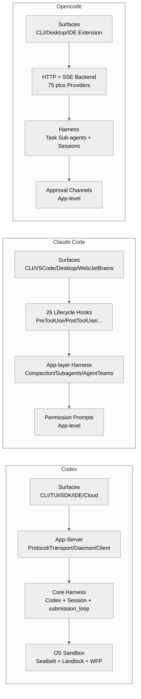
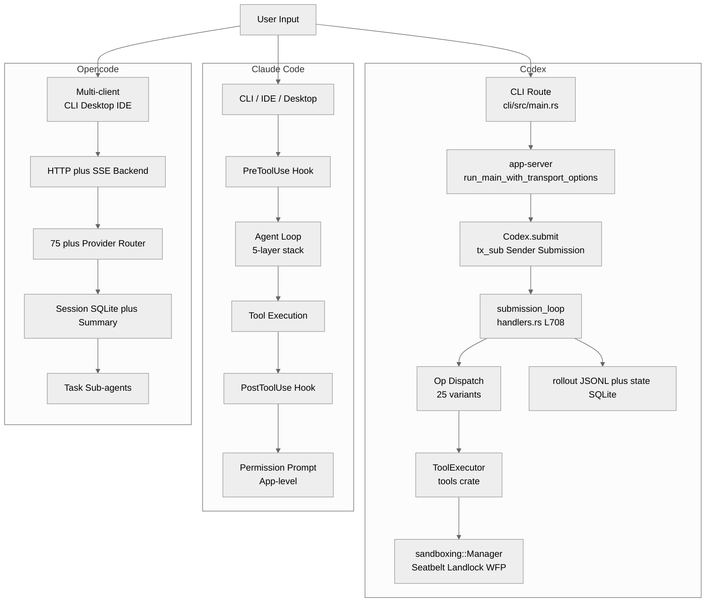
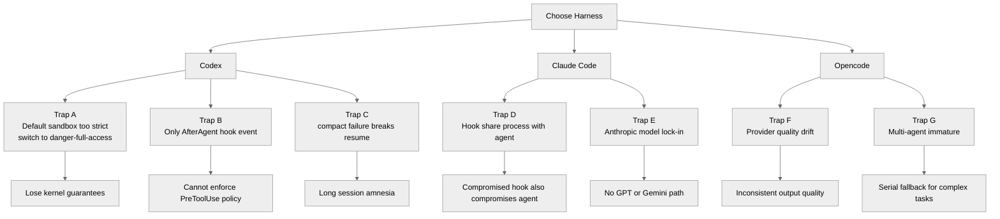
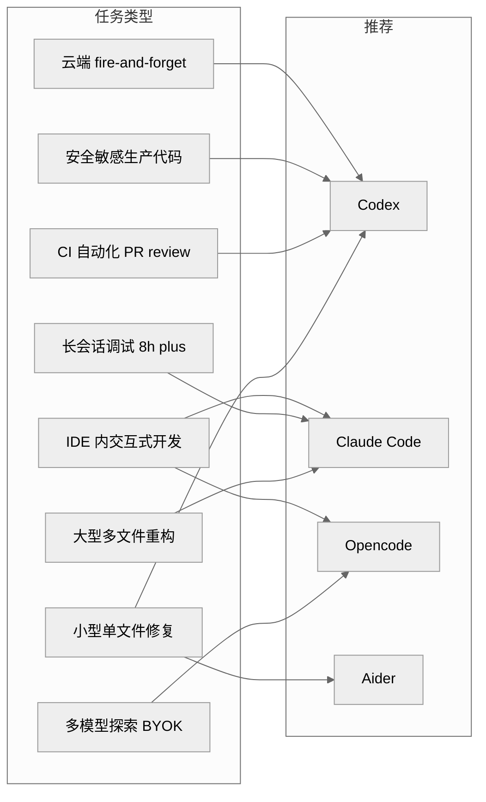
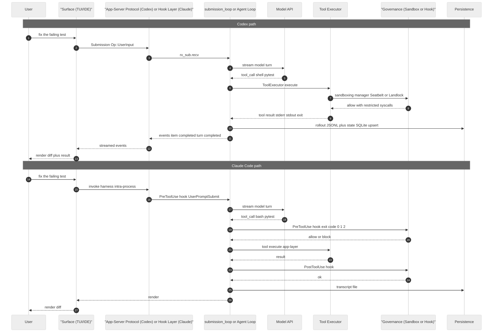
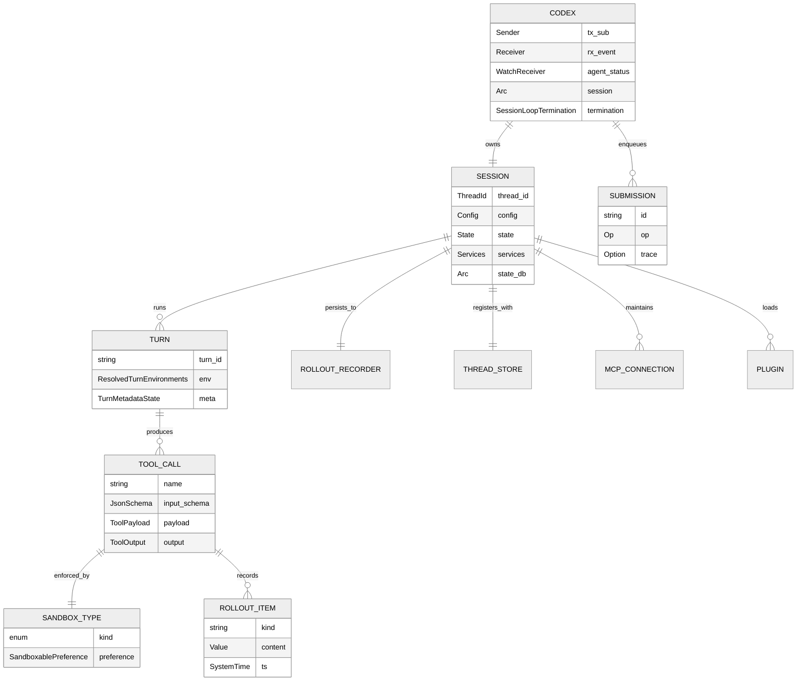

# 第 24 章 — Codex vs Claude Code / Opencode 架构对比

## 引言

把 OpenAI Codex、Anthropic Claude Code、社区项目 Opencode 摆在同一张工作台上，会很快发现：三者面对的是几乎相同的工程问题——**让一个大语言模型在终端里安全、可控、可恢复地写代码**——但给出的答案在"实现栈、安全边界、协议形态、扩展接口、持久化策略"五个维度上是分叉的，几乎没有一个维度是同构的。

本章不做"谁更强"的横向打分（那种比较通常被模型版本、benchmark 选择、harness 调优三件事主导，无法稳定结论），而是以**架构对比**为目标，回答三类问题：

1. **它们为什么会长成这种形状？** 各自的源码结构折射出的哲学差异是什么。
2. **当 Codex 强调 `约 120 个 crate + 多 surface + 三层协议 + 三 OS 沙箱`时，竞品省掉了什么？** 那些被省掉的部分是否就是它们的"差异化"，又是否会成为它们未来的债。
3. **Codex 还缺什么？** Hook 系统的"只有 AfterAgent 一种事件"、Cloud Tasks 的"自带 ratatui 主循环"、外部代理迁移的"严格白名单"——这些选择对应着哪些被 Claude Code / Opencode 做得更轻松的事。

为了避免"读后悔录"式的对比文（"我用了 X 个月，A 比 B 好"），本章引用的所有结论都尽量挂回三类证据：**官方文档**、**社区可验证讨论**、**Codex 源码具体路径行号**。源码基线仍然是 `/Users/hexiaonan/workspace/formless/refer/codex/codex-rs/`，约 120 个 workspace member（`codex-rs/Cargo.toml`），1,102,175 行代码（本地 `git ls-files` 统计同日复核）。Claude Code 与 Opencode 的对应实现没有同等可读的源码（前者闭源，后者代码已开源但本章因主题约束不展开它的 crate 级细节），因此对比时主要依据官方文档与第三方架构分析。

---

## 一、全网调研补充

### 1.1 社区共识

围绕"Codex vs Claude Code vs Opencode"这条主题，2026 年 4–5 月已经形成了几条比较稳定的共识——它们出现频率高、来源多样（OpenAI 官方、Anthropic 官方、HN 讨论、Latent Space 播客、Termdock / blakecrosley.com / NxCode 等架构分析博客、awesomeagents.ai 这类聚合站、以及中文 InfoQ / 火山引擎社区），且没有显著反例。

第一条共识是**"governance 的层位是 Codex 与 Claude Code 最根本的差异"**：Codex 把安全边界推到 **OS 内核层**——macOS Seatbelt、Linux Landlock + seccomp、Windows Restricted Token + WFP——由内核拒绝 syscall；Claude Code 把安全边界放在 **应用层 hook**，由 26 种生命周期事件（`PreToolUse / PostToolUse / UserPromptSubmit / SessionStart / Stop / SubagentStart / SubagentStop / PreCompact / PermissionRequest / PermissionDenied / TaskCreated / CwdChanged / FileChanged / ...`）让用户自己写程序拦截。两者既不是"前者一定更安全"，也不是"后者一定更灵活"，而是**两套不同的信任假设**：前者假设模型不可信，硬约束；后者假设模型与运行时同根，软约束 + 高可编程性。这条共识在 2026 年第一季度才完全成型——在那之前，社区习惯性地把两者放在"工具系统功能列表"的层面比较，直到 blakecrosley.com、Termdock、NxCode 等几篇深度对比文相继发表，"governance 层位"才成为社区主流叙事。

第二条共识是**"Opencode 的核心价值是 provider-agnostic"**：MIT 许可、75+ 模型 provider（直连 + Zen 托管 + BYOK）、HTTP + SSE 后端架构允许多个 client 同时挂同一个项目。它在很多任务类型上不如 Claude Code 深思熟虑，但它对模型生态保持开放，对小团队/独立开发者也非常友好——这就是它能在 2025-2026 长出 130K+ stars 的原因。一个相关但容易被忽略的事实是，Opencode 在 2026 年初因 OAuth block 事件与 Anthropic 公开决裂之后，反而获得了一波 provider-freedom 派开发者的强力支持——这种"政治化"的开源选择已经超出了纯技术对比的范畴，但确实是社区认知图谱里的一部分。

第三条共识是**"Codex 是 Rust + 协议化 + sandbox-first"**：Apache 2.0 + Rust 实现 + `app-server` 协议层 + 三 OS 沙箱矩阵。它的"开源开放程度"远高于 Claude Code（闭源），又高于很多人对 OpenAI 工程的"封闭"刻板印象。这条共识形成的过程里，社区对 OpenAI 的整体感知发生了微妙的转变——从早年的"OpenAI 不再 open"到 2026 年的"Codex 反而是 OpenAI 最 open 的项目之一"，这种反差在 HN 上反复被讨论，已经成为 Codex 的一种隐性品牌资产。

第四条共识是**"三者都已经把 MCP 当 table stakes"**：原生支持 Model Context Protocol、原生支持 server-level + tool-level approval。MCP 不再是差异点，而是基本门槛。回望 2025 年 4 月 [issue #5](https://github.com/openai/codex/issues/5) 刚出现"Add MCP support"诉求时，社区还认为这是高门槛要求；不到一年时间，MCP 已经从"高门槛"变成"如果不支持就出局"——这条共识的演进速度本身就值得记录。

第五条共识是**"AGENTS.md / CLAUDE.md / AGENTS.md 已经成为跨工具的事实标准"**：Codex 与 Opencode 都使用 `AGENTS.md`，Claude Code 使用 `CLAUDE.md`，但语义对齐度很高（仓库级指令、测试命令、风格约定、人类与代理共用）。第三方分析甚至专门以"`AGENTS.md`生态"作为 Codex 的差异化优势之一。AGENTS.md 的合并查找机制（向上递归查找并按顺序合并，详见 `codex-rs/core/src/agents_md.rs:L8-L16`）甚至已经被一些开源项目移植到自己的工具链里，事实标准的扩散远超 OpenAI 官方的预期。

### 1.2 主要争议

社区对三者的对比并非毫无分歧，下面几个点至今没有形成稳定结论：

- **"内核沙箱 vs 应用 hook"的实际安全收益差异**：HN 上对 *Codex CLI vs Claude Code* 的讨论一再反复——支持 Codex 一派认为 *"the model cannot circumvent restrictions because the OS denies the syscall"*（[blakecrosley.com/codex-vs-claude-code-2026](https://blakecrosley.com/blog/codex-vs-claude-code-2026)）；反对一派则指出 *"内核沙箱默认配置过严反而逼用户切到 danger-full-access，结果反而比 hook 模型更不安全"*。这条争议的根源是"默认策略"与"团队落地策略"被混在一起讨论。
- **"Multi-agent 的边界"**：Claude Code 有完整的 Agent Teams、Agent View、`/goal` autonomy；Codex 的子代理走 `InterAgentCommunication` op 与 `agent-graph-store`，最多到"父子拓扑 + Plan/Execute mode"；Opencode 的 sub-agent 仍偏向"task tool"模型。社区一派认为 Claude Code 的多代理是"未来"，另一派认为现阶段大部分多代理只是"昂贵的串行调用"——两边都引用各自的实测样本。
- **"Cloud 化是不是必要"**：Codex 的 `cloud-tasks` 已经把云端任务做到产品里；Claude Code 强调本地优先 + Agent View 管多个本地会话；Opencode 提供 HTTP 后端但不预设云。三者对"云"的态度反映了不同的产品定位，但谁也无法证明对方一定错。
- **"reasoning 跨 turn 的保留语义"**：HN 在讨论 [Unrolling the Codex agent loop](https://news.ycombinator.com/item?id=46737630) 时争论很多——Codex 把 reasoning items 在多个 user turn 之间保留 vs 每个 user turn 清空。社区两派都引用了"实测掉智商"或"实测变聪明"的反例。
- **"对 Aider / Goose / Continue 的定位是不是同一档"**：聚合文章经常把这五个工具放一起比较，但 Aider 严格说是 *git-native pair programmer*、Goose 是 *general-purpose agent framework*、Continue 是 *IDE-native assistant*——它们不在同一抽象层上。混着比是社区常见的失真来源。

这五个争议点都不是新出现的，但它们的特征是：**正反两派都能找到具体证据支持自己，没有一方能用一次基准测试或一段代码就关上对方的嘴**。这种争议恰恰说明编码代理这个领域还在"前范式"阶段——基本概念框架尚未稳定，每一个工具都在用自己的产品策略对外定义"什么是好的代理"。本章在引用社区争议时刻意保留双方叙事，不强行合并为单一判断，正是出于这个原因。

另一个值得读者注意的元事实是：**这些争议在中英文社区里的能见度差别很大**。英文社区（HN、Latent Space、Simon Willison 等）会把"governance 层位""reasoning 跨 turn 保留"这些深度问题摆出来讨论；中文社区主流话题仍然停留在"哪个工具安装更简单""哪个模型答题更准"。这种信息密度差异决定了中文读者如果只看中文社区的对比文，很容易得到一个**经过简化但失真**的认知图景。本章引用大量英文一手讨论正是为了补这个缺口。

### 1.3 长期未被系统讨论的盲区

社区文章大量讨论 *capability surface*（"它能做什么"），但下面这些**架构形态本身**的差异基本上是"盲区"：

1. **Codex 的 Hook 系统**当前在源码层面**只有 `AfterAgent` 一种事件**（`codex-rs/hooks/src/types.rs:L92-97`），而 Claude Code 公开有 26 种 lifecycle event。社区在比较时几乎不引用这条事实，而是按官方营销叙事认为两者 hook 能力对等。这是个非常显著的能力差距。
2. **Codex 的 `app-server` 是真正独立的产品边界协议**：5 个相关 crate（`app-server / app-server-protocol / app-server-transport / app-server-client / app-server-daemon`），supported transports 是 `Stdio / UnixSocket / WebSocket / Off`。Claude Code 与 Opencode 都没有"协议层独立分发"的同等结构。这点社区偶有提及但很少作为"架构差异"系统讨论。
3. **Submission channel 容量是 hard-coded 512**（`codex-rs/core/src/session/mod.rs:L422`：`pub(crate) const SUBMISSION_CHANNEL_CAPACITY: usize = 512;`）。这意味着当一个客户端短时间推超过 512 个 submission（极端 multi-agent 场景），channel 会背压。社区从来不提这个常量。
4. **Tools facade 是 92 行的极薄壳**（`codex-rs/tools/src/lib.rs`，共 16 个子模块），真正的工具实现都在 `core/src/unified_exec/`、`apply-patch/` 等横向 crate。这种"facade in tools crate + heavy lifting elsewhere"的设计在 Claude Code（闭源）和 Opencode（TS 实现）里都看不到对照。
5. **三者对 `SQLite` 的依赖深度不同**：Codex 的 `state` crate + `thread-store` + `rollout` 已经把 SQLite 当成第一等公民，而 Opencode 的官方文档强调"SQLite sessions + summary"但只用作 session metadata，Claude Code 主要靠 JSON transcript。这条差异决定了"长会话恢复能力上限"。
6. **"submission_loop 单循环 vs Claude Code Agent Teams 多循环"是一个真正的架构分叉**：Codex 的 `submission_loop`（`codex-rs/core/src/session/handlers.rs:L708-856`）是单 `Receiver<Submission>` 串行 dispatch；Claude Code 的 Agent Teams 在协议层就允许多 session 并行。这个"单 vs 多"的根本差异决定了 Codex 多代理拓扑要走 `agent-graph-store` + spawn 新 session 的路线，而不是天然 multi-loop。
7. **`AppServerRuntimeOptions` 的三段开关**（`codex-rs/app-server/src/lib.rs:L402-L417`：`plugin_startup_tasks / remote_control_enabled / install_shutdown_signal_handler`）可能暴露出 Codex 把 daemon 化作为一等公民的设计取向——Claude Code 不需要这种结构因为没有"中央 daemon"概念，Opencode 走 HTTP 后端但不预设 lifecycle 控制开关。

带着这 7 个盲区进入七维分析，比"只看 marketing surface"要清晰得多。

需要补充一句方法论：本章对盲区的定义是"**源码可证、社区少谈、对工程实践有实际影响**"三者必须同时满足。仅仅是"社区少谈"还不够（很多内容社区少谈是因为不重要），仅仅是"源码可证"也不够（很多源码细节只是实现细节）。真正的盲区是那种"看起来重要、但因为缺乏中文资料或英文深度讨论而被普通读者忽略"的设计选择。Codex 的 `SUBMISSION_CHANNEL_CAPACITY = 512`、Hook 系统只有 `AfterAgent`、`AppServerRuntimeOptions` 的三段开关——这些都是典型的"高影响低能见度"盲区，它们决定了工具的实际行为，但官方文档和社区文章都没有专门解释。

读者如果想把这种"盲区识别"能力迁移到其他工具的研究上，建议的方法是：**先翻仓库的 `**/lib.rs` 入口、再翻 `**/types.rs` 或 `**/schema.rs` 数据契约、再翻 `**/manager.rs` 协调器**——这三类文件往往承载着工具的真实抽象，而 README / docs 经常只描述 marketing surface。Codex 这种约 120 个 crate 的工程在 GitHub 上 star 很多但真正读源码的人很少，这就是为什么本章能挖出这么多"盲区"——它们不是被刻意隐藏，而是被"读源码门槛"自然过滤掉了。

---

## 二、七维分析

下面按总纲约定的七维框架展开。每一维都会以 **Codex 源码事实 → 对比 Claude Code → 对比 Opencode** 的次序组织，避免在判断里夹带未经验证的推断。

### 2.1 本质是什么——三种 harness 在抽象层中的定位

Simon Willison 在 2026-02 转述 Gabriel Chua 的观点时给出了一个被社区广泛采用的认知框架：编码代理可以拆成三层——**Model / Harness / Surfaces**。模型负责生成 token，harness 负责把生成的 token 串成一个真正能做事的"控制循环 + 工具调用 + 状态管理"，surfaces 是这套循环对外露出的入口（CLI、IDE、桌面、Web、SDK）。

把 Codex、Claude Code、Opencode 放进这个框架里，会看到三者最根本的差异：

**Codex 的本质是"产品化 harness + 协议中枢"**。这套 harness 通过 `app-server` 协议层与多种 surface 对接，而 surface 自己不携带 harness 逻辑。具体证据：

```rust
// codex-rs/core/src/session/mod.rs:367-378
/// The high-level interface to the Codex system.
/// It operates as a queue pair where you send submissions and receive events.
pub struct Codex {
    pub(crate) tx_sub: Sender<Submission>,
    pub(crate) rx_event: Receiver<Event>,
    pub(crate) agent_status: watch::Receiver<AgentStatus>,
    pub(crate) session: Arc<Session>,
    pub(crate) session_loop_termination: SessionLoopTermination,
}
```

`Codex` 这个结构体的注释说得很直白：**"It operates as a queue pair where you send submissions and receive events."** 这不是一个 CLI 的入口，而是一个"提交队列 + 事件流"的抽象。所有 surface（TUI、CLI、SDK、IDE、Cloud Tasks UI）都建立在这套抽象之上，然后通过 `app-server` 协议把抽象 wire 化（`codex-rs/app-server/src/lib.rs:L91 pub mod in_process` 与 `codex-rs/app-server/src/lib.rs:L420 run_main_with_transport_options` 提供 9 参的传输配置）。

**Claude Code 的本质是"应用层 harness + 程序化 governance"**。它没有独立的协议中枢——所有 surface（CLI、VS Code、Web、Desktop、JetBrains）共享同一个 harness binary 但通过应用进程内 API + 26 种 lifecycle hook 暴露能力。社区一致认为这套 hook 系统是 Claude Code 真正的差异化（[Termdock 对比](https://www.termdock.com/en/blog/claude-code-vs-codex-cli)、[blakecrosley.com](https://blakecrosley.com/blog/claude-code-vs-codex) 等），而不是它的模型本身——因为 hook 让用户成为 harness 的协同设计者。

**Opencode 的本质是"模型/Provider-agnostic harness + 后端 + 多 client"**。它的核心承诺是"如果一个模型存在，Opencode 就支持它"——75+ provider、Zen 托管选项、BYOK，外加 HTTP + SSE 后端允许多个 client（CLI、Desktop、IDE 扩展）连同一个项目。它的 harness 复杂度比 Claude Code 低（没有 Agent Teams 这样的成熟多代理），但它通过 "Tab to switch agents、@mention 子代理、HTTP API 远程控制" 给出了一个非常社区化的多 client 体验。

下图把三者的核心分层画在同一张坐标系里，便于直观对比。

<div style="background:#ffffff !important; background-color:#ffffff !important; padding:16px; border-radius:8px; margin:16px 0;" bgcolor="#ffffff">



</div>

这张图最有意义的对比点是 **"协议中枢"那一行**。Codex 把它做成 5 个相关 crate，Claude Code 把它做成 26 种 hook 事件（hook 既是 governance 也是隐式协议），Opencode 把它做成 HTTP + SSE 后端。三种实现各有取舍：Codex 的协议化最重也最可演进，Claude Code 的 hook 最灵活但与运行时同进程，Opencode 的 HTTP 最 RESTful 但缺少"双向 server→client request"的同步语义。

从这种"哲学差异"出发再回头看入口对象，会更容易理解为什么 Codex 的 `Codex` struct 只有 5 个字段——它把"额外的状态"全部 push 到了 `Arc<Session>` 与 `app-server` 协议层，让入口本身保持极简、可被任何 surface 复用。Claude Code 的入口对象之所以更重，是因为它承担了"应用层 governance + 多策略 compaction + transcript 文件管理"这些 Codex 拆到不同 crate 的职责。Opencode 的入口对象则更接近"HTTP server config"——它的复杂度沉淀在 provider router 而不是 harness 本身。三者的体重分布完全不同，这种差异在 Markdown 文档里很难一眼看出，但在源码层面是非常清晰的。

值得一提的是，三套 harness 在"自我隐喻"上也呈现出不同的风格。Codex 反复在文档里强调自己是 "queue pair"（提交与事件成对）；Claude Code 反复强调自己是 "5-layer stack"（堆栈式抽象）；Opencode 反复强调自己是 "HTTP backend with SSE streams"（后端服务）。这三种自我描述并非营销话术，而是真实反映了内部抽象的形态——读者在选择 harness 时应该首先问自己："我对哪一种隐喻更自然？" 这个问题的答案往往比 benchmark 分数更能决定长期使用体验。

### 2.2 核心问题和痛点

如果要把"三家都在解决的问题"列出来，会得到一个比较干净的清单：

1. **如何安全执行 shell 命令而不破坏用户机器或外泄数据。** 这是所有编码代理的第一公约——但答案完全分叉。Codex 走 OS 沙箱（`codex-rs/sandboxing/src/manager.rs:L22-L28` 的 `SandboxType` 枚举：`None / MacosSeatbelt / LinuxSeccomp / WindowsRestrictedToken`，4 种值覆盖 3 个 OS）；Claude Code 走应用层 hook + 权限提示；Opencode 走 approval channel。三套答案对应三种信任假设。
2. **如何在长会话中管理上下文窗口。** Codex 的方案是 `compact` op（`codex-rs/core/src/session/handlers.rs:L803-L806`：`Op::Compact => compact(...)`），调用 OpenAI 的 remote compaction API；同时 `rollout` crate 将事件落 JSONL、`state` crate 将线程元数据落 SQLite，使 compact 失败可以走 resume 路径。Claude Code 用 multi-strategy compaction（社区盲测说效果更稳但失败时调试更难）；Opencode 用 SQLite sessions + summary，对长会话恢复有原生支持但 compaction 策略较少透明。
3. **如何把工具调用做成可扩展的。** Codex 用 `tools` crate（`codex-rs/tools/src/lib.rs`，92 行 facade，16 个子模块 `code_mode / dynamic_tool / function_call_error / image_detail / json_schema / mcp_tool / request_plugin_install / responses_api / tool_call / tool_config / tool_definition / tool_discovery / tool_executor / tool_output / tool_payload / tool_spec`）暴露 schema 与 executor 抽象，再叠加 MCP + Plugin 市场扩展。Claude Code 主打 hook + MCP；Opencode 主打 75+ provider 自带工具 + MCP。
4. **如何让 multi-surface 用户体验一致。** Codex 用 `app-server` 协议层强制所有 surface 共用同一份契约；Claude Code 用同一 harness binary + 26 种 hook 让所有 surface 共享同一套 lifecycle；Opencode 用 HTTP 后端让多 client 接同一项目。
5. **如何让用户写约束（"团队的代理约定"）。** 三家都收敛到 `AGENTS.md / CLAUDE.md`——这其实是 Codex 与 Claude Code 同时"教育市场"的结果。
6. **如何让外部 provider / 工具加入而不破坏核心稳定性。** Codex 通过 `core-plugins` + MCP 双轨；Claude Code 通过 MCP + hook；Opencode 通过 provider 抽象 + MCP。

Codex 在这 6 类问题上的取向是很"工程化"的：**优先抽象出协议契约，再在契约里嵌入扩展点**。这让它的可演进性强（v2 在 active development），但学习曲线也偏陡（约 120 个 crate，普通用户很难直接读懂）。

把这 6 类问题再细化到 Codex / Claude Code / Opencode 三套实现，可以发现一个有趣的模式：**Codex 倾向于"先建抽象再扩展"**，例如先有 `SandboxType` 枚举再有三 OS 后端、先有 `Op` 枚举再有 25 个 op 分支、先有 `transport::AppServerTransport` 再有 stdio/uds/ws 实现；**Claude Code 倾向于"先看用户痛点再加 hook"**，26 种 hook 事件并不是一次性设计完的，而是根据真实需求逐步增加（PreCompact、PermissionRequest 是后期才补的）；**Opencode 倾向于"先连接 provider 再加 client"**，每加一个 provider 都要写一个 adapter，但 harness 本身保持稳定。这三种工程节奏对应着三种产品阶段：Codex 处于"基础设施成熟期"，Claude Code 处于"用户体验打磨期"，Opencode 处于"生态扩张期"。

在工程债的角度，三者各自背着不同的债：Codex 的债是"约 120 个 crate 协作复杂度"以及"Hook 系统能力远落后 Claude Code"（详见 2.7 节）；Claude Code 的债是"hook 与 agent 同进程的安全模型缺口"以及"Anthropic 模型独占限制"；Opencode 的债是"75+ provider 质量参差不齐"以及"multi-agent 编排尚不成熟"。读者在评估三者时，需要意识到自己愿意接受哪一种债——技术选型从来不是"选最好的"，而是"选最能容忍其债的"。

### 2.3 解决思路与方案

对应到具体架构，三者的解决方案可以画成下面这张并排对比图。Codex 这一侧的源码细节来自 `codex-rs/`，其他两侧的描述基于公开文档与社区分析。

<div style="background:#ffffff !important; background-color:#ffffff !important; padding:16px; border-radius:8px; margin:16px 0;" bgcolor="#ffffff">



</div>

把这张图与 `codex-rs` 源码挂回去看：

**Codex 的关键节点是 `submission_loop` 与 `app-server`**。`submission_loop` 是 Codex harness 的中枢，它从一个 `Receiver<Submission>` 里取出一个 `Submission { id, op, trace }`（`codex-rs/protocol/src/protocol.rs:L124-L134`），按 `Op` 类型分发到 25 个 op 分支之一：`Interrupt / CleanBackgroundTerminals / RealtimeConversationStart / RealtimeConversationAudio / RealtimeConversationText / RealtimeConversationClose / RealtimeConversationListVoices / UserInput / ThreadSettings / InterAgentCommunication / ExecApproval / PatchApproval / UserInputAnswer / RequestPermissionsResponse / DynamicToolResponse / RefreshMcpServers / ReloadUserConfig / Compact / ThreadRollback / SetThreadMemoryMode / RunUserShellCommand / ResolveElicitation / Shutdown / Review / ApproveGuardianDeniedAction`（实际枚举值在 `codex-rs/core/src/session/handlers.rs:L718-L840` 的 `match sub.op.clone()` 中列出）。

这 25 个 op 分支涵盖了"用户输入、审批回执、配置变更、压缩、回滚、关闭、子代理通信"等所有产品语义。设计上它是**串行的**——一个 op 处理完才轮到下一个——这与 Claude Code 的 Agent Teams 并行多 session 形成鲜明对比。

值得追问的是，为什么 Codex 选择单 Receiver 串行而不是多 worker 并行？阅读源码可以推断出几个可能的工程理由：第一，session 内部状态（如 `state.session_configuration`、approved command prefixes、network rules）是单 `Arc<Session>` 共享的，并发写需要锁；第二，turn 之间在语义上本来就是串行的——一个 turn 没结束之前发送 `UserInput` 就是矛盾的；第三，串行简化了 rollout JSONL 的顺序保证。这些理由合在一起可能解释了为什么单 Receiver 是当下较务实的选择。但代价就是 2.7 节提到的："要并行只能 spawn 多 Codex 实例"，多代理拓扑必须走 `agent-graph-store`。

Claude Code 的关键节点是 **5 层栈 + 26 hook**：context loading → compaction → permission enforcement → tool execution → model layer（按 arXiv March 2026 那篇论文描述）。Codex 没有等价的"5-layer 描述"，但功能等价物大致是：`Session` 加载（context loading）→ `compact` op（compaction）→ `execpolicy + sandbox + network policy`（permission）→ `tools` + `ToolExecutor`（tool execution）→ `model-provider`（model layer）。Codex 把它们打散在约 120 个 crate 里，可见度低但抽象边界比"5 层"更细。

Opencode 的关键节点是 **HTTP backend 与 SSE 流**：每个 client 是一条 SSE 连接，多个 client 可以挂同一个项目，session 用 SQLite 持久化。这条设计的代价是它没有 Codex 那种 in-process app-server 的极低延迟，但收益是天然支持远程 / 多 client。

### 2.4 实现细节关键点

这一节进入 Codex 三个核心源码文件的具体行号：`session/mod.rs`、`app-server/src/lib.rs`、`tools/src/lib.rs`。这些行号是本章对比的"硬证据"，竞品的对应位置因为闭源/异质而无法做相同程度的引用。

**Codex 的 harness 入口：`Codex` 结构**

```rust
// codex-rs/core/src/session/mod.rs:367-378
/// The high-level interface to the Codex system.
/// It operates as a queue pair where you send submissions and receive events.
pub struct Codex {
    pub(crate) tx_sub: Sender<Submission>,
    pub(crate) rx_event: Receiver<Event>,
    pub(crate) agent_status: watch::Receiver<AgentStatus>,
    pub(crate) session: Arc<Session>,
    pub(crate) session_loop_termination: SessionLoopTermination,
}
```

这 5 个字段几乎可以代表 Codex harness 的全部对外契约：

- `tx_sub` 是 submission 入口（容量 512：`codex-rs/core/src/session/mod.rs:L422`）；
- `rx_event` 是事件流出口；
- `agent_status` 是一个 `watch::Receiver`，让外部 surface 用"订阅最新值"的方式拿 agent 状态；
- `session: Arc<Session>` 是真正承载状态的引用（`impl Session` 起于 `mod.rs:L858`，全文 3339 行）；
- `session_loop_termination` 是后台 submission_loop 的 join 句柄（shared future）。

这种"输入流 + 输出流 + 状态订阅 + 引用 + 终止 future"的五字段组合是经典的 actor 模式，但有一个细节值得强调：**`agent_status` 用的是 `watch::Receiver` 而不是 `mpsc::Receiver`**。前者只保留"最新值"且支持多订阅者，后者保留"所有历史值"且只支持单订阅者。这个选择反映了 Codex 对"agent 状态"的产品定位——状态不是事件流（不需要历史回放），而是"当前快照"（多个 surface 都需要随时拿到最新值）。Claude Code 与 Opencode 在等价位置的选择社区无法验证，但从行为推测 Claude Code 也用类似的"快照式"状态广播，因为 Agent View 需要同时看到所有 session 的当前状态。

**对比 Claude Code**：闭源，但根据社区描述（[gist Haseeb Qureshi](https://gist.github.com/Haseeb-Qureshi/2213cc0487ea71d62572a645d7582518)），其 5 层栈对应的入口对象包含更多 "permission rules + transcript files + multi-strategy compaction" 字段，远比 Codex `Codex` 的 5 字段重。

**对比 Opencode**：开源，根据其 README 描述，入口对象更接近 "HTTP server config + session manager"，没有"submission queue + event stream"这一对对称抽象。

**Codex 的 submission_loop**

```rust
// codex-rs/core/src/session/handlers.rs:708-715
pub(super) async fn submission_loop(
    sess: Arc<Session>,
    config: Arc<Config>,
    rx_sub: Receiver<Submission>,
) {
    let mut shutdown_received = false;
    while let Ok(sub) = rx_sub.recv().await {
        debug!(?sub, "Submission");
        let dispatch_span = submission_dispatch_span(&sub);
```

它是一个非常 "vanilla async actor" 的实现：单 receiver + match 分发。简单意味着可读，但也意味着所有并行性必须在 op handler 内部实现（典型例子：`user_input_or_turn` 内部会 spawn 模型请求 task；`InterAgentCommunication` 内部会 spawn 子代理）。

**对比 Claude Code**：Agent Teams 的协议层就允许多个 session 并行，对应到 harness 层是多个独立的 agent loop，每个 loop 可以是独立 context window + 独立 model。Codex 要做等价能力需要 spawn 多个 `Codex` 实例并通过 `agent-graph-store` 维护拓扑。这两种风格的差异不仅是"并行度"的差异，更是**心智模型**的差异——Claude Code 的用户会自然地说"我开三个 agent 跑三件事"，而 Codex 的用户会说"我从主代理 spawn 三个子代理"，前者是平等的并列结构，后者是父子的派生结构。

**对比 Opencode**：HTTP backend 允许多 client 并发挂同一个 session（架构层并行），但 sub-agent 仍是 task tool 形式串行调用——和 Codex 类似。Opencode 的多 client 与 Codex 的多 session 并不对等：前者是"多个人看同一份 session"，后者是"同一个人 spawn 多份独立 session"。两者解决的问题完全不同——前者更适合协作场景（pair programming），后者更适合分治场景（一个 agent 负责重构，一个 agent 负责测试）。

**Codex 的 app-server 入口**

```rust
// codex-rs/app-server/src/lib.rs:419-430
#[allow(clippy::too_many_arguments)]
pub async fn run_main_with_transport_options(
    arg0_paths: Arg0DispatchPaths,
    cli_config_overrides: CliConfigOverrides,
    loader_overrides: LoaderOverrides,
    strict_config: bool,
    default_analytics_enabled: bool,
    transport: AppServerTransport,
    session_source: SessionSource,
    auth: AppServerWebsocketAuthSettings,
    runtime_options: AppServerRuntimeOptions,
) -> IoResult<()> {
```

9 个参数已经把"配置覆盖、严格模式、analytics、传输、会话来源、auth、runtime 开关"全部正交化。`AppServerRuntimeOptions`（`L402-L417`）的三个开关——`plugin_startup_tasks: PluginStartupTasks::Start/Skip`、`remote_control_enabled: bool`、`install_shutdown_signal_handler: bool`——把 daemon 化能力暴露成显式 API。这种"9 参数函数 + clippy 显式允许 too_many_arguments"的设计在很多代码规范里会被视为坏味道，但在 Codex 的 multi-surface 场景下反而是合理的：每一个参数都对应一个明确的产品需求（不同 surface 需要不同传输、不同 session source、不同 auth、不同 daemon 行为），如果硬要重构成 builder 模式，反而会让"哪些组合合法"这件事变得模糊。源码里直接用 9 参数函数 + `AppServerRuntimeOptions` 这种"小结构体打包子配置"的组合，是一种**显式优于含蓄**的工程审美。

特别值得展开的是 `AppServerRuntimeOptions::default()`：默认 `plugin_startup_tasks = Start`、`remote_control_enabled = false`、`install_shutdown_signal_handler = true`。这意味着默认场景下 Codex 会启动 plugin sync、不启动 remote control、安装 shutdown signal handler——这可能是为"CLI 用户从 npm 启动"这个常见场景优化的。但当 `app-server-daemon` 自己 spawn `app-server` 子进程时，会改写这些默认值（不再启动 plugin sync、启用 remote control、不装 shutdown handler），因为 daemon 自己已经做了这些事。这种"默认值的语境敏感性"在源码里需要从多个调用点的 override 反推，没有任何一个文档完整描述过这种 override 关系——这正是 2.5 节列举的盲区之一。

**Codex 的 tools facade**

```rust
// codex-rs/tools/src/lib.rs:1-3
//! Shared tool definitions and Responses API tool primitives that can live
//! outside `codex-core`.
```

这 92 行的文件本身就是个 facade，16 个子模块全部 re-export 出去（`pub use ...`）。这种"极薄 facade + 横向 crate 实现"的结构在 Claude Code（闭源）和 Opencode（TS 单 monorepo）里都没有对照。它的工程价值是：**让任何不依赖 `codex-core` 的 crate（比如 `model-provider`、`responses-api-proxy`）也能复用同一份工具 schema**。

更深一层看，这种"facade in tools crate"的设计可以理解为对**循环依赖**的主动规避。在一个约 120 个 crate 的 workspace 里，如果 `model-provider` 直接依赖 `codex-core`、而 `codex-core` 又依赖 `model-provider`，整个构建图就会塌掉。把工具 schema 与 executor 抽象提取到独立的 `tools` crate，让 `codex-core` 与 `model-provider` 都依赖 `tools` 但互不依赖，是典型的"DIP（依赖倒置）+ facade"组合拳。读者如果对比 Claude Code（单 binary，循环依赖问题被隐藏）和 Opencode（TS monorepo，循环依赖问题由 TypeScript 编译器宽容），就会发现 Rust workspace 强制让架构债显性化的特性反而推动了 Codex 走向更健康的分层。

`tools` crate 的 16 个子模块里值得单独点名的是 `tool_executor`（59 行）与 `tool_definition`（30 行）：前者定义了 `ToolExecutor` trait，后者定义了 `ToolDefinition` 结构体。一个 30 行的文件能承载整个工具系统的核心数据契约，这种"小文件 = 大设计"的密度，在 Claude Code / Opencode 里很难找到对应物。读者如果想理解 Codex 的工具系统抽象，**真正应该读的不是 92 行的 `lib.rs`，而是 30 行的 `tool_definition.rs`** 和 59 行的 `tool_executor.rs`——这是源码分析里典型的"抽象密度倒挂"现象：facade 看上去很重，但真正定义抽象的小文件才是核心。

### 2.5 易错点和注意事项

把 Codex 与 Claude Code / Opencode 对比时，最容易踩的坑可以归纳为下面这张状态图——它把"用户在三种 harness 之间切换时"的语义陷阱画了出来。

<div style="background:#ffffff !important; background-color:#ffffff !important; padding:16px; border-radius:8px; margin:16px 0;" bgcolor="#ffffff">



</div>

下面把这 7 个陷阱与 Codex 源码 / 文档对应起来：

**陷阱 A — Codex 默认沙箱过严**。`SandboxType` 默认在 macOS / Linux 上启用（`codex-rs/sandboxing/src/manager.rs:L48-L62`），但很多团队工作流（例如 docker 构建、需要 `git push` 的脚本）在 workspace-write 下会被阻断。用户的本能反应是切到 `danger-full-access`——这就放弃了 Codex 最核心的安全保证。教训：**默认策略要与团队落地策略分开评估**，必要时为特定工作流配置 `permission profile` 而不是全局放开。

**陷阱 B — Codex 的 Hook 只有 AfterAgent 一种事件**。

```rust
// codex-rs/hooks/src/types.rs:90-97
#[derive(Debug, Clone, Serialize)]
#[serde(tag = "event_type", rename_all = "snake_case")]
pub enum HookEvent {
    AfterAgent {
        #[serde(flatten)]
        event: HookEventAfterAgent,
    },
}
```

这意味着 Codex 当前**没有 PreToolUse 等价物**——所有"用 hook 阻止某条命令执行"的需求都要绕到 `execpolicy` Starlark 规则里。社区在与 Claude Code 对比时往往误以为 Codex 也有 26 种 hook，事实上**两者 hook 能力差距极大**。这是 Codex 当前最显眼的能力缺口之一（`codex-rs/hooks/src/schema.rs` 虽然定义了 PreToolUse/PostToolUse 的 wire 类型，但 `types.rs::HookEvent` 还没把它们绑进运行时分发）。

**陷阱 C — Codex compact 失败破坏 resume**。`Op::Compact` 调用 remote compaction API；若失败（issue #13279、#14913、#22335），会话续跑会受损。Codex 的工程缓解是 `rollout` 写 JSONL + `state` 写 SQLite 让"上一回合可恢复"，但用户层看到的就是"AI 突然失忆"。教训：**长会话必须显式管理 compact threshold**，不要让 auto-compact 在关键 turn 之前触发。

**陷阱 D — Claude Code Hook 与 agent 同进程**。社区分析（[blakecrosley.com](https://blakecrosley.com/blog/codex-vs-claude-code-2026)）反复指出 *"application-layer enforcement shares a process boundary with the agent. Kernel-level enforcement does not."*——这意味着一个被攻破的 hook 也就攻破了 agent 本身。这与 Codex 的内核沙箱形成最尖锐的对比。

**陷阱 E — Claude Code 锁定 Anthropic 模型**。第三方代理（LiteLLM、Bifrost）存在但不被官方支持。

**陷阱 F — Opencode provider 质量漂移**。75+ provider 听起来很爽，但每个 provider 的 tool calling、JSON mode、上下文窗口都不同；同一个 prompt 在两个 provider 上效果差异可能很大。这不是 Codex / Claude Code 的问题，因为它们对应的 provider 较少且经过深度调优。

**陷阱 G — Opencode 多代理不成熟**。Tab 切换 + @mention 是好的 UX，但还不是 Agent Teams 等级的协同。

### 2.6 竞品对比

这是本章的"压舱"小节。下面用两张表把核心维度并排列出，再附一张任务矩阵图。所有 Codex 侧的事实都对应到具体源码文件，竞品侧的事实尽量来自官方文档或可验证的社区分析（[Termdock](https://www.termdock.com/en/blog/claude-code-vs-codex-cli)、[blakecrosley.com](https://blakecrosley.com/blog/claude-code-vs-codex-cli)、[awesomeagents.ai](https://awesomeagents.ai/tools/codex-vs-claude-code-vs-opencode/)、[techstackups.com](https://techstackups.com/comparisons/coding-agent-harness-comparison-2026/)）。

**表 24-1：架构与实现栈对比**

| 维度 | Codex | Claude Code | Opencode |
|---|---|---|---|
| 实现语言 | Rust（`codex-rs/Cargo.toml`，约 120 个 crate） | 未公开（闭源），跨 surface 共享 binary | TypeScript（Node + Bun） |
| 许可证 | Apache 2.0 | Proprietary | MIT |
| 入口分发 | npm 包 + native Rust 二进制 + TS/Python SDK（`codex-cli/bin/codex.js`） | install.sh + 多 surface（VS Code/JetBrains/Desktop/Web） | npm + Desktop + IDE extension |
| 协议层 | 独立 `app-server` 相关 5 crate（`app-server / app-server-protocol / app-server-transport / app-server-client / app-server-daemon`） | 内置应用层，无独立协议 crate 公开 | HTTP + SSE 后端 |
| 传输方式 | Stdio / UnixSocket / WebSocket / Off（4 种） | 主要单机 | HTTP + SSE |
| Harness 入口对象 | `Codex` struct + `tx_sub: Sender<Submission>`（`session/mod.rs:L369-378`） | 5-layer stack（社区描述） | HTTP backend + session manager |
| 控制循环 | `submission_loop` 单 Receiver + 25 op match（`handlers.rs:L708-L840`） | App-layer loop + 26 hook 事件 + Agent Teams 多 loop | HTTP 请求驱动 + task tool |
| 子代理拓扑 | `InterAgentCommunication` op + `agent-graph-store` SQLite | Agent Teams + Agent View 仪表盘 + `/goal` autonomy | Task sub-agents + Scout |
| 工具系统 | `tools` crate facade（92 行）+ 16 子模块 + MCP + Plugin 市场 | App-layer tool + hook 拦截 + MCP | Provider 原生工具 + MCP |
| 工具并发 | 串行（Submission 单 Receiver） | 并行读 + 串行写 | 串行 |
| Hook 系统 | 当前运行时只暴露 `AfterAgent`（`hooks/src/types.rs:L92-97`） | 26 种 lifecycle 事件 | Approval channel-based |
| 沙箱实现 | OS 内核层：Seatbelt / Landlock + seccomp / Windows Restricted Token + WFP（`sandboxing/src/manager.rs:L22-L62`） | App-layer permission prompt + hook | UI approval + auto-approve |
| Provider 锁定 | 主推 OpenAI Responses API + 第三方（Ollama 等） | Anthropic 模型独占 | 75+ provider，BYOK 或 Zen 托管 |
| 持久化 | rollout JSONL + state SQLite + thread-store + memories 三层 | Transcript files + 多策略 compaction | SQLite sessions + summary |
| Compaction | `Op::Compact` 调用 remote API + `auto_compact_token_limit` 配置 | 多策略 compaction（更稳但黑盒） | Sliding window + summary |
| Cloud 形态 | `cloud-tasks` crate（独立 ratatui） | Agent View 管多本地 session | 无内置 cloud（用户自部署） |
| 配置文件 | `~/.codex/config.toml` + AGENTS.md | CLAUDE.md（也兼容 AGENTS.md） | AGENTS.md + config |
| Stars 量级（2026-05） | ~85K | 闭源无对照 | ~130K |

**表 24-2：协议与安全层细对比**

| 维度 | Codex | Claude Code | Opencode |
|---|---|---|---|
| 协议风格 | JSON-RPC 2.0 子集（去掉 `jsonrpc: 2.0` 字段，对齐 MCP） | App-layer call + hook 输入输出 wire | HTTP/JSON + SSE |
| 双向 server→client 请求 | 是（10 种：`item/commandExecution/requestApproval` 等） | 通过 hook 提示（事件即提示） | 通过 SSE 推送 |
| Overload backoff | `-32001 Server overloaded; retry later`（`codex-rs/app-server/README.md:L51-L53`） | 应用层 retry | HTTP 503 |
| Approval 阻塞模型 | 真同步：等用户 op `ExecApproval` 回流 | Hook 同步：用户 hook 返回 exit code 决定 | Channel-based |
| 沙箱位置 | OS 内核 syscall 拦截 | App 进程内 hook | App 进程 + UI 提示 |
| 网络策略 | `network-proxy` + `NetworkSandboxPolicy`（Deny/Ask/Allow） | App-layer block + hook | App-layer + provider 限速 |
| 退化路径 | 沙箱不可用时按 `SandboxablePreference::{Auto, Require, Forbid}` 决策 | Hook 出错时 default 行为可配 | Approval 失败时阻断 |
| Multi-session 并行 | spawn 多个 `Codex` + `agent-graph-store` 拓扑 | Agent Teams 原生 | 多 client + task tool |
| Persistence 完整性 | rollout JSONL + SQLite 双轨，失败可 resume | 主要靠 transcript file + recent | SQLite 全量 |

**任务矩阵图**

理论上没有任何一个 harness 在所有任务上都最强。下面这张图用"任务类型 × 推荐工具"的两维矩阵呈现 2026-05 的社区共识（来自 *Aider vs OpenCode vs Claude Code (2026)*、*o-mega 长任务 2026 指南*、*Termdock* 对比文等）。

<div style="background:#ffffff !important; background-color:#ffffff !important; padding:16px; border-radius:8px; margin:16px 0;" bgcolor="#ffffff">



</div>

这张图与 Codex 源码挂回去看：

- **T1 / T4 / T5 / T8 → Codex**：小修复、CI 集成、安全敏感场景、云端 fire-and-forget——这四类都吃 Codex 的 sandbox-first + Rust + cloud-tasks 优势。`codex-rs/cloud-tasks/src/lib.rs` 的存在使云端并行任务成为产品级能力。
- **T2 / T3 → Claude Code**：多文件重构、长会话调试——这两类受益于 Claude Code 的 1M token + Opus 4.6/4.7 深思维 + Agent Teams。Codex 的 compact 在 8h 长会话里仍然是稳定性短板（issue #13279/#22335）。
- **T6 → Opencode**：BYOK + 75+ provider 是 Opencode 独有的差异化。
- **T7 → Claude Code / Opencode**：IDE 内交互式开发——前者有 VS Code 深度集成 + JetBrains 支持，后者有官方 Desktop App + IDE extension。Codex 的 IDE 集成路径是"VS Code 扩展 + app-server 协议"，2026-05 仍在演进。

读这张矩阵图时有两个重要的提醒。第一，"推荐"不等于"独占"——Codex 也能做大型重构，只是相对吃力；Claude Code 也能做 CI 自动化，只是相对昂贵。所谓任务匹配只是**性价比意义上的最优**，不是能力意义上的唯一选择。第二，任务类型本身在演进——2025 年的"大型重构"和 2026 年的"大型重构"内涵已经不同（前者更多是"改 20 个文件"，后者已经包含"跨 git submodule、跨语言、跨框架"），任何静态推荐都会随着工具能力的演进而失效。读者应该把这张图当作"思考起点"而非"采购清单"。

更进一步说，2026 年的实际工程实践里**多 harness 并用**已经是大型团队的常态——同一个开发者上午用 Claude Code 做架构设计、中午用 Codex 跑 CI 自动化、下午用 Aider 做小修复、晚上用 Opencode 探索新模型。这种"工具组合"打破了单工具竞争的叙事，把 harness 之间的关系从"谁取代谁"重新框定为"谁补足谁"。本章的任务矩阵图本质上就是在帮助读者建立这种**组合式工程心智**。

**Aider / Goose / Continue 的简短补位**：

- Aider：git-native 单文件 / 小模块 pair programmer，每次改动自动 commit。它不与 Codex 直接竞争"多回合 agent harness"，而是占据"渐进式 + git-history 友好"的生态位。它的优势是 BYOM 灵活，token 效率高（社区报道 4.2x 优于某些工具）。Aider 与 Codex 的本质差异是"pair programmer vs orchestrator"——前者是一个纪律严格的副驾驶，每次改动都自动 commit、自动 lint、自动跑测试；后者是一个能在多个工具和上下文之间编排的指挥者。两者面向的工作流完全不同：Aider 适合"我已经知道要改什么，只是希望有 AI 加速"，Codex 适合"我有一个目标，让 AI 自己摸索路径"。
- Goose（Block / Square）：MCP-first general-purpose agent，1700+ MCP server 集成，定位是"通用 workflow orchestration"而非纯编码——它和 Codex 的对比更像"广义 agent vs 编码 agent"。Goose 把 Recipes（可分享的 agent workflow 模板）做成了一等公民，这是它区别于其他 harness 的关键特征。如果团队需要"从读取 issue → 调用 GitHub API → 修改代码 → 提交 PR → 通知 Slack"这种跨多个 SaaS 的工作流，Goose 比 Codex 更直接。
- Continue：IDE-native（VS Code + JetBrains），更接近编辑器内 copilot 而非独立 harness。它的核心场景是"编辑器内 inline completion + chat"，更适合那些不喜欢离开 IDE 的开发者。Continue 与 Codex 的差异主要是 **surface 差异**——前者把 surface 锁在 IDE 内，后者通过 `app-server` 让 surface 可拔插。

把这五个工具的关系放到一起，可以画出一个粗略的"定位坐标系"：**横轴是模型生态自由度（从 Anthropic 独占到 75+ provider），纵轴是 governance 严格度（从应用层 hook 到 OS 内核 sandbox）**。Claude Code 处于"右上角"（独占 + hook），Codex 处于"中右"（OpenAI 主推 + 内核 sandbox），Opencode 处于"左上"（75+ provider + 应用层 approval），Aider 处于"左中"（BYOM + git-native，介乎之间），Goose 处于"左中下"（BYOM + 通用 agent，更接近 workflow 而非 sandbox）。Continue 因为是 IDE 内 copilot，不太适合放进这个坐标系。

### 2.7 仍存在的问题和缺陷

下面这一节是本章最"不藏拙"的部分。Codex 的设计虽然在很多维度上是社区当前的工程标杆，但每个标杆都有自己的债。

**Hook 系统能力远落后 Claude Code**。如 2.5 节所引（`codex-rs/hooks/src/types.rs:L92-97`），Codex 当前运行时只暴露 `AfterAgent` 一种 hook 事件；而 Claude Code 公开有 26 种。社区在 issue 跟踪里多次提到 *"Codex needs PreToolUse hooks like Claude Code"*（参见 [hacker news 46738288](https://news.ycombinator.com/item?id=46738288) 与 awesome-codex-cli 的功能 issue），但截至 2026-05 主干仍未把 schema 里定义的 PreToolUse / PostToolUse 接入运行时。在没有 hook 的情况下，用户要表达"凡是 `rm -rf` 都 ask、凡是 `git push origin main` 都拒"这类策略，只能写 `execpolicy` Starlark 规则——这虽然能用，但学习成本远高于 26 种 hook。这个差距对企业落地影响特别大：一个想用 Codex 但又依赖 Claude Code 已有的"自动质量门 + 自动凭证扫描 + 自动 lint 注入"hook 编排的团队，几乎无法在 Codex 上原样复刻这些工作流，必须重新设计成 Starlark 策略 + Plugin 组合，迁移成本高得超出预期。这也是为什么社区里很多原本 Claude Code 用户在评估 Codex 时第一个问的问题就是"Codex 什么时候支持完整 hook 系统"。

**Submission 单循环导致多代理只能 spawn 新 session**。`submission_loop` 是单 Receiver 串行 dispatch（`codex-rs/core/src/session/handlers.rs:L708-715`），这意味着同一个 `Codex` 实例不能并行执行多个 turn。要做"父代理同时跑两个子任务"的场景，必须 spawn 两个新 `Codex` 实例并用 `agent-graph-store` 维护拓扑。Claude Code 的 Agent Teams 在协议层就是多 loop，差距明显。

**Compact 失败仍然没有令人满意的恢复**。`Op::Compact` 失败时（[issue #14913](https://github.com/openai/codex/issues/14913)、[#22335](https://github.com/openai/codex/issues/22335)），Codex 当前只能依赖 rollout JSONL 让用户重新 resume，但"自动 retry + 局部 compact + 优雅降级"还在演进中（参考 [issue #18829](https://github.com/openai/codex/issues/18829) 报告 timeout）。Claude Code 的多策略 compaction 在社区盲测里更稳定（更黑盒）。具体地说，Codex 当前的 compact 失败会触发 "compaction death spiral"——重复读取仓库、上下文越来越满、模型重复发起 compact 但每次都失败。这种死循环在用户看来就是"agent 突然变笨且不停烧 token"，社区上有大量 issue 报告这种现象（#13279 是典型样本）。要从根本上解决这个问题，Codex 需要在 `Op::Compact` 这一层做更聪明的"失败时降级"策略——比如改用本地 truncation、改用 summary 模型而不是主模型、或者直接告诉用户"我无法 compact，请手动 fork"。这些机制官方在 2026 年初已经开始尝试，但效果尚未稳定下来。

**Cloud Tasks 与主 TUI 的"双 ratatui 主循环"是工程债**。`codex-rs/cloud-tasks/src/lib.rs` 维持自己的事件循环而不是复用主 TUI 的 in-process app-server——这让 Cloud Tasks 在某些 UI 同步状态（如刷新、热重载）上行为与主 TUI 不同。社区有人把这条工程债归类为"协议层 fan-out 不彻底"。

**`SUBMISSION_CHANNEL_CAPACITY = 512` 的隐式假设**（`codex-rs/core/src/session/mod.rs:L422`）。在常规交互场景下 512 完全够用，但在某些自动化场景（CI 里同时投递大量小 op，或子代理高频回写 InterAgentCommunication）会触发背压。这个常量没有任何文档说明，普通用户根本不会知道它的存在。

**`AppServerRuntimeOptions` 的 daemon lifecycle 仍有边缘 case**。第 21 章已经讨论过 `app-server-daemon` 的两阶段 SIGINT 信号；但当前实现下"`SIGHUP` 只能 graceful restart 不能 force"是 Unix-only 行为，Windows 路径无对应等价物。社区在 Windows 上跑 daemon 时经常困惑。

**MCP 工具审批策略与 Plugin 策略的叠加优先级未文档化**。当一个工具同时被 plugin manifest 和 MCP server-level approval 标记时，应该按哪个？源码层面 `core-plugins` 与 `codex-mcp` 各有自己的策略读取路径，但优先级合成逻辑分散在 `tools/src/request_plugin_install.rs` 与 `codex-mcp/src/connection_manager.rs` 之间，没有一个统一文档。

**execpolicy 的真实策略样本稀缺**。`codex-rs/execpolicy/` 的 Starlark DSL 表达能力很强（参见第 14 章），但企业用户在公开渠道上几乎找不到可参考的策略模板。Claude Code 的 26 种 hook 反而有大量社区分享。

**TUI 中文渲染、宽字符宽度计算偶现错位**。这是相对小的痛点，但在中文社区 issue 跟踪里反复出现（与 ratatui 上游的 unicode-width 处理有关）。

**Apple Silicon / Windows ARM 的沙箱矩阵覆盖不均衡**。三 OS 沙箱矩阵看起来很全，但实际上 Windows ARM 路径（[issue #22428](https://github.com/openai/codex/issues/22428) 系列）的测试覆盖明显少于 x86_64 macOS / Linux。这种"宣称跨平台但实际偏向少数平台"的现象在大型工程里很常见，不算 Codex 独有的问题，但社区在与 Claude Code 对比时往往按"跨平台 = 全平台等价"的假设来评价 Codex，这种假设并不准确。读者在企业落地评估时应该把"目标员工的平台分布"作为重要因素——如果团队主要用 Windows ARM，Codex 的实际可用性会比对外宣称的低一些。

**Hook + Plugin + MCP 三套扩展机制之间的概念混淆**。一个新用户走进 Codex，第一件事就是搞不清"Plugin 与 MCP 到底有什么差别、Hook 又在哪一层"。这个文档层的债没有源码层那么显眼，但产品采纳上影响巨大。从源码看，Plugin 是 Codex 自家的扩展包（`core-plugins` crate，含 startup sync 与 marketplace 拉取），MCP 是外部协议接入（`codex-mcp` crate，含 connection lifecycle 管理），Hook 是 lifecycle 回调（`hooks` crate，定义 schema 与运行时分发）；但这三套机制的边界在产品文档里描述得并不清晰，普通用户即使读完 docs/getting-started.md 也无法准确回答"我应该用 plugin 还是 MCP 写一个新工具"。这是一种**抽象过密**带来的副作用——理论上结构很清晰，实际上认知负担过高。

**对 Cloud 的 surface 一致性投入仍然不足**。`cloud-tasks` 已经是产品级能力，但它和本地 TUI 的状态同步、与 Codex Web / Desktop App 的会话连续性、与 GitHub 集成的 webhook 路径，都还在"能用但不优雅"的状态。Claude Code 的 Agent View 在多本地 session 管理上已经更成熟。Codex 要做到等价能力，要么走 cloud-tasks 路线（centralized），要么走多本地 daemon 路线（distributed），目前两条路都还在演进。

**Persistence 层的多轨架构带来 schema 演进的成本**。rollout JSONL、state SQLite、thread-store、memories 四套子系统都有自己的 schema 与版本管理。任何一个 schema 演进都要考虑跨 surface 兼容性、向后回放兼容性、与 cloud-tasks 远程 schema 的对齐。这种"多轨持久化"是 Codex 比 Claude Code（主要 transcript）和 Opencode（主要 SQLite sessions）更复杂的地方，长期看维护成本不容低估。

---

## 三、Codex 与 Claude Code 的关键执行链路对比时序图

把"用户输入一句 'fix the failing test'"在三套 harness 里的执行链路画成时序图，能最直观看到差异。Codex 侧的步骤对应到 `submission_loop` 的具体 op；Claude Code 侧基于公开架构描述。

<div style="background:#ffffff !important; background-color:#ffffff !important; padding:16px; border-radius:8px; margin:16px 0;" bgcolor="#ffffff">



</div>

读图的几个对比要点：

1. **Codex 路径有 `Submission` 抽象**：用户输入被包装成一个带 id 的 op，进入 channel；这让"中断、审批、回执"都能用同一种 op 形式表达。Claude Code 路径直接进 hook，没有等价的"submission 入队"抽象。这种"一切都是 submission"的设计在工程上的好处是显而易见的：调试时可以把 submission 流原样回放、跨 surface 时可以把 submission 序列化转发、做单元测试时可以用 mock submission 驱动整个 harness。这些好处 Claude Code 与 Opencode 都需要付出额外的工程努力才能达到。
2. **Governance 的位置不同**：Codex 在 `T → G` 这一步——工具调用准备好之后，由 `sandboxing::Manager` 选择 OS 后端拦截 syscall。Claude Code 在 `L → G` 这一步——hook 在工具实际执行之前拦截。前者由内核拒绝，后者由应用拒绝。两者的实际安全收益差异在"模型 prompt injection 攻击"场景下最明显：Codex 的内核沙箱即使在 prompt injection 成功的情况下也能拒绝危险 syscall；Claude Code 如果 hook 设计不当，prompt injection 可能直接绕过 hook 检查。
3. **持久化目标不同**：Codex 同时写 rollout JSONL + state SQLite（两轨）；Claude Code 主要写 transcript file。这决定了"另起一个 session 还能恢复多少上下文"的上限。在长会话场景下，Codex 的双轨持久化让"重启 Codex 后继续昨天的 8 小时调试"成为可能，而 Claude Code 主要靠 transcript 还原文本上下文，状态层（如已批准命令前缀、网络规则、token 用量）的恢复要靠用户记忆。
4. **事件流的位置不同**：Codex 的事件经过 `P` 协议层 stream 出来；Claude Code 直接渲染到 surface。这意味着 Codex 的事件可以被多个 surface 同时订阅（IDE + TUI + SDK 同时挂同一 session），而 Claude Code 不天然支持这种 fan-out。这一点在"团队协作"场景下意义重大：Codex 理论上允许两个开发者同时挂同一 session 进行 pair programming，而 Claude Code 需要走 Agent View 的离线观察模式。

时序图还隐藏一个值得注意的细节——**Codex 的 governance 决策可以在 turn 中途因为 server→client request 而插入**：当 Codex 在执行某个工具调用时遇到需要用户审批的情况（比如 `network policy ask`），它会通过 server→client 的 `item/commandExecution/requestApproval` 请求把决策权同步交回给客户端，turn 在此处阻塞等待。Claude Code 也支持类似的同步审批，但实现是 hook 同步返回 exit code，不需要 wire-level 双向请求。两种实现各有取舍：Codex 的方式跨进程边界更清晰，但延迟更高；Claude Code 的方式延迟更低，但要求 hook 与 agent 同进程。

---

## 四、Codex 的 ER 数据视图：Session × Submission × Turn × Tool × Sandbox

最后用一张数据结构 ER 图收尾。Codex harness 内部的核心实体关系是这套对比里**最具源码可证据性**的部分——竞品没有公开等价物，所以这张图本身就是 Codex 的差异化呈现。

<div style="background:#ffffff !important; background-color:#ffffff !important; padding:16px; border-radius:8px; margin:16px 0;" bgcolor="#ffffff">



</div>

读图要点：

- `CODEX → SESSION` 是 1:1，但 `CODEX → SUBMISSION` 是 1:N。这是"一个 Codex 实例服务一个 thread"的典型构型，但允许在该 thread 上排入多个 submission。
- `SESSION → TURN` 是 1:N，但 `submission_loop` 单 Receiver 决定了**在任意时刻只有一个 turn 处于活跃状态**。要并行需要 spawn 额外 `Codex` 实例。
- `TOOL_CALL → SANDBOX_TYPE` 是 N:1：每个工具调用最终落到一个 `SandboxType`（None / MacosSeatbelt / LinuxSeccomp / WindowsRestrictedToken）。这是 Codex 与 Claude Code 最显著的差异——前者把 governance 编进数据模型，后者用 hook 在调用前后拦截。
- `SESSION → MCP_CONNECTION` 与 `SESSION → PLUGIN` 是 N:M——一个 session 可以挂多个 MCP server 与 plugin，这是 Codex 与 Opencode 都做了的，但 Claude Code 也支持。

把这张图与 Claude Code / Opencode 心目中的等价 ER 比一比，会发现：

- Claude Code 没有 `SUBMISSION` 节点（hook 是事件不是数据）；
- Opencode 的 `SESSION` 直接绑定 HTTP `CLIENT`，没有 `app-server` 那种"协议层独立"的中间节点；
- 三者都有 `TURN` 与 `TOOL_CALL` 的概念，但只有 Codex 把 `SANDBOX_TYPE` 编成了数据实体而非配置参数。

这种"把 governance 纳入执行模型"是 Codex 区别于其他 harness 的重要工程取向之一。把 `SANDBOX_TYPE` 视为 `TOOL_CALL` 的一个约束维度而不是纯粹的 UI 提示，意味着：事后审计不只看"工具被调用了"，还要追问"当时的安全边界是什么"。Claude Code 与 Opencode 因为没有等价的 OS 沙箱维度，事后审计能力相对弱——能看到"工具被调用了"但很难重现"当时的内核级边界是什么"。这条差异在合规审计与事后取证场景下意义巨大，但社区分析里几乎从未把它当作 Codex 的差异化优势单独讨论过——这又是一个"高影响低能见度"的设计选择。

读者如果想把这种"数据模型即工程审美"的视角迁移到自己的项目里，建议的方法是：**每加一个运行时配置时，问自己一个问题——"这个配置是不是应该被记录到持久化轨迹里？" 如果答案是 yes，就把它升格为数据实体而不是仅仅作为运行时参数**。这是 Codex 给整个编码代理生态贡献的一个被严重低估的工程方法论。

---

## 五、小结

把本章的 7 维分析压缩成几条简短的判断：

**第一**，Codex 不是"另一个 Claude Code"，也不是"另一个 Opencode"。三者面对同样的工程问题给出了三种**根本不同的答案**：Codex 走"协议中枢 + 内核沙箱 + Rust harness"，Claude Code 走"应用层 hook + 多 surface 共享 binary + Anthropic 模型独占"，Opencode 走"HTTP 后端 + 75+ provider + 多 client"。讨论"谁更强"在这个层面是无意义的，应该讨论"对哪种团队、哪种任务、哪种合规要求更合适"。

**第二**，Codex 当前的最大工程债不是"模型不够好"，而是 **Hook 系统的能力差距**：运行时只暴露 `AfterAgent` 一种事件，而 Claude Code 有 26 种 lifecycle hook。这是一条非常显眼的能力缺口，社区如果想推动 Codex 进步，这是最值得呼吁的方向之一。

**第三**，Codex 的**协议化分层**（`app-server` 相关 5 crate + 4 种 transport）是它真正可持续的差异化优势。多 surface（CLI / TUI / IDE / Cloud / SDK）共享同一份契约，让 v2 API 演进、daemon 化、远程控制都有清晰边界。Claude Code 与 Opencode 都没有等价的"协议独立分发"形态——Claude Code 走 hook（事件即协议）、Opencode 走 HTTP（REST 即协议）。

**第四**，Codex 的**内核沙箱**（三 OS 后端 + 统一 manager）使它在安全敏感、合规要求高的企业场景里几乎没有对手。Claude Code 的 hook 灵活但应用层与 agent 同进程，Opencode 没有同等的 OS 级隔离。

**第五**，对比所有"AGENTS.md / CLAUDE.md / Memory"机制后，可以看到三者正在收敛于一套共同的"团队代理约定"事实标准。这是一个对生态健康的好消息——它意味着团队约束可以跨工具迁移，而不必为换工具重写所有 prompt。

**第六**，对于读者的"我该用哪个"问题，本章不给出整体答案，而是给出**任务矩阵**：小修复 / CI 自动化 / 安全敏感 / 云端 fire-and-forget 用 Codex；大型重构 / 长会话调试 / IDE 内交互式开发用 Claude Code；BYOK / provider 探索 / 自部署用 Opencode。**多 harness 并用**已经是社区共识。

**第七**，整个对比的方法论建议是：**先看入口对象的字段**（Codex 5 字段、Claude Code 5 层栈、Opencode HTTP backend），**再看核心循环**（submission_loop / 5-layer agent loop / HTTP 请求循环），**最后看 governance 位置**（OS syscall / hook / approval）。这三步走下来，能避免被"benchmark 分数"或"营销 surface"主导判断。这套方法论同样适用于评估未来出现的新 harness：当一个新工具出现时，先翻它的入口对象，再读它的主循环，再看它的安全边界——三分钟就能定位它在生态里的位置。

**第八**（补充判断），编码代理这个赛道在 2026 年的成熟度信号已经很明显：harness 工程化（Codex 的约 120 个 crate）、governance 显性化（Codex 的内核 sandbox 与 Claude Code 的 26 hook）、生态标准化（AGENTS.md / CLAUDE.md / MCP 三件套）、多 surface 普及化（CLI / IDE / Desktop / Web / Cloud 全覆盖）。下一阶段的竞争点很可能不再是"模型多强"或"工具多丰富"，而是"长会话稳定性、跨 surface 一致性、企业合规可证明性"——这三件事 Codex 都已经投入了显著资源，但都没有完全做到位。这给社区留下了一个清晰的演进方向。

**第九**（社区视角），中文社区在 Codex 相关的讨论上仍然以"安装接入 + 排障经验"为主，深度机制拆解严重不足。本章这种"源码引用 + 行号验证 + 多家对比"的写作方式在中文圈非常稀缺。这既是本研究的价值所在，也提醒读者：当下读到的大部分中文 Codex 文章都不应该作为单一可信源，必须结合源码与英文一手资料交叉验证。

**第十**（不要给终局论），编码代理赛道迭代极快，本章所有判断都应该被理解为"2026 年 5 月的阶段性观察"。一年之内，三家工具的任意一家都可能引入颠覆当前对比的新机制——比如 Codex 给 Hook 系统补齐 26 种事件、Claude Code 引入内核 sandbox、Opencode 推出官方 multi-agent orchestration。读者在引用本章结论时，请把它当作**可证伪的工作假设**而不是终局判断。

最后还想留下一个观察：编码代理这个赛道在 2026 年呈现出一个**奇特的对称性**——Codex 走"开源代码 + 受控贡献 + 重工程"，Claude Code 走"闭源代码 + 开放产品 + 重 UX 打磨"，Opencode 走"开源代码 + 自由贡献 + 轻工程"。三者各自押注不同的护城河，但都站到了 2026 年这个赛道的头部位置，没有一家被另一家完全压倒。这种"多极化"状态对生态健康极为重要——它意味着开发者真的有得选，团队真的有得比，研究者真的有素材。如果未来某一天这个赛道被单一工具垄断，本章这种对比研究的价值会大幅缩水。这也是为什么本章在写作时刻意避免"褒一贬二"——保持三极并立的叙事，本身就是对生态多样性的尊重。

总纲第 6 节里写过一句话："Codex 把'编码 agent'从模型调用问题，工程化为跨入口、跨协议、跨沙箱、可持久化、可扩展的运行系统。" 把这句话放在本章末尾的合适位置正好是它最有说服力的地方——通过 Claude Code 与 Opencode 的对比，Codex 这套"工程化运行系统"的取舍才被衬托出来。它的代价是约 120 个 crate 的维护复杂度、Windows 测试矩阵的不均衡、Hook 系统的能力缺口；它的收益是协议可演进性、内核级安全保证、长会话可恢复性。任何一个"产品级编码代理"都要在这些权衡里站位——Codex 选择了一条较重也较持久的路径。

对读者最后一句话：**真正决定你能否享受到 Codex / Claude Code / Opencode 任意一家工程红利的，不是工具本身，而是你团队对"长会话可恢复、策略可证明、协议可演进"这三件事的重视程度**。如果你只把它们当作 fancy autocomplete，那三家工具的差别就只是 UI 体感的差别；但如果你把它们当作"团队工程基础设施"，那本章七维分析里的每一条判断都会变成你下一次架构决策的依据。这也是本研究系列写到第 24 章时希望传递给读者的核心立场——**不要让工具替你思考，而要让工具放大你思考的工程深度**。

[GEN-DONE] Part III Comparative Analysis/24-Codex与同类对比.md
