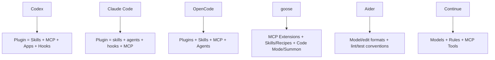

# 24｜Codex 与同类架构对比：产品边界决定运行时形态

> Codex 源码基线：`upstream/main@283bc4cf011047314b4804c0f1ccd06e4f6a95c5`（2026-06-24）。
>
> 外部资料复核：2026-06-25，仅采用各项目官方文档或官方仓库。

本章不做模型效果排名。模型、价格和产品功能变化太快；更稳定、也更有工程价值的比较对象是：

- Agent loop 的宿主边界；
-上下文与编辑策略；
-工具与扩展协议；
-客户端/服务端架构；
-会话与恢复；
-协作与长期状态。

## 1. 比较对象

| 项目 | 当前官方定位 |
| --- | --- |
| Codex | 本地/远程 coding agent runtime，CLI、TUI、App Server、SDK 与 Cloud |
| Claude Code | 终端、IDE、桌面、浏览器及 Agent SDK 共用的 coding agent |
| OpenCode | provider-agnostic agent，TUI 作为本地 HTTP/OpenAPI Server 的客户端 |
| goose | Rust 编写的通用本地 Agent，桌面、CLI、API 与 MCP 扩展 |
| Aider | 以 Git 和显式文件上下文为中心的终端 pair programmer |
| Continue | IDE/CLI Agent；官方仓库已只读并发布最终 2.0.0 |

## 2. 顶层架构

| 维度 | Codex | Claude Code | OpenCode | goose | Aider | Continue |
| --- | --- | --- | --- | --- | --- | --- |
| 核心边界 | App Server v2 + Core | CLI/SDK Agent runtime | HTTP/OpenAPI Server | 本地 Agent + API | 单进程聊天/编辑循环 | IDE/CLI Agent |
| 主要语言 | Rust | 未以开源源码作为本章依据 | TypeScript 生态 | Rust + UI | Python | TypeScript |
| 多客户端 | TUI、exec、IDE/SDK、daemon/remote | Terminal、IDE、desktop、browser、SDK | TUI、SDK、ACP、HTTP clients | desktop、CLI、API | terminal/IDE integration | VS Code、JetBrains、CLI |
| 外部工具 | MCP + Plugin + Dynamic tools | MCP + plugins + hooks | MCP + custom tools + plugins | MCP extensions | 以编辑、Git、lint/test 为主 | MCP + built-ins |

Codex 和 OpenCode 都明确采用“UI 是服务端客户端”的思路：

- Codex 的 TUI/exec 使用 typed App Server client；
- OpenCode 启动 TUI 时同时启动 HTTP Server，OpenAPI 用于生成 SDK。

差异在协议：Codex 使用支持 server→client 请求的 JSON-RPC-lite，以承载审批和 elicitation；OpenCode 使用 HTTP/OpenAPI，并额外支持 ACP。

## 3. 上下文策略

### Codex

- 类型化 context fragments；
- reference context 与增量更新；
-自动 compaction；
- Skill 目录按预算，全文按需加载；
-工具 schema 与文本历史分离；
- resume/fork 通过 rollout 重放。

### Claude Code

- `CLAUDE.md`、path-scoped rules、Skills；
- auto memory 每个仓库跨会话加载；
- subagent 可有独立 memory；
- compact 与 session resume；
-输出 style 可直接修改 system prompt。

### OpenCode

-支持 `AGENTS.md`；
- Skills 通过 native skill tool 按需加载；
- primary agent 与 subagent；
- session snapshot 支持 undo/revert。

### Aider

-用户显式把文件加入 chat；
- repo map 提供全仓符号摘要；
-鼓励小步任务与动态 `/add`、`/drop`；
- Architect 模式把求解和编辑拆成两个模型请求。

Aider 的策略最强调“人工选择小上下文 + Git 反馈”；Codex 更强调运行时自动维护有界上下文；Claude Code/OpenCode 则在项目指令、Skills 和子 Agent 间组合。

## 4. 编辑与执行

| 项目 | 编辑主线 | 执行主线 |
| --- | --- | --- |
| Codex | apply_patch grammar + ExecutorFileSystem + delta | unified exec、PTY、sandbox、remote env |
| Claude Code | Read/Write/Edit tools | Bash/Monitor，权限与 sandbox settings |
| OpenCode | built-in edit/write tools | bash tool + permission patterns |
| goose | Developer extension tools | MCP extensions，默认可自治执行 |
| Aider | 多种 edit format、Architect/Editor | lint/test 与 shell 工作流，Git commit |
| Continue | IDE file tools | terminal tool + per-tool policy |

Codex 的特殊点是编辑与进程都进入统一的可审批 runtime，且 PathUri/ExecutorFileSystem 支持远程环境。Aider 的特殊点是把 Git commit/undo 当作核心事务边界，而不是维护通用工具总线。

## 5. 扩展模型

Codex 与 Claude Code 都将多个扩展类型打包进 marketplace Plugin。OpenCode 提供 JS/TS plugins、Skills、MCP 和 Agent 配置。goose 将 extension 明确建立在 MCP 上，同时内置 Code Mode、Memory、Summon 等 platform extensions。

Aider 的可扩展性更集中于模型/provider、edit format、命令和 Git 工作流，不追求同样规模的运行时插件市场。

## 6. Multi-Agent

| 项目 | 形式 |
| --- | --- |
| Codex | 子线程、spawn/wait/send/close、父会话审批桥、Guardian |
| Claude Code | 可配置 subagent，独立 prompt/tool/permission/hooks/skills |
| OpenCode | primary agent / subagent，可按 `@` 或 command subtask 调用 |
| goose | Summon 加载 skills/recipes 并委派 subagents |
| Aider | Architect model → Editor model 的两阶段协作 |
| Continue | 以 Agent/Plan modes 与配置化 assistants 为主 |

这里最容易误判的是把 Architect/Editor 等同于通用 Multi-Agent。前者是固定两阶段编辑流水线；Codex/Claude/OpenCode/goose 的 subagent 更接近可配置任务单元。

## 7. 会话与持久化

Codex 有 ThreadStore、rollout replay、SQLite 索引、fork/rollback/archive 和远程 App Server。OpenCode 有 server session 与 snapshots。Claude Code 提供 session resume、remote control 和 auto memory。goose 有跨会话搜索、task tracking 与 memory extensions。Aider 主要依赖 chat history、repo map 与 Git commit。

不同选择反映产品目标：

-要支撑多客户端和远程控制，必须把会话变成协议资源；
-要做轻量 pair programming，Git 已能承担大量恢复与审查职责；
-要做通用 Agent，MCP 和 extension directory 比 coding-specific rollout 更重要。

## 8. 适用场景

| 场景 | 更值得优先评估的设计 |
| --- | --- |
| 强本地安全、跨平台、企业治理 | Codex 的 permission/sandbox/requirements |
| 丰富 Hooks、可配置 subagent、统一 SDK | Claude Code |
| 多 Provider、开放 HTTP/ACP 客户端 | OpenCode |
| 通用自动化、MCP-first、桌面/CLI | goose |
| Git 驱动、上下文人工可控、快速编辑 | Aider |
| 既有 VS Code/JetBrains 工作流、简单 MCP Agent | Continue，但需考虑项目已停止活跃维护 |

这不是排他选择。项目可能用 Aider 做短编辑，用 Codex 执行复杂本地任务，用 Claude Code/SDK 构建自定义 Agent，或将 OpenCode/goose 作为 MCP/ACP 宿主。

## 9. 设计启示

1. 多客户端要求稳定协议，而不只是一个漂亮 TUI。
2. 工具数量增长后需要 deferred discovery 或按需 Skill 加载。
3. Git checkpoint 与事件溯源分别适合“文件变化恢复”和“完整 Agent 状态恢复”。
4. Plugin 打包改善分发，但也扩大供应链与治理责任。
5. Multi-Agent 的价值来自上下文隔离和有界结果，不只是并发数量。
6. Provider-agnostic 与深度利用单一 Provider 能力之间存在长期张力。

## 10. 外部一手资料

- [Claude Code overview](https://docs.anthropic.com/en/docs/claude-code/overview)
- [Claude Agent SDK](https://docs.anthropic.com/en/docs/claude-code/sdk)
- [Claude Code memory](https://docs.anthropic.com/en/docs/claude-code/memory)
- [Claude Code subagents](https://docs.anthropic.com/en/docs/claude-code/sub-agents)
- [OpenCode server](https://opencode.ai/docs/server/)
- [OpenCode agents](https://opencode.ai/docs/agents/)
- [OpenCode Skills](https://opencode.ai/docs/skills/)
- [OpenCode ACP](https://opencode.ai/docs/acp/)
- [goose official repository](https://github.com/aaif-goose/goose)
- [goose extensions](https://goose-docs.ai/docs/getting-started/using-extensions/)
- [Aider usage](https://aider.chat/docs/usage.html)
- [Aider repository map](https://aider.chat/docs/repomap.html)
- [Aider Git integration](https://aider.chat/docs/git.html)
- [Continue official docs](https://docs.continue.dev/)
- [Continue Agent Mode](https://docs.continue.dev/ide-extensions/agent/how-it-works)

对比结论应落在架构选择，而不是品牌：

> Codex 的优势来自“协议化 runtime + 深安全边界 + 状态恢复”；代价也是更大的实现与运维复杂度。其他项目通过更轻的上下文、Git、插件或服务器模型优化了不同目标。
