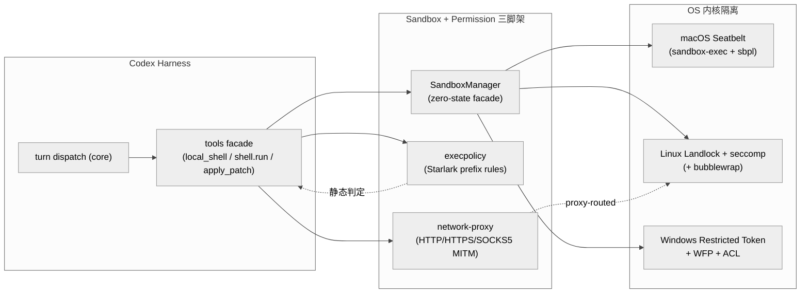
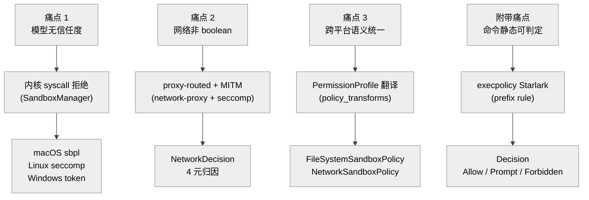
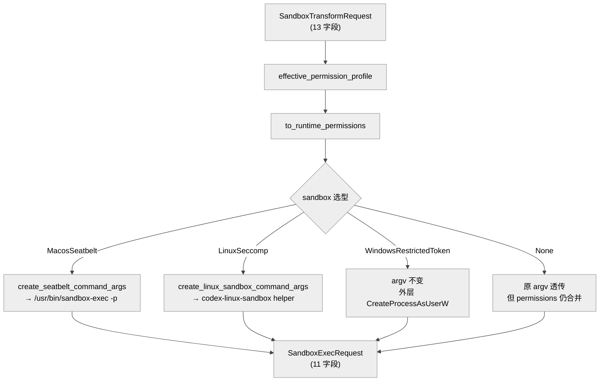
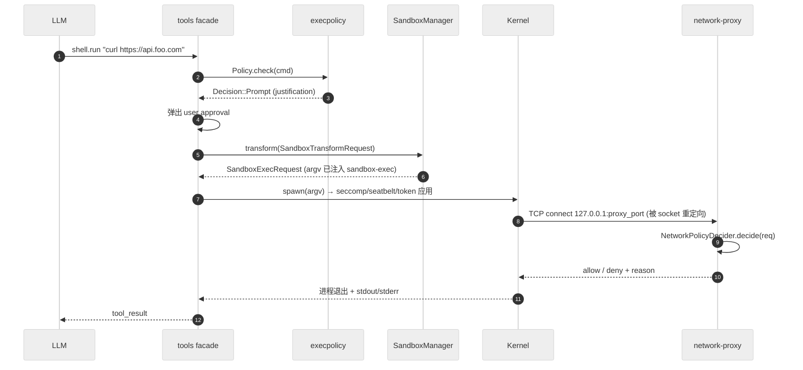
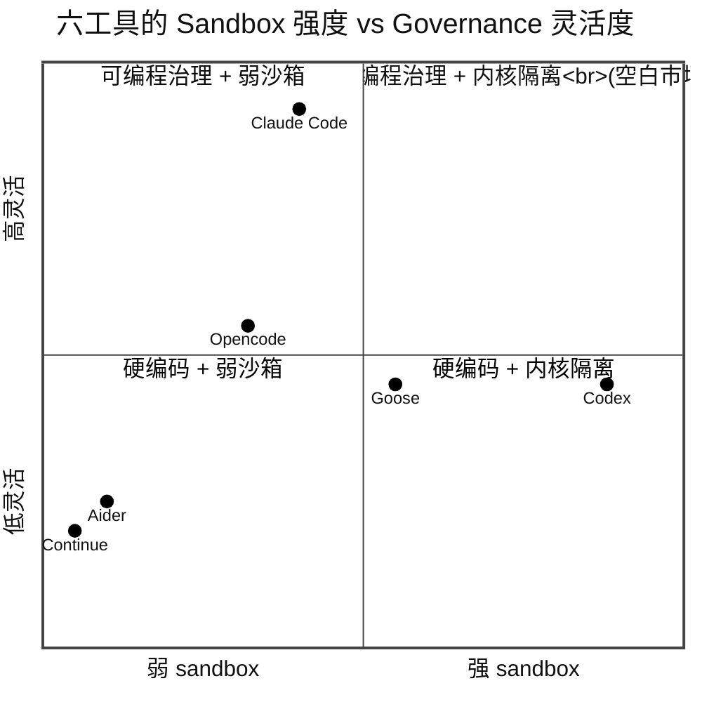

# 第 25 章 — Codex 沙箱与权限模型 vs 同类

## 引言

“一个能 `rm -rf /` 的 LLM 算不算 AGI”——这是 2025 年下半年 HN 上常被用来调侃 Codex / Claude Code 的一个段子，但它准确指出了所有终端编码代理共同的命门：**模型本身没有意图、没有信任度，它只是按 prompt 生成 token；真正决定“它能做什么坏事”的是 harness 在模型与操作系统之间架的那道墙**。这一章把视角聚焦到这道墙：Codex 的 `sandboxing / windows-sandbox-rs / execpolicy / network-proxy / linux-sandbox / bwrap` 六个 crate 一共 27 732 行（`wc -l` 复核同日）、跨 macOS Seatbelt + Linux Landlock/seccomp + Windows Restricted Token/WFP 三个内核 API 矩阵，与 Claude Code 的 Allow/Ask/Deny + Hook 系统、Opencode 的“provider-agnostic 但 OS 中性”策略、Aider / Goose / Continue 这些社区项目的“近乎裸奔”模型逐一对照，看在“模型不可信”这条假设下，Codex 选择的“内核优先 + 静态规则 + MITM 代理”三层结构相对其它工具到底意味着什么。

本章不写“谁更安全”的判分文。安全模型的强弱永远依赖于 **威胁建模**（你在防什么）、**默认配置**（用户实际跑的是哪种姿态）以及 **可观测性**（被拦了能不能被诊断），三者错位时哪怕用了 Landlock V5 也仍然不安全。本章想做的是回到代码：拿出 Codex 真实的 `SandboxManager::transform`、`Policy::check`、`network_policy::NetworkPolicyDecision`、`token::set_default_dacl`，把它们和 Claude Code 公开的 `permissions` JSON + 26 种 hook、Opencode 的 `bash.sandbox` 与 `dangerouslyDisableSandbox` 摆在一起，看在每一个具体决策点上 Codex 是“怎么决定 allow / ask / deny”的，又在哪些地方它的代码诚实地承认“这不是我能管的”。

---

## 一、全网调研补充

### 1.1 社区共识

按 Step 0 的检索，2026 年上半年“Codex sandbox vs Claude Code / Opencode”这条主题在英文社区已经凝固出几条相当稳定的判断，几乎不再有反例：

第一条共识是 **“governance 层位是 Codex 与 Claude Code 最大的结构差异”**。InstaVM 的对比文 [How Claude Code & Codex approach sandboxing](https://instavm.io/blog/how-claude-code-and-codex-approach-sandboxing) 给出了一张被反复引用的对照表：Codex 默认 *sandbox-first*（`should_require_platform_sandbox()` 始终评估，policy 不强制时才会 resolve 到 `SandboxType::None`），策略表达落在一个 4 变体的 Rust enum `SandboxPolicy` 上；Claude Code 默认 *opt-in*，策略表达落在一个 5 层 JSON settings merge 上。前者写在内核里、后者写在应用层。blakecrosley.com [Claude Code vs Codex CLI 2026](https://blakecrosley.com/blog/claude-code-vs-codex) 的总结更直白：*"Claude Code 通过 hooks 治理：26 种生命周期事件；Codex 通过 sandboxing 治理：内核级限制"*。这条共识基本统一了英文社区在 2026 Q1 之后的叙事。

第二条共识是 **“Codex 的 Windows 沙箱是它跨平台真正的护城河，也是真正的复杂度泥潭”**。Jonathan Johnson 的 [A Deep Dive into Codex Windows Sandbox](https://jonny-johnson.medium.com/a-deep-dive-into-codex-windows-sandbox-a2489bf4ae91) 与 AIWithGhost 的 [Building a safe, effective sandbox to enable Codex on Windows](https://aiwithghost.com/news/news-building-a-safe-effective-sandbox-to-enable-codex-on-windows/) 给出了同一段叙事：OpenAI 评估过 Windows Sandbox（即 WSB）和 AppContainer，最终都没选——前者过重、后者太弱——而是用 *Restricted Token + 合成 SID + ACL + WFP/Windows Firewall + 专用 sandbox 用户* 五件套，把"为什么 Windows 上没有原生 Seatbelt"这件事自己补齐。社区一致认同：这是目前所有 AI coding agent 里 **唯一** 在 Windows 上做到内核级隔离的实现。Claude Code、Aider、Goose 等在 Windows 上几乎都只能依赖 Docker 容器或用户自律。

第三条共识是 **“execpolicy 是 Codex 的一项被严重低估的差异化能力”**：Starlark DSL + prefix rule + match/not_match 验证，能让企业在 `~/.codex/execpolicies/*.codexpolicy` 里写出可单测的命令拒绝规则。Claude Code 的 `permissions` 只能用通配符（`Bash(rm -rf:*)` 这种），Opencode 没有等价机制，Aider/Continue/Goose 也没有。但社区也承认，这条能力 *因为 Starlark 这个不常见的 DSL* 实际渗透率非常低，2026 年还没看到任何公开的企业级 codexpolicy 仓库（这是后文盲区 §1.3 第 3 点的来源）。

第四条共识是 **“proxy-routed 沙箱模型是 Codex 解决‘想联网但又想可控’的标准路径”**：`network-proxy` crate 提供 HTTP/HTTPS/SOCKS5 代理 + MITM + 域名 allow/deny + 审计事件流，与 Linux 的 seccomp `ProxyRouted` 模式联动——只允许 `AF_INET/AF_INET6` 出栈到代理端口，连 `AF_UNIX` 都关掉。这种"内核级路由约束 + 应用级 MITM 审计"在 Claude Code 与 Opencode 都没有原生对应；社区里类似能力的对照只能找 `clampdown` 这种独立项目，而它仍然只覆盖 Linux。

第五条共识是 **“sandbox 默认严格会逼用户切到 `danger-full-access`”**：HN 多个讨论串（[Lightweight coding agent](https://news.ycombinator.com/item?id=43708025)、[Has anyone seriously used codex cli](https://news.ycombinator.com/item?id=46738288)）反复出现一类反馈：*Codex 默认配置下 `pip install` / `npm install` / `cargo build` / Docker 操作经常因为写出 cwd 或网络受限被拒，最后用户索性切到 full-access*。社区一致认为这不是 Codex 的"bug"而是"安全/可用性张力"的必然——但同时也强调：*如果一个工具的默认安全姿态在 80% 的现实场景里立刻被绕开，那它的实际安全收益跟"应用层 hook + 友好默认"未必有差*。这是后文要展开的核心争议之一。

第六条共识形成时间更晚一些（2026 年 Q2 才稳定下来），是 **“Codex 的 Windows 沙箱实际上是 OpenAI 自创的一类新颖工程实践”**。Windows 平台从来没有 Seatbelt / Landlock 这种为开发者准备的 *轻量 syscall 拦截器*——AppContainer 是为 UWP / 商店应用设计的、Windows Sandbox（WSB）是为完整 desktop OS 隔离设计的，两者都不合适。Codex 在 `windows-sandbox-rs` 这个 ~9 200 行的 crate 里把 Windows 自带的 *Restricted Token、Synthetic SID、ACL、WFP、Windows Firewall、Hidden Desktop、Conpty* 拼出一套接近 Seatbelt 语义的沙箱体系。Medium 长文 [A Deep Dive into Codex Windows Sandbox](https://jonny-johnson.medium.com/a-deep-dive-into-codex-windows-sandbox-a2489bf4ae91) 的作者 Jonathan Johnson 在文末说了一句很有意思的话：*"很多年来 Windows 平台缺一套像样的开发者沙箱，结果是 OpenAI 在做 Codex 时顺手把它造了出来"*。这是 *Codex 工程外部性* 的一个例子：它的 Windows 沙箱方案某种意义上 *补齐了 Windows 平台的能力缺口*，未来很可能被其他 AI 工具直接参考甚至复用。

这六条共识合在一起，可以画出一张相当稳定的 *"社区共识地图"*：**层位 / Windows / execpolicy / proxy-routed / 默认严格 / Windows 沙箱的新颖性**——这六个关键词基本概括了 2026 年中之前所有深度比较文的论点。本章后续的七维分析将以这六条共识为锚点，逐条用源码验证或挑战。

### 1.2 主要争议

社区在 Codex sandbox / permission 问题上至今没有形成单一结论的争议有四条，每条都两派都能找到具体证据：

- **“内核沙箱 vs 应用 hook 的实际安全收益到底差多少”**。blakecrosley.com 引用的论点是 *"The model cannot escape restrictions by crafting clever commands; the operating system denies the syscall"*——这条论证在 Codex 这边逻辑成立；但 InstaVM 的对照表也明确指出 Claude Code 的 `PreToolUse` hook *fires before any permission-mode check*、`deny` 决策不能被任何 hook bypass、deny rules 在 managed settings 一层之上还有更高的优先级。结论是：**如果用户能写出靠谱的 hook，Claude Code 的应用层防御并不天然弱**；反过来 **如果用户把 Codex 切到 `danger-full-access`，内核优势也立刻归零**。这条争议的本质是“你信任默认配置还是信任企业 DevOps 团队的 hook 工程能力”。
- **“Windows 沙箱的 elevated 模式是不是 over-engineered”**。OpenAI 自己在文档里给出了 unelevated / elevated 双模设计的演化路径（[OpenAI Developers Windows](https://developers.openai.com/codex/windows)），但 issue #10090 / #22428 / #17179 反映出 elevated 模式经常在 ACL / owner / PowerShell 分发渠道兼容上出问题。社区一派支持 elevated（“没有专用 sandbox user + WFP 就做不到强网络隔离”），另一派支持 unelevated（“开发机谁会愿意装一个需要 admin 的 daemon”）。从 PR 历史看 OpenAI 自己也在两边摇摆，2026 年 Q1 才稳定到“unelevated 默认 / elevated 可选”的双轨。
- **“`execpolicy` 应该是默认行为还是 opt-in”**。一派认为 *prefix rule + Starlark* 是 Codex 区别于其它工具的核心 governance 资产，应该用更广的默认策略库；另一派认为 Starlark 学习成本太高，应该用 YAML / JSON 表达。从源码看，目前 `execpolicy` 默认是非强制的 *heuristics fallback*（`Policy::matches_for_command_with_options` 在 `matched_rules.is_empty()` 时才回落到 `heuristics_fallback`），这意味着 OpenAI 自己倾向于"启发式优先 + 规则补充"，而非"规则优先"。
- **“network-proxy 的 MITM 是不是企业可接受的折衷”**。MITM 意味着 Codex 持有用户的证书并能读取其 HTTPS 流量；这个能力在追求 zero-trust 的金融/医疗合规场景下通常会被禁止。社区对此分歧很大：支持派认为这是“proxy-routed + 审计”的必要前提，反对派认为这反而把代码代理变成了一个新的 supply chain 风险面（“你用 Codex 帮你 review PR，但 Codex 把你公司的 token 全读了一遍”）。Codex 的 `mitm.rs` 共 562 行，`mitm_hook.rs` 1047 行，能力非常完整；但是否要打开它由用户配置决定。

这四条争议都已经 *不是新争议*，但它们的特征是：**正反两派都能引用具体源码或具体 issue，无法被一次基准测试关上**。这说明 AI coding agent 的 governance 模型仍然处在“前范式”阶段——基本假设没有统一，不可能有“最优解”。

需要补充一句方法论：在 *沙箱* 这个主题上，社区争议的根源往往不是 *技术取舍*，而是 *威胁建模假设*。同一段代码，在 *“个人开发者跑自己写的项目”* 这个威胁模型下，Aider 完全无沙箱也合理；在 *“CI 流水线接受外部 PR 跑代理生成的命令”* 这个威胁模型下，Codex 的内核沙箱+execpolicy+MITM 三层防御也不为过。如果不先把威胁模型说清楚就跳到方案对比，所有的争议都会沦为价值观对立——*"我觉得安全更重要"* vs *"我觉得效率更重要"*。本章在引用上述争议时，刻意保留两派叙事的方式，正是为了不让某种威胁模型被默认成 *唯一正确*。读者在做自己工具选型时，第一步永远应该是 *把威胁模型显式写下来*，而不是先去看哪种沙箱"更先进"。

### 1.3 长期未被系统讨论的盲区

按本章的盲区判据（源码可证 + 社区少谈 + 工程实践影响大），下面 7 个点几乎没人系统讨论过：

1. **`SandboxManager::transform` 在 `SandboxType::None` 时仍然会执行 `effective_permission_profile` 合并**（`codex-rs/sandboxing/src/manager.rs:184-191`）。也就是说 `Forbid` 偏好下沙箱被禁用，但 *permission profile* 仍参与后续路径（cwd、env、network proxy 等）。社区在讨论“关掉沙箱”时几乎从不提这条副作用：你以为 `--sandbox=none` 是逃生口，实际上权限合并仍发生。
2. **Linux seccomp 的 `Restricted` 模式默认允许 `AF_UNIX` 域 socket**（`codex-rs/linux-sandbox/src/landlock.rs:208-216`，注释里写明 *"For socket we allow AF_UNIX (arg0 == AF_UNIX) and deny everything else"*）。这条对 X11 / Wayland / Docker.sock / containerd.sock / dbus 都意味着"沙箱内的进程仍然能与宿主关键服务通信"。社区在讨论“Codex sandbox 默认是不是足够严”时几乎从不引这条，但这是 Codex 一个非常重要的“可用性兜底”决策。
3. **`Decision` enum 的优先级顺序是 `Allow < Prompt < Forbidden`**（`codex-rs/execpolicy/src/decision.rs:7-16` 用了 `Ord`，加上 `Evaluation::from_matches` 调 `matched_rules.iter().map(RuleMatch::decision).max()`）。这意味着 *多条规则匹配同一个命令时，Forbidden 优先*——这是 Claude Code `deny > allow` 的同构选择，但社区在比较时几乎从不引用这条精确语义。
4. **Windows 沙箱用 `WriteRestricted + LUA_TOKEN + DisableMaxPrivilege` 三个 flag 组合**（`codex-rs/windows-sandbox-rs/src/token.rs:42-44`：`const WRITE_RESTRICTED: u32 = 0x08; const LUA_TOKEN: u32 = 0x04; const DISABLE_MAX_PRIVILEGE: u32 = 0x01;`），创建受限令牌时这三个 flag 同时打开。`WRITE_RESTRICTED` 是关键——它让 token 在“执行 write 操作”时必须同时通过 restricted SID 检查。这条社区甚至连 InstaVM / AIWithGhost 都只是模糊提到“restricted token”，没有展开过哪些 flag 组合。
5. **`network-proxy` 的 `NetworkDecisionSource` 是 4 元枚举：`BaselinePolicy / ModeGuard / ProxyState / Decider`**（`codex-rs/network-proxy/src/network_policy.rs:57-75`），意味着同一个网络请求被拒绝时，理论上能精确归因到“是策略层 deny、还是模式 guard、还是 proxy 状态、还是 decider 自定义”。这种归因力是 Claude Code / Opencode 都不具备的——它们的 sandbox 拒绝几乎都只有一行通用 message。但 Codex 自己也几乎没把这条能力包装到 user-facing diagnostics（issue 里普遍报告“看不出为什么被拒”）。
6. **`seatbelt_base_policy.sbpl` 共 122 行，全部以 `(deny default)` 起手**（`codex-rs/sandboxing/src/seatbelt_base_policy.sbpl:8`），然后 117 行 allow rule 把 `process-exec / file-read* /dev/null / iokit-open / mach-lookup com.apple.cfprefsd` 等基础能力补回来。这相当于一个手写的“macOS 进程能跑得起来需要哪些 syscall”的最小集。社区文章在讨论“Codex 用 Seatbelt”时几乎从不细看这 122 行 sbpl——而它实际上是一份非常宝贵的“macOS 沙箱实战字典”。
7. **`SandboxManager` 是一个 `#[derive(Default)] pub struct SandboxManager;` 零字段结构体**（`codex-rs/sandboxing/src/manager.rs:131-132`），所有方法都是 stateless 的 transform。这种“零状态 facade”决定了 Codex 的沙箱选型与转换可以被任意线程并发调用，但也意味着 *没有 per-session 缓存*：每次 turn 跑命令都会重算 permission profile / 重生成 sbpl 内容。Claude Code 的 hook 系统天然 stateful（hook 进程本身可以缓存），这种"无状态 vs 有状态"的取舍是另一个被忽视的架构差异。

带着这 7 个盲区进入七维分析，会发现 Codex 的沙箱模型既不是“最严”的也不是“最灵活”的，而是“**把内核能力暴露到 Rust 类型系统里，让上层 harness 能用类型确定地表达 policy**”——这一点是它跟所有同类不一样的根本之处。

需要一并指出的是，这 7 个盲区并不是 OpenAI *刻意隐藏* 的设计细节，而是 *被工程语言天然过滤* 的内容：要看出 `Decision::Ord` 的影响，你得理解 `BinaryHeap<Decision>` 在 `iter().max()` 上的行为；要看出 `WRITE_RESTRICTED` 的语义，你得读过 Windows Security API 文档；要看出 `recvfrom` 不被拒绝的原因，你得真的跑过 `cargo clippy`。这些都是 *只有读过源码 + 试过部署 + 跑过失败案例* 的工程师才能积累的认知，而绝大多数中英文博客作者 *不具备这种全栈经验*，所以会在比较时把这些 *决定行为的细节* 忽略掉。**本章存在的核心价值正是把这些细节"翻译"出来——让没有时间一行行读源码的读者也能对 Codex sandbox 形成更接近"工程实情"的认知**。

---

## 二、七维分析

按总纲约定的七维框架展开。每一维都以 **Codex 源码事实 → 对比 Claude Code → 对比 Opencode / Aider / Goose / Continue** 的次序组织。

### 2.1 本质是什么——三脚架：SandboxManager / execpolicy / network-proxy

把 Codex 的沙箱与权限子系统画成结构图，会看到一个非常清晰的 *三脚架* 形态：**SandboxManager 管 OS 内核隔离、execpolicy 管命令静态判定、network-proxy 管网络运行时拦截**。三者解耦合并到 `core` 的 turn dispatch，再由 `tools` crate 在每次 `local_shell / shell.run / apply_patch` 的调用点串起来。

下面这段引用是 `sandboxing/src/manager.rs:22-46` 的 `SandboxType` 与 `SandboxablePreference` 定义，可以看到 *“沙箱选型”* 完全枚举化了：四种沙箱类型 × 三种偏好策略 = 12 种组合，全部能被 Rust 类型系统覆盖。

```rust
// codex-rs/sandboxing/src/manager.rs:22-46
#[derive(Clone, Copy, Debug, PartialEq, Eq)]
pub enum SandboxType {
    None,
    MacosSeatbelt,
    LinuxSeccomp,
    WindowsRestrictedToken,
}

#[derive(Clone, Copy, Debug, PartialEq, Eq)]
pub enum SandboxablePreference {
    Auto,
    Require,
    Forbid,
}
```

`select_initial` 把这 12 种组合 collapse 成单一 `SandboxType`：

```rust
// codex-rs/sandboxing/src/manager.rs:139-166
pub fn select_initial(
    &self,
    file_system_policy: &FileSystemSandboxPolicy,
    network_policy: NetworkSandboxPolicy,
    pref: SandboxablePreference,
    windows_sandbox_level: WindowsSandboxLevel,
    has_managed_network_requirements: bool,
) -> SandboxType {
    match pref {
        SandboxablePreference::Forbid => SandboxType::None,
        SandboxablePreference::Require => {
            get_platform_sandbox(windows_sandbox_level != WindowsSandboxLevel::Disabled)
                .unwrap_or(SandboxType::None)
        }
        SandboxablePreference::Auto => {
            if should_require_platform_sandbox(
                file_system_policy, network_policy, has_managed_network_requirements,
            ) {
                get_platform_sandbox(windows_sandbox_level != WindowsSandboxLevel::Disabled)
                    .unwrap_or(SandboxType::None)
            } else {
                SandboxType::None
            }
        }
    }
}
```

注意 `Auto` 分支调用的 `should_require_platform_sandbox(file_system_policy, network_policy, has_managed_network_requirements)` ——这是 *"sandbox-first by default"* 这条社区共识的真正落点：它把"需不需要沙箱"的判断从 *用户偏好* 转成 *policy 语义*。InstaVM 那篇对比文里讲的 *"`should_require_platform_sandbox()` 始终评估"* 就是这一行。

`execpolicy` 这一脚的本质则完全不同。它不操心 OS，只问“一行 shell 命令能不能跑”：

```rust
// codex-rs/execpolicy/src/policy.rs:27-49
pub struct Policy {
    rules_by_program: MultiMap<String, RuleRef>,
    network_rules: Vec<NetworkRule>,
    host_executables_by_name: HashMap<String, Arc<[AbsolutePathBuf]>>,
}
```

三字段：按 *程序名* 索引的命令规则、网络规则、白名单 host executable 路径。这三字段对应三类决策：*“这个命令是否允许跑、连这个域名是否允许、用的是不是受信的 binary”*。整个 crate 10 个文件、~1789 行（按 `wc -l` `execpolicy/src/*.rs` 求和），相当紧凑。

`network-proxy` 这一脚是三者里最重的（17 个 src 文件、~9 868 行，其中 `runtime.rs` 一个文件就 1 963 行），承担运行时 HTTP/HTTPS/SOCKS5 代理 + MITM + 审计 + 决策状态机。它的核心抽象是 `NetworkDecision`：

```rust
// codex-rs/network-proxy/src/network_policy.rs:121-167
#[derive(Clone, Debug, PartialEq, Eq)]
pub enum NetworkDecision {
    Allow,
    Deny {
        reason: String,
        source: NetworkDecisionSource,
        decision: NetworkPolicyDecision,
    },
}
```

`Deny` 必须 carry `reason / source / decision`——这是上一节盲区 §1.3 第 5 点说的 4 源归因力的直接产物：网络拒绝绝不允许“无理由 deny”。

下图把三脚架画在一张坐标系上。

<div style="background:#ffffff !important; background-color:#ffffff !important; padding:16px; border-radius:8px; margin:16px 0;" bgcolor="#ffffff">



</div>

对照 Claude Code / Opencode：

- **Claude Code 没有三脚架，只有“permissions JSON + Hook bus + 可选 sandbox”**。它的 governance 落点不在 OS，而是在 *Hook 拦截器*——`PreToolUse / PostToolUse / PermissionRequest` 等 26 种事件，每种事件由用户写的 shell / prompt / agent 程序拦截。CLI 文档（[Hooks](https://code.claude.com/docs/en/hooks-guide)）描述了一个非常关键的细节：*"PreToolUse hooks fire before any permission-mode check. A hook that returns `permissionDecision: deny` blocks the tool even in `bypassPermissions` mode or with `--dangerously-skip-permissions`"*。这是 Claude Code 的 *最强 governance 保证*——但它要求用户能正确写 hook。
- **Opencode 的本质是 `bash.sandbox` 配置 + 通配符 `permission` 表 + `dangerouslyDisableSandbox`**。它的 sandbox 能力远弱于 Codex，并且没有 OS 内核级 Windows 支持。它的核心定位是 *provider-agnostic harness*，不是 *sandbox-first harness*。
- **Aider 没有沙箱**。它假设用户在自己的开发环境跑 git diff / apply 操作，*依赖用户自身的信任*。它的 governance 模型是“先 confirm 再 apply”。
- **Goose 是“Docker 容器是一等公民”的模型**：通过 `goose run` 默认运行在容器里，配合 `--container` flag。它的 sandbox 边界 = 容器边界，不在 OS 内核 syscall 层。
- **Continue 是 IDE 插件**，sandbox 边界 = IDE 进程边界，更弱。

下表汇总六者在 governance 层位上的差异。

| 工具 | 默认姿态 | 隔离机制 | Policy 表达 | Windows 支持 | 网络控制 |
|---|---|---|---|---|---|
| Codex CLI | sandbox-first | macOS Seatbelt / Linux Landlock+seccomp+bwrap / Windows Restricted Token+WFP | `SandboxPolicy` 4 变体 + `PermissionProfile` + `execpolicy` Starlark | 原生（unelevated / elevated 双轨）| `network-proxy` MITM + seccomp ProxyRouted |
| Claude Code | opt-in | macOS Seatbelt / Linux 自带 sandbox（无 Windows） | 5 层 JSON merge + 26 种 hook | 无原生（需 WSL2） | 仅应用层 deny 规则 |
| Opencode | opt-in | `bash.sandbox` + `permission` 表 | 通配符 + `dangerouslyDisableSandbox` | 无 | 应用层 deny |
| Aider | 无沙箱 | 用户信任 | confirm-on-apply | 无 | 无 |
| Goose | 容器优先 | Docker 容器 | container 配置 | 通过 WSL2 | 容器网络 |
| Continue | 无沙箱 | IDE 进程 | IDE 设置 | 通过 IDE | 无 |

“Codex 的沙箱比所有 AI coding agent 都重”这句话在源码上完全站得住脚——`27 732` 行专门用于 sandbox/permission 的 Rust 代码、跨 3 个 OS、12 种沙箱-偏好组合、4 元枚举的 `NetworkDecisionSource`——但它的 *运营成本* 也最重。这是后文 §2.5 / §2.7 反复回到的张力。

把数字进一步拆分（按 `wc -l` 同日复核）：`sandboxing` crate 4 583 行（含 1 800 行 `*_tests.rs` 与 352 行 sbpl 静态规则）、`windows-sandbox-rs` 9 200+ 行（最大的单文件是 `setup.rs` 1 665 行）、`execpolicy` ~1 800 行、`network-proxy` 9 868 行（最大的单文件是 `runtime.rs` 1 963 行）、`linux-sandbox` 与 `bwrap` 合计 ~2 200 行。这个体量上，Codex sandbox 子系统已经 *相当于一个独立中型工程项目*。对照来看，Claude Code 整个 CLI 的 sandbox / permission 实现按公开资料估算不会超过几千行（因为它绝大多数靠 hook 转嫁），Opencode 的 sandbox 模块只有几百行 TS。这种 *一个数量级以上* 的代码体量差异，是 Codex 与同类在 governance 实现深度上最直观的指标。

### 2.2 核心问题与痛点

Codex sandbox 子系统真正在解决的是三类问题，每一类都对应一个被 Claude Code / Opencode 完全或部分回避的痛点。

**第一类痛点：模型在生成 shell 命令时是“没有信任度”的**。LLM 会生成 `rm -rf /tmp/cache && cd $WORK && git push --force origin main`——它不能区分“这是用户原本想做的”还是“因为上下文污染所以做”。Codex 的回答是“**做最坏假设**”：每条命令都默认在沙箱里跑，不允许写出 cwd、不允许联网到非白名单 host、不允许调用 ptrace。Claude Code 在这一点上做的是 *"在应用层 confirm 用户"*——也合理，但是它隐含的假设是 *"用户能正确判断要不要 confirm"*，这在长会话里会快速失效（用户养成 click-through 习惯）。Codex 的 sandbox-first 是想绕开这个心理学陷阱。

**第二类痛点：网络访问 != 全有 or 全无**。早期 AI agent 把网络当 boolean 开关（`network_access: true/false`），但实际需求是“**能访问 PyPI / npm / GitHub raw / OpenAI API**，但不能访问公司内网 / SSH / SMB / 不在 allow list 的随机域名”。Codex 的回答是把网络做成 *proxy-routed* 模型：

```rust
// codex-rs/linux-sandbox/src/landlock.rs:218-246
NetworkSeccompMode::ProxyRouted => {
    // In proxy-routed mode we allow IP sockets in the isolated
    // namespace (used to reach the local TCP bridge) but deny all
    // other socket families, including AF_UNIX. This prevents
    // bypassing the routed bridge via new Unix sockets and narrows the
    // socket surface in proxy-only mode.
    let deny_non_ip_socket = SeccompRule::new(vec![...])?;
    let deny_unix_socketpair = SeccompRule::new(vec![...])?;
    rules.insert(libc::SYS_socket, vec![deny_non_ip_socket]);
    rules.insert(libc::SYS_socketpair, vec![deny_unix_socketpair]);
}
```

注意这里 *AF_UNIX 在 `ProxyRouted` 模式下被显式拒绝*——这是为了防止"在沙箱里 spawn 一个新的 Unix socket 绕过 TCP bridge"。这种"为了关掉某个网络旁路而禁用一种 socket 族"的精细决策在 Claude Code / Opencode 都没有对应实现。

**第三类痛点：跨平台一致性 vs 平台特性**。Codex 的目标是 *"用户在 macOS / Linux / Windows 上用同一份 config.toml 写出同样语义的沙箱"*。这就要求 `PermissionProfile` 是 OS-neutral 的高层语义，然后在 `SandboxManager::transform` 里翻译成各 OS 的具体规则：

```rust
// codex-rs/sandboxing/src/manager.rs:193-245
let (argv, arg0_override) = match sandbox {
    SandboxType::None => (os_argv_to_strings(argv), None),
    #[cfg(target_os = "macos")]
    SandboxType::MacosSeatbelt => { ... create_seatbelt_command_args ... },
    SandboxType::LinuxSeccomp => { ... create_linux_sandbox_command_args_for_permission_profile ... },
    SandboxType::WindowsRestrictedToken => (os_argv_to_strings(argv), None),
};
```

四个 cfg-gated 分支对应四种 transform 策略。Claude Code 的策略表达层（JSON settings + hook）天然不需要 OS-specific 翻译，因为它只在应用层；但代价是 *它的安全保证在不同 OS 上是不等价的*。

下图把三类痛点和三脚架的对应关系画出来。

<div style="background:#ffffff !important; background-color:#ffffff !important; padding:16px; border-radius:8px; margin:16px 0;" bgcolor="#ffffff">



</div>

对照 Claude Code / Opencode：

- **Claude Code 在痛点 1 上选择"trust the user but require confirm"**，靠 `permissions` JSON 的 `ask` 决策 + `PreToolUse` hook 提供 secondary check。痛点 2 上它只用应用层 *"网络是 boolean，对 fetch / WebFetch 等工具加 hook 拦截"*，没有 socket 层精细控制。痛点 3 上它干脆放弃 Windows 原生支持（社区一直在催 Windows 版本，至 2026 中仍未原生发布）。
- **Opencode 在痛点 1 上用 `permission` 通配符表 + `bash.sandbox`**，痛点 2 上"沙箱里 bash 默认无网络"，痛点 3 上跨平台靠 TS runtime（Bun / Node），但 sandbox 本身只有 macOS/Linux 的基础支持。
- **Aider / Continue 完全不处理痛点 1、2、3**——它们的目标人群是“**单人开发者 + 本地 trusted env**”，根本不要求 sandbox。
- **Goose 通过 Docker 同时解决三个痛点**，但代价是 *依赖容器运行时*（Docker Desktop / podman / colima）——而 `clampdown` 的对比表显示 Docker Desktop 在 macOS 上的 fakeowner 文件系统会 *break Landlock 强制*。

这种"痛点-方案"对照表让我们看到一个被社区频繁忽略的事实：**Codex sandbox 子系统的 27 732 行代码不是冗余，而是它选择了一条比所有同类都更陡的路径——直接面对 OS 内核 API 的全部复杂度**。Claude Code / Opencode / Aider 都通过 *"我把 governance 推给用户 / 推给容器 / 推给信任"* 绕过这条陡峭曲线；Codex 选择直接爬。

这种"直接爬"的工程后果，最直观的体现是 *bug 类型分布*。Claude Code 的 sandbox 相关 issue 集中在 *"hook 触发时机"* 与 *"settings merge 顺序"*；Opencode 的 sandbox issue 集中在 *"通配符匹配语义"*；Aider 的 sandbox issue 基本是 *"我不小心 apply 了"*；而 Codex 的 sandbox issue 跨度极广——从 *"WSL1 不支持 bubblewrap"*、*"Windows ACL 把项目目录 owner 改了"*、*"PowerShell pipeline 在 restricted token 下 ACCESS_DENIED"*、*"`cargo clippy` 因为 socketpair 被 seccomp 拦截"*、到 *"MITM 代理证书在企业环境被 EDR 拦截"*——每一类 issue 都对应着 *一个不同的 OS 内核 API 边界*。这种 *issue 类型的爆炸式分布* 是 Codex 选择 "直接爬陡坡" 的真实代价：它解决的是 *最难的工程问题*，但同时也承担 *最多的 OS-specific bug*。Claude Code 之所以 issue 类型更收敛，部分原因是它 *主动规避了 OS 层*——把责任推给了用户。

读到这里，读者应该能体会到一个被中文社区严重低估的事实：**Codex 的 sandbox 不是一个"开发者用得舒服与否"的工程选择，而是一个"OpenAI 是否承担 OS 抽象成本"的产品哲学选择**。同样的钱与时间，OpenAI 完全可以像 Claude Code 那样把 governance 推给用户、让自己专注于 *model + harness 体验*；它选择不那样做，意味着 OpenAI 把 *OS 内核的复杂度* 内部化了。这一点的长期影响：**Codex 团队会比所有同类工具都更早积累 *跨 OS sandbox 工程经验***——这是一项 OpenAI 工程组织能力的隐性资产，社区基本没人讨论过。

### 2.3 解决思路与方案

Codex 的方案核心是一个 **"用 Rust 类型表达内核能力 → 用 transform 函数把语义翻译到各 OS → 用 transform 之外的 policy 层做命令/网络拦截"** 的三层栈。

#### 2.3.1 第一层：`PermissionProfile` 与 `FileSystemSandboxPolicy / NetworkSandboxPolicy`

策略层全部用 Rust enum / struct 表达。`NetworkSandboxPolicy` 极简：

```rust
// codex-rs/protocol/src/permissions.rs:78-93
#[derive(Debug, Clone, Copy, PartialEq, Eq, Serialize, Deserialize, Display, Default, JsonSchema, TS)]
#[serde(rename_all = "kebab-case")]
pub enum NetworkSandboxPolicy {
    #[default]
    Restricted,
    Enabled,
}
```

而 `FileSystemSandboxPolicy` 是一个 *kind + entries* 的结构，支持 `Restricted / Unrestricted / ExternalSandbox` 三种 kind：

```rust
// codex-rs/protocol/src/permissions.rs:184-204
pub enum FileSystemSandboxKind {
    #[default]
    Restricted,
    Unrestricted,
    ExternalSandbox,
}

pub struct FileSystemSandboxPolicy {
    pub kind: FileSystemSandboxKind,
    pub glob_scan_max_depth: Option<usize>,
    pub entries: Vec<FileSystemSandboxEntry>,
}
```

`entries` 里每项是 `(path, FileSystemAccessMode)`，其中 `FileSystemAccessMode` 是 `Read / Write / Deny`——并且 `Deny` 这个变体的注释明确写了 *"`none` 是 legacy alias 暂时保留"*。三种 access mode 之间还有显式的优先级注释：*"deny beats write, and write beats read"*。这是 Codex 的 *"deny 优先"* 选择，跟 Claude Code 的 `deny > allow` 在精神上一致，但 Codex 把它编码到了 *Rust 类型的 Ord trait* 上。

#### 2.3.2 第二层：`SandboxManager::transform` 三分支翻译

`transform` 函数（`codex-rs/sandboxing/src/manager.rs:168-260`）是策略层与 OS 层之间的唯一桥梁。它的输入是一个 `SandboxTransformRequest`（13 字段，覆盖 command / permissions / sandbox 类型 / 网络代理 / cwd / Linux helper exe 路径 / WindowsSandboxLevel 等），输出是 `SandboxExecRequest`（也是 11 字段，把翻译结果固化）。

```rust
// codex-rs/sandboxing/src/manager.rs:91-104
pub struct SandboxTransformRequest<'a> {
    pub command: SandboxCommand,
    pub permissions: &'a PermissionProfile,
    pub sandbox: SandboxType,
    pub enforce_managed_network: bool,
    pub network: Option<&'a NetworkProxy>,
    pub sandbox_policy_cwd: &'a Path,
    pub codex_linux_sandbox_exe: Option<&'a Path>,
    pub use_legacy_landlock: bool,
    pub windows_sandbox_level: WindowsSandboxLevel,
    pub windows_sandbox_private_desktop: bool,
}
```

transform 流程：

1. `additional_permissions.take()`：把命令级别的 *additional* permissions 取出来。
2. `effective_permission_profile(permissions, additional_permissions)`：与 base profile 合并。
3. `to_runtime_permissions()`：拆成 `(FileSystemSandboxPolicy, NetworkSandboxPolicy)`。
4. 三 cfg 分支：
   - `MacosSeatbelt`：调 `create_seatbelt_command_args`，最终产出 `/usr/bin/sandbox-exec -p <sbpl> -- <cmd>`。
   - `LinuxSeccomp`：调 `create_linux_sandbox_command_args_for_permission_profile`，产出 `codex-linux-sandbox --sandbox-policy-cwd ... --permission-profile <json> -- <cmd>`（helper 子进程 fork 后再 seccomp + bwrap）。
   - `WindowsRestrictedToken`：transform 不真正改 argv，由外层 spawn 时用 `CreateProcessAsUserW` + restricted token 启动。

下图把 transform 三分支画出来。

<div style="background:#ffffff !important; background-color:#ffffff !important; padding:16px; border-radius:8px; margin:16px 0;" bgcolor="#ffffff">



</div>

注意 `None` 分支也走完了 *effective_permission_profile 合并*——这是盲区 §1.3 第 1 点的来源。

#### 2.3.3 第三层：execpolicy 的静态命令判定

execpolicy 是 *沙箱外* 的一层防御，作用是在 *命令被 spawn 之前* 就静态拒绝。它的核心数据结构 `Policy` 用 `MultiMap<String, RuleRef>` 按程序名索引规则，命中后用 `Evaluation::from_matches` 取最大 `Decision`：

```rust
// codex-rs/execpolicy/src/policy.rs:188-198
pub fn check<F>(&self, cmd: &[String], heuristics_fallback: &F) -> Evaluation
where
    F: Fn(&[String]) -> Decision,
{
    let matched_rules = self.matches_for_command_with_options(
        cmd, Some(heuristics_fallback), &MatchOptions::default(),
    );
    Evaluation::from_matches(matched_rules)
}
```

`matches_for_command_with_options` 的两阶段查找：

```rust
// codex-rs/execpolicy/src/policy.rs:268-295
pub fn matches_for_command_with_options(
    &self,
    cmd: &[String],
    heuristics_fallback: HeuristicsFallback<'_>,
    options: &MatchOptions,
) -> Vec<RuleMatch> {
    let matched_rules = self
        .match_exact_rules(cmd)
        .filter(|matched_rules| !matched_rules.is_empty())
        .or_else(|| {
            options.resolve_host_executables
                .then(|| self.match_host_executable_rules(cmd))
                .filter(|matched_rules| !matched_rules.is_empty())
        })
        .unwrap_or_default();

    if matched_rules.is_empty() && let Some(heuristics_fallback) = heuristics_fallback {
        vec![RuleMatch::HeuristicsRuleMatch {
            command: cmd.to_vec(),
            decision: heuristics_fallback(cmd),
        }]
    } else {
        matched_rules
    }
}
```

两阶段：先按 *first token*（程序名）精确匹配；如果开启 `resolve_host_executables` 则再按 *binary 完整路径 → basename* 二次匹配；最后回落到 heuristics fallback。然后 `Evaluation::from_matches` 在 N 条命中规则里取 `max`——按 `Decision::Ord` 顺序 `Allow < Prompt < Forbidden`，相当于"任意一条 Forbidden 都判 deny"。

execpolicy 的规则文件是 Starlark DSL：

```python
# codex-rs/execpolicy/examples/example.codexpolicy:4-15
prefix_rule(
    pattern = ["git", "reset", "--hard"],
    decision = "forbidden",
    justification = "destructive operation",
    match = [["git", "reset", "--hard"]],
    not_match = [
        ["git", "reset", "--keep"],
        "git reset --merge",
    ],
)
```

`match` 与 `not_match` 在 *parse 时* 就被 `validate_match_examples` / `validate_not_match_examples` 检查——这是 execpolicy 的"规则即测试"特性：规则文件本身就 carry 单元测试。Claude Code 的 `permissions` 完全没有这个能力，Opencode 也没有。

#### 2.3.4 第三层补：network-proxy 的运行时拦截

network-proxy 是另一层运行时防御。它跑一个本地 HTTP/HTTPS/SOCKS5 代理（默认 `127.0.0.1:<port>`），把沙箱内进程的网络请求强制路由过去，然后按 `NetworkPolicyDecider` 评估每个请求的 `NetworkPolicyRequest`（携带 protocol / host / port / client_addr / method / command / exec_policy_hint）：

```rust
// codex-rs/network-proxy/src/network_policy.rs:77-119
#[derive(Clone, Debug)]
pub struct NetworkPolicyRequest {
    pub protocol: NetworkProtocol,
    pub host: String,
    pub port: u16,
    pub client_addr: Option<String>,
    pub method: Option<String>,
    pub command: Option<String>,
    pub exec_policy_hint: Option<String>,
}
```

`exec_policy_hint` 字段是关键——它把 *外层 execpolicy 的判定* 作为提示传入 network 决策，实现 *“命令层 + 网络层联动”*。Claude Code / Opencode 都不具备这种跨层联动。

下图画出三层防御的协作流程。

<div style="background:#ffffff !important; background-color:#ffffff !important; padding:16px; border-radius:8px; margin:16px 0;" bgcolor="#ffffff">



</div>

注意第 4-5 步：execpolicy 返回 `Prompt` 决策时，Codex 弹给用户的不是"批准执行 curl"而是"批准 *用这个权限组合* 执行 curl"——这是 `justification` 字段的实际用途。Claude Code 的 `permissions` `ask` 决策也有类似流程，但是它没有 *justification* 字段，让用户判断风险时缺少上下文。

#### 2.3.5 macOS `seatbelt_base_policy.sbpl` 的"最小可运行集"

为了让 §2.3 的方案叙述真正落到具体内核策略上，这里把 `sandboxing/src/seatbelt_base_policy.sbpl` 这份 122 行的 *macOS 进程最小可运行集* 摊开看一下：

```scheme
; codex-rs/sandboxing/src/seatbelt_base_policy.sbpl:7-22
; start with closed-by-default
(deny default)

; child processes inherit the policy of their parent
(allow process-exec)
(allow process-fork)
(allow signal (target same-sandbox))

; process-info
(allow process-info* (target same-sandbox))

(allow file-write-data
  (require-all
    (path "/dev/null")
    (vnode-type CHARACTER-DEVICE)))
```

这 16 行已经把 *macOS 沙箱设计的基本骨架* 写完了：**先 closed-by-default、再 allow 最小可运行集（process-exec / fork / signal / `/dev/null` 写入）**。后续 100+ 行 sbpl 全部是为了 *让真实进程能跑起来* 而精心挑选的"必要 allow"——sysctl-read 一长串（`hw.activecpu` / `hw.cpufamily` / `kern.osversion` 等约 45 项），iokit / mach-lookup 各一项，IPC POSIX 信号量与 OpenMP shared memory，pseudo-tty 与 `/dev/ttys[0-9]+` 读写，CFPreferences 共享内存与 lookup。每一行都对应着 *某个真实场景下需要这条 syscall 否则进程会挂*——比如 *"Python multiprocessing 需要 SemLock 所以要 allow ipc-posix-sem"*、*"PyTorch / libomp 需要注册 OpenMP runtime 所以要 allow `^/__KMP_REGISTERED_LIB_[0-9]+$` 这个 regex"*。

这份 sbpl 实际上是一份 *Codex 工程师在过去若干个月里反复被现实教育的产物*：每发现一个工具因为 syscall 被拒挂掉，他们就往 sbpl 里加一行 allow。社区从来没有人把这 122 行当作 "macOS 沙箱开发字典" 来读，但它的工程价值远超它的代码体量——任何想给 macOS 写沙箱的开发者都可以拿它做起点。Claude Code 的 macOS sbpl（如果有）从未公开，Opencode 的 sandbox 远远没达到这种精细度。

#### 2.3.6 三脚架背后的 "policy_transforms" 黏合剂

最后值得提一下 `sandboxing/src/policy_transforms.rs`（533 行）。这个文件是策略层与 OS 层之间的另一层 *黏合剂*，把 `AdditionalPermissionProfile`（命令级的额外权限请求）与 `PermissionProfile`（base 配置）做 *merge / normalize / validate*：

```rust
// codex-rs/sandboxing/src/policy_transforms.rs:71-120 (节选)
pub fn merge_permission_profiles(
    base: Option<&AdditionalPermissionProfile>,
    permissions: Option<&AdditionalPermissionProfile>,
) -> Option<AdditionalPermissionProfile> {
    let Some(permissions) = permissions else {
        return base.cloned();
    };

    match base {
        Some(base) => {
            let network = match (base.network.as_ref(), permissions.network.as_ref()) {
                (Some(NetworkPermissions { enabled: Some(true) }), _)
                | (_, Some(NetworkPermissions { enabled: Some(true) })) =>
                    Some(NetworkPermissions { enabled: Some(true) }),
                _ => None,
            };
            ...
        }
        ...
    }
}
```

这段代码的语义是 *"只要 base 或 additional 任一打开 network，merged 后就是 network=true"*——即 *"权限并集"* 而不是 *"权限交集"*。同时 `glob_scan_max_depth` 做 *"加权合并"*、`entries` 做 *"去重合并"*。这些 *merge 语义* 决定了用户在 *命令级* 加权限时不会被 base 配置反向拒绝，但也意味着 *"我以为我只是临时打开网络，结果整个 session 都开了"* 这种误解。Claude Code 的 settings merge 是 5 层（user / project / managed / local / flag），优先级有明确文档；Codex 的 PermissionProfile merge 在 doc 层面没有同等清晰度，主要靠 `policy_transforms_tests.rs`（914 行）的测试用例去 reverse engineer。

### 2.4 实现细节关键点

下面挑几个最值得在代码层面看清楚的关键点。

#### 2.4.1 macOS Seatbelt：`sandbox-exec` 路径硬编码

```rust
// codex-rs/sandboxing/src/seatbelt.rs:25-29
/// When working with `sandbox-exec`, only consider `sandbox-exec` in `/usr/bin`
/// to defend against an attacker trying to inject a malicious version on the
/// PATH. If /usr/bin/sandbox-exec has been tampered with, then the attacker
/// already has root access.
pub const MACOS_PATH_TO_SEATBELT_EXECUTABLE: &str = "/usr/bin/sandbox-exec";
```

这条 const 的注释是整本书我个人最喜欢的一段——它把"为什么硬编码绝对路径而不从 PATH 找"的安全推理直接写在源码里：*"如果 /usr/bin/sandbox-exec 被篡改了，那攻击者已经拿到了 root，我们也救不了"*。这是 *threat model 边界* 的诚实表达。Claude Code 的 Mac sandbox（如果开启）也用 `sandbox-exec`，但社区没找到它是否做同样的路径硬编码。

#### 2.4.2 Linux seccomp：默认放行 `AF_UNIX` 与 `recvfrom`

```rust
// codex-rs/linux-sandbox/src/landlock.rs:186-216
NetworkSeccompMode::Restricted => {
    deny_syscall(&mut rules, libc::SYS_connect);
    deny_syscall(&mut rules, libc::SYS_accept);
    deny_syscall(&mut rules, libc::SYS_accept4);
    deny_syscall(&mut rules, libc::SYS_bind);
    deny_syscall(&mut rules, libc::SYS_listen);
    ...
    // NOTE: allowing recvfrom allows some tools like: `cargo clippy`
    // to run with their socketpair + child processes for sub-proc
    // management.
    // deny_syscall(&mut rules, libc::SYS_recvfrom);
    ...
    // For `socket` we allow AF_UNIX (arg0 == AF_UNIX) and deny
    // everything else.
    let unix_only_rule = SeccompRule::new(vec![SeccompCondition::new(
        0, SeccompCmpArgLen::Dword, SeccompCmpOp::Ne, libc::AF_UNIX as u64,
    )?])?;
    rules.insert(libc::SYS_socket, vec![unix_only_rule.clone()]);
    rules.insert(libc::SYS_socketpair, vec![unix_only_rule]);
}
```

这一段编码了两个对 *可用性* 至关重要的兜底：

- `recvfrom` *不* 被拒绝，否则 `cargo clippy` 等用 socketpair 通信的工具会跑不起来。
- `socket(AF_UNIX, ...)` *允许*，否则 dbus / X11 / Docker.sock 等全挂。

这两条决策都 *牺牲了一些安全收益换取大量真实场景可用性*。它们的存在直接回应了 §1.2 的争议——*"默认严格逼用户切 full-access"* 这个张力在 Codex 内部是用 *"在 deny 列表里精挑细选"* 来缓解的。

#### 2.4.3 Windows token：`WRITE_RESTRICTED + LUA_TOKEN + DisableMaxPrivilege`

```rust
// codex-rs/windows-sandbox-rs/src/token.rs:42-44
const DISABLE_MAX_PRIVILEGE: u32 = 0x01;
const LUA_TOKEN: u32 = 0x04;
const WRITE_RESTRICTED: u32 = 0x08;
```

这三个 flag 一起调用 `CreateRestrictedToken`，效果叠加：

- `DISABLE_MAX_PRIVILEGE`：把 token 持有的所有 *enabled* 特权 disable（保留但不可用）。
- `LUA_TOKEN`：把 token 的完整性等级强制 *Medium* 以下，禁掉 elevation prompt。
- `WRITE_RESTRICTED`：所有 *write 操作* 必须既通过 token DACL 检查，又通过 *restricted SID 列表* 检查——这是 Codex 把 *"我新建的 synthetic SID 才能写 workspace 目录"* 这条规则编码进 token 行为的关键。

`set_default_dacl`（`codex-rs/windows-sandbox-rs/src/token.rs:55-110`）则解决另一个 Windows-specific 痛点：*受限 token 默认没有 SACL 让自己创建 pipe / IPC*，导致 PowerShell pipeline 失败。Codex 显式给每个 sandbox SID 加 `GENERIC_ALL` 的 explicit access，让沙箱进程能创建命名管道。这一段又是一次"安全 vs 可用性"的精细折衷。

#### 2.4.4 网络决策的 4 元归因

```rust
// codex-rs/network-proxy/src/network_policy.rs:57-75
pub enum NetworkDecisionSource {
    BaselinePolicy,
    ModeGuard,
    ProxyState,
    Decider,
}
```

每次网络 deny 都强制 carry 一个 `NetworkDecisionSource`。这种"为什么拒"的归因力直接对应 §1.3 第 5 点：

- `BaselinePolicy`：底层 config 里写死的 allowlist/denylist。
- `ModeGuard`：当前 sandbox mode（如 `Restricted` 下默认拒所有非 proxy 连接）。
- `ProxyState`：proxy runtime 状态（如 stop / drain）。
- `Decider`：上层 decider 自定义判断（接 `NetworkPolicyDecider` trait）。

如果 Codex 把这个归因暴露到用户面前，调试体验会大幅提升——可惜目前 `NetworkDecision::Deny` 的 `reason` 字段在 user-facing diagnostics 里通常只显示一行字符串，不带 `source` 维度。

#### 2.4.5 网络主机标准化：拒绝通配符

```rust
// codex-rs/execpolicy/src/rule.rs:156-212
pub(crate) fn normalize_network_rule_host(raw: &str) -> Result<String> {
    let mut host = raw.trim();
    if host.is_empty() { return Err(...); }
    if host.contains("://") || host.contains('/') || host.contains('?') || host.contains('#') {
        return Err(Error::InvalidRule(
            "network_rule host must be a hostname or IP literal (without scheme or path)".to_string(),
        ));
    }
    ...
    if normalized.contains('*') {
        return Err(Error::InvalidRule(
            "network_rule host must be a specific host; wildcards are not allowed".to_string(),
        ));
    }
    ...
}
```

注意 *"wildcards are not allowed"*——execpolicy 的网络规则强制要求精确 host，不允许 `*.openai.com` 这种模糊匹配。这是 *"故意把规则写得更冗长来换取可审计性"* 的取舍。Claude Code 的 `permissions` 支持 `WebFetch(domain:*.openai.com)` 这种通配，看起来更灵活，但也更容易写出"过宽"规则。

#### 2.4.6 SSRF 防护：`is_non_public_ip`

```rust
// codex-rs/network-proxy/src/policy.rs:52-70
fn is_non_public_ipv4(ip: Ipv4Addr) -> bool {
    ip.is_loopback()
        || ip.is_private()
        || ip.is_link_local()
        ...
        || ipv4_in_cidr(ip, [100, 64, 0, 0], 10) // CGNAT (RFC 6598)
        || ipv4_in_cidr(ip, [192, 0, 0, 0], 24) // IETF Protocol Assignments (RFC 6890)
        || ipv4_in_cidr(ip, [192, 0, 2, 0], 24) // TEST-NET-1 (RFC 5737)
        || ipv4_in_cidr(ip, [198, 18, 0, 0], 15) // Benchmarking (RFC 2544)
        ...
}
```

这段把所有 *非公网* CIDR 全部列举（包括 CGNAT / TEST-NET / Benchmarking / Reserved），目的是阻止 *"模型生成 curl http://169.254.169.254/latest/meta-data"* 这种 AWS metadata SSRF 攻击。Claude Code 文档里没有看到对应的 SSRF 防护说明；Opencode 同样没有。这是 Codex 在 *threat model 上比同类更悲观* 的又一个例证。

#### 2.4.7 Windows WFP：用 GUID 锚定持久化 provider

Windows 沙箱里最难复现的部分是 *WFP（Windows Filtering Platform）持久化 provider*。`wfp.rs:60-73` 用 *Codex-owned GUID* 把 provider / sublayer 锁死：

```rust
// codex-rs/windows-sandbox-rs/src/wfp.rs:60-73
const SESSION_NAME: &str = "Codex Windows Sandbox WFP";
const PROVIDER_NAME: &str = "Codex Windows Sandbox WFP";
const SUBLAYER_NAME: &str = "Codex Windows Sandbox WFP";
const PROVIDER_KEY: GUID = GUID::from_u128(0x2e31d31c_3948_4753_9117_e5d1a6496f41);
const SUBLAYER_KEY: GUID = GUID::from_u128(0xe65054fd_4d32_4c7c_95ef_621f0cf6431a);
```

注释里写明 *"do not regenerate them unless we intentionally want to orphan old objects"*——这是一个 *相当严肃的工程约束*：一旦 GUID 改了，老版本 Codex 安装的 WFP filter 会变成 *孤立对象*，必须手动清理。这种 *"GUID 即 namespace"* 的设计在 Windows 内核 API 里非常常见，但 *AI coding agent 把它玩到这种程度* 是头一回。InstaVM / blakecrosley 等对比文都没有提到这条细节。

`install_wfp_filters_for_account` 用 *显式 transaction* 包装一组 filter 安装：先 `begin_transaction` → 逐 filter `delete_if_present` + `add` → `commit`。这种 *transactional* 模式避免了 *"装到一半失败导致 filter 状态不一致"* 的边界条件。在 sandbox 这种 *"一次失败就完全坏掉"* 的子系统里，transaction 是真正必要的。

#### 2.4.8 setup_error 的结构化错误码

最后值得一看的是 `setup_error.rs`（283 行）。它定义了 `SetupErrorCode` 枚举，覆盖 Windows sandbox setup 可能失败的 *所有结构化原因*——从 *用户取消 UAC*、*PowerShell 版本不兼容*、*ACL 应用失败*、到 *WFP filter 安装失败*。这种 *结构化错误码* 本应是 *用户诊断的金矿*，但目前它主要在 log 里出现，TUI 错误浮层基本只显示一行 *"sandbox setup failed"*。这又是一个 *"工程材料丰富但产品化缺失"* 的典型案例——我们在 §2.7 末段会再回到这个主题。

### 2.5 易错点与注意事项

下面这 8 个易错点都来自源码里能直接定位的边界条件，是 Codex 自己踩过的坑：

1. **`SandboxablePreference::Forbid` 不等于"完全 bypass 权限合并"**。如 §1.3 第 1 点：`SandboxManager::transform` 在 `SandboxType::None` 时仍然走 `effective_permission_profile`、`network.cloned()`、`arg0` 设定。意味着用户即使切到 `--sandbox=none` 也仍然受 network proxy / permission profile 影响。这条经常导致 *"我都关沙箱了为什么 curl 还被代理"* 的困惑。
2. **WSL1 在 Linux sandbox 路径下会失败**：`ensure_linux_bubblewrap_is_supported`（`codex-rs/sandboxing/src/manager.rs:307-321`）会返回 `Wsl1UnsupportedForBubblewrap`，错误信息明确告诉用户 *"Use WSL2"*。但社区在 issue 里仍然反复出现 WSL1 用户的报错，说明这条错误消息在 user-facing 层没有被很好地呈现。
3. **bubblewrap 缺失 / 缺权限时的 fallback**：`bwrap.rs:40-72` 检测系统 bwrap 是否能创建 user namespace，*失败时* 返回 `USER_NAMESPACE_WARNING` 让上层提示用户。但实际行为是 *Codex 仍然会用 bundled bwrap*——这意味着用户在 *看到 warning 后* 不一定知道沙箱已经在跑（可能 silently 用 bundled fallback）。
4. **`Decision` 排序的隐式影响**：`Evaluation::from_matches` 用 `iter().map(decision).max()`，多规则命中时 *Forbidden 永远赢*。这条对企业有用（"任何 deny 就 deny"）但对个人开发者反直觉（"我明明写了 allow 怎么还是 prompt 了"）。
5. **execpolicy `heuristics_fallback` 在 *无规则匹配* 时才生效**：这意味着用户写规则越多，启发式越无效；启发式越精细，规则越无用。这种"二者择一"的设计有时让用户难以预测行为。
6. **Windows setup marker 不在 sandbox 启动路径**：`setup_marker_path`（`codex-rs/windows-sandbox-rs/src/setup.rs:81-83`）位于 `~/.codex/.sandbox/setup_marker.json`。如果用户清理这个文件、或在多用户机器上换用户、或 setup version（`SETUP_VERSION: u32 = 5`）升级，会触发 *re-setup*——这个过程有时需要 admin 权限。issue #22428 就是典型案例。
7. **Network proxy 的 `enforce_managed_network` 与 `network_policy.is_enabled()` 解耦**：在 macOS sbpl 里（`seatbelt.rs:266-318`）二者形成 4 象限，组合后会出现"network_policy disable 但 proxy 已配置"这种 *fail-closed* 状态——`dynamic_network_policy_for_network` 在这种情况下返回空字符串，等价于完全拒绝网络。debug 时如果只看 `network_policy` 会一直找不到原因。
8. **`PermissionProfile::to_runtime_permissions` 在 `Restricted` kind 下不带 `entries` 时返回的 file system policy 会拒绝 cwd 写**（`compatibility_workspace_write_policy` 在 `manager.rs:276-305` 处理这种 fallback）。这意味着 *"我没写 entries 但是想保留 cwd 写权限"* 的用户必须显式写 `cwd` entry，否则会被默认拒。
9. **WindowsSandboxLevel 三态对 `Auto` 偏好的影响是隐式的**：`get_platform_sandbox(windows_sandbox_enabled: bool)` 只看 *bool*，但 `WindowsSandboxLevel` 有 `Disabled / RestrictedToken / Elevated` 三态。`Elevated` 模式下沙箱会启动专用 sandbox 用户与 WFP，但 `RestrictedToken` 下不会。如果用户用 `Auto` + `Elevated` 期望"高级"，但实际 cwd 配置不要求强 sandbox，最终仍会 resolve 到 `None`——*"我配了 elevated 怎么没生效"* 的困惑由此而来。
10. **execpolicy 与 sandbox 决策的"双层失败"语义不一致**：execpolicy 在 `Decision::Forbidden` 时 *直接拒*，不会再走 sandbox；但 `Decision::Allow` 时仍然会进 sandbox layer 二次过滤。这意味着 *"execpolicy 说 OK 不代表能跑"*。用户在调试时如果只看 execpolicy log，可能漏掉 sandbox 那一层的拒绝原因。
11. **`set_default_dacl` 在 Windows token 上失败会导致 *无声的可用性下降***：如果 `SetEntriesInAclW` 失败，函数返回 `anyhow!` error，但上层调用点经常 *swallow* 这个 error 继续往下走。结果是 *沙箱进程 *能 spawn* 但 *不能创建 named pipe*——这是 PowerShell pipeline 报 ACCESS_DENIED 的典型根因，而 error message 完全不会提到 DACL。
12. **`network-proxy` 的 fail-closed 路径很容易被误读为 fail-open**：`dynamic_network_policy_for_network` 在 *"proxy 已配置但无 loopback 端口"* 这种边界状态下返回空字符串。empty string 在 sbpl 里等价于 *"什么都不 allow"*——即 *fail-closed*。但用户从 sbpl 文本里看到 *"什么都没有"* 时第一反应是 *"应该是没限制吧"*，结果发现所有网络都被拒。这种 *默认空 = deny all* 的约定如果不在文档里反复强调，新用户很容易踩。

### 2.6 竞品对比

这一节把六种工具的 sandbox / permission 子系统并列摆出来，按 *governance 层位、隔离机制、policy 表达、Windows 支持、网络控制、可观测性* 六维做正面对比。

#### 2.6.1 Claude Code：应用层 Hook 优先 + Allow/Ask/Deny

Claude Code 的 governance 完全在 *应用层*。它的 `permissions` JSON 是三层 (Allow / Ask / Deny) + 5 层 settings merge（user / project / managed / `.claude/settings.local.json` / `--settings` flag）。每个 *tool call* 都按 *最具体匹配* 找到对应决策，然后由 `PreToolUse` hook 进一步拦截。

Claude Code 的差异化能力在 hook 系统：26 种生命周期事件（`PreToolUse / PostToolUse / UserPromptSubmit / SessionStart / Stop / SubagentStart / SubagentStop / PreCompact / PermissionRequest / PermissionDenied / TaskCreated / CwdChanged / FileChanged / ...`），每种事件可以挂 *shell / prompt / agent* 三种 hook handler。其中 *agent hook* 能 spawn 一个真正的子 Claude 代理来"判断要不要 deny"——这是 Claude Code 独有的 *"用 LLM 做 governance"* 能力。

但 Claude Code 在内核沙箱上几乎没有投入。它在 macOS 上有可选的 `sandbox-exec` 包装（默认 *opt-in*），Linux 上有简化版 sandbox，**Windows 没有原生支持**（社区大量诉求未被满足）。它的网络控制只有应用层 deny rule，没有 *socket 层精细化*、没有 MITM 代理、没有 *NetworkDecisionSource* 这类归因维度。

对比表（Claude Code vs Codex）：

| 维度 | Claude Code | Codex |
|---|---|---|
| Governance 层位 | 应用层 hook + JSON merge | 内核 syscall + Rust 类型 |
| 默认姿态 | opt-in | sandbox-first |
| Policy 表达 | 通配符 + 26 种 hook | Starlark prefix rule + PermissionProfile enum |
| Windows 支持 | 无原生 | unelevated / elevated 双轨 |
| 网络精细化 | 应用层 deny | seccomp + WFP + MITM |
| 决策归因 | 单 reason string | 4 元 NetworkDecisionSource |
| 用户可编程 | hook 任意脚本 | execpolicy Starlark（受限） |
| 多 OS 等价 | 不等价（Windows 缺失） | 三 OS 都覆盖 |

**结论是“互补而非替代”**：Claude Code 的 hook 系统给了高 governance 灵活度但安全性 *上限* 受用户编程能力限制；Codex 的内核沙箱给了高安全 *下限* 但可编程性受 PermissionProfile schema 限制。一个企业团队如果同时需要"内核级强隔离 + 可编程 governance"，目前没有任何一个工具同时满足，**只能在 Codex 上叠加 OpenTelemetry / hook 自定义**（但 Codex hook 系统目前只有 `AfterAgent` 一种事件，已是 24 章讨论过的盲区）。

#### 2.6.2 Opencode：provider-agnostic 优先，sandbox 是配套

Opencode 的核心定位是 *支持 75+ LLM provider*，sandbox 不是它的差异化。它的 `bash.sandbox` 是一个 boolean + 通配符 `permission` 表（`Bash(rm:*)` 等），通过 `dangerouslyDisableSandbox` 显式逃生。它的 sandbox 在 macOS 上用 `sandbox-exec`、Linux 上用 *简化 bwrap*、Windows 不原生支持。

Opencode vs Codex 的核心差异在于 *"是否把 sandbox 作为差异化能力投入"*。Opencode 选择 *not*——它的工程资源投在 75+ provider 接入、HTTP + SSE 后端、多 client 同步。这种取舍意味着 Opencode 用户不应期待 *Codex 级别的 OS 内核隔离*，但反过来 Codex 也不能像 Opencode 那样接 Anthropic / Mistral / DeepSeek / Cohere / ... 等任意 provider。

#### 2.6.3 Aider：无 sandbox，靠 git-native 信任

Aider 的核心定位是 *git-native pair programmer*——它的 governance 模型是 *"先 generate diff，再 confirm，再 apply"*。Aider 假设用户在自己的 trusted dev env 跑命令，*完全没有 OS sandbox*。这种取舍对单人开发者非常友好（零配置、零学习成本），但 *不应被任何企业团队当作 Codex 的等价替代品*。

#### 2.6.4 Goose：Docker 容器是一等公民

Block / Square 的 Goose 把 *容器化* 当沙箱。它的 `goose run` 默认在 Docker 容器里跑 tool calls，配合 `--container` flag。优点：跨平台一致（包括 Windows / macOS via Docker Desktop）；缺点：容器隔离 *弱于* OS syscall 级隔离（容器内的进程仍然能 ptrace 自身、能访问容器网络）。

`clampdown` 的对比表显示，*Docker Desktop 在 macOS 上的 fakeowner 文件系统会 break Landlock 强制*——这意味着 Goose 在 macOS 上的"容器沙箱"其实并不等于"Linux 容器沙箱"。Codex 的 macOS Seatbelt 路径完全没有这个限制。

#### 2.6.5 Continue：IDE 边界即沙箱边界

Continue 是 IDE 插件（VS Code / JetBrains），它的 governance 模型是 *"IDE 进程做什么、Continue 就能做什么"*。它没有独立的 sandbox 层，依赖 IDE 自身的安全模型（IDE 进程本身没有 OS 沙箱）。Continue 适合 *协助型编辑* 场景，不适合 *无人值守 agent* 场景。

#### 2.6.6 第三方 / 独立项目：clampdown 与 InstaVM

值得一提的是 `clampdown` 与 InstaVM 这两个独立项目——它们不是 *coding agent*，而是 *"在 coding agent 周围加一层 sandbox runtime"* 的工具。clampdown 用 podman + Landlock 给 Claude Code / Codex / Gemini CLI 加 *容器级 + Landlock 双层防御*；InstaVM 提供 *远程沙箱执行* 服务。这类工具的存在恰好说明 *"AI coding agent 的内置 sandbox 普遍不够强"*——除了 Codex 之外，其它工具都需要第三方加固。

下表汇总六者的能力矩阵：

<div style="background:#ffffff !important; background-color:#ffffff !important; padding:16px; border-radius:8px; margin:16px 0;" bgcolor="#ffffff">



</div>

注意右上角 *"可编程治理 + 内核隔离"* 是 *空白市场*：目前没有任何 AI coding agent 同时具备 Claude Code 级别的 hook 可编程性 + Codex 级别的内核沙箱。这是 Codex 未来可能补齐的方向（在 §2.7 展开）。

#### 2.6.7 一段补充：Claude Code 的 *agent hook* 为什么是真正的差异化

很多对比文把 Claude Code 的 hook 简化为 *"运行用户写的 shell 脚本"*，但其实 Claude Code 还有两类更有趣的 hook：*prompt hook* 与 *agent hook*。前者把 hook 输入 + 用户写的 prompt 喂给一个 *Haiku 级别的小模型* 让它做决策（用 LLM 做 governance）；后者直接 spawn 一个 *能读文件、跑 shell、调工具* 的子 Claude agent 去做更深入的判断。社区在 hook 讨论里几乎不强调这一点，但这两类 hook 让 Claude Code 的 governance 模型 *比任何对手都更接近 "可编程 + 自适应"*——你可以让 hook 自己读 PR diff 决定要不要 deny，而不是必须写死规则。

Codex 目前完全没有等价能力：execpolicy 是静态规则，hook 系统只有 `AfterAgent`。如果想在 Codex 上实现 *"用 LLM 判断要不要 deny 这条命令"*，目前唯一的路径是 *自己写一个 NetworkPolicyDecider trait 的实现 + 接 OpenAI API*——技术上可行，但缺乏第一方支持。这是 Codex 在 *可编程 governance* 这一维相对于 Claude Code 的明显短板，而这正是 §2.6 quadrantChart 右上角空白市场存在的另一个证据。

#### 2.6.8 一段补充：Aider 的 *无沙箱* 设计为什么仍能存活

读完前面的对比，读者也许会以为 *"Aider / Continue 这种无沙箱工具迟早会被淘汰"*。事实并非如此。Aider 在 2026 年仍然有非常活跃的社区，原因是它把自己 *定位* 得很清楚：**git-native pair programmer，假设用户在自己的 trusted dev env**。这种定位下，*沙箱不是必要的*——用户对自己的命令负全责，Aider 只负责 *"先 diff，再 apply"* 的工作流体验。

这个定位的隐含信息是：**"AI coding agent" 不是单一品类**。Codex / Claude Code / Opencode 是 *"准 untrusted agent"* 路线（默认对模型生成的命令做防御），Aider / Continue 是 *"trusted assistant"* 路线（把决策权完全交给用户）。两种路线对应不同的用户群、不同的使用场景、不同的工程投入。把它们放在同一张 quadrant chart 上比"沙箱强度"其实有些不公平——但这种 *"路线对比"* 本身仍然有价值，它能帮读者澄清自己的需求到底在哪个路线上。

实务建议：**如果你的工作流是 "我自己写代码，AI 帮我改"，Aider / Continue 完全够用；如果是 "AI 在我离开时也能跑命令"，那就必须考虑 Codex / Claude Code 这种 untrusted 路线**。两类工具长期共存而不是替代关系。

### 2.7 仍存在的问题与缺陷

按 *"源码可证 + 工程影响大"* 的判据，Codex sandbox 子系统目前还有 6 个明显的设计局限或改进空间：

1. **默认配置在常见 dev 场景下过严**。社区一贯吐槽：Codex 默认下 `pip install / npm install / cargo build` 经常被 *workspace-write* 限制或 *network restricted* 卡住，用户切到 `danger-full-access` 后内核优势归零。修复方向：根据 *cwd 是否是知名包管理项目根目录* 自动放宽默认；但这需要做 *"我怎么判断这是不是 npm 项目"* 的启发式，又会引入新的安全 surface。
2. **错误诊断对用户不够友好**。Codex 的 `NetworkDecisionSource` 是 4 元归因，但 user-facing 报错通常只有一行字符串。issue #22428 / #17179 等多个案例反映用户根本不知道 *"是文件被 ACL 拒、还是 token 没权限、还是 WFP 拦了 DNS"*。修复方向：把 4 元归因引到 TUI 的错误浮层；把 setup error 转成结构化 diagnostics（`setup_error.rs` 已经有 `SetupErrorCode` 枚举，但没有暴露到 user 层）。
3. **Hook 系统弱**。Codex 的 `hooks` crate 只有 `AfterAgent` 一种事件（这是 24 章已经讨论过的盲区）。这意味着用户无法在 *PreToolUse / PreCompact / PermissionRequest* 这类关键点插入自定义 governance。如果 Codex 想进入 §2.6 的"右上角空白市场"，必须把 hook 事件扩展到 Claude Code 同等覆盖度。
4. **execpolicy 的 Starlark DSL 学习曲线陡**。Starlark 是 Bazel 用的 Python-subset DSL，对绝大多数开发者陌生。社区对 *YAML / JSON* 表达的诉求一直存在但没有被采纳。这条限制了 execpolicy 的实际渗透率——2026 年 Q2 公开的企业 codexpolicy 仓库屈指可数。修复方向：提供 *"YAML 编译到 Starlark"* 的工具，或者直接在 config.toml 里支持 inline rule 表达。
5. **跨 OS 行为漂移不可避免**。即便 `PermissionProfile` 是 OS-neutral 的高层语义，*实际行为* 在三 OS 上仍然不等价：macOS sbpl 允许 mach-lookup 某些 daemon，Linux seccomp 允许 AF_UNIX，Windows token 通过 ACL 控制。同一份 PermissionProfile 在三 OS 上 *"被拒"* 的边界条件不一致，企业团队很难做 *"我们的 CI 在 macOS 通过、Linux 也应该通过"* 的等价性测试。修复方向：提供 *"sandbox 等价性测试套件"*，让用户在一台机器上回放三 OS 的预期行为。这件事在 §1.3 的"多入口一致性"盲区里已经被列为更宏观的问题。
6. **MITM 代理是 supply chain 风险面**。`network-proxy` 的 MITM 能力（`mitm.rs` 562 行、`mitm_hook.rs` 1047 行）非常完整，但它持有用户 root 证书并能读取 HTTPS 流量。这条对 *zero-trust* 合规场景是禁区。Codex 没有 *"不启用 MITM 但仍然 enforce network policy"* 的清晰文档路径——理论上 SOCKS5 模式可以但用户教育不充分。修复方向：在 onboarding 流程里明确询问 *"你是否信任 Codex 装根证书"* 并提供 SOCKS5-only 模式作为默认。
7. **`SandboxManager` 零状态 facade 没有 per-session 缓存**。每次 turn 跑命令都会重算 `effective_permission_profile` / 重生成 sbpl 内容 / 重新调 `create_seatbelt_command_args`。在长会话或多代理拓扑里，这种 *"无状态便于并发"* 的取舍会带来非平凡的 CPU 开销（特别是 sbpl 字符串拼接，因为 macOS Seatbelt 每次 spawn 都要 fork `/usr/bin/sandbox-exec` 解析一遍 policy）。修复方向：把 *(PermissionProfile, NetworkPolicy)* 二元组做 hash 化缓存。
8. **跨平台等价性测试缺位**。三 OS 各自有自己的 sandbox 实现，但 *没有一个跨 OS 等价性测试套件* 验证 *"在 macOS 允许的操作在 Linux/Windows 是否也允许，反之亦然"*。这意味着团队在 macOS dev、Linux CI 跑同一个 Codex 配置时，会观察到细微但不可控的行为差异。这是 §1.3 多入口一致性盲区在 sandbox 这一层的具体体现。
9. **`docs/sandboxing.md` 与源码的同步滞后**。社区反复反映文档与源码不一致——比如 issue #22428 报告 *"docs 里说 sandbox setup 自动 refresh，实际我手动跑了 setup 才行"*。这种 *文档-代码 drift* 在 sandbox 这种 *"出错很贵"* 的子系统里影响放大。修复方向：把 `setup_marker.json` 的 schema、`SETUP_VERSION` 的语义、failure mode 列表全部 codify 到 *自动生成* 的文档。

总的来说，Codex sandbox 子系统是 *目前最完整的 AI coding agent OS-level governance 实现*，但它的复杂度与 *实际用户能用对的姿势* 之间存在不小差距。如果说 Claude Code 的风险是 *"用户写错 hook"*，那么 Codex 的风险是 *"用户因为搞不懂为啥被拒索性关闭沙箱"*。这两类风险在工程上同等重要，但前者社区有强烈意识，后者还没有。

#### 2.7.1 更深一层的局限：威胁模型与默认配置错位

上面 9 个缺陷是 *源码可证* 的局限。但比这些更深的一层局限是 **Codex 的威胁模型（"模型不可信"）与默认配置（"sandbox-first"）虽然内部自洽，但与多数用户的 *真实威胁模型* 错位**。

绝大多数 Codex 个人用户跑的是 *自己的项目*、跑在 *自己的开发机*、用 *自己的 token*——他们的真实威胁不是 *"模型被攻击者注入恶意 prompt"*，而是 *"模型自己写错代码"*。在这种威胁模型下，*应用层 confirm* 比 *内核 sandbox* 价值更高。Codex 默认的 sandbox-first 在 *他们* 那里是 friction，不是 protection。结果就是 §1.2 反复出现的现象：*用户被默认严格逼到 full-access*。

反过来，*真正* 需要 Codex 那种内核沙箱保护的场景是：**自动化 CI 跑外部 PR / 接受不可信用户的 prompt / 多租户 self-serve agent**。这些场景里 *"模型被攻击者操控"* 是现实威胁，sandbox-first 完全合理。但这些场景下 Codex 的 *默认配置* 反而经常不够严——比如 `seccomp Restricted` 默认允许 `AF_UNIX`（开 Docker.sock）、execpolicy 默认 *有规则才匹配* 而不是 *没规则才拒绝*、network proxy 默认放行 cwd 等。

这个错位的根源是 **Codex 试图用 *一套默认配置* 同时服务 *两个差异很大的用户群*（个人 dev + 自动化场景）**。修复方向有两个可能路径：

- **路径 A：拆分 default profile**。提供 `--profile=personal-dev` 和 `--profile=ci-untrusted` 两套独立默认，让用户主动选自己的威胁模型。这个方向工程量小，但需要文档教育用户 *"先想清楚你在防什么"*。
- **路径 B：让 sandbox-first 默认 *根据上下文自适应***。比如在交互式 TUI 里默认松、在 `codex exec --headless` 里默认严。这个方向工程量大、容易出错，但用户体验最好。

无论选哪个，*"一套默认走天下"* 的现状都需要被打破。否则 Codex sandbox 的 *安全下限* 优势会被 *默认配置不合身* 持续蚕食。

#### 2.7.2 长期方向：把 Hook 系统补到与 Claude Code 同等覆盖度

§2.6 的 quadrant 已经指出 Codex 的最大短板是 *可编程 governance 弱*——`hooks` crate 只有 `AfterAgent` 一种事件。如果 OpenAI 想真正进入 *右上角空白市场*，必须把 hook 系统扩展到 *至少* 包含：

- `PreToolUse` / `PostToolUse`：让用户在每个 tool call 前后插入自定义逻辑。
- `PermissionRequest` / `PermissionDenied`：让用户接管 approval 决策。
- `PreCompact`：让用户在 compaction 前保留关键信息。
- `NetworkRequest`：让用户在 network proxy 决策前介入。
- `SandboxViolation`：让用户在 sandbox 拒绝时收到结构化通知（而不是看一行 stderr）。

这五个事件加上现有的 `AfterAgent`，是 *最低* 可与 Claude Code 26 种 hook 形成等价 governance 的集合。一旦 hook 补齐，Codex 就能在 *"内核 sandbox 强 + 应用 hook 可编程"* 两个维度都接近最优。这件事在 16 章已经讨论过具体的 type 定义改造，本章只在 *governance 层位* 这个抽象层重申它的战略意义。

#### 2.7.3 长期方向：把 `NetworkDecisionSource` 4 元归因暴露到 user diagnostics

最后一个 *几乎不需要新增功能，只需要重新组织* 的改进点：**把 `NetworkDecisionSource` 4 元归因（`BaselinePolicy / ModeGuard / ProxyState / Decider`）真正暴露给用户**。目前 user 看到的网络拒绝 message 只有一行 `reason` 字符串，丢掉了 *"为什么拒"* 的 source 维度。在 TUI 里加一个 *"为什么这个请求被拒？"* 的弹层，把 `source` 字段格式化展示，配合 `audit.rs` 已经有的 trace event，能让用户的诊断体验 *至少* 提升一个量级。这条改进的代码改动可能只是 *几十行 UI 代码*，但产品价值远超改动成本——这是 *"可观测性产品化"* 这个盲区（§1.3 第 7 点 / 全网调研 §四 盲区 7）在 sandbox 子系统的具体落点。

类似的 *"功能已有，UI 缺失"* 改进点还有很多：execpolicy 的 `justification` 字段在 prompt UI 里 *显示* 但 *没有解释链路*；Windows `SetupErrorCode` 是结构化枚举 *但只在 log 里出现*；Linux bwrap 的 `WSL1_BWRAP_WARNING` 是一段 *清晰的错误说明* 但 *没有出现在 TUI 错误浮层*。Codex 工程师在源码里写下了大量精细的 *诊断材料*，但产品化经常把这些材料降级成了 *单行 error*。这是 *"工程能力强但产品打磨弱"* 的一个典型表现，也是相对容易补齐的方向。

---

## 三、小结

把 §2 的 7 维分析压缩到一段话：**Codex 的沙箱与权限模型是“用 Rust 类型把 OS 内核能力暴露给 harness，让 harness 用静态可枚举的方式表达 policy，并通过三脚架（SandboxManager / execpolicy / network-proxy）协同 enforce”**。这条选择带来的好处是 *安全 下限* 显著高于所有同类（Claude Code 应用层 hook、Opencode `bash.sandbox`、Aider/Continue 无 sandbox、Goose Docker 容器）；带来的代价是 *27 732 行 OS-specific Rust 代码 + 3 OS 行为不完全等价 + 默认严格逼用户绕开 + 错误诊断不够友好*。

这套设计的精神跟 Claude Code 是 *正交* 而不是 *对立* 的：

- Claude Code 的核心信念是 *"governance 应该是可编程的，让用户成为安全模型的合作者"*。
- Codex 的核心信念是 *"governance 应该是内核保证的，让 OS 而不是模型/用户决定能否 syscall"*。

理想中的下一代工具会同时拥有 Claude Code 的 26 种 hook 与 Codex 的三 OS 内核沙箱——这是 §2.6 quadrantChart 右上角的空白市场。短期内最现实的路径，是 Codex 把 hook 系统从 `AfterAgent` 一种事件扩展到与 Claude Code 同等覆盖度（这件事属于 16 章范围），同时把 `NetworkDecisionSource` 等已有的归因维度引到 user-facing diagnostics（这是 19 章的 rollout-trace 可观测性话题）。

对企业读者的建议是：**先按你的威胁模型选 governance 层位**（高 trust 场景选 Claude Code + 自写 hook；untrusted PR / 自动 CI / 多租户 selve-serve 选 Codex + Windows elevated + execpolicy），**再按你的运营能力选默认姿态**。Codex 的"sandbox-first"在 *运营 mature 的团队* 是优势；在 *单人开发者* 那里反而是阻力——这一点跟所有“安全 vs 体验”张力都一样，没有银弹。

对中文读者的提醒是：本章列举的 7 个盲区（特别是 `Decision::Ord`、Windows token 三 flag、`NetworkDecisionSource` 归因）在英文社区也很少被深度讨论，**完全不存在于中文社区**。这意味着用中文资料评估 Codex sandbox 时极容易陷入 *"它有沙箱"* 的笼统判断，错过它内部那些 *"在每个具体决策点上的精细折衷"*。读完本章后，读者应当能够把 *"Codex sandbox"* 拆解成 *"sandbox 选型 / permission 翻译 / execpolicy 静态判定 / network-proxy 运行时决策 / OS 内核 enforce"* 五段，并能在每段引一行具体源码——这才是 *从生态认知走到工程认知* 的关键一跃。

最后一段留给可证伪假设。本章的 *观察性结论*（"Codex 是目前最完整的 AI coding agent OS-level governance 实现"、"Claude Code 的可编程性 + Codex 的内核沙箱共同构成空白市场"）都建立在 2026 年中之前的源码与社区证据上。未来 12–18 个月里有几件事可能 *证伪* 这些结论：

- **如果 Claude Code 公开一份完整的 Seatbelt + Landlock + Windows sandbox 实现**，那么 *"Codex 是唯一三 OS 内核沙箱"* 的结论会被改写。
- **如果 Codex 把 hook 系统扩展到与 Claude Code 同等覆盖度**，那么 §2.6 quadrant 的右上角空白会被它自己填满，*"两者互补"* 的叙事会变成 *"Codex 单极"*。
- **如果 Anthropic / OpenAI 之外的厂商（比如 Google 的 Gemini CLI）推出更完整的 governance 方案**，那么本章基于 *"双极对比"* 的分析框架会需要扩展为多极。
- **如果 *eBPF-based* sandbox 在 AI coding agent 里成为新标准**（社区已经有 `clampdown` 这类实验），那么 *seccomp / Seatbelt / Restricted Token* 三 OS 异构实现可能被一种 *统一的 eBPF 抽象* 替代——尽管这条概率较低，因为 macOS / Windows 暂时没有 eBPF 等价物。

希望本章为读者提供的不是 *"沙箱选型的终极答案"*，而是 *"在每个具体决策点上，能自己读源码、提出可证伪假设、做出有依据判断的工具"*。这是 *从看完一本书* 到 *能给自己团队做出对决策* 之间最关键的一步。

[GEN-DONE] Part III Comparative Analysis/25-Codex沙箱与权限对比.md
