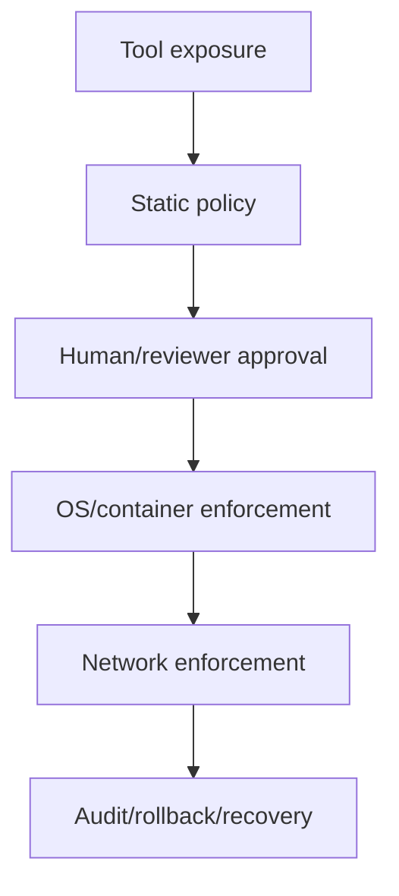

# 25｜沙箱与权限对比：先比较威胁模型，再比较功能

> Codex 源码基线：`upstream/main@283bc4cf011047314b4804c0f1ccd06e4f6a95c5`（2026-06-24）。
>
> 外部资料复核：2026-06-25，仅采用各项目官方文档或官方仓库。

安全比较不能只问“有没有确认框”。至少要区分：

1. 模型是否能提出动作；
2. 用户或策略是否授权；
3. OS 是否强制限制资源；
4. 网络是否可逐目标治理；
5. 失败后是否可恢复和审计。

## 1. 五层模型

一个产品可能在某层很强，在另一层刻意依赖用户、容器或 Git。只有结合实际威胁模型，这些取舍才有意义。

## 2. Codex 的分层

| 层 | 当前实现 |
| --- | --- |
| 工具暴露 | Direct / Deferred / Hidden，feature 与环境规划 |
| 静态策略 | execpolicy、危险命令 heuristic、managed requirements |
| 审批 | approval policy、session cache、additional permissions、Guardian |
| 文件/进程 | Seatbelt、bwrap/seccomp、Windows token/ACL |
| 网络 | network policy、proxy、late approval、WFP/Firewall |
| 恢复/审计 | rollout、AppliedPatchDelta、tool events、telemetry |

Codex 的特点不是单项机制独有，而是把这些层串进统一 Tool runtime。

## 3. Claude Code

官方安全文档说明其默认采用严格只读权限，需要编辑或执行时请求授权；部分只读命令可免提示。它还提供：

- permission modes；
-用户/项目/managed settings；
- PreToolUse、PermissionRequest 等 Hooks；
-可配置 sandbox/network settings；
- dev container 隔离方案；
- subagent 独立 tool/permission mode；
- bypass/skip 类高风险模式。

Claude Code 的强项是权限与 Hook 可编排性。Hook 可以在动作前做组织特定判断，但 Hook 脚本本身也成为安全关键代码。

## 4. OpenCode

OpenCode 的 permission 规则支持按工具和命令 pattern 设置：

- allow；
- ask；
- deny。

Agent 级规则覆盖全局规则。官方工具文档说明 built-in tools 默认启用，行为由 permissions 调整；计划 Agent 可限制为只读。

其官方文档重点是应用层权限和可配置 Agent。没有与 Codex 三平台原生沙箱同等范围的一手说明，因此不能从“有 deny 规则”推导出“具有相同 OS 强制边界”。

## 5. goose

goose 官方文档明确说明它默认自主运行；Developer extension 可以无需批准执行命令和修改文件。用户可配置：

- permission mode；
- tool permissions；
- `.gooseignore`；
- extension malware check。

goose 的 MCP-first 扩展生态很强，但每个 extension 都扩大能力与供应链面。默认自治适合个人自动化，处理不可信仓库或敏感凭证时应主动收紧权限和运行环境。

## 6. Aider

Aider 的核心安全/恢复边界是：

-显式选择加入 chat 的文件；
-展示 diff；
-自动 Git commit；
- `/undo`；
-对 dirty files 先做独立 commit；
-可控制 shell 建议、lint/test 和自动接受。

官方资料没有宣称与 Codex 等价的本地 OS 沙箱。Aider 更依赖用户对仓库、模型输出和本机环境的信任，并用 Git 提供优秀的文件级恢复。

## 7. Continue

Continue Agent Mode 的 tool policy 为：

- Ask First（默认）；
- Automatic；
- Excluded。

Plan Mode 只暴露只读工具，Agent Mode 暴露全部工具；MCP tool 也进入同一握手。官方文档强调用户确认与工具可见性，没有给出跨平台原生 OS 沙箱的等价承诺。

此外，Continue 官方仓库当前已只读，最终版本为 2.0.0；用于长期企业治理时要把维护状态纳入风险评估。

## 8. 比较矩阵

| 能力 | Codex | Claude Code | OpenCode | goose | Aider | Continue |
| --- | --- | --- | --- | --- | --- | --- |
| 默认人工闸门 | 按 approval/permission profile | 严格只读，写/执行询问 | 工具默认启用，规则可 ask/deny | 默认自治 | 以编辑确认/Git 工作流为主 | Ask First |
| 命令细粒度规则 | Starlark prefix/network rules | permissions + Hooks | pattern rules | tool permissions | 参数与命令选项 | per-tool policy |
| 原生 OS 沙箱证据 | macOS/Linux/Windows | sandbox settings；也推荐 dev container | 本章一手资料未证明同等范围 | 本章一手资料未证明同等范围 | 未宣称 | 未宣称 |
| 网络逐请求治理 | managed proxy、host/method、late approval | network sandbox/config | permission/tool 层 | extension/tool 层 | 无统一治理层 | tool/MCP 层 |
| 自动安全 reviewer | Guardian | Hook/prompt/agent 可编排 | Agent/plugin 可扩展 | extension/recipe 可扩展 | 无对应 runtime | 无对应 runtime |
| 文件回滚 | rollout + patch delta + Git 可并用 | checkpoints/session mechanisms | snapshots | session/tools | Git commit + `/undo` | IDE diff/workspace |

“未证明”不是“确定没有”，而是官方一手资料不足以支持与 Codex 同级别的结论。

## 9. 威胁模型

### 可信个人仓库

重点是效率和可恢复：

- Aider 的 Git commit/undo 很实用；
- goose 自治可减少打断；
- Codex/Claude 可调低审批频率。

### 不可信开源仓库

要防 prompt injection、恶意脚本和依赖安装：

-优先只读探索；
-禁止默认网络；
-隔离凭证；
-写操作前审查；
-不要让仓库内容决定权限规则。

### 企业内部仓库

重点是 managed policy：

-管理员规则不能被项目覆盖；
-网络目标可审计；
- Plugin/MCP 来源受控；
-审批和 Hook 有来源；
-日志不能泄漏代码或 secret。

### CI / 无人值守

没有人点击确认，必须依赖：

-预先定义的最小权限；
-临时凭证；
-容器/VM/OS sandbox；
-网络 allowlist；
-任务超时；
-可丢弃工作区。

简单开启“auto/yes/yolo”不构成 CI 安全方案。

## 10. 常见错误

1. 把 Ask/Deny UI 当作内核隔离。
2. 把容器当作自动安全，不检查 bind mount、socket 和凭证。
3. 允许 `bash`/`python` 宽前缀后认为仍是最小权限。
4. 开启代理环境变量却允许进程直接联网。
5. 把 Plugin/MCP 安装视为无副作用配置。
6. 只看最终 diff，不检查执行过的命令和网络访问。
7. 因为能 Git undo，就忽略已经发生的外部副作用。

## 11. Codex 的代价

Codex 的多层安全带来：

-跨平台实现成本；
-平台兼容故障；
-审批与策略认知成本；
-代理/MITM 运维成本；
-大量测试矩阵；
-“为什么被拒绝”的诊断复杂度。

安全更深不等于所有场景体验更好。对可信小项目，轻量 Git-first 工具可能更合适；对企业、不可信代码和自动化，Codex 的强制层更有价值。

## 12. 外部一手资料

- [Claude Code security](https://docs.anthropic.com/en/docs/claude-code/security)
- [Claude Code Hooks](https://docs.anthropic.com/en/docs/claude-code/hooks)
- [Claude Code development containers](https://docs.anthropic.com/en/docs/claude-code/devcontainer)
- [Claude Agent SDK sandbox settings](https://docs.anthropic.com/en/docs/claude-code/sdk/sdk-typescript)
- [OpenCode permissions](https://opencode.ai/docs/permissions/)
- [OpenCode tools](https://opencode.ai/docs/tools/)
- [OpenCode agents](https://opencode.ai/docs/agents/)
- [goose extensions and access control](https://goose-docs.ai/docs/getting-started/using-extensions/)
- [Aider Git integration](https://aider.chat/docs/git.html)
- [Aider options](https://aider.chat/docs/config/options.html)
- [Continue tool policies](https://docs.continue.dev/ide-extensions/agent/how-to-customize)
- [Continue Agent tool handshake](https://docs.continue.dev/ide-extensions/agent/how-it-works)

最终判断标准不是“哪个产品确认框最多”，而是：

> 在你的威胁模型下，未经信任的模型输出最终由哪一层强制约束；那一层是否能被项目内容、子进程、网络旁路或自动模式绕过？
