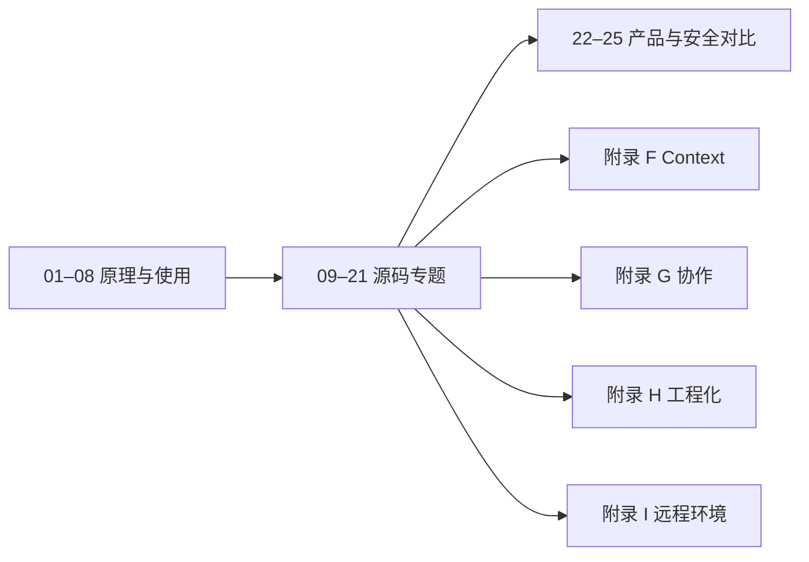

# OpenAI Codex 源码深度研究

这是一份以 OpenAI Codex 当前源码为事实来源的中文研究手册。正文继续沿用原有的“2 篇总纲 + 25 章 + 附录”结构，并逐章直接覆盖更新；不会用另一套并行文档替代旧章节。

## 当前源码基线

| 项目 | 值 |
| --- | --- |
| 上游仓库 | `openai/codex` |
| 分支 | `upstream/main` |
| 提交 | `283bc4cf011047314b4804c0f1ccd06e4f6a95c5` |
| 复核日期 | `2026-06-24` |
| 路径口径 | 文中 `codex-rs/...` 等路径均相对于 Codex 仓库根目录 |

详细的基线、证据等级和更新规则见 [SOURCE-BASELINE.md](SOURCE-BASELINE.md)。

## 正文主线

- [总纲：Codex 技术主线分析](总纲-Codex技术主线分析.md)
- [全网调研：社区认知地图](全网调研-社区认知地图.md)
- [Part I：原理与使用（01–08）](Part%20I%20Principles%20and%20Usage/)
- [Part II：源码专题（09–21）](Part%20II%20Source%20Analysis/)
- [Part III：对比分析（22–25）](Part%20III%20Comparative%20Analysis/)
- [附录 F：Context 预算、压缩与 Reference Context](Appendix/F-Context预算压缩与ReferenceContext.md)
- [附录 G：Multi-Agent、Review、Guardian 与 Goal](Appendix/G-MultiAgentReviewGuardian与Goal.md)
- [附录 H：工程测试、Schema 与可观测性](Appendix/H-工程测试Schema与可观测性.md)
- [附录 I：PathUri、环境注册与远程执行](Appendix/I-PathUri环境注册与远程执行.md)
- [逐章重写覆盖矩阵](Appendix/E-逐章重写覆盖矩阵.md)

每章只有在源码锚点、正文、异常路径和验证命令均完成复核后，才会在覆盖矩阵中标记为“已完成”。

## 补充研究素材

`Current Source Analysis/` 中的 12 篇机制稿是本轮重写的研究素材，不是替代正文的第二套目录。相关结论已经合并回 25 章；原章节无法完整容纳的主题已整理为附录 F–I。

| # | 专题 | 核心问题 |
| --- | --- | --- |
| 01 | [总体架构与演进](Current%20Source%20Analysis/01-architecture-and-evolution.md) | Codex 为什么从 CLI 演进成 agent runtime workspace？ |
| 02 | [Agent 主循环](Current%20Source%20Analysis/02-agent-loop.md) | 一次用户请求如何变成模型采样、工具调用和最终回复？ |
| 03 | [Context 构建与压缩](Current%20Source%20Analysis/03-context-and-compaction.md) | 模型看到了什么，长上下文如何计数、压缩与恢复？ |
| 04 | [Tool System](Current%20Source%20Analysis/04-tool-system.md) | 内建、MCP、动态和协作工具如何统一规划与调度？ |
| 05 | [Shell、Patch 与执行环境](Current%20Source%20Analysis/05-shell-patch-exec-env.md) | 命令与补丁如何跨本地/远程环境安全执行？ |
| 06 | [Sandbox、Permission 与安全策略](Current%20Source%20Analysis/06-sandbox-permission-security.md) | 审批、沙箱、exec policy、网络策略分别控制什么？ |
| 07 | [App Server 与协议](Current%20Source%20Analysis/07-app-server-protocol.md) | Codex 如何为 IDE、桌面端和 SDK 提供有状态协议？ |
| 08 | [TUI 与用户交互](Current%20Source%20Analysis/08-tui-user-experience.md) | 终端如何投影 streaming、审批、diff 与后台状态？ |
| 09 | [MCP、Skills、Plugins、Connectors](Current%20Source%20Analysis/09-mcp-skills-plugins-connectors.md) | 外部能力如何发现、过滤、安装并按需暴露给模型？ |
| 10 | [Thread Store、Rollout 与恢复](Current%20Source%20Analysis/10-thread-store-rollout-recovery.md) | 会话如何持久化、重建、恢复、分叉与回滚？ |
| 11 | [Multi-Agent、Review、Guardian、Goal](Current%20Source%20Analysis/11-multi-agent-review-guardian-goal.md) | 子 agent、审查、安全代理和长目标如何协作？ |
| 12 | [工程化、测试与可观测性](Current%20Source%20Analysis/12-engineering-testing-observability.md) | 生产级 agent 如何建立可重复的证据链？ |

## 推荐阅读顺序



- 想先理解主链路：01 → 02 → 06 → 07 → 09。
- 想研究执行安全：10 → 11 → 12 → 15 → 25。
- 想做客户端或 IDE 集成：02 → 19 → 21 → 22。
- 想理解扩展与协作：07 → 16 → 17 → 18 → 附录 G。
- 想参与 Codex 开发：最后读附录 H，并按仓库 `AGENTS.md` 运行验证。

## 写作原则

1. 当前 checkout 的源码、测试和生成 schema 是最高优先级证据。
2. 使用稳定的文件与符号锚点，避免把易漂移行号写成长期契约。
3. 当前行为、历史行为和设计推断必须分开表述。
4. 所有进入模型上下文的机制都要说明边界与硬上限。
5. 协议、配置、CLI 和 rollout 恢复属于 breaking-change 高风险面。
6. 重要算法必须给出状态变量、异常路径和验证命令。

## 校验

```bash
# 在本仓库根目录运行
npm install
npm run validate:mermaid

# 在 Codex 源码根目录核对新版引用的路径
find codex-rs -type f | sort
rg -n "run_turn|context_window_token_status|build_mcp_tool_exposure|thread/items/list" codex-rs
```

## 许可

研究内容采用 [CC BY-SA 4.0](LICENSE)。被分析的 OpenAI Codex 源码版权归其权利人所有。
