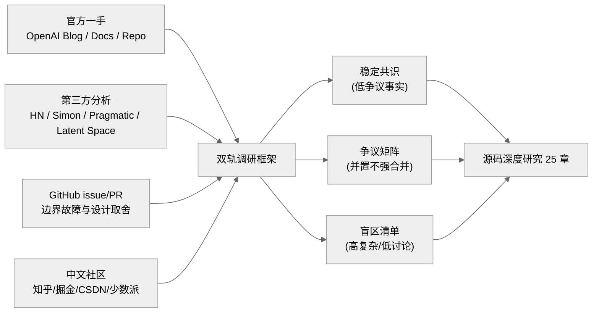

# 全网调研 — Codex 社区认知地图

## 引言

这份文档是《OpenAI Codex 源码深度研究》后续 25 章的"外部认知基线"。它不替代源码分析，而是先回答一个前置问题：**社区已经形成了哪些稳定认知、哪些分歧、又有哪些长期被忽略的高复杂度区域**。如果不先做这一步，后续写作容易陷入"只看源码、不看生态"的信息茧房；反过来，如果只看舆论、不看实现，又会被二手叙事牵着走。因此本文采用"双轨框架"：一轨记录官方一手公开信息（OpenAI 博客、开发者文档、仓库 issue/PR），一轨记录第三方分析与社区讨论（HN、博客、媒体、中文社区），并在冲突处显式保留分歧，不强行合并为单一结论。凡涉及"动机推断"而非"代码可证据事实"的部分，统一使用审慎措辞（如"可能 / 或许 / 不排除"）。

为方便对照，本研究使用的源码基线位于 `/Users/hexiaonan/workspace/formless/refer/codex`，其中 Rust 主仓 `codex-rs/` 当前包含约 87 个子 crate（按 `find codex-rs -maxdepth 2 -name Cargo.toml | wc -l` 实测为 88，含工作区根），约 2,008 个 `.rs` 文件、约 91 万行代码（`find codex-rs -name "*.rs" -not -path "*/target/*" | xargs wc -l`）。这一规模是本调研所有"社区共识 vs 源码现实"对照的物理基础。

---

## 一、文章索引表

> 说明：以下按主题分块。`作者/媒体` 列中已标注 `[官方一手]` 与 `[第三方]`。  
> 检索覆盖了中文社区（知乎、少数派、CSDN、掘金、InfoQ、阿里云开发者社区、华为云开发者社区等）与英文社区（OpenAI 官方、HN、技术博客、GitHub 讨论、播客等）。其中部分中文平台对 Codex 深度机制讨论较少，以安装/上手类内容居多——这是观察样本，不是价值判断。

### 1) 架构总览

| 主题 | 标题 | 作者/媒体 | 链接 | 核心观点 |
|---|---|---|---|---|
| 架构总览 | Introducing Codex | OpenAI [官方一手] | https://openai.com/index/introducing-codex/ | 把 Codex（云）描述为并行任务的云端工程代理，强调隔离沙箱与可验证执行证据。 |
| 架构总览 | Codex CLI | OpenAI Developers [官方一手] | https://developers.openai.com/codex/cli | 给出 CLI 的定位：本地运行、Rust 实现、含审批与沙箱策略。 |
| 架构总览 | openai/codex | GitHub 仓库 [官方一手] | https://github.com/openai/codex | 开源仓库给出"本地终端代理"定位，并持续承载 issue/PR 讨论。 |
| 架构总览 | openai/codex（首发观察） | Simon Willison [第三方] | https://simonwillison.net/2025/Apr/16/openai-codex/ | 首波社区将其类比为"OpenAI 版 Claude Code"，关注提示词与沙箱实现。 |
| 架构总览 | How I think about Codex | Simon Willison（转 Gabriel Chua 观点）[第三方] | https://simonwillison.net/2026/Feb/22/how-i-think-about-codex/ | 提出 "Model + Harness + Surfaces" 认知框架，对后续社区术语影响较大。 |
| 架构总览 | OpenAI Codex CLI：为什么用 Rust 重构？ | 火山引擎开发者社区 [第三方] | https://developer.volcengine.com/articles/7606557839506538506 | 中文技术圈对"Rust 化 = 性能 / 分发 / 安全"叙事的代表性文本。 |
| 架构总览 | Codex CLI 改採 Rust 原生重寫 | iThome [第三方] | https://www.ithome.com.tw/news/169341 | 聚焦"去 Node 依赖、跨平台分发、资源效率"。 |

### 2) 沙箱与权限

| 主题 | 标题 | 作者/媒体 | 链接 | 核心观点 |
|---|---|---|---|---|
| 沙箱与权限 | Windows | OpenAI Developers [官方一手] | https://developers.openai.com/codex/windows | 将 Windows 模式分为 elevated/unelevated，强调权限与网络边界。 |
| 沙箱与权限 | Windows workspace-write sandbox can change project ownership... | GitHub Issue #17179 [官方一手] | https://github.com/openai/codex/issues/17179 | 暴露 Windows ACL/owner 变更导致持续写失败的边界案例。 |
| 沙箱与权限 | `elevated_windows_sandbox` causing commands fail | GitHub Issue #10090 [官方一手] | https://github.com/openai/codex/issues/10090 | 反映 elevated 模式与系统环境（PowerShell 分发渠道等）的兼容问题。 |
| 沙箱与权限 | Windows Desktop sandbox fails... | GitHub Issue #22428 [官方一手] | https://github.com/openai/codex/issues/22428 | 显示 Git 引用写入、子进程 spawn 在沙箱中仍有细粒度失败情形。 |
| 沙箱与权限 | OpenAI Codex CLI: Lightweight coding agent...（讨论串） | Hacker News [第三方] | https://news.ycombinator.com/item?id=43708025 | 用户集中讨论"默认安全边界"与"可用性损失"之间的现实权衡。 |

### 3) 工具系统（Shell / apply_patch / 审批 / review）

| 主题 | 标题 | 作者/媒体 | 链接 | 核心观点 |
|---|---|---|---|---|
| 工具系统 | Unrolling the Codex agent loop | OpenAI [官方一手] | https://openai.com/index/unrolling-the-codex-agent-loop/ | 详细解释工具调用循环、上下文增长、缓存命中与 compact 机制。 |
| 工具系统 | Features – Codex CLI | OpenAI Developers [官方一手] | https://developers.openai.com/codex/cli/features | 给出 review、exec、cloud tasks、subagents 等能力面。 |
| 工具系统 | Has anyone seriously used codex cli? | Hacker News [第三方] | https://news.ycombinator.com/item?id=46738288 | 体验层面强调"高性能与低资源占用"，也指出 hooks 等缺口。 |
| 工具系统 | OpenAI Codex Cli（中文转载/实践） | 博客园 [第三方] | https://www.cnblogs.com/sddai/p/18830867 | 中文社区多从"权限模式 + 沙箱使用"角度消费该工具体系。 |

### 4) Plugin 与 MCP

| 主题 | 标题 | 作者/媒体 | 链接 | 核心观点 |
|---|---|---|---|---|
| Plugin 与 MCP | Model Context Protocol | OpenAI Developers [官方一手] | https://developers.openai.com/codex/mcp | 官方给出 stdio/streamable-http、OAuth、工具审批等配置基线。 |
| Plugin 与 MCP | Add MCP support | GitHub Issue #5 [官方一手] | https://github.com/openai/codex/issues/5 | 早期高热诉求：被许多用户视为"与同类对标的基础能力"。 |
| Plugin 与 MCP | Feature request: Support for plugin marketplaces | GitHub Issue #8925 [官方一手] | https://github.com/openai/codex/issues/8925 | 社区提出"插件市场"以对齐 Claude Code 生态分发体验。 |
| Plugin 与 MCP | Plugin cache refresh ignores marketplaces... | GitHub Issue #23902 [官方一手] | https://github.com/openai/codex/issues/23902 | 指向插件市场发现/刷新路径不一致造成的"可见但难复用"问题。 |
| Plugin 与 MCP | Codex auto-mirrors Claude Code marketplaces... | GitHub Issue #19372 [官方一手] | https://github.com/openai/codex/issues/19372 | 暴露跨生态自动镜像策略可能带来的兼容性副作用。 |
| Plugin 与 MCP | Codex desktop plugin marketplace unreachable... | GitHub Issue #16808 [官方一手] | https://github.com/openai/codex/issues/16808 | 桌面端 marketplace 拉取链路受挑战页影响，生态发现流程受阻。 |
| Plugin 与 MCP | awesome-codex-cli | GitHub 社区整理 [第三方] | https://github.com/RoggeOhta/awesome-codex-cli | 反映"周边生态已经形成但相对碎片化"的社区现实。 |

### 5) Prompt 与模型（Harness 配置、压缩、推理保留）

| 主题 | 标题 | 作者/媒体 | 链接 | 核心观点 |
|---|---|---|---|---|
| Prompt 与模型 | Unrolling the Codex agent loop | OpenAI [官方一手] | https://openai.com/index/unrolling-the-codex-agent-loop/ | 官方较系统地公开 prompt item 组装、缓存策略、compact API 的工程细节。 |
| Prompt 与模型 | Unrolling...（讨论） | Hacker News [第三方] | https://news.ycombinator.com/item?id=46737630 | 社区围绕 reasoning 是否跨 user turn 保留产生讨论。 |
| Prompt 与模型 | Compaction death spiral | GitHub Issue #13279 [官方一手] | https://github.com/openai/codex/issues/13279 | 复现实战中 compact 后重复读仓"死亡循环"问题。 |
| Prompt 与模型 | Compaction error | GitHub Issue #14913 [官方一手] | https://github.com/openai/codex/issues/14913 | 报告 remote compact 流断连，提示长会话稳态尚不充分。 |
| Prompt 与模型 | Remote compaction times out | GitHub Issue #18829 [官方一手] | https://github.com/openai/codex/issues/18829 | 指向高上下文场景下 compact 超时与会话续跑受损。 |
| Prompt 与模型 | CLI remote compaction repeatedly fails... | GitHub Issue #22335 [官方一手] | https://github.com/openai/codex/issues/22335 | 体现 compaction 失败后"任务连续性丢失"这一用户痛点。 |

### 6) 商业策略与产品路线

| 主题 | 标题 | 作者/媒体 | 链接 | 核心观点 |
|---|---|---|---|---|
| 商业策略 | Introducing Codex | OpenAI [官方一手] | https://openai.com/index/introducing-codex/ | 把"本地配对（CLI）+ 云端委派（Codex in ChatGPT）"明确为双模路线。 |
| 商业策略 | Codex in ChatGPT 入口说明 | OpenAI Help（由官方文档引用）[官方一手] | https://help.openai.com/en/articles/11369540-codex-in-chatgpt | 订阅计划绑定、额度与入口策略直接影响社区采用门槛。 |
| 商业策略 | How Codex is built（付费深访） | The Pragmatic Engineer [第三方] | https://newsletter.pragmaticengineer.com/p/how-codex-is-built | 给出"内部高频使用 + 组织流程变化"的产品化信号。 |
| 商业策略 | GPT5-Codex-Max 训练与信任 | Latent Space [第三方] | https://www.latent.space/p/gpt5-codex-max-training-agents-with | 讨论"模型能力之外，persona/工具偏好/信任设计"如何影响采用。 |

### 7) 性能与稳定性

| 主题 | 标题 | 作者/媒体 | 链接 | 核心观点 |
|---|---|---|---|---|
| 性能与稳定性 | Codex CLI is going native | Hacker News [第三方] | https://news.ycombinator.com/item?id=44150093 | 社区核心讨论：Rust 重写收益究竟更多来自性能还是部署运维。 |
| 性能与稳定性 | We (Codex) shipped a pretty large CLI update... | Hacker News [第三方] | https://news.ycombinator.com/item?id=44833858 | 官方成员与社区交互显示版本迭代较快，但体验一致性仍在打磨。 |
| 性能与稳定性 | Codex CLI freezes near auto-compaction threshold... | GitHub Issue #19116 [官方一手] | https://github.com/openai/codex/issues/19116 | 高上下文下冻结与"旧任务漂移"并发出现，提示状态管理较复杂。 |

### 8) Bug 与吐槽（体验层）

| 主题 | 标题 | 作者/媒体 | 链接 | 核心观点 |
|---|---|---|---|---|
| Bug 与吐槽 | OpenAI Codex CLI: Lightweight coding agent... | Hacker News [第三方] | https://news.ycombinator.com/item?id=43708025 | 与 Claude Code 对比下，用户集中讨论上下文管理与质量波动。 |
| Bug 与吐槽 | Codex Reconnecting 排查（中文） | 知乎 [第三方] | https://zhuanlan.zhihu.com/p/2038317397019505265 | 中文用户更关注网络、登录、版本兼容等"可用性运维问题"。 |
| Bug 与吐槽 | 移动端 SSH + CLI Coding Agent 实践 | 少数派 [第三方] | https://sspai.com/post/105621 | 真实场景反馈：通知、断连恢复、审批策略比"模型分数"更影响体验。 |

---

## 二、争议观点矩阵

> 目标不是"判胜负"，而是标注哪些争议会影响后续章节叙事。  
> 下面每个争议点均给出对立叙事与证据入口，并显式标注"事实成分"与"推断成分"。

| 争议点 | 观点 A | 观点 B | 代表来源 | 研究备注 |
|---|---|---|---|---|
| Rust 重写动机 | 主要面向性能、安全、零依赖安装等可观测工程目标 | 不排除还包含生态控制、组织文化与长期平台化考量 | OpenAI 工程说明与 HN 讨论并存：https://news.ycombinator.com/item?id=44150093 | "性能"是可验证目标；"策略动机"属推断，写作时建议保留审慎措辞。 |
| App-Server 设计初衷 | 为了复用 harness、支撑 IDE/桌面/Web 统一协议 | 也可能是为未来多端产品化/生态控制提前铺路 | 官方文：https://openai.com/index/unlocking-the-codex-harness/ | 官方叙事聚焦复用与稳定 API；社区推断"平台化"难以直接证伪，亦难充分证实。 |
| Plugin 市场价值 | 可形成生态网络效应，降低团队复用成本 | 可能造成平台锁定与配置复杂度上升 | #8925、#23902、#19372、#16808 | 现实是"有需求且尚不稳定"：市场能力成熟前，锁定与碎片可能并存。 |
| MCP 是"标准能力"还是"可选增强" | 部分社区将其视为"现代代理的基础预期能力" | MCP 过强也会扩大攻击面与稳定性负担 | #5 与 MCP 官方文档 | 早期社区把 MCP 当作较高优先级特性；后续 issue 显示"接入 ≠ 稳定可用"。 |
| Sandbox 默认策略 | 默认应更严格，先保安全 | 默认过严会显著拖慢生产流，逼用户绕过 | Developers Windows + HN + Windows issue | 安全/效率张力长期存在，后续章节需把"默认策略"和"团队落地策略"分开讨论。 |
| Codex vs Claude Code 本质差异 | 部分用户认为 Codex 在 terminal 工作流、资源效率上更顺手 | 部分用户认为 Claude 在复杂重构与交互连续性上更稳 | HN 线程 + 各类第三方对比文 | 这类比较高度依赖任务类型、模型档位与 harness，单一 benchmark 难下定论。 |
| Compaction 机制评价 | API 级 compact 在工程上有必要性，可延长会话寿命 | compact 失败可能造成任务漂移/循环，影响用户体验 | 官方 agent loop 文 + #13279/#14913/#22335 | 后续写作应把"设计正确性"和"故障后恢复机制"拆开分析。 |
| 开源价值边界 | 开源 harness 带来可审计性与可二次开发空间 | 真正壁垒仍可能在模型与托管能力，开源不等于可替代 | Simon、Pragmatic、HN | 社区对"开源是否足够"分歧较大；建议在对比章节给出能力分层图。 |

---

## 三、高频启示（社区共识）

> 以下 10 条是跨官方与社区高频重复、且可追溯的"低争议事实判断"。

1. **Codex（2025+）与 2021 年旧 Codex 模型不是同一产品范式。**  
   来源：OpenAI 官方发布说明 + Simon 早期澄清。  
   https://openai.com/index/introducing-codex/  
   https://simonwillison.net/2025/Apr/16/openai-codex/

2. **Codex 产品线是多表面（CLI / IDE / Web / App），不是单一 CLI 工具。**  
   来源：OpenAI 官方。  
   https://openai.com/index/unlocking-the-codex-harness/

3. **Codex CLI 的维护重心已转向 Rust 实现。**  
   来源：官方开发者文档/仓库说明、社区跟踪。  
   https://developers.openai.com/codex/cli  
   https://news.ycombinator.com/item?id=44150093

4. **MCP 已成为相当一部分开发者对"现代编码代理"的常见预期能力。**  
   来源：Issue #5 高互动诉求 + 官方 MCP 文档。  
   https://github.com/openai/codex/issues/5  
   https://developers.openai.com/codex/mcp

5. **Codex 的 agent loop 核心是"模型推理 ↔ 工具调用"的多轮闭环，而非一次性问答。**  
   来源：官方工程博客。  
   https://openai.com/index/unrolling-the-codex-agent-loop/

6. **上下文压缩（compaction）是工程上较为必要的机制，但长会话稳定性仍是持续痛点。**  
   来源：官方说明 + 多个 compaction 问题单。  
   https://openai.com/index/unrolling-the-codex-agent-loop/  
   https://github.com/openai/codex/issues/13279  
   https://github.com/openai/codex/issues/22335

7. **Windows 沙箱是 Codex 落地企业场景的关键难点，而非简单"平台适配"。**  
   来源：官方 Windows 文档 + 高质量 issue。  
   https://developers.openai.com/codex/windows  
   https://github.com/openai/codex/issues/17179

8. **AGENTS.md 已成为 Codex 生态中常用的操作接口（任务约束、测试命令、仓库约定）。**  
   来源：官方发布与工程文章。  
   https://openai.com/index/introducing-codex/  
   https://openai.com/index/unrolling-the-codex-agent-loop/

9. **社区比较"模型能力"时，越来越强调 harness 与 workflow 设计的同等重要性。**  
   来源：HN、Simon、Latent Space。  
   https://news.ycombinator.com/item?id=46738288  
   https://simonwillison.net/2026/Feb/22/how-i-think-about-codex/  
   https://www.latent.space/p/gpt5-codex-max-training-agents-with

10. **中文社区当前以"安装接入/排障经验"为主，深度机制拆解相对少于英文社区与 GitHub 讨论。**  
    来源：CSDN/掘金/少数派/知乎样本对比。  
    https://blog.csdn.net/qq_31095905/article/details/147887930  
    https://juejin.cn/post/7613658235174387727  
    https://sspai.com/post/105621  
    https://zhuanlan.zhihu.com/p/2038317397019505265

---

## 四、盲区分析

> 标准：同时满足"源码侧复杂度高"+"社区系统讨论稀缺"+"对工程实践影响大"。  
> 下表给出 10 个盲区，并映射到本研究章节计划。

| 盲区主题 | 源码复杂度证据（宏观） | 社区盲区证据（检索观察） | 计划覆盖章节 |
|---|---|---|---|
| 1. Code Mode 的 V8 进程内嵌入与生命周期治理 | `code-mode` 由外部 Node runner 转为 Rust 内嵌 V8，涉及线程模型、模块装载、终止语义、基准回归（见 PR #15276） | 社区多停留在"更快了"，较少讨论 runtime 隔离与 helper 注入机制 | `ch22`（TUI 渲染管线与 Code Mode V8） |
| 2. Windows 沙箱的 token + SID + ACL + WFP 组合策略 | Windows 方案存在 elevated/unelevated 双轨、用户身份切换、ACL 刷新、网络策略协同 | 讨论多聚焦"能不能跑通"，对策略组合与失效模式缺少系统图谱 | `ch13`（Windows 沙箱与 WFP 防火墙） |
| 3. remote compaction 的失败恢复与线程连续性 | compact 不是单点功能，而是会话状态机关键路径；失败会波及 resume 连续性 | 社区有大量报错帖，但较少从"恢复语义"层面做架构讨论 | `ch19`（会话与轨迹持久化）+ `ch06`（Agent 核心循环） |
| 4. App-Server 的双向 JSON-RPC 事件语义边界 | item/turn/thread 三层原语 + server-initiated approval + 多传输层细节 | 多数内容只说"有 app-server"，较少做协议生命周期拆解 | `ch21`（App-Server JSON-RPC 协议层） |
| 5. Plugin Marketplace 的发现/缓存/升级一致性 | 市场根路径发现、缓存刷新、跨生态镜像、桌面拉取链路均有真实缺陷案例 | 社区对插件更多是"有没有"，而不是"一致性与可信发布链" | `ch17`（Plugin 市场系统） |
| 6. MCP 工具审批策略与插件策略的叠加关系 | MCP 支持 server-level 与 tool-level approval，且可与插件配置叠加 | 公开讨论多在接入教程层，较少做策略冲突与优先级解析 | `ch18`（MCP 双向集成） |
| 7. rollout-trace / 语义化调试资产的工程价值 | 官方与仓库显示存在可追踪事件体系，但社区较少讨论"可观测性产品化" | 英文社区偶有提及日志/回放，中文几乎空白 | `ch19`（会话与轨迹持久化） |
| 8. network-proxy 与"可联网能力"切换边界 | Codex 存在本地沙箱、云任务、审批网络访问等多模式组合 | 社区讨论常把"联网开/关"简化为开关，忽略路径与策略差异 | `ch15`（网络代理与策略） + `ch25`（权限模型对比） |
| 9. execpolicy（Starlark）在企业治理中的可验证性 | 规则表达能力决定"可自动化到什么程度"与"误杀率" | 社区较少给出真实策略样本，讨论容易停留在概念层 | `ch14`（执行策略 Starlark execpolicy） |
| 10. 多入口一致性：CLI / IDE / App / Cloud 的行为等价性 | 同一 harness 在不同 surface 运行，存在行为漂移风险 | 社区经常比较体验，但缺少系统性"等价性测试框架"讨论 | `ch02`（多入口与启动分发）+ `ch23`（Cloud Tasks 与外部 Agent 迁移） |

### 盲区小结

社区当前的高热议题主要集中在"模型强不强、速度快不快、能不能接 MCP"。但从源码研究价值看，相对更能体现 Codex 工程取舍的，往往是那些"低可见、高复杂、跨模块耦合"的基础能力：**状态一致性、策略可证明性、协议稳定性、失败恢复能力**。这也是后续 25 章需要重点补位的方向。这里使用"相对能体现"而非"决定性护城河"——长期壁垒最终仍取决于模型能力、产品分发、生态网络效应等多因素，源码工程只是其中一维。

### 源码落点核对表（抽样验证）

> 目的：把上表 10 个盲区落到可打开、可计行的真实源码点，便于后续章节直接钻入。  
> 所有路径以 `/Users/hexiaonan/workspace/formless/refer/codex/` 为根；行数以本调研编写时 `wc -l` 实测为准（受 commit 变化影响后续可能漂移）。

| # | 盲区 | 主要落点（文件 : 行数） | 备注 |
|---|---|---|---|
| 1 | Code Mode 内嵌 V8 | `codex-rs/code-mode/src/service.rs`（1521 行）, `codex-rs/code-mode/src/runtime/mod.rs`（575 行）, `codex-rs/code-mode/src/description.rs`（1098 行） | runtime 目录另有 `callbacks.rs / globals.rs / module_loader.rs / timers.rs / value.rs`，对应 V8 注入面 |
| 2 | Windows 沙箱组合策略 | `codex-rs/windows-sandbox-rs/src/lib.rs`（731 行），同目录含 `acl.rs / allow.rs / audit.rs / cap.rs / deny_read_acl.rs / dpapi.rs / elevated_impl.rs / helper_materialization.rs / identity.rs / hide_users.rs / path_normalization.rs / conpty/` 等 | 文件划分本身即"组合策略"的图谱 |
| 3 | Remote Compaction | `codex-rs/core/src/compact.rs`（585 行）, `codex-rs/core/src/compact_remote.rs`（385 行）, `codex-rs/core/src/compact_remote_v2.rs`（775 行）, `codex-rs/core/src/state/auto_compact_window.rs`, `codex-rs/core/src/tasks/compact.rs`（60 行） | v1 → v2 的并存说明该路径仍在演进，issue #13279/#14913/#22335 对应这段代码 |
| 4 | App-Server JSON-RPC | `codex-rs/app-server-protocol/src/lib.rs`（49 行入口）, `codex-rs/app-server-protocol/src/protocol/`（含 `v1.rs / v2/ / mod.rs / event_mapping.rs / item_builders.rs / mappers.rs / thread_history.rs / common.rs`） | 协议代码集中在 `protocol/` 子目录而非顶层 `lib.rs` |
| 5 | Plugin Marketplace | `codex-rs/core-plugins/src/lib.rs`（61 行入口）, `codex-rs/core-plugins/src/marketplace.rs`, `codex-rs/core-plugins/src/installed_marketplaces.rs`, `codex-rs/core-plugins/src/loader.rs`, `codex-rs/core-plugins/src/manager.rs`, `codex-rs/core-plugins/src/manifest.rs` | `marketplace_add/` 子目录另有专门逻辑，issue #23902/#19372/#16808 与此模块相关 |
| 6 | MCP 工具审批 | `codex-rs/codex-mcp/src/lib.rs`（62 行入口），实际逻辑在同目录 `server.rs / runtime.rs / connection_manager.rs / rmcp_client.rs / auth_elicitation.rs / elicitation.rs / codex_apps.rs / mcp/` 中 | 与 `core-plugins` 的策略叠加值得专门一节 |
| 7 | Rollout / 可观测性 | `codex-rs/core/src/rollout.rs`（62 行入口）, `codex-rs/core/src/session/rollout_reconstruction.rs`, `codex-rs/core/src/session/session.rs`, `codex-rs/core/src/session_rollout_init_error.rs`, `codex-rs/core/src/session_startup_prewarm.rs` | 多个 `session_*` 文件分担不同生命周期阶段 |
| 8 | Network Proxy | `codex-rs/network-proxy/src/lib.rs`（69 行入口）, `codex-rs/responses-api-proxy/`, `codex-rs/linux-sandbox/src/proxy_routing.rs` | 三处协同决定"联网开/关"实际行为 |
| 9 | execpolicy (Starlark) | `codex-rs/execpolicy/src/lib.rs`（30 行入口）, 同目录 `policy.rs / rule.rs / parser.rs / decision.rs / amend.rs / execpolicycheck.rs / executable_name.rs / error.rs`；整个 crate 约 2,753 行（`find … -name "*.rs" -exec wc -l` 实测） | 含 `examples/ + tests/`，是少数自带规则样本的 crate |
| 10 | 多入口一致性 | 顶层 crate 入口：`codex-rs/cli/`、`codex-rs/app-server/`、`codex-rs/chatgpt/`、`codex-rs/cloud-tasks/`、`codex-rs/tui/`；共享 harness 主要落在 `codex-rs/core/` | `codex-rs/cli/tests/` 已有 `features.rs / marketplace_*.rs / mcp_*.rs / plugin_cli.rs / exec_server.rs` 等等价性场景测试 |

需要提醒的是：上述行数是写作时的快照，社区拉取最新主干时数值会变动；判断是否仍属"高复杂"看的是模块切分与依赖图，而不是单文件长短。

---

## 五、写作建议（面向后续 25 章）

1. **先纠偏术语，再展开细节。**  
   开篇统一 "Model / Harness / Surface / Tool / Skill / MCP / Plugin" 的层级，否则后文对比会失真。

2. **把"可验证事实"与"动机推断"分栏书写。**  
   例如 Rust 重写、App-Server 演进可以有多重动机；没有一手证据时，建议使用"可能/或许/不排除"。

3. **每章尽量保持"官方一手证据 + 社区体感证据"双引用。**  
   只写官方容易显得理想化；只写社区容易陷入样本偏差。二者并置更稳健。

4. **将"能力存在"与"能力可用"明确区分。**  
   MCP/Plugin/Windows sandbox 在文档层"存在"，不等于在所有环境"稳定可用"；建议专设"可用性注记"段落。

5. **把 issue 作为一等研究材料，而不是附录噪声。**  
   Codex 的关键演化信息有相当一部分存在于 issue/PR 时间线，尤其是边界故障与设计取舍。

6. **优先讲"失败路径"而不是"成功路径"。**  
   工程读者更关心 compact 失败怎么恢复、sandbox 误杀怎么降级、marketplace 不一致怎么诊断。

7. **对 benchmark 叙事保持克制。**  
   涉及 SWE-bench、Terminal-bench、第三方盲测时，要注明测试对象、版本、harness 差异，不做跨基线硬比较。

8. **在对比章节采用"任务类型矩阵"，避免"谁更强"空泛结论。**  
   按任务分：重构、排障、脚本化、CI 审查、长会话维护，再比较各工具表现。

9. **把"配置系统"提前到前半本。**  
   很多误解并非模型问题，而是 `config.toml`、审批模式、sandbox、provider 路由导致的行为差异。

10. **将"协议化"作为 Codex 的一条潜在长期主线来观察。**  
    App-Server 与 MCP 并行存在，可能说明 OpenAI 在同时探索"产品协议"和"行业协议"的协同；这一判断是趋势性观察，仍属推断范畴。

11. **为中文读者补一层"生态现实检查"。**  
    中文社区教程相对丰富但深度机制稀缺，建议每章末尾提供"常见误区 + 可复现实验"。

12. **结论章节避免"终局论"。**  
    该赛道迭代较快，建议输出"阶段性判断 + 可证伪假设"，而不是一次性定论。

---

## 六、七维框架视角下的总览

后续 25 章每章会按"本质 / 痛点 / 思路 / 实现 / 易错 / 对比 / 缺陷"七维展开。作为开篇调研章，本章并不分析某一模块，而是把"全网调研"这件事本身放进七维框架里，给后续写作定一个调研学层面的基线。

- **本质**：本章解决的不是"Codex 是什么"，而是"在开始读源码前，社区已经替我们走过哪些路、踩过哪些坑"。它是研究的"先验校准层"，把官方叙事、第三方分析、issue 噪声、中文样本压缩进一张可被后续章节调用的认知地图。

- **痛点**：如果跳过这一步，常见后果是——把官方博客观点当全景、把单一 HN 高赞当多数派、把"中文教程不深入"误读为"中文社区没价值"。这些样本偏差会让源码解读不自觉地服务于既有叙事，而不是被源码本身校准。

- **思路**：采用双轨调研（官方一手 + 第三方分析）+ 显式分歧矩阵 + 盲区清单的三层结构。证据来源即出处可达，争议处不强行合并，盲区处先承认"我们也不知道社区怎么看"，再到源码里找答案。

- **实现**：本章在文章索引表里按 8 个主题分块、合计列出约 30 条来源；在争议矩阵里整理 8 组对立叙事并标注事实/推断成分；在共识清单里给出 10 条低争议事实；在盲区清单里给出 10 个高复杂区，并通过"源码落点核对表"把每个盲区落到具体的 `codex-rs/` 路径与近似行数。

- **易错**：调研类章节常见的误区有三种——（a）把"高曝光"等同于"高重要"，例如反复转载的 Rust 重写新闻并不能代替对 `windows-sandbox-rs` 这种低曝光高复杂区的关注；（b）把日期模糊的链接当作时间序证据，本章因此把所有日期分为"可验证"与"日期未明（访问时可见）"两栏；（c）把"我没搜到"误判为"社区没讨论"，本章统一用"检索观察"措辞，避免把样本规模上的不足表述成结论。

- **对比**：相比常见的"工具测评文"或"模型对比文"，本章刻意不做横向打分，而是把比较的前置条件（任务类型、模型档位、harness 版本、surface 差异）作为后续对比章的输入提交。这也是为什么"Codex vs Claude Code"在争议矩阵里以"用户偏好分布"而非"谁更强"出现。

- **缺陷**：本章自身也有清晰可见的局限——检索时间窗口截至本研究编写时（参见附录日期），社区认知仍在快速漂移；付费内容（如 Pragmatic Engineer 深访）我们只能引用其公开摘要；中文样本对部分小众平台（飞书、即刻、微信公众号长文）覆盖不足；issue 选取偏向已被多次引用的"网红 issue"，长尾 issue 的统计代表性有限。这些都是后续章节在引用本章结论时需要保留怀疑的边界。

---

## 七、调研方法学与样本偏差自陈

为避免把"我看到的"等同于"客观存在的"，本节显式列出本调研在样本与方法上的边界，便于后续章节在引用时打折扣。

1. **来源选择偏差**：英文样本以 HN、Simon Willison、Pragmatic Engineer、Latent Space 为主，这些渠道对"开发者向"与"工程偏好"的过滤较重；面向 PM、合规、采购视角的内容覆盖较少。
2. **时间窗口偏差**：检索集中在 2025-04 至 2026 上半年，更早的 2021 旧 Codex 模型语境被刻意排除，以避免名词混淆；但这也意味着本章无法回答"为什么 OpenAI 选择复用 Codex 这个品牌名"这类历史性问题。
3. **语种偏差**：英文/中文外的语种（日、韩、德、法、俄语社区）几乎未覆盖；考虑到 Codex 的全球分发，这是已知的盲区。
4. **平台权重偏差**：GitHub issue/PR 在本章中被赋予较高权重，因为它直连源码；但 issue 写作群体本身偏向"遇到问题且会写英文 issue 的用户"，故 issue 频次不能直接代表整体用户分布。
5. **版本漂移风险**：source-code 行数、issue 状态、文档段落都会随版本变化；后续章节若直接复用本章数字，建议在引用时附上"调研写作时刻"的说明。
6. **二手叙事递归**：部分中文文章实质转译自 Simon Willison 或 HN 高赞评论，引用时需穿透到原始来源；本章在索引表中已尽量回溯到一手链接，但难以保证 100%。

承认这些边界的目的，是让本章扮演"先验校准层"而不是"权威结论层"——它能告诉后续章节"先别信什么、再去验证什么"，但不替它们做出最终判断。

---

## 附录：参考链接（按发布日期降序）

> 注：无法稳定获取发布日期的条目标注为"日期未明（访问时可见）"，置于列表后段。  
> 同日多条按"官方优先、再第三方"的顺序排列。  
> 部分日期为发布日，部分为最后访问日（issue 类条目通常以创建/最新评论为准）；若需精准追溯，请以链接页面为准。

### A. 2026

- 2026-05-13（官方文档关联窗口）：Windows 配置与模式说明  
  https://developers.openai.com/codex/windows
- 2026-04-22：Issue #17179（Windows ACL/owner 异常）  
  https://github.com/openai/codex/issues/17179
- 2026-04-21：Issue #18829（remote compaction timeout，duplicate）  
  https://github.com/openai/codex/issues/18829
- 2026-04-09：Issue #17179（创建）  
  https://github.com/openai/codex/issues/17179
- 2026-03-20：PR #15276（Code mode on v8）  
  https://github.com/openai/codex/pull/15276
- 2026-03-17：Issue #14913（compaction error）  
  https://github.com/openai/codex/issues/14913
- 2026-03-02：Issue #13279（compaction death spiral）  
  https://github.com/openai/codex/issues/13279
- 2026-02-22：Simon Willison 转述 Codex 概念框架  
  https://simonwillison.net/2026/Feb/22/how-i-think-about-codex/
- 2026-02-17：Pragmatic Engineer 深访 Codex（付费）  
  https://newsletter.pragmaticengineer.com/p/how-codex-is-built
- 2026-02-04：Unlocking the Codex harness（App-Server）  
  https://openai.com/index/unlocking-the-codex-harness/
- 2026-01-23：Unrolling the Codex agent loop  
  https://openai.com/index/unrolling-the-codex-agent-loop/
- 2026-01-08：Issue #8925（plugin marketplace 诉求）  
  https://github.com/openai/codex/issues/8925

### B. 2025

- 2025-12-26：Latent Space（Codex-Max 训练与信任）  
  https://www.latent.space/p/gpt5-codex-max-training-agents-with
- 2025-07-17：Issue #5（MCP 支持）关闭，Rust 线文档落地  
  https://github.com/openai/codex/issues/5
- 2025-06-04：iThome（Codex CLI Rust 重写报道）  
  https://www.ithome.com.tw/news/169341
- 2025-05-16：Introducing Codex（并行云代理首发）  
  https://openai.com/index/introducing-codex/
- 2025-04-16：Issue #5（MCP 诉求启动）  
  https://github.com/openai/codex/issues/5
- 2025-04-16：Simon Willison 首发观察  
  https://simonwillison.net/2025/Apr/16/openai-codex/
- 2025-04（日期见帖）：HN 首发讨论（Codex CLI）  
  https://news.ycombinator.com/item?id=43708025

### C. 日期未明（访问时可见）

#### 官方一手/半官方

- Codex CLI 文档  
  https://developers.openai.com/codex/cli
- Codex CLI Features  
  https://developers.openai.com/codex/cli/features
- MCP 文档  
  https://developers.openai.com/codex/mcp
- App Server 文档  
  https://developers.openai.com/codex/app-server
- 仓库主页  
  https://github.com/openai/codex

#### GitHub 关键问题（官方仓库）

- #10090 elevated sandbox 执行失败  
  https://github.com/openai/codex/issues/10090
- #19116 compaction 阈值冻结与漂移  
  https://github.com/openai/codex/issues/19116
- #19372 自动镜像 Claude marketplace 兼容问题  
  https://github.com/openai/codex/issues/19372
- #23902 marketplace 刷新路径不一致  
  https://github.com/openai/codex/issues/23902
- #16808 desktop marketplace 拉取失败  
  https://github.com/openai/codex/issues/16808
- #22335 remote compact 失败与任务连续性问题  
  https://github.com/openai/codex/issues/22335
- #22428 Windows sandbox setup refresh failed  
  https://github.com/openai/codex/issues/22428

#### 第三方分析/社区讨论

- HN：Codex CLI is going native  
  https://news.ycombinator.com/item?id=44150093
- HN：Unrolling the Codex agent loop  
  https://news.ycombinator.com/item?id=46737630
- HN：近期 Codex CLI 实战反馈  
  https://news.ycombinator.com/item?id=46738288
- InfoQ（Rust 重写）  
  https://www.infoq.cn/article/I4fzvM0XQoWQQYOD6LYT
- InfoQ（App-Server 架构报道）  
  https://www.infoq.cn/article/Ac7pCglOgaK4tEoWg5b7
- 火山引擎开发者社区（Rust 重构综述）  
  https://developer.volcengine.com/articles/7606557839506538506
- CSDN（中文使用说明样本）  
  https://blog.csdn.net/qq_31095905/article/details/147887930
- 掘金（中文实践样本）  
  https://juejin.cn/post/7613658235174387727
- 少数派（移动端/运维实践）  
  https://sspai.com/post/105621
- 知乎（连接问题排查样本）  
  https://zhuanlan.zhihu.com/p/2038317397019505265
- awesome-codex-cli（生态目录）  
  https://github.com/RoggeOhta/awesome-codex-cli
