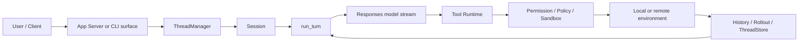

# 总纲｜OpenAI Codex 技术主线分析

> 源码基线：`upstream/main@283bc4cf011047314b4804c0f1ccd06e4f6a95c5`（2026-06-24）。文中源码路径均相对于 `openai/codex` 仓库根目录。

Codex 已不是“带 shell 的聊天 CLI”。当前代码更适合定义为：

> 一个以 Thread/Turn 为状态单位、以 Responses 为模型协议、以 Tool Runtime 为执行平面、以 App Server 为产品边界，并具备跨平台安全与扩展生态的 Agent Runtime。

## 1. 规模与边界

本基线的可复核规模：

| 指标 | 数值 | 命令 |
| --- | ---: | --- |
| Cargo manifests | 129 | `find codex-rs -name Cargo.toml -not -path '*/target/*'` |
| Rust files | 2,363 | `find codex-rs -name '*.rs' -not -path '*/target/*'` |
| Rust LOC | 1,062,602 | 对上述 `.rs` 执行 `wc -l` |

规模本身不代表质量，但说明研究对象已覆盖：

- CLI/TUI/exec；
- App Server、daemon、SDK；
-模型 Provider 与传输；
-工具、MCP、Plugin、Hook；
-本地/远程执行；
-三平台 sandbox；
- thread store、state、memory、goal；
- Cloud Tasks 与迁移。

## 2. 主链路



一次用户回合可以包含多次模型采样和多次工具调用。UI 事件、模型历史和 rollout 是同源事件的不同投影。

## 3. 入口

### Rust multicall CLI

`codex-rs/cli/src/main.rs` 分发 TUI、exec、app-server、mcp-server、cloud、plugin、sandbox、debug 等能力。Arg0 还允许同一 native binary 以 helper 身份启动。

### npm launcher

`codex-cli/bin/codex.js` 负责平台包解析、native binary 定位、环境与信号转发，不承担 Agent 业务。

### TUI 与 exec

当前 TUI 通过 `AppServerClient` 连接 in-process、daemon 或 remote App Server；exec 使用 in-process App Server client。入口逐步收敛到同一 v2 协议。

### SDK

- TypeScript SDK 启动 `codex exec --experimental-json`；
- Python SDK 启动 `codex app-server --listen stdio://`。

二者表明 Codex 同时维护事件式 exec surface 与完整 App Server surface。

## 4. 五个核心层

### Protocol

`codex-protocol` 定义 Core 事件与 operation；`app-server-protocol` 定义外部 v2 产品契约。两者不能混为一层。

### Runtime

`ThreadManager → CodexThread → Session → run_turn` 形成生命周期。Turn 内部包含 pending input、Hook、compaction、sampling 和 tool scheduling。

### Tool

Tool planning 生成 model-visible specs 与 local registry。Direct/Deferred/Hidden 控制曝光，Router/Runtime/Registry 控制调用、并发、取消与治理。

### Execution/Security

执行请求经过：

```text
approval
→ exec/network policy
→ additional permissions
→ platform sandbox
→ local/remote process or filesystem
```

macOS、Linux、Windows 后端不同，但共享 permission profile 语义。

### State

- ThreadStore 定义存储无关线程契约；
- rollout 保存事件；
- `state_5.sqlite` 保存线程查询索引；
- logs/goals/memories 使用独立 SQLite；
- reconstruction 生成当前有效 history。

## 5. Context

Prompt 不是单字符串：

- base instructions；
- initial/reference context；
- context updates；
- conversation history；
- Skill/Plugin injections；
- tool specifications；
- output constraints。

每项必须有界。Stable prefix 与 reference context 减少 cache miss；compaction 生成 replacement history，resume/fork 通过 rollout 重放恢复。

## 6. 扩展生态

| 层 | 作用 |
| --- | --- |
| Skill | 按需加载任务方法 |
| Plugin | 打包 Skills、MCP、Apps、Hooks |
| Connector/App | 外部服务身份与选择 |
| MCP | 工具、资源、elicitation 协议 |
| Hook | 生命周期影响点 |
| Dynamic tool | 运行时添加工具 |

这些能力最终分别进入 context、tool planning、connection manager 和 Hook engine，不能统称为“插件 Prompt”。

## 7. 安全哲学

Codex 采用防御纵深：

1. 模型是否看见工具；
2. 静态 exec/network policy；
3. user/Guardian approval；
4. permission profile；
5. OS sandbox；
6. managed proxy/WFP；
7.事件审计与恢复。

任何一层都不是其他层的替代。尤其“用户点了允许”不代表进程应获得全盘和全网。

## 8. 协作与长期任务

- Multi-Agent：隔离子线程与审批桥；
- Review：代码质量 findings；
- Guardian：危险操作审查；
- Goal：长期终态与 accounting；
- Memory：从 rollout 提取并全局整合。

这说明 Codex 的演进方向是“可持续工作的协作 runtime”，而不是不断向单轮 Prompt 塞更多技巧。

## 9. 工程约束

高风险变更面：

- model-visible context；
- App Server API；
- CLI/config；
- rollout resume/fork；
- sandbox/network；
- Plugin/MCP supply chain。

对应证据：

- Core integration tests；
- schema fixtures；
- TUI snapshots；
-跨平台 sandbox tests；
- Cargo/Bazel 双构建；
- telemetry 与 rollout reconstruction tests。

## 10. 阅读地图

### Part I

- [01 项目全景与设计哲学](Part%20I%20Principles%20and%20Usage/01-项目全景与设计哲学.md)
- [02 多入口与启动分发](Part%20I%20Principles%20and%20Usage/02-多入口与启动分发.md)
- [03 配置系统与企业要求](Part%20I%20Principles%20and%20Usage/03-配置系统与企业要求.md)
- [04 初级使用方法](Part%20I%20Principles%20and%20Usage/04-初级使用方法.md)
- [05 高级使用方法](Part%20I%20Principles%20and%20Usage/05-高级使用方法.md)
- [06 Agent 核心循环](Part%20I%20Principles%20and%20Usage/06-Agent核心循环.md)
- [07 Prompt 与 Skill 注入](Part%20I%20Principles%20and%20Usage/07-Prompt组装与Skill注入.md)
- [08 Provider 与 API](Part%20I%20Principles%20and%20Usage/08-Provider与API模式.md)

### Part II

- [09 工具系统总览](Part%20II%20Source%20Analysis/09-工具系统总览.md)
- [10 unified exec](Part%20II%20Source%20Analysis/10-命令执行与unified_exec.md)
- [11 apply_patch](Part%20II%20Source%20Analysis/11-apply_patch工具.md)
- [12 macOS/Linux 沙箱](Part%20II%20Source%20Analysis/12-macOS与Linux沙箱.md)
- [13 Windows 沙箱](Part%20II%20Source%20Analysis/13-Windows沙箱与WFP防火墙.md)
- [14 execpolicy](Part%20II%20Source%20Analysis/14-执行策略Starlark.md)
- [15 网络代理](Part%20II%20Source%20Analysis/15-网络代理与策略.md)
- [16 Hook](Part%20II%20Source%20Analysis/16-Hook与生命周期事件.md)
- [17 Plugin](Part%20II%20Source%20Analysis/17-Plugin市场系统.md)
- [18 MCP](Part%20II%20Source%20Analysis/18-MCP双向集成.md)
- [19 会话持久化](Part%20II%20Source%20Analysis/19-会话与轨迹持久化.md)
- [20 记忆](Part%20II%20Source%20Analysis/20-记忆系统.md)
- [21 App Server](Part%20II%20Source%20Analysis/21-AppServer协议层.md)

### Part III

- [22 TUI 与 Code Mode](Part%20III%20Comparative%20Analysis/22-TUI与CodeMode.md)
- [23 Cloud Tasks 与迁移](Part%20III%20Comparative%20Analysis/23-CloudTasks与外部Agent迁移.md)
- [24 同类架构对比](Part%20III%20Comparative%20Analysis/24-Codex与同类对比.md)
- [25 沙箱与权限对比](Part%20III%20Comparative%20Analysis/25-Codex沙箱与权限对比.md)

### 缺漏专题

- [Context/Compaction](Appendix/F-Context预算压缩与ReferenceContext.md)
- [Multi-Agent/Guardian/Goal](Appendix/G-MultiAgentReviewGuardian与Goal.md)
- [测试与可观测性](Appendix/H-工程测试Schema与可观测性.md)
- [PathUri 与远程执行](Appendix/I-PathUri环境注册与远程执行.md)

## 11. 总结

Codex 的技术主线可以浓缩为：

> 用协议统一多入口，用状态机驱动多次采样，用工具运行时承接副作用，用跨平台安全约束执行，用事件溯源恢复会话，再用扩展、协作和远程环境扩大 Agent 的工作范围。
