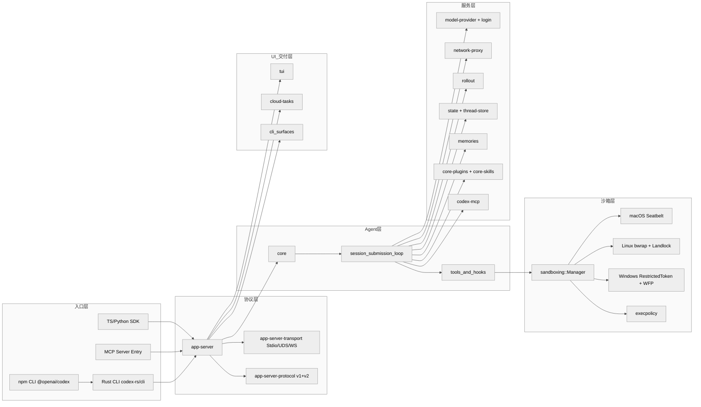
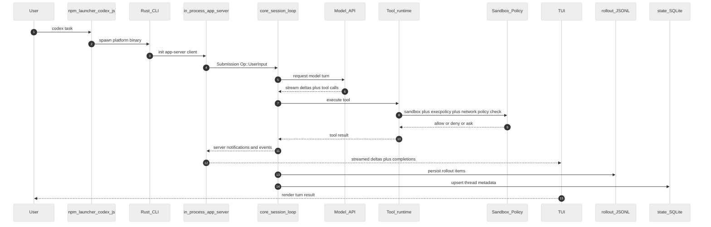
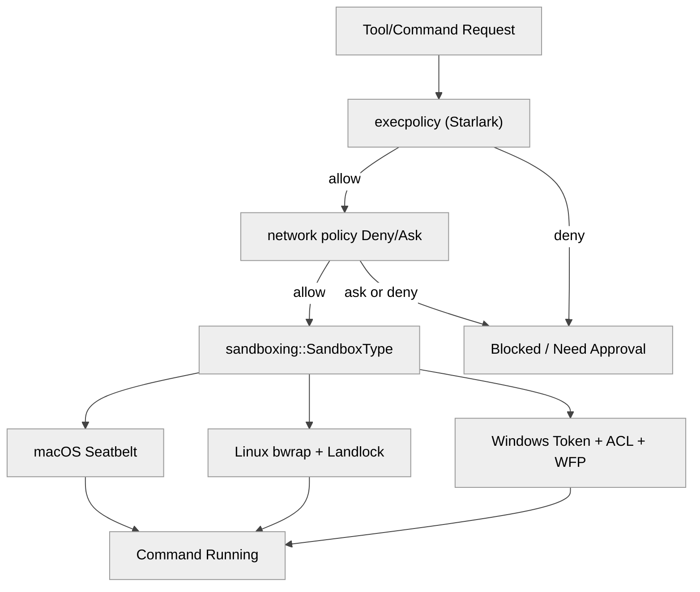
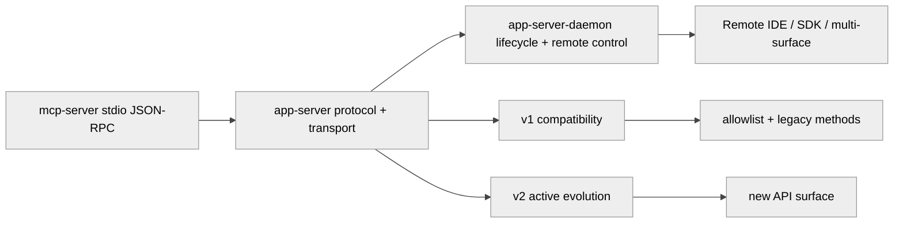
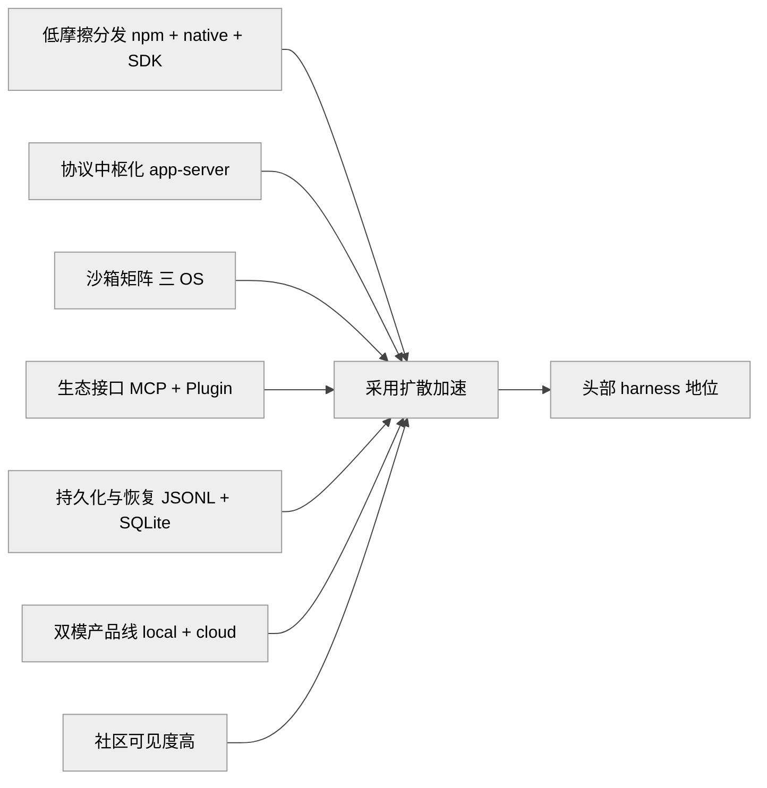

# 总纲 — OpenAI Codex 技术主线分析

> 这是《Codex 源码深度研究》的总纲。后续 25 章是按子系统展开的"局部深挖"；本文只负责"骨架 + 设计哲学 + 火爆原因 + 差异化"四件事。  
> 写作口径：先给事实，再给判断；判断均附源码路径行号或外部公开链接。源码基线路径：`/Users/hexiaonan/workspace/formless/refer/codex/`，下文出现的 `codex-rs/...`、`codex-cli/...`、`docs/...`、`sdk/...`、`AGENTS.md` 等均以该路径为根可复核。

---

## 1. 项目坐标

### 1.1 规模快照：Codex 是一个"多层产品工程"，不是单点 CLI

按 2026-05-27 复核口径，Codex 的规模可以用四个数字刻画：

- **crate 数：113**（从 `codex-rs/Cargo.toml` 的 `members = [...]` 段枚举抽取，路径 `codex-rs/Cargo.toml:L2-L116`）。
- **代码行数：约 1,168,067 行**；**tracked files：4,655**（在仓库根目录用 `git ls-files | wc -l` 与 `git ls-files | xargs wc -l` 复核所得；该口径含全部 tracked 文本/非文本文件，仅供量级参考，不代表"代码净行")。
- **GitHub Stars：约 8.5 万量级**（口径见 [openai/codex repo API](https://api.github.com/repos/openai/codex)；具体数字随时间漂移，本文不固定）。
- **GitHub contributors：>400**（口径见 [contributors API page1](https://api.github.com/repos/openai/codex/contributors?per_page=100&page=1) 并按页累加；与 Stars 一样属浮动指标）。

如果只看安装命令，Codex 像一个 CLI；如果看这四个量级，它更像"一个统一产品壳 + 多执行面 + 多协议层 + 多安全后端"的平台型工程。这并非"CLI 之大胜"，而是"在 CLI 形态下塞下一整套平台能力"。

### 1.2 三大入口：Rust 主体 / npm 包装 / TS + Python SDK

Codex 的入口不是单点，而是三类面向不同用户群体的入口。

1. **Rust 主体（主执行面）**  
   `codex-rs/cli/src/main.rs` 顶层定义 `MultitoolCli` 与 `enum Subcommand`（`codex-rs/cli/src/main.rs:L99-L196`），其中包含 `Exec / McpServer / AppServer / Cloud / Login / Sandbox / Resume / Fork / ExecServer / Plugin / Mcp / Apply / Update / Doctor / Debug / Features` 等子命令面；具体的子命令分派发生在 `match subcommand` 区段（`codex-rs/cli/src/main.rs:L850-L1453`）。这说明 CLI 不是薄封装，而是把多个执行域统一在一套 clap 路由里。

2. **npm 包装（跨平台分发面）**  
   npm 包名是 `@openai/codex`，`bin` 指向 `bin/codex.js`（`codex-cli/package.json:L2-L8`）。  
   `codex.js` 先做 OS/arch 识别得到 target triple（`codex-cli/bin/codex.js:L15-L67`），通过 `resolveNativePackage` 找到对应平台包的二进制路径（`codex-cli/bin/codex.js:L85-L114`），最终用 `spawn` 拉起 native 程序并转发信号（`codex-cli/bin/codex.js:L184-L215`）。  
   这层核心价值是"统一安装体验 + 二进制分发兼容"，不承担业务逻辑。

3. **TS / Python SDK（程序化入口）**  
   TypeScript SDK 文档明确其通信方式是 CLI 子进程 + stdin/stdout JSONL 事件流（`sdk/typescript/README.md:L5-L6`）。  
   Python SDK 明确 `app-server` JSON-RPC v2 over stdio（`sdk/python/README.md:L3-L4`），并要求 Python 3.10+（`sdk/python/pyproject.toml:L14`）。  
   这意味着 SDK 面向的是"把 Codex 接到系统里"，而不仅是"人工在终端里对话"。

从入口分层看，Codex 把"安装分发"、"本地运行"、"程序集成"拆成了不同责任域，但保持一套核心执行语义，理论上可以降低跨入口行为漂移。能否做到，要看每个 surface 是否都通过 `app-server-client` 进入同一 in-process 服务（见 §4）。

### 1.3 开源治理特殊性：可见源码 + 受控贡献

`docs/contributing.md` 明确写出两点：  
- 外部贡献是 **invitation-only**（`docs/contributing.md:L3`）；  
- 提交 PR 前必须签署 **CLA**（`docs/contributing.md:L80-L92`）。

这是一种"开放代码可读 + 贡献流程收敛"的治理模型。可能的直接后果是：

- 社区可见度高（Star、fork、issue 讨论活跃），但核心演进节奏更多由官方路线控制；
- 对外部读者，源码研究价值较高，因为主线设计在节奏上更易保持一致性；
- 对外部贡献者，参与门槛更接近"生态协作"而非"大规模社区共管"。

这不是好坏二元，而是治理目标不同：Codex 更像"产品化开放核心"，而不是"自治式社区工程"。

### 1.4 它在解决什么痛点（七维框架之"痛点"）

把痛点显式列出来，便于后续每一章对位检查：

1. **长会话不可恢复**：传统"一次 prompt 一次模型"在多步骤工程任务下容易因网络/进程/重启而丢上下文。Codex 用 `rollout::Recorder` 写 JSONL、用 `state` crate 写 SQLite（`codex-rs/rollout/src/recorder.rs:L758-L814`, `codex-rs/state/src/lib.rs:L78-L80`）把会话变成可恢复物件。
2. **安全边界不可解释**：让模型"执行命令"在企业语境里是高危行为。Codex 把权限决策分层为 `execpolicy`（Starlark 语言决策）+ `network policy`（Deny/Ask）+ `sandboxing::Manager` 后端执行（`codex-rs/execpolicy/src/policy.rs:L28-L41`, `codex-rs/network-proxy/src/network_policy.rs:L41-L46`, `codex-rs/sandboxing/src/manager.rs:L22-L28`）。
3. **入口多、行为漂移**：CLI/IDE/SDK/Cloud 各自实现极易出现"同样的指令在两个面行为不一致"。Codex 用 `app-server` + `app-server-protocol` + `app-server-transport` 三层显式协议化，并通过 `app-server-client` 把多 surface 都接到同一 in-process 服务（`codex-rs/app-server-client/src/lib.rs:L1-L16`, `L67-L80`）。
4. **能力外挂困难**：单体内建工具很难承载第三方扩展。Codex 用 `codex-mcp` 与 `core-plugins` 把"工具/服务"做成可插拔接口（`codex-rs/codex-mcp/src/connection_manager.rs:L71-L111`, `codex-rs/core-plugins/src/manager.rs:L80-L120`）。
5. **团队协作下的"散落 prompt"**：个人级 prompt 难以工程化、不可审计。Codex 通过 `AGENTS.md` 将提示词变成版本化工件（`codex-rs/core/src/agents_md.rs:L1-L40`, `docs/agents_md.md:L1-L7`）。

后面的"思路 / 实现 / 易错 / 对比 / 缺陷"五维分别对应 §2 / §3-§4 / §10、§11 / §6 / §10。

---

## 2. 设计哲学（至少 6 条，七维框架之"思路"）

这一节不展开到实现细节，而是从源码组织、协议边界、运行模型中抽出"反复出现的设计取向"。每条先列事实，再给判断。

### 2.1 本地优先、云端补位（Local-first with Cloud Extension）

**事实**：

- 官方 README 把 Codex 定位成"a coding agent from OpenAI that runs locally on your computer"，并指向 IDE/桌面/Codex Web 等多形态（`README.md:L1-L8`）。
- TUI 和 CLI 都是本地可运行面（`codex-rs/cli/src/main.rs:L850-L1453` 的 `match subcommand` 分派；`codex-rs/tui/src/lib.rs:L863-L946` 的 `run_main`）。
- 同时又有 `cloud-tasks` 作为补位能力，提供 `create/list/status/diff/apply` 等云端任务接口（`codex-rs/cloud-tasks/src/lib.rs:L157-L180`, `L492-L585`）。

**判断**：  
Codex 没有把"云端代理"当唯一答案，而是采用"本地执行主循环 + 云端承担异步/远程场景"的双轨设计。这种取向可能更利于开发者从零迁移：先本地使用，再按需上云，不必一次重构工作流。我无法证明这是 OpenAI 内部的"明确意图"，只能说源码呈现出这种结构。

### 2.2 Rust 二进制是单一可信执行入口（Single Trusted Runtime）

**事实**：

- npm 启动器最终总是落到平台 native 二进制（`codex-cli/bin/codex.js:L184-L187`）。
- Rust CLI 主程序的 `enum Subcommand` 集中声明各执行面（`codex-rs/cli/src/main.rs:L116-L196`），随后由 `match subcommand` 统一分派（`codex-rs/cli/src/main.rs:L850-L1453`）。
- `arg0` 机制允许同一二进制按 `argv[0]` 分发到不同子能力（`codex-rs/arg0/src/lib.rs:L152-L179`），减少"多可执行文件行为偏差"。

**判断**：  
这种模式有助于"单运行时语义一致性"：不论是 npm 用户、直接二进制用户还是某些包装入口，最后都尽量进入同一 Rust 执行域。在源码层面这是结构性事实；是否完全消除跨入口 bug，仍取决于各 surface 是否真的走 in-process 路径（详见 §4）。

### 2.3 协议层是产品边界，不是内部细节

**事实**：

- `app-server-transport` 显式枚举 `Stdio / UnixSocket / WebSocket / Off`（`codex-rs/app-server-transport/src/transport/mod.rs:L66-L72`）。
- `app-server` 运行入口可注入 transport options（`codex-rs/app-server/src/lib.rs:L419-L436`）。
- `app-server-protocol/src/protocol/common.rs` 用 `client_request_definitions!` 宏同时挂接 `v1::InitializeParams` 与一批 `v2::Thread*` 方法（`codex-rs/app-server-protocol/src/protocol/common.rs:L435-L470`）；v2 模块化拆分见 `codex-rs/app-server-protocol/src/protocol/v2/mod.rs:L1-L54`。
- 仓库 AGENTS 文档明确："All active API development should happen in app-server v2. Do not add new API surface area to v1"（`AGENTS.md:L184-L196`）。

**判断**：  
Codex 把协议层当"可演进的契约产品"：transport 可替换，协议版本可并存迁移，调用方面向 SDK/IDE 稳态。这接近平台工程思路，但不必上升到"必然选择"——同类项目里也存在用 MCP 单协议直接对外的做法，只是边界划法不同。

### 2.4 沙箱矩阵优先于"单一安全方案"

**事实**：

- `SandboxType` 枚举在统一入口里区分平台后端：`None / MacosSeatbelt / LinuxSeccomp / WindowsRestrictedToken`（`codex-rs/sandboxing/src/manager.rs:L22-L28`），`get_platform_sandbox` 根据编译目标返回默认值（`codex-rs/sandboxing/src/manager.rs:L48-L62`）。
- macOS 通过 `sandbox-exec` + seatbelt profile（`codex-rs/sandboxing/src/seatbelt.rs:L25-L29`）。
- Linux 组合了 `bubblewrap` 文件系统隔离与 Landlock/seccomp 限制（`codex-rs/linux-sandbox/src/bwrap.rs:L58-L73`, `codex-rs/linux-sandbox/src/landlock.rs:L57-L88`, `L119-L163`）。
- Windows 侧包含 restricted token、WFP 过滤器与 sandbox session 启动（`codex-rs/windows-sandbox-rs/src/lib.rs:L250-L290`, `codex-rs/windows-sandbox-rs/src/resolved_permissions.rs:L33-L101`）。

**判断**：  
Codex 的安全策略不是"最强单点"，而是"跨 OS 的最小可行共识 + 各平台增强"。这使得产品可以统一叙事（都有 sandbox），同时接受底层实现异构。代价见 §10。

### 2.5 Plugin / MCP 不只是扩展点，可能也是增长接口

**事实**：

- `core-plugins/manager.rs` 定义安装/读取请求与结果（`PluginInstallRequest / PluginReadOutcome / PluginDetail` 等结构体）（`codex-rs/core-plugins/src/manager.rs:L193-L230`）。
- 启动时会同步 OpenAI 插件仓，先 git，失败回退到 GitHub HTTP（`codex-rs/core-plugins/src/startup_sync.rs:L66-L116`）。
- `codex-mcp` 维护 MCP server 连接生命周期、工具发现与 elicitation 请求（`codex-rs/codex-mcp/src/connection_manager.rs:L71-L120`）。
- `mcp-server` 可直接作为独立 server 运行，stdio JSON-RPC 全链路（`codex-rs/mcp-server/src/lib.rs:L59-L203`）。

**判断**：  
这套结构可能使 Codex 的能力边界从"核心团队写代码"扩展为"外围生态提供工具"。是否真的形成"增长接口"取决于市场规模，这里只能说源码结构允许这一路径。

### 2.6 持久化是"第一等公民"，不是日志副产物

**事实**：

- `rollout::Recorder` 落 `RolloutItem`，支持 `record_canonical_items / persist / flush / load_rollout_items`（`codex-rs/rollout/src/recorder.rs:L758-L814`）。
- `state` crate 固定了 SQLite 状态库文件名（`codex-rs/state/src/lib.rs:L78-L80`）。
- `state::runtime::threads` 中有线程元数据 upsert 与 dynamic tools 持久化（`codex-rs/state/src/runtime/threads.rs:L493-L520`, `L820-L840`）。
- `core::state_db_bridge` 在会话侧初始化状态库（`codex-rs/core/src/state_db_bridge.rs:L1-L8`）。

**判断**：  
Codex 的会话设计目标更接近"可恢复、可追踪、可复盘"的执行轨迹系统，而非临时聊天。对工程团队而言，这降低了进入审计、调试、团队协作场景的门槛。

### 2.7 AGENTS.md 替代"散落 prompt"的团队协作方式

**事实**：

- `core/src/agents_md.rs` 说明 `AGENTS.md` 会从项目根到 cwd 沿路径合并，并允许通过 `project_root_markers` 配置查找根（`codex-rs/core/src/agents_md.rs:L1-L16`）。
- `docs/agents_md.md` 简要说明在 `child_agents_md` 特性开启时，Codex 会附加层级 AGENTS.md 的指导（`docs/agents_md.md:L1-L7`）。

**判断**：  
这把"提示词"从个人临时输入，转化为版本化、可审查的仓库工件。对团队研发而言，是从"人脑记忆"转向"工程约束"的一步——不一定是唯一做法，但是一种可重复的做法。

### 2.8 事件驱动主循环：把 agent 行为拆成可控操作集

**事实**：

- 协议层定义 `Submission` 与 `Op`（`Interrupt / RealtimeConversation* / UserInput / ExecApproval / ...`）（`codex-rs/protocol/src/protocol.rs:L124-L143`, `L474-L560`）。
- `submission_loop` 对这些操作做统一分发（`codex-rs/core/src/session/handlers.rs:L708-L820`）。
- `session/mod.rs` 在会话上下文里整合 model、工具、沙箱、持久化与状态（`codex-rs/core/src/session/mod.rs:L1-L150` 的 `use ...` 引入即可见端倪）。

**判断**：  
Codex 的核心不是"一个大 prompt 调一次模型"，而是"一个持续运行的、可中断/可批准/可压缩上下文的状态机"。这也是它能承载长会话与复杂工具调用的基础。

---

## 3. 整体架构图

先给骨架，再看细节。下面这张图只表达"层级与责任边界"，不展开具体实现。

这张图对应的源码锚点如下：

- 入口层：`codex-cli/package.json:L2-L8`, `codex-cli/bin/codex.js:L15-L67`, `codex-rs/cli/src/main.rs:L116-L196`, `sdk/typescript/README.md:L5-L6`, `sdk/python/README.md:L3-L4`。
- 协议层：`codex-rs/app-server/src/lib.rs:L419-L436`, `codex-rs/app-server-transport/src/transport/mod.rs:L66-L72`, `codex-rs/app-server-protocol/src/protocol/common.rs:L435-L470`。
- Agent 层：`codex-rs/core/src/lib.rs`, `codex-rs/core/src/session/handlers.rs:L708-L820`。
- 服务层：`codex-rs/rollout/src/recorder.rs:L758-L814`, `codex-rs/state/src/runtime/threads.rs:L493-L520`, `codex-rs/core-plugins/src/manager.rs:L193-L230`, `codex-rs/codex-mcp/src/connection_manager.rs:L71-L120`。
- 沙箱层：`codex-rs/sandboxing/src/manager.rs:L22-L28`, `codex-rs/sandboxing/src/seatbelt.rs:L25-L29`, `codex-rs/linux-sandbox/src/bwrap.rs:L58-L73`, `codex-rs/windows-sandbox-rs/src/lib.rs:L250-L290`, `codex-rs/execpolicy/src/parser.rs:L57-L66`。
- UI 层：`codex-rs/tui/src/lib.rs:L863-L946`, `codex-rs/cloud-tasks/src/lib.rs:L157-L180`。

---

## 4. 数据流：一次 `codex` 命令背后发生了什么（七维框架之"实现"）

这一节只回答"主路径发生了什么"，不讨论边缘分支。以最常见路径为例：用户通过 npm 安装，终端输入 `codex`，进入 TUI 会话并触发工具调用。

### 4.1 主路径分解（事实）

1. **命令入口**：shell 调到 `codex`，若来自 npm 安装，先进入 `bin/codex.js` 做平台判断（`codex-cli/bin/codex.js:L24-L67`）。
2. **native 交接**：启动器确定平台包后，通过 `resolveNativePackage` 找到 binary 并 `spawn` Rust 二进制（`codex-cli/bin/codex.js:L85-L114`, `L184-L187`）。
3. **CLI 路由**：Rust CLI 解析 `Subcommand`（`codex-rs/cli/src/main.rs:L116-L196`），并通过 `match subcommand` 进入 TUI/app-server 等分支（`codex-rs/cli/src/main.rs:L850-L1453`）。
4. **in-process app-server 启动**：`app-server-client` 作为"进程内门面"封装 `codex_app_server::in_process`，统一握手、请求分发、事件回传（`codex-rs/app-server-client/src/lib.rs:L1-L16`, `L67-L80`）。
5. **会话主循环**：`submission_loop` 接收 `Op::UserInput` 等操作，驱动模型请求、工具调用、审批与上下文管理（`codex-rs/core/src/session/handlers.rs:L708-L820`）。
6. **工具执行与沙箱**：工具侧命令最终受 sandbox + policy 约束执行（`codex-rs/sandboxing/src/manager.rs:L22-L28`, `codex-rs/execpolicy/src/policy.rs:L28-L41`）。
7. **流式事件回写**：in-process event stream 对关键通知采用"必须投递"策略，避免 TUI 文本损坏或 turn completion 丢失（`codex-rs/app-server-client/src/lib.rs:L151-L186`）。
8. **界面渲染**：TUI 订阅事件并刷新 UI（`codex-rs/tui/src/lib.rs:L863-L946`）。
9. **轨迹与状态持久化**：`rollout` 写 JSONL，`state` 写 SQLite 线程/配置元数据（`codex-rs/rollout/src/recorder.rs:L758-L814`, `codex-rs/state/src/runtime/threads.rs:L493-L520`, `codex-rs/core/src/state_db_bridge.rs:L1-L8`）。

### 4.2 这条链路的意义（判断）

Codex 的关键不仅是"单次请求成功"，更是"链路可持续"：  
命令入口一致、协议事件可回放、关键通知尽量无损、会话状态能恢复。对于长任务和多回合 agent 来说，这通常比一次 patch 是否写对更重要——但这并不意味着所有场景都需要这套链路，简单一次性 query 反而会暴露其复杂度成本。

### 4.3 易错点（七维框架之"易错"）

在阅读源码与做集成时，常见误判如下，把它们写出来便于读者自检：

1. **把 `mcp-server` 当成 `app-server` 的替代**：`mcp-server`（`codex-rs/mcp-server/src/lib.rs:L59-L203`）是 stdio 单通道 JSON-RPC 服务，而 `app-server` 是支持多 transport + v1/v2 协议演进的统一服务（`codex-rs/app-server-transport/src/transport/mod.rs:L66-L72`, `codex-rs/app-server-protocol/src/protocol/common.rs:L435-L470`）。它们承担不同角色，不可互换。
2. **以为"沙箱关掉就快了"**：在 `SandboxType::None`（`codex-rs/sandboxing/src/manager.rs:L22-L28`）下确实少一层进程隔离，但 `execpolicy` 与 `network policy` 仍在生效，命令依然要过策略层（`codex-rs/execpolicy/src/policy.rs:L28-L41`, `codex-rs/network-proxy/src/network_policy.rs:L41-L46`）。把"沙箱"误以为是全部安全开关，会造成对 deny 行为来源的误判。
3. **混淆 v1 与 v2 协议**：`JSON_V1_ALLOWLIST` 仅保留 `InitializeParams / InitializeResponse`（`codex-rs/app-server-protocol/src/export.rs:L41-L51`），新方法都进入 v2（`codex-rs/app-server-protocol/src/protocol/v2/mod.rs:L1-L54`, `AGENTS.md:L186`）。SDK 升级时若仍按 v1 形态扩展，会与上游冲突。
4. **把 rollout JSONL 当唯一真相**：`rollout::Recorder` 与 `state` SQLite 是两条持久化（`codex-rs/rollout/src/recorder.rs:L758-L814`, `codex-rs/state/src/lib.rs:L78-L80`），线程元数据、动态工具等结构化数据在 SQLite 里，JSONL 是事件序列。备份/审计时缺一条就会失真。
5. **以为 npm 包等于业务逻辑**：`codex-cli/bin/codex.js` 只做平台识别与 spawn，没有任何 agent 逻辑；问题排查应直接定位到 native 二进制（`codex-cli/bin/codex.js:L184-L215`）。
6. **AGENTS.md 路径误解**：`agents_md.rs` 是从"项目根"沿 cwd 路径向下合并，根的判定取决于 `project_root_markers`，默认是 `.git`（`codex-rs/core/src/agents_md.rs:L1-L16`）。在 monorepo 子目录里直接放 AGENTS.md 不一定生效，要先理解项目根判定规则。

这些不是"bug"，而是源码语义与直觉相左的地方；本研究后续章节里会逐项展开。

---

## 5. 关键子系统盘点（25 章映射）

这一节做"目录级导航"，避免把单章内容提前写完。映射来源为 `scripts/chapters.yaml`。

### 5.1 Part I / II / III 全量清单（每章一行）

| Part | 章节 | 定位 | 关键源码路径（示例） | 章节文档 |
|---|---|---|---|---|
| Part I | ch01 项目全景与设计哲学 | 总览入口、治理模式、哲学抽取 | `codex-rs/Cargo.toml` | [01-项目全景与设计哲学.md](01-项目全景与设计哲学.md) |
| Part I | ch02 多入口与启动分发 | npm→Rust→arg0 分发链 | `codex-cli/bin/codex.js` | [02-多入口与启动分发.md](02-多入口与启动分发.md) |
| Part I | ch03 配置系统与企业要求 | 配置树、企业约束、fail-closed | `codex-rs/core/src/config/mod.rs` | [03-配置系统与企业要求.md](03-配置系统与企业要求.md) |
| Part I | ch04 初级使用方法 | install/login/exec/TUI 基础流 | `docs/getting-started.md` | [04-初级使用方法.md](04-初级使用方法.md) |
| Part I | ch05 高级使用方法 | cloud/fork-resume/plugin/mcp | `codex-rs/cloud-tasks/src/lib.rs` | [05-高级使用方法.md](05-高级使用方法.md) |
| Part I | ch06 Agent 核心循环 | session/turn 状态机主线 | `codex-rs/core/src/session/mod.rs` | [06-Agent核心循环.md](06-Agent核心循环.md) |
| Part I | ch07 Prompt 组装与 Skill 注入 | prompt 家族 + skills 注入链 | `codex-rs/core-skills/src/injection.rs` | [07-Prompt组装与Skill注入.md](07-Prompt组装与Skill注入.md) |
| Part I | ch08 Provider 与 Responses/Realtime API | provider 抽象 + SSE/WS/Reatime | `codex-rs/model-provider/src/provider.rs` | [08-Provider与API模式.md](08-Provider与API模式.md) |
| Part II | ch09 工具系统总览 | tools 注册、schema、handler 分层 | `codex-rs/tools/src/lib.rs` | [09-工具系统总览.md](09-工具系统总览.md) |
| Part II | ch10 命令执行与 unified_exec | 执行通道、shell 解析、安全校验 | `codex-rs/core/src/unified_exec/mod.rs` | [10-命令执行与unified_exec.md](10-命令执行与unified_exec.md) |
| Part II | ch11 apply_patch 工具 | Lark 语法、流式 parser、受约束编辑 | `codex-rs/apply-patch/src/parser.rs` | [11-apply_patch工具.md](11-apply_patch工具.md) |
| Part II | ch12 macOS 与 Linux 沙箱 | Seatbelt + bwrap + landlock | `codex-rs/linux-sandbox/src/bwrap.rs` | [12-macOS与Linux沙箱.md](12-macOS与Linux沙箱.md) |
| Part II | ch13 Windows 沙箱与 WFP | token/ACL/WFP 组合权限模型 | `codex-rs/windows-sandbox-rs/src/lib.rs` | [13-Windows沙箱与WFP防火墙.md](13-Windows沙箱与WFP防火墙.md) |
| Part II | ch14 执行策略 Starlark | execpolicy 规则引擎 | `codex-rs/execpolicy/src/policy.rs` | [14-执行策略Starlark.md](14-执行策略Starlark.md) |
| Part II | ch15 网络代理与策略 | HTTP/SOCKS/MITM + network policy | `codex-rs/network-proxy/src/network_policy.rs` | [15-网络代理与策略.md](15-网络代理与策略.md) |
| Part II | ch16 Hook 与生命周期事件 | PreToolUse/PostToolUse/Compact/Stop | `codex-rs/hooks/src/schema.rs` | [16-Hook与生命周期事件.md](16-Hook与生命周期事件.md) |
| Part II | ch17 Plugin 市场系统 | 市场拉取、远程包、开关与同步 | `codex-rs/core-plugins/src/startup_sync.rs` | [17-Plugin市场系统.md](17-Plugin市场系统.md) |
| Part II | ch18 MCP 双向集成 | MCP client/server 双向桥接 | `codex-rs/codex-mcp/src/connection_manager.rs` | [18-MCP双向集成.md](18-MCP双向集成.md) |
| Part II | ch19 会话与轨迹持久化 | rollout JSONL + state SQLite | `codex-rs/rollout/src/recorder.rs` | [19-会话与轨迹持久化.md](19-会话与轨迹持久化.md) |
| Part II | ch20 记忆系统 | read/write/mcp memory 与注入路径 | `codex-rs/memories/write/src/storage.rs` | [20-记忆系统.md](20-记忆系统.md) |
| Part II | ch21 App-Server JSON-RPC 协议层 | protocol、daemon、client、transport | `codex-rs/app-server-protocol/src/protocol/common.rs` | [21-AppServer协议层.md](21-AppServer协议层.md) |
| Part III | ch22 TUI 渲染管线与 Code Mode V8 | TUI 事件渲染 + V8 runtime | `codex-rs/tui/src/lib.rs` | [22-TUI与CodeMode.md](22-TUI与CodeMode.md) |
| Part III | ch23 Cloud Tasks 与外部 Agent 迁移 | 云任务编排 + 外部会话导入 | `codex-rs/cloud-tasks/src/lib.rs` | [23-CloudTasks与外部Agent迁移.md](23-CloudTasks与外部Agent迁移.md) |
| Part III | ch24 Codex vs Claude Code / Opencode 对比 | 架构与工作流横向比较 | `codex-rs/app-server/src/lib.rs` | [24-Codex与同类对比.md](24-Codex与同类对比.md) |
| Part III | ch25 沙箱与权限模型对比 | 三 OS 沙箱与策略层横评 | `codex-rs/sandboxing/src/manager.rs` | [25-Codex沙箱与权限对比.md](25-Codex沙箱与权限对比.md) |

### 5.2 25 章结构图（导航视角）

---

## 6. 与同类对比（火爆原因分析，七维框架之"对比"）

### 6.1 横向表格：Codex / Claude Code / Opencode / Aider / Goose

> 说明：本表尽量只写"文档可证事实"；无法确认处明确写"未公开"或"未见同等级公开抽象"。同类项目的内部结构未必有公开等价物，"未见"不等于"没有"。

| 维度 | Codex | Claude Code | Opencode | Aider | Goose |
|---|---|---|---|---|---|
| 入口分发方式 | npm 包装 + native Rust 二进制 + SDK（`codex-cli/bin/codex.js:L15-L67`, `sdk/*`） | CLI + VS Code + Desktop + Web + JetBrains（[overview](https://docs.anthropic.com/en/docs/claude-code/overview)） | CLI + desktop + IDE extension（[OpenCode docs](https://open-code.ai/en/docs)） | 终端为主（[Aider docs](https://aider.chat/docs/)） | CLI + desktop（[goose docs](https://goose-docs.ai)） |
| 协议层是否独立 | 有独立 `app-server` / `app-server-protocol` / `transport` crate（`codex-rs/app-server-transport/src/transport/mod.rs:L66-L72`） | 公开文档强调多 surface 共用引擎，但未公开独立协议 crate 形态（overview） | 文档强调产品入口与 agent 配置，未见与 Codex 等价的独立协议层公开分层（OpenCode docs） | 公开文档以 CLI 交互和配置为中心（Aider docs） | 以 MCP 扩展为核心协议能力，未见单独 app-server 分层文档（goose docs） |
| 沙箱矩阵 | 三 OS 分治 + 统一类型枚举（`SandboxType` + seatbelt/bwrap/Windows） | 文档突出权限与工具编排，OS 级矩阵细节未集中公开（overview） | 文档强调 permissions/agents，OS 级隔离矩阵未主打（OpenCode docs） | 文档主打终端协作与 git 流程，未突出 OS 级矩阵（Aider docs） | Local-first + 扩展，安全边界更多由本机与扩展配置决定（goose docs） |
| 插件系统 | `core-plugins` + `startup_sync` + `codex-mcp`（`codex-rs/core-plugins/src/manager.rs:L193-L230`） | MCP + skills + hooks（overview） | agents + MCP + project `AGENTS.md`（OpenCode docs, agents docs） | 命令/配置生态强，插件市场型分发不是核心叙事（Aider docs） | extensions（MCP servers）是一等能力（goose docs） |
| 持久化方案 | rollout JSONL + state SQLite（`codex-rs/rollout/src/recorder.rs:L758-L814`, `codex-rs/state/src/runtime/threads.rs:L493-L520`） | 文档强调跨 surface 会话连续与调度（overview） | 文档有会话与分享链路说明（OpenCode docs） | 以 git 历史 + 对话流程为主（Aider docs） | Sessions + Memory 为核心概念（goose docs） |
| 商业策略 | 本地 CLI + Cloud Tasks + OpenAI API/产品协同（`codex-rs/cloud-tasks/src/lib.rs:L157-L180`；[introducing codex](https://openai.com/index/introducing-codex/)） | 订阅/账户体系驱动，多 surface 服务统一（overview） | 开源 + 多 provider + BYO key（OpenCode docs） | 开源工具 + 多模型连接（Aider docs） | 开源 + 多 provider + extension 生态（goose docs） |
| 开源治理 | 源码开放但贡献 invitation-only + CLA（`docs/contributing.md:L3`, `L80-L92`） | 文档开放、产品运营主导（overview） | 开源社区模式（OpenCode docs） | 开源社区模式（Aider docs） | 开源（页面写明 community / Apache 2.0）（goose docs） |

### 6.2 事实后的判断

1. **Codex 的一个差异点是"把协议层显式产品化"。**  
   同类大多强调入口和体验，Codex 额外强调 `app-server + protocol + transport` 的内聚边界，这更像平台 SDK 化路径。不能由此断言"别人没做"，只能说在公开文档可见层面，Codex 的分层最完整。

2. **Codex 的安全叙事偏工程化。**  
   通过三 OS 不同后端 + 统一 `SandboxType` 调度，它把安全问题从"抽象权限开关"推进到"系统调用和网络控制层"。同类项目里也有强权限模型，但 OS 级矩阵的源码可见度较低。

3. **Codex 的治理模式是优势和限制并存。**  
   主干演进一致性可能更强，但外部贡献灵活性相对低。对研究者友好，对社区共建型贡献者不一定友好。

4. **2025-2026 的"火爆"更可能是综合效应，而不是单指标领先。**  
   分发体验、协议分层、沙箱可信、插件/MCP 生态、云端任务联动一起作用，单点解释力都不够（详见 §9）。

---

## 7. 沙箱矩阵（独立小节）

### 7.1 统一调度与多后端执行

Codex 的沙箱不走"所有平台同一实现"，而是"统一调度 + 后端差异化"：

- `SandboxType` 枚举抽象层枚举各平台后端（`codex-rs/sandboxing/src/manager.rs:L22-L28`），`get_platform_sandbox` 按 OS 选默认值（`codex-rs/sandboxing/src/manager.rs:L48-L62`）。
- macOS：Seatbelt profile，依赖 `sandbox-exec`（`codex-rs/sandboxing/src/seatbelt.rs:L25-L29`）。
- Linux：`bwrap` 管文件系统边界（`codex-rs/linux-sandbox/src/bwrap.rs:L58-L73`），seccomp 管网络（`codex-rs/linux-sandbox/src/landlock.rs:L57-L88`），Landlock 作为可选 fallback（`codex-rs/linux-sandbox/src/landlock.rs:L119-L163`）。
- Windows：restricted token + WFP 网络过滤器（`codex-rs/windows-sandbox-rs/src/lib.rs:L250-L290`）。
- 执行前后还叠加 `execpolicy` 与 `network policy` 决策（`codex-rs/execpolicy/src/parser.rs:L57-L66`, `codex-rs/network-proxy/src/network_policy.rs:L41-L46`）。

### 7.2 关系图：`SandboxType` + `execpolicy` + `network-policy`

### 7.3 判断：为什么这套结构在工程上较"稳"

- 统一调度类型降低了"入口多样化"造成的安全行为漂移；
- 各平台实现可独立迭代，不需要为了一致性牺牲系统级能力；
- 策略层（exec/network）和执行层（sandbox backend）分离，便于企业场景做合规审计。

代价也很明确：测试矩阵和故障排查复杂度显著上升，尤其在 Windows 路径（这也是社区 issue 高发区域之一，见 `全网调研-社区认知地图.md` 中 Windows 相关条目）。

---

## 8. App-Server 演进：从 stdio 到 IDE 集成

### 8.1 从"单通道 server"到"多传输协议中枢"

从源码和文档信号看，Codex 的演进路径相对清晰：

1. **早期形态：`mcp-server`（stdio JSON-RPC）**  
   `run_main` 直接从 stdin 读 JSON-RPC、处理后写 stdout（`codex-rs/mcp-server/src/lib.rs:L59-L203`，其中 stdin reader 在 L126-L146、stdout writer 在 L174-L195）。

2. **中期形态：`app-server`（协议抽象 + 多传输）**  
   transport 从一条 stdio 拓展到 `Stdio/UnixSocket/WebSocket`（`codex-rs/app-server-transport/src/transport/mod.rs:L66-L72`），并通过 protocol crate 明确方法与版本边界（`codex-rs/app-server-protocol/src/protocol/common.rs:L435-L470`）。

3. **驻留形态：`app-server-daemon`（生命周期管理）**  
   支持 `Start/Restart/Stop/Version` 与 remote control（`codex-rs/app-server-daemon/src/lib.rs:L276-L292`, `L294-L357`, `L200-L231`），将一次性 CLI 会话升级为可复用后台服务。

4. **多端接入：CLI/TUI/SDK/IDE 共享中枢**  
   `app-server-client` 明确自己是 in-process facade，服务 TUI/exec 等 surface（`codex-rs/app-server-client/src/lib.rs:L1-L16`）。

### 8.2 v1 与 v2：兼容共存，但新增面向 v2

- `app-server-protocol` 仍保留 v1 allowlist（`JSON_V1_ALLOWLIST = &["InitializeParams", "InitializeResponse"]`，`codex-rs/app-server-protocol/src/export.rs:L41-L51`），说明兼容负担仍在。
- 同时 AGENTS 明确新 API 面向 v2，避免继续扩 v1（`AGENTS.md:L184-L196`，关键一句在 L186）。
- v2 模块化拆分明显更完整（`codex-rs/app-server-protocol/src/protocol/v2/mod.rs:L1-L54`，覆盖 account/apps/config/environment/thread/turn 等 28 个子模块）。

这三条合起来是典型"迁移中态"：  
**不是立刻废弃 v1，而是通过治理规则和新功能投放方向，逐步把生态重心推向 v2**。是否会最终下线 v1，源码尚未给出明确证据。

### 8.3 演进图（stdio → app-server → daemon → 远程集成）

---

## 9. 火爆原因（深度分析）

这一节回答"为什么是 Codex"，只保留 2025-2026 可证据化结论；其余措辞做了软化。

### 9.1 原因一：上手摩擦低，入口覆盖广

**事实**：npm 一键安装后即落地 native 二进制（`codex-cli/package.json:L2-L8`, `codex-cli/bin/codex.js:L15-L67`, `L184-L187`）；同时支持 Rust CLI、TS/Python SDK（`sdk/typescript/README.md:L5-L6`, `sdk/python/README.md:L3-L4`）。  
**可能影响**：开发者无需先理解架构即可启动，扩散成本低。

### 9.2 原因二：把 harness 做成"可复用协议中枢"

**事实**：`app-server` + `app-server-protocol` + `transport` 三层分离（`codex-rs/app-server/src/lib.rs:L419-L436`, `codex-rs/app-server-transport/src/transport/mod.rs:L66-L72`, `codex-rs/app-server-protocol/src/protocol/common.rs:L435-L470`）。  
**可能影响**：价值不止于终端交互，而是可被 IDE/SDK/远程形态复用。

### 9.3 原因三：安全能力从策略文本下沉到系统实现

**事实**：三 OS 后端 + 统一类型枚举（`codex-rs/sandboxing/src/manager.rs:L22-L28`, `codex-rs/sandboxing/src/seatbelt.rs:L25-L29`, `codex-rs/linux-sandbox/src/bwrap.rs:L58-L73`, `codex-rs/windows-sandbox-rs/src/lib.rs:L250-L290`）。  
**可能影响**：权限边界更可解释，企业评估门槛或许更低。

### 9.4 原因四：MCP 与 Plugin 形成网络效应（待验证）

**事实**：`codex-mcp` 管连接生命周期，`core-plugins` 管安装与同步（`codex-rs/codex-mcp/src/connection_manager.rs:L71-L120`, `codex-rs/core-plugins/src/manager.rs:L193-L230`, `codex-rs/core-plugins/src/startup_sync.rs:L66-L116`）。  
**可能影响**：能力增长不只依赖主仓迭代。是否形成"网络效应"还需观察插件生态规模，目前只是结构上允许。

### 9.5 原因五：长会话可恢复，工程可追溯

**事实**：轨迹写 JSONL，状态写 SQLite；关键事件按"必须送达"处理（`codex-rs/rollout/src/recorder.rs:L758-L814`, `codex-rs/state/src/runtime/threads.rs:L493-L520`, `codex-rs/app-server-client/src/lib.rs:L151-L186`）。  
**可能影响**：更接近"可运行系统"而非一次性聊天工具。

### 9.6 原因六：开源可见度与官方节奏并存

**事实**：仓库可见度高，同时治理是 invitation-only + CLA（`docs/contributing.md:L3`, `L80-L92`）。  
**可能影响**：社区传播强，但主线演进不易分叉拉散。

### 9.7 原因七：本地工作流与云端任务形成双模闭环

**事实**：本地 CLI/TUI 与 `cloud-tasks` 共存（`codex-rs/cli/src/main.rs:L116-L196` 中包含 `Cloud(CloudTasksCli)`；`codex-rs/cloud-tasks/src/lib.rs:L157-L180`）；官方在产品页强调本地与云端协同。  
**可能影响**：团队可按任务类型选择执行面，降低单模式失效风险。

### 9.8 因果图：火爆不是单点优势

---

## 10. 设计权衡（不藏拙，七维框架之"缺陷"）

### 10.1 哪些设计是 OpenAI 更有资本做的

1. **一手 API 协同**：workspace 内直接出现 `responses-api-proxy`、`realtime-webrtc`、`cloud-tasks`（`codex-rs/Cargo.toml:L66-L74` 区域可枚举）。
2. **多 surface 一致性投入**：CLI、TUI、SDK、daemon、remote control 一起演化（`codex-rs/cli/src/main.rs:L116-L196`, `codex-rs/app-server-daemon/src/lib.rs:L276-L357`）。
3. **协议迁移可控性**：v1/v2 并存下，新增能力被明确约束到 v2（`AGENTS.md:L186`, `codex-rs/app-server-protocol/src/export.rs:L41-L51`）。

### 10.2 哪些设计有明显代价

1. **Rust 维护成本**：113 crate 协作复杂度高，新人切入曲线陡（`codex-rs/Cargo.toml:L2-L116`）。
2. **跨平台安全测试成本**：三套后端导致测试矩阵扩大，Windows 边界问题在社区中相对密集。
3. **治理门槛成本**：invitation-only + CLA 提升主线控制，同时降低外部贡献即时性（`docs/contributing.md:L3`, `L80-L92`）。
4. **架构复杂度对小用户的负担**：一个只想"在终端 chat 一次"的用户，需要承担 app-server + transport + 协议 + 持久化的全套抽象成本，即使他根本用不到。

### 10.3 哪些方向仍在演进

1. **协议层重心迁移**：v2 持续扩展，v1 处于兼容期（`codex-rs/app-server-protocol/src/protocol/v2/mod.rs:L1-L54`, `AGENTS.md:L186`）。
2. **Code Mode 运行时成熟度**：`CodeModeService` + `v8::IsolateHandle` 在主线出现（`codex-rs/code-mode/src/service.rs:L57-L59`, `L357`）。
3. **插件链路稳定性**：市场发现与刷新一致性仍在打磨。

---

## 11. 阅读路径建议

### 11.1 初学者

- 先读：第 4 / 7 / 9 章；再回看第 1 / 2 章建立坐标。

### 11.2 工程师

- 重点：第 6 / 10 / 12-15 / 18-21 章。
- 方法：章节与源码路径并行阅读（`scripts/chapters.yaml`）。

### 11.3 平台研究者

- 重点：第 1 / 17 / 22 / 24 / 25 章。
- 方法：先读本总纲第 6 / 8 / 10 节，再进入对比与演进章节。

---

## 12. 全文 Mermaid 图清单（≥ 6 张）

本文共 **6 张** Mermaid 图，均使用 `neutral` 主题 + 白底容器：

1. 总体架构图（第 3 节）  
2. 一次命令时序图（第 4 节）  
3. 25 章映射图（第 5 节）  
4. 沙箱矩阵图（第 7 节）  
5. App-Server 演进图（第 8 节）  
6. 火爆原因因果图（第 9 节）

### 12.1 全网调研补充

除源码内部证据外，本研究在外部信号上也做了对齐：

- 官方介绍页 [openai.com/index/introducing-codex/](https://openai.com/index/introducing-codex/) 强调"local CLI + cloud agent"双产品线，与 §2.1 的 local-first 取向吻合。
- Anthropic 的 [Claude Code overview](https://docs.anthropic.com/en/docs/claude-code/overview) 强调跨 surface 共享引擎，但未公开等价的独立协议 crate；这是 §6.1 表格"未见同等级抽象"判断的依据。
- OpenCode、Aider、Goose 在公开文档中各自强调权限/Agent/extension 的不同侧重；本研究在 §6 不做主观打分，仅对位记录。
- 社区认知地图详见同目录的 `全网调研-社区认知地图.md`：其中关于 Windows 沙箱、插件市场、MCP "table stakes" 的判断为本研究 §7、§9.4 提供了佐证。
- 本节量化数字（Stars、contributors、行数）会随时间变动，复核口径与脚本见 §1.1，读者可在仓库根目录用 `git ls-files` 一键复现。

一句话结论：Codex 把"编码 agent"从模型调用问题，工程化为跨入口、跨协议、跨沙箱、可持久化、可扩展的运行系统——这是结构性事实；它是不是"最优解"则取决于读者的场景。
